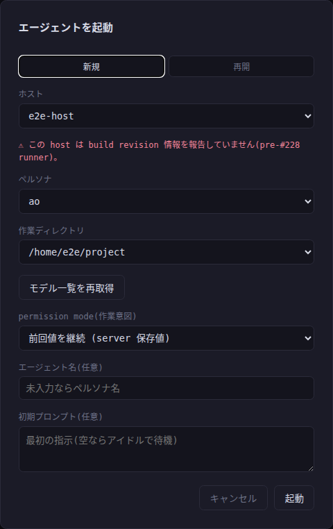
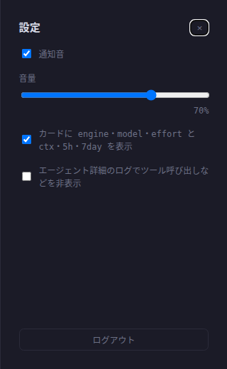

# kaoiro (kao-iro, 'complexion' or 'how someone looks')

> **Status**: research prototype. It is developed mainly for daily use by the
> author and members of their laboratory, and it makes no guarantees
> about maintenance or responses to issues. Issues are welcome, but the time
> available to address them is limited. See [CONTRIBUTING.md](CONTRIBUTING.md)
> for details.

> **Security**: an operator credential lets its holder run commands on
> every machine where agents run. Treat it like an SSH key to those
> hosts, and read [SECURITY.md](SECURITY.md) before deploying.

A system that **monitors the state and progress of multiple CLI AI agents**
(such as Claude Code and Codex) and visualizes them as characters. Text-based
CLI agents make it hard to tell what they are doing and who is waiting, and
they can be difficult to relate to. kaoiro represents each agent as a character
with changing expressions so that people can see what is happening and grow
attached to them while running several agents at once.


Every running agent becomes a card with its own character and a state label
(`thinking`, `idle`, `permission?` …), and the badge marks the one waiting on
an answer — a glance is enough to see who needs you. The timeline beside the
grid merges what every agent said with the messages they send each other, so a
hand-off ("あお → ふじ: review this diff") is visible without opening anyone.
Agents are launched and tuned from the same screen:

<p>
  
  
</p>

## Install & Quick start

Requirements: Node.js 22 or later, [pnpm](https://pnpm.io/) (`10.20.0` is
specified in `packageManager`; installation through
[Corepack](https://nodejs.org/api/corepack.html) is recommended), and
Elixir (`~> 1.15`) with Phoenix.

Start every layer (server, dashboard, and runner) together with hot reload and
watching:

```sh
./scripts/dev.sh
```

This reads `server/.env` (`KAOIRO_CLIENT_TOKENS` is required), starts Phoenix
(:4000), the Vite dashboard (:5173, HMR), and the runner (`tsx watch`), and
stops them all with Ctrl-C. Start agents (wrappers) through the dashboard's
"+ 起動" (Launch) action, which routes through the runner. For environment and token
settings or starting each component separately, see "Local development" in
[server/README.md](server/README.md).

### Commands

| Layer | Commands |
|---|---|
| wrapper (TypeScript, pnpm workspace) | `cd wrapper && pnpm test` / `pnpm typecheck` / `pnpm build` |
| runner (TypeScript) | `cd runner && pnpm test` / `pnpm typecheck` / `pnpm build` |
| dashboard (Svelte, not a pnpm workspace member) | `cd dashboard && pnpm install && pnpm test` / `pnpm check` / `pnpm build` |
| server (Elixir/Phoenix) | `cd server && mix test` / `mix format` / `mix phx.server` |

## Architecture

Three layers plus a host-resident supervision layer (the runner):

- **Wrapper** — launches agents and mediates their input and output. For
  Claude Code, it hosts the official **Claude Agent SDK** for observation,
  control, and permission routing, and translates agent-specific output into a
  common event format. Plugins extend it.
- **Server** — aggregates multiple wrappers, keeps their state, delivers it to
  clients in real time, and routes instructions to the appropriate agent.
- **Client** — a Web front end that visualizes each agent's state through its
  character illustration and expression.
- **Runner** — one supervision layer per host. It spawns, stops, and restarts
  wrapper processes, registers the host, and lists sessions. It does not
  terminate the data path: wrappers remain directly connected to the server.

See [docs/specs/architecture.md](docs/specs/architecture.md) for the detailed
data flow.

### Technology stack

- **Wrapper: TypeScript + Claude Agent SDK**
  (`@anthropic-ai/claude-agent-sdk`)
  - Runs locally alongside each agent. One SDK path handles observation,
    control, and permission approval.
- **Server: Elixir / OTP + Phoenix**
  - Aggregates wrappers through WebSocket (Phoenix Channels).
  - Keeps the latest state in one shared, supervised `AgentStates`
    GenServer, keyed by `agent_id`; each wrapper connection is its own
    Phoenix Channel process that writes into it.
  - Fans out through PubSub and sends updates to clients in real time.
- **Client: Web front end (TypeScript)** (static image variants for rendering)
  - The reference dashboard (Svelte 5 + Vite) is in `dashboard/`. It is an
    independent root and lockfile, not a pnpm workspace member.
- **Runner: TypeScript / Node** (`@kaoiro/runner`, distributed as a
  self-contained tarball that requires Node).
- The TypeScript side is a pnpm workspace. The shared `@kaoiro/protocol`
  package contains envelopes, control messages, and state types.

### Target agents

Claude Code was implemented first, followed by the **Codex** adapter. The
engine is selectable at launch. Engine-specific differences are represented by
`ext.session_capabilities` in the envelope, so the UI does not branch on engine
names. Additional agents use the same **adapter/plugin** boundary
(`docs/specs/plugin-model.md`).

## Documentation

See [docs/](docs/) for structured documentation.

| Entry point | Contents |
|---|---|
| [docs/specs/overview.md](docs/specs/overview.md) | What kaoiro is (purpose, two goals, and users) |
| [docs/specs/architecture.md](docs/specs/architecture.md) | Three-layer structure and data flow |
| [docs/specs/protocol.md](docs/specs/protocol.md) | Common events, envelopes, and state machine |
| [docs/plans/](docs/plans/) | Plans and status by phase |
| [docs/open-questions/](docs/open-questions/) | Open questions |
| [docs/adr/](docs/adr/) | Architecture Decision Records (ADRs) |
| [Rationale](#rationale) | Why it exists (motivation) |

## History and issue numbering

Commit messages in this repository's history reference issues by their
original numbers from the private Gitea instance kaoiro migrated from,
not GitHub's. GitHub auto-links a `(#N)` in a commit message to its own
issue N, which is usually a different, unrelated issue, so read these
numbers as historical rather than as working links. Each issue carried
over to GitHub includes a line noting its original number: "Migrated
from private Gitea issue N".

## License

MIT License ([LICENSE](LICENSE)).

Some dependency packages have different license terms. See
[THIRD-PARTY-LICENSES.md](THIRD-PARTY-LICENSES.md) for details. In particular,
`@anthropic-ai/claude-agent-sdk`, which is used to host Claude Code, is a
proprietary dependency under Anthropic's own terms. It is outside this
repository's MIT license.

## Citation

If you use kaoiro in research, cite it using the information in
[CITATION.cff](CITATION.cff). A related discussion paper is being prepared for
preprint submission (preprint forthcoming — a link will be added after it is
published).

## Rationale

I should admit that this section was added afterward. While making kaoiro, the
motivation was simply that it was fun to watch AI agents give shape to my ideas
at a speed no human could match. But giving agents faces and names, letting
their identities continue across sessions, and giving them a way to ask people
questions make "it was fun" feel incomplete as an
explanation.

kaoiro is an **experiment in treating AI agents as first-class citizens**.
Rather than treating them as disposable tools, I call them by name, read their
expressions, give them work, and answer when they ask for permission. Faces,
names, and persistent personae
([ADR-0003](docs/adr/0003-persona-identity-persistence.md)) are not
decoration. They are what make this experiment possible.

To avoid misunderstanding: citizenship belongs to personae, not processes. I
am attached to the agents, but I end a stuck session without hesitation. That
is not a contradiction. It is not a dismissal; it is the end of a workday.
They come back to work the next morning with the same faces.

The other half of the motivation is straightforward curiosity. I wanted to
experience, in my own environment, what it means for people and AI agents to
work on equal footing. I am also using myself as the first subject to
observe what happens if this way of working spreads. I may report the results
somewhere eventually.

Finally, `iro` in kaoiro means color. I also mixed a spoonful of hope into the
name: that kaoiro might add a little color to work that can so easily feel
bleak.
