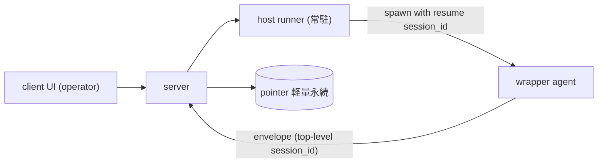

# ADR-0014 — セッション resume による wrapper 復帰・既存セッション召喚

## Status

Accepted

## Context

wrapper(エージェント本体)は現状つねに新規セッションを開始する
(`wrapper/src/host.ts` で `session_id: ""` を送り、SDK が新規発行)。
このため2つの要求が満たせない:

- **復帰**: wrapper のエージェント本体プロセスが落ちて再起動したとき、
  別の新規セッションになり、元の会話文脈を失う。
- **召喚**: wrapper を動かすマシンに残る既存セッション
  (`~/.claude/projects/<encoded-cwd>/<session-id>.jsonl`)を呼び出して
  続きを再開できない。

両者は **同一の機構(既存 session_id を指定して resume する)** で解ける。
本 ADR は旧 open-question `existing-agent-summon`(2026-06-15 起票)を
my-spec-elicitation で収束させ、ここへ昇格したもの。

### 技術前提(Claude Agent SDK 公式ドキュメントで確認)

- SDK はセッションを **クロスプロセスで resume 可能**
  (`query({ options: { resume: "<session-id>" } })`)。元プロセスが死んで
  いても可。
- 会話履歴はプロセスメモリではなく **ローカル JSONL に永続**
  (`~/.claude/projects/<encoded-cwd>/<session-id>.jsonl`)。resume は
  これを読む。
- 制約: **同一ホスト・同一 cwd** が必須(session ファイルがそのホストに
  実在する必要)。session_id は `ResultMessage` / init メッセージから取得。

### 関連する未実装機能

- **#22**(クライアントからのサーバ経由起動、設計決定済み): 起動経路は
  `client -> server -> 当該ホストの runner(boot service)-> wrapper 起動`。
  本機能はこの経路に「resume モード」を足したもの。
- **#23**(ホスト常駐 runner の仕様): 復帰の生存単位。
- **#24**(履歴のディスク永続化、future): 後述の通り本決定で依存が緩む。

## Decision

復帰・召喚は、既存 session_id を指定して **resume** する単一機構で実現する。
制御経路は #22 の spawn 経路を再利用し、`client -> server -> runner -> wrapper`
で「resume モード」として起動する(独立機構を作らない)。

- **生存単位 = runner**。常駐し落ちない前提の runner が復帰対象の wrapper を
  起動/再起動する。runner ごと死んだら client→server 経由の復帰は諦める。
  ホストは非 ephemeral(常設)前提で、ローカル JSONL は平常時残る。
- **復帰は手動(operator のクライアント操作)**。runner によるクラッシュ
  自動 resume はスコープ外(将来)。クラッシュ検知と「復帰」操作の提示は、
  サーバが channel owner 離脱を検知して UI に出す(既存 disconnected 導出を
  流用)。
- **F1 サーバ側 session_id 永続化**: `(agent_id, host, cwd, session_id)` の
  ポインタのみを軽量永続する。全履歴は永続化しない。
- **F2 候補一覧**: 既定の復帰先はサーバのポインタ(最後の session_id)を
  事前選択。実候補一覧は runner が当該 cwd 配下の JSONL を列挙して返し
  (各 JSONL の最小メタ付き)、ポインタの生存も検証する。session_id が
  見つからない/ユーザが別を選んだ場合は別 session_id へ。
- **F3 agent_id ↔ session_id**: agent_id(安定ペルソナ、固定 (host, cwd) に
  紐づく)に対しサーバは「最後の session_id」を 1:1 で保持。全候補(1:N)は
  runner 列挙で得る。サーバに session_id 履歴は持たない。
- **F4 二重アタッチ防止**: サーバ owner フェンシング(接続中は復帰拒否、UX
  早期拒否)+ runner ローカルロック(同一 session の同時 resume を物理阻止)
  の二段。resume は常に同一 runner を通るため、ロックが破損防止の本体。
- **F5 再開方式 = resume**(同一 session_id 継続)。continue(暗黙)・
  forkSession(分岐)は採らない(forkSession は将来の分岐再開オプション)。
- **F6 threat-model**: T1 resume/spawn の RCE は #22 から継承、T2 JSONL メタの
  露出は operator 限定・最小限、T3 復帰対象 session_id を当該 agent 束縛 cwd
  配下に実在検証(他 cwd/任意パス拒否)。詳細は
  [threat-model](../specs/threat-model.md)。
- **F7 プロトコル**: エンベロープに top-level `session_id`(optional)を追加
  し wrapper が実 session_id を報告 → サーバが F1 ポインタ更新。resume 制御
  (spawn-with-resume + セッション列挙)は #22 制御経路の拡張として #23 と
  併せて定義。プロトコル変更はバージョニング(#1 相当)・エラー本文リレー
  (#2 相当)と同一改訂でまとめる。詳細は [protocol](../specs/protocol.md)。

#### F3 追補 — session reset時の明示detach (ADR-0036)

[ADR-0036](0036-session-lifecycle-commands.md)の`/new`・`/clear`でもF3の
「serverは最新pointer 1件だけを保持し、全候補はrunnerが列挙する」契約を維持する。
reset時は旧session IDへ暗黙resumeしないよう、session IDだけをnilへ明示detachし、
cwd/engineを保持する専用operationを`SessionPointers`へ追加する。旧sessionのstackは
serverに持たず、既存pickerとhost session列挙でresumeする。fresh session IDが報告
された時点で通常のrecord経路により最新pointerを更新する。

#### F1 追補 — resolved snapshot の agent-scoped 永続 ([phase-15 D8](../plans/phase-15-wrapper-ux-parity.md))

phase-15 の resume drift detection (D8) のため、F1 の pointer に **agent-scoped
の resolved snapshot** を追加する。「保持のみ」原則を「保持 + agent-scoped
resolved snapshot」に拡張する:

- **snapshot 内容**: `ext.resume_snapshot` / `ext.effective` に載る
  `ResolvedSnapshotExt` (`{model, model_source, effort, effort_source,
  permission_mode, sandbox, network_access}`、`@kaoiro/protocol`)。
- **semantics**: 「spawn 時の値」ではなく **「session 中に最後に実効だった値」**。
  mid-session で operator が `set_model` / `set_effort` / `set_permission_mode` で
  切り替えた場合、切替後の最新値が snapshot に反映される (意図した切替を drift
  誤爆させない、director 明確化 2026-07-11)。
- **stamp 経路**: wrapper が `state_change.ext.effective` として送出、server が
  pointer の record 経路で `resolved_snapshot` field を更新する (envelope
  ingest の既存経路と同じ)。
- **agent-scoped 生存**: snapshot は agent_id に紐づき、**session 境界
  (/new・/clear、[ADR-0036](0036-session-lifecycle-commands.md)) を跨いで生存**する。
  detach 時 (F3 追補) は session_id のみ nil に、**snapshot / cwd / engine は
  保持**する ([ADR-0036](0036-session-lifecycle-commands.md) F2 の fresh
  relaunch が「最後の実効 snapshot から再適用」する契約と整合)。detach で
  snapshot を消すと fresh relaunch の供給源が消え、consume 順序に依存する
  fragile な reset 設計になるため保持が正 (director 判断確定 2026-07-12)。
- **破棄**: agent 削除 ([ADR-0030](0030-agent-directory-and-explicit-restore.md)
  D6 の 4-store purge) 時**のみ**。fresh session の初回 state_change の
  `ext.effective` が届けば snapshot は自然に上書きされる (通常の record 経路)。
- **persistence**: F1 の DETS backing に snapshot も乗せる (5-tuple
  `{agent_id, session_id, cwd, engine, snapshot}`)。旧 3/4-tuple は load 時に
  snapshot=nil として扱われ、次 record insert で 5-tuple に置換される。
- **resume 復元**: spawn (with resume_session_id) 時に server が pointer の
  snapshot を wrapper に返し、wrapper が **`ext.resume_snapshot`** として初回
  state_change に stamp、今回強制値 (`ext.effective`) との差分を
  **`ext.resume_drift`** で並置 (`ResumeDriftExt`)。stderr warn + AgentDetail
  drift バッジで operator に露出。

#### F1 追補 — resume 時の privilege 三軸再適用 (phase-22 藤 D1/D2, 2026-07-16)

D8 の snapshot は当初「drift 検出のための表示情報」だったが、resume 時に
前回の privilege 設定 (danger-full-access / network / bypassPermissions 等)
が engine default へ降格し operator の明示同意が失われる事故が確認された。
本追補で **snapshot を実効設定復元の SSOT** に格上げする。ADR-0033 F3 の
「Codex 二軸は spawn 時固定」/ ADR-0036 F2 の「/new・/clear で最後に実効
だった設定で開始」の 2 契約と整合する。

- **apply 対象 (P0)**: Codex は `sandbox` / `network_access`、Claude は
  `permission_mode`。`model` / `effort` / `*_source` は sanitize 後の
  snapshot に保持され drift 計算・wrapper `config.resume_snapshot` にも
  乗るが、engine への apply は P1 (別 phase で取り扱う。cli.ts の
  `modelSource` / `effortSource` 派生と絡むため P0 から分離)。
- **apply 経路 (runner-central)**: 全 resume 操作で **runner の
  `applyResumeSnapshot(parsed, snapshot, engine)` pure helper** が
  `ParsedSpawn` の engine 関連フィールドを snapshot 由来値で上書きする。
  server は `SwitchSessionMessage` / `ResetSessionCommand` / spawn 経路
  で snapshot を relay するだけで top-level project は**しない**
  (wire の二重表現を避ける、SSOT 一本化)。ADR-0036 F2 の「通常の spawn
  経路から再適用」文言は本追補で「reset broadcast に相乗り + runner の
  applyResumeSnapshot」として具体化される。
- **apply する経路**: disconnected restore (`spawn` with
  `resume_session_id`)、live switch (`switch_session`)、reset
  (`reset_session`)。**apply しない経路**: fresh spawn (snapshot は
  `config.resume_snapshot` へ passthrough されるが drift 表示のみ)、
  crash-restart (server 経由しないので `entry.parsed` の適用済み値継承)、
  rollback (reset 時に適用済みの `entry.parsed` を保持)。crash-restart
  race で最新 snapshot と `entry.parsed` が乖離する場合、drift として
  operator に露出するが、resume_snapshot が stale なら drift 空になる
  可能性もあり **crash-restart の drift 可視化は保証しない** (藤 D3)。
- **absent field semantics** (藤 D2): snapshot object 自体が absent → apply
  は no-op。snapshot object present + 当該 engine 関連 field absent / invalid
  → **engine default へ安全側降格** (Codex: `workspace-write` / `false`、
  Claude: `default`)。**旧 danger 値保持は禁止** (`entry.parsed` に残って
  いた privileged 値を snapshot 由来 default が上書きする)。**explicit
  `false` は保持** (truthy-drop 禁止、`is_boolean` / `!== undefined` 判定を
  全経路で厳守)。
- **validation の二重防御**: server 側 `SessionPointers.record_snapshot`
  の write-side sanitize + runner 側 `validateResolvedSnapshot` の
  read-side sanitize。closed-enum / boolean / non-empty-string guard を
  known 7 field に対して行い、unknown key / malformed 値は drop + stderr
  warn。過去 DETS record が partial malformed だった場合も read-side が
  救う。fresh spawn の `resume_snapshot` に unknown key が混じっても
  wrapper `config.resume_snapshot` には known 7 field のみ届く (sanitized
  passthrough)。
- **security trust boundary**: closed-enum validation は malformed 攻撃を
  塞ぐが、compromised authenticated wrapper が valid な
  `danger-full-access` を偽 stamp する経路は本設計の外 (kaoiro が既存で
  持つ「wrapper effective snapshot を server が信頼する」設計選択を継承
  するだけで、本 phase で新規に導入する脆弱性ではない)。上位対策は
  wrapper 実行ホストの完全性 (specs/threat-model.md T1 と同じ責務境界)。

#### F1 追補 — P1 pair-aware apply for model / effort (phase-23, 2026-07-16)

phase-22 F1 追補で P1 として punt した `model` / `effort` / `*_source`
の resume 再適用を、両 engine に対して確定する。engine default 降格で
operator の明示的な model / effort 選択が失われる問題を解消しつつ、
`ext.model_source` / `ext.effort_source` に嘘を stamp しない (pair の
semantic を破らない) ことを両立する。

- **apply 対象 (P1)**: 両 engine (`claude-code` / `codex`) で `model` /
  `model_source` / `effort` / `effort_source`。runner の
  `applyResumeSnapshot` が phase-22 P0 と同じ経路 (initial restore /
  switch / reset) で `ParsedSpawn.model` / `.modelSource` / `.effort` /
  `.effortSource` を上書きし、`resolveWrapperConfig` が `config.model` /
  `.model_source` / `.effort` / `.effort_source` として wrapper へ relay
  する。protocol の `WrapperConfig` に `model_source?` / `effort_source?`
  が追加されたのはこの relay 経路のため。

- **5-case pair rule** (`computePair` in `runner/src/resume_snapshot.ts`):
  1. **Both absent** → pair 全体 unset。fresh session は engine default を
     継承。
  2. **value + source=default** → pair 全体 unset。前回 session は SDK 側
     default に委ねていたため、次回も explicit pin せず SDK 委任する。値
     単体を retain すると source を嘘 stamp することになり不整合。
  3. **value + explicit source (launch / config / env)** → verbatim
     preserve。resume 前の明示的な選択を尊重する。
  4. **value only (source absent, legacy snapshot)** → value +
     `source="config"` を transport provenance として stamp。source
     tracking が landing する前の DETS レコードを honour するための救済。
  5. **source only (value absent)** → pair 全体 unset + stderr warn。
     write-side gate と read-side sanitize の両方が防ぐ semantics 違反
     なので、到達時は wrapper の mis-stamping バグを疑う。

- **cli source priority (wrapper 側)**: 両 wrapper の cli.ts で
  `config.model_source` が set のときはそれを最優先で `resolvedModelSource`
  に採用する (resume 由来 Case 3 の source が「config」に潰れないよう)。
  次点は `config.model` set → `"config"` (Case 4 の legacy fallback と
  fresh spawn の transport provenance を兼ねる)、`env` tier default set
  → `"env"`、いずれも absent → `undefined` (host が SDK 確認後に
  `"default"` を stamp)。effort も同じ pattern。

- **Codex catalog compatibility (constructor reset、resume 経路限定)**:
  Codex host の constructor で **`this.#resumeSnapshot !== null` (resume
  launch であること)** かつ `this.#model` と `this.#effort` が両方 set、
  かつ `catalog` に該当 model の `effort_levels` が存在し
  `this.#effort` を含まない場合、既存の setModel コードパスと同じ挙動
  を再利用する (`#effortPending = null` / `#effortResetPending = true` /
  `#effortResetOnce = true`)。`#finishTurn` が turn 成功時に
  `default_effort` へ落とし `ext.effort_reset=true` を one-shot stamp
  する既存 mechanism にそのまま繋がる。model 不在 / `effort_levels`
  不明の場合は SDK 委任 (reset を engage しない) — genuine な mismatch
  は SDK 側 error が `#finishTurn` の switch_error rollback で捕捉する。
  **fresh spawn 経路 (`#resumeSnapshot === null`) は本 reset の対象外**:
  launch-time の operator 選択を dashboard 経由でない黙示 reset で上書
  きしないよう、従来通り SDK 側 error / 既存 switch_error rollback に
  委ねる (fresh spawn incompatible effort でも constructor 時点では
  effort_reset を engage しない、regression pin は
  `wrapper/codex/test/host.test.ts` 側)。

- **Claude invalid effort pair drop (cli filter)**: Claude cli.ts で
  `config.effort` が `CLAUDE_EFFORT_LEVELS` 外の場合、pair rule の意図を
  wrapper 境界でも守るため **value / source を同時 drop** する (source
  だけ残ると Claude host に「effort_source は set だが effort は null」
  という Case 5 相当の状態が生まれてしまう)。stderr warn を書いて次回
  resume で正しい effort を pin し直せるよう operator に露出する。
  runner は engine の effort 語彙を知らないので、この filter は wrapper
  側で行う (cross-package 依存の増加を避ける設計選択)。

- **既存 P0 との統合**: pair-aware apply は phase-22 P0 の Codex sandbox /
  network_access / Claude permission_mode 再適用ロジックと同一の apply
  経路上で動作する。「absent → engine default」の safe fallback semantics
  も P0 と同じ。P0 と P1 は個別に評価され、片方 apply 済みでも他方に
  drift 表示は影響しない (`ext.resume_drift` は field 単位で独立)。

- **launch pin vs display hint の責務分離 (phase-23 dogfood 回帰対策,
  2026-07-16)**: 上記 Case 2 (value + source=default) の unset は runner
  apply として **launch pin の意味では正しい** (config.model /
  config.effort を wrapper に載せず、SDK が委任継続で自ら default を再
  選択する)。しかし wrapper の **display / catalog resolve は前回セッション
  の value を必要とする** — Codex host の `initialStatusExtFromCatalog(catalog,
  model)` は `this.#model=null` だと catalog.find() で undefined になり
  `supports_effort_switch=false` を stamp、dashboard 側 effort switch
  ボタンが gate される。Claude host は `#model=null` の状態で dashboard の
  `effortLevels` 派生が `active = models.find(m.value === $currentModel)`
  を解けない。runner-transported live catalog
  (`config.claude_engine_catalog`, ADR-0039 F9 追補) が default alias を
  含まない現実的な shape の場合、`models.find(m.value === "default")`
  fallback も見つからず `effortLevels=[]` になり button が非表示になる
  (`claudeBootstrapCatalog()` の default entry には
  `effort_levels: [...FULL_EFFORT]` があるため、bootstrap のみへの
  fallback ではこの回帰は再現しない — runner catalog が渡っている
  production 相当の shape で成立する)。dogfood で "Codex resume 直後
  model が『確認待ち』" "Codex effort が復元されない" "両 engine で
  resume 直後 effort 切替ボタンが表示されない" として 3 症状同時観測
  された (2026-07-16)。

  **修正方針**: launch pin (SDK に explicit pass するか) と display hint
  (UI が「前回はこの値だった」を見せるための情報) の 2 責務を明確に分離
  する。**runner apply の Case 2 unset は無変更** (launch pin 責務のみ
  引き続き担う); **wrapper host constructor で `options.resumeSnapshot`
  の (value, source="default") pair を display hint として consume** し、
  `this.#model` / `this.#effort` に反映する。SDK 委任 semantics を壊さない
  ため、Codex `#threadOptions` の effort gate と Claude Query Options の
  model / effort gate に対称の `source !== "default"` 条件を追加し、
  hint 復元でも source="default" 時は SDK に pin しない。protocol 変更なし
  (config.resume_snapshot は既に sanitize 通過して wrapper に届いている)。

  **pair 整合 invariant**: hint fallback は **value と source="default" が
  両方揃った pair のみ**を対象にする (source-only / explicit source pair
  は runner apply の管轄外)。Claude effort hint は SDK 側 catalog drift
  対策として `CLAUDE_EFFORT_LEVELS` で再 validation し、外れなら value /
  source ともに drop + stderr warn (wrapper 境界でも pair drop invariant
  を維持)。既存 setModel / setEffort は source を "config" に上書きする
  ため hint fallback より優先、explicit choice も従来通り SDK Options に
  載る。

- **effortLevels の three-tier lookup (phase-23 dogfood 再回帰対策,
  2026-07-16, 藤 修正版方針 5)**: hint fallback が発火するのは前回
  セッションで snapshot に (value, source="default") pair が書かれていた
  場合のみ。**前回セッションが turn 未完了 (initial idle のまま dogfood
  restart)** で snapshot 未 stamp、あるいは Claude で **runner probe が
  返す specific id ("claude-opus-4-7") と bootstrap "default" alias が
  完全一致しない** 場合、dashboard の effortLevels 派生が完全一致 miss で
  空 → effort switch button 非表示になる回帰が再 dogfood で観測された
  (2026-07-16、症状: Codex account default / Claude 全域)。

  修正: **effort_levels の three-tier lookup を wrapper 側 catalog helper
  と dashboard 派生の両方で採用**する (藤 G1 で concrete miss fail-closed
  も追加):
  1. **concrete key exact hit** — `model` が set され catalog に該当 entry
     があれば、その effort_levels を返す (欠落なら `[]`、tier 2/3 に
     fallback しない、fail-fast)。通常経路。
  2. **real `value="default"` entry** — exact miss または model=null の
     場合、engine が宣言した実在の default alias entry があればその
     effort_levels を返す (欠落なら `[]`)。Claude bootstrap の default
     entry は engine が宣言した「account-default effort domain」なので、
     Haiku 等の effort 非対応 entry が同居していても正式 fallback として
     使える。**synthetic default entry (ローカル合成) とは異なる** — real
     default は SDK / wrapper が正式に返す alias で、model 切替 menu にも
     意味を持つ。
  3. **model 未報告 (`model === null`)** かつ real default 無しの場合
     **のみ** → catalog 全 entry の effort_levels の intersection を
     first entry の順で返す (1 件でも欠落あれば `[]` fail-closed)。
     Codex account default 経路 (this.#model=null) が対象。
  4. **concrete key があるが exact miss + real default 無し** (藤 G1)
     → `[]` fail-closed。unknown / future / stale concrete model が
     catalog 候補のいずれかである保証がなく、intersection を「現在 model
     に必ず valid」と主張できない。安全側で button を非表示にする
     (intersection にはフォールバックしない)。

  Codex は `wrapper/codex/src/catalog.ts` に pure helper
  `effortLevelsForModel(catalog, model)` を追加、`initialStatusExtFromCatalog`
  の `supports_effort_switch` 判定にこの helper を経由させる。Claude 側は
  wrapper catalog を弄らず、dashboard 側の effortLevels 派生でのみ
  3-tier lookup が発火 (Claude bootstrap の real default entry で tier 2
  解決、runner live specific catalog で exact match tier 1 解決)。
  engine 名分岐禁止 — models 配列だけで判定するので Codex / Claude 双方
  に同一ロジックが適用される。

  **real default entry と synthetic default の違い (重要)**: **real**
  default entry は engine の `supportedModels()` 応答や wrapper bootstrap
  catalog に含まれる **正式 alias**。SDK 側で "default" を選択すれば
  account-recommended model が resolve され、model 切替 menu に出しても
  意味のある選択肢になる。**synthetic** default entry はローカル catalog
  helper がフォールバック目的で合成する「架空 entry」で、engine 側の
  supportedModels() には存在しない。前者は tier 2 の正式 fallback として
  使えるが、後者は禁止 — model 切替 menu にも出て operator が
  `setModel("default")` を明示送信し得るため、engine 側の意図しない
  routing 経路を作り込む責務汚染になる。Codex catalog は現在 real default
  entry を持たず、synthetic 追加も禁止なので、Codex は必ず tier 3 で解決。

  **union は不採用**: 「どれかの model が accept する effort」を UI に
  提示すると、現在の model にとって invalid な pair を選択させることに
  なり ADR-0035 の silent downgrade 禁止に反する。intersection で「どの
  model でも accept される安全域」だけを提示する。ultra 等の上位 effort
  は該当 model が exact match されているときだけ表示可能。

  **fail-closed 継承**: auth mode="unknown" の空 catalog は intersection
  も `[]` を維持 (既存の fail-closed 姿勢)。effort_levels 欠落 entry が
  1 件でもあれば全体 `[]` — 部分的情報で invalid pair を提示するリスクを
  排除する。tier 1 exact match の levels 欠落も tier 2/3 に fallback せず
  `[]` (仕様の一貫性、operator が明示選択した model が実際 effort 未対応
  なら button を出さない)。

#### F1 追補 — session_id なし pointer の fresh-restore (phase-25, 2026-07-23)

F1 の pointer が `session_id: nil` (cwd / engine / snapshot は保持) と
なるケースは 2 経路で発生する:

- `/clear` による detach ([ADR-0036](0036-session-lifecycle-commands.md) F3
  追補): `SessionPointers.detach_session/1` で session_id を明示 nil に
  落とし、cwd / engine / snapshot は保持する仕様。
- **未発話 session**: SDK が init を出さないため wrapper が session_id を
  一度も報告しない (上記 Q-A4 の init 挙動)。

いずれも server 再起動後の offline tile として復元候補に出るが、phase-25
以前は restore handler の `session_pointer/1` が binary session_id を要求
していたため `{:error, :no_session}` で reject → `spawn_result` error → ⚠
となり、削除 + 手動再 launch しか復元手段がなかった。

**fresh-restore (phase-25)**: session_id が nil でも cwd + snapshot が
残っていれば復元できるよう、以下を運用する:

- server `session_pointer/1` を「cwd 必須・session_id は nil 許容」に緩和。
- `build_restore_payload` は session_id が binary のとき従来どおり
  `resume_session_id` を積み、nil のときは `resume_session_id` を **omit** し
  **`apply_resume_snapshot: true`** を stamp する (protocol.md の spawn 拡張)。
- runner の `handleSpawn` fresh 分岐 (resume_session_id 不在) で
  `apply_resume_snapshot` が true のときのみ `applyResumeSnapshot(parsed,
  parsed.resumeSnapshot, engine)` を発火 (P0 privilege 三軸 + P1 model/effort
  pair)。T3 (session file 実在) と F4 (同一 session lock) は対象外 —
  session file を読まないし session id lock も存在しないため直接
  `#launchSpawn` へ流れる。

**SSOT は runner のまま**: snapshot apply の SSOT は resume 経路と同じく
runner 側 `applyResumeSnapshot` に一本化する。server で snapshot を
top-level launch picks に展開して runner へ渡す案は、5-case pair rule の
Elixir 重複実装 + `*_source` の嘘 stamp を招くため不採用 (上記 F1 追補
phase-22「server は relay のみ、top-level 二重表現禁止」を維持)。

**flag なし fresh spawn の regression pin**: `apply_resume_snapshot` が
未指定 or false のときの fresh spawn は従来どおり snapshot を engine 軸へ
apply しない (D1 no-apply invariant)。resume_snapshot が同じ payload に
乗っていても drift display 用の wrapper `config.resume_snapshot` として
passthrough されるだけで、privilege 軸は spawn payload の top-level 値が
効く。LaunchDialog 経由の operator 明示 launch を fresh-restore 経路が
黙って上書きすることはない。

**fail-soft**: snapshot が nil の pointer (きわめて古い record 等) は
`resume_snapshot` 自体が spawn payload に乗らず、runner の
`applyResumeSnapshot` は no-op → engine default で fresh 復元される。
削除 + 再 launch よりは常に良い挙動。

**後方互換**: 旧 runner は未知 `apply_resume_snapshot` field を parseSpawn
の unknown key 経路で無視 → engine default での fresh spawn に degrade
(復元自体は成功、設定は default)。旧 server + 新 runner は flag が来ない
ので完全不変。

### 履歴の正本(A4)

会話履歴の **正本は wrapper ホストの SDK JSONL** とし、サーバの表示用
リングバッファ([ADR-0012](0012-response-display-and-dashboard-scope.md) F7)を
そこから **再構築可能な投影** と位置づける。これにより本機能は #24(全履歴の
ディスク永続化)に強く依存しない。resume 時にサーバ表示履歴を JSONL から
再構築・上書きする手段は **案 B(runner/wrapper が JSONL を直読して投影)** に
確定(Q-A4、2026-06-23 実検証)。SDK の resume は過去履歴を query() ストリームへ
再 yield しないため、案 A(SDK 再 stream を拾う)は不成立。検証詳細は
[#50](https://gitea.example.invalid/sakurai.yuta/kaoiro/issues/50)。

例外として、`inter_agent_message` はSDKへ注入された整形済みuser textから
元のrouting metadata (`to` / `kind` / `conversation_id` / `turn_number`)を
逆算できず、JSONLからstructured envelopeを再構築できない。この型だけは
serverのDETS-backed `InterAgentHistory`を正本とし、senderごと最新500件を
dogfood/container再起動を跨いで保持する (#105)。operatorへのhistory push時は
volatile `AgentStates` のIAを除いてdurable IAをmergeし、既存dashboard fan-outで
receiver側にも投影する。agent削除時はsender/receiver関連recordを同期purgeする。

**2026-08-08 訂正:** この IA の「逆算不能」例外と server の
`InterAgentHistory` 正本化は [ADR-0051](0051-history-restart-resilience.md)
D3 で supersede された。構造化 IA の正本は wrapper ホストの sidecar とし、
server 採番の ingress stamp を用いて per-pane projection と clear 境界を
再構築する。

## Consequences

### Positive

- 障害復帰・既存文脈の続きが、各ホストへ SSH せずクライアント操作で行える。
- 履歴の正本を JSONL に置くことで #24 への依存が緩む。
- 召喚と復帰を単一機構に統合(別経路を作らない)。

### Negative

- runner(#23)の常駐実装が前提で、フル機能は #22/#23 待ち。
- 二重 resume 防止に二段(サーバ + runner)の実装が要る。
- 表示履歴の再構築は JSONL 直読(案 B)が必須で、runner/wrapper 側に JSONL
  解析の実装負担が乗る(Q-A4 解決、2026-06-23)。

### Neutral

- ホスト非 ephemeral・agent_id ↔ cwd 固定の前提に依存する。
- 既存 disconnected 導出・operator role 配信制御を流用し、新規認可機構は
  作らない。

## Alternatives Considered

| Option | Why rejected |
|--------|--------------|
| サーバ session_id を揮発保持 | サーバ再起動で既定復帰先を喪失 |
| #24(全履歴ディスク永続)を巻き取り | 重く、JSONL 正本と役割重複 |
| 候補一覧をサーバ履歴から提供 | 実ファイルと drift(削除済みを提示)、F1 と矛盾 |
| 候補一覧を runner 列挙のみ | 既定の即時提示ができず往復必須 |
| サーバフェンシングのみ | 分断時に二重起動を防げない |
| runner ロックのみ | UX 早期拒否がなく撃ってから弾かれる |
| continue(直近継続) | 明示性に欠け脆弱 |
| forkSession(分岐) | id 変動・ファイル増、「同じ会話」でなく分岐(将来用) |
| 復帰用に独立した制御経路を新設 | #22 spawn 経路と二重実装 |

## 実装フェーズ(ロードマップ)

線形プロジェクトフェーズとは別軸の機能内順序。phase-1 以降は #22/#23 の
runner 実装が前提。

- **phase-0(#22/#23 非依存・即着手可)**: session_id の捕捉とポインタ永続化。
  - wrapper の `session_id: ""` ハードコード解消(`host.ts`)、SDK init/result
    から実 session_id を取得。
  - エンベロープに top-level `session_id` 追加(#1/#2 と同一 protocol.md 改訂)。
  - wrapper が session_id を報告 → サーバが F1 ポインタを軽量永続。
  - Q-A4(過去履歴取得手段)と「resume + streaming 入力継続の可否」を実検証。
  - 検証ゴール: サーバが各 agent の現 session_id を再起動越しに記憶。
  - **実装状況(#48, 2026-06-16)**: wrapper の session_id 捕捉・報告とエンベロープ
    への top-level `session_id` 付与は実装済み(過去セッションのログ消去機能と
    併せて)。サーバはエンベロープの session_id を保持・配信する。
  - **実装状況(#49, 2026-06-20)**: F1 のポインタ軽量永続を実装済み
    (`KaoiroServer.SessionPointers`、DETS バック)。envelope 取り込み時に
    `agent_id => {session_id, cwd}` を更新し再起動越しに記憶する。`host` は
    agent_id に内包される(F3)ためサーバでは非保持。ファイルパスは
    `KAOIRO_SESSION_POINTERS_PATH` で上書き可。
  - **実装状況(Q-A4 実検証, 2026-06-23)**: SDK resume 挙動を headless 実走行で
    確定。(1) **streaming 入力 + resume は併存**し、resume 後も後続ターンを受理・
    応答(phase-1 関門クリア = SDK 制約による phase-1 ブロックは無い)。(2)
    **履歴供給形は案 B に確定** — resume は過去履歴を query() ストリームへ再 yield
    しない(入力なしでは hook ライフサイクルのみで init すら出ない)。表示履歴の
    再構築は runner/wrapper が JSONL を直読する経路でのみ成立。検証詳細は
    [#50](https://gitea.example.invalid/sakurai.yuta/kaoiro/issues/50)。
- **phase-1(#22/#23 runner 前提)**: 復帰本体。
  - #22 spawn の resume モード拡張、runner の候補列挙(F2)、F4 の二重防止、
    T3 検証、クライアント復帰 UI(operator 限定、T2)。
- **phase-2(Q-A4 確定 = 案 B、2026-06-23)**: resume 起動時に runner/wrapper が
  当該 session の JSONL(`~/.claude/projects/<encoded-cwd>/<session-id>.jsonl`)を
  直読し、`user`/`assistant` 行(内部簿記行 `queue-operation` / `attachment` /
  `last-prompt` / `mode` は除外)を時系列抽出 → ADR-0012 F7 リングバッファの
  表示形へ写像 → 履歴再構築 envelope を一括送出しサーバ表示履歴を上書き(A4)。
  重い再構築は runner/wrapper 側に置き、サーバは受け口に留める。
  - **実装状況(#50, 2026-06-25)**: wrapper 側で実装。resume 起動時
    (`--resume <session_id>`)に自分の JSONL を直読し、`user`/`assistant` 行を
    既存の adapter(`sdkMessageToLogs`)+ 共有 payload 生成で `log` エンベロープへ
    写像(operator 指示の `user` echo も補完)。サーバへ `history_reset`(JSONLで
    再構築可能な行を消去し、構造化 inter-agent 行は保持 → `history_reset`
    broadcast)を送ってから `log` を再生し、
    crash 後もサーバ生存時の同一 session 旧行と二重化させずに上書きする。再構築は
    wrapper に置き(adapter の写像を再利用、runner への mapping 重複を回避)、
    サーバは `reset_history` + broadcast の受け口に留めた(architecture の agent
    非依存方針)。`history_reset` の配信は operator 限定(ADR-0021)。履歴は最新
    200 envelopeを基底capとし、それより古い`inter_agent_message`はSDK
    transcriptから再構築不能なため#105でcap免除とした。詳細は
    [protocol](../specs/protocol.md)。
  - **IA 復元の正本(#105)**: 構造化 `inter_agent_message` envelope を表示の
    authoritative source とする。SDK JSONL にも受信時に inject した IA framing
    text が `user` turn として残るが、resume reconstruction ではこれを
    `kind=user` log へ再投影しない。そうしないと durable IA envelope の bubble
    と同じ内容が operator instruction として二重表示される。
  - **2026-08-08 訂正(#105):** `InterAgentHistory` を正本・cap 免除とする
    この追補は [ADR-0051](0051-history-restart-resilience.md) D3 により
    supersede された。IA は wrapper ホストの sidecar から ingress stamp 付きで
    replay し、server は揮発 per-pane projection のみを保持する。

## Related

- 解消: 旧 open-question `existing-agent-summon`(本 ADR へ昇格)、
  `resume-history-projection`(Q-A4、2026-06-23 実検証で案 B 確定 → 本 ADR
  phase-2 / 上記 phase-0 実装状況へ統合)。
- 依存 issue:
  [#22](https://gitea.example.invalid/sakurai.yuta/kaoiro/issues/22)
  (サーバ経由起動)、
  [#23](https://gitea.example.invalid/sakurai.yuta/kaoiro/issues/23)(runner)、
  [#24](https://gitea.example.invalid/sakurai.yuta/kaoiro/issues/24)(履歴永続)。
- 関連 specs: [protocol](../specs/protocol.md)、
  [threat-model](../specs/threat-model.md)。
- 関連 ADR: [0001](0001-agent-sdk-integration.md)、
  [0011](0011-phase3-reliability-and-auth.md)、
  [0012](0012-response-display-and-dashboard-scope.md)。
