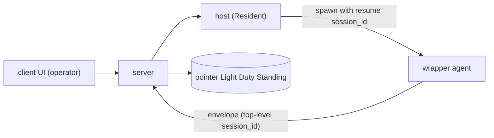

# ADR-0014 — wrapper recovery and pre-existing session summoning by session resume

## Status

Accepted

## Context

wrapper starts a new session
(`wrapper/src/host.ts` sends `session_id: ""` and new SDK is issued).
For this reason, two requests cannot be met:

- **Back**: When the agent body process of wrapper drops and restarts,
Become another new session and lose the original conversation context.
- **Summon**: Existing sessions that remain on the machine to move the wrapper
(`~/.claude/projects/<encoded-cwd>/<session-id>.jsonl`)
I can't resume.

Both**Same mechanism (refer to existing session id and resume)**Contact Us
This ADR is an old open-question `existing-agent-summon` (issued 2026-06-15)
my-spec-elicitation

### Claude Agent SDK

- SDK**Cross-process resume**
(`query({ options: { resume: "<session-id>" } })`) Ex-process die
Contact Us
- Conversation history is not process memory**Persistent on Local JSONL**
(`~/.claude/projects/<encoded-cwd>/<session-id>.jsonl`) resume
Read this.
- Constraints:**Same host and same cwd**must (session file to the host
Required). session id is retrieved from `ResultMessage` / init message.

### Relevant unmounted features

- **#22**(starting via the command line from the client, design-defined): The startup route is
  `client -> server -> The host runner(boot service)-> wrapper Start`.
This function adds "resume mode" to this route.
- **#23**(host resident Host specification): return survival unit.
- **#24**(history disk persistence, future): This decision will loosen dependencies as described below.

## Decision

To return or summon the existing session id**resume**A single mechanism is realized.
The control route reuses the #22 spawn route and `client -> server -> runner -> wrapper`
and start as "resume mode".

- **Survival Unit =  **Home wrappers that are not resident will return the wrapper
Start/Restart. If the   is dead, return via client→  will give up.
Hosts are non-ephemeral, and local JSONL remains plain.
- **Manual return (operator client operation)**Home   crash
Auto resume is out of scope. Show crash detection and return operations
server detects channel owner withdrawal and exits to UI (existing disconnected derive)

- **F1 server session id Persistent**: `(agent_id, host, cwd, session_id)`
Light weight persists only pointers. All history does not persist.
- **F2 List of candidates**: Default return pointer (last session id)
Pre- . The list of candidates will be returned by   with the JSONL under the cwd
(with the minimum meta of each JSONL), alsoJapanese terms pointer survival. session id
If you can't find / user choose another session id.
- **F3 agent_id ↔ session_id**: agent id (host, cwd)
retains "last session id" in 1:1. All candidates(1:N)
get in the enumeration. The server does not have a session id history.
- **F4 Double attach-proof**: server owner fen  (reverted during connection, UX)
Early rejection) + Japanese term Local lock (simultaneous resume of the same session is physical blocked)
resume always passes the same  , preventing the lock from being damaged.
- **F5 Resume approach = resume**(same session id continued). continue
forkSession (Options) is not collected (forkSession is the option to resume future processes).
- **F6 threat-model**: T1 resume/spawn RCE inherited from #22 and T2 JSONL meta
Exposure is limited to operator, minimum, T3 return target session id, the agent binding cwd
Validation under distribution (other cwd/pass denied optional). More
  [threat-model](../specs/threat-model.md)。
- **F7 Protocol**: Add top-level `session_id`(optional) to envel 
wrapper reports real session id → server adds F1 pointer. Contact Us
#22 #23
Definitions Protocol change is versioning (equivalent to #1), error body relay
(equivalent to #2) and the same revision. [protocol](../specs/protocol.md)

#### F3 supplementation — explicit detach at session reset (ADR-0036)

[ADR-0036](0036-session-lifecycle-commands.md)`/new``/clear`
"。 retains only one latest pointer, and all candidates will be enumerated by 。."
When reset, do not implicitly resume to the old session ID, detach only the session ID toilil,
Add dedicated operation to `SessionPointers` to hold cwd/oper. old session stack
Resume with the existing picker and host session enumeration, not in the server. fresh session ID
update the latest pointer by normal record route at the time of being.

#### F1 supplement — resolved snapshot agent-scoped persistence ([phase-15 D8](../plans/phase-15-wrapper-ux-parity.md))

phase-15 dr resumeift detection (D  for F1 pointer **agent-scoped
Add resolved snapshot**. "Retention Only" Principles + Agent-scoped
resolved snapshot

- **Snapshot**: `ext.resume_snapshot` / `ext.effective`
  `ResolvedSnapshotExt` (`{model, model_source, effort, effort_source,
  permission_mode, sandbox, network_access}`、`@kaoiro/protocol`)。
- **semantics**: Not “spawn time”**"The last value in session"**。
`set_model` / `set_effort` / `set_permission_mode`
When switched, it is reflected in the latest snap snapshot after  (the intended switch is drift
erroneous, director clarification 2026。-11).
- **stamp route**: wrapper is sent as `state_change.ext.effective` and  is
update `resolved_snapshot` field in pointer record path (envel 
same as the existing route of ingest.
- **agent-scoped survival**: snapshot is linked to agent id and the **session boundary
(/new/clear, [ADR-0036] (0036-session-lifecycle-commands.md))))**
When detach (F3 supplement) is session id only nil, and **snapshot / cwd / engine is
[ADR-0036](0036-session-lifecycle-commands.md) F2 fresh
"Re-applying from the last effective snapshot" detach
When snapshot is removed, the source of fresh relaunch disappears and depends on the consume order
Retention is correct because it becomes  resetile reset design (director judgment 2026-12-12).
- **Disposal**[ADR-0030](0030-agent-directory-and-explicit-restore.md)
D6 4-store purge) at****Home The first state change of the fresh session
When `ext.effective` is delivered, snapshot is overwritten naturally (normal record path).
- **persistence**: F1 DETS backing with snapshot (5-tuple)
`{agent_id, session_id, cwd, engine, snapshot}`. load 3/4-tuple is loaded
This is treated as snapshot=nil and replaced by 5-tuple with the next record insert.
- **resume**: spawn (with resume session id)
return snapshot to wrapper and wrapper**`ext.resume_snapshot`**First time
stamp to state change, the difference between force value (`ext.effective`)
  **`ext.resume_drift`**`ResumeDriftExt` stderr warn
Exposure to the operator with the drift badge.

#### F1 Supplementary — Three-axis reapplication at resume (phase-22 Fuji D1/D2, 2026-16-16)

D8 snapshot was initially "display information for drift detection" at resume
Previous privilege setting (danger-full-access / network / bypassPermissions, etc.)
Fixed an accident in which the operator express consent was lost due to the demotion to engine default.
Home**Restore snapshot with SSOT**to raise. ADR-0033 F3
"Codex biaxial fixed when spawn" / ADR-0036 F2 "/new/clear" last effective
Consolidate with the two contracts of "Start with the set".

- **Apply (P0)**: Codex `sandbox` / `network_access`, Claude
`permission_mode` `model` / `effort` / `*_source` after sanitize
wrapper `config.resume_snapshot`
but apply to phase is handled by P1 (another phase). cli.ts
`modelSource` / `effortSource` separation from P0 to intertwin with derivatives).
- **-central**: All resume operations
`applyResumeSnapshot(parsed, snapshot, engine)` pure helper**
Overwrite the `ParsedSpawn` engineJapanese termーJapanese term field with snapshot-derived values.
server is `SwitchSessionMessage` / `ResetSessionCommand` / spawn path
top-level project with snapshot**not**
(to avoid double-expression of wire, SSOT single). ADR-0036 F2 "normal spawn"
"Re-apply from the route" in this supplement, "Cooperate with reset broadcast +  "
applyResumeSnapshot
- **Apply**: disconnected restore (`spawn` with
  `resume_session_id`)、live switch (`switch_session`)、reset
  (`reset_session`)。**Apply Not Route**: Fresh Spawn (snapshot)
`config.resume_snapshot` passthrough but only drift display),
crash-restart (not via  ),
rollback (retains `entry.parsed` applied when reset). Crash-restart
If race deviates the latest snapshot and `entry.parsed`,
if resume snapshot islele
Possible**Crash-restart does not guarantee drift visualization**(Fuji D3).
- **absent field semantics**(Home D2): snapshot object itself is absent → apply
no-op. snapshot object present
  → **engine default** (Codex: `workspace-write` / `false`、
  Claude: `default`)。**Existing danger No value retention**`entry.parsed`
overwrite the privileged value from snapshot). **licit
`false` does not hold ** (COthy-drop, `is_boolean` / `!== undefined`)
All routes
- **validation double protection**: Server side `SessionPointers.record_snapshot`
of write-side sanitize +   side `validateResolvedSnapshot`
read-side sanitize. closed-enum / non-empty-string guard
not known key/malformed value
warn. read-side is also available if the past DETS record was partial malformed
Save fresh spawn `resume_snapshot`
wrapper `config.resume_snapshot` only sanitized
  passthrough)。
- **security trust boundary**: closed-enum validation malformed attack
authenticated wrapper
`danger-full-access` is a path to false stamps.
wrapper effective snapshot is trusted by server.
not a new vulnerability in this phase). Top Counter s
wrapper execution host integrity (same asHomes/threat-model.md T1).

#### P1 pair-aware apply for model / effort (phase-23, 2026-16-16)

phase-22 F1 `model` / `effort` / `*_source`
Reapply resume to both engines. engine default
eliminate the problem that the operator's explicit model / effortProblems is lost,
`ext.model_source` / `ext.effort_source` does not stamp a lie (pair)
semantic)

- **Apply (P1)**: `model` /
`model_source` / `effort` / `effort_source`  
`applyResumeSnapshot` is the same path as phase-22 P0 (initial restore /
`ParsedSpawn.model` / `.modelSource` / `.effort` /
`.effortSource`, `resolveWrapperConfig`
`.model_source` / `.effort` / `.effort_source`
`model_source?` / `effort_source?`
This Relay route has been added.

- **5-case pair rule** (`computePair` in `runner/src/resume_snapshot.ts`):
  1. **Both absent**→ pair whole unset. engine default
Contact Us
  2. **value + source=default**→ pair whole unset. The previous session is the SDK
Delegate the SDK without explicit pin. 
Retaining a non-consolidated means to lie the source stamp.
  3. **value + explicit source (launch / config / env)** → verbatim
。 resume Respect the explicit selection before.
  4. **value only (source absent, legacy snapshot)** → value +
stamp `source="config"` as transport provenance. Source
Re es to honour DETS records before trackingJapanese termーHome.
  5. **source only (value absent)**→ pair whole unset + stderr warn.
semantics violations preventing both write-side gate and read-side sanitize
So, when you reach the wrapper, you will doubt the mis-stamping bug.

- **cli source priority**: Both wrapper cli.ts
`resolvedModelSource` is the first priority when `config.model_source` is set.
adopt (to prevent the source from resume-derived Case 3 from configing to config).
`config.model` set → `"config"` (Case 4 legacy fallback)
fresh spawn, tier default set
→ `"env"`, both absent → `undefined` (after host confirms the SDK)
`"default"`. The same pattern.

- **Codex catalog compatibility (constructor reset, resume route only)**:
Codex host's constructor
set both `this.#model` and `this.#effort`
`effort_levels` of `catalog`
If `this.#effort` is not included, the same behavior as the existing setModel code path
reuse (`#effortPending = null` / `#effortResetPending = true` /
`#effortResetOnce = true`. `#finishTurn` on turn success
`default_effort` drop `ext.effort_reset=true` to one-shot stamp
to the existing mechanism. `effort_levels`
SDK delegation (reset not engaged) — genuine mismatch
`#finishTurn`
  **The fresh spawn route (`#resumeSnapshot === null`) is not eligible for this reset**:
The launch-time operator dashboard is not silent reset via dashboard.
SDK error / Existing switch error rollback
fresh spawn incompatible effort
effort reset does not engage, re  pin is
`wrapper/codex/test/host.test.ts`

- **Claude invalid effort pair drop (cli filter)**Claude cli.ts
If `config.effort` is not `CLAUDE_EFFORT_LEVELS`,
To protect the wrapper boundary**drop/source**(source)
"effort source is set but effort is null"
Case 5 write stderr warn next time
resumeose the operator to redo the correct effort with resume.
engine doesn't know engine effort vocabulary.
do on the side (design selection to avoid cross-package dependencies).

- **integration with existing P0**: pair-aware apply for phase-22 P0
network access / Claude permission mode
Works on the route. "absent → engine default" safe fallback semantics
P0 P0 and P1 are evaluated individually, even if applied one way
drift display does not affect (`ext.resume_drift` is independent in field).

- "launch pin vs display hint"
2026 -16)**:   Case 2 (value + source=default) unset
Apply as**In the mean of launch pin** (config.model /
config.effort does not appear in the wrapper, and S  will continue to revoke its default
Select). However, wrapper's **display / catalog resolve is the last session
'value' is required.`initialStatusExtFromCatalog(catalog,
  model)`Home`this.#model=null`catalog.find()
`supports_effort_switch=false` to stamp, Dashboard to switch
The button is gated. Claude host is dashboard in `#model=null` state
`effortLevels` `active = models.find(m.value === $currentModel)`
Don't solve it.  -transported live catalog
default alias
`models.find(m.value === "default")`
fallback is not found `effortLevels=[]` and button is non-display
`claudeBootstrapCatalog()`
`effort_levels: [...FULL_EFFORT]` for boots  only
fallback does not reproduce this re  —   catalog has passed
production). Dogfood in "Codex resume  
"Codex effort is not restored"
resume   effort Switch button is not displayed as " 3 symptoms simultaneous observation
was (2026 -16).

  **ification Policy**: launch pin (or explicit pass toDK) and display hint
(information that the UI shows this value last time)
**apply Case 2 unset is unset**(launch pin)
`options.resumeSnapshot`
Home (value, source="default") pair
`this.#model` / `this.#effort` Don't break the SDK delegation semantics
Codex `#threadOptions`
`source !== "default"`
If source="default" is used for hint recovery, the SDK does not pin. protocol No change
(config.resume snapshot has already passed sanitize and arrived in wrapper).

  **pair matching invariant**: hint fallback is
Only pairs are available.
is   apply. Claude Help hint
re validation with `CLAUDE_EFFORT_LEVELS` as a counter , and value /
drop + stderr warn
). Existing setModel / setEffort overwrites source to "config"
For hint fallback Priority,liclicit choice is
Contact Us

- **effortLevels of three-tier lookup (phase-23 dogfood),
2026-16-16, Fuji revised version policy 5)**: hint fallback is fired last time
a snapshot (value, source="default") pair
if only. **Previous session is not completed (initial idle remains dogfood
  restart)**in snapshot unstamp or in Claude**probe
boots boot "default" alias
Don’t match** if Dashboard’s effortLevels derivative is completely matched with miss
empty → effort switch button non-display reserved with dogfood
Codex account default

Fix: wrapper helper for three-tier lookup of **effort levels
and dashboard adopt** in both derivatives
Added:
  1. **concrete key exact hit**`model`
tier 2/3
fallback not fail-fast). Normal route.
  2. **real `value="default"` entry**null
If you have a real default alias entry entryd by entry
return effort levels (if missing `[]`). Claude boots 
entry is "account-default effort domain" engined by engine,
Haiku, etc. as a formal fallback even if non-compliant entry is present
Contact Us**default entry** — real
default is the alias that the SDK / wrapper is officiallyHome, and the model switch menu is
have meaning.
  3. **model Unreported (`model === null`)**and without real default
     ****→ catalog All entry efforts levels intersection
`[]` fail-closed if one is missing.
Codex account default path (this.#model=null)
  4. **There is a concrete key, but there is exactly miss + real default.**(Home G1)
`[]` fail-closed. unknownle concrete model
catalog There is no guarantee that it is one of the candidates, "intersection"
not valid. Make button non-display on safety side
(not fallback).

Codex is a pure helper
`effortLevelsForModel(catalog, model)`, `initialStatusExtFromCatalog`
`supports_effort_switch` Determination via this helper. Claude
wrapper catalog is not tampered with Dashboard's effortLevels derivative
3-tier lookup fires (Claude boots 's real default entry in tier 2
liveed live specific catalog with exact match tier 1 solution).
engine name engine — codex / Claude because only models array
the same logic is applied.

  **default entry**: **real**
wrapper boots engine
catalog**Official alias**Home Select "default" on the SDK
If the account-recommended model is resolved and the model switch menu is
Make meaningful choices.**synthetic**default entry
Helper's hollow entry for fallback purposes.
not supportedModels(). The former as the official fallback of tier 2
Can be used, but the latter is prohibited — the operator goes out to the model switch menu
`setModel("default")` can be explicitly sent, not intended by the 
routing Becomes a responsibilities  to create a route. Codex catalog
Codex is always resolved with tier 3.

  **union is unadopt**: "Efforts for which model accepts" to UI
to select an invalid pair for the current model
ADR-0035, silent downgrade, contrary to . intersection
Only the safety zone that is accepted by the model. Top-level efforts such as ultra
can be displayed only when the model is exact match.

  **fail-closed inheritance**: auth mode="unknown"
also maintain `[]` (existing fail-closed posture). effort levels missing entry
`[]` — risk to present invalid pairs with partial information
tier 1 exact match of levels missing tier 2/3 on fallback
`[]` (Consistency of specification, model specified by operator is actually not supported
button.

#### F1 supplement — without session id pointer fresh-restore (phase-25, 2026 -23)

`session_id: nil` (cwd / engine / snapshot)
2 paths:

- detach by `/clear` ([ADR-0036] (0036-session-lifecycle-commands.md) F3
Compensation): `SessionPointers.detach_session/1` explicit session id to nil
cwd / engine / snapshot
- **Unexpected session**: The wrapper does not show init, so the
Don’t report it once (init behavior of Q-A4 above).

Both of them appear as offline tile after server restart, but phase-25
restore handler `session_pointer/1` requests binary session id
`{:error, :no_session}`
and there was no way to restore only delete + manual re launch.

**fresh-restore (phase-25)**: session id, cwd + snapshot
In order to restore the following:

- mitigate server `session_pointer/1` to "cwd required session id is nil tolerance".
- `build_restore_payload` is used when session id is binary
`resume_session_id` and `resume_session_id` whenilil**omit**Home
  **`apply_resume_snapshot: true`**stamp (protocol.md spawn extension).
- CO `handleSpawn` fresh   (resume session id missing)
  `apply_resume_snapshot`only when true`applyResumeSnapshot(parsed,
  parsed.resumeSnapshot, engine)`P1 model/effort
pair). T3 (session file existence) and F4 (same session lock) are not applicable —
do not read the session file and there is no session id lock.
`#launchSpawn`

**SSOT remains  **: snapshot apply SSOT is the same as the resume route
Japanese term `applyResumeSnapshot` snapshot on server
top-level launch picks.
stxir Duplicate implementation + `*_source` lying stamps are not allowed (F1 supplement above)
phase-22 " relay is only relay, it maintains top-level double expression prohibition".

**flag no fresh spawn re  pin**: `apply_resume_snapshot`
When not specified or false, fresh spawn will snapshot as usual to the engine axis
Apply not (D1 no-apply invariant). resume snapshot
wrapper `config.resume_snapshot` for drift display
The privilege axis is the top-level Japanese term of spawn payload
Contact Us The operator express launch via Launch  has a fresh-restore route
Never overwrite silently.

**fail-soft**: snapshot is nil pointer.
`resume_snapshot` itself does not get to spawn payload,
`applyResumeSnapshot` is restored by no-op → engine default.
Better behavior than delete + re launch.

**Backward compatibility**: Old   parseSpawn unknown `apply_resume_snapshot` field
ignored in the unknown key path → degrade to fresh spawn in engine default
(Success, default) The old server + new   does not come flag
so completely unchanged.

### History (A4)

conversation history**wrapper host SDK JSONL**for display
Ring buffer ([ADR-0012](0012-response-display-and-dashboard-scope.md) F7)
From there**Rebuildable **Contact Us #24
not dependent on disk persistence. resumedisplayhistory from JSONL
How to rebuild and overwrite**Draft B (wrapper/wrapper has not read JSONL directly)**Home
(Q-A4, 2026-06-23). SDK resume to query()
A (s  re-stream) is not established because it does not yield. Verification details
[#50](https://github.com/sakuraiyuta/kaoiro/issues/50)。

As an exception, `inter_agent_message` is injected to S  from the preformed user text
`to` / `kind` / `conversation_id` / `turn_number`
I can't reverse the structured envel  from JSONL. Only this type
The server's DETS-backed `InterAgentHistory` is the same as the server's DETS-backed `InterAgentHistory`.
Keep the dogfood/container restart overlap (#102). When pushing a history to the operator
volatile `AgentStates` IA merge durable IA with existing dashboard fan-out
also affects the receiver side. When deleting agent, purge the sender/cordeiver-related record.

**2026 08 Correction:**This IA "inverted" exception and server
[ADR 1](0051-history-restart-resilience.md)
D3 was supersede. IA's main structure is the sidecar of the wrapper host,
ingpane stamp of server number to per-pane projection and clear border
Rebuild.

## Consequences

### Positive

- You can use client operation without SSH to each host.
- Re  #24 dependencies by adding the history book to JSONL.
- integration to a single mechanism for summoning and returning.

### Negative

- The full function waits for #22/#23 assuming the resident implementation of Japanese term(#23).
- Two-stage ( resume +  ) implementation is required for double resume prevention.
- Reconstruction of displayhistory requires JSONL direct reading (draft B) and JSONL on wrapper/wrapper
(Q-A4 solution, 2026-06-23)

### Neutral

- Host non-ephemeral/agent id ↔ cwd depends on the premise of fixing.
- Existing disconnected derive/operator role
Don't make it.

## Alternatives Considered

| Option | Why rejected |
|--------|--------------|
|server session id|Loss of default return destination in server restart|
|#24|Heavy, JSONL Full and Role Duplicate|
|List of candidates fromstoryhistory|Real files and drift (show deleted), conflict with F1|
|List of candidates   enumeration only|It is not possible to show the default immediately and it is necessary to return|
|server fenJapanese term only|Prevent double startup when disconnected|
|Lock Only|UX Shooting without early refusal|
|continue|Vulnerable to explicitness|
|forkSession|idFilectuation, file extension, and not in the same conversation (for future use)|
|New independent control path for restoration|#22 spawn route and double implementation|

## Mounting phase (road map)

The internal order of the function of another axis from the linear project phase. #22/#23
The   implementation is assumed.

- **phase-0(#22/#23 non-dependent and ready)**: session id capture and pointer persistence.
- wrapper `session_id: ""``host.ts`, SDK init/re t
get real session id.
- Add top-level `session_id` to the envel  (revised protocol.md equivalent to #1/#2).
- wrapper reports session id → server keeps F1 pointers lightweight.
- Validation of Q-A4 and resume + streaming
- Verification goal: server remembers the current session id of each agent over the restart.
  - **(#48, 2026-06-16)**: wrapper session id capture report and envel 
top-level `session_id` grants are implemented (log erasing function and
server holds and distributes the envel  session id.
  - **(#49, 2026-06-20)**: F1 pointer lightweight persistence implemented
(`KaoiroServer.SessionPointers`, DETS back). envel  when importing
Update `agent_id => {session_id, cwd}` and remember it over restart. `host`
It is non-retained in   because it is wrapped in agent id (F3). File path
`KAOIRO_SESSION_POINTERS_PATH`
  - **Contact status (Q-A4, 2026-06-23)**: SDK resume
Close (1)**streaming input + resume**After resume
Response (phase-1 Clear = No phase-1 block due to SDKAbout Us). (2) (2)
    **historyThe supply form is determined to B**— resume returns past history to query() stream
not init without input. displayhistory
Reconstruction is only established in a route where wrapper/wrapper reads JSONL directly. Verification details
    [#50](https://github.com/sakuraiyuta/kaoiro/issues/50)。
- **phase-1**: Return body.
- #22 spawn resume mode extension, spa candidate enumeration (F2), F4 double prevention,
T3 validation, client return UI (operator only, T2).
- **phase-2(Q-A4 final = draft B, 2026-06-23)**:  /wrapper
JSONL(`~/.claude/projects/<encoded-cwd>/<session-id>.jsonl`)
`user`/`assistant`
`last-prompt` / `mode` is excluded) time series extraction → ADR-0012 F7 ring buffer
Copy to display type → Overwrite displayhistory (A4) to send envel  to rebuild history.
Heavy reconstruction is placed on the wrapper/wrapper side and the wrapper is fastened to the receiver.
  - **Status(#50, 2026-06-25)**: wrapper. resume On startup
`user`/`assistant`
`log` Envel 
`user` echo of operator instruction is also complemented. `history_reset` to server
Erase rebuildable lines and keep inter-agent lines structured → `history_reset`
`log`
Identification of the same session during the survival of the fish even after crashing Overwrite with the old line. Reconstruction
wrapper (reuse the image of the adapter and map to mapping),
`reset_history` + broadcast
non-dependent policy. `history_reset` is available only for operator (ADR-0021). history
200 based cap envelHome, and older `inter_agent_message` is SHome
transcript is not reconstructed. More
    [protocol](../specs/protocol.md)。
  - **IA Restore (#102)**: display structured `inter_agent_message` envel 
authoritative source IA aming injected when the SDK JSONL receives
text remains as `user` turn, but this is
`kind=user` Don't rede  log. durable IA envel  bubble
The same content is double-displayed as operator instruction.
  - **2026 08 Correction (#102):**`InterAgentHistory` is a positive or cap exemption
[ADR0051](0051-history-restart-resilience.md)
supersede IA with ing  stamp from wrapper host sidecar
replay and pane only retains volatile per-pane projection.

## Related

- Solution: Old open-question `existing-agent-summon` (promoted to ADR),
`resume-history-projection`(Q-A4, 2026-06-23 B Verification → This ADR
phase-2 / phase phase-0 (integration).
- dependencies:
  [#22](https://github.com/sakuraiyuta/kaoiro/issues/22)
(start via )),
  [#23](https://github.com/sakuraiyuta/kaoiro/issues/23)(runner)、
[#24](https://github.com/sakuraiyuta/kaoiro/issues/24)
-spec:s: [protocol.md],
  [threat-model](../specs/threat-model.md)。
-agent ADR: [0001] (0001-agent-sdk-integration.md),
  [0011](0011-phase3-reliability-and-auth.md)、
  [0012](0012-response-display-and-dashboard-scope.md)。
