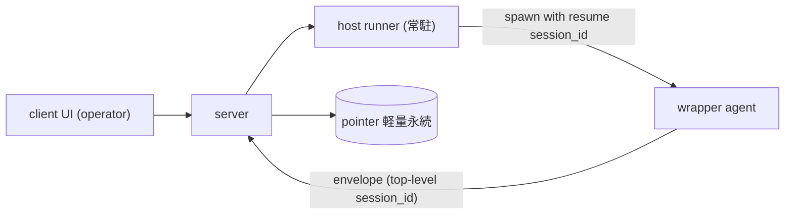

# ADR-0014 — セッション resume による wrapper 復帰・既存セッション召喚

## Status

Accepted

## Context

wrapper(エージェント本体)は現状つねに新規セッションを開始する
(`wrapper/src/host.ts` で `session_id: ""` を送り、SDK が新規発行)。
このため2つの要求が満たせない:

- **復帰**: wrapper のエージェント本体プロセスが落ちて再起動したとき、
  別の新規セッションになり、元の会話文脈を失う。
- **召喚**: wrapper を動かすマシンに残る既存セッション
  (`~/.claude/projects/<encoded-cwd>/<session-id>.jsonl`)を呼び出して
  続きを再開できない。

両者は **同一の機構(既存 session_id を指定して resume する)** で解ける。
本 ADR は旧 open-question `existing-agent-summon`(2026-06-15 起票)を
my-spec-elicitation で収束させ、ここへ昇格したもの。

### 技術前提(Claude Agent SDK 公式ドキュメントで確認)

- SDK はセッションを **クロスプロセスで resume 可能**
  (`query({ options: { resume: "<session-id>" } })`)。元プロセスが死んで
  いても可。
- 会話履歴はプロセスメモリではなく **ローカル JSONL に永続**
  (`~/.claude/projects/<encoded-cwd>/<session-id>.jsonl`)。resume は
  これを読む。
- 制約: **同一ホスト・同一 cwd** が必須(session ファイルがそのホストに
  実在する必要)。session_id は `ResultMessage` / init メッセージから取得。

### 関連する未実装機能

- **#22**(クライアントからのサーバ経由起動、設計決定済み): 起動経路は
  `client -> server -> 当該ホストの runner(boot service)-> wrapper 起動`。
  本機能はこの経路に「resume モード」を足したもの。
- **#23**(ホスト常駐 runner の仕様): 復帰の生存単位。
- **#24**(履歴のディスク永続化、future): 後述の通り本決定で依存が緩む。

## Decision

復帰・召喚は、既存 session_id を指定して **resume** する単一機構で実現する。
制御経路は #22 の spawn 経路を再利用し、`client -> server -> runner -> wrapper`
で「resume モード」として起動する(独立機構を作らない)。

- **生存単位 = runner**。常駐し落ちない前提の runner が復帰対象の wrapper を
  起動/再起動する。runner ごと死んだら client→server 経由の復帰は諦める。
  ホストは非 ephemeral(常設)前提で、ローカル JSONL は平常時残る。
- **復帰は手動(operator のクライアント操作)**。runner によるクラッシュ
  自動 resume はスコープ外(将来)。クラッシュ検知と「復帰」操作の提示は、
  サーバが channel owner 離脱を検知して UI に出す(既存 disconnected 導出を
  流用)。
- **F1 サーバ側 session_id 永続化**: `(agent_id, host, cwd, session_id)` の
  ポインタのみを軽量永続する。全履歴は永続化しない。
- **F2 候補一覧**: 既定の復帰先はサーバのポインタ(最後の session_id)を
  事前選択。実候補一覧は runner が当該 cwd 配下の JSONL を列挙して返し
  (各 JSONL の最小メタ付き)、ポインタの生存も検証する。session_id が
  見つからない/ユーザが別を選んだ場合は別 session_id へ。
- **F3 agent_id ↔ session_id**: agent_id(安定ペルソナ、固定 (host, cwd) に
  紐づく)に対しサーバは「最後の session_id」を 1:1 で保持。全候補(1:N)は
  runner 列挙で得る。サーバに session_id 履歴は持たない。
- **F4 二重アタッチ防止**: サーバ owner フェンシング(接続中は復帰拒否、UX
  早期拒否)+ runner ローカルロック(同一 session の同時 resume を物理阻止)
  の二段。resume は常に同一 runner を通るため、ロックが破損防止の本体。
- **F5 再開方式 = resume**(同一 session_id 継続)。continue(暗黙)・
  forkSession(分岐)は採らない(forkSession は将来の分岐再開オプション)。
- **F6 threat-model**: T1 resume/spawn の RCE は #22 から継承、T2 JSONL メタの
  露出は operator 限定・最小限、T3 復帰対象 session_id を当該 agent 束縛 cwd
  配下に実在検証(他 cwd/任意パス拒否)。詳細は
  [threat-model](../specs/threat-model.md)。
- **F7 プロトコル**: エンベロープに top-level `session_id`(optional)を追加
  し wrapper が実 session_id を報告 → サーバが F1 ポインタ更新。resume 制御
  (spawn-with-resume + セッション列挙)は #22 制御経路の拡張として #23 と
  併せて定義。プロトコル変更はバージョニング(#1 相当)・エラー本文リレー
  (#2 相当)と同一改訂でまとめる。詳細は [protocol](../specs/protocol.md)。

### 履歴の正本(A4)

会話履歴の **正本は wrapper ホストの SDK JSONL** とし、サーバの表示用
リングバッファ([ADR-0012](0012-response-display-and-dashboard-scope.md) F7)を
そこから **再構築可能な投影** と位置づける。これにより本機能は #24(全履歴の
ディスク永続化)に強く依存しない。resume 時にサーバ表示履歴を JSONL から
再構築・上書きする手段は **案 B(runner/wrapper が JSONL を直読して投影)** に
確定(Q-A4、2026-06-23 実検証)。SDK の resume は過去履歴を query() ストリームへ
再 yield しないため、案 A(SDK 再 stream を拾う)は不成立。検証詳細は
[#50](https://gitea.example.invalid/sakurai.yuta/kaoiro/issues/50)。

## Consequences

### Positive

- 障害復帰・既存文脈の続きが、各ホストへ SSH せずクライアント操作で行える。
- 履歴の正本を JSONL に置くことで #24 への依存が緩む。
- 召喚と復帰を単一機構に統合(別経路を作らない)。

### Negative

- runner(#23)の常駐実装が前提で、フル機能は #22/#23 待ち。
- 二重 resume 防止に二段(サーバ + runner)の実装が要る。
- 表示履歴の再構築は JSONL 直読(案 B)が必須で、runner/wrapper 側に JSONL
  解析の実装負担が乗る(Q-A4 解決、2026-06-23)。

### Neutral

- ホスト非 ephemeral・agent_id ↔ cwd 固定の前提に依存する。
- 既存 disconnected 導出・operator role 配信制御を流用し、新規認可機構は
  作らない。

## Alternatives Considered

| Option | Why rejected |
|--------|--------------|
| サーバ session_id を揮発保持 | サーバ再起動で既定復帰先を喪失 |
| #24(全履歴ディスク永続)を巻き取り | 重く、JSONL 正本と役割重複 |
| 候補一覧をサーバ履歴から提供 | 実ファイルと drift(削除済みを提示)、F1 と矛盾 |
| 候補一覧を runner 列挙のみ | 既定の即時提示ができず往復必須 |
| サーバフェンシングのみ | 分断時に二重起動を防げない |
| runner ロックのみ | UX 早期拒否がなく撃ってから弾かれる |
| continue(直近継続) | 明示性に欠け脆弱 |
| forkSession(分岐) | id 変動・ファイル増、「同じ会話」でなく分岐(将来用) |
| 復帰用に独立した制御経路を新設 | #22 spawn 経路と二重実装 |

## 実装フェーズ(ロードマップ)

線形プロジェクトフェーズとは別軸の機能内順序。phase-1 以降は #22/#23 の
runner 実装が前提。

- **phase-0(#22/#23 非依存・即着手可)**: session_id の捕捉とポインタ永続化。
  - wrapper の `session_id: ""` ハードコード解消(`host.ts`)、SDK init/result
    から実 session_id を取得。
  - エンベロープに top-level `session_id` 追加(#1/#2 と同一 protocol.md 改訂)。
  - wrapper が session_id を報告 → サーバが F1 ポインタを軽量永続。
  - Q-A4(過去履歴取得手段)と「resume + streaming 入力継続の可否」を実検証。
  - 検証ゴール: サーバが各 agent の現 session_id を再起動越しに記憶。
  - **実装状況(#48, 2026-06-16)**: wrapper の session_id 捕捉・報告とエンベロープ
    への top-level `session_id` 付与は実装済み(過去セッションのログ消去機能と
    併せて)。サーバはエンベロープの session_id を保持・配信する。
  - **実装状況(#49, 2026-06-20)**: F1 のポインタ軽量永続を実装済み
    (`KaoiroServer.SessionPointers`、DETS バック)。envelope 取り込み時に
    `agent_id => {session_id, cwd}` を更新し再起動越しに記憶する。`host` は
    agent_id に内包される(F3)ためサーバでは非保持。ファイルパスは
    `KAOIRO_SESSION_POINTERS_PATH` で上書き可。
  - **実装状況(Q-A4 実検証, 2026-06-23)**: SDK resume 挙動を headless 実走行で
    確定。(1) **streaming 入力 + resume は併存**し、resume 後も後続ターンを受理・
    応答(phase-1 関門クリア = SDK 制約による phase-1 ブロックは無い)。(2)
    **履歴供給形は案 B に確定** — resume は過去履歴を query() ストリームへ再 yield
    しない(入力なしでは hook ライフサイクルのみで init すら出ない)。表示履歴の
    再構築は runner/wrapper が JSONL を直読する経路でのみ成立。検証詳細は
    [#50](https://gitea.example.invalid/sakurai.yuta/kaoiro/issues/50)。
- **phase-1(#22/#23 runner 前提)**: 復帰本体。
  - #22 spawn の resume モード拡張、runner の候補列挙(F2)、F4 の二重防止、
    T3 検証、クライアント復帰 UI(operator 限定、T2)。
- **phase-2(Q-A4 確定 = 案 B、2026-06-23)**: resume 起動時に runner/wrapper が
  当該 session の JSONL(`~/.claude/projects/<encoded-cwd>/<session-id>.jsonl`)を
  直読し、`user`/`assistant` 行(内部簿記行 `queue-operation` / `attachment` /
  `last-prompt` / `mode` は除外)を時系列抽出 → ADR-0012 F7 リングバッファの
  表示形へ写像 → 履歴再構築 envelope を一括送出しサーバ表示履歴を上書き(A4)。
  重い再構築は runner/wrapper 側に置き、サーバは受け口に留める。
  - **実装状況(#50, 2026-06-25)**: wrapper 側で実装。resume 起動時
    (`--resume <session_id>`)に自分の JSONL を直読し、`user`/`assistant` 行を
    既存の adapter(`sdkMessageToLogs`)+ 共有 payload 生成で `log` エンベロープへ
    写像(operator 指示の `user` echo も補完)。サーバへ `history_reset`(リング
    バッファ全消去 → `history_reset` broadcast)を送ってから `log` を再生し、
    crash 後もサーバ生存時の同一 session 旧行と二重化させずに上書きする。再構築は
    wrapper に置き(adapter の写像を再利用、runner への mapping 重複を回避)、
    サーバは `reset_history` + broadcast の受け口に留めた(architecture の agent
    非依存方針)。`history_reset` の配信は operator 限定(ADR-0021)。最新 200 行に
    上限(リングバッファ同値)。詳細は [protocol](../specs/protocol.md)。

## Related

- 解消: 旧 open-question `existing-agent-summon`(本 ADR へ昇格)、
  `resume-history-projection`(Q-A4、2026-06-23 実検証で案 B 確定 → 本 ADR
  phase-2 / 上記 phase-0 実装状況へ統合)。
- 依存 issue:
  [#22](https://gitea.example.invalid/sakurai.yuta/kaoiro/issues/22)
  (サーバ経由起動)、
  [#23](https://gitea.example.invalid/sakurai.yuta/kaoiro/issues/23)(runner)、
  [#24](https://gitea.example.invalid/sakurai.yuta/kaoiro/issues/24)(履歴永続)。
- 関連 specs: [protocol](../specs/protocol.md)、
  [threat-model](../specs/threat-model.md)。
- 関連 ADR: [0001](0001-agent-sdk-integration.md)、
  [0011](0011-phase3-reliability-and-auth.md)、
  [0012](0012-response-display-and-dashboard-scope.md)。
