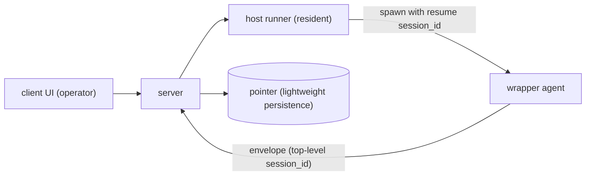

# ADR-0014 — Wrapper Recovery and Existing-Session Summoning through Session Resume

## Status

Accepted

## Context

The wrapper (the agent process itself) currently always starts a new session
(`wrapper/src/host.ts` sends `session_id: ""`, and the SDK issues a new one).
As a result, it cannot satisfy two requirements:

- **Recovery**: When the wrapper's agent process crashes and restarts, it becomes
  a different new session and loses the original conversation context.
- **Summoning**: It cannot invoke an existing session left on the machine running
  the wrapper (`~/.claude/projects/<encoded-cwd>/<session-id>.jsonl`) and resume
  where it left off.

Both can be solved by **the same mechanism: resume with an existing
session_id**. This ADR promotes the former open question
`existing-agent-summon` (filed 2026-06-15), after it was settled through
my-spec-elicitation.

### Technical prerequisites (confirmed in the official Claude Agent SDK documentation)

- The SDK can **resume sessions across processes**
  (`query({ options: { resume: "<session-id>" } })`), even when the original
  process has died.
- Conversation history is persisted in **local JSONL**, rather than process
  memory (`~/.claude/projects/<encoded-cwd>/<session-id>.jsonl`). Resume reads
  this file.
- Constraint: **the same host and same cwd** are required (the session file must
  exist on that host). session_id is obtained from `ResultMessage` /
  init messages.

### Related unimplemented features

- **#22** (server-mediated launch from the client, design settled): the launch
  path is `client -> server -> 当該ホストの runner(boot service)-> wrapper 起動`.
  This feature adds a "resume mode" to that path.
- **#23** (specification for the host-resident runner): the liveness unit for
  recovery.
- **#24** (disk persistence for history, future): as described below, this
  decision loosens the dependency on it.

## Decision

Recovery and summoning are implemented with one mechanism: **resume** with a
specified existing session_id. Reuse the #22 spawn path and launch in
"resume mode" through `client -> server -> runner -> wrapper` (do not create
an independent mechanism).

- **Liveness unit = runner**. The resident runner, assumed not to stop, starts
  and restarts the wrapper being recovered. If the runner itself dies, recovery
  through client → server is abandoned. Hosts are assumed to be non-ephemeral
  (permanent), and local JSONL normally remains available.
- **Recovery is manual (an operator's client action)**. Automatic resume by the
  runner after a crash is out of scope (future). The server detects the channel
  owner’s departure and presents crash detection and a "Recover" operation in
  the UI, reusing the existing disconnected derivation.
- **F1 server-side session_id persistence**: Persist only a lightweight
  pointer `(agent_id, host, cwd, session_id)`. Do not persist all history.
- **F2 candidate list**: Preselect the server pointer (the last session_id) as
  the default recovery target. The runner enumerates JSONL files under the
  relevant cwd and returns the actual candidates (with minimal metadata for each
  JSONL), while also verifying that the pointer is still alive. If the
  session_id cannot be found or the user chooses another one, use the other
  session_id.
- **F3 agent_id ↔ session_id**: For each agent_id (a stable persona tied to a
  fixed (host, cwd)), the server keeps the "last session_id" in a 1:1
  relationship. All candidates (1:N) come from runner enumeration. The server
  does not retain session_id history.
- **F4 prevention of double attachment**: Use two layers: server owner fencing
  (reject recovery while connected, providing early UX rejection) + a runner
  local lock (physically prevent simultaneous resume of the same session).
  Because resume always goes through the same runner, the lock is the primary
  protection against corruption.
- **F5 restart method = resume** (continue the same session_id). Do not use
  continue (implicit) or forkSession (branching); forkSession remains a
  future option for resuming a branch.
- **F6 threat model**: RCE through T1 resume/spawn is inherited from #22; T2
  exposure of JSONL metadata is limited to operators and kept minimal; T3
  verifies that the target session_id exists under the cwd bound to the
  relevant agent (reject other cwds and arbitrary paths). See
  [threat-model](../specs/threat-model.md) for details.
- **F7 protocol**: Add an optional top-level `session_id` to the envelope, so
  the wrapper reports the actual session_id and the server updates the F1
  pointer. Resume control (spawn-with-resume + session enumeration) is defined
  together with #23 as an extension of the #22 control path. Protocol changes
  are grouped into the same revision as versioning (the equivalent of #1) and
  error-body relay (the equivalent of #2). See
  [protocol](../specs/protocol.md) for details.

#### F3 Addendum — Explicit detach at session reset (ADR-0036)

The /new and /clear operations in [ADR-0036](0036-session-lifecycle-commands.md)
also preserve the F3 contract: "the server retains only one latest pointer, and
the runner enumerates all candidates." At reset, explicitly detach only the
session ID by setting it to nil, so that the old session ID is not implicitly
resumed, and add a dedicated operation to `SessionPointers` that retains
cwd/engine. Do not keep the old session's stack on the server; resume through
the existing picker and host-session enumeration. Once a fresh session ID is
reported, update the latest pointer through the normal record path.

#### F1 Addendum — Agent-scoped persistence of the resolved snapshot ([phase-15 D8](../plans/phase-15-wrapper-ux-parity.md))

For phase-15 resume drift detection (D8), add an **agent-scoped resolved
snapshot** to the F1 pointer. Extend the "retain only" principle to "retain +
agent-scoped resolved snapshot":

- **Snapshot contents**: `ResolvedSnapshotExt` carried in
  `ext.resume_snapshot` / `ext.effective`
  (`{model, model_source, effort, effort_source,
  permission_mode, sandbox, network_access}`,
  `@kaoiro/protocol`).
- **Semantics**: Not the "value at spawn," but **the "last value that was
  effective during the session."** If an operator switches with `set_model` /
  `set_effort` / `set_permission_mode` mid-session, the latest value after
  the switch is reflected in the snapshot (so an intentional switch does not
  trigger a false drift, clarified by the director on 2026-07-11).
- **Stamp path**: The wrapper sends it as `state_change.ext.effective`, and
  the server updates the pointer's `resolved_snapshot` field through the
  record path (the same as the existing envelope-ingest path).
- **Agent-scoped lifetime**: The snapshot is tied to agent_id and **survives
  session boundaries** (`/new` and `/clear`,
  [ADR-0036](0036-session-lifecycle-commands.md)). On detach (the F3 addendum),
  set only session_id to nil; **retain snapshot / cwd / engine**
  (consistent with [ADR-0036](0036-session-lifecycle-commands.md) F2's contract
  that a fresh relaunch reapplies the last effective snapshot). Deleting the
  snapshot on detach would remove the source for a fresh relaunch and make reset
  design depend on fragile consume ordering, so retention is correct (director
  decision finalized 2026-07-12).
- **Deletion**: Only when the agent is deleted (the four-store purge in D6 of
  [ADR-0030](0030-agent-directory-and-explicit-restore.md)). When the first
  state_change of a fresh session arrives with `ext.effective`, the
  snapshot is naturally overwritten through the normal record path.
- **Persistence**: Store the snapshot in F1's DETS backing as well (the 5-tuple
  `{agent_id, session_id, cwd, engine, snapshot}`). Treat old 3/4-tuples as
  snapshot=nil when loading, and replace them with a 5-tuple on the next
  record insert.
- **Resume restoration**: When spawning with resume_session_id, the server
  returns the pointer's snapshot to the wrapper. The wrapper stamps it as
  **`ext.resume_snapshot`** on the first state_change, and places the
  difference from the currently forced value (`ext.effective`) alongside it
  in **`ext.resume_drift`** (`ResumeDriftExt`). Expose it to the operator
  with an stderr warning + AgentDetail drift badge.

#### F1 Addendum — Reapply the three privilege axes on resume (phase-22 Fuji D1/D2, 2026-07-16)

The D8 snapshot was initially display information for drift detection, but an
incident was confirmed in which the previous privilege settings
(danger-full-access / network / bypassPermissions, etc.) were downgraded to
engine defaults on resume, losing the operator's explicit consent. This
addendum elevates the **snapshot to the SSOT for restoring effective settings**.
It is consistent with the two contracts: ADR-0033 F3's "Codex's two axes are
fixed at spawn" and ADR-0036 F2's "start with the last effective settings on
/new and /clear".

- **Apply targets (P0)**: Codex: `sandbox` / `network_access`; Claude:
  `permission_mode`. Retain `model` / `effort` / `*_source` in the
  sanitized snapshot for drift calculation and in wrapper
  `config.resume_snapshot`, but apply them to the engine in P1 (a separate
  phase; separated from P0 because of its interaction with `modelSource` /
  `effortSource` derivation in cli.ts).
- **Apply path (runner-central)**: For every resume operation, the runner's
  **`applyResumeSnapshot(parsed, snapshot, engine)` pure helper** overwrites
  engine-related fields in `ParsedSpawn` with snapshot-derived values. The
  server only relays the snapshot through `SwitchSessionMessage` /
  `ResetSessionCommand` / the spawn path and **does not project it into
  top-level fields** (to avoid a second wire representation and keep one SSOT).
  ADR-0036 F2's wording "reapply from the normal spawn path" is made concrete
  by this addendum as "ride along on reset broadcast + runner's
  applyResumeSnapshot."
- **Paths that apply**: disconnected restore (`spawn` with
  `resume_session_id`), live switch (`switch_session`), and reset
  (`reset_session`). **Paths that do not apply**: fresh spawn (the snapshot is
  passed through to `config.resume_snapshot` for drift display only),
  crash-restart (it bypasses the server and inherits the applied values in
  `entry.parsed`), and rollback (retains the `entry.parsed` applied at
  reset). If the latest snapshot and `entry.parsed` diverge in a
  crash-restart race, expose it to the operator as drift, but if
  resume_snapshot is stale drift may be empty; **drift visualization for
  crash-restart is not guaranteed** (Fuji D3).
- **Absent-field semantics** (Fuji D2): If the snapshot object itself is
  absent, apply is a no-op. If the snapshot object is present but an
  engine-related field is absent/invalid, **safely downgrade to the engine
  default** (Codex: `workspace-write` / `false`; Claude: `default`).
  **Do not retain old danger values** (`entry.parsed`'s privileged values
  are overwritten by the snapshot-derived default). **Retain explicit
  `false`** (no truthy-drop; strictly use `is_boolean` /
  `!== undefined` checks on every path).
- **Two-layer validation**: Server-side write-side sanitization in
  `SessionPointers.record_snapshot` + runner-side read-side sanitization in
  `validateResolvedSnapshot`. Apply closed-enum / boolean / non-empty-string
  guards to the seven known fields; drop unknown keys/malformed values and warn
  on stderr. Read-side validation also handles a partially malformed historical
  DETS record. Even if an unknown key is mixed into a fresh spawn's
  `resume_snapshot`, only the seven known fields reach wrapper
  `config.resume_snapshot` (sanitized passthrough).
- **Security trust boundary**: Closed-enum validation blocks malformed attacks,
  but a compromised authenticated wrapper falsely stamping a valid
  `danger-full-access` is outside this design. It merely inherits kaoiro's
  existing design choice to trust the wrapper's effective snapshot at the
  server; this phase does not introduce a new vulnerability. The higher-level
  countermeasure is integrity of the wrapper execution host (the same
  responsibility boundary as T1 in specs/threat-model.md).

#### F1 Addendum — P1 pair-aware apply for model / effort (phase-23, 2026-07-16)

Finalize resume reapplication of `model` / `effort` / `*_source`, which
phase-22's F1 addendum deferred as P1, for both engines. This resolves the loss
of the operator's explicit model/effort selection on downgrade to engine
defaults while avoiding false stamps in `ext.model_source` /
`ext.effort_source` (preserving the pair semantics).

- **Apply targets (P1)**: For both engines (`claude-code` / `codex`),
  `model` / `model_source` / `effort` / `effort_source`. Through the
  same paths as phase-22 P0 (initial restore / switch / reset),
  `applyResumeSnapshot` overwrites `ParsedSpawn.model` /
  `.modelSource` / `.effort` / `.effortSource`, and
  `resolveWrapperConfig` relays them to the wrapper as `config.model` /
  `.model_source` / `.effort` / `.effort_source`. The protocol
  `WrapperConfig` gained `model_source?` / `effort_source?` for this relay
  path.

- **5-case pair rule** (`computePair` in `runner/src/resume_snapshot.ts`):
  1. **Both absent** → the pair is entirely unset. A fresh session inherits the
     engine default.
  2. **value + source=default** → the pair is entirely unset. The previous
     session delegated to the SDK default, so the next one also delegates to the
     SDK without an explicit pin. Retaining only the value would falsely stamp
     the source and be inconsistent.
  3. **value + explicit source (launch / config / env)** → preserve verbatim.
     Respect the explicit selection made before resume.
  4. **value only (source absent, legacy snapshot)** → stamp the value +
     `source="config"` as transport provenance. This is a rescue path to honor
     DETS records from before source tracking landed.
  5. **source only (value absent)** → unset the entire pair + stderr warning.
     Both the write-side gate and read-side sanitization prevent this semantic
     violation; if reached, suspect a wrapper mis-stamping bug.

- **CLI source priority (wrapper side)**: In both wrappers' cli.ts, when
  `config.model_source` is set, adopt it as `resolvedModelSource` with the
  highest priority (so the source from resume Case 3 is not overwritten as
  "config"). Next, `config.model` set → `"config"` (both the Case 4 legacy
  fallback and fresh-spawn transport provenance), an `env` tier default set →
  `"env"`, and both absent → `undefined` (the host stamps `"default"` after
  confirming with the SDK). Effort follows the same pattern.

- **Codex catalog compatibility (constructor reset, resume path only)**: In the
  Codex host constructor, when **`this.#resumeSnapshot !== null`** (it is a
  resume launch), both `this.#model` and `this.#effort` are set, the catalog
  has an `effort_levels` entry for the model, and `catalog` does not include
  `this.#effort`, reuse the existing setModel code path's behavior
  (`#effortPending = null` / `#effortResetPending = true` /
  `#effortResetOnce = true`). The existing mechanism connects directly to
  `#finishTurn`, which falls back to `default_effort` on a successful turn
  and stamps `ext.effort_reset=true` once. If the model or
  `effort_levels` is absent, delegate to the SDK (do not engage reset);
  genuine mismatches are caught by an SDK error through `#finishTurn`'s
  switch_error rollback. **The fresh-spawn path
  (`#resumeSnapshot === null`) is not subject to this reset**: to avoid
  silently overwriting a launch-time operator choice with a reset not initiated
  through the dashboard, continue delegating to SDK errors / the existing
  switch_error rollback. Even for an incompatible effort on fresh spawn, do not
  engage effort_reset in the constructor; the regression pin is in
  `wrapper/codex/test/host.test.ts`.

- **Claude invalid effort pair drop (CLI filter)**: In Claude cli.ts, when
  `config.effort` is outside `CLAUDE_EFFORT_LEVELS`, **drop value and source
  together** at the wrapper boundary to uphold the pair rule. Otherwise only
  the source would remain, creating a Case-5-equivalent state in the Claude
  host where effort_source is set but effort is null. Write an stderr warning
  so the operator can pin a correct effort on the next resume. The runner does
  not know the engine's effort vocabulary, so this filter belongs on the wrapper
  side (a design choice avoiding increased cross-package dependencies).

- **Integration with existing P0**: Pair-aware apply runs on the same apply path
  as the phase-22 P0 reapplication of Codex sandbox / network_access and Claude
  permission_mode. The "absent → engine default" safe-fallback semantics are
  also the same as P0. P0 and P1 are evaluated independently; applying one does
  not affect drift display for the other (`ext.resume_drift` is independent
  per field).

- **Separating launch pin from display hint (phase-23 dogfood regression
  prevention, 2026-07-16)**: The Case 2 (value + source=default) unset is
  **correct as a launch pin** in runner apply (do not put config.model /
  config.effort in the wrapper, allowing the SDK to continue delegating and
  choose its own default). However, wrapper **display/catalog resolution needs
  the previous session's value**. If Codex host's
  `initialStatusExtFromCatalog(catalog,
  model)` sees `this.#model=null`,
  catalog.find() returns undefined and it stamps
  `supports_effort_switch=false`, gating the dashboard effort-switch button.
  With `#model=null`, Claude host's dashboard `effortLevels` derivation
  cannot resolve `active = models.find(m.value === $currentModel)`. If a
  runner-transported live catalog (`config.claude_engine_catalog`,
  ADR-0039 F9 addendum) has a realistic shape without a default alias,
  `models.find(m.value === "default")` also finds nothing, so
  `effortLevels=[]` and the button is hidden. (The default entry in
  `claudeBootstrapCatalog()` has `effort_levels: [...FULL_EFFORT]`, so this
  regression is not reproduced by bootstrap-only fallback; it occurs with a
  production-equivalent shape where the runner catalog is supplied.) Dogfood
  observed three simultaneous symptoms on 2026-07-16: "model is 'awaiting
  confirmation' immediately after Codex resume," "Codex effort is not
  restored," and "the effort-switch button is not displayed immediately after
  resume in either engine."

  **Fix policy**: Clearly separate launch pin (whether to pass explicitly to the
  SDK) from display hint (information for the UI to show "this was the previous
  value"). **Leave runner apply's Case 2 unset unchanged** (it continues to
  handle only launch-pin responsibility); in the wrapper host constructor,
  **consume the (value, source="default") pair in
  `options.resumeSnapshot` as a display hint** and reflect it in
  `this.#model` / `this.#effort`. To preserve SDK delegation semantics, add
  symmetric `source !== "default"` conditions to the effort gate in Codex
  `#threadOptions` and to the model/effort gates in Claude Query Options; even
  when a hint is restored, do not pin to the SDK when source="default". No
  protocol change is needed (config.resume_snapshot has already passed
  sanitization and reached the wrapper).

  **Pair-integrity invariant**: Hint fallback applies **only when both value and
  source="default" are present** (source-only / explicit-source pairs are
  outside runner apply's responsibility). Revalidate the Claude effort hint with
  `CLAUDE_EFFORT_LEVELS` to guard against SDK-side catalog drift; if invalid,
  drop both value and source + stderr warning (preserving the pair-drop invariant
  at the wrapper boundary). Existing setModel / setEffort overwrite the source
  with "config" and therefore take priority over hint fallback; explicit choices
  continue to be sent in SDK Options.

- **Three-tier effortLevels lookup (phase-23 dogfood regression prevention,
  2026-07-16, Fuji's revised Policy 5)**: Hint fallback fires only when the
  previous session wrote a (value, source="default") pair to its snapshot. A
  regression was observed again in dogfood when the **previous session had not
  completed a turn (it remained at initial idle on dogfood restart)** and had no
  snapshot stamp, or when Claude's **specific ID returned by the runner probe
  ("claude-opus-4-7") did not exactly match the bootstrap "default" alias**:
  dashboard effortLevels derivation missed completely and became empty, hiding
  the effort-switch button (2026-07-16; symptoms: Codex account default /
  Claude all modes).

  Fix: adopt **three-tier effort_levels lookup** in both the wrapper-side
  catalog helper and the dashboard derivation (also add concrete-miss
  fail-closed under Fuji G1):
  1. **Concrete-key exact hit** — if `model` is set and the catalog has a
     matching entry, return its effort_levels (if absent, `[]`; do not
     fallback to tiers 2/3, fail-fast). Normal path.
  2. **Real `value="default"` entry** — on an exact miss or model=null, if the
     engine declares an actual default alias entry, return its effort_levels (if
     absent, `[]`). Claude's bootstrap default entry is the engine-declared
     "account-default effort domain," so it is an official fallback even when
     an effort-unsupported entry such as Haiku is present. It is **different
     from a synthetic default entry (locally generated)**: the real default is
     an alias officially returned by the SDK/wrapper and meaningful in the model
     switch menu.
  3. **Unreported model (`model === null`)** and no real default: **only then**
     return the intersection of effort_levels across all catalog entries, in
     first-entry order (if even one is missing, `[]` fail-closed). This covers
     the Codex account-default path (this.#model=null).
  4. **Concrete key present but exact miss + no real default** (Fuji G1) →
     `[]` fail-closed. There is no guarantee that an unknown/future/stale
     concrete model is one of the catalog candidates, so intersection cannot be
     claimed valid for the current model. Hide the button for safety (do not
     fallback to intersection).

  Codex adds the pure helper
  `effortLevelsForModel(catalog, model)` to
  `wrapper/codex/src/catalog.ts` and routes
  `initialStatusExtFromCatalog`'s `supports_effort_switch` determination
  through it. Claude does not alter the wrapper catalog; the three-tier lookup
  fires only in the dashboard-side effortLevels derivation (tier 2 resolves
  through Claude bootstrap's real default entry; tier 1 resolves through a
  runner live specific catalog). Do not branch on engine name—the same logic
  applies to Codex and Claude because it operates only on the models array.

  **Difference between a real default entry and a synthetic default (important)**:
  A **real** default entry is an **official alias** included in the engine's
  `supportedModels()` response or the wrapper bootstrap catalog. Selecting
  "default" on the SDK resolves the account-recommended model, and showing it
  in the model switch menu is meaningful. A **synthetic** default entry is a
  "fictional entry" generated locally by a catalog helper for fallback; it
  does not exist in the engine's supportedModels(). The former can be used
  as the official tier-2 fallback, but the latter is prohibited—if it appeared
  in the model switch menu, an operator could explicitly send
  `setModel("default")`, creating an unintended engine-side routing path and
  polluting responsibilities. The Codex catalog currently has no real default
  entry, and synthetic addition is also prohibited, so Codex always resolves
  through tier 3.

  **Union is not adopted**: Presenting "an effort accepted by any model" in the
  UI could let the user select a pair invalid for the current model, contrary
  to ADR-0035's prohibition on silent downgrade. Intersection presents only the
  "safe region accepted by every model." Higher efforts such as ultra are
  displayable only when the relevant model is an exact match.

  **Fail-closed inheritance**: An empty catalog with auth mode="unknown" keeps
  intersection at `[]` (the existing fail-closed posture). If even one entry
  lacks effort_levels, the whole result is `[]`—eliminating the risk of
  presenting invalid pairs from partial information. Missing levels on a tier-1
  exact match also do not fallback to tier 2/3; return `[]` (spec
  consistency: do not show a button when the model explicitly selected by the
  operator does not support efforts).

#### F1 Addendum — Fresh restore with a pointer lacking session_id (phase-25, 2026-07-23)

An F1 pointer can have `session_id: nil` while retaining cwd / engine /
snapshot through two paths:

- Detach by `/clear` ([ADR-0036](0036-session-lifecycle-commands.md) F3
  addendum): `SessionPointers.detach_session/1` explicitly sets session_id to
  nil while retaining cwd / engine / snapshot.
- **Unspoken session**: The SDK emits no init, so the wrapper never reports a
  session_id (the init behavior described in Q-A4 above).

Both appear as offline tiles among recovery candidates after a server restart,
but before phase-25 the restore handler's `session_pointer/1` required a binary
session ID. It therefore rejected with `{:error, :no_session}` → emitted a
`spawn_result` error → ⚠, leaving deletion + manual relaunch as the only
recovery method.

**Fresh restore (phase-25)**: Operate as follows so recovery works when
session_id is nil as long as cwd + snapshot remain:

- Relax server `session_pointer/1` to require cwd while allowing nil
  session_id.
- When session_id is binary, `build_restore_payload` includes
  `resume_session_id` as before; when nil, it **omits**
  `resume_session_id` and stamps **`apply_resume_snapshot: true`** (the
  spawn extension in protocol.md).
- In runner `handleSpawn`'s fresh branch (no resume_session_id), fire
  `applyResumeSnapshot(parsed,
  parsed.resumeSnapshot, engine)` only when
  `apply_resume_snapshot` is true (the P0 three privilege axes + P1
  model/effort pair). T3 (session-file existence) and F4 (same-session lock) do
  not apply—the session file is not read and no session-ID lock exists—so flow
  directly to `#launchSpawn`.

**SSOT remains the runner**: As in the resume path, snapshot application is
unified in the runner-side `applyResumeSnapshot`. Do not expand the snapshot
into top-level launch picks in the server and pass those to the runner; that
would duplicate the 5-case pair rule in Elixir and produce false `*_source`
stamps (the phase-22 F1 addendum's rule "server only relays, no top-level
duplicate representation" remains).

**Regression pin for fresh spawn without the flag**: When
`apply_resume_snapshot` is unspecified or false, fresh spawn continues not to
apply the snapshot to engine axes (D1 no-apply invariant). Even if
`resume_snapshot` is in the same payload, it is passed through only as wrapper
`config.resume_snapshot` for drift display; top-level spawn-payload values
remain effective for privilege axes. A fresh-restore path never silently
overwrites an operator-explicit launch made through LaunchDialog.

**Fail-soft**: For a pointer with a nil snapshot (such as a very old record),
resume_snapshot is not included in the spawn payload and runner
`applyResumeSnapshot` is a no-op → fresh recovery uses engine defaults. This
is always better than deletion + relaunch.

**Backward compatibility**: An old runner ignores an unknown
`apply_resume_snapshot` field through parseSpawn's unknown-key path and
degrades to a fresh spawn with engine defaults (recovery succeeds, settings are
default). An old server with a new runner never sends the flag, so behavior is
completely unchanged.

### History source (A4)

The **source of truth for conversation history is the SDK JSONL on the wrapper
host**, and the server's display ring buffer
([ADR-0012](0012-response-display-and-dashboard-scope.md) F7) is a
**rebuildable projection** from it. This means the feature is not strongly
dependent on #24 (disk persistence of all history). The method for rebuilding
and overwriting server display history from JSONL during resume is finalized as
**Option B (runner/wrapper reads JSONL directly and creates the projection)**
(Q-A4, verified 2026-06-23). SDK resume does not re-yield past history into the
query() stream, so Option A (capture an SDK re-stream) does not work. See
[#50](https://github.com/sakuraiyuta/kaoiro/issues/50) for verification details.

As an exception, `inter_agent_message` cannot reconstruct the original routing
metadata (`to` / `kind` / `conversation_id` / `turn_number`) from the
formatted user text injected into the SDK, and therefore cannot reconstruct a
structured envelope from JSONL. This type alone was made authoritative in the
server's DETS-backed `InterAgentHistory`, retaining the latest 500 per sender
across dogfood/container restarts (#102). When pushing history to an operator,
merge durable IA after excluding IA from volatile `AgentStates`, and project it
to the receiver side through the existing dashboard fan-out. Purge sender- and
receiver-related records together when deleting an agent.

**2026-08-08 correction:** This IA "cannot reverse-engineer" exception and the
server's `InterAgentHistory` authority were superseded by D3 of
[ADR-0051](0051-history-restart-resilience.md). The authoritative source for
structured IA is the wrapper-host sidecar; rebuild the per-pane projection and
clear boundaries using server-assigned ingress stamps.

## Consequences

### Positive

- Recovery from failures and continuation of existing context can be performed
  through the client without SSH access to each host.
- Placing the history source of truth in JSONL loosens the dependency on #24.
- Summoning and recovery are integrated into one mechanism (no separate path).

### Negative

- Full functionality assumes the resident runner implementation in #23 and
  waits for #22/#23.
- Preventing double resume requires a two-layer implementation (server +
  runner).
- Rebuilding display history requires direct JSONL reading (Option B), adding
  JSONL parsing implementation work on the runner/wrapper side (Q-A4 resolved,
  2026-06-23).

### Neutral

- The design depends on non-ephemeral hosts and a fixed agent_id ↔ cwd mapping.
- Reuse the existing disconnected derivation and operator-role delivery
  controls; do not create a new authorization mechanism.

## Alternatives Considered

| Option | Why rejected |
|--------|--------------|
| Volatile server-side session_id | Server restart loses the default recovery target |
| Take on #24 (disk persistence of all history) | Heavy and overlaps the JSONL source of truth |
| Provide candidates from server history | Diverges from actual files (could show deleted sessions) and conflicts with F1 |
| Enumerate candidates only from the runner | Cannot show the default immediately; requires a round trip |
| Server fencing only | Cannot prevent double startup during a partition |
| Runner lock only | No early UX rejection; it rejects only after attempting the operation |
| continue (most recent continuation) | Lacks explicitness and is fragile |
| forkSession (branching) | ID changes and more files; it is a branch, not the "same conversation" (future use) |
| Create an independent control path for recovery | Duplicates the #22 spawn path and implementation |

## Implementation Phases (Roadmap)

This is the feature's internal order, separate from the linear project phases.
From phase-1 onward, the #22/#23 runner implementation is assumed.

- **phase-0 (independent of #22/#23, ready to start)**: Capture session_id and
  persist the pointer.
  - Remove the wrapper's `session_id: ""` hardcode (`host.ts`) and obtain the
    real session_id from SDK init/result.
  - Add top-level `session_id` to the envelope (the same protocol.md revision
    as #1/#2).
  - The wrapper reports session_id → the server lightly persists the F1 pointer.
  - Verify Q-A4 (how to obtain past history) and whether "resume + continued
    streaming input" is possible.
  - Verification goal: the server remembers each agent's current session_id
    across restarts.
  - **Implementation status (#48, 2026-06-16)**: Wrapper session_id capture and
    reporting and top-level `session_id` stamping on envelopes are implemented
    (alongside a function to erase past-session logs). The server retains and
    distributes the envelope session_id.
  - **Implementation status (#49, 2026-06-20)**: Lightweight F1 pointer
    persistence is implemented (`KaoiroServer.SessionPointers`, backed by DETS).
    Envelope ingestion updates `agent_id => {session_id, cwd}` and remembers it
    across restarts. `host` is not retained on the server because it is
    contained in agent_id (F3). The file path can be overridden with
    `KAOIRO_SESSION_POINTERS_PATH`.
  - **Implementation status (Q-A4 live verification, 2026-06-23)**: SDK resume
    behavior was finalized through a live headless run. (1) **Streaming input +
    resume coexist**; subsequent turns are accepted and answered after resume
    (phase-1 gate cleared: there is no phase-1 block from SDK constraints). (2)
    **The history-supply form is finalized as Option B**—resume does not re-yield
    past history into the query() stream (without input, only hook lifecycle
    occurs and even init is absent). Rebuilding display history works only when
    runner/wrapper reads JSONL directly. See
    [#50](https://github.com/sakuraiyuta/kaoiro/issues/50) for verification
    details.
- **phase-1 (#22/#23 runner required)**: Recovery implementation.
  - Extend #22 spawn with resume mode, runner candidate enumeration (F2), F4
    double-resume prevention, T3 validation, and client recovery UI (operator
    only, T2).
- **phase-2 (Q-A4 finalized = Option B, 2026-06-23)**: On resume launch,
  runner/wrapper directly reads the session's JSONL
  (`~/.claude/projects/<encoded-cwd>/<session-id>.jsonl`), extracts
  `user`/`assistant` rows in chronological order (excluding internal
  bookkeeping rows `queue-operation` / `attachment` / `last-prompt` /
  `mode`), maps them to the ADR-0012 F7 ring buffer display form, and sends a
  batch of history-reconstruction envelopes to overwrite server display history
  (A4). Keep the heavy reconstruction on the runner/wrapper side; the server
  remains the receiver.
  - **Implementation status (#50, 2026-06-25)**: Implemented on the wrapper side.
    On resume launch (`--resume <session_id>`), it directly reads its own JSONL,
    maps `user`/`assistant` rows to `log` envelopes through the existing
    adapter (`sdkMessageToLogs`) + shared payload generation (also completing
    the `user` echo for operator instructions). It sends `history_reset` to
    the server (erase reconstructible JSONL rows while retaining structured
    inter-agent rows → `history_reset` broadcast), then replays `log`, so
    after a crash it overwrites rather than duplicates old rows for the same
    session that survived on the server. Keep reconstruction in the wrapper
    (reuse the adapter mapping and avoid duplicate mapping in the runner); the
    server remains the `reset_history` + broadcast receiver (the
    agent-independent architecture policy). Deliver `history_reset` only to
    operators (ADR-0021). Use a base cap of the latest 200 envelopes; older
    `inter_agent_message` rows cannot be reconstructed from the SDK transcript,
    so #102 exempts them from the cap. See [protocol](../specs/protocol.md) for
    details.
  - **Authoritative source for IA restoration (#102)**: Treat the structured
    `inter_agent_message` envelope as the authoritative display source. The IA
    framing text injected on receipt also remains in SDK JSONL as a `user`
    turn, but resume reconstruction does not project it into a `kind=user`
    log. Otherwise the same content as the durable IA envelope bubble would be
    displayed twice as an operator instruction.
  - **2026-08-08 correction (#102)**: This addendum treating
    `InterAgentHistory` as authoritative and exempt from the cap was superseded
    by [ADR-0051](0051-history-restart-resilience.md) D3. Replay IA with ingress stamps from the wrapper-host sidecar;
    the server retains only a volatile per-pane projection.

## Related

- Resolved: former open question `existing-agent-summon` (promoted to this ADR)
  and `resume-history-projection` (Q-A4, finalized as Option B by live
  verification on 2026-06-23 → integrated into this ADR's phase-2 and the
  phase-0 implementation status above).
- Dependency issues:
  [#22](https://github.com/sakuraiyuta/kaoiro/issues/22) (server-mediated
  launch),
  [#23](https://github.com/sakuraiyuta/kaoiro/issues/23) (runner), and
  [#24](https://github.com/sakuraiyuta/kaoiro/issues/24) (history persistence).
- Related specs: [protocol](../specs/protocol.md),
  [threat-model](../specs/threat-model.md).
- Related ADRs: [0001](0001-agent-sdk-integration.md),
  [0011](0011-phase3-reliability-and-auth.md), and
  [0012](0012-response-display-and-dashboard-scope.md).
