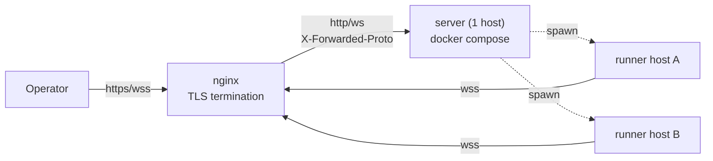

# Multi-host deployment architecture

## Purpose

The canonical deployment procedure had been scattered across header comments in
`server/docker-compose.yaml` and a few lines in `server/README.md`, omitting the
information needed for public operation on an arbitrary host (nginx settings,
env list, DETS paths, and wss constraints). This document is the **sole canonical
manual procedure**. [setup-wizards](../specs/setup-wizards.md) automates env/config
generation for **initial deployment**; this document fully records areas the
wizard does not handle, such as DETS paths and nginx settings. **Updating an
existing deployment (section 4) is outside the wizard** and is being automated in
issues #218 / #219 / #220.

## Overall architecture

Use one server and any number of runners per host ID. TLS terminates at nginx;
the server remains plain HTTP (decision 2026-06-11, see `docker-compose.yaml`).
Only deployments restricted to a VPN may use the direct, nginx-free option (1.5).

### Build and restart boundaries

| Limit | Details | Resolving issue |
|---|---|---|
| **In-place build** (checkout-direct hosts only) | Overwrites `dist` in the active checkout. Each wrapper spawn resolves on-disk `dist` (`resolveWrapperLaunch()` in `runner/src/spawn.ts`), so a spawn during build can capture a mixed old/new artifact. Even if the procedure says “build while stopped,” **one ordering mistake reproduces the failure** | #219 (implemented; **remains until the host moves to the release profile** — 4.6) |

## See Also

- [Server install runbook](../operations/server-install.md).
- [Network and login runbook](../operations/network-and-login.md).
- [Server configuration reference](../reference/configuration/server.md).
