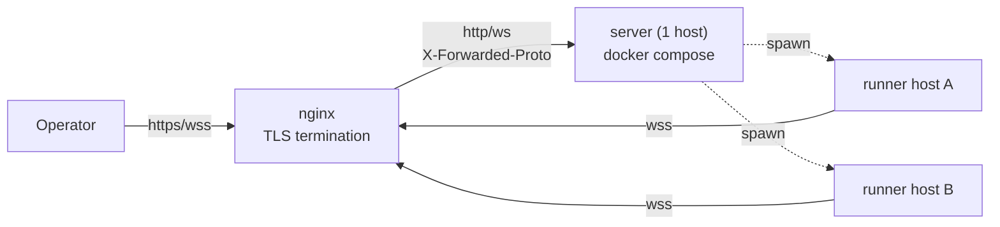

# Multi-host deployment architecture

## Purpose

The canonical deployment procedure had been scattered across header comments in
`server/docker-compose.yaml` and a few lines in `server/README.md`, omitting the
information needed for public operation on an arbitrary host (nginx settings,
env list, DETS paths, and wss constraints). This document is the **sole canonical
manual procedure**. [setup-wizards](#setup-wizards) automates env/config
generation for **initial deployment**; this document fully records areas the
wizard does not handle, such as DETS paths and nginx settings. **Updating an
existing deployment (section 4) is outside the wizard** and is being automated in
issues #218 / #219 / #220.

## Overall architecture

Use one server and any number of runners per host ID. TLS terminates at nginx;
the server remains plain HTTP (decision 2026-06-11, see `docker-compose.yaml`).
Only deployments restricted to a VPN may use the direct, nginx-free option (1.5).

### Build and restart boundaries

| Limit | Details | Resolving issue |
|---|---|---|
| **In-place build** (checkout-direct hosts only) | Overwrites `dist` in the active checkout. Each wrapper spawn resolves on-disk `dist` (`resolveWrapperLaunch()` in `runner/src/spawn.ts`), so a spawn during build can capture a mixed old/new artifact. Even if the procedure says “build while stopped,” **one ordering mistake reproduces the failure** | #219 (implemented; **remains until the host moves to the release profile** — 4.6) |

### Rollout ordering

issue #256 を含む release の rollout は **runner / wrapper を先行し、server を
後行**する。新 server は operator restart の `request_id` を wrapper の
`transition_id` まで運べる runner と、`peer_reconnecting` / `reconnected` を
解釈できる wrapper が配備済みであることを前提に planned window を開始する。
逆順(server 先行)では旧 runner が token を relaunch へ運べず、当該 agent 宛 IA
が最大 60 秒 bounce し、旧 wrapper は close notice を解釈できないため
reconnecting 状態も解消されない。

## Setup wizards

Initial setup by hand-writing tokens and connection settings is hard to read,
add, and revise. Interactive question-and-answer wizards generate valid
configuration files to reduce effort and transcription mistakes, especially
omitted fail-closed client-authentication settings.

The deployment guide ([#137](https://github.com/sakuraiyuta/kaoiro/issues/137))
is the **source of truth for manual steps**; wizards are **its automation**.
They do not restate the guide, only output generated configuration and “next
steps.”

### Two wizards

Their artifacts and locations are separate, and they operate independently.

| Wizard | Invocation | Artifact | Location |
|---|---|---|---|
| server env | `mix kaoiro.env` | `.env` | server side |
| runner configuration | `deploy/kaoiro-runner-setup.sh` in the unpacked runner tarball | `runner.config.json` / `runner.env` | each agent host |

In a source checkout the corresponding script is
`runner/deploy/kaoiro-runner-setup.sh`; the release tarball puts `deploy/` and
`dist/` at its root.

Their implementation forms differ because their distribution forms differ. The
server runs in an Elixir environment and can use a Mix task; the runner is
distributed as a tarball ([ADR-0018](../adr/0018-runner-distribution.md), revised
2026-07-25), whose destination has **neither Mix nor pnpm**, so it uses a Node
implementation (`runner/src/setup.ts`) plus a bundled shim.

### Common policy

- **Tokens**: For every token, choose “manual entry / automatic generation.”
  Automatic generation is **32-byte hex** (the same form as
  `openssl rand -hex 32`; implemented with Node's `crypto.randomBytes` or
  Erlang's `:crypto.strong_rand_bytes`, with no dependency on an openssl binary).
- **Existing files**: Confirm before overwriting an existing destination. Keep
  files whose overwrite is declined and report which were retained.
- **Independent operation**: Do not automate token handoff between the two
  wizards. Since the runner's `KAOIRO_RUNNER_TOKEN` and the server's
  `KAOIRO_RUNNER_TOKENS` share the same token, the wizard guides “generate in one
  → paste into the other” operation (automatic linkage is out of scope).
- **Interactive only**: Refuse to run in a non-interactive session. To avoid
  silently blocking without a TTY when called by systemd / launchd, the runner
  checks `process.stdin.isTTY` and exits 78; the server aborts with `Mix.raise`
  if stdin is closed. Flag-driven unattended deployment is handled in
  [#141](https://github.com/sakuraiyuta/kaoiro/issues/141).
- **Do not launch automatically on first run**. When configuration is absent,
  the launch shim exits 78 (`EX_CONFIG`) and only **directs the user to the
  wizard command** (avoiding the non-interactive failure above). This overrides
  [ADR-0018](../adr/0018-runner-distribution.md)'s “automatically launch the
  wizard on first run” decision.

Exact field contracts (what each wizard asks, generated env/config keys,
validation, and out-of-scope items) are in
[Setup wizards](../reference/configuration/setup-wizards.md).

## See Also

- [Server install runbook](../operations/server-install.md).
- [Network and login runbook](../operations/network-and-login.md).
- [Server configuration reference](../reference/configuration/server.md).
- [auth-and-authz](security-boundaries.md) — details of unset behavior for the three tokens
- [setup-wizards](#setup-wizards) — interactive wizard automating env / config
  generation for **initial deployment**; section 4 updates are out of scope
  (automation in #218 / #219 / #220)
- [runner/README.md](../../runner/README.md) — package entry point: current capabilities, usage, and the config wizard
- [Runner install and distribution](../operations/runner-install.md) — full service and tarball-distribution guide
- [server/README.md](../../server/README.md) — local development and Docker basics
- [threat-model](security-threat-model.md) — risk assessment for dev fallback / unset tokens
- [docs/operations/production.md](../operations/production.md) — Codex
  `codex.backend` selection and its rollback procedure, not covered here
- [ADR-0011](../adr/0011-phase3-reliability-and-auth.md) — token authentication
- [ADR-0018](../adr/0018-runner-distribution.md) — runner distribution form
- [ADR-0023](../adr/0023-host-runner-architecture.md) — runner residency
- [ADR-0024](../adr/0024-agent-instance-identity-and-spawn-auth.md) — `agent_id` / token allocation at spawn
