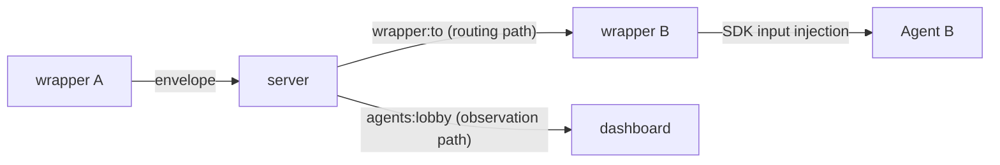

# Inter-agent messaging

## Purpose

Define the protocol surface that lets multiple AI agents exchange messages
directly through the kaoiro server. This is the mechanical specification for
issue #17; see [phase-8-inter-agent-messaging](../plans/phase-8-inter-agent-messaging.md)
for the staged implementation plan and kaoiro issues #87 and #17
issuecomment-5384349594 for design rationale.

Add envelope `type: "inter_agent_message"` as a reserved supplement to
[protocol](../specs/protocol.md) (same `version`), per
[ADR-0010](../adr/0010-protocol-precisification.md).

### Overview

When agent A's wrapper calls `send_to_agent`, it sends an envelope with
`type: "inter_agent_message"` to the server as a normal `envelope` event. The
server splits it into two paths:

- **routing path**: The server reads `payload.to` and pushes the envelope to the
  `wrapper:<to>` channel. The receiving wrapper injects it as input for the next
  SDK turn.
- **observation path**: The server also includes the envelope in the normal
  `agents:lobby` broadcast (operator-only delivery; see [observation path](../reference/inter-agent/coordination-monitoring.md#observation-path-dashboard-display)). The dashboard can
  display the inter-agent message in both A and B log panes.

The server does not interpret the natural-language meaning of the body. It
validates the structured payload (including kind, meta, and owner shape), reads
`to` for routing, and uses `conversation_id`, `turn_number`, `meta.done`,
`new_conversation`, and body byte length for admission, lifecycle, and quotas.
These mechanical checks do not decide whether an agent agrees with the body.

## Dispatch and coalescing

When a wrapper is busy (at least one SDK injection is queued) and multiple
inbound messages arrive from the **same peer**, coalesce them into **one SDK
turn** instead of separate turns. Coalescing may span conversation IDs but
never spans peers (Chloe ruling, 2026-08-11). The goal is to reduce model-call
count and the high cost of xhigh effort.

See [Send and wait](../reference/inter-agent/send-and-wait.md) for the
receiver, batching, and synchronous-wait contracts.

## Related inter-agent topics

- [Inter-agent message contract](../reference/inter-agent/messages.md).
- [Inter-agent conversation contract](../reference/inter-agent/conversations.md).
- [Inter-agent conversation admission](../reference/inter-agent/conversation-admission.md).
- [Approval flow](../reference/security/inter-agent-tool-authorization.md#approval-flow-permission_broker-integration), and [session-operation tools](../reference/inter-agent/session-tools.md).
- [Delivery confirmation and recovery](../reference/inter-agent/delivery.md).
- [Send and wait](../reference/inter-agent/send-and-wait.md).
- [Coordination monitoring and display](../reference/inter-agent/coordination-monitoring.md).
- [Peer directory and companion tools](../reference/inter-agent/directory.md).
- [protocol](../reference/protocol/envelope.md) (common envelope foundation),
  [tasks](../reference/protocol/tasks.md) (similar reserved-type patterns),
  [extensions](extensions.md) (future filter insertion point), and
  [threat-model](security-threat-model.md) (basis for operator-only delivery).
- Related plans: [phase-8-inter-agent-messaging](../plans/phase-8-inter-agent-messaging.md)
  and [phase-27-list-agents-metadata](../plans/phase-27-list-agents-metadata.md)
  (six peer-directory liveness fields).

### ADRs

[0010 protocol-precisification](../adr/0010-protocol-precisification.md),
[0015 protocol-version-stamping](../adr/0015-protocol-version-stamping.md),
[0021 role-information-disclosure-policy](../adr/0021-role-information-disclosure-policy.md)
(F6 = allow-list for agent disclosure, F6-8 = user disclosure allow-set),
[0022 pending-permission-authoritative-source](../adr/0022-pending-permission-authoritative-source.md),
[0040 context-usage-capability](../adr/0040-context-usage-capability.md)
(the `context` capability gate),
[0050 principal-model-and-graded-access-control](../adr/0050-principal-model-and-graded-access-control.md)
(D5 = identity disclosure policy)

kaoiro issues #17 (implementation origin), #18 (message filter), #87
(umbrella investigation), #127 (unresponsive notices), #150
(peer-directory liveness), #154 (rate-limit display defect), #167
(conversation lifecycle, tombstone, stale-turn rejection), and #187 (user
disclosure, phase 2).

## Open Questions

- Conversation persistence (whether conversation_id survives a server restart
  and how it connects to Phase 4 / ADR-0014) — settle in Phase 2.
- Insertion point for the message filter (kaoiro issue #18) — begin review in
  Phase 2.
- Automatic escalation when starting an `owner.kind: "agent"` conversation —
  pending Phase 3 / kaoiro issue #87.
- [IA sidecar and display restoration](../reference/storage/inter-agent-sidecar.md).
