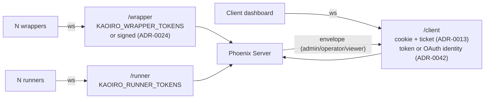

# Security boundaries

Related security topics: [Security threat model](security-threat-model.md), [Authentication and authorization](../reference/security/authentication-authorization.md), [Tool authorization](../reference/security/tool-authorization.md), [Security enforcement boundaries](../reference/security/enforcement-boundaries.md), [Security release audit](../operations/security-release-audit.md).

## Purpose

Authentication and authorization are defined across the protocol, threat model,
and individual ADRs. This document is an overview of **which mechanism protects
each boundary and which privilege applies after crossing it**, collecting each
boundary's mechanism, implementation location, and unset behavior in one place.

Build the pre-OSS audit checklist (private Gitea issue 91) from this document.
While [threat-model](security-threat-model.md) covers “what is considered a threat and
how it is mitigated,” this document maps “the boundaries currently implemented.”
**WHY** belongs in ADRs / the threat model; **HOW** belongs here and in code
references.

### Overall topology

## Permission control (two-axis model)

With the Codex adapter ([ADR-0032](../adr/0032-codex-adapter.md)), represent the
common permission abstraction at agent level as two-axis `ext.permission` (do
not duplicate axes inside `pending_permission`; ADR-0033 F1).

See [Permission state](../reference/protocol/permission-state.md#two-axis-extpermission-2026-07-10-adr-0033)
for the field contract, per-engine stamping, and the Antigravity local-mode
allow rules.

## Known gaps (design choices and not yet addressed)

| Area | Current state | Compensation | Related |
|---|---|---|---|
| **Inter-agent ACL** | No server-side allowlist for A→B sends | Broker dialog (per-action operator approval) is the only human gate | [#17](https://github.com/sakuraiyuta/kaoiro/issues/17), intentional Phase 1 choice |
| **Message inspection** | Server does not interpret payloads (size cap only) | None — prompt-injection attacks pass through | [#18](https://github.com/sakuraiyuta/kaoiro/issues/18), Phase 2 |
| **Operator role granularity** | Issue #188 introduced admin / operator / viewer, but operators still have full power (spawn / interrupt / approve / clear, etc.). Per-pair permission demotion is not implemented | None — single-tenant assumption | [issue #189](https://github.com/sakuraiyuta/kaoiro/issues/189) (per-pair permissions, [ADR-0050](../adr/0050-principal-model-and-graded-access-control.md) D3) |
| **Immediate token revocation** | **Forced disconnect of active WS is implemented ([#47](https://github.com/sakuraiyuta/kaoiro/issues/47))**: logout (`DELETE /session`) and refresh 401 for a revoked credential call `disconnect_sockets/1`, broadcasting disconnect on the socket-id topic and dropping all connections. Delivery occurs when a detection trigger arrives rather than as an immediate push | Triggers are the next operator action (gate re-resolution in [#148](https://github.com/sakuraiyuta/kaoiro/issues/148)) / change-driven OAuth allowlist disconnect ([#160](https://github.com/sakuraiyuta/kaoiro/issues/160), including passive sockets) / 12-hour refresh / reconnect / explicit logout. Changing a shared `KAOIRO_CLIENT_TOKENS` value still requires restart because env is not reloaded (out of #160 scope) | Implemented |
| **Signed-token revoke** | **Per-agent ID denylist implemented (2026-07-23, [#72](https://github.com/sakuraiyuta/kaoiro/issues/72))**: TokenDenylist DETS + `Auth.authorize_wrapper` check + `delete_agent` auto-revoke + explicit operator revoke handler + live disconnect via revoked broadcast | Key rotation remains the heavy option that revokes the whole fleet | Implemented |
| **Sandbox enforcement (antigravity)** | The sandbox axis is advisory: `--sandbox` was measured ineffective, so `read-only` / `workspace-write` are enforced by wrapper argument inspection, never by the OS | `ext.permission.enforcement = "advisory"` plus a permanent dashboard badge; shell needs approval outside `danger-full-access` | [ADR-0057](../adr/0057-antigravity-adapter.md) F4 |
| **Gate spoofing by the agent itself (antigravity)** | The gate nonce and the correlation state are readable by any shell the agent runs, so a compromised agent can satisfy the self-verification | None — F4b detects a vendor mechanism that stops firing; it is not an authorization boundary | [ADR-0057](../adr/0057-antigravity-adapter.md) F4b |
| **Multi-tenant isolation** | Every operator can control every agent (OAuth identifies people but has no agent-owner boundary) | None — single-tenant assumption | [ADR-0042](../adr/0042-oauth-allowlist-login.md), out of scope |
| **Dev fallback leakage risk** | **Resolved (2026-07-25, [#133](https://github.com/sakuraiyuta/kaoiro/issues/133))**: `:dev`/`:test` still allow all when unset; `:prod` fails closed when unset (2026-08-02 revision: wrapper accepts only server-minted signed tokens, whose signature derives from `secret_key_base`) | Startup WARN log (environment-specific wording) | Implemented |
| **Audit logging** | No durable record of who sent what to which agent and when | None | Future (when SQLite is introduced) |
| **Tool-input masking** | Command lines / paths are shown raw in the operator dialog | Operator-only delivery + 16KB truncation | Future |
| **Runner-less wrapper auth** | Localhost direct connection only; a token is unavailable without going through spawn | Runner required | [#71](https://github.com/sakuraiyuta/kaoiro/issues/71) |
| **conversation_id confidentiality** | Observable by every dashboard operator | `participants_mismatch` guard rejects third-party reuse | [#17](https://github.com/sakuraiyuta/kaoiro/issues/17), intentional Phase 1 choice |

## See Also

- Related specs: [protocol](../specs/protocol.md), [threat-model](security-threat-model.md),
  [architecture](system-overview.md), [protocol-inter-agent](../specs/protocol-inter-agent.md)
- ADRs: [0011](../adr/0011-phase3-reliability-and-auth.md) (wrapper token),
  [0012](../adr/0012-response-display-and-dashboard-scope.md) (log/result delivery),
  [0013](../adr/0013-user-token-cookie-persistence.md) (cookie / ticket),
  [0021](../adr/0021-role-information-disclosure-policy.md) (role allow-list),
  [0022](../adr/0022-pending-permission-authoritative-source.md) (pending permission),
  [0023](../adr/0023-host-runner-architecture.md) (runner),
  [0024](../adr/0024-agent-instance-identity-and-spawn-auth.md) (spawn auth),
  [0042](../adr/0042-oauth-allowlist-login.md) (OAuth + allowlist),
  [0057](../adr/0057-antigravity-adapter.md) (antigravity gate socket)
- Related issues: [#17](https://github.com/sakuraiyuta/kaoiro/issues/17) (inter-agent),
  [#28](https://github.com/sakuraiyuta/kaoiro/issues/28) (client fail-closed),
  [#46](https://github.com/sakuraiyuta/kaoiro/issues/46) (cwd exposure),
  [#47](https://github.com/sakuraiyuta/kaoiro/issues/47) (socket revoke),
  [#65](https://github.com/sakuraiyuta/kaoiro/issues/65) (OAuth),
  [#71](https://github.com/sakuraiyuta/kaoiro/issues/71) (runner-less auth),
  [#72](https://github.com/sakuraiyuta/kaoiro/issues/72) (signed-token denylist),
  private Gitea issue 91 (OSS publication preparation)
