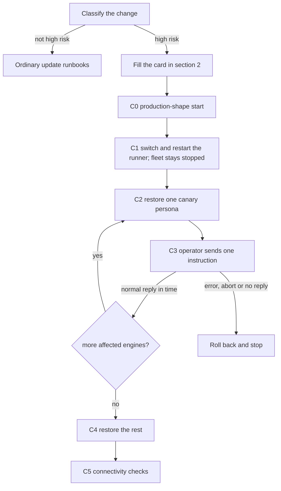

# High-risk change release

**Status.** Accepted as a procedure by the operator
([issue #240](https://github.com/sakuraiyuta/kaoiro/issues/240#issuecomment-6063195371),
[answers Q1–Q5](https://github.com/sakuraiyuta/kaoiro/issues/240#issuecomment-6064701974)).
The start gate in section 3 was measured on 2026-10-09
([evidence](../evidence/deployment/high-risk-change-start-gate.md)).
**The canary stage in section 4 has not been exercised on a real update yet.**
The first high-risk update records its result in the tracker and replaces this
sentence with the date and outcome.

This page answers one question: *can the change I am about to ship, or review,
stop the agents that would repair it, and if so what do I prepare and in what
order do I ship it?* It covers changes to the wrapper and the runner. The
operator runs the procedure; agents may help, but no step depends on an agent
being alive.

Why it exists: agents here rewrite the wrapper and runner that run them. A
defect in the wrapper's turn lifecycle
([issue #239](https://github.com/sakuraiyuta/kaoiro/issues/239): every Claude
turn aborted right after start) or in the runner's start shim
([issue #249](https://github.com/sakuraiyuta/kaoiro/issues/249): the runner
failed with exit 78 for 35 minutes) removes the agents that would fix it, and
both passed review and green tests.

**Out of scope.** Changes to the server path that live wrappers use (join,
channel, authentication, delivery) are not covered
([issue #555](https://github.com/sakuraiyuta/kaoiro/issues/555)): a
server-only update does not stop live wrappers, so the isolation used in
section 4 does not carry over. Follow
[Server update and rollback](server-update-and-rollback.md) for those.

## 1. Is the change high risk?

A change is high risk if the answer to either question is yes.

- **FS (fleet start).** Can it keep the runner process from starting, or from
  staying up?
- **TL (turn lifecycle).** Can it keep a wrapper from starting, or from
  completing one turn on the default wiring (accepting input, handling
  approvals, running the turn, returning the reply)?

**The two questions decide; the paths below are examples.** A change outside
the list that answers yes is high risk; being outside the list is never a reason
to treat a change as ordinary. A change inside the list that a reviewer judges,
with a written reason, to answer no to both questions may be treated as
ordinary. When unsure, treat it as high risk.

To test a diff against the list, run both commands. Any output makes the change
a candidate.

```sh
# FS: the runner starts and stays up
git diff --name-only <base>..<head> -- \
  'runner/deploy/**' \
  scripts/build-runner-tarball.sh scripts/build-release-manifest.mjs \
  scripts/build-identity.mjs scripts/with-build-identity.mjs \
  scripts/landing-tags.mjs scripts/landing-workflow.mjs \
  scripts/production-release-tags.mjs scripts/production-release-workflow.mjs \
  scripts/release-automation-gate.mjs \
  .github/workflows/develop-landing.yml .github/workflows/production-release.yml \
  runner/src/spawn.ts runner/src/supervisor.ts runner/src/cli.ts \
  runner/src/runner-cli.ts runner/src/config.ts runner/src/config-watcher.ts \
  runner/src/transport.ts runner/src/args.ts runner/src/delivery-settings.ts \
  runner/src/permission_ceiling.ts runner/src/resume_snapshot.ts

# TL: a wrapper starts and completes a turn
git diff --name-only <base>..<head> -- \
  'wrapper/*/src/host.ts' 'wrapper/*/src/cli.ts' \
  'wrapper/*/src/turn_watchdog.ts' \
  'wrapper/*/src/inter_agent_turn_coordinator.ts' \
  wrapper/core/src/transport.ts wrapper/core/src/phoenix_socket.ts \
  wrapper/core/src/claude_scheduler.ts wrapper/core/src/delivery_recovery.ts \
  wrapper/core/src/args.ts \
  wrapper/agent-common/src/state.ts wrapper/agent-common/src/inter_agent.ts \
  wrapper/agent-common/src/pending.ts wrapper/agent-common/src/approval_gate.ts \
  wrapper/agent-common/src/delivery_modes.ts \
  wrapper/codex/src/startup.ts wrapper/codex/src/app_server_host_runtime.ts \
  wrapper/codex/src/app_server_input.ts wrapper/codex/src/app_server_session.ts \
  wrapper/codex/src/app_server_transport.ts wrapper/codex/src/app_server_rpc.ts \
  wrapper/codex/src/app_server_steer.ts wrapper/codex/src/tool_home.ts
```

Changes to the tagging workflows, allocator or central tag-domain definition
are FS changes. Before landing, require operator approval and V6/V9 evidence
for the exact candidate commit. Allocation also requires V9/V10 before it is
enabled; see [Build identity and release tags](build-identity-and-release-tags.md).

No path rule catches a change to the pinned version of an engine SDK, CLI or
native binary (`package.json` and the lockfile). Treat it as high risk for
every affected engine.

Keep the list current: when a module joins the start path or the turn path
permanently, add it here. Listing every module the runner loads at start would
include almost every file and erase the distinction, so the list names the
modules that decide whether the fleet starts or a turn completes.

Which engines does the change affect, and who is the canary? The canary persona
is fixed per engine (operator decision, issue #240): the operator can change
the choice by editing this table.

| Where the change is | Engines affected | Canary persona | Standby agent of another engine (help only, never a plan) |
|---|---|---|---|
| `wrapper/claude-code/**` | claude-code | `ao` | Only one that is alive under a different runner (another host): codex or antigravity |
| `wrapper/codex/**` | codex | `momo` | Only one under a different runner: claude-code or antigravity |
| `wrapper/antigravity/**` | antigravity | `hiiro` | Only one under a different runner: claude-code or codex |
| `wrapper/core/**`, `wrapper/agent-common/**`, `runner/**`, a pin change | all | `ao`, `momo` and `hiiro`, each affected engine in turn (section 4) | None; plain shell only |

An agent under the same runner stops when the runner stops, so it is never a
standby. If no standby agent exists, write "plain shell only" on the card in
section 2.

## 2. Before you start

Fill this card before you switch anything and record the answers in the tracker
of the change. Nothing here is a standing facility: you prepare it for this
change and discard it afterwards. The operator does the work.

| # | Check |
|---|---|
| B1 | The operator can open a shell on the runner host and on the server host without an agent, and has actually done so. The runner unit belongs to a user manager, so use the runner user's own login (`systemctl --user` must work). |
| B2 | The rollback targets are resolved and written down: the release ids that `current` and `previous` point to. If the update changes a Codex native pin, also the verified physical path of the tool release and the snapshot directory (see [Codex state backup](runner-update-and-rollback.md#codex-state-backup)). |
| B3 | If the same update deploys the server: the last good transaction id, and the recovery archive exists ([Server update and rollback](server-update-and-rollback.md#44-failure-handling)). |
| B4 | The rollback commands are written with resolved values, not placeholders, in a note that does not live in an agent's session. The note holds no secret. |
| B5 | For a change confined to one engine: a standby agent of another engine, alive under a different runner, is named and idle. Otherwise write "plain shell only". |
| B6 | The rollback signal is fixed in advance: a canary turn that fails or times out means roll back immediately. Do not investigate first; investigating while the fleet is stopped lengthens the outage. |
| B7 | The runner unit stops every process it started on restart: `systemctl --user show -p KillMode --value kaoiro-runner` prints `control-group`. If it prints anything else, the canary procedure does not hold (an old wrapper would survive the restart); do not use it. |

The break-glass order is: (1) the operator's plain shell, which is always
enough and is the only means when the runner cannot start; (2) a standby agent
of another engine, only as described in B5.

## 3. Production-shape start

A fault in the start path stops the runner before any canary persona can run
one turn, so the canary stage cannot catch it. A change that answers yes to FS
is therefore not complete until the start shim and its verifier have started
once in the **shape production runs**, on **production's own config, env and
Node**, in an environment that carries **no inherited settings**. Issue #249
shipped because the test fixtures only built the shape of a built release while
production ran from a repo checkout.

1. Read the production shape from the host, not from memory:
   `systemctl --user show -p ExecStart --value kaoiro-runner`. A shim under
   `<install-root>/current/deploy` is the release layout; one under
   `<repo>/runner/deploy` is checkout-direct
   ([Deployment forms](runner-install.md#deployment-forms-issue-219-adr-0018)).
2. Release layout: install the candidate tarball into a throwaway install root
   and switch it, then pass the throwaway root's
   `current/deploy/kaoiro-runner-launch.sh` to the gate. The tarball comes from
   [Creating distribution tarballs](runner-install.md#creating-distribution-tarballs):

   ```sh
   <deploy-dir>/kaoiro-runner-install.sh <tarball> --install-dir <tmp-root>
   <deploy-dir>/kaoiro-runner-switch.sh <release-id> --install-dir <tmp-root>
   ```

   The install prints the release id on stdout, and the switch prints the id
   that `current` now names. That id is the `<expected-release-id>` below.
3. Save the block below as a file (`gate.sh`) and run it with `sh gate.sh
   <launch-shim> <expected-release-id>`. It is a script: it uses `exit`, so
   pasting it into an interactive shell would close that shell. **Do not go on to
   section 4 until it exits 0.** `<expected-release-id>` must be the candidate's
   full 40-character release id.

```sh
# gate.sh <launch-shim> <expected-release-id>   (exit 0 only if every check holds)
set -u
shim=$1; rev=$2; port=59999; url="ws://127.0.0.1:$port/runner"
svc=kaoiro-runner                                           # the unit's name (--service)
prod="${XDG_CONFIG_HOME:-$HOME/.config}/kaoiro"            # production settings: read only
fail() {
  echo "GATE STOP: $1"
  # keep the probe dir if the start ran: its stderr can quote config values, so read it locally
  if [ -n "${probe:-}" ] && [ -s "$probe/err" ]; then echo "stderr kept at: $probe/err"
  elif [ -n "${probe:-}" ]; then rm -rf -- "$probe"; fi
  exit 1
}
# Env names, by rows of runner/src/behaviour-settings.ts. Keep these in step with that file.
# carry: the runner validates them at start with the fixture's capabilities (claude-code only)
carry='KAOIRO_CLAUDE_[A-Z0-9_]+|KAOIRO_WRAPPER_PERMISSION_TIMEOUT_MS|KAOIRO_RUNNER_LOG_PHOENIX_HEARTBEATS'
# blind: validated only for an enabled engine, which the fixture does not enable
blind='KAOIRO_CODEX_(TURN_WATCHDOG_(INACTIVITY|ABORT_GRACE)_MS|OPERATOR_STEER|APPROVAL_AXIS)|KAOIRO_ANTIGRAVITY_(TURN_WATCHDOG_(INACTIVITY|ABORT_GRACE)_MS|TOOL_TIMEOUT_MS|EPOCH_IDLE_MS)'
# paths: would make the shim read other settings than the default directory's
paths='KAOIRO_RUNNER_(DIR|CONFIG|ENV)'
# one strict grammar for the carried lines, used to copy AND to check
val='[A-Za-z0-9._:/+-]*'; dq='"'; sq="'"
assign="($carry)=($val|$dq$val$dq|$sq$val$sq)"
envlines() { grep -Ev '^[[:blank:]]*#' "$prod/runner.env"; }
# --- preconditions (nothing has started yet)
printf '%s' "$rev" | grep -Eq '^[0-9a-f]{40}$' || fail "release id is not a clean 40-hex id (-dirty fails)"
if [ ! -r "$prod/runner.config.json" ] || [ ! -r "$prod/runner.env" ]; then fail "production config/env unreadable"; fi
unit_env=$(systemctl --user show -p Environment -p EnvironmentFiles -p PassEnvironment --value "$svc") || fail "cannot read the unit's environment properties"
[ -z "$unit_env" ] || fail "the unit sets Environment=, EnvironmentFile= or PassEnvironment=; read them by hand, since they can change the paths and Node this gate assumes"
sh -n "$prod/runner.env" 2>/dev/null || fail "production env is not valid shell"
[ -z "$(ss -ltnH "sport = :$port")" ] || fail "port $port is not free"
n=$(envlines | grep -Ec "$paths")
[ "$n" -eq 0 ] || fail "$n production env line(s) name KAOIRO_RUNNER_DIR/CONFIG/ENV; production does not run the default settings this gate reads"
n=$(envlines | grep -Ec "$blind")
[ "$n" -eq 0 ] || fail "$n production env line(s) set a Codex or Antigravity variable that this gate cannot validate (the fixture enables only claude-code); move it to its runner.config.json key, where it is validated"
# every non-comment line that names a carried variable must be a strict assignment
n=$(envlines | grep -E "$carry" | grep -Evc "^(export +)?$assign\$")
[ "$n" -eq 0 ] || fail "$n production env line(s) name a carried variable outside NAME=VALUE (value $val, optionally in one pair of quotes)"
# production Node: sourced from the user manager's PATH, the way the unit's shim resolves it (prints a path only)
mgr_path=$(systemctl --user show-environment | sed -n 's/^PATH=//p')
[ -n "$mgr_path" ] || fail "cannot read PATH from the user manager"
node_bin=$(env -i HOME="$HOME" PATH="$mgr_path" sh -c 'set -a; . "$1" >/dev/null 2>&1; command -v "${KAOIRO_NODE:-node}"' sh "$prod/runner.env")
case $node_bin in /*) [ -x "$node_bin" ] || fail "node is not executable";; *) fail "node is not an absolute path";; esac
probe=$(mktemp -d /tmp/kaoiro-start-gate.XXXXXX) || fail "mktemp"
host="start-gate-$(od -An -N3 -tx1 /dev/urandom | tr -d ' \n')"
mkdir "$probe/conf" "$probe/home" "$probe/work"
# --- fixture config: the production config, with ONLY the four connection keys replaced
"$node_bin" -e 'const fs=require("fs");const [s,d,h,u,w]=process.argv.slice(1);
  const c=JSON.parse(fs.readFileSync(s,"utf8"));
  Object.assign(c,{host_id:h,server_url:u,cwd_allowlist:[w],capabilities:["claude-code"]});
  fs.writeFileSync(d,JSON.stringify(c),{mode:0o600})' \
  "$prod/runner.config.json" "$probe/conf/runner.config.json" "$host" "$url" "$probe/work" || fail "fixture config"
# --- fixture env: a dummy token + the strict carried assignments (never token/PATH/CODEX_HOME/URL)
{ printf 'KAOIRO_RUNNER_TOKEN=dummy\n'
  grep -E "^(export +)?$assign\$" "$prod/runner.env" | sed -E 's/^export +//'; } > "$probe/conf/runner.env"
chmod 600 "$probe/conf/runner.env"
if grep -Evq "^(KAOIRO_RUNNER_TOKEN=dummy|$assign)\$" "$probe/conf/runner.env"; then
  fail "fixture env holds a line outside the strict grammar"; fi
echo "env variables copied and validated by the runner at start (names only):"
sed -n -E 's/^([A-Z0-9_]+)=.*/  \1/p' "$probe/conf/runner.env" | grep -v '^  KAOIRO_RUNNER_TOKEN$'
# --- start, with the environment fixed
env -i HOME="$probe/home" PATH=/usr/bin:/bin KAOIRO_NODE="$node_bin" \
  KAOIRO_RUNNER_DIR="$probe/conf" KAOIRO_RUNNER_CONFIG="$probe/conf/runner.config.json" \
  KAOIRO_RUNNER_ENV="$probe/conf/runner.env" KAOIRO_RUNNER_SERVER_URL="$url" \
  timeout -k 2 8 sh "$shim" 2> "$probe/err" >/dev/null
code=$?
# --- checks
[ "$code" -eq 124 ] || fail "exit is $code, expected 124"
want="runner: host=$host rev=$rev connecting to $url"
[ "$(grep -Fxc -- "$want" "$probe/err")" -eq 1 ] || fail "the resolved-host line is not present exactly once"
[ "$(grep -c '^runner: host=' "$probe/err")" -eq 1 ] || fail "more than one runner: host= line"
rm -rf -- "$probe"; echo "GATE PASS"
```

4. Checkout-direct: run the same block with the checkout's
   `runner/deploy/kaoiro-runner-launch.sh` as the shim and the checkout's HEAD
   as the id. A dirty checkout puts `-dirty` in `rev=`, so the block stops.
5. Leave evidence in the tracker: the layout, the release id, the block's exit
   status, and the one `runner: host=` line it matched (values stay out).

What the block fixes:

- **Environment.** The start runs under `env -i`. Only `HOME` (an empty
  throwaway directory), `PATH=/usr/bin:/bin` and `KAOIRO_NODE` survive, plus the
  four settings passed explicitly: `KAOIRO_RUNNER_DIR`, `KAOIRO_RUNNER_CONFIG`,
  `KAOIRO_RUNNER_ENV` and `KAOIRO_RUNNER_SERVER_URL`. Everything else is
  dropped: inherited `KAOIRO_RUNNER_*`, `CODEX_HOME`, `XDG_*`,
  `KAOIRO_WRAPPER_DEV`, the production token, and the `PATH` that `runner.env`
  would add.
- **Config.** The fixture is the production `runner.config.json` with only
  `host_id`, `server_url`, `cwd_allowlist` and `capabilities` replaced. Every
  other block is production's, so the candidate's loader validates production's
  values at the real entry point (shim, verifier, `cli.js`). The host id is
  random and never collides with a real host, and the server URL points at a
  closed local port, so nothing registers with the real server.
- **Env.** The fixture env holds a dummy token and the production env
  variables of `claude-code` and of the runner itself, copied by name:
  `KAOIRO_CLAUDE_*`, `KAOIRO_WRAPPER_PERMISSION_TIMEOUT_MS` and
  `KAOIRO_RUNNER_LOG_PHOENIX_HEARTBEATS`. The runner validates each of them that
  has a row in `runner/src/behaviour-settings.ts`. One strict line grammar is
  used to copy and to check: `NAME=VALUE` (optionally after `export`), with
  `VALUE` limited to `[A-Za-z0-9._:/+-]*`, optionally inside one pair of
  matching quotes. A production line that names such a variable in any other form (a
  `;`, a `$(...)`, leading blanks, two assignments on one line) stops the gate
  before the start instead of being copied or dropped silently. The token,
  `PATH`, `CODEX_HOME` and the URL are never copied. The copied names (never
  values) are printed.
- **Variables the gate cannot check.** The runner validates a Codex or
  Antigravity behaviour variable only for an enabled engine, and the fixture
  enables only `claude-code`. A production env line that sets one of them stops
  the gate, with the advice to move it to its `runner.config.json` key: config
  blocks are validated for every engine, so the gate does check them there. A
  line that names `KAOIRO_RUNNER_DIR`, `KAOIRO_RUNNER_CONFIG` or
  `KAOIRO_RUNNER_ENV` also stops the gate, because production would then read
  other settings than the default directory's. The three name lists at the top
  of the block follow the rows of `runner/src/behaviour-settings.ts`; when a row
  is added or changed there, update them, as with the path list in section 1.
- **Node.** Resolved the way the shim does after sourcing `runner.env`, from the
  user manager's `PATH` (`systemctl --user show-environment`) rather than the
  operator's shell. If that resolves to a version-managed shim that cannot run
  with an empty `HOME`, the verifier exits 78 and the gate stops; give such a
  host `KAOIRO_NODE` as an absolute path in `runner.env`.
- **Preconditions.** A clean 40-hex release id, readable production config and
  env, a unit with no `Environment=`, `EnvironmentFile=` or `PassEnvironment=`
  of its own (any of them can change the default paths or Node that the gate
  assumes), a free port, an env file that is valid shell.
- **Checks.** The start must end by `timeout` (exit 124) with exactly one
  `runner: host=<probe host> rev=<id> connecting to <closed port URL>` line. A
  failure keeps the probe's stderr in the throwaway directory (it can quote
  config values) and prints only its location; read it locally and delete the
  directory. Never paste it into a tracker unreviewed.

Two properties are guarded, by different checks:

- **The start cannot be redirected by a production line.** The strict copy
  alone is enough: a line such as `NAME=0; KAOIRO_RUNNER_SERVER_URL=...` is not
  copied. The fixture-content check overlaps it, and the post-start line check
  is the backstop. `env -i` and the explicit URL are not the guarantee: the
  shim sources the env file, and an assignment there overrides the explicit
  environment.
- **No line the gate claims to check is dropped silently.** Only the
  production-line checks (the strict-assignment check and the stops under
  "Variables the gate cannot check") guard this. Without them a near-miss line
  is not copied and the gate passes without having validated it.

What the gate covers: layout, shim, verifier, every config block, the env
variables of `claude-code` and of the runner itself (the copied ones above), and
Node. What it does not cover:

- Native probes (Codex auth, `agy`), skipped on purpose because the fixture
  enables only the `claude-code` capability. The runner neither reads nor
  validates a behaviour variable of an engine that is not in `capabilities`
  ([Behaviour settings](../reference/configuration/runner.md#behaviour-settings)),
  which is why such an env variable stops the gate instead of being passed
  unchecked.
- Wrapper spawn, a real connection and registration, and any model turn. Those
  are what C2 and C3 check.
- macOS: the block uses `ss` and `systemctl --user`, and was measured on Linux
  only.

## 4. Release with a canary stage



The canary works because restarting the runner on the new release stops the
whole fleet, and restoring agents afterwards is an explicit operator action
([ADR-0030](../adr/0030-agent-directory-and-explicit-restore.md)): the server
sends a spawn to a runner only for an operator's spawn, restore or resume, and
a runner starts with no agents. So the operator restores the canary persona
alone, checks one turn on the new release, and only then restores the rest.
This is a staged restore inside the stop window. It does not apply the release
to one persona only: one runner serves every wrapper from one release. Until the
canary passes, the other agents stay stopped.

It rests on two premises, both checked in C1: nothing restores agents by itself,
and the restart kills the old wrappers (B7).

- **C0.** The gate in section 3. Required for FS-class changes, recommended for
  TL-class changes.
- **C1.** Switch and restart with [Subsequent updates](runner-update-and-rollback.md#462-subsequent-updates),
  after confirming that every agent is idle and B7 holds. Do not restore anyone.
  Right after the restart, confirm that no old wrapper survived:

  ```sh
  systemctl --user status kaoiro-runner --no-pager -l | grep -c 'node_modules/.pnpm/@kaoiro+'
  ```

  The count must be 0. It matches wrappers launched from a release, not the
  `KAOIRO_WRAPPER_DEV` path. A surviving old wrapper runs the old code under the
  new runner and reconnects to the server, so the premise is broken: stop the
  canary procedure and report. The same count also shows whether any agent has
  come back by itself, since a restored agent's wrapper appears in the unit's
  cgroup too. Run it once the journal shows the runner's
  `runner: host=... connecting to ...` line, and again just before C2. Two more
  observations, both of which must come out clean: the runner has received no
  `spawn` since this start, and every agent tile is in the offline section of
  the dashboard.

  ```sh
  journalctl --user -u kaoiro-runner --no-pager \
    --since "$(systemctl --user show -p ActiveEnterTimestamp --value kaoiro-runner)" \
    | grep -c 'phoenix receive:.*spawn'
  ```

  This must print 0 (the runner logs each `spawn` it receives). These are
  read-only observations of the unit's own cgroup and journal; do not list and
  kill host processes.
- **C2.** Restore the canary persona alone from its offline tile (the
  individual restore of ADR-0030). A change that touches the path of a brand-new
  session also needs one fresh spawn. For a change that affects several engines
  (the last row of the table in section 1), run C2 and C3 for each affected
  engine's canary in turn, and go on to C4 only after all of them pass. An
  engine whose canary was not run is recorded as unverified; it first runs at
  C4.
- **C3.** The operator sends one short fixed instruction that asks the agent to
  repeat a marker word. **The clock starts when the instruction is sent**, not
  when the agent was restored. Success means: the reply has an assistant body,
  the turn ended with a normal result, it is not shown as an error or an abort,
  and the agent's state returns to `waiting_input`. A turn that ends in an error
  or an abort does not count, even if it carries a body. The time limit is
  **5 minutes, provisionally**: it is not a measured value and the first real
  update revises it. Run the canary on the default wiring; add no setting or
  flag for it.
- **C4.** Restore everyone else.
- **C5.** Every agent is connected and none is in `error`; run the runner
  connectivity checks in [Server update and rollback § 3](server-update-and-rollback.md#3-connectivity-checks).
- **Failure.** If C3 fails or times out, roll back at once (B6) with
  [Rollback](runner-update-and-rollback.md#463-rollback). What the procedure
  guarantees is that no other wrapper session was resumed on the new code. The
  canary's native binary can still write to shared homes and state (the Claude
  home, the Codex home and state, the Antigravity session index), so whether
  shared state also has to be restored depends on B2, B3 and the state-aware
  steps in [Codex state backup](runner-update-and-rollback.md#codex-state-backup).
- **Record.** Write the time and result of C2 to C4 in the tracker. This record
  is what makes the stage "exercised".

## 5. When every agent has stopped

Work from the operator's shell (B1) with the note from B4. Stop, switch and
start run as one success chain; if the switch is refused, the runner must stay
stopped. Pick the row by symptom. This page holds no rollback commands; the rows
link to them.

| Symptom | Likely layer | Go to |
|---|---|---|
| After an update the runner unit is `failed` with exit 78 | Start shim, verifier, config or Node. Read the journal line printed before the exit; the exit covers several causes and the message has misled before (issue #249) | [Rollback](runner-update-and-rollback.md#463-rollback), then diagnose offline |
| The runner is up but every agent aborts right after start, or no turn completes | A wrapper turn-lifecycle fault (TL) | [Rollback](runner-update-and-rollback.md#463-rollback); restore the agents afterwards |
| The rollback is refused (native hashes differ, retained state references, an incomplete transaction) | A Codex native pin changed | [Rollback](production.md#5-rollback) and [Codex state backup](runner-update-and-rollback.md#codex-state-backup); if the snapshot recovery fails, [fresh setup](runner-update-and-rollback.md#second-level-recovery-fresh-setup) |
| The server is unhealthy after the update | Server | [Server update and rollback § 4.4](server-update-and-rollback.md#44-failure-handling) and [Deployment troubleshooting](deployment-troubleshooting.md) |
| You cannot open a shell without an agent | B1 was not satisfied | Nothing here helps; B1 exists to prevent this |

## 6. Authors and reviewers

- **Author.** State in the change whether it is high risk, which question (FS,
  TL or both) and which engines. For FS, attach the gate evidence from step 5 of
  section 3. For a multi-engine change, name each canary and say which are
  expected to run.
- **Reviewer.** Check the diff against both questions and the commands in
  section 1, not only against the author's statement. If the author calls a
  listed path ordinary, the written reason is part of the review. This page
  does not describe the review procedure itself.

## See Also

- [Runner update and rollback](runner-update-and-rollback.md): the update and
  rollback commands this page links to.
- [Server update and rollback](server-update-and-rollback.md) and
  [Production deployment manual](production.md).
- [Runner install and distribution](runner-install.md#verification): its
  single-shim check is the checkout-direct shape and does not pin the
  environment.
- [Deployment troubleshooting](deployment-troubleshooting.md).
- [Runner development](../contributing/runner-development.md).
- [Start gate evidence](../evidence/deployment/high-risk-change-start-gate.md).
- Issues [#239](https://github.com/sakuraiyuta/kaoiro/issues/239),
  [#249](https://github.com/sakuraiyuta/kaoiro/issues/249),
  [#240](https://github.com/sakuraiyuta/kaoiro/issues/240),
  [#555](https://github.com/sakuraiyuta/kaoiro/issues/555).
