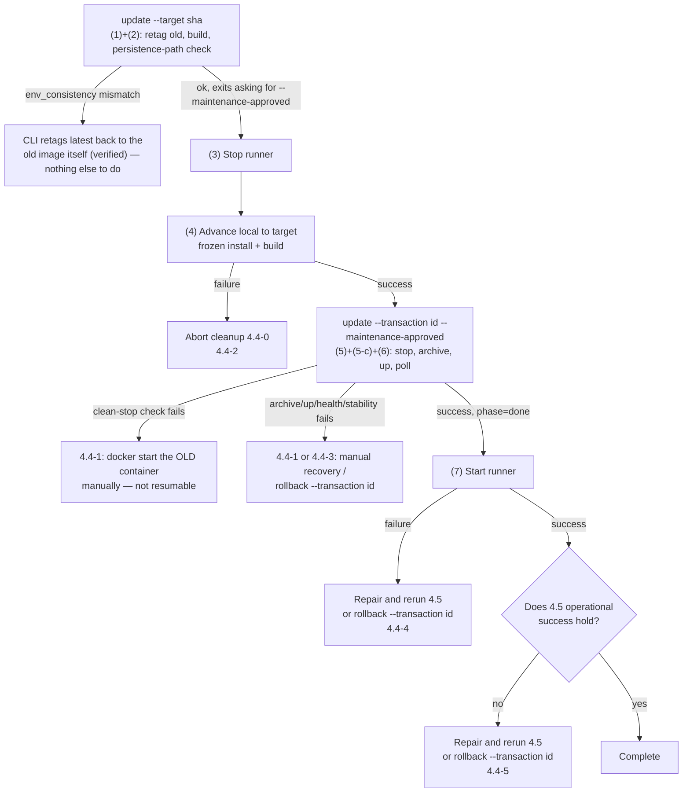

# Server update and rollback

The normative reference for why each step is shaped this way is
[Multi-host deployment architecture](../architecture/deployment.md). Deploy
CLI config keys and transaction states are documented in full in
[Server deploy configuration](../reference/configuration/server-deploy.md);
build-identity provenance verification is in
[Transactions and identity](../reference/deployment/transactions-and-identity.md).
This page covers the server side; the interleaved runner-side steps stay in
[deployment.md](../specs/deployment.md) until U21 gives them their own page.

## 3. Connectivity checks

1. server: verify with `docker compose ps`; open the dashboard at
   `https://<host>/?token=<token from KAOIRO_CLIENT_TOKENS>`.
2. runner: startup logs show `runner: host=<host_id> connecting to wss://...`
   without repeated disconnects (auth failure disconnects immediately as
   `unauthorized`).
3. Confirm the host list in the dashboard contains the `host_id`.

### Update-related resolved limits

**Missing artifact provenance (former #218) is resolved**: build identity
([ADR-0053](../adr/0053-build-identity.md)) exposes the full SHA through the
health endpoint and runner registration data (4.5).

**Manual-only rollback (former #220) is resolved**: `server/deploy/kaoiro-server-deploy.mjs
rollback --transaction <id> --confirm-restore` (4.4) restores the old image and its
corresponding pre-deploy archive as one unit, re-verifying the archive and the
restored volume's contents before starting the old image. It is operator-invoked,
not automatic — the CLI never rolls back on its own — but every mechanical step
(stop, forensic-archive, verify, wipe, restore, retag, start, health poll) that used
to be manual SSH commands is now one command.

**In-place build is resolved in the release profile** ([ADR-0018](../adr/0018-runner-distribution.md),
revised 2026-08-16). Releases expand to `releases/<revision>/` and the live path
is one `current` symlink, so **build and expansion never touch a running runner**.
This remains **a host installation-shape issue** rather than a code-only fix:
hosts whose `ExecStart` points directly to a repo checkout retain the limit until
they complete the 4.6 migration.

### 4.2 Preconditions

Satisfy all of the following before starting.

- **Pin the target to a full 40-character SHA.** Do not depend on `git pull`; record
  the SHA in the change log.
- **Advance both server and runner to the same target.** Advancing one side alone
  breaks the same-SHA postcondition and runs an unverified combination.
- **Check source cleanliness for tracked and untracked files.** `git diff --quiet`
  misses untracked files; require empty `git status --porcelain` output.
- **Ensure the server host's SSH host key is in `known_hosts`.** Do not bypass with
  `StrictHostKeyChecking=no`.
- **Ensure every persistence path resolves under the named volume.** The source of
  truth is the persistence set in 1.2. An unlisted DETS can **silently escape backup**
  (`KAOIRO_USERS_PATH` did so, losing the user ledger on container recreation;
  issue #217).
- **Confirm there is no active work** (human judgment). Stopping a runner stops all
  wrappers beneath it (section 2, “Run as a service”); conversation state is not
  persisted, so in-progress exchanges are lost.
- **The deploy host's `tar` must be GNU tar.** The CLI's own archive-listing
  parser assumes GNU `tar tv*`'s output format; a bsdtar or busybox host fails
  loudly (a parse error, not a silent misread) once the archive has already
  been written.
- **Use exactly one `backup_root` per deployment host.** The single-writer
  lock every mutating command (`start`/`update`/`rollback`) takes lives under
  `backup_root`, keyed by the checkout's own path — two DIFFERENT
  `backup_root` values for the SAME checkout get two INDEPENDENT locks, so a
  concurrent run against the same deployment would not be caught. Keep the
  `--config` file's `backup_root` the same across every invocation on a host
  (the default, `~/kaoiro-deploy`, already satisfies this without a config
  file at all).

### 4.3 Update procedure

The server side is `server/deploy/kaoiro-server-deploy.mjs` (issue #306): one
command per step, backed by a transaction manifest + journal under
`backup_root` (default `~/kaoiro-deploy/`). Run it as a normal user directly on
the server host, inside its checked-out repo — it runs every `git`/`docker`
call itself. Unlike the old manual runbook, **none of the commands below are
wrapped in `ssh '...'`**: log into the server host once for the CLI calls and
5-b's manual steps (all of them operate on the server's own containers/
volumes), and separately into the relevant runner host for (3)/(4)/(7)
(section 2 covers multi-host runner deployment; a single-host lab setup may
have both be the same machine).

```sh
node server/deploy/kaoiro-server-deploy.mjs <command> [flags...]
```

Deploy CLI `--config` keys are documented in [Server deploy configuration](../reference/configuration/server-deploy.md).

**`update --dry-run --target <target-sha>` performs only reads.** It never
fetches from `origin` (issue #322 S1) — an EARLIER version did, which mutated
the checkout's remote-tracking refs and object store despite `--dry-run`'s
own read-only contract. It instead checks whether `target` is already a known
commit object in the LOCAL repo (`git cat-file -e`, no network at all) and
reports that under `targetKnownLocally` alongside `fetched: false` — an
explicit signal that this reflects refs as of the last real `git fetch`, not
a live query. Run a real `git fetch origin` yourself first if the answer
needs to be current.

A non-dry `update` fetches `origin` inside `runBuild` before its fast-forward
merge. The dry-run plan includes that future fetch without performing it.

**Separate prepare (no downtime) from commit (the stop window)** — steps
(1)/(2) below now run automatically, inside one `update` invocation, ending
right before the stop window; steps (5)/(6) run automatically inside a second
`update` invocation once `--maintenance-approved` is given.

**Do not count server-image build time as server downtime.** The old container
keeps running with its old image ID throughout (1)/(2).

**Do not edit `server/docker-compose.yaml` between prepare and commit/resume.**
The CLI records its sha256 at prepare and re-verifies it before the stop
window; a change since prepare refuses the commit/resume outright (`update`
exits non-zero, nothing is stopped) rather than starting against a compose
file this transaction never approved. The same check applies to `rollback`
(against the compose sha256 the ORIGINAL update recorded), before any
destructive step. If the compose change is intentional, start a fresh
transaction instead of resuming the old one.

**Whether runner build time is downtime depends on the host installation
shape** (unchanged — the runner is a separate system, outside issue #306's
scope).

- **Release profile** (migrated in 4.6): build and expansion stay under
  `releases/<revision>/`, so **downtime is only switching `current` and restarting**.
  Build time is not outage; the 4.6 update command handles the sequence.
- **Checkout-direct** (not migrated): the 4.1 in-place-build limit can capture a
  mixed artifact when building while active. Therefore **runner build time is
  runner downtime**; include it in outage estimates. Steps (3) / (4) below are
  for this shape.

In particular, **confirm runner build success before switching the server**. The
reverse order can leave an unverified “new server × old runner” combination when
the build fails.



**C / D in the diagram (stop runner → build) apply to checkout-direct hosts.**
Release-profile hosts can build in parallel with A; they stop the runner only just
before switching `current` (4.6).

Substitute each environment's values for the placeholders below.

`<container>` / `<volume>` / `<target-sha>` / `<transaction-id>` /
`<backup-dir>` / `<timestamp>` / `<uid>` / `<gid>`

**(1) Save the old image (automatic, inside `update`'s prepare)**

```sh
node server/deploy/kaoiro-server-deploy.mjs update --target <target-sha>
```

Retags the image ID **actually used by the running container** — never
`latest`, which the build in (2) is about to move — as
`kaoiro-server:rollback-<old-sha>`, and verifies the tag by read-back before
continuing. Recorded in the transaction's `journal.json`
(`<backup_root>/<transaction-id>/journal.json`, `old_image_saved` phase):
old image ID, rollback tag, old SHA, compose artifact SHA. Nothing to run
manually.

**The old SHA comes from the old image's own `/app/build-info.json` (issue
#322 S2), never `git rev-parse HEAD` in the local checkout or the running
container's health endpoint.** `update` reads it without networking:

```sh
docker run --rm --entrypoint cat <old-image-id> /app/build-info.json
```

It requires `revision` to be a full 40-hex SHA. A pre-build-info image, a
missing file, or a build with no revision is refused before the transaction
directory is created; rebuild the old image with build arguments before
updating rather than silently naming a rollback after an unrelated checkout.

**(2) Prepare the server image (automatic, no downtime)**

Still part of the same `update` call. `KAOIRO_BUILD_VERSION` /
`KAOIRO_BUILD_CHANNEL` / `KAOIRO_BUILD_REVISION` / `KAOIRO_BUILD_DIRTY`
(build identity, issues #218/#288, [ADR-0053](../adr/0053-build-identity.md),
[ADR-0056](../adr/0056-project-calver-build-version.md)) are computed by
`scripts/build-identity.mjs` and passed **directly into `docker compose
build`'s child process environment** — no shell `eval`, so there is no
`set -a` step to forget (the exact footgun a hand-run `eval "$(...)"; docker
compose build` used to hit when the auto-export was missing). The old
container keeps running with its old image ID; failure here has zero impact
on the live system.

**Issue #220 absorption — persistence-path / env consistency.** The target
image exposes `KaoiroServer.PersistencePaths.manifest/0` (issue #310).
`update` first checks whether the image even carries that module — a plain
`ls` of its own compiled beam file inside the image, needing no config boot
at all:

```sh
docker run --rm --entrypoint /bin/sh <image_id> -c \
  'ls /app/lib/kaoiro_server-*/ebin/Elixir.KaoiroServer.PersistencePaths.beam \
    >/dev/null 2>&1 && echo present || echo absent'
```

Only when that reports `present` does `update` go on to query the manifest:

```sh
docker run --rm --entrypoint /app/bin/kaoiro_server <image_id> eval \
  'IO.puts(Jason.encode!(KaoiroServer.PersistencePaths.manifest()))'
```

**The contract #310 must satisfy**: stdout is a JSON array; each element has
exactly the keys `store` (string), `env` (the persistence-path env var name),
`default_file` (the bare filename under the fallback dir), and `default_path`
(the ABSOLUTE path `runtime.exs`'s own fallback resolves to when `env` is
unset — A-MF-2 below). issue #322 M5: module presence is decided FIRST, by
the beam-file check above, never by the eval call's own exit code — `eval`
can fail for several DISTINCT reasons its exit code cannot tell apart: a
pre-#310 image (before `config/runtime.exs` relaxed its required-variable
raises for `RELEASE_COMMAND=="eval"`) raising on missing
`SECRET_KEY_BASE`/`PHX_HOST`, an OOM, image corruption, or a docker daemon
failure. Deciding any of those means "module absent" was fail-open by
construction, regardless of which one actually fired. Now: the beam file
absent means this module has not
landed on this image (a pre-#310 image, or an old image a rollback targets)
— recorded as `env_consistency: {skipped: true, reason}`, never a failure.
The beam file present but the eval process failing (non-zero exit, exiting 0
but printing anything other than a valid JSON array, an element missing one
of the four keys, an empty `env`/`default_path`) is always treated as
actively wrong — `update` throws `DeployError` rather than skipping, the
same way `docker compose config` returning garbage does elsewhere in this
section. Also fail-closed: the presence probe's own `docker run` failing to
even start (image missing, daemon unreachable) throws `DeployError` too,
distinct from its controlled `present`/`absent` answer.

Two image-side conditions make the eval-based manifest query work at all (the
beam-file presence check above needs neither — it boots no config and starts
no VM), and the `server-image` CI job runs this exact command against the
image it just built to keep both pinned. `config/runtime.exs` skips its
required-variable raises when `RELEASE_COMMAND == "eval"` — the query
deliberately passes no env, so the production guard would otherwise abort it
and every present-module image would read as actively wrong. And the runtime
image installs `libsctp1`: without it the VM prints an esock warning to
STDOUT ahead of the JSON, which this section treats as actively wrong rather
than absent, so every update would fail. Both apply to any custom image
built from this Dockerfile.

`update` then, for every reported persistence-path env var, compares
**compose's resolved
declaration** against **the currently-running (old) container's EFFECTIVE
path for that store** — the container's own env value if it is set, else a
`default_path` for it (what the app itself falls back to) — not the literal
`.env` file, recorded separately as `declared` for reference only (the
bundled `docker-compose.yaml` sets every canonical persistence-path var as a
literal `environment:` entry, so `.env`'s own line legitimately differs on
every correctly-configured host; folding it into the comparison would
fail-close every update).

**Which image's `default_path` (issue #322 M5).** Substituting the TARGET
image's own manifest value for the OLD container's fallback is only a
measurement if the old and new images compile the SAME default for that
store — not guaranteed across a #310 manifest change. `update` runs the same
beam-presence-then-manifest probe above against the OLD image too, and
prefers ITS `default_path` when it can answer at all; only when the old
image cannot answer (no beam file — the common case on the very first #310
upgrade) does it fall back to the target's own value. Each entry records
`assumed_default_source` (`"old_image"` when measured this way, or
`"target_image"` when it fell back), so the observation never silently
passes an assumption off as a measurement.

**Effective, not raw env, on purpose.** On the first application that adds a
NEW persistence-path var to compose, the old container was never recreated
with it, so its raw env can never equal compose's new value — comparing raw
env would fail-close every legitimate first application forever, since the
raw env cannot change before the very deploy the check is gating recreates
the container. Comparing against the effective path instead asks the right
question: compose merely starting to declare EXPLICITLY what was already the
default needs no migration (match); compose naming a genuinely different
location means a real first-application migration is needed (5-b, below) —
`update` aborts with a message naming the store and both paths. Compose not
declaring a required store AT ALL is its own, always-failing case (the #217
class: a required persistence var missing from compose can silently escape
backup).

Either failure aborts before the stop window: `latest` is retagged back to
the old image and the retag verified by read-back automatically — nothing to
do manually for this specific case. **Until #310 lands, the target image
lacks this module and the check reports `{skipped: true, reason: ...}`**; it
neither blocks nor verifies anything today.

`update` then exits non-zero, naming the transaction and requiring
`--maintenance-approved`:

```text
update requires --maintenance-approved before the stop window opens ...
resume with --transaction <transaction-id> --target <target-sha> --maintenance-approved
once the operator has approved the maintenance window
```

**(3) Stop the runner** -- the runner-side procedure stays in [deployment.md § 4.3](../specs/deployment.md#43-update-procedure) until U21 gives it its own page.

**(4) Advance local to the target and build** -- the runner-side procedure stays in [deployment.md § 4.3](../specs/deployment.md#43-update-procedure) until U21 gives it its own page.

**(5) Stop the server and determine whether it stopped cleanly (automatic)**

```sh
node server/deploy/kaoiro-server-deploy.mjs update --target <target-sha> \
  --transaction <transaction-id> --maintenance-approved
```

Re-verifies the container is still running and that `--target` still matches
what was already built, then runs `docker compose stop -t 30` and checks
`exit`/`oom` against `expected_clean_stop_exit_code` /
`expected_clean_stop_oom_killed` from `--config`. **An unset expectation, a
mismatch, or an unreadable docker field are all treated as abnormal** — never
as agreement by default. On an abnormal stop, `update` aborts immediately;
there is no automatic retry loop. Recovery is manual (4.4 (1)): `docker start
<container>` to recover the OLD container — never `docker compose up`, since
`latest` already points at the new image. **This transaction cannot resume
past this point**; once the stop failure is understood, a fresh `update`
starts a new transaction.

**Do this step's migration (5-b) BEFORE running the command above**, while the
old container is still running — this call stops it and immediately archives,
with no pause in between.

**(5-a) Resolve the volume (automatic)**

Re-resolved from the just-stopped container's own mount (never hard-coded),
recorded in `journal.json`'s `mount_resolved` phase. An empty result aborts
the run rather than archiving nothing.

**(5-b) Migrate the user ledger (first application only, manual)**

Outside `update`'s own scope (its `status` output says so explicitly: "does
not perform the first-application user-ledger migration judgment"). On the
**first application** that adds `KAOIRO_USERS_PATH` to compose, the **current
ledger is not in the volume** — the old container started without this env and
used the fallback under `System.tmp_dir!()` (`kaoiro_users.dets`) from
`KaoiroServer.Users.default_path/0`. **Recreating it as-is would make the
deployment that fixes compose discard the current ledger.** Do this once,
before step (5)'s commit call, while the old container is still running:

```sh
# 1. running container の実効 path を確認する (空なら unset = fallback 使用中)
docker inspect <container> \
  --format '{{range .Config.Env}}{{if eq (index (split . "=") 0) "KAOIRO_USERS_PATH"}}{{.}}{{end}}{{end}}'
```

Empty output means unset and the fallback path is in use. **If already
configured, skip this step** (and all later deployments do the same).

```sh
# 2. running container から ledger を退避し、checksum と numeric owner を記録する
#    (docker cp は running container に対しても動くので、停止前に実行できる)
docker cp <container>:/tmp/kaoiro_users.dets <backup-dir>/users-migrate-<timestamp>.dets
sha256sum <backup-dir>/users-migrate-<timestamp>.dets

# 復元すべき numeric owner を、既知の既存 DETS から決定的に取得する
docker run --rm -v <volume>:/data:ro alpine stat -c "%u:%g" /data/agent_directory.dets

# 3. volume 側に users.dets が既に無いことを確認する
docker run --rm -v <volume>:/data:ro alpine ls -la /data/users.dets 2>&1

# 4. volume へ配置する。owner は必ず numeric で指定する
#    alpine の `nogroup` は GID 65533 だが runtime の DETS は別 GID であり、
#    名前指定 (nobody:nogroup) では group が食い違う
docker run --rm -v <volume>:/data -v <backup-dir>:/backup \
  alpine sh -c "cp /backup/users-migrate-<timestamp>.dets /data/users.dets \
    && chown <uid>:<gid> /data/users.dets && chmod 600 /data/users.dets"

# 5. 配置後、退避元と bit 同一であることを確認する
docker run --rm -v <volume>:/data:ro alpine sha256sum /data/users.dets
# → 2 で記録した SHA-256 と一致すること
docker run --rm -v <volume>:/data:ro alpine ls -n /data/users.dets
# → owner / group / mode が既存 DETS と揃っていること
```

**A successful copy alone does not guarantee bit identity with the authority.**
Always compare SHA-256. **If the source file is absent, the ledger is already
lost.** Record this and let the operator decide; **do not silently create an
empty ledger**—distinguish “lost” from “never existed.”

**Setting `KAOIRO_USERS_PATH` in the operator's `.env` is optional and
reference-only** — the target compose's own `environment:` entry is what
actually gates the container, and `.env`'s own line (recorded as `declared`
by the #220 check above) is never compared. Do not treat it as a step to keep
in sync by hand: `.env.example` and `mix kaoiro.env` both emit this line
commented out by design, so a later wizard re-run silently drops a
manually-uncommented one — an operator relying on `.env` to remember this
setting would find it quietly gone. This step's DETS placement is included
in the pre-deploy archive step (5) takes right after; later deployments never
need this step again.

**(5-c) Archive and verify DETS (automatic)**

Full-traversal `tar tvzf` verification (never `| head`, whose exit status
would come from `head` and mask a corrupt archive); `required_entries`
recorded from that same listing, so the recorded set is provably what the
archive contains, never a separately-scanned guess that could disagree with
it. issue #322 M4 (must-fix): the archive is fsync'd right after
verification, before its SHA-256 is recorded as a durable fact — `tar`
inside the docker container that wrote it is a process this CLI never
opened itself, so nothing guaranteed its bytes had actually reached disk
until this explicit fsync. The same applies to the forensic and
restore-verify archives `rollback` creates (4.4 (3)), and to a new
transaction's own directory entry (fsync'd on its parent, `backup_root`,
right after `mkdir` — same reasoning as `writeFileDurably`'s own
fsync-the-directory step, applied to a directory this module did not
create THROUGH that helper). A failed fsync anywhere in this chain aborts
before the fact is recorded, the same as any other checkpoint failure in
this section. Both the archive and its SHA-256 are written to
`manifest.json`, alongside the env_consistency result, image ID,
source/target SHA, volume ID, and rollback tag — the durable transaction
record `rollback` later reads.

**(6) Start the server with the prepared image (automatic)**

`docker compose up -d --no-build` (rebuilding here could produce an image
different from the one verified in (2)); then polls `GET .../api/health` until
`build_revision` equals the target SHA and `build_dirty` is `false`, waits
`stability_window_ms` confirming the container is still `running` with an
unchanged restart count, and only then advances to `done` and best-effort
prunes old transactions (`keep_generations`/`retention_days`). Any failure
from here on cannot resume via `--transaction` — see 4.4 (3) once a manifest
exists (it does, written in (5-c) before this step runs).

**(7) Start the runner** -- the runner-side procedure stays in [deployment.md § 4.3](../specs/deployment.md#43-update-procedure) until U21 gives it its own page.

For the `status` command's output fields, the transaction phase table, and the container-branch classification, see [Server deploy configuration](../reference/configuration/server-deploy.md#transaction-states-and-status).

### 4.4 Failure handling

Most failure modes now stop `kaoiro-server-deploy.mjs` itself with a non-zero
exit and a message naming the exact next command — read it first. The
subsections below cover the cases a message says to investigate manually, and
what `rollback` does once a transaction has reached a point it can act on.

**(0) A prepare-phase abort left `latest` pointing at the wrong image**

`update`'s own env_consistency-mismatch check retags `latest` back to the old
image automatically, verified by read-back (4.3 (2)) — no action needed for
that specific case. For any OTHER failure between "`docker compose build`
succeeds" (which retags `latest` to the new image as its own side effect,
inside 4.3 (2)) and the transaction reaching `maintenance_gate_passed`,
confirm manually:

```sh
docker image inspect kaoiro-server:latest --format '{{.Id}}'
docker inspect <container> --format '{{.Image}}'
```

If they differ, the old image ID is in the transaction's own `journal.json`
(`<backup_root>/<transaction-id>/journal.json`, `old_image_saved` phase,
`old_image_id`):

```sh
docker tag <old-image-id-from-journal> kaoiro-server:latest
```

**Leaving this state unattended lets the next `docker compose up` switch an
incomplete deployment into production.** The running container itself was
never touched by prepare; only `latest` needs restoring. Unlike the pre-CLI
runbook, `update` does not revert the local checkout on abort — `git merge
--ff-only <target-sha>` already ran as part of (2), and a later `update
--target <target-sha>` simply finds it already there (a no-op merge).

**(0a) `another run holds <lock-path>`**

`start`, `update`, and `rollback` all take the same single-writer lock for
one deployment (4.2's `backup_root` precondition) before reading any
state, and hold it through their own mutation — this message means another
one of the three is genuinely in flight against the same deployment right
now. Wait for it to finish (check `status`), or — only after confirming no
process actually holds it (a killed run leaves the lock directory behind) —
remove the named directory manually.

**(1) The commit step failed before reaching `done`** (4.3 step 5 / step 5-c)

The commit half (`update --maintenance-approved`) has no resume support: any
failure from `stopping` through `starting`/`up`/`healthy` leaves that
transaction permanently unresumable. What to do next depends on how far it
got — read the failing command's own error message, which names the phase.

- **Stop was not clean**, or **the archive failed or was refused** (empty
  volume, `tar` verification failed): the container is stopped and nothing
  past it has run. `docker start <container>` to recover the OLD container —
  never `docker compose up`, since `latest` still points at the new image
  (compose would start it). Inspect `docker logs --tail 50 <container>` for
  the actual reason; once understood, a fresh `update` (a new transaction)
  can retry. **Do not use `--force-recreate`** here — the original container
  (and, for a first-application migration, the fallback-path ledger inside
  it) still exists; recreating it would destroy the migration source.
- **`compose up` / health / stability failed after the archive succeeded**: a
  manifest now exists for this transaction (written in 4.3 (5-c), before
  `starting`), so **(3)** below — `rollback --transaction <transaction-id>
  --confirm-restore` — is the supported recovery once you decide not to keep
  retrying forward.

**(2) Runner build failed** -- the runner-side recovery procedure stays in [deployment.md § 4.4](../specs/deployment.md#44-failure-handling) until U21 gives it its own page.

**(3) Roll back a committed transaction** (4.3 step 6)

```sh
node server/deploy/kaoiro-server-deploy.mjs rollback \
  --transaction <transaction-id> --confirm-restore
```

(`--dry-run` first to preview without confirming.) `rollback` re-reads and
re-validates the transaction's journal before trusting anything in it, and
refuses a transaction that never reached `old_image_saved`, or one already
mid-rollback or fully rolled back — **do not leave “did the new server open
state?” to human judgment**; the eligible-phase check and the
destructive/non-destructive split below are both derived from the same phase
graph `update` itself advances through.

- **Non-destructive** (transaction reached anywhere from `old_image_saved`
  through `archived` — `docker compose up -d` never ran, so no DETS restore is
  needed): retags `latest` back to the old image (verified by read-back) and
  `docker start`s the original container — a harmless no-op if it was never
  actually stopped.
- **Destructive** (transaction reached `starting`/`up`/`healthy`/`done` — a
  new container was started at least once, so **treat state as opened**;
  there is no guarantee old code can read DETS written by new code, issue
  #209 previously changed a tuple from 3 to 4 elements): verifies the WHOLE
  recovery pair — the old image still exists, the pre-deploy archive's
  checksum and a full traversal, and `docker compose config` still
  renders — **before touching anything** (no stop, no wipe, without all of
  it present); only then stops whatever is currently running for the
  service (refuses on more than one match), forensically archives the
  CURRENT volume state before touching it (full-traversal verified),
  re-verifies the pre-deploy archive's checksum AND a full traversal AGAIN
  right before the destructive wipe (catches a change during the stop/
  forensic window itself), wipes the volume (`find -mindepth 1 -maxdepth 1
  -exec rm -rf -- {} +` — a bare `rm -rf /data/*` would leave dotfiles
  behind) and restores from it, re-archives the JUST-restored volume and
  confirms it matches the manifest's own `required_entries` **exactly**
  (owner and mode included), retags `latest` back (verified), brings the
  old image up with `--force-recreate`, and polls health for the old SHA.

Both paths advance the transaction to `rolled_back` on success — a rollback
of an already-`rolled_back` transaction is refused; investigate manually if it
needs to be redone. **The backup restored must correspond to the image
started**: `rollback` always restores the pair together, from the same
transaction's manifest, never “old image only” or “backup only”.

**(4) Runner does not restart** (4.3 step 7)

Check `systemctl --user status kaoiro-runner` and the journal. Exit code 78
(`EX_CONFIG`) is a configuration error and restart will not fix it (section 2,
“Restart policy and exit codes”). Missing `dist` also produces this code, so
first check the recovery procedure in (2).

**At this point the new server has already opened state.** Do not stop at
investigation; choose one of the following.

- **Repairable on target**: repair, start the runner, and **rerun 4.5**.
- **Not repairable, or rollback chosen**: stop the runner and run **(3)**.

**(5) Operational checks are incomplete**

When any 4.5 operational-success check is missing, **do not consider the update
successful.**

**“Abort” does not mean leaving the new server running.** Keeping a
configuration that fails success criteria in production is not an abort. Use
the same two exits as (4).

- **Repairable**: repair and **rerun 4.5**.
- **Not repairable, or rollback chosen**: stop the runner and run **(3)**.

Even if the decision takes time, **retain the backup**: retention only prunes
DONE transactions past `keep_generations`/`retention_days`, never the one
`--transaction` currently points at.

### 4.5 Verification and its limits

Verification has two layers. **Declare success only when every operational-success
check is present.**

#### Operational success (the success criteria)

| Item | Verification |
|---|---|
| Server source is exact target | `git rev-parse HEAD`, run on the server host, equals target SHA |
| Runner source is exact target | `git rev-parse HEAD`, run on the runner host, equals the same |
| Build succeeded | Every command in 4.3 steps (2) / (4) exits 0 |
| Container is stable | No restart after a reasonable interval (about 60 seconds); `docker ps` shows `Up` |
| **Connectivity checks in section 3 pass** | **Rerun them mandatorily** — dashboard opens, runner journal shows a sustained connection, and the target `host_id` appears in the host list |

**Do not skip section 3.** `docker ps`, `git log`, and the contents of `dist` do
not verify that the server handles requests without a restart loop, that the runner
authenticates and registers, or that dashboard host projection works.

## See Also

- [Multi-host deployment architecture](../architecture/deployment.md).
- [Server deploy configuration](../reference/configuration/server-deploy.md).
- [Transactions and identity](../reference/deployment/transactions-and-identity.md).
- [Server install runbook](server-install.md).
- [Production deployment manual](production.md).
