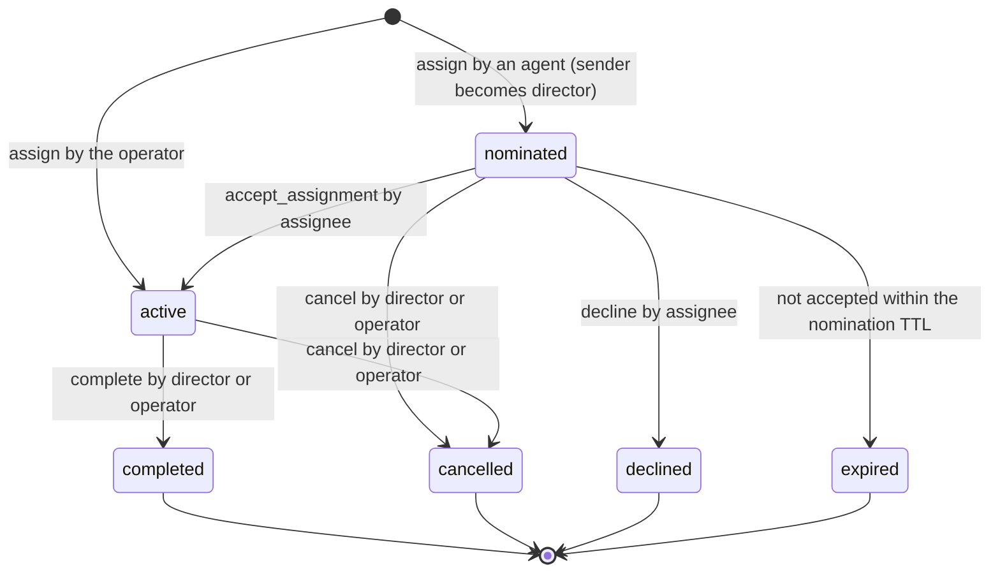
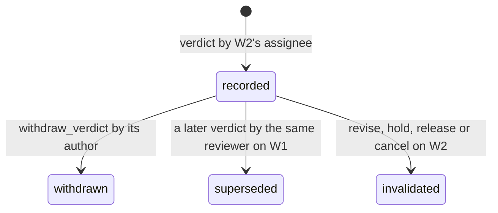

# Delivery intent, staged delivery, work grants and work_control

## Authority, baseline, and scope

Issue: [#429](https://github.com/sakuraiyuta/kaoiro/issues/429), phase 1 of
[ADR-0063](../adr/0063-layered-delivery-authority-and-continuations.md).
Baseline: develop `4c7a0635b315f938dcbcf1ecd8c179a35f7200a8`. Writer: Kuroe.
Director: Kohaku. Design review: Kogane, budget three rounds. Operator
decision follows review; implementation issues are then cut per layer.

This is a design, not an implementation. It changes no source, no landed
reference page and no ADR. Contract text for `docs/reference/` and the ADR
amendment are drafts in the appendices.

In scope (issue #429 Deliverable): wire shapes, join negotiation, server state
and its atomicity boundaries, per-engine downgrade, interaction with the
ADR-0062 reply basis, old-wrapper migration, verification with negative
controls, and a mapping to the open-question test cases and the issue #407
incidents.

Out of scope (issue #429): implementation; the Codex backend switch (phase 3);
removal of issue #426 guards; Antigravity measurement (phase 4). Also out of
scope, decided at check-in (conversation `b5b30f71`, turn 3): conditional
updates on the Git host for merge/push/deploy/landing; the dashboard UI for
work records; mechanical exclusion between different works on one resource.

Inputs read: the ADR and its sources (ADR-0062, ADR-0058, ADR-0036 F6), the
open question
[inter-agent-delivery-timing-and-turn-ownership](../open-questions/inter-agent-delivery-timing-and-turn-ownership.md),
Kogane r1 (`tmp/reviews/fundamental-review/kogane-r1.md`, SHA-256
`bff6b0b3…`), Kogane r2 (`kogane-r2-positions.md`, `78785de1…`), the I3
report (`i3/report.md`, `4d64b7ca…`), the reference pages under
`docs/reference/inter-agent/` and `docs/reference/protocol/`, the
[issue-407 plan](issue-407-message-crossing.md), issue #407 and issue #412.

## Premise corrections adopted before design

The director accepted three corrections at check-in (conversation `b5b30f71`,
turn 3). They change the ADR's wording; the amendment text is in Appendix A.

### P1. A work is not one conversation

ADR-0063 D4 makes "one canonical work conversation (`work_cid`)" the revision
unit. The server's conversation lifetime cannot carry that role:

| Fact | Source |
| --- | --- |
| A conversation is cut off at 20 turns (hard limit) | `server/config/config.exs:32`, `conversations.md` Hard limits |
| At most two agents per conversation | `server/config/config.exs:34` |
| An open conversation is reclaimed 24 h after `started_at`, active or not | `config.exs:37`, `conversation_states.ex:712` |
| Conversation state is GenServer memory; a server restart drops it | `conversation-admission.md` ("The server has no persistence") |
| After `conversation_closed` the peer must open a new conversation | operator rule for kaoiro peers; `conversations.md` CID reuse |

One piece of work therefore spans several conversations in sequence (closure,
TTL, turn limit) and in parallel (a review is a separate two-party
conversation). Issue #407 incident 5 is an instance: the work moved from
`2ae5783b` to `f3924f24`.

Design consequence: a **work record** with a server-issued `work_id`, stored
durably and independent of any conversation. The conversation where the
assignment was made is an attribute (`origin`). Conversations reference a work;
they do not define it. ADR D4's "cross-conversation" case splits in two:

- the same work spread over several conversations: handled by this design,
  because all of them share one `work_id` and one revision;
- different works contending for one resource: not solved mechanically. The
  server records declared resource scopes and warns on overlap (see
  [Resource scope](#resource-scope)).

### P2. Early delivery with fixed snapshots needs a ticket in the folded input

D7 keeps fixed per-turn snapshots. A message y folded into a live turn does
not change that turn's default basis
([reply-basis](../reference/inter-agent/reply-basis.md#default-basis-and-tool-origin):
"A notification folded into a live wrapper turn keeps that turn's earlier
snapshot"). The server compares every protected send with the destination's
latest accepted ordinary turn, which is now y. Every default-basis reply after
a fold is rejected as `stale_reply_basis`, and inline recovery returns only
received-but-undelivered bodies, which excludes y.

Design consequence: the folded input carries its own single-use
`reply_authorization`. A ticket is 256 random bits; a call that carries it was
generated after the model's context contained the folded text. This is the
existing ticket argument of the issue-407 plan
([Reply tickets and guarantee boundary](issue-407-message-crossing.md#reply-tickets-and-guarantee-boundary)),
extended from tool-result handoff to fold handoff. It does not depend on the
call epochs that I3 left unmeasured, and it proves only receipt of that input
by the call that spends the ticket (see [Claude fold handoff](#claude-fold-handoff)).
Whether the folded text reaches the model verbatim is a required phase-2
measurement (E1 below).

### P3. "Included" is not a stage a wrapper can report on its own

In I3 R1 the folded prompt's `UserPromptSubmit` hook fired at 1887 ms and the
model request containing y left at 1901 ms (`i3/report.md`, Call grouping). The
hook is evidence of submission, not of inclusion. A Codex steer RPC ack is not
inclusion either (Kogane r1 S3). Starting a root turn is not inclusion
either: the Claude host calls `onTurnStart` before it yields the input to the
SDK (`wrapper/claude-code/src/host.ts:3943-3954`), and a prompt hook is an
input-processing event, not a captured model request (design review r1 M9).

Design consequence: `included` is optional, and in v1 its only evidence class
is `ticket_used`: a send spending a ticket that was disclosed only with that
input. Weaker facts are reported under their own names (`submitted` with the
exact handoff event, see [Stages](#stages)) and are never called inclusion. A
`model_request` evidence class is reserved until a production-observable
correlation is measured (E6). The director adopted this narrowing on
2026-09-28 (conversation `b5b30f71`, turn 6), replacing the check-in's
`root_turn` evidence.

## Outcome map

ADR D1 keeps three outcomes apart. Each part of this design serves one of
them.

| Outcome | Design part | Does not claim |
| --- | --- | --- |
| (a) Earlier availability of input | Delivery intent `early`, capability negotiation, staged records | That the model read or followed the input |
| (b) Truthful causal basis | Unchanged ADR-0062 comparison; fold-issued tickets; `ticket_used` evidence | Call epochs (D7 stays) |
| (c) Authority over work and effects | Work record, grant, revision, `work_control`, stop intents, `work_check` | Undoing a committed effect; enforcing arbitrary shell commands |

## Principals

Authority decisions use the authenticated principal of the connection, never
a payload claim.

| Principal | Authenticated by | Shape in records |
| --- | --- | --- |
| Agent | Wrapper channel topic `wrapper:<agent_id>` plus the per-agent token checked at join (`wrapper_channel.ex` `join/3`) | `{kind: "agent", id: <agent_id>}` |
| Operator | Client channel with operator role (`require_operator/4`) | `{kind: "user", id: <user id>}` |

The inter-agent `owner` field stays a placeholder
([conversations.md](../reference/inter-agent/conversations.md#conversation-owner-and-tie-breaker))
and is not read by anything in this design.

## Work record

### Record

The server keeps one record per work in a new durable store, `WorkStore`.

| Field | Type | Meaning |
| --- | --- | --- |
| `work_id` | string | `wrk_` + 22 base64url chars (128 random bits), server-issued |
| `title` | string, 1..256 UTF-8 bytes | Display label supplied at assignment |
| `origin` | `{conversation_id, turn_number}` or absent | The message that carried the agent `assign`. The work exists from its durable write even if that message is never admitted (see [atomicity](#server-reducer-and-atomicity)). Absent for an operator-created work |
| `reviews` | `work_id` or absent | For a review work: the work under review, fixed at `assign` and authorized by that work's director or the operator (see [Verdicts](#verdicts)) |
| `director` | principal | Holder of direction authority |
| `assignee` | principal (`agent` only) | Holder of the assignment |
| `resource_scope` | string[], at most 16, each 1..256 bytes | Declared resources; informational (see below) |
| `requires_verdict` | boolean | Whether `work_check(action: land)` requires an accepted verdict |
| `state` | enum | `nominated`, `active`, `completed`, `cancelled`, `declined`, `expired` |
| `revision` | non-negative integer | Instruction and authority state; see [Revision](#revision) |
| `authority_epoch` | positive integer | Increments on every `transfer` of director or assignee |
| `transfers` | see [Transfer obligations](#transfer-obligations), at most 8 pending | Writer-change obligations |
| `subject` | `{hash, label, seq}` or absent | Latest artifact submitted by the assignee |
| `holds` | `{hold_id, reason, set_at_revision}`[], at most 16 | Active holds |
| `verdicts` | see [Verdicts](#verdicts) | Verdicts recorded on this work (as a review work) |
| `accepted_verdicts` | `{verdict_ref, subject_hash, at_revision}`[] | Verdicts from other works accepted for this work |
| `links` | conversation_id[], at most 32 | Conversations linked to this work |
| `receipts` | see [Retry identity](#retry-identity-and-receipts) | Retry receipts within the validity window, stored in the same object as the mutation they record |
| `checks` | `{principal, action, revision, subject_hash, result, at}`[] | `work_check` audit, latest 64 per work |
| `created_at`, `updated_at` | ISO8601 | Server clock |

Opening a conversation creates no record and confers no authority (ADR D3).
A consultation conversation that never carries `work_control` stays
unlinked and grants nothing.

### States and grant



The **assignment grant** of ADR D3 is the record in state `active`: the tuple
`(work_id, director, assignee, resource_scope, authority_epoch, state)`. It is
created only by the assignee's typed `accept_assignment`, not by prose
`accept`, not by opening a conversation, and not by the first sender of a
thread. The operator's authority is the one exception (ADR D3 override): an
operator `assign` names both director and assignee and creates the work
directly in `active` at revision 1. The operator can also transfer or cancel
any grant.

### Revision

`revision` is the version of the instruction and authority state. It is kept
apart from the reply basis (`in_reply_to`), which is evidence of supplied peer
input (Kogane r2 section 2). Knowing a revision number proves neither receipt
nor understanding.

- `accept_assignment`, or an operator `assign`, sets it to 1.
- Only the director or the operator advances it, by `revise`, `hold`,
  `release`, `accept_verdict`, `revoke_verdict`, `complete`, `cancel`,
  `transfer` or `release_transfer`. Holds advance it because they change which
  consequential actions are permitted (decided 2026-09-28, review r1 S3). Each such op carries `expected_revision` and succeeds only by
  compare-and-set.
- Assignee ops (`submit`, `verdict`, `withdraw_verdict`) and transfer
  acknowledgements never advance it. `submit` and `verdict` carry `basis_revision`, which must
  equal the current revision; a stale value is rejected. This is what stops a submission built for a superseded
  instruction (incident 5).
- Ordinary messages, progress reports and questions never advance it (D5).
- A revision may advance before the assignee has seen the new instruction.
  Rejecting old actions in that window is intended (Kogane r2 section 2).

### Epoch

`authority_epoch` starts at 1 and increments on every `transfer`. A `yield`
request carries `expected_authority_epoch`, which the model copies from a
`work` stamp or `work_status` result it has received. The wrapper never fills
it from the newest server state: doing so would defeat the delayed-control
fence. A mismatch downgrades the yield, so a delayed yield from a director who
was replaced and later reinstated (epochs 1, 2, 3) is not granted. The epoch is
checked again when the recipient consumes the yield (see
[Consumption of a yield](#consumption-of-a-yield)). Director ops are fenced by
`expected_revision`, which every `transfer` also advances.

### Transfer obligations

A `transfer` that changes the assignee changes the writer. Kogane r2 section 2
requires a stop acknowledgement or a resource-side fence before a conflicting
writer starts. Phase 1 provides the acknowledgement as a durable obligation:

| Field | Meaning |
| --- | --- |
| `transfer_id` | `trf_` + 128 random bits, server-issued |
| `epoch` | The epoch this transfer created |
| `old_assignee`, `new_assignee` | Principals |
| `state` | `pending`, `acknowledged` (by `old_assignee`), `overridden` (by the operator) |

- While any obligation is `pending`, `work_check` for the current assignee
  fails with `transfer_pending` and `complete` is refused. The old assignee's
  own `work_check` fails at once because it is no longer the assignee.
- The old assignee acknowledges through a dedicated request,
  `work_transfer_ack {work_id, transfer_id}` (MCP tool `work_transfer_ack`).
  It is not an inter-agent message, so the carriage rules do not apply. It is
  accepted only from the obligation's `old_assignee` while the obligation is
  `pending`, and it resolves only that `transfer_id`. It restores no other
  authority. The old assignee's `work_status()` lists its pending obligations
  and nothing else of the work.
- Repeated transfers create one obligation each. After A → B → C, C is fenced
  until both obligations are resolved; A's delayed acknowledgement resolves
  only A's obligation, and B acknowledges B's.
- The operator may resolve an obligation with `release_transfer {transfer_id,
  expected_revision}` as an explicit override (for an unreachable old
  assignee). It advances the revision. It is not a substitute for the ordinary
  acknowledgement path.
- The server sends the old assignee a best-effort `work_notice` naming the
  `transfer_id`. Nothing stops the old assignee's shell.

A transfer that changes only the director creates no obligation; the writer
is unchanged.

### Verdicts

A reviewer is the assignee of its own review work W2, assigned with
`reviews: W1` naming the implementation work. Establishing that relation is
a scoped permission over W1: an `assign` carrying `reviews: W1` is accepted
only from W1's current director or the operator. Knowing W1's ID is not
authority. An independent work without `reviews` can still be nominated by
any authenticated agent (decided 2026-09-28, review r1 S3).

A verdict is an assignee op on W2. Its `subject.work_id` must equal W2's
`reviews`.

| Field | Meaning |
| --- | --- |
| `verdict_id` | `vrd_` + 128 random bits, server-issued |
| `subject` | `{work_id, hash}`: the target work and the exact artifact reviewed |
| `outcome` | `approve`, `request_changes`, or `reject` |
| `basis_revision` | W2's revision the reviewer worked against |
| `state` | See the transitions below |

Verdict states:



The transitions to `superseded` and `invalidated` are applied in the same
`WorkStore` write as the event that causes them. Exactly four ops on W2
invalidate its `recorded` verdicts: `revise`, `hold`, `release` and `cancel`,
because each changes what the review was asked or permitted to judge.
`complete`, `transfer` and `accept_verdict` on W2 do not, although they
advance W2's revision; completing the review does not void its approval.

Acceptance and effect:

- Only an `approve` verdict can be accepted. `request_changes` and `reject`
  are recorded information; `accept_verdict` on them is refused with
  `work_state_conflict`. The director may act on them with `hold` or `revise`.
- `accept_verdict` (W1's director or the operator) supplies `verdict_ref:
  {work_id: W2, verdict_id}`, W1's `expected_revision` and `subject_hash`.
  The server requires W2's `reviews` to be W1, the verdict to be `recorded`,
  and the hash to equal both the verdict's hash and W1's current subject.
- Acceptance does **not** freeze the evidence. An accepted reference is
  *effective* only while its verdict is still `recorded` and `approve`, its
  hash equals W1's current `subject.hash`, and W2 is not cancelled. A later
  withdrawal, supersession, invalidation or new submission makes it void. Void
  references are kept for audit with the reason.
- Effectiveness is evaluated atomically inside `WorkStore`, which holds both
  records, at every consumer: `complete` (when `requires_verdict`) and
  `work_check(action: land)` both require an effective accepted reference for
  the current subject hash. Voiding does not advance W1's revision (W1 was not
  directed); the server sends W1's director a best-effort `work_notice`.

This separates "the reviewer judged H" from "the director acted on that
judgment for W1", and keeps a withdrawn or superseded judgment from
authorizing anything afterwards, which is the gap incident 4 fell through.

At most 64 verdicts per work.

### Resource scope

Scopes are opaque strings chosen by the director, for example
`git:branch:issue-429-*` or `path:docs/plans/`. The server does not interpret
them beyond exact-string and prefix-with-`*` overlap. When a new grant becomes
active and overlaps another active grant's scope, the server emits one
operator-only warning (`work_scope_overlap`, see Appendix C). Nothing is
refused. This is the part of ADR D4 recorded as not mechanically solved.

## Delivery intent

### Intents

The sender declares intent; the receiving wrapper chooses the mechanism
(ADR D2).

| Intent | Who may request | Effect when granted |
| --- | --- | --- |
| `normal` (default) | Any sender | Existing behavior: queued until the recipient's next input boundary |
| `early` | Any authenticated sender | Placed before the model at the earliest supported cooperative boundary; cancels nothing |
| `yield` | The director of an active work whose assignee is the recipient, or the operator | The recipient's current turn ends after its running tool, then the message starts the next turn |
| hard cancel | Operator only, through the existing `interrupt` control | Unchanged |

Phase 1 narrows ADR D2: the director may request `yield` but not hard
cancellation. Director hard cancel can be added later together with an
epoch-bound cancellation target (Appendix A, D2 amendment). Operator
instructions default to `early`, not to a stop (Kogane r1 S1; check-in B3).

### Server admission of an intent

The sender puts `delivery_intent` in the inter-agent payload. At admission
the server computes the granted intent and stamps it into the relayed payload
as the server-owned field `delivery_authority`. A sender-supplied
`delivery_authority` or `work` field is rejected as malformed (not silently
stripped), so a forged field is visible to its author.

Rules, in order:

1. Synthetic and internal notices are always `normal`. No notice type,
   including the new work and stage notices, is ever early or yield. This is
   the ADR's "no automatic preemption from synthetic notices".
2. `yield` requires `work_id` and `expected_authority_epoch`. The server
   grants it only if the work is `active`, the carrying conversation is linked
   to it, `(sender, recipient)` is exactly `(director, assignee)` of the work
   (one role check; the operator path is the `instruction` event), the epoch
   matches, and the recipient's yield interval has elapsed (see
   [Fairness](#fairness-and-bounds)). Otherwise it downgrades to `early` with
   a reason.
3. `early` (requested, or left by rule 2) is subject to per-pair and
   per-recipient pending limits (see [Fairness](#fairness-and-bounds)); over
   the limit it downgrades to `normal`. An early item counts as pending from
   `accepted` until its stage record shows `submitted`, `settled`, `unknown`
   or `lost`, or until the recipient's generation changes.
4. Last, the recipient's negotiated capability bounds the result: a granted
   `yield` the recipient cannot perform becomes `early` if it declares an
   early mechanism, else `normal`; a granted `early` it cannot perform becomes
   `normal`. Applying this bound last means no earlier rule can leave an
   intent the recipient does not support.

`delivery_authority` shape:

```json
{
  "requested": "yield",
  "granted": "early",
  "downgrade": "yield_not_authorized",
  "work_id": "wrk_…",
  "authority_epoch": 3
}
```

`downgrade` is one of `unsupported_by_recipient`, `yield_not_authorized`,
`yield_interval`, `early_quota`, `recipient_legacy`. It is absent when
`granted == requested`. The same object is returned to the sender in the
send result, so a downgrade is visible before any delivery (L2).

### Consumption of a yield

Admission authorizes a yield request; it does not decide which turn may be
cut. Between admission and consumption the grant can change, and the
recipient's live turn can serve other work. The recipient wrapper therefore
consumes a granted yield only through a server claim and only for an eligible
turn.

1. **Eligible turn.** The live root turn T is eligible only if T's input so
   far (root input and folds) contains at least one delivery linked to the
   yield's work W, every work-linked delivery in it belongs to W, and it
   contains no operator instruction.
   Unlinked peer messages do not make T ineligible: they carry no work
   authority. A turn whose input includes a delivery linked to another work
   is a mixed-work turn and is not eligible, because work membership is not
   exclusive authority over the turn. Continuation turns (task notifications,
   hand-backs) inherit no work link in phase 1 and are not eligible; their
   admission is D6 work, frozen with issue #426.
2. **Claim.** The wrapper sends `yield_claim {incarnation, generation,
   delivery_seq, work_id, authority_epoch}` and waits at most 2,000 ms. The
   server grants the claim only if the stamped yield exists for that
   sequence and is unclaimed, W is still `active`, the claimer is still W's
   assignee, the epoch equals W's current epoch, and the recipient's yield
   interval has elapsed. A granted claim is one-use and starts the interval.
   Refusal reasons: `unknown_yield`, `already_claimed`, `work_not_active`,
   `not_assignee`, `grant_changed`, `yield_interval`.
3. **Cut.** After a granted claim, the wrapper cuts T only if T is still the
   live turn it checked in step 1 (`priority: 'now'` for Claude: the running
   tool completes, then the turn ends). If T ended meanwhile, nothing is cut.
4. **Downgrade.** A refused, timed-out or ineligible claim leaves the message
   as `early`. The stage record carries `yield_downgraded` with reason
   `no_work_input` (T has no delivery linked to W), `mixed_turn`,
   `continuation_turn`, `overtake_budget` (see [Scheduling
   budget](#scheduling-budget)), `claim_timeout`, or the server's refusal
   reason.

A grant changed after admission therefore never inherits the old yield: the
claim is checked against the current epoch. Old call bindings of T are not
changed by a yield; it only ends T after its running tool. The operator path
has no work binding: operator yield and interrupt apply to whatever turn is
running.

## Capability negotiation

A wrapper declares what it can actually do at channel join, next to the
existing `inter_agent_delivery_ack`, `delivery_resync` and
`inter_agent_reply_basis`.

Join parameter:

```json
"inter_agent_delivery_modes": {
  "version": "v1",
  "early": "fold",
  "yield": "tool_boundary",
  "stage_reports": true
}
```

| Key | Values | Meaning |
| --- | --- | --- |
| `early` | `fold`, `steer`, `hook`, `none` | Mechanism used for granted `early` |
| `yield` | `tool_boundary`, `none` | Mechanism used for granted `yield` |
| `stage_reports` | boolean | Wrapper sends `delivery_stage` events |

The server echoes `"inter_agent_delivery_modes": "v1"` in the join reply only
if it supports this design and the join also negotiated
`inter_agent_delivery_ack: "dispatch-v1"`, `delivery_resync: "skip-v1"` and
`inter_agent_reply_basis: "v1"`. The stage records are keyed by the ledger's
delivery sequence, and fold tickets need reply-basis v1, so the prerequisites
are hard. `stage_reports` must be `true` whenever `early` or `yield` is not
`none`; otherwise the server echoes nothing, because early quotas and the
sender's view depend on those reports. Without the echo the wrapper behaves as
today and reports `legacy` for delivery modes in `whoami`. A recipient that
did not negotiate is treated as `early: none, yield: none`.

Work ops are negotiated separately, because they are server state and do not
depend on how the recipient engine takes input. A join parameter
`work_control: "v1"` is echoed by a server that implements the work store.
It has no prerequisite. This matters for Antigravity, which does not request
`inter_agent_reply_basis: "v1"` (only `wrapper/claude-code/src/cli.ts:651`
and `wrapper/codex/src/cli.ts:614` do) and therefore cannot negotiate
delivery modes, but can still accept assignments, submit and record
verdicts. Every sender field of this design is accepted only from a
connection that negotiated the corresponding capability: `delivery_intent`
other than `normal` needs delivery modes on the sender, and `work_id` or
`work_control` needs `work_control: "v1"`. Otherwise the server rejects the
message as malformed.

Declared values are what the wrapper can do in this process with its current
configuration, not what the engine can do in general. They are re-declared at
every join; a change requires a rejoin. Capability describes a possible
mechanism, not a guarantee that a specific message can use it now (Kogane r1
S3): the advisory and the stage record carry the actual outcome.

Per-engine values for phase 2 onward:

| Wrapper | `early` | `yield` | Basis |
| --- | --- | --- | --- |
| Claude Code (after phase 2) | `fold` | `tool_boundary` (`priority: 'now'`) | Issue #412 measurements; E1–E5 below still required |
| Claude Code (until phase 2) | `none` | `none` | Host barrier `#waitForTurnBoundary` (`host.ts:3982`) blocks mid-turn input |
| Codex exec | `none` | `none` | SDK exposes `run` / `runStreamed` only (issue #412) |
| Codex app-server (phase 3) | `steer` candidate | `none` until measured | ADR-0058 keeps IA queued until a separate ownership design |
| Antigravity | not negotiated | not negotiated | No reply-basis v1 (`reply-basis.md` adapter table); `PreInvocation` measured on first invocation only (phase 4). Negotiates `work_control` only |

The directory and `whoami` expose the negotiated modes as `delivery_modes`
(Appendix C). Absence means unknown, which senders must treat as `normal`
only.

## Staged delivery records

### Identity

An ordinary message is identified by `(conversation_id, turn_number)`. That
pair is already unique among accepted messages because the server rejects
stale and duplicate turns. No new message ID is introduced. Per-recipient
stages are kept against the existing ledger identity `(recipient, ledger
incarnation, generation, delivery_seq)`, stored with the ledger's per-sequence
metadata in `DeliveryStates` (DETS), so they survive a server restart. The
server keeps an index from the message pair to that identity.

### Stages

| Stage | Reported by | Meaning | Evidence |
| --- | --- | --- | --- |
| `accepted` | server, synchronously | Admission succeeded; sequence issued | The send result |
| `queued` | recipient wrapper | Received and held for an input boundary | Wrapper receipt |
| `submitted` | recipient wrapper | Handed to the engine input, with `mode` and the exact `handoff` event (table below) | Handoff event name |
| `included` | recipient wrapper, optional | Proven to be in the model's context | `ticket_used` only in v1 |
| `settled` | recipient wrapper | The consuming turn reached its terminal, the item was intentionally not injected, or its input failed before handoff | `turn_end`, `terminal_skip`, `stale_skip`, `failed_before_handoff` |
| `unknown` | recipient wrapper | Handoff outcome cannot be established (write succeeded, confirmation lost) | Reason string |
| `lost` | server | Explicit retirement (existing `delivery_lost`) | Loss ID |
| `expired` | server, on query | The record was dropped by the stage bounds | — |

`submitted` names the production event it rests on. Each is a handoff fact,
weaker than inclusion:

| Engine and mode | `handoff` | Production event | Limit |
| --- | --- | --- | --- |
| Claude, root input | `prompt_hook` | Trusted `UserPromptSubmit` whose `prompt_id` becomes the turn owner (the existing issue-407 origin binding) | The CLI accepted the prompt; no model request is proven. `onTurnStart` (before the SDK yield, `host.ts:3943-3954`) is not used: input can still fail or be interrupted after it |
| Claude, fold | `fold_hook` | Trusted `UserPromptSubmit` that activates the fold receipt ([Claude fold handoff](#claude-fold-handoff)) | Same limit |
| Codex exec, root input | `exec_input_written` | `runStreamed` started and the input was written to the child | Process may still fail before a model request |
| Waiter or recovery | `tool_result` | The existing tool-result handoff ([reply-basis](../reference/inter-agent/reply-basis.md#inline-recovery-and-ownership)) | Dispatch boundary, not reading |

Input that fails or is interrupted before its handoff event is not
`submitted`; it is settled with `failed_before_handoff`. `included: ticket_used` is
reported when a send spending a ticket disclosed only with this input is
accepted by the server. `model_request` (a production-observable correlation
between the input and a model request) and `engine_item` (a Codex app-server
`item/completed(userMessage)` correlation) are reserved names, defined only
after E6 and phase 3 measure them.

### Merge rules

- The server stores stage timestamps as a set, not one rank. Reports can
  arrive out of order and never erase an earlier fact.
- `unknown` and `lost` do not erase `submitted`. A later `settled` after
  `unknown` is recorded; the sender sees both.
- Reports carry `incarnation` and `generation` and are accepted only from the
  recipient channel's current owner with matching incarnation and generation,
  like `delivery_resync`. A report from a stale channel, for a replaced
  ledger incarnation, or for a sequence not issued to that recipient is
  rejected with `invalid_delivery_stage` and changes nothing. The wrapper resends
  unconfirmed reports after a same-generation rejoin, as it does acks.
- `delivery_ack` keeps its contiguous-prefix meaning (dispatch-v1). It is
  never advanced over an earlier unresolved sequence.
- **Out-of-order resolution.** A recorded `submitted` report for a sequence
  above the acked prefix marks that sequence's ledger metadata
  `resolved_out_of_order` without moving the prefix. The prefix still waits
  for earlier items; metadata is reclaimed when the prefix passes, as today
  (`delivery_states.ex` `acknowledge_entry`). A generation change or terminal
  disconnect retires, and reports lost, only sequences that are neither
  acknowledged nor `resolved_out_of_order`. Example: x (seq 1) queued, y
  (seq 2) folded and reported; on a generation change x is reported lost and
  y is not. The generation change then abandons the old prefix as today
  (`acked_seq := issued_seq`), which reclaims the resolved metadata with it.
- **Limit.** The no-loss statement holds only for a submission whose report
  the server recorded before the generation boundary. If the process died
  before the report reached the server, the item is retired and reported
  lost, although the model may have received it. The sender then sees `lost`;
  a resend may duplicate. This is the same limit an unsent `delivery_ack` has
  today.

### What the sender sees

- The send result carries `delivery.advisory`: the recipient's current state,
  the granted intent and downgrade reason, the expected mechanism, the
  recipient's unresolved count, and fixed guidance ("accepted; do not
  resend"). The advisory is advisory; the stage record is the record.
- A new tool `delivery_status({conversation_id, turn_number})` returns the
  stage set for a message the caller sent, or `expired`.
- Stage changes are never injected into any model's input. Only the existing
  `delivery_lost` path produces a notice. This prevents notice loops and keeps
  stages out of basis and `done` accounting (Kogane r1 S3).

### Stage bounds

Stage records are bounded independently of settlement, because a wrapper can
submit and acknowledge input without ever reporting settlement (review r1
S1). Per recipient at most 2,000 records in any state, each at most 24 hours
old; settled and lost records are also dropped 3,600,000 ms after their final
stage. At the cap, settled and lost records are dropped oldest first, then
the oldest others. A query for a dropped record returns `expired`, never an
empty or invented stage set.

## Claude fold handoff

This section is protocol-visible behavior that phase 2 implements.

1. The coordinator claims the exact queued envelopes for a granted `early`
   item, as recovery does today. Claimed items cannot also enter a later root
   input.
2. The wrapper builds the fold text: a fixed preamble naming it as a
   mid-turn delivery, the formatted messages, and one
   `reply_authorization {in_reply_to, reply_ticket, expires_in_ms}` per
   `(conversation_id, peer)` for the latest ordinary peer turn folded. It also
   embeds a separate 128-bit `fold_id` used only for correlation.
3. Before pushing, it creates a one-use **fold receipt**: `{fold_id,
   session_id, host generation, Query instance, input_digest (SHA-256 of the
   exact pushed text), eligible_owner (the live turn token at push time),
   ticket records (provisional), state: pending}`. It then pushes the text into
   that live `Query` (no `priority`). The push alone is not a stage.
4. When a trusted `UserPromptSubmit` callback arrives in the same session,
   generation and Query, the wrapper looks up a `pending` receipt by
   `fold_id` and requires the prompt to match `input_digest` (E2 measures
   whether the hook text is byte-identical; if it is not, the matching rule
   must be fixed by that measurement before activation is enabled):
   - if the hook's `prompt_id` is `eligible_owner`'s and that token is still
     live, the receipt becomes `activated`: tickets activate bound to that
     token, and the item is reported `submitted, handoff: fold_hook`;
   - if the `prompt_id` is new and no wrapper turn is live, the input started
     a root turn: the wrapper publishes that turn's snapshot including the
     folded envelopes (the existing root-input rule), reports `submitted,
     handoff: prompt_hook`, and marks the receipt `voided`;
   - any other combination marks the receipt `voided`, reports `unknown`, and
     binds no origin (fail closed; no send authority is widened).
   A receipt leaves `pending` exactly once. A later callback carrying the
   same `fold_id` (for example a peer quoting a disclosed fold text) finds no
   pending receipt and changes nothing.
5. A default-basis send in that CID made after the fold is rejected by the
   server as stale (its snapshot predates y). Local recovery then returns y's
   body again, marked `folded_earlier: true`, with a fresh ticket at the
   tool-result handoff. A call generated before the fold therefore never
   claims y, and a model that did read y can reply after one extra call.

The `submitted, handoff: fold_hook` report is the item's resolution point in
the ledger ([Merge rules](#merge-rules)). It is not a `delivery_ack`: the
contiguous prefix waits for earlier queued items.

Folded envelopes enter the completed-input ledger (the copy that a later
independent notification turn starts from) only with `included: ticket_used`,
never on a handoff fact alone. Otherwise a later default basis would claim y
without proof. Kogane r2 section 3 permits a fresh root to copy only
confirmed context-history input. If the model read y but used no ticket, a
later default send is rejected as stale and recovery re-hands y as in step 5.

What a used fold ticket proves is limited (review r1 S2): the call that spent
it was generated after the model's context contained that input. It proves
nothing about other calls of the same model response, establishes no
immutable model-request epoch, and says nothing about terminal ownership. D7's
fixed default snapshots are unchanged. `wrapper/agent-common/src/reply_basis.ts`
already implements token-bound, expiring, single-use tickets; that is a
precedent for the ticket half, not evidence for the new input seam. Steps 3
to 5 depend on E1–E3.

Operator instructions folded early carry no ticket: they are not ordinary
peer turns and do not enter the basis ([reply-basis](../reference/inter-agent/reply-basis.md#negotiation-and-comparison)).

## work_control

### Carriage

Every agent-side op rides an inter-agent message to the counterpart, as the
typed payload field `work_control`. The message body is the human-readable
instruction; the op is the machine-checked state change. A body that quotes
`work_control` JSON is only text: the server reads the typed field alone, and
forwarding a message never re-executes its op.

Carriage rules, checked by the server before the op:

- The op's `work_id` must be the work the carrying conversation is linked
  to, and the recipient must be the op's counterpart in that work (director
  to assignee or assignee to director). A `hold` on W1 cannot ride a W2
  conversation or go to a third agent.
- A message with `new_conversation: true` whose sender and recipient are the
  director and assignee of the op's work links the new conversation to that
  work. There is no separate link op. This is how a director continues a
  work after its conversation closed, reached the turn limit, or was lost in
  a server restart.
- `assign` is the only op allowed in an unlinked conversation; it links it.
- A conversation links to at most one work, for its whole life. An `assign`
  in an already linked conversation is rejected with `work_link_conflict`; any
  other op whose `work_id` differs from the conversation's linked work, or
  whose recipient is not the counterpart, is rejected with
  `work_carriage_invalid`.

Operator ops use a new client event `work_control` with the same reducer.
They need no conversation. The server tells the affected agents through a
server → wrapper `work_notice` event, not through an inter-agent message, so
no conversation, transport turn or basis is involved. The wrapper queues the
notice as ordinary (`normal`) input. Notices are best-effort; the durable
record is the truth, and `work_status()` without an argument lists the
caller's non-terminal works so a reconnected wrapper can resynchronize.
Operator clients receive `work_changed` after every applied op.

### Ops

| Op | Actor | Preconditions | Effect |
| --- | --- | --- | --- |
| `assign` (agent) | Any agent | Unlinked conversation; recipient becomes the assignee; nomination bounds; with `reviews: W1`, the sender is W1's director | Creates `nominated` record, director = sender; links the conversation |
| `assign` (operator) | Operator | Named director and assignee | Creates `active` record, revision 1, no origin; `work_notice` to both |
| `accept_assignment` | Assignee | `nominated`; conversation linked to it | `active`, revision 1 (grant created) |
| `decline` | Assignee | `nominated` | `declined` |
| `revise` | Director, operator | `active`; `expected_revision` | revision + 1; invalidates this work's `recorded` verdicts |
| `hold` | Director, operator | `active`; `expected_revision`; reason | Adds hold; revision + 1; invalidates this work's `recorded` verdicts |
| `release` | Director, operator | hold exists; `expected_revision`; `subject_hash` equals current subject (absent only while no subject exists) | Removes hold; revision + 1; invalidates this work's `recorded` verdicts |
| `submit` | Assignee | `active`; `basis_revision` equals revision; `subject {hash, label}` | Sets `subject`, `seq` + 1; revision unchanged |
| `verdict` | Assignee of a review work | `active`; `basis_revision`; `subject {work_id, hash}` with `work_id` equal to `reviews`; outcome | Records a verdict; supersedes the same reviewer's earlier `recorded` verdict on that subject work |
| `withdraw_verdict` | Author of the verdict | verdict `recorded` | `withdrawn` |
| `accept_verdict` | Director, operator of the subject work | `expected_revision`; the verdict's work has `reviews` equal to this work; verdict `recorded` with outcome `approve`; hashes match current subject | Adds accepted reference; revision + 1 |
| `revoke_verdict` | Director, operator | accepted reference exists; `expected_revision` | Removes it; revision + 1 |
| `complete` | Director, operator | `active`; `expected_revision`; `subject_hash` equals current; no holds; no pending transfer; an effective accepted reference for that hash if `requires_verdict` | `completed`; revision + 1 |
| `cancel` | Director, operator | not terminal; `expected_revision` | `cancelled`; revision + 1; invalidates this work's `recorded` verdicts |
| `transfer` | Operator | not terminal; `expected_revision`; new director and/or assignee; fewer than 8 pending obligations | epoch + 1; revision + 1; a changed assignee creates a [transfer obligation](#transfer-obligations); at 8 pending, rejected `work_capacity` |
| `release_transfer` | Operator | obligation `pending`; `expected_revision` | Obligation `overridden`; revision + 1 |

The old assignee's acknowledgement is not an op in this table: it uses the
dedicated `work_transfer_ack` request described under
[Transfer obligations](#transfer-obligations).

Common fields on every op: `op`, `work_id` (absent only for `assign`),
`operation_id` (see [Retry identity](#retry-identity-and-receipts)), and the
per-op fields above. The wrapper returns the `operation_id` in every result,
including local unknown-outcome errors, so a retry can reuse it.

`done=true` on a message keeps its current meaning, a proposal to close the
conversation. It does not complete work. Work completion is only `complete`
(Kogane r2 section 2).

### Server reducer and atomicity

Two stores are involved: `ConversationStates` (memory) and `WorkStore`
(DETS). They cannot commit in one transaction, and a DETS write must not run
inside the `ConversationStates` call, whose callers use the default
`GenServer.call` timeout (`conversation_states.ex:206-226`); a timeout there
could commit one side and crash or orphan the other. The order below makes
one partial outcome impossible: a conversation turn recorded for a message
whose op did not apply. That outcome would leave the recipient's replies
stale with nothing to recover. The opposite partial outcome (op applied,
message not delivered) is possible, and the design keeps the two kinds of
knowledge apart instead of pretending one implies the other.

Admission order for a message carrying `work_control` or `delivery_intent`:

1. Existing channel preflight: shape, self-routing, reachability,
   delivery-slot reservation (`DeliveryStates.reserve`), plus the capability
   and server-owned-field checks of this design.
2. Receipt lookup for `(principal, operation_id)` ([Retry
   identity](#retry-identity-and-receipts)). A hit ends admission with the
   stored receipt and releases the delivery-slot reservation; the message is
   not admitted.
3. `ConversationStates.preview/…`: the same closure, participant, basis and
   transport-turn checks as admission, read-only. A rejection here ends
   admission with nothing changed. The preview is kept (decided 2026-09-28,
   review r1 S3): it avoids applying a control when carriage or basis is
   already known to be invalid. It is not a lock.
4. `WorkStore.apply/2`, a separate call from the channel process: authority,
   carriage rules, state, `expected_revision` or `basis_revision`, hashes,
   bounds, the intent query, then one DETS object write, containing the
   mutation and its receipt, and `:dets.sync/1`. A definite failure writes
   nothing and rejects the message. A timeout or crash of this call returns
   `work_outcome_unknown` with the `operation_id`; the message is not
   recorded or relayed.
5. `ConversationStates.record_bound_message` as today.
6. Sequence issue and relay as today.
7. `WorkStore.note_delivery/2` writes the delivery knowledge into the receipt
   as a second durable write: `recorded` after step 6, or `not_recorded`
   after a step-5 rejection.

Delivery knowledge in a receipt:

| `delivery` in the receipt | Written when | Meaning |
| --- | --- | --- |
| `not_recorded {reason}` | Step 5 rejected (a message raced in after step 3) | Proven non-delivery; the sender received `work_applied_message_rejected` |
| `recorded {conversation_id, turn_number}` | Steps 5 and 6 succeeded | The body entered the conversation; its fate is in the stage record (`delivery_status`) |
| absent | Crash or timeout after step 4, before step 7 | **Unknown**: the body may or may not have been recorded and relayed |

Crash and response-loss points:

| Point | Work result | Delivery knowledge | Sender learns |
| --- | --- | --- | --- |
| After step 4, before step 5 | applied | absent → unknown | `work_outcome_unknown` or no reply; lookup shows applied, delivery unknown |
| After step 5, before step 6 | applied | absent → unknown (conversation state may be lost on restart) | Same |
| After step 6, before step 7 | applied | absent → unknown, although relayed | Same; the stage record, if any, shows `accepted` or later |
| After step 7, reply lost | applied | `recorded` | Lookup shows `recorded`; `delivery_status` gives stages |

Recovery rule: the sender may resend the instruction body only when (a) the
receipt says `not_recorded` (proven non-delivery), or, accepting a possible
duplicate that the tool guidance states, (b) the receipt says `recorded` and
the stage record shows `lost` (a lost item may still have reached the model,
see [Merge rules](#merge-rules)), or (c) the sender explicitly decides on a
new delivery. Deduplicating an
op never deduplicates an instruction: a receipt hit does not relay the body,
and a resend is an ordinary new message. Each partial outcome is the
"revision before delivery" case that Kogane r2 section 2 accepts.

Every stamped response and relayed envelope carries
`work: {work_id, revision, authority_epoch, state}` as of this admission
(ADR D4 "revision stamped in the response and recipient event"). The relayed
envelope does not carry the executable `work_control` field; the server
replaces it with `work_control_result {op, operation_id, outcome}`.

### Retry identity and receipts

- **Format and window.** `operation_id` is `op_<issued_at_ms>_<22 base64url
  chars>` (128 random bits), generated by the wrapper at the first attempt.
  The server accepts an ID only if `issued_at_ms` lies within
  `[now − operation_validity_ms, now + 300,000]` (default window 24 h; the
  upper bound tolerates clock skew). An ID outside that window is rejected as
  `operation_id_expired`; it is never treated as new.
- **Receipts.** A receipt `{principal, operation_id, op_digest, result,
  delivery?, issued_at_ms}` is stored in the same DETS object as the mutation
  it records, so mutation and receipt become durable in one write. For
  `assign` the receipt lives in the new work record. The lookup index
  `(principal, operation_id) → work_id` covers every receipt; it is in memory
  and rebuilt from records at startup.
- **No replay by eviction.** A receipt is kept at least until its ID leaves
  the validity window. Live receipts are capped per (work, principal) at 64
  and per principal at 1,024, so one principal's op loop cannot exhaust the
  receipts another principal needs on the same work (an assignee's `submit`
  loop cannot block the director's `hold`). At a cap the new op is rejected
  with `work_capacity`, and no live receipt is evicted. Terminal records are removed only after all their
  receipts have left the window (30 days ≫ 24 h). Within the window an ID is
  therefore either found or new; outside it, it is rejected.
- **Lookup is separate from apply.** Step 2 runs before carriage, state and
  revision checks, because a successful op changes exactly those (a retried
  `assign` arrives in a now-linked conversation). The lookup is scoped to the
  authenticated principal: another principal's colliding ID never matches. A
  hit with the same digest returns the receipt; a different digest is
  rejected as `operation_id_conflict`.
- **Read path.** `work_op_result({operation_id})` returns the caller's
  receipt, or `unknown_operation` / `operation_id_expired`, without sending
  anything.

### Persistence

`WorkStore` is a DETS ledger registered in `KaoiroServer.PersistencePaths`
(`work_store`, `KAOIRO_WORK_STORE_PATH`, `work_store.dets`), so that runtime
config, `mix kaoiro.env`, the cross-store tests and the deploy CLI manifest
all see it. A store that misses one of those surfaces escapes backup: the
user ledger was lost that way in issue #217. The file is owner-only. Restart
must not resurrect an older revision or grant: every mutation and its receipt
are one DETS object write followed by `:dets.sync/1` before the reply. The
delivery knowledge of step 7 is a second write; its absence means unknown.

Retention: a `nominated` record not accepted within 24 hours becomes
`expired`. Terminal records are kept 30 days after `updated_at`, then
removed. A removed `work_id` is never reissued (random 128 bits; no reuse
path).

### Consequential actions and where each is checked

| Action (ADR D5) | Binding | Checked at | Guarantee |
| --- | --- | --- | --- |
| Accept or revoke a verdict | W1 `expected_revision`, verdict ref, subject hash, `approve` only | Server, `accept_verdict` / `revoke_verdict` | Atomic |
| Release a hold | `expected_revision`, subject hash | Server, `release` | Atomic |
| Declare work complete | `expected_revision`, subject hash, no holds, no pending transfer, effective accepted verdict if `requires_verdict` | Server, `complete` | Atomic |
| Start implementation | Active grant, current revision, no pending transfer | Wrapper tool `work_check(action: start)` | Cooperative |
| Transfer writer authority | `expected_revision`, new principals | Server, `transfer` (operator); obligation until `work_transfer_ack` or `release_transfer` | Atomic record change; the old writer is fenced out of `work_check`, not stopped |
| Merge, push, deploy, landing | Current revision, subject hash equals the commit or artifact, no holds, no pending transfer, effective accepted verdict if `requires_verdict` | Wrapper tool `work_check(action: land)` immediately before the operation | Cooperative; a check-to-use race remains |

`work_check` is a read-with-assertion: it returns `ok` or the first failing
condition, and records the check (principal, revision, subject hash, time) on
the work for audit. It does not lock anything. For `land` it also accepts an
optional typed `target {ref, expected_old, actual?}` that is recorded as audit
data and explicitly not enforced (decided 2026-09-28, review r1 S3). The Git
host's own conditional update is out of scope for phase 1; a later executor
must bind and enforce it at the resource. Arbitrary shell effects outside
these entry points are outside the guarantee (D5). No check undoes an effect
that already committed.

### Reading

`work_status({work_id})` returns the record view permitted to the caller:
director, assignee, the assignee of a review work whose `reviews` names it
(a relation only W1's director or the operator can create), or the operator.
An old assignee with a pending obligation sees only that obligation. Others
receive `unknown_work` (no existence disclosure). `work_status()` without an
argument lists the caller's non-terminal works as director or assignee and
its pending transfer obligations.

## Fairness and bounds

Kogane r1 S2 requires bounded queues, duplicate suppression, no automatic
preemption from synthetic notices, and visible backpressure. A pending cap
alone does not bound starvation: a sender can keep one early item pending at
a time forever (review r1 M5). The design therefore has two parts, a
scheduling budget at the recipient and resource bounds at the server.

### Scheduling budget

Enforced by the recipient wrapper, which owns input scheduling:

- **Root boundaries are served in arrival order, with bounded overtaking.**
  At a root input boundary, urgent items (early items not yet folded, and a
  yield's message) may be served before older ordinary items for at most
  `urgent_overtake_limit` = 2 consecutive root boundaries. At the next
  boundary the oldest ordinary item is served first. Batches remain per peer
  as today. A claimed yield's message starts the next turn, so it counts as
  an overtake; when the budget is exhausted the wrapper does not claim, and
  the yield is downgraded with `overtake_budget`.
- **Folds per turn are bounded.** At most `folds_per_turn` = 3 fold
  submissions per turn; further early items wait for a root boundary, where
  the overtake limit applies.
- **Yield interval per recipient.** At most one granted yield claim per
  recipient per `yield_min_interval_ms` = 120,000 ms, across all works. A
  per-work cooldown would let a sender rotate works; the interval is
  therefore per recipient and checked at admission and at claim.

Resulting bound: the oldest ordinary item queued at a root boundary is
served no later than the third following root boundary (later ordinary items
follow in arrival order and per-peer batching), and between two root
boundaries at most three urgent items are folded. Operator instructions,
operator yield and operator interrupt are not counted and can starve any
work; that is an explicit override, not a liveness defect. Synthetic notices
are never urgent, independent of this budget. Wrappers with `early: none`
(Codex exec, Claude before phase 2, Antigravity) never overtake: every
item is ordinary.

### Resource bounds

Values are provisional; each is a server config key so the operator can
change it without code. The delivery keys live in a new `:kaoiro_server,
:delivery_intent` section and the work keys in `:kaoiro_server, :work_store`,
not in `:inter_agent`, whose entries are all hard limits
(`server/config/config.exs:47`). The scheduling-budget keys are wrapper
configuration with the same names under the wrapper's delivery options.

| Bound | Default | Prevents | Config key |
| --- | --- | --- | --- |
| Early items pending per (sender, recipient) | 4 | One peer holding many urgent items against one recipient | `early_pending_per_pair` |
| Early items pending per recipient | 16 | Many peers together flooding urgent items | `early_pending_per_recipient` |
| Urgent overtakes at root boundaries | 2 consecutive | Ordinary input starving behind a sustained urgent stream | `urgent_overtake_limit` (wrapper) |
| Folds per turn | 3 | One turn absorbing unbounded urgent input | `folds_per_turn` (wrapper) |
| Yield interval per recipient | 120,000 ms | Repeated or work-rotated yields restarting the assignee's turns | `yield_min_interval_ms` |
| Yield claim wait | 2,000 ms | A recipient blocking on an unreachable server before cutting | `yield_claim_timeout_ms` (wrapper) |
| Active works per assignee | 16 | Unbounded grant growth from assignment spam | `work_active_per_assignee` |
| Nominated works per sender and per assignee | 16 each | One agent filling the store with nominations nobody accepts | `work_nominated_per_principal` |
| Nomination TTL | 86,400,000 ms | Nominated records that never become terminal | `work_nomination_ttl_ms` |
| Records in the store | 4,096 | Store growth; at capacity `assign` fails with `work_capacity`, nothing is evicted | `work_max_records` |
| Terminal record retention | 30 days | DETS growth while keeping audit and receipts beyond their window | `work_terminal_retention_ms` |
| Operation validity window | 86,400,000 ms | Retry identities that outlive their receipts | `operation_validity_ms` |
| Live receipts per (work, principal) / per principal | 64 / 1,024 | Receipt growth, and one principal starving another's ops on the same work; at the cap new ops are rejected, never evicted | `work_receipts_per_work_principal`, `work_receipts_per_principal` |
| Verdicts per work | 64 | Verdict spam on a review work | `work_verdicts_per_work` |
| Accepted references per work | 64 | Unbounded record growth (each op rewrites and syncs the record) | `work_accepted_verdicts_per_work` |
| Pending transfer obligations per work | 8 | Unbounded obligation growth from repeated transfers | `work_pending_transfers` |
| `work_check` audit entries per work | 64, oldest dropped | Unbounded audit growth; audit is diagnostic, so dropping the oldest is acceptable | `work_checks_per_work` |
| Stage records per recipient, and their maximum age | 2,000, 24 h | Stage and index growth when settlement is never reported | `delivery_stage_max_records`, `delivery_stage_max_age_ms` |
| Stage retention after `settled` or `lost` | 3,600,000 ms | Index growth; long enough for a sender's follow-up query | `delivery_stage_retention_ms` |

Existing bounds stay: 1,000 unresolved metadata slots per recipient with
`delivery_backlog`, and the batch caps of 10 messages and 16,384 bytes.
Synthetic notices keep bypassing the slot cap and are never early.

Duplicate suppression: receipts for work ops; the existing `stale_turn`
and `(conversation_id, turn_number)` uniqueness for messages. Distinct
instructions are never coalesced into one because they share a
conversation. A downgraded early item keeps its place in normal order; it is
not dropped.

## Per-engine downgrade summary

| Recipient | `early` | `yield` | Operator instruction | Stage facts available |
| --- | --- | --- | --- | --- |
| Claude, phase 2 | fold at next tool boundary, within the fold budget; if the turn ends first, the input starts the next root turn (E3) | claim, then `priority: 'now'`: running tool completes, turn ends, message starts next turn | early (fold) | `submitted` `prompt_hook` / `fold_hook`; `included: ticket_used` |
| Claude, before phase 2 | normal | normal | normal | `submitted` `prompt_hook` (shared stage reports, split item 3) |
| Codex exec | normal | normal | normal | `submitted` `exec_input_written` (split item 3) |
| Codex app-server, phase 3 | steer only after an IA ownership design (ADR-0058 Inter-agent lease contract) | none until measured | ADR-0058 operator steer is its own decision | reserved `engine_item` |
| Antigravity | normal (delivery modes not negotiated) | normal | normal | none until reply-basis v1 and phase 4 |

In every row the sender learns the admission-time downgrade from
`delivery_authority` in its send result, before delivery, and a
consumption-time yield downgrade from the stage record.

## Wire shapes

Complete draft contract text is in Appendix C. Summary:

- Join: `inter_agent_delivery_modes` (request object, echo `"v1"`) and
  `work_control: "v1"` (echo `"v1"`).
- Inter-agent payload, sender-supplied: `delivery_intent`,
  `expected_authority_epoch` and `work_id` (target of `yield`),
  `work_control`.
- Inter-agent payload, server-owned (sender value rejected):
  `delivery_authority`, `work`, `work_control_result`.
- Wrapper → server: `delivery_stage {incarnation, generation, delivery_seq,
  stage, mode?, handoff?, evidence?, reason?, at}`; `yield_claim`;
  `work_status_request`; `work_check_request`; `work_transfer_ack`;
  `work_op_result_request`; `delivery_status_request` gains an optional
  message key.
- Client → server: `work_control` (operator); `instruction` gains optional
  `delivery_intent` (`normal`, `early`, `yield`; default `early` when the
  recipient declares it, else `normal`).
- Server → wrapper: `work_notice {work, op, reason, transfer_id?}`
  (best-effort; not an inter-agent message).
- Server → client: `work_changed` and `work_scope_overlap` (operator-only).
- MCP tools: `send_to_agent` gains `delivery_intent`, `work_id`,
  `expected_authority_epoch` and `work_control`; new tools `work_status`,
  `work_check`, `work_transfer_ack`, `work_op_result` and `delivery_status`.

All new events are `version: "0"` additive keys under ADR-0015 and go through
the existing single send and receive funnels (`#pushVersioned`,
`handle_in/3`, `bindServerEvent`), which must list them in their policy
tables.

## Interaction with ADR-0062

- `in_reply_to`, the server comparison and ticket rules are unchanged, except
  that tickets may also be issued at fold handoff (P2) and recovery may
  re-hand a folded body with `folded_earlier: true`.
- Revision state and reply basis are separate fields with separate checks. A
  send can pass the basis check and fail the revision check, or the reverse;
  either rejection prevents delivery. A basis rejection known at preview
  prevents the op as well; one that arises only at step 5 leaves the op
  applied and is reported as `work_applied_message_rejected`.
- Work notices and stage events do not advance ordinary peer history.
- Legacy (unnegotiated) senders remain outside basis protection. An old
  wrapper does not know the new fields; the server rejects `delivery_intent`
  other than `normal` from a connection without delivery modes, and
  `work_id` / `work_control` from a connection without `work_control: "v1"`.
  Antigravity negotiates `work_control` without reply basis, so its work ops
  are protected by the revision check while its replies stay outside basis
  protection, as today.

## Migration

Deploy the server first, as for ADR-0062.

| Sender / recipient / server | Behavior |
| --- | --- |
| New sender, new server, negotiated recipient | Full design |
| New sender, new server, legacy recipient | Intents downgrade with `recipient_legacy`; work ops still apply (they are server state); the recipient ignores unknown stamped fields |
| Old sender, new server | No intent or work fields; existing behavior |
| New sender, old server (no echo) | Wrapper reports `legacy`; `send_to_agent` with `delivery_intent` other than `normal`, `work_id` or `work_control` fails locally with `work_control_unavailable`, `send_not_attempted: true`; `work_*` tools return the same |
| Antigravity, new server | Negotiates `work_control` only: work ops apply, intents to it downgrade with `recipient_legacy`, its own intents other than `normal` fail locally |
| Server rollback | The DETS file remains; the old server ignores it. Forward again resumes revisions and epochs from the file |

A downgrade is never silent: `whoami`, the directory and each send result
show the negotiated modes.

## Mapping to the issue #407 incidents

"Protected" means under negotiated v1 and the conditions stated.

| Incident | Before (ADR-0062 as approved) | With this design | Remaining limit |
| --- | --- | --- | --- |
| 1. Decision crossed a design post | Stale post rejected | Director's decision can be early-delivered (Claude fold); a fold ticket lets the post reply to it; stale default post still rejected | Early is cooperative; the model may ignore it |
| 2. Grant not seen | Stale report rejected | Same, plus the grant can be early | Same |
| 3. Reply to an older turn with `done=true` | Rejected before done accounting | Unchanged; `done` never completes work | Different-thread routing unchanged |
| 4. Verdict on retracted evidence | Only the undelivered verdict message rejected | The reviewer's verdict has no effect: only the director releases a hold (`release`, bound to revision and subject hash), and `work_check(land)` requires an *effective* accepted `approve` for the exact hash when `requires_verdict`. The retraction is a `revise` of the review work: a later verdict with the old `basis_revision` is rejected, and an earlier recorded one is invalidated, which also voids its acceptance | Director acting on stale prose outside `work_control` is outside the guarantee |
| 5. Two implementations of crossed decisions | Only a stale same-thread report rejected | Both threads are linked to one work (P1). After `revise`, the assignee's `submit` with the old `basis_revision` is rejected; `work_check(land)` fails on revision or subject | Editing, committing and pushing are cooperative; nothing reverts fc25827 |
| 6. Cross-thread ambiguity | Not addressed | Same-work threads share one revision; `work_status` gives the single latest state; a revocation lives in the work, so a closed thread cannot swallow it | Different works on one resource: warning only |

## Mapping to the open-question test cases

| Case | Covered by | Status after phase 1 design |
| --- | --- | --- |
| 1. Six incidents | Table above | Conditional per row |
| 2. Background Bash notification send | D6, not phase 1 | Unchanged (issue #422 behavior); no regression allowed |
| 3. Four background Agents, hand-backs | D6, issue #426 frozen | Still fails; out of scope |
| 4. Same-sender supersede during long Bash | `revise` + `early`; `yield` if the sender directs the work | Bash is never cancelled by a peer; the supersede reaches the model at the next boundary; stale submissions are rejected |
| 5. Different-sender preempt during director work | Intent admission rule 2; claim-time rules for a grant changed later | Downgraded to early with `yield_not_authorized` at admission, or `grant_changed` / `mixed_turn` at consumption, visible to the sender |
| 6. Interrupt during `git push` / `send_to_agent` | `yield` waits for the running tool; hard cancel is operator-only and unchanged | A push or send in flight completes; unknown outcomes are reconciled by `delivery_status` and remote state, never by blind retry |
| 7. Preempt against Codex exec or Antigravity | Capability table | Downgrade reported in the send result; Codex stages show `submitted, handoff: exec_input_written` later; Antigravity reports no stages |
| 8. Operator message to a busy agent | `instruction.delivery_intent` default `early` | Claude folds after phase 2; others queue; stop only by explicit control |
| 9. Child `SendMessage` plus hand-back | D6 | Out of scope; frozen with issue #426 |

## Required phase-2 measurements

These premises belong to other systems and must be measured on the real
engine before phase 2 claims the behavior (installed SDK and CLI pinned by
hash, loopback model endpoint, independent request capture as the reference,
no real API). They are numbered E1–E6 to keep them apart from review
finding numbers.

| ID | Premise | Why it matters | Failure consequence |
| --- | --- | --- | --- |
| E1 | Text pushed into a live `Query` reaches the next model request verbatim, including the ticket | P2's causal argument | Fold tickets cannot be used; early delivery ships without reply authority (recovery only) |
| E2 | The `UserPromptSubmit` hook for a folded user message carries its text byte-identically (or with a stated normalization) and a `prompt_id` equal to the live owner's | Fold receipt matching, step 4 | Fold stays `unknown`; no ticket activation |
| E3 | When the live turn ends before any tool boundary, a pushed message becomes a new root prompt with a new `prompt_id` | Root-input branch of step 4 | Placement stays `unknown` |
| E4 | `priority: 'now'` ends the current turn after the running tool with one terminal and starts a turn on the message | `yield: tool_boundary` | Claude declares `yield: none` |
| E5 | A default-constructed Claude wrapper (nothing injected) negotiates the modes and reports stages through to its first turn | Default composition contract (verification canon) | Capability not advertised |
| E6 | Optional: a production-visible field (for example the first assistant message ID after a prompt hook) correlates an input with the model request that contained it | Defining `included: model_request` | The class stays reserved; nothing else changes |

## Verification plan

Each guard has one schedule in which every other prerequisite is valid, one
mutation that disables only that guard, and one assertion that passes with
the guard and fails under the mutation. Where two guards could mask each
other, the schedule is chosen so that only the named guard distinguishes the
cases (review r1 M10). This is the acceptance design for the future
implementation; nothing here is executed now.

Server tests drive `WrapperChannel` and `AgentsChannel` with real
`ConversationStates`, `DeliveryStates` and `WorkStore`. Wrapper tests drive
the shared inter-agent tool. One server test starts `WorkStore` with no
injected path or options, checks that it opens the path listed in
`PersistencePaths.manifest/0`, and survives a restart (default composition).

### Phase 1: server and shared wrapper

| ID | Guard | Schedule (all else valid) | Mutation | Assertion that fails under the mutation |
| --- | --- | --- | --- | --- |
| V1 | Server-owned field rejection | Negotiated sender, valid message, plus a forged `delivery_authority` | Remove the rejection check | Send result is `invalid value: payload.delivery_authority` and the conversation's turn count is unchanged (the no-admission contract, not whether a later restamp would hide it) |
| V2 | Capability bound applied last | Director's valid yield to a recipient declaring `early: none, yield: none` | Skip rule 4 | Stamped `granted` is `normal` with `unsupported_by_recipient` |
| V3 | Yield role check | Assignee sends a yield to the director in the work's conversation, with the current epoch and interval elapsed | Remove the `(director, assignee)` check | Stamped `granted` is not `yield` |
| V4 | Admission epoch fence | Operator transfers director A → B → A (epoch 3); A, the current director, sends a yield with `expected_authority_epoch: 1` | Remove the epoch comparison | `granted` is `early` with `yield_not_authorized` |
| V5 | Claim epoch fence | Yield admitted at epoch E; operator transfers director A → B → A before the claim; the claimer is still the assignee | Remove the claim-time epoch check | Claim refused with `grant_changed` |
| V6 | Claim is one-use | `yield_min_interval_ms` set to 0 for the test; the same admitted yield claimed twice by the assignee | Remove the claimed flag | Second claim refused with `already_claimed` |
| V7 | Yield interval per recipient | Assignee of W1 and W2 (different directors); valid yields on W1 and W2 both admitted before either claim; then W1 claimed, then W2 claimed within 120 s | Make the interval per work, at admission and at claim | W2's claim refused with `yield_interval` |
| V8 | Synthetic never early | A negotiated wrapper sends a validated internal notice that is admitted, with `delivery_intent: early`, to a recipient declaring `early: fold` | Remove rule 1 | The admitted notice is stamped `granted: normal` |
| V9 | Early pair quota | Five early items from one sender to one recipient, none submitted | Remove the pair cap | Fifth stamped `normal` with `early_quota` |
| V10 | Revision CAS | Director sends two `revise` ops with different `operation_id`s, both with `expected_revision: r` | Remove the CAS | Second rejected `stale_work_revision`; final revision is r + 1 |
| V11 | Assignee basis check | Director `revise` to r + 1 and the assignee receives it (its reply basis is current); the assignee's reply carries `submit` with `basis_revision: r` | Remove the basis check | Rejected `stale_work_revision`; `subject` unchanged |
| V12 | Op actor check | Assignee sends `revise` with the correct `expected_revision` in the work's conversation | Remove the actor check | `work_not_authorized`; revision unchanged |
| V13 | Approve-only acceptance | Recorded `reject(H)`, H current, correct revision; director `accept_verdict` | Remove the outcome check | `work_state_conflict`; no accepted reference |
| V14a | Live verdict: withdrawal | Accepted `approve(H)`; reviewer withdraws; `work_check(land)` with all else valid | Treat accepted references as frozen | `work_check` fails `verdict_not_effective` |
| V14b | Live verdict: supersession | Accepted `approve(H)`; same reviewer records `reject(H)`; `work_check(land)` | Skip the supersede transition | `work_check` fails `verdict_not_effective` |
| V14c | Live verdict: review revised | Accepted `approve(H)`; review director revises W2; `work_check(land)` | Skip invalidation on W2 revision advance | Verdict state `invalidated`; `work_check` fails |
| V15 | Subject hash at `complete` | `requires_verdict: false`, no holds; assignee submits H2 after H1; director `complete` with `subject_hash: H1` | Remove the subject check | `subject_mismatch`; state stays `active` |
| V16a | Hold at `complete` | `requires_verdict: false`, correct hash and revision, one hold | Remove the hold check | `work_state_conflict` |
| V16b–e | `work_check(land)` conditions | Four schedules, each with exactly one failing condition: hold, stale revision, subject mismatch, missing effective verdict | Remove that one condition | `work_check` returns not ok with that condition's reason |
| V17 | Review relation authority | Agent C, not W1's director, nominates B with `reviews: W1`; B would accept | Remove the rule | `assign` rejected `work_not_authorized` |
| V18a | Transfer ack path | Operator transfers assignee A → B; A calls `work_transfer_ack` through the real request path | (positive) | Obligation `acknowledged`; B's `work_check(start)` then passes |
| V18b | Ack bound to its transfer | A → B → C with both obligations pending; A acknowledges its own `transfer_id` | Resolve any pending obligation on ack | B → C obligation still `pending`; C's `work_check` fails `transfer_pending` |
| V18c | Ack only by the old assignee | A → B pending; B acknowledges A's `transfer_id` | Remove the old-assignee check | Rejected; obligation still `pending` |
| V19 | Lookup before carriage | `assign` commits, reply dropped; same `operation_id` retried in the now-linked conversation | Run carriage before lookup | Result equals the stored receipt (not `work_carriage_invalid`) |
| V20 | Receipt principal isolation | On one work, the director's valid `revise` and then the assignee's valid `submit` use the same `operation_id` | Key receipts without principal | The `submit` applies and the assignee gets its own receipt, not the director's |
| V21 | Expired identity | Valid op whose `operation_id` is older than the window | Treat unknown IDs as new | `operation_id_expired`; nothing applied |
| V22 | No eviction replay | Principal at its live-receipt cap; new op | Evict the oldest receipt | New op rejected `work_capacity`; a retry of the oldest ID still returns its receipt |
| V23 | Dedup of a non-revision op | Assignee `submit` H1, then the same `operation_id` again | Remove the lookup | Subject `seq` advanced once and the second call returns the stored success |
| V24 | Receipt hit relays nothing | Director retries a committed `revise` with the same `operation_id` and body | Relay the body on a hit | Recipient pane count unchanged by the retry |
| V25 | Relayed payload carries no executable op | Valid `revise` delivered | Relay `work_control` raw | Recipient payload has `work_control_result`, no `work_control` |
| V26 | Delivery knowledge | Crash injected after step 4 (before step 7) | Write `delivery: not_recorded` before step 5 | Lookup reports delivery unknown, not `not_recorded` |
| V27 | Partial-outcome order | `record_bound_message` rejects after a successful work write | Record the conversation turn before `WorkStore.apply` | Sender gets `work_applied_message_rejected`; no conversation turn exists for a failed op in any injected schedule |
| V28 | Carriage | Director sends an op for W1 in a W2-linked conversation to W1's assignee | Remove the link check | `work_carriage_invalid` |
| V29 | One work per conversation | An agent sends `assign` in a conversation already linked to W1 | Remove the single-link rule | Rejected `work_link_conflict`; link unchanged |
| V30 | Out-of-order resolution | x (seq 1) queued, y (seq 2) reported `submitted`; generation change | Advance the prefix to 2 on y's report | x reported lost; `acked_seq` stays 0 before the change |
| V31 | Resolution survives generation change | Same schedule | Ignore `resolved_out_of_order` on retirement | y not reported lost |
| V32 | Stage set merge | `settled` reported before `submitted`, then a duplicate `queued` | Store one rank and overwrite | `submitted` timestamp retained |
| V33a–c | Stage owner fence | Three schedules, each with a sequence valid in the current ledger and exactly one wrong field: old channel owner, old generation, replaced incarnation | Remove that one field's check | Rejected `invalid_delivery_stage`; stage set unchanged |
| V34a | Stage count bound | A recipient accumulates 2,000 submitted-only records that never settle; one more arrives | Remove the count bound | Record count stays 2,000; a query for the dropped one returns `expired` |
| V34b | Stage age bound | A submitted-only record older than 24 h | Remove the age bound | Record dropped; query returns `expired` |
| V35 | Negotiation gate | `work_control` from a connection without `work_control: "v1"` | Remove the gate | Rejected as malformed |
| V36a | Nomination cap | Seventeenth pending nomination from one sender | Remove the cap | Rejected `work_capacity` |
| V36b | Nomination TTL | An unaccepted nomination past 24 h | Remove the TTL sweep | State `expired` |
| V37 | Persistence | Apply ops, restart the store | Keep the store in memory | Revision, epoch, holds, obligations and receipts identical after restart |
| V38 | Old server | New wrapper joins a server without the echoes and calls `send_to_agent` with `work_control` | Send anyway | Local `work_control_unavailable`, `send_not_attempted: true`, no push |
| V39 | Operator gate (server) | Viewer sends `work_control` | Remove `require_operator` | Rejected `forbidden`; no change |

The dashboard is out of phase 1 scope; its viewer guard is an acceptance item
of the dashboard issue.

### Phase 2: recipient behavior on the native engine

These run on the Claude wrapper after E1–E5, with independent request capture
as the reference. The prediction under test must come only from
production-visible fields.

| ID | Guard | Schedule | Mutation | Assertion that fails under the mutation |
| --- | --- | --- | --- | --- |
| W1a | Cut after a granted claim | Director's granted yield, eligible turn, claim granted | (positive) | One terminal after the running tool; the message starts the next turn |
| W1b | No cut without a granted claim | Same, but the server refuses the claim; and separately, the claim reply is withheld past 2,000 ms | Cut regardless of the claim result | Turn not cut; stage `yield_downgraded` with the refusal reason, or `claim_timeout` |
| W2 | Mixed-work turn | Turn input contains W1 and W2 deliveries; valid W1 yield | Remove the mixed-turn check | Turn not cut; stage `yield_downgraded: mixed_turn` |
| W3 | Ticket bound to the eligible owner | Fold y into turn T and activate its ticket; T ends; a call in a later independent turn presents y's ticket | Bind tickets to the latest live token instead of `eligible_owner` | The later call is rejected (ticket bound to T); within T a post-fold call using it is accepted |
| W4 | Default snapshot preserved | Same schedule | Advance the default snapshot at fold | B's default send is rejected stale |
| W5 | Fold receipt one-use | After activation, a byte-identical prompt carrying the same fold text arrives in the same session and Query while the owner is still live | Remove the pending-state check | No second activation; no new ticket |
| W6 | Handoff event, not start callback | Interrupt between `onTurnStart` and the prompt hook | Report `submitted` at `onTurnStart` | No `submitted` stage for that input |
| W7 | Overtake limit | Fold budget exhausted each turn (or urgent items arriving after the last tool call), so an unfolded urgent item is queued at every root boundary; one ordinary item queued | Remove the overtake limit | The ordinary item is served by the third root boundary |
| W8 | Fold budget | Five early items during one long turn | Remove the per-turn cap | At most three folds in that turn |

## Implementation split proposal

1. Protocol types (`@kaoiro/protocol`): payload fields, join shape, events,
   error codes.
2. Server: `WorkStore` with persistence registration; reducer inside
   admission; intent admission; stage events and index; directory and
   `whoami` projection; operator `work_control`.
3. Shared wrapper (`agent-common`, `core`): join negotiation, new tool
   arguments, `work_status`, `work_check`, `work_transfer_ack`,
   `work_op_result`, `delivery_status`, local errors, and queue-only stage
   reports (`queued`, `submitted` with the engine's root handoff event,
   `settled`) for wrappers with reply-basis v1. Every engine then supports
   work ops; Claude and Codex also report stages with `early: none`.
4. Claude wrapper (phase 2): barrier redesign, fold receipts, yield claim and
   cut, scheduling budget, after E1–E5.
5. Dashboard: display of work records and stages; operator controls.

Items 1–3 deliver outcome (c) for all engines without any mid-turn delivery.

## Decisions on the former open points

Decided by the director on 2026-09-28 (conversation `b5b30f71`, turn 6),
following review r1 S3:

| Question | Decision | Where applied |
| --- | --- | --- |
| Who may assign? | Any authenticated agent may nominate an independent work; a `reviews` relation to another work needs that work's director or the operator | [Verdicts](#verdicts), [Ops](#ops) |
| Keep the preview call? | Yes. It is not a lock and does not replace final admission; the partial and unknown outcomes stay explicit | [Server reducer and atomicity](#server-reducer-and-atomicity) |
| Do `hold` and `release` advance the revision? | Yes; transfer acknowledgements have their own fence | [Revision](#revision), [Transfer obligations](#transfer-obligations) |
| Record the land target ref now? | Yes, as optional typed audit data, explicitly unenforced | [Consequential actions](#consequential-actions-and-where-each-is-checked) |

## Appendix A — ADR-0063 amendment draft

Not landed. For the operator decision at design approval.

> **Amendment (2026-09-28, issue #429 design).**
>
> D2. In phase 1 the director holding an accepted assignment grant may request
> cooperative yield after the current tool; hard cancellation remains
> operator-only. Director hard cancellation may be added later together with
> an epoch-bound cancellation target. Operator instructions default to early,
> non-destructive delivery; stopping requires an explicit control.
>
> D3. The grant is part of a server-owned work record identified by a
> server-issued `work_id`. The conversation that carried the assignment is
> the record's origin attribute, not its identity.
>
> D4. The revision unit is one work (`work_id`), which may span several
> conversations in sequence or in parallel. Conversations reference the work.
> The first guarantee covers one work across all of its linked conversations.
> Conflicts between different works over one resource (issue 407 incident 6,
> resource part) are recorded as not mechanically solved; the server warns on
> declared-scope overlap.
>
> D5. In phase 1 the server atomically enforces the actions whose effect is
> server state (verdict acceptance and revocation, hold release, completion,
> transfer). Starting implementation, merge, push, deploy and landing are
> checked cooperatively through a wrapper tool immediately before the
> operation; conditional updates on the Git host are later work.

Reason: the conversation limits in "P1. A work is not one conversation" of
the issue #429 design.

## Appendix B — Error codes (draft)

| Code | Where | Meaning | Recommended action |
| --- | --- | --- | --- |
| `stale_work_revision` | server | `expected_revision` or `basis_revision` differs from current; carries `work_id`, `current_revision`, `supplied` | Read `work_status`, act on the current instruction |
| `work_not_authorized` | server | Principal or epoch lacks authority for the op | Do not retry; ask the director or operator |
| `unknown_work` | server | No such work visible to the caller | Check the ID |
| `work_state_conflict` | server | Op not valid in the current state (for example `release` with no hold, `complete` with holds, accepting a non-approving verdict) | Read `work_status` |
| `subject_mismatch` | server | Supplied hash differs from the current subject or the verdict's subject | Re-check the artifact |
| `work_link_conflict` | server | Conversation already linked to another work | Open a new conversation |
| `work_carriage_invalid` | server | Op rides a conversation not linked to its work, or goes to a non-counterpart | Send it in the work's conversation to the counterpart |
| `operation_id_conflict` | server | Same `(principal, operation_id)` with a different op | Use a new operation |
| `operation_id_expired` | server | `operation_id` outside the validity window | Read `work_status`; a new attempt needs a new ID and fresh preconditions |
| `unknown_operation` | server | No receipt for this principal and ID (read path only) | The op was not applied |
| `work_capacity` | server | A bound in the resource table reached | Wait or ask the operator |
| `transfer_pending` | server (`work_check`, `complete`) | A writer-change obligation is unresolved | Wait for the old assignee's acknowledgement or the operator |
| `verdict_not_effective` | server (`work_check`, `complete`) | No effective accepted `approve` for the current subject | Obtain and accept a current approval |
| `work_outcome_unknown` | server or wrapper | Work write outcome unknown (timeout, crash); carries `operation_id` | `work_op_result` with that ID; do not resend the body until its delivery knowledge allows it |
| `work_applied_message_rejected` | server | The op applied; the message was rejected by conversation admission (delivery `not_recorded`); carries the op result and the conversation error | The instruction was not delivered; resend the body as an ordinary message |
| `invalid_delivery_stage` | server | Stage report for an unknown sequence or wrong owner, generation or incarnation | None (wrapper bug) |
| `work_control_unavailable` | wrapper, local | The server did not negotiate `work_control: "v1"` (for work fields) or delivery modes (for an intent other than `normal`) | The control was not applied and must not be reported as applied. An ordinary informational message may be sent separately; it does not take the control's effect |

Server errors are returned in the `envelope` reply like existing admission
errors and reject the whole message, with one exception:
`work_applied_message_rejected` reports a work result that did apply.

## Appendix C — Draft contract text

Each block is proposed text for a landed page, written for phase 1 landing.
None is applied by this plan.

### C1. `docs/reference/protocol/channels.md` (rows to add)

| Direction | Event | Contents |
| --- | --- | --- |
| wrapper → server | `delivery_stage` | Negotiated by `inter_agent_delivery_modes: "v1"`. `{incarnation, generation, delivery_seq, stage, mode?, handoff?, evidence?, reason?, at}`; `stage` is `queued`, `submitted` (with `handoff`), `included`, `settled` or `unknown`; `evidence` for `included` is `ticket_used` in v1. Accepted only from the current channel owner with matching incarnation and generation; others return `invalid_delivery_stage`. Stages merge as a set; a recorded `submitted` above the acked prefix marks the sequence `resolved_out_of_order`. |
| wrapper → server | `yield_claim` | `{incarnation, generation, delivery_seq, work_id, authority_epoch}`; replies `{granted: true}` or `{granted: false, reason}` with `reason` one of `unknown_yield`, `already_claimed`, `work_not_active`, `not_assignee`, `grant_changed`, `yield_interval`. One-use per yield. |
| wrapper → server | `work_transfer_ack` | `{work_id, transfer_id}`; accepted only from that obligation's old assignee while pending. |
| wrapper → server | `work_op_result_request` | `{operation_id}`; replies with the caller's receipt, `unknown_operation` or `operation_id_expired`. |
| wrapper → server | `work_status_request` | `{work_id}`; replies with the caller's permitted work view or `unknown_work`. |
| wrapper → server | `work_check_request` | `{work_id, action: "start" \| "land", subject_hash?, expected_revision}`; replies `{ok: true, work}` or `{ok: false, reason, work}` and records the check. Cooperative; no lock. |
| wrapper → server | `delivery_status_request` | Gains optional `{conversation_id, turn_number}`: replies with that sent message's stage set when the caller is its sender. |
| client → server | `work_control` | Operator-only. `{version, work_control}` with the same op shapes as the inter-agent field; the server applies it with the same reducer and sends `work_notice` to the director (if an agent) and the assignee. |
| server → wrapper | `work_notice` | Negotiated by `work_control: "v1"`. `{version, work, op, reason, transfer_id?}`; best-effort; the wrapper queues it as ordinary input. Not an inter-agent message: no conversation, turn or basis. |
| client → server | `instruction` | Gains optional `delivery_intent` (`normal`, `early`, `yield`). Absent means `early` when the recipient declares an early mechanism, else `normal`. |
| server → client | `work_changed` | Operator-only. `{work}` after every applied op. |
| server → client | `work_scope_overlap` | Operator-only. `{work_id, other_work_id, scopes}` once when a grant becomes active with an overlapping declared scope. |

### C2. `docs/reference/inter-agent/messages.md` (payload fields to add)

| Field | Required | Meaning |
|---|---|---|
| `delivery_intent` | optional | `normal` (default), `early` or `yield`. A request; the server stamps the granted value. Values other than `normal` need negotiated delivery modes on the sender. |
| `work_id` | MUST with `delivery_intent: "yield"` | Target work of the yield. |
| `work_control_result` | server-owned | `{op, operation_id, outcome}` replacing `work_control` in the relayed payload. A sender-supplied value is rejected. |
| `expected_authority_epoch` | MUST with `delivery_intent: "yield"` | Epoch the sender observed; mismatch downgrades the yield. |
| `work_control` | optional | One typed op (see [work](work.md)) with `operation_id`; needs `work_control: "v1"`. Applied before conversation admission; a conversation turn is never recorded for an op that did not apply. Partial outcomes (op applied, delivery `not_recorded` or unknown) are reported explicitly. Never relayed as an executable field. |
| `delivery_authority` | server-owned | `{requested, granted, downgrade?, work_id?, authority_epoch?}`. A sender-supplied value is rejected. |
| `work` | server-owned | `{work_id, revision, authority_epoch, state}` for a message in a linked conversation, as of its admission. A sender-supplied value is rejected. |

### C3. New page `docs/reference/inter-agent/work.md` (outline)

1. Work record fields and bounds (from "Work record" above).
2. State machine and grant.
3. Revision and epoch rules.
4. Ops table with actors and preconditions.
5. Verdicts, their states, acceptance and effectiveness.
6. Transfer obligations and `work_transfer_ack`.
7. Carriage and linking of conversations.
8. Retry identity, receipts and delivery knowledge.
9. `work_check` and the enforcement boundary table.
10. Persistence and retention (`KAOIRO_WORK_STORE_PATH`).
11. Error codes (Appendix B).

### C4. `docs/reference/inter-agent/delivery.md` (section to add)

> **Delivery intent and stages.** A wrapper that joins with
> `inter_agent_delivery_modes` (echoed `"v1"`) declares its early and yield
> mechanisms and reports per-sequence stages. The server stamps the granted
> intent into the relayed payload and the send result. Stages are
> `accepted`, `queued`, `submitted` (with mode and the named handoff event),
> optional `included` (evidence `ticket_used` in v1), `settled`, `unknown`,
> `lost` and, on query, `expired`. They are merged as a set keyed by
> `(recipient, incarnation, generation, delivery_seq)`, stored with the
> ledger metadata, bounded per recipient, and indexed by
> `(conversation_id, turn_number)` for the sender. `delivery_ack` keeps its
> contiguous-prefix meaning; a recorded out-of-order submission is resolved
> without moving the prefix and is not retired at a generation change.
> Stage changes are never injected into model input.

### C5. `docs/reference/inter-agent/reply-basis.md` (amendment)

> **Fold handoff.** When a negotiated wrapper delivers ordinary peer input
> into a live turn, it includes one `reply_authorization` per
> `(conversation_id, peer)`. The ticket activates only when the host's own
> prompt callback, in the same session, generation and Query, matches a
> one-use pending fold receipt (wrapper-generated `fold_id`, exact input
> digest, eligible owner token). A used ticket proves only that the call
> spending it was generated after that input reached the model's context.
> The turn's default basis does not change. A
> stale rejection for a basis that was folded into the live turn re-hands the
> folded body with `folded_earlier: true` and a fresh ticket.

### C6. `docs/reference/inter-agent/directory.md` (field to add)

| field | type | meaning | omitted when |
|---|---|---|---|
| `delivery_modes` | `{early, yield, stage_reports}` | Negotiated delivery mechanisms of the live connection | not negotiated; absence means unknown, treat as `normal` only |

### C7. `docs/reference/protocol/versioning.md` (inventory)

Add `delivery_stage`, `yield_claim`, `work_status_request`,
`work_check_request`, `work_transfer_ack` and `work_op_result_request` to the
wrapper → server policy (`WRAPPER_CONTROL_EVENT_POLICY`), `work_control` to
client → server stamped messages, `work_notice` to server → wrapper stamped
messages (`SERVER_EVENT_VERSION_POLICY`), and `work_changed` and
`work_scope_overlap` to the server → client events. All use `version: "0"`.

### C8. MCP tool surface (`docs/reference/inter-agent/directory.md` Companion tools)

- `send_to_agent`: optional `delivery_intent`, `work_id`,
  `expected_authority_epoch` (required with `yield`; copied from an observed
  `work` stamp, never filled by the wrapper), `work_control` (with
  `operation_id` optional; generated when absent and returned).
- `work_transfer_ack({work_id, transfer_id})`.
- `work_op_result({operation_id})`.
- `work_status({work_id?})` (without an argument: the caller's non-terminal works).
- `work_check({work_id, action, expected_revision, subject_hash?})`.
- `delivery_status({conversation_id, turn_number})`.
