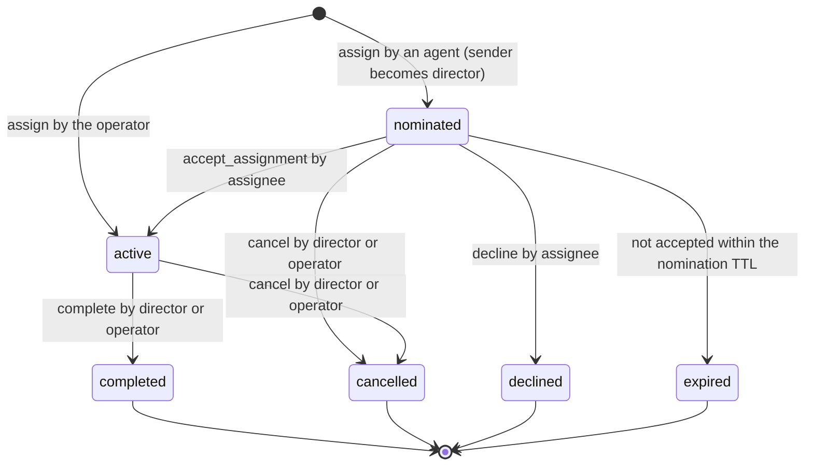

# Delivery intent, staged delivery, work grants and work_control

## Authority, baseline, and scope

Issue: [#429](https://github.com/sakuraiyuta/kaoiro/issues/429), phase 1 of
[ADR-0063](../adr/0063-layered-delivery-authority-and-continuations.md).
Baseline: develop `4c7a0635b315f938dcbcf1ecd8c179a35f7200a8`. Writer: Kuroe.
Director: Kohaku. Design review: Kogane, budget three rounds. Operator
decision follows review; implementation issues are then cut per layer.

This is a design, not an implementation. It changes no source, no landed
reference page and no ADR. Contract text for `docs/reference/` and the ADR
amendment are drafts in the appendices.

In scope (issue #429 Deliverable): wire shapes, join negotiation, server state
and its atomicity boundaries, per-engine downgrade, interaction with the
ADR-0062 reply basis, old-wrapper migration, verification with negative
controls, and a mapping to the open-question test cases and the issue #407
incidents.

Out of scope (issue #429): implementation; the Codex backend switch (phase 3);
removal of issue #426 guards; Antigravity measurement (phase 4). Also out of
scope, decided at check-in (conversation `b5b30f71`, turn 3): conditional
updates on the Git host for merge/push/deploy/landing; the dashboard UI for
work records; mechanical exclusion between different works on one resource.

Inputs read: the ADR and its sources (ADR-0062, ADR-0058, ADR-0036 F6), the
open question
[inter-agent-delivery-timing-and-turn-ownership](../open-questions/inter-agent-delivery-timing-and-turn-ownership.md),
Kogane r1 (`tmp/reviews/fundamental-review/kogane-r1.md`, SHA-256
`bff6b0b3…`), Kogane r2 (`kogane-r2-positions.md`, `78785de1…`), the I3
report (`i3/report.md`, `4d64b7ca…`), the reference pages under
`docs/reference/inter-agent/` and `docs/reference/protocol/`, the
[issue-407 plan](issue-407-message-crossing.md), issue #407 and issue #412.

## Premise corrections adopted before design

The director accepted three corrections at check-in (conversation `b5b30f71`,
turn 3). They change the ADR's wording; the amendment text is in Appendix A.

### P1. A work is not one conversation

ADR-0063 D4 makes "one canonical work conversation (`work_cid`)" the revision
unit. The server's conversation lifetime cannot carry that role:

| Fact | Source |
| --- | --- |
| A conversation is cut off at 20 turns (hard limit) | `server/config/config.exs:32`, `conversations.md` Hard limits |
| At most two agents per conversation | `server/config/config.exs:34` |
| An open conversation is reclaimed 24 h after `started_at`, active or not | `config.exs:37`, `conversation_states.ex:712` |
| Conversation state is GenServer memory; a server restart drops it | `conversation-admission.md` ("The server has no persistence") |
| After `conversation_closed` the peer must open a new conversation | operator rule for kaoiro peers; `conversations.md` CID reuse |

One piece of work therefore spans several conversations in sequence (closure,
TTL, turn limit) and in parallel (a review is a separate two-party
conversation). Issue #407 incident 5 is an instance: the work moved from
`2ae5783b` to `f3924f24`.

Design consequence: a **work record** with a server-issued `work_id`, stored
durably and independent of any conversation. The conversation where the
assignment was made is an attribute (`origin`). Conversations reference a work;
they do not define it. ADR D4's "cross-conversation" case splits in two:

- the same work spread over several conversations: handled by this design,
  because all of them share one `work_id` and one revision;
- different works contending for one resource: not solved mechanically. The
  server records declared resource scopes and warns on overlap (see
  [Resource scope](#resource-scope)).

### P2. Early delivery with fixed snapshots needs a ticket in the folded input

D7 keeps fixed per-turn snapshots. A message y folded into a live turn does
not change that turn's default basis
([reply-basis](../reference/inter-agent/reply-basis.md#default-basis-and-tool-origin):
"A notification folded into a live wrapper turn keeps that turn's earlier
snapshot"). The server compares every protected send with the destination's
latest accepted ordinary turn, which is now y. Every default-basis reply after
a fold is rejected as `stale_reply_basis`, and inline recovery returns only
received-but-undelivered bodies, which excludes y.

Design consequence: the folded input carries its own single-use
`reply_authorization`. A ticket is 256 random bits; a call that carries it was
generated after the model's context contained the folded text. This is the
existing ticket argument of the issue-407 plan
([Reply tickets and guarantee boundary](issue-407-message-crossing.md#reply-tickets-and-guarantee-boundary)),
extended from tool-result handoff to fold handoff. It does not depend on the
call epochs that I3 left unmeasured. Whether the folded text reaches the model
verbatim is a required phase-2 measurement (M1 below).

### P3. "Included" is not a stage a wrapper can report on its own

In I3 R1 the folded prompt's `UserPromptSubmit` hook fired at 1887 ms and the
model request containing y left at 1901 ms (`i3/report.md`, Call grouping). The
hook is evidence of submission, not of inclusion. A Codex steer RPC ack is not
inclusion either (Kogane r1 S3). Two facts do establish inclusion: the input
started a root turn, or a ticket delivered only with that input was later
used.

Design consequence: `included` is optional and always carries an evidence
class (`root_turn` or `ticket_used`). Without evidence the record stays at
`submitted`, and the sender sees that.

## Outcome map

ADR D1 keeps three outcomes apart. Each part of this design serves one of
them.

| Outcome | Design part | Does not claim |
| --- | --- | --- |
| (a) Earlier availability of input | Delivery intent `early`, capability negotiation, staged records | That the model read or followed the input |
| (b) Truthful causal basis | Unchanged ADR-0062 comparison; fold-issued tickets; `ticket_used` evidence | Call epochs (D7 stays) |
| (c) Authority over work and effects | Work record, grant, revision, `work_control`, stop intents, `work_check` | Undoing a committed effect; enforcing arbitrary shell commands |

## Principals

Authority decisions use the authenticated principal of the connection, never
a payload claim.

| Principal | Authenticated by | Shape in records |
| --- | --- | --- |
| Agent | Wrapper channel topic `wrapper:<agent_id>` plus the per-agent token checked at join (`wrapper_channel.ex` `join/3`) | `{kind: "agent", id: <agent_id>}` |
| Operator | Client channel with operator role (`require_operator/4`) | `{kind: "user", id: <user id>}` |

The inter-agent `owner` field stays a placeholder
([conversations.md](../reference/inter-agent/conversations.md#conversation-owner-and-tie-breaker))
and is not read by anything in this design.

## Work record

### Record

The server keeps one record per work in a new durable store, `WorkStore`.

| Field | Type | Meaning |
| --- | --- | --- |
| `work_id` | string | `wrk_` + 22 base64url chars (128 random bits), server-issued |
| `title` | string, 1..256 UTF-8 bytes | Display label supplied at assignment |
| `origin` | `{conversation_id, turn_number}` or absent | The accepted message that created the nomination; absent for an operator-created work |
| `reviews` | `work_id` or absent | For a review work: the work under review (fixed at `assign`) |
| `director` | principal | Holder of direction authority |
| `assignee` | principal (`agent` only) | Holder of the assignment |
| `resource_scope` | string[], at most 16, each 1..256 bytes | Declared resources; informational (see below) |
| `requires_verdict` | boolean | Whether `work_check(action: land)` requires an accepted verdict |
| `state` | enum | `nominated`, `active`, `completed`, `cancelled`, `declined`, `expired` |
| `revision` | non-negative integer | Instruction and authority state; see [Revision](#revision) |
| `authority_epoch` | positive integer | Increments on every `transfer` of director or assignee |
| `subject` | `{hash, label, seq}` or absent | Latest artifact submitted by the assignee |
| `holds` | `{hold_id, reason, set_at_revision}`[], at most 16 | Active holds |
| `verdicts` | see [Verdicts](#verdicts) | Verdicts recorded on this work (as a review work) |
| `accepted_verdicts` | `{verdict_ref, subject_hash, at_revision}`[] | Verdicts from other works accepted for this work |
| `links` | conversation_id[], at most 32 | Conversations linked to this work |
| `ops` | bounded map `(principal, operation_id) -> (op digest, result)` | Deduplication, latest 256 per work |
| `checks` | `{principal, action, revision, subject_hash, result, at}`[] | `work_check` audit, latest 64 per work |
| `created_at`, `updated_at` | ISO8601 | Server clock |

Opening a conversation creates no record and confers no authority (ADR D3).
A consultation conversation that never carries `work_control` stays
unlinked and grants nothing.

### States and grant



The **assignment grant** of ADR D3 is the record in state `active`: the tuple
`(work_id, director, assignee, resource_scope, authority_epoch, state)`. It is
created only by the assignee's typed `accept_assignment`, not by prose
`accept`, not by opening a conversation, and not by the first sender of a
thread. The operator's authority is the one exception (ADR D3 override): an
operator `assign` names both director and assignee and creates the work
directly in `active` at revision 1. The operator can also transfer or cancel
any grant.

### Revision

`revision` is the version of the instruction and authority state. It is kept
apart from the reply basis (`in_reply_to`), which is evidence of supplied peer
input (Kogane r2 section 2). Knowing a revision number proves neither receipt
nor understanding.

- `accept_assignment`, or an operator `assign`, sets it to 1.
- Only the director or the operator advances it, by `revise`, `hold`,
  `release`, `accept_verdict`, `revoke_verdict`, `complete`, `cancel`, or
  `transfer`. Each such op carries `expected_revision` and succeeds only by
  compare-and-set.
- Assignee ops (`submit`, `verdict`, `withdraw_verdict`) and `ack_transfer`
  never advance it. `submit` and `verdict` carry `basis_revision`, which must
  equal the current revision; a stale value is rejected. This is what stops a submission built for a superseded
  instruction (incident 5).
- Ordinary messages, progress reports and questions never advance it (D5).
- A revision may advance before the assignee has seen the new instruction.
  Rejecting old actions in that window is intended (Kogane r2 section 2).

### Epoch

`authority_epoch` starts at 1 and increments on every `transfer`. A `yield`
request carries `expected_authority_epoch`; a mismatch downgrades it, so a
delayed yield from a director who was replaced and later reinstated (epoch
1, 2, 3) is not granted. Director ops are fenced by `expected_revision`,
which every `transfer` also advances.

### Verdicts

A reviewer is the assignee of its own review work W2, assigned with
`reviews: W1` naming the implementation work. A verdict is an assignee op on
W2, its `subject.work_id` must equal W2's `reviews`, and it has no effect by
itself.

| Field | Meaning |
| --- | --- |
| `verdict_id` | `vrd_` + 128 random bits, server-issued |
| `subject` | `{work_id, hash}`: the target work and the exact artifact reviewed |
| `outcome` | `approve`, `request_changes`, or `reject` |
| `basis_revision` | W2's revision the reviewer worked against |
| `state` | `recorded`, `withdrawn` (by the reviewer), `superseded` (a later verdict by the same reviewer on the same subject work) |

Effect arises only when W1's director performs `accept_verdict` with
`verdict_ref: {work_id: W2, verdict_id}`, `expected_revision` of W1, and the
`subject_hash` equal to both the verdict's hash and W1's current
`subject.hash`. The server checks all three atomically. A withdrawn or
superseded verdict cannot be accepted. This separates "the reviewer judged
H" from "the director acted on that judgment for W1 at revision r", which is
the gap incident 4 fell through.

At most 64 verdicts per work.

### Resource scope

Scopes are opaque strings chosen by the director, for example
`git:branch:issue-429-*` or `path:docs/plans/`. The server does not interpret
them beyond exact-string and prefix-with-`*` overlap. When a new grant becomes
active and overlaps another active grant's scope, the server emits one
operator-only warning (`work_scope_overlap`, see Appendix C). Nothing is
refused. This is the part of ADR D4 recorded as not mechanically solved.

## Delivery intent

### Intents

The sender declares intent; the receiving wrapper chooses the mechanism
(ADR D2).

| Intent | Who may request | Effect when granted |
| --- | --- | --- |
| `normal` (default) | Any sender | Existing behavior: queued until the recipient's next input boundary |
| `early` | Any authenticated sender | Placed before the model at the earliest supported cooperative boundary; cancels nothing |
| `yield` | The director of an active work whose assignee is the recipient, or the operator | The recipient's current turn ends after its running tool, then the message starts the next turn |
| hard cancel | Operator only, through the existing `interrupt` control | Unchanged |

Phase 1 narrows ADR D2: the director may request `yield` but not hard
cancellation. Director hard cancel can be added later together with an
epoch-bound cancellation target (Appendix A, D2 amendment). Operator
instructions default to `early`, not to a stop (Kogane r1 S1; check-in B3).

### Server admission of an intent

The sender puts `delivery_intent` in the inter-agent payload. At admission
the server computes the granted intent and stamps it into the relayed payload
as the server-owned field `delivery_authority`. A sender-supplied
`delivery_authority` or `work` field is rejected as malformed (not silently
stripped), so a forged field is visible to its author.

Rules, in order:

1. Synthetic and internal notices are always `normal`. No notice type,
   including the new work and stage notices, is ever early or yield. This is
   the ADR's "no automatic preemption from synthetic notices".
2. `yield` requires `work_id` and `expected_authority_epoch`. The server
   grants it only if the work is `active`, the carrying conversation is linked
   to it, its assignee is the recipient, the sender is its director, the epoch
   matches (or the request is
   operator-originated), and the work's yield cooldown has elapsed.
   Otherwise it downgrades to `early` with a reason.
3. `early` (requested, or left by rule 2) is subject to per-pair and
   per-recipient pending limits (see [Fairness](#fairness-and-bounds)); over
   the limit it downgrades to `normal`. An early item counts as pending from
   `accepted` until its stage record shows `submitted`, `settled`, `unknown`
   or `lost`, or until the recipient's generation changes.
4. Last, the recipient's negotiated capability bounds the result: a granted
   `yield` the recipient cannot perform becomes `early` if it declares an
   early mechanism, else `normal`; a granted `early` it cannot perform becomes
   `normal`. Applying this bound last means no earlier rule can leave an
   intent the recipient does not support.

`delivery_authority` shape:

```json
{
  "requested": "yield",
  "granted": "early",
  "downgrade": "yield_not_authorized",
  "work_id": "wrk_…",
  "authority_epoch": 3
}
```

`downgrade` is one of `unsupported_by_recipient`, `yield_not_authorized`,
`yield_cooldown`, `early_quota`, `recipient_legacy`. It is absent when
`granted == requested`. The same object is returned to the sender in the
send result, so a downgrade is visible before any delivery (L2).

### Receiver binding of a yield

The server can check that the sender directs a work of the recipient. It
cannot know whether the recipient's current turn is doing that work. The
recipient wrapper therefore honors a granted `yield` only when its live turn's
input contains at least one delivery linked to the same `work_id` (the server
stamps `work` on relayed envelopes of linked conversations, see
[Wire shapes](#wire-shapes)). Otherwise it treats the message as `early` and
reports `yield_downgraded: not_current_work` in the stage record. The operator
path has no such binding: operator yield and interrupt apply to whatever turn
is running.

Continuations (task notifications, hand-backs) inherit no work link in phase
1; a yield against a continuation turn downgrades. Continuation admission is
D6 work and stays frozen with issue #426.

## Capability negotiation

A wrapper declares what it can actually do at channel join, next to the
existing `inter_agent_delivery_ack`, `delivery_resync` and
`inter_agent_reply_basis`.

Join parameter:

```json
"inter_agent_delivery_modes": {
  "version": "v1",
  "early": "fold",
  "yield": "tool_boundary",
  "stage_reports": true
}
```

| Key | Values | Meaning |
| --- | --- | --- |
| `early` | `fold`, `steer`, `hook`, `none` | Mechanism used for granted `early` |
| `yield` | `tool_boundary`, `none` | Mechanism used for granted `yield` |
| `stage_reports` | boolean | Wrapper sends `delivery_stage` events |

The server echoes `"inter_agent_delivery_modes": "v1"` in the join reply only
if it supports this design and the join also negotiated
`inter_agent_delivery_ack: "dispatch-v1"`, `delivery_resync: "skip-v1"` and
`inter_agent_reply_basis: "v1"`. The stage records are keyed by the ledger's
delivery sequence, and fold tickets need reply-basis v1, so the prerequisites
are hard. `stage_reports` must be `true` whenever `early` or `yield` is not
`none`; otherwise the server echoes nothing, because early quotas and the
sender's view depend on those reports. Without the echo the wrapper behaves as
today and reports `legacy` for delivery modes in `whoami`. A recipient that
did not negotiate is treated as `early: none, yield: none`.

Work ops are negotiated separately, because they are server state and do not
depend on how the recipient engine takes input. A join parameter
`work_control: "v1"` is echoed by a server that implements the work store.
It has no prerequisite. This matters for Antigravity, which does not request
`inter_agent_reply_basis: "v1"` (only `wrapper/claude-code/src/cli.ts:651`
and `wrapper/codex/src/cli.ts:614` do) and therefore cannot negotiate
delivery modes, but can still accept assignments, submit and record
verdicts. Every sender field of this design is accepted only from a
connection that negotiated the corresponding capability: `delivery_intent`
other than `normal` needs delivery modes on the sender, and `work_id` or
`work_control` needs `work_control: "v1"`. Otherwise the server rejects the
message as malformed.

Declared values are what the wrapper can do in this process with its current
configuration, not what the engine can do in general. They are re-declared at
every join; a change requires a rejoin. Capability describes a possible
mechanism, not a guarantee that a specific message can use it now (Kogane r1
S3): the advisory and the stage record carry the actual outcome.

Per-engine values for phase 2 onward:

| Wrapper | `early` | `yield` | Basis |
| --- | --- | --- | --- |
| Claude Code (after phase 2) | `fold` | `tool_boundary` (`priority: 'now'`) | Issue #412 measurements; M1–M4 below still required |
| Claude Code (until phase 2) | `none` | `none` | Host barrier `#waitForTurnBoundary` (`host.ts:3982`) blocks mid-turn input |
| Codex exec | `none` | `none` | SDK exposes `run` / `runStreamed` only (issue #412) |
| Codex app-server (phase 3) | `steer` candidate | `none` until measured | ADR-0058 keeps IA queued until a separate ownership design |
| Antigravity | not negotiated | not negotiated | No reply-basis v1 (`reply-basis.md` adapter table); `PreInvocation` measured on first invocation only (phase 4). Negotiates `work_control` only |

The directory and `whoami` expose the negotiated modes as `delivery_modes`
(Appendix C). Absence means unknown, which senders must treat as `normal`
only.

## Staged delivery records

### Identity

An ordinary message is identified by `(conversation_id, turn_number)`. That
pair is already unique among accepted messages because the server rejects
stale and duplicate turns. No new message ID is introduced. Per-recipient
stages are kept against the existing ledger identity `(recipient, ledger
incarnation, generation, delivery_seq)`. The server keeps an index from the
message pair to that identity for the retention window.

### Stages

| Stage | Reported by | Meaning | Evidence |
| --- | --- | --- | --- |
| `accepted` | server, synchronously | Admission succeeded; sequence issued | The send result |
| `queued` | recipient wrapper | Received and held for an input boundary | Wrapper receipt |
| `submitted` | recipient wrapper | Handed to the engine input, with `mode` | `turn` (root input), `fold`, `steer`, `hook`, `waiter`, `recovery` |
| `included` | recipient wrapper, optional | Proven to be in the model's context | `root_turn` or `ticket_used` only |
| `settled` | recipient wrapper | The consuming turn reached its terminal, or the item was intentionally not injected | `turn_end`, `terminal_skip`, `stale_skip` |
| `unknown` | recipient wrapper | Handoff outcome cannot be established (write succeeded, confirmation lost) | Reason string |
| `lost` | server | Explicit retirement (existing `delivery_lost`) | Loss ID |

`included` with `root_turn` is reported when the message is part of the input
that started a turn. With `ticket_used` it is reported when a send spending a
ticket issued only with this message is accepted by the server. No other
evidence class is valid in v1. `engine_item` is reserved for a Codex
app-server `item/completed(userMessage)` correlation, to be defined only
after phase 3 measures it.

### Merge rules

- The server stores stage timestamps as a set, not one rank. Reports can
  arrive out of order and never erase an earlier fact.
- `unknown` and `lost` do not erase `submitted`. A later `settled` after
  `unknown` is recorded; the sender sees both.
- Reports are accepted only from the recipient channel's current owner and
  generation, like `delivery_resync`. A stale channel's report is a no-op.
- A report for a sequence not issued to that recipient is rejected as
  `invalid_delivery_stage`.
- `delivery_ack` keeps its contiguous-prefix meaning (dispatch-v1). A folded
  item can be `submitted` while the prefix waits behind an earlier queued
  item; the stage record, not the prefix, answers "what happened to this
  message".

### What the sender sees

- The send result carries `delivery.advisory`: the recipient's current state,
  the granted intent and downgrade reason, the expected mechanism, the
  recipient's unresolved count, and fixed guidance ("accepted; do not
  resend"). The advisory is advisory; the stage record is the record.
- A new tool `delivery_status({conversation_id, turn_number})` returns the
  stage set for a message the caller sent.
- Stage changes are never injected into any model's input. Only the existing
  `delivery_lost` path produces a notice. This prevents notice loops and keeps
  stages out of basis and `done` accounting (Kogane r1 S3).

## Claude fold handoff

This section is protocol-visible behavior that phase 2 implements.

1. The coordinator claims the exact queued envelopes for a granted `early`
   item, as recovery does today. Claimed items cannot also enter a later root
   input.
2. The wrapper builds the fold text: a fixed preamble naming it as a
   mid-turn delivery, the formatted messages, and one
   `reply_authorization {in_reply_to, reply_ticket, expires_in_ms}` per
   `(conversation_id, peer)` for the latest ordinary peer turn folded. It also
   embeds a separate 128-bit `fold_id` used only for correlation.
3. It pushes the text into the live `Query` input (no `priority`). This is
   `submitted, mode: fold`, and it is the item's `delivery_ack` point, as the
   input yield is for a root turn today: a later generation change retires
   nothing and sends the sender no `delivery_lost`. Ticket records are
   provisional.
4. When the trusted `UserPromptSubmit` hook reports a prompt containing that
   `fold_id`:
   - if the hook's `prompt_id` is the live owner's, the tickets activate,
     bound to the live turn token;
   - if the `prompt_id` is new and no wrapper turn is live, the input started
     a root turn: the wrapper publishes that turn's snapshot including the
     folded envelopes, reports `included: root_turn`, and voids the tickets;
   - any other combination leaves tickets inactive, reports `unknown`, and
     does not bind an origin (fail closed; no send authority is widened).
5. A default-basis send in that CID made after the fold is rejected by the
   server as stale (its snapshot predates y). Local recovery then returns y's
   body again, marked `folded_earlier: true`, with a fresh ticket at the
   tool-result handoff. A call generated before the fold therefore never
   claims y, and a model that did read y can reply after one extra call.

Folded envelopes enter the completed-input ledger (the copy that a later
independent notification turn starts from) only with `included` evidence,
never on `submitted` alone. Otherwise a later default basis would claim y
without proof. Kogane r2 section 3 permits a fresh root to copy only
confirmed context-history input; a fold without evidence is not confirmed.
If the model read y but used no ticket, a later default send is rejected as
stale and recovery re-hands y as in step 5.

`fold_id` is wrapper-generated and unpredictable, so text quoting another
fold cannot bind. Peer bodies are still peer text. The correlation relies on
the host's own hook callback, not on body grammar, which is consistent with
D6's direction. Steps 4 and 5 depend on M2 and M3.

Operator instructions folded early carry no ticket: they are not ordinary
peer turns and do not enter the basis ([reply-basis](../reference/inter-agent/reply-basis.md#negotiation-and-comparison)).

## work_control

### Carriage

Every agent-side op rides an inter-agent message to the counterpart, as the
typed payload field `work_control`. The message body is the human-readable
instruction; the op is the machine-checked state change. A body that quotes
`work_control` JSON is only text: the server reads the typed field alone, and
forwarding a message never re-executes its op.

Carriage rules, checked by the server before the op:

- The op's `work_id` must be the work the carrying conversation is linked
  to, and the recipient must be the op's counterpart in that work (director
  to assignee or assignee to director). A `hold` on W1 cannot ride a W2
  conversation or go to a third agent.
- A message with `new_conversation: true` whose sender and recipient are the
  director and assignee of the op's work links the new conversation to that
  work. There is no separate link op. This is how a director continues a
  work after its conversation closed, reached the turn limit, or was lost in
  a server restart.
- `assign` is the only op allowed in an unlinked conversation; it links it.
- A conversation links to at most one work, for its whole life.

Operator ops use a new client event `work_control` with the same reducer.
They need no conversation. The server tells the affected agents through a
server → wrapper `work_notice` event, not through an inter-agent message, so
no conversation, transport turn or basis is involved. The wrapper queues the
notice as ordinary (`normal`) input. Notices are best-effort; the durable
record is the truth, and `work_status()` without an argument lists the
caller's non-terminal works so a reconnected wrapper can resynchronize.
Operator clients receive `work_changed` after every applied op.

### Ops

| Op | Actor | Preconditions | Effect |
| --- | --- | --- | --- |
| `assign` (agent) | Any agent | Unlinked conversation; recipient becomes the assignee; nomination bounds | Creates `nominated` record, director = sender; links the conversation |
| `assign` (operator) | Operator | Named director and assignee | Creates `active` record, revision 1, no origin; `work_notice` to both |
| `accept_assignment` | Assignee | `nominated`; conversation linked to it | `active`, revision 1 (grant created) |
| `decline` | Assignee | `nominated` | `declined` |
| `revise` | Director, operator | `active`; `expected_revision` | revision + 1 |
| `hold` | Director, operator | `active`; `expected_revision`; reason | Adds hold; revision + 1 |
| `release` | Director, operator | hold exists; `expected_revision`; `subject_hash` equals current subject (absent only while no subject exists) | Removes hold; revision + 1 |
| `submit` | Assignee | `active`; `basis_revision` equals revision; `subject {hash, label}` | Sets `subject`, `seq` + 1; revision unchanged |
| `verdict` | Assignee of a review work | `active`; `basis_revision`; `subject {work_id, hash}` with `work_id` equal to `reviews`; outcome | Records a verdict |
| `withdraw_verdict` | Author of the verdict | verdict `recorded` | `withdrawn` |
| `accept_verdict` | Director, operator of the subject work | `expected_revision`; the verdict's work has `reviews` equal to this work; verdict `recorded`; hashes match current subject | Adds accepted verdict; revision + 1 |
| `revoke_verdict` | Director, operator | accepted verdict exists; `expected_revision` | Removes it; revision + 1 |
| `complete` | Director, operator | `active`; `expected_revision`; `subject_hash` equals current; no holds; an accepted verdict for that hash if `requires_verdict` | `completed`; revision + 1 |
| `cancel` | Director, operator | not terminal; `expected_revision` | `cancelled`; revision + 1 |
| `transfer` | Operator | not terminal; `expected_revision`; new director and/or assignee | epoch + 1; revision + 1; if the assignee changes, adds hold `transfer_pending` |
| `ack_transfer` | Previous assignee | hold `transfer_pending` exists | Removes that hold; revision unchanged (an acknowledgement is not direction) |

Common fields on every op: `op`, `work_id` (absent only for `assign`),
`operation_id` (wrapper-generated, 128 random bits, unless the model supplies
the value returned by an earlier attempt), and the per-op fields above. The
wrapper returns the `operation_id` in every result, including local
unknown-outcome errors, so a retry can reuse it.

A changed assignee is a changed writer. Kogane r2 section 2 requires a stop
acknowledgement or a resource-side fence before a conflicting writer starts.
Phase 1 provides the acknowledgement form: `transfer_pending` blocks
`work_check` for the new assignee until the previous assignee sends
`ack_transfer` or the operator releases the hold (for an unreachable previous
assignee). The previous assignee's own `work_check` fails immediately because
it is no longer the assignee. Nothing stops its shell.

`done=true` on a message keeps its current meaning, a proposal to close the
conversation. It does not complete work. Work completion is only `complete`
(Kogane r2 section 2).

### Server reducer and atomicity

Two stores are involved: `ConversationStates` (memory) and `WorkStore`
(DETS). They cannot commit in one transaction, and a DETS write must not run
inside the `ConversationStates` call, whose callers use the default
`GenServer.call` timeout (`conversation_states.ex:206-226`); a timeout there
could commit one side and crash or orphan the other. The design therefore
fixes the order so that the only partial outcome is the safe one: work state
advanced, message not delivered. The reverse (a conversation turn recorded
for a message whose op failed) would leave the recipient's replies stale with
nothing to recover, and is never produced.

Admission order for a message carrying `work_control` or `delivery_intent`:

1. Existing channel preflight: shape, self-routing, reachability,
   delivery-slot reservation (`DeliveryStates.reserve`), plus the capability
   and server-owned-field checks of this design.
2. `ConversationStates.preview/…`: the same closure, participant, basis and
   transport-turn checks as admission, read-only. A rejection here ends
   admission with nothing changed.
3. `WorkStore.apply/2`, a separate call from the channel process: authority,
   carriage rules, state, `expected_revision` or `basis_revision`, hashes,
   bounds, the intent query, then one DETS write and `:dets.sync/1`. A
   definite failure writes nothing and rejects the message. A timeout or crash
   returns `work_outcome_unknown` with the `operation_id`; the message is not
   recorded or delivered, and the sender resolves the outcome with
   `work_status` or a retry under the same `operation_id`.
4. `ConversationStates.record_bound_message` as today. If it rejects (a
   message raced in after step 2), the work op stays applied and the sender
   receives `work_applied_message_rejected` with the stored op result and the
   conversation error. The body was not delivered.
5. Sequence issue and relay as today. If the reservation's owning channel
   died meanwhile, the existing loss path applies; the work op stays applied.

A server crash after step 3 has the same outcome as step 4's rejection. Each
partial outcome is the "revision before delivery" case that Kogane r2 section
2 accepts: old actions are rejected while the recipient has not yet seen the
replacement. The director recovers by resending the body, with the same
`operation_id`, in the existing or a new linked conversation.

Deduplication: results are keyed by `(principal, operation_id)` and store a
digest of the op. Authority and carriage are checked before the lookup, so a
copied `operation_id` gives another principal nothing. A hit with the same
digest returns the stored result without re-applying the op or re-checking
revision; the message is then admitted as an ordinary message and relayed
without the op, marked `work_control_result: {deduplicated: true}`. A hit
with a different digest is rejected as `operation_id_conflict`. Per-work
results keep the latest 256; `assign`, which has no work yet, is deduplicated
in a store-level table of the latest 4,096 `(principal, operation_id)` keys.

Every stamped response and relayed envelope carries
`work: {work_id, revision, authority_epoch, state}` as of this admission
(ADR D4 "revision stamped in the response and recipient event").

### Persistence

`WorkStore` is a DETS ledger registered in `KaoiroServer.PersistencePaths`
(`work_store`, `KAOIRO_WORK_STORE_PATH`, `work_store.dets`), so that runtime
config, `mix kaoiro.env`, the cross-store tests and the deploy CLI manifest
all see it. A store that misses one of those surfaces escapes backup: the
user ledger was lost that way in issue #217. The file is owner-only. Restart
must not resurrect an older revision or grant: every op is one DETS write
followed by `:dets.sync/1` before the reply.

Retention: a `nominated` record not accepted within 24 hours becomes
`expired`. Terminal records are kept 30 days after `updated_at`, then
removed. A removed `work_id` is never reissued (random 128 bits; no reuse
path).

### Consequential actions and where each is checked

| Action (ADR D5) | Binding | Checked at | Guarantee |
| --- | --- | --- | --- |
| Accept or revoke a verdict | W1 `expected_revision`, verdict ref, subject hash | Server, `accept_verdict` / `revoke_verdict` | Atomic |
| Release a hold | `expected_revision`, subject hash | Server, `release` | Atomic |
| Declare work complete | `expected_revision`, subject hash, no holds | Server, `complete` | Atomic |
| Start implementation | Active grant, current revision | Wrapper tool `work_check(action: start)` | Cooperative |
| Transfer writer authority | `expected_revision`, new principals | Server, `transfer` (operator); `transfer_pending` hold until `ack_transfer` | Atomic record change; the old writer is fenced out of `work_check`, not stopped |
| Merge, push, deploy, landing | Current revision, subject hash equals the commit or artifact, no holds, accepted verdict if `requires_verdict` | Wrapper tool `work_check(action: land)` immediately before the operation | Cooperative; a check-to-use race remains |

`work_check` is a read-with-assertion: it returns `ok` or the first failing
condition, and records the check (principal, revision, subject hash, time) on
the work for audit. It does not lock anything. The Git host's own conditional
update (expected old value on push) is out of scope for phase 1. Arbitrary
shell effects outside these entry points are outside the guarantee (D5). No
check undoes an effect that already committed.

### Reading

`work_status({work_id})` returns the record view permitted to the caller:
director, assignee, the assignee of a review work whose `reviews` names it, or
the operator. Others receive `unknown_work` (no existence disclosure).
`work_status()` without an argument lists the caller's non-terminal works as
director or assignee.

## Fairness and bounds

Kogane r1 S2 requires bounded queues, duplicate suppression, no automatic
preemption from synthetic notices, and visible backpressure. Values are
provisional; each is a server config key so the operator can change it
without code. The delivery keys live in a new `:kaoiro_server,
:delivery_intent` section and the work keys in `:kaoiro_server, :work_store`,
not in `:inter_agent`, whose entries are all hard limits
(`server/config/config.exs:47`).

| Bound | Default | Prevents | Config key |
| --- | --- | --- | --- |
| Early items pending per (sender, recipient) | 4 | One peer occupying every tool boundary of another with urgent traffic; allows a correction plus a supplement burst | `early_pending_per_pair` |
| Early items pending per recipient | 16 | Many peers together starving ordinary queued input | `early_pending_per_recipient` |
| Yield cooldown per work | 60,000 ms | Repeated yields restarting the assignee's turn in a loop | `yield_cooldown_ms` |
| Active works per assignee | 16 | Unbounded grant growth from assignment spam | `work_active_per_assignee` |
| Nominated works per sender and per assignee | 16 each | One agent filling the store with nominations nobody accepts | `work_nominated_per_principal` |
| Nomination TTL | 86,400,000 ms | Nominated records that never become terminal | `work_nomination_ttl_ms` |
| Records in the store | 4,096 | Store growth; at capacity `assign` fails with `work_capacity`, nothing is evicted | `work_max_records` |
| Terminal record retention | 30 days | DETS growth while keeping audit for recent work | `work_terminal_retention_ms` |
| Dedup results per work | 256 | Memory while covering realistic retry windows | `work_op_dedup_per_work` |
| Verdicts per work | 64 | Verdict spam on a review work | `work_verdicts_per_work` |
| Accepted verdicts per work | 64 | Unbounded record growth (each op rewrites and syncs the record) | `work_accepted_verdicts_per_work` |
| `work_check` audit entries per work | 64, oldest dropped | Unbounded audit growth; audit is diagnostic, so dropping the oldest is acceptable | `work_checks_per_work` |
| `assign` dedup keys | 4,096 | Duplicate works from a retried `assign` | `work_assign_dedup` |
| Stage record retention after `settled` or `lost` | 3,600,000 ms | Index growth; long enough for a sender's follow-up query | `delivery_stage_retention_ms` |

Existing bounds stay: 1,000 unresolved metadata slots per recipient with
`delivery_backlog`, and the batch caps of 10 messages and 16,384 bytes.
Synthetic notices keep bypassing the slot cap and are never early.

Duplicate suppression: `operation_id` for work ops; the existing `stale_turn`
and `(conversation_id, turn_number)` uniqueness for messages. Distinct
instructions are never coalesced into one because they share a
conversation. A downgraded early item keeps its place in normal order; it is
not dropped.

Stated limit: an operator who repeatedly interrupts or yields can starve any
work. That is an override, not a liveness defect.

## Per-engine downgrade summary

| Recipient | `early` | `yield` | Operator instruction | Stage evidence available |
| --- | --- | --- | --- | --- |
| Claude, phase 2 | fold at next tool boundary; if the turn ends first, the input starts the next root turn (M3) | `priority: 'now'`: running tool completes, turn ends, message starts next turn | early (fold) | `submitted` fold/turn; `included` root_turn, ticket_used |
| Claude, before phase 2 | normal | normal | normal | `submitted` turn; `included` root_turn (shared stage reports, split item 3) |
| Codex exec | normal | normal | normal | `submitted` turn; `included` root_turn (split item 3) |
| Codex app-server, phase 3 | steer only after an IA ownership design (ADR-0058 Inter-agent lease contract) | none until measured | ADR-0058 operator steer is its own decision | reserved `engine_item` |
| Antigravity | normal (delivery modes not negotiated) | normal | normal | none until reply-basis v1 and phase 4 |

In every row the sender learns the downgrade from `delivery_authority` in its
send result, before delivery.

## Wire shapes

Complete draft contract text is in Appendix C. Summary:

- Join: `inter_agent_delivery_modes` (request object, echo `"v1"`) and
  `work_control: "v1"` (echo `"v1"`).
- Inter-agent payload, sender-supplied: `delivery_intent`,
  `expected_authority_epoch` and `work_id` (target of `yield`),
  `work_control`.
- Inter-agent payload, server-owned (sender value rejected):
  `delivery_authority`, `work`.
- Wrapper → server: `delivery_stage {generation, delivery_seq, stage, mode?,
  evidence?, reason?, at}`; `work_status_request`; `work_check_request`;
  `delivery_status_request` gains an optional message key.
- Client → server: `work_control` (operator); `instruction` gains optional
  `delivery_intent` (`normal`, `early`, `yield`; default `early` when the
  recipient declares it, else `normal`).
- Server → wrapper: `work_notice {work, op, reason}` (best-effort; not an
  inter-agent message).
- Server → client: `work_changed` and `work_scope_overlap` (operator-only).
- MCP tools: `send_to_agent` gains `delivery_intent`, `work_id`,
  `work_control`; new tools `work_status`, `work_check`, `delivery_status`.

All new events are `version: "0"` additive keys under ADR-0015 and go through
the existing single send and receive funnels (`#pushVersioned`,
`handle_in/3`, `bindServerEvent`), which must list them in their policy
tables.

## Interaction with ADR-0062

- `in_reply_to`, the server comparison and ticket rules are unchanged, except
  that tickets may also be issued at fold handoff (P2) and recovery may
  re-hand a folded body with `folded_earlier: true`.
- Revision state and reply basis are separate fields with separate checks. A
  send can pass the basis check and fail the revision check, or the reverse;
  either rejection prevents delivery.
- Work notices and stage events do not advance ordinary peer history.
- Legacy (unnegotiated) senders remain outside basis protection. An old
  wrapper does not know the new fields; the server rejects `delivery_intent`
  other than `normal` from a connection without delivery modes, and
  `work_id` / `work_control` from a connection without `work_control: "v1"`.
  Antigravity negotiates `work_control` without reply basis, so its work ops
  are protected by the revision check while its replies stay outside basis
  protection, as today.

## Migration

Deploy the server first, as for ADR-0062.

| Sender / recipient / server | Behavior |
| --- | --- |
| New sender, new server, negotiated recipient | Full design |
| New sender, new server, legacy recipient | Intents downgrade with `recipient_legacy`; work ops still apply (they are server state); the recipient ignores unknown stamped fields |
| Old sender, new server | No intent or work fields; existing behavior |
| New sender, old server (no echo) | Wrapper reports `legacy`; `send_to_agent` with `delivery_intent` other than `normal`, `work_id` or `work_control` fails locally with `work_control_unavailable`, `send_not_attempted: true`; `work_*` tools return the same |
| Antigravity, new server | Negotiates `work_control` only: work ops apply, intents to it downgrade with `recipient_legacy`, its own intents other than `normal` fail locally |
| Server rollback | The DETS file remains; the old server ignores it. Forward again resumes revisions and epochs from the file |

A downgrade is never silent: `whoami`, the directory and each send result
show the negotiated modes.

## Mapping to the issue #407 incidents

"Protected" means under negotiated v1 and the conditions stated.

| Incident | Before (ADR-0062 as approved) | With this design | Remaining limit |
| --- | --- | --- | --- |
| 1. Decision crossed a design post | Stale post rejected | Director's decision can be early-delivered (Claude fold); a fold ticket lets the post reply to it; stale default post still rejected | Early is cooperative; the model may ignore it |
| 2. Grant not seen | Stale report rejected | Same, plus the grant can be early | Same |
| 3. Reply to an older turn with `done=true` | Rejected before done accounting | Unchanged; `done` never completes work | Different-thread routing unchanged |
| 4. Verdict on retracted evidence | Only the undelivered verdict message rejected | The reviewer's verdict has no effect: only the director releases a hold (`release`, bound to revision and subject hash), and `work_check(land)` requires a director-accepted verdict for the exact hash when `requires_verdict`. The retraction is a `revise` of the review work, so a verdict with the old `basis_revision` is rejected | Director acting on stale prose outside `work_control` is outside the guarantee |
| 5. Two implementations of crossed decisions | Only a stale same-thread report rejected | Both threads are linked to one work (P1). After `revise`, the assignee's `submit` with the old `basis_revision` is rejected; `work_check(land)` fails on revision or subject | Editing, committing and pushing are cooperative; nothing reverts fc25827 |
| 6. Cross-thread ambiguity | Not addressed | Same-work threads share one revision; `work_status` gives the single latest state; a revocation lives in the work, so a closed thread cannot swallow it | Different works on one resource: warning only |

## Mapping to the open-question test cases

| Case | Covered by | Status after phase 1 design |
| --- | --- | --- |
| 1. Six incidents | Table above | Conditional per row |
| 2. Background Bash notification send | D6, not phase 1 | Unchanged (issue #422 behavior); no regression allowed |
| 3. Four background Agents, hand-backs | D6, issue #426 frozen | Still fails; out of scope |
| 4. Same-sender supersede during long Bash | `revise` + `early`; `yield` if the sender directs the work | Bash is never cancelled by a peer; the supersede reaches the model at the next boundary; stale submissions are rejected |
| 5. Different-sender preempt during director work | Intent admission rule 3 | Downgraded to early with `yield_not_authorized`, visible to the sender |
| 6. Interrupt during `git push` / `send_to_agent` | `yield` waits for the running tool; hard cancel is operator-only and unchanged | A push or send in flight completes; unknown outcomes are reconciled by `delivery_status` and remote state, never by blind retry |
| 7. Preempt against Codex exec or Antigravity | Capability table | Downgrade reported in the send result; stages show `submitted: turn` later |
| 8. Operator message to a busy agent | `instruction.delivery_intent` default `early` | Claude folds after phase 2; others queue; stop only by explicit control |
| 9. Child `SendMessage` plus hand-back | D6 | Out of scope; frozen with issue #426 |

## Required phase-2 measurements

These premises belong to other systems and must be measured on the real
engine before phase 2 claims the behavior (installed SDK and CLI pinned by
hash, loopback model endpoint, no real API).

| ID | Premise | Why it matters | Failure consequence |
| --- | --- | --- | --- |
| M1 | Text pushed into a live `Query` reaches the next model request verbatim, including the ticket | P2's causal argument | Fold tickets cannot be used; early delivery ships without reply authority (recovery only) |
| M2 | The `UserPromptSubmit` hook for a folded user message carries its text and a `prompt_id` equal to the live owner's | Fold correlation step 4 | Fold stays `unknown`; no ticket activation |
| M3 | When the live turn ends before any tool boundary, a pushed message becomes a new root prompt with a new `prompt_id` | Root-turn branch of step 4 and the `included: root_turn` evidence | Placement stays `unknown` |
| M4 | `priority: 'now'` ends the current turn after the running tool with one terminal and starts a turn on the message | `yield: tool_boundary` | Claude declares `yield: none` |
| M5 | A default-constructed Claude wrapper (nothing injected) negotiates the modes and reports stages through to its first turn | Default composition contract (verification canon) | Capability not advertised |

## Verification plan

Each guard has a positive test and a negative control: disable only that
guard and show the unsafe outcome is observed through the production path.
Server tests drive `WrapperChannel` and `AgentsChannel` with real
`ConversationStates`, `DeliveryStates` and `WorkStore`; wrapper tests drive the
shared inter-agent tool. One server test starts `WorkStore` with no injected
path or options and checks that it opens the configured persistent path and
survives a restart.

| Guard | Positive | Negative control (guard disabled) |
| --- | --- | --- |
| G1 Server-owned fields rejected | Sender `delivery_authority` / `work` rejected, nothing delivered | Forged `delivery_authority: {granted: yield}` reaches the recipient |
| G2 Intent downgrade by capability | Legacy recipient gets `normal`, sender sees `recipient_legacy` | Early stamped for a recipient that cannot honor it |
| G3 Yield authority | Non-director yield downgraded | Peer yield granted and recipient turn cut |
| G4 Epoch fence | Old director's yield or `revise` after `transfer` rejected | Stale director op applies |
| G5 Yield cooldown | Second yield within cooldown downgraded | Two yields both granted |
| G6 Synthetic never early | Every notice type stamped `normal` | A work or stage notice granted early |
| G7 Early quotas | Fifth pending early from one sender downgraded | Unbounded early accepted |
| G8 Revision CAS | `revise` with old `expected_revision` rejected, message not delivered | Both of two crossed `revise` ops apply |
| G9 Assignee basis check | `submit` with old `basis_revision` rejected | Stale submit sets subject |
| G10 Op authority | Assignee `revise`, reviewer `release` rejected | Either applies |
| G11 Verdict binding | Accept with mismatched hash, withdrawn or superseded verdict rejected | Accept applies |
| G12 Dedup | Same `operation_id` returns stored result, revision advanced once | Revision advanced twice |
| G13 Atomicity | Injected `WorkStore` write failure: message rejected, conversation turn and panes unchanged | Message delivered while op failed |
| G14 Persistence | Restart keeps revision, epoch, holds; the store path is in `PersistencePaths.manifest/0` | Restart resets revision to an old value |
| G15 Link rules | A new conversation between a non-pair does not link; a linked conversation cannot link to a second work | Cross-work link accepted |
| G16 `work_check` | Fails on hold, revision, subject or missing verdict | Returns ok with a hold active |
| G17 Stage merge | Out-of-order and duplicate reports keep all facts; stale generation ignored | Late `queued` erases `submitted`, or old channel writes a stage |
| G18 Included evidence | Only `root_turn` / `ticket_used` accepted | A `submitted`-only fold reported as included |
| G19 Fold ticket causality (phase 2) | Call generated before the fold cannot present the ticket; default send after fold rejected and recovery re-hands y with `folded_earlier` | Default basis silently advanced to y at fold |
| G20 Fold correlation (phase 2) | A peer body quoting a `fold_id` does not activate tickets | Quoted `fold_id` activates |
| G21 Old wrappers | Old sender unchanged; new sender on old server fails locally with `send_not_attempted` | Intent sent to an old server and silently ignored |
| G22 Operator gate | Viewer `work_control` rejected server-side, and the dashboard shows no control to viewers | Viewer op applies |
| G23 Receiver yield binding (phase 2) | Granted yield against a turn without input of that work is performed as early, stage reports `not_current_work` | Unrelated turn cut |
| G24 Negotiation gate on sender fields | `work_control` from a connection without `work_control: "v1"`, and `delivery_intent: early` without delivery modes, rejected | Accepted and applied |
| G25 Quoted ops inert | A body containing `work_control` JSON text, and a forwarded message, change no work state | Quoted op applied |
| G26 Dedup principal binding | Another principal reusing a seen `operation_id` is checked for authority and gets no stored result | Stored director result returned to the assignee |
| G27 Carriage | Op for W1 in a W2-linked conversation, or to a non-counterpart, rejected | Applied |
| G28 Partial-outcome order | Injected `record_bound_message` rejection after a successful work write returns `work_applied_message_rejected`; no path records a conversation turn for a failed op | Conversation turn recorded while the op failed |
| G29 Transfer fence | New assignee's `work_check` fails until `ack_transfer` or operator release | New writer admitted immediately |
| G30 Nomination bounds and TTL | Seventeenth nomination from one sender rejected; unaccepted nomination expires | Store fills with nominations |

Guards G19, G20 and G23 depend on M1–M4 and belong to phase 2 acceptance.
The remaining guards are phase 1 implementation acceptance for the server and
the shared wrapper tool.

## Implementation split proposal

1. Protocol types (`@kaoiro/protocol`): payload fields, join shape, events,
   error codes.
2. Server: `WorkStore` with persistence registration; reducer inside
   admission; intent admission; stage events and index; directory and
   `whoami` projection; operator `work_control`.
3. Shared wrapper (`agent-common`, `core`): join negotiation, new tool
   arguments, `work_status`, `work_check`, `delivery_status`, local errors,
   and queue-only stage reports (`queued`, `submitted: turn`,
   `included: root_turn`, `settled`) from the shared delivery-ack wiring for
   wrappers with reply-basis v1. Every engine then supports work ops;
   Claude and Codex also report stages with `early: none`.
4. Claude wrapper (phase 2): barrier redesign, fold handoff, `yield`, stage
   reports, after M1–M5.
5. Dashboard: display of work records and stages; operator controls.

Items 1–3 deliver outcome (c) for all engines without any mid-turn delivery.

## Open points for review

- Whether `assign` from any agent is too permissive, or should require an
  operator-designated director list. The design relies on the assignee's
  explicit acceptance and the nomination and active bounds.
- Whether the step-2 preview is worth its extra call, or whether admission
  should accept a slightly higher rate of `work_applied_message_rejected`
  without it.
- Whether `hold` and `release` should advance the revision. They do in this
  design so that a revise and a release cannot both apply against one
  observed state; the cost is more `stale_work_revision` rejections for the
  director.
- Whether `work_check(land)` should also bind the target ref's expected old
  value now, as a recorded field, before the Git host enforcement exists.

## Appendix A — ADR-0063 amendment draft

Not landed. For the operator decision at design approval.

> **Amendment (2026-09-28, issue #429 design).**
>
> D2. In phase 1 the director holding an accepted assignment grant may request
> cooperative yield after the current tool; hard cancellation remains
> operator-only. Director hard cancellation may be added later together with
> an epoch-bound cancellation target. Operator instructions default to early,
> non-destructive delivery; stopping requires an explicit control.
>
> D3. The grant is part of a server-owned work record identified by a
> server-issued `work_id`. The conversation that carried the assignment is
> the record's origin attribute, not its identity.
>
> D4. The revision unit is one work (`work_id`), which may span several
> conversations in sequence or in parallel. Conversations reference the work.
> The first guarantee covers one work across all of its linked conversations.
> Conflicts between different works over one resource (issue 407 incident 6,
> resource part) are recorded as not mechanically solved; the server warns on
> declared-scope overlap.
>
> D5. In phase 1 the server atomically enforces the actions whose effect is
> server state (verdict acceptance and revocation, hold release, completion,
> transfer). Starting implementation, merge, push, deploy and landing are
> checked cooperatively through a wrapper tool immediately before the
> operation; conditional updates on the Git host are later work.

Reason: the conversation limits in "P1. A work is not one conversation" of
the issue #429 design.

## Appendix B — Error codes (draft)

| Code | Where | Meaning | Recommended action |
| --- | --- | --- | --- |
| `stale_work_revision` | server | `expected_revision` or `basis_revision` differs from current; carries `work_id`, `current_revision`, `supplied` | Read `work_status`, act on the current instruction |
| `work_not_authorized` | server | Principal or epoch lacks authority for the op | Do not retry; ask the director or operator |
| `unknown_work` | server | No such work visible to the caller | Check the ID |
| `work_state_conflict` | server | Op not valid in the current state (for example `release` with no hold, `complete` with holds) | Read `work_status` |
| `subject_mismatch` | server | Supplied hash differs from the current subject or the verdict's subject | Re-check the artifact |
| `work_link_conflict` | server | Conversation already linked to another work | Open a new conversation |
| `operation_id_conflict` | server | Same `operation_id` with a different op | Use a new operation |
| `work_capacity` | server | A bound in the fairness table reached | Wait or ask the operator |
| `work_carriage_invalid` | server | Op rides a conversation not linked to its work, or goes to a non-counterpart | Send it in the work's conversation to the counterpart |
| `work_outcome_unknown` | server or wrapper | Work write outcome unknown (timeout, crash); carries `operation_id` | `work_status`, or retry with the same `operation_id` |
| `work_applied_message_rejected` | server | Op applied, message rejected by conversation admission; carries the op result and the conversation error | Resend the body (same `operation_id` if the op is included) |
| `invalid_delivery_stage` | server | Stage report for an unknown sequence or wrong owner/generation | None (wrapper bug) |
| `work_control_unavailable` | wrapper, local | Server did not negotiate `inter_agent_delivery_modes` | Send without work fields |

Server errors are returned in the `envelope` reply like existing admission
errors and reject the whole message.

## Appendix C — Draft contract text

Each block is proposed text for a landed page, written for phase 1 landing.
None is applied by this plan.

### C1. `docs/reference/protocol/channels.md` (rows to add)

| Direction | Event | Contents |
| --- | --- | --- |
| wrapper → server | `delivery_stage` | Negotiated by `inter_agent_delivery_modes: "v1"`. `{generation, delivery_seq, stage, mode?, evidence?, reason?, at}`; `stage` is `queued`, `submitted`, `included`, `settled` or `unknown`; `evidence` for `included` is `root_turn` or `ticket_used`. Accepted only from the current channel owner and generation; others return `invalid_delivery_stage`. Stages merge as a set; no regression. |
| wrapper → server | `work_status_request` | `{work_id}`; replies with the caller's permitted work view or `unknown_work`. |
| wrapper → server | `work_check_request` | `{work_id, action: "start" \| "land", subject_hash?, expected_revision}`; replies `{ok: true, work}` or `{ok: false, reason, work}` and records the check. Cooperative; no lock. |
| wrapper → server | `delivery_status_request` | Gains optional `{conversation_id, turn_number}`: replies with that sent message's stage set when the caller is its sender. |
| client → server | `work_control` | Operator-only. `{version, work_control}` with the same op shapes as the inter-agent field; the server applies it with the same reducer and sends `work_notice` to the director (if an agent) and the assignee. |
| server → wrapper | `work_notice` | Negotiated by `work_control: "v1"`. `{version, work, op, reason}`; best-effort; the wrapper queues it as ordinary input. Not an inter-agent message: no conversation, turn or basis. |
| client → server | `instruction` | Gains optional `delivery_intent` (`normal`, `early`, `yield`). Absent means `early` when the recipient declares an early mechanism, else `normal`. |
| server → client | `work_changed` | Operator-only. `{work}` after every applied op. |
| server → client | `work_scope_overlap` | Operator-only. `{work_id, other_work_id, scopes}` once when a grant becomes active with an overlapping declared scope. |

### C2. `docs/reference/inter-agent/messages.md` (payload fields to add)

| Field | Required | Meaning |
|---|---|---|
| `delivery_intent` | optional | `normal` (default), `early` or `yield`. A request; the server stamps the granted value. Values other than `normal` need negotiated delivery modes on the sender. |
| `work_id` | MUST with `delivery_intent: "yield"` | Target work of the yield. |
| `expected_authority_epoch` | MUST with `delivery_intent: "yield"` | Epoch the sender observed; mismatch downgrades the yield. |
| `work_control` | optional | One typed op (see [work](work.md)); needs `work_control: "v1"`. Applied before conversation admission; the only partial outcome is op applied, message rejected (`work_applied_message_rejected`). |
| `delivery_authority` | server-owned | `{requested, granted, downgrade?, work_id?, authority_epoch?}`. A sender-supplied value is rejected. |
| `work` | server-owned | `{work_id, revision, authority_epoch, state}` for a message in a linked conversation, as of its admission. A sender-supplied value is rejected. |

### C3. New page `docs/reference/inter-agent/work.md` (outline)

1. Work record fields and bounds (from "Work record" above).
2. State machine and grant.
3. Revision and epoch rules.
4. Ops table with actors and preconditions.
5. Verdicts and acceptance.
6. Carriage and linking of conversations.
7. `work_check` and the enforcement boundary table.
8. Persistence and retention (`KAOIRO_WORK_STORE_PATH`).
9. Error codes (Appendix B).

### C4. `docs/reference/inter-agent/delivery.md` (section to add)

> **Delivery intent and stages.** A wrapper that joins with
> `inter_agent_delivery_modes` (echoed `"v1"`) declares its early and yield
> mechanisms and reports per-sequence stages. The server stamps the granted
> intent into the relayed payload and the send result. Stages are
> `accepted`, `queued`, `submitted` (with mode), optional `included` (with
> evidence `root_turn` or `ticket_used`), `settled`, `unknown` and `lost`.
> They are merged as a set keyed by `(recipient, incarnation, generation,
> delivery_seq)` and indexed by `(conversation_id, turn_number)` for the
> sender. `delivery_ack` keeps its contiguous-prefix meaning. Stage changes
> are never injected into model input.

### C5. `docs/reference/inter-agent/reply-basis.md` (amendment)

> **Fold handoff.** When a negotiated wrapper delivers ordinary peer input
> into a live turn, it includes one `reply_authorization` per
> `(conversation_id, peer)`. The ticket activates only when the host's own
> prompt callback correlates the folded input to the live owner through a
> wrapper-generated `fold_id`. The turn's default basis does not change. A
> stale rejection for a basis that was folded into the live turn re-hands the
> folded body with `folded_earlier: true` and a fresh ticket.

### C6. `docs/reference/inter-agent/directory.md` (field to add)

| field | type | meaning | omitted when |
|---|---|---|---|
| `delivery_modes` | `{early, yield, stage_reports}` | Negotiated delivery mechanisms of the live connection | not negotiated; absence means unknown, treat as `normal` only |

### C7. `docs/reference/protocol/versioning.md` (inventory)

Add `delivery_stage`, `work_status_request` and `work_check_request` to the
wrapper → server policy (`WRAPPER_CONTROL_EVENT_POLICY`), `work_control` to
client → server stamped messages, `work_notice` to server → wrapper stamped
messages (`SERVER_EVENT_VERSION_POLICY`), and `work_changed` and
`work_scope_overlap` to the server → client events. All use `version: "0"`.

### C8. MCP tool surface (`docs/reference/inter-agent/directory.md` Companion tools)

- `send_to_agent`: optional `delivery_intent`, `work_id`, `work_control`
  (with `operation_id` optional; generated when absent and returned).
- `work_status({work_id?})` (without an argument: the caller's non-terminal works).
- `work_check({work_id, action, expected_revision, subject_hash?})`.
- `delivery_status({conversation_id, turn_number})`.
