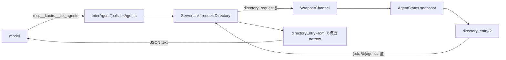

# Phase 27 — list_agents に状況判断メタデータを追加

## Goal

[issue #160](https://gitea.example.invalid/sakurai.yuta/kaoiro/issues/160)
を実装する。`mcp__kaoiro__list_agents` が返す peer entry に稼働状況
6 field を追加し、エージェントが operator の介在なしに

- 残コンテキストが逼迫した peer に重い委任をしない
- 利用上限に張り付いた peer を避ける / 窓明けを待つ
- 長時間無活動の peer を避ける・報告する
- 対話中の peer への割り込みを控える

を判断できるようにする。設計判断はマスター決裁済み
(#160 issuecomment-2211 / -2213)。本 plan はその決定を実装可能な粒度に
落としたもので、決定そのものは変更しない。

## 確定済み前提 (変更禁止)

| # | 決定 | 出典 |
|---|---|---|
| P1 | 取得方式は server が envelope から蓄積した snapshot。wrapper への都度照会はしない | #160 comment-2211 (1) |
| P2 | turn 数 (応答往復数) も server 側で envelope から導出 | 同 (2) |
| P3 | 初版は永続化なし (in-memory、server 再起動でリセット許容)。セッション開始日時のみ既存 `session_starts` DETS の流用可否を調査 | 同 (3) |
| P4 | IA 対話状況は「active な会話の有無 + 相手 agent_id 一覧」まで agent 間に開示。ADR-0021 に agent 間開示の節を追記 | 同 (4) |
| P5 | 追加 field は 6 つ (残コンテキスト / セッション開始日時 / turn 数 / 最終活動時刻 / IA 対話状況 / rate_limits) | #160 本文 + comment-2213 |

## 現行実装経路の調査結果 (#160 明記事項 e)

`list_agents` は wrapper のローカル MCP tool で、実体は server への
`directory_request` 1 往復である。



| 段 | 実体 | 現状 |
|---|---|---|
| tool 定義 | `wrapper/agent-common/src/inter_agent.ts` `descriptors()` / `listAgents()` / `LIST_AGENTS_DESCRIPTION` | 入力 schema は空オブジェクト。provider 未注入なら error result |
| 送信 | `wrapper/core/src/transport.ts` `ServerLink#requestDirectory` | `directory_request` を push、reply の `agents` を `directoryEntryFrom` で narrow |
| 型 | `wrapper/core/src/transport.ts` `DirectoryEntry` | `agent_id` / `persona` / `state` 必須、`engine` / `model` / `effort` optional。**`@kaoiro/protocol` ではなく `@kaoiro/wrapper-core` に居る** |
| 受信 | `server/lib/kaoiro_server_web/channels/wrapper_channel.ex` `handle_in("directory_request", …)` | `AgentStates.snapshot()` から自分を除外して `directory_entry/2` へ |
| 整形 | 同 `directory_entry/2` + `maybe_put_directory_field/3` | latest envelope の `persona` / `state` と `ext.engine` / `ext.model` / `ext.effort` のみ。non-empty string のときだけ載せる |

調査で判明した実装上の重要点:

1. **`AgentStates` は agent ごとに latest envelope 1 件しか持たない。**
   `ext` はその latest envelope のもの。Claude adapter は `#statusExt` を
   毎 state_change で lazy stamp する (ADR-0040 D2) ため
   `ext.context` / `ext.rate_limits` は最新 state_change に載っている。
2. **`log` / `result` / `inter_agent_message` は `append_log` 経路で、
   latest envelope を更新しない** (`store/1`)。よって turn 数・最終活動
   時刻を latest envelope から導出することはできない。ingest 点
   (`handle_in("envelope", …)`) での計測が必要。
3. **切断時の `disconnected` envelope は `ext` を `%{}` に落とす**
   (`AgentStates.disconnected_envelope/2`)。切断済み peer では
   `context` / `rate_limits` が自動的に消える。これは望ましい挙動なので
   そのまま利用する (stale 値を出さない)。
4. **`directoryEntryFrom` は entry を明示構築するので未知 field を落とす。**
   server だけ更新しても旧 wrapper では新 field が model に届かない。
   後方互換の観点で TS 側の narrow 拡張が必須。
5. **`ext` の viewer 除去は `AgentsChannel.sanitize_envelope_for/2` の
   責務で、`directory_request` は `WrapperChannel` の別経路**。つまり
   ADR-0021 の viewer 秘匿は本変更に一切かからない。逆に言えば agent 間
   開示は ADR-0021 が未定義の軸であり、追記が必要 (P4)。

### `session_starts` DETS の流用可否 (P3 の調査)

`KaoiroServer.SessionStarts` は `{agent_id, order, display, sid, pending}`
を DETS に持つ。`display` は ISO8601 で、session transition を server が
認識した時刻である。流用可否の結論は **「fallback としてのみ流用可、
primary source にはしない」**。

| 論点 | 事実 | 帰結 |
|---|---|---|
| カバー率 | `advance_transition/2` は `prior != nil and prior != new_sid` のときだけ発火 (`wrapper_channel.ex maybe_advance_session_boundary/2`) と、`SessionResets` の /clear・/new 経路のみ | **初回 spawn の agent には record が無い**。primary にすると新規 agent で常に欠損 |
| 意味 | `display` は「server が遷移を認識した時刻」。resume で同一 sid なら advance しないため、現セッションの開始時刻として整合的 | 意味論は流用可能 |
| 副作用 | record は `IngressOrder` を消費し、#109 clear watermark / #105 IA filtering の boundary order に効く | **書き込みを増やす改修は禁止**。read-only 参照に留める |
| 永続性 | DETS なので server 再起動を跨いで残る | in-memory tracker が失う情報を埋められる |

よって設計は hybrid とする (下記 D3)。in-memory tracker が
「初回 spawn を含む全ケース」を、`SessionStarts` が「server 再起動を
跨いだ復元」を、それぞれ相補的に埋める。

## Decision

### D1. wire schema — peer entry に 6 field を flat 追加

既存 entry (`agent_id` / `persona` / `state` / `engine?` / `model?` /
`effort?`) と同じ平坦構造に追加する。ネストしたグループは作らない
(既存 3 field と同じ読み方で済む)。

```json
{
  "agent_id": "lab-pc-1.claude-b",
  "persona": { "id": "ao", "name": "あお", "sprite_set": "ao" },
  "state": "idle",
  "engine": "claude-code",
  "model": "claude-opus-5",
  "effort": "high",
  "context": {
    "used_tokens": 132400,
    "max_tokens": 200000,
    "used_percentage": 66.2
  },
  "session_started_at": "2026-07-28T01:12:44Z",
  "turns": 17,
  "last_activity_at": "2026-07-28T03:41:09Z",
  "conversation": { "active": true, "peers": ["lab-pc-1.claude-a"] },
  "rate_limits": {
    "five_hour": {
      "status": "allowed",
      "utilization": 0.42,
      "resets_at": 1785200000
    },
    "seven_day": { "utilization": 0.71, "resets_at": 1785600000 }
  }
}
```

| field | 型 | 意味 | 欠損時 |
|---|---|---|---|
| `context` | `{used_tokens, max_tokens, used_percentage}` | 現セッションの context 使用量。**数値は `ext.context` と同一** (dashboard の ctx meter と同じ値であることを担保) | `ext.session_capabilities.supports_context_usage == true` **でない** engine (absent / explicit false)、`ext.context` 未到着、shape 不正、切断済みでは **field ごと省略** (D4 の capability gate) |
| `session_started_at` | ISO8601 (UTC) | 現セッションの開始を **server が観測した時刻** (wrapper 実測値ではない、裁定 O3) | server が現セッションの開始を観測しておらず `SessionStarts` からも復元できない場合は省略 |
| `turns` | 非負整数 | 現セッションの応答往復数 (定義は D2) | **tracker が当該セッションの開始を観測した (`session_start_observed == true`) 場合のみ返す。** `SessionStarts` fallback で `session_started_at` だけ復元した entry では省略する (開始日時は分かるが往復数は復元できないため、裁定 O2) |
| `last_activity_at` | ISO8601 (UTC) | server が当該 agent の envelope を最後に受理した時刻 | server 再起動後まだ 1 通も受けていない agent では省略 |
| `conversation` | `{active: boolean, peers: string[]}` | active な IA 会話の有無と相手 agent_id 一覧 | **常に含める** (server が必ず判定できるため、D5 参照) |
| `rate_limits` | `{<window>: {status?, utilization?, resets_at?}}` | 最終 turn 時点の利用上限 snapshot。window は `five_hour` / `seven_day` ほか engine 固有 | 未報告 engine / セッション、shape 不正、切断済みでは省略 |

`context` / `rate_limits` の **数値は換算しない**。残量や残り時間へ変換
すると dashboard 表示と値がずれ、#160 受け入れ基準「dashboard 側の表示と
矛盾しない」を破る。残量の解釈 (100 − `used_percentage`) は model に
委ねる。

ただし「数値を換算しない」ことと「`ext` の nested 構造をそのまま素通し
する」ことは **別である**。server は D4 の projection を通し、canonical な
key だけを写した新しい map を組み立てる。`ext` 由来の未知 nested key は
peer に出さない (F6-2 の allow-list を nested 階層まで適用する)。

### D2. turn 数 (応答往復数) の定義

**`type: "result"` の envelope を 1 件受理するごとに +1** とする。

- `result` は「1 回の SDK turn の完了」を表す envelope (ADR-0012) であり、
  両 engine が turn 完了時に emit する。operator 由来か peer 由来かに
  関わらず「入力 → 応答」の往復が 1 回閉じたことを意味する。
- `state: "error"` で終わった `result` も加算する。往復自体は成立して
  おり、疲弊度の指標としては同じ重みを持つ。
- `log` / `state_change` / `inter_agent_message` は加算しない。1 turn の
  中で任意個発生するため往復数にならない。
- resume 再生 (`history_reset` → JSONL replay) は `log` envelope なので
  自動的に加算されない。追加のガードは不要。
- server 合成 envelope (`disconnected` / `escalate-to-user`) は
  `result` ではないので加算されない。IA のハード制限 turn (server 側
  `ConversationStates.turns`) とは **別カウント** である点に注意。

#### 加算判定と reducer order (MUST)

1 envelope の処理は **必ず次の順で行う**。順序を入れ替えてはならない。

1. **transition / reset 判定** — 当該 envelope が新セッションの開始を
   示すか (D3 の L4)、あるいは explicit reset 後の sid adopt か
   (D3 の L5) を先に決める
2. **entry の初期化 / adopt** — 遷移なら `turns = 0` に初期化。adopt なら
   `session_started_at` を保持したまま `session_id` を埋めるだけ
3. **当該 envelope 自身の加算** — その envelope が `type: "result"` なら
   `turns` を +1、`last_activity_at` を受理時刻で更新

この順序が要るのは、**新セッションの最初の envelope が `result` である
ケース**があるため。3 → 1 の順だと初期化が加算を打ち消し、第 1 往復が
0 に消える。

加算対象の網羅表 (テスト要件):

| envelope | 加算 |
|---|---|
| `result` (正常終了) | +1 |
| `result` (`state: "error"`) | +1 |
| `log` / `state_change` / `question_request` / `permission_request` | 0 |
| `inter_agent_message` | 0 |
| resume replay の `log` 群 | 0 |
| server 合成 (`disconnected` / `escalate-to-user`) | 0 |
| **新 session の最初の envelope が `result`** | **+1** (0 ではない) |

### D3. server 側データモデル — `KaoiroServer.AgentActivity` (新設)

entry は
`agent_id => %{owner, session_id, session_started_at,
session_start_observed, awaiting_sid, turns, last_activity_at}` に加え、
遷移中の `pending` を別に持つ in-memory GenServer とする。既存
`AgentStates` に相乗りさせない理由: `AgentStates` は「latest envelope の
保管庫」という単一責務で、履歴 ring / boundary patch / disconnect race
guard を既に抱えている。計測状態を混ぜると put/append_log の分岐が
さらに増える。

`ts` ではなく **server の受理時刻 / hook 実行時刻** を使う。`ts` は
wrapper ホストの時計であり、ホスト跨ぎのズレを判断材料に混ぜたくない
(protocol.md「ホスト跨ぎの時刻ズレに注意」)。

#### owner 束縛と transition identity (MUST)

`awaiting_sid` だけでは **旧 connection の envelope 混入を排除できない**。
live resume (旧 session A → 新 session B) では、reset hook から runner が
旧 wrapper を kill するまでの窓で旧 wrapper が sid=A の envelope を
送りうる。sid だけを見る設計だと、それを新セッションの初 sid として
adopt してしまい (`result` なら `turns` に混入)、その後 sid=B の到達で
再 reset して `t0` を失う。同一 sid の resume (A → A) では sid 変化が
起きないため旧 turn の混入が永久に残る。

そこで **(i) entry を connection に束縛** し、**(ii) 遷移そのものに
相関子を持たせる**。

**(i) owner 束縛** — envelope の記録側:

- `owner` = 当該 agent の `WrapperChannel` プロセス (`self()`)。server
  ローカルの値で足りるため wire 追加は不要。
- `AgentActivity` は「今 active な owner」を 1 つだけ持ち、**それ以外の
  owner から来た記録要求を無視する**。
- `record_envelope/3` の引数に owner と **WrapperChannel 側で capture
  した受理時刻** を渡す。cast の配送遅延で時刻が後ろにずれないように
  するため、時刻は送信側で採る。

**(ii) transition identity** — 遷移の確定側:

owner 束縛だけでは pending 側の相関が無く、次の 3 つが成立してしまう:

1. p1 の TTL GC 後に p2 を begin → 遅延した p1 の fail が p2 を abort
2. live switch の command が runner に未達のまま、旧 wrapper が単純
   reconnect しただけで「新 owner だから」と p1 を activate
3. 連続 switch で、p1 の遅延 join が p2 の `t0` を activate

よって **pending に server 発行の `transition_id` を持たせ、遷移の
成否も join も同じ id で照合する** (end-to-end 相関)。

##### 方式の選定理由 (クロエ裁定により起案者判断)

選択肢は (a) end-to-end id を runner 結果と wrapper join まで運ぶ、
(b) stale result/join が後発 pending に一致しないことを保証する
single-flight / ack protocol の 2 つだった。**(a) を採用する**。

1. **先例がある**。session-reset 経路は既に 4-hop すべてに同じ
   `request_id` を通し、遅延した `session_reset_result` を
   `SessionResets.resolve/5` の CAS で捨てている (ADR-0036 F7、
   protocol/src/index.ts L825-830 のコメントが SSOT)。同じ問題に
   別方式を持ち込むより、確立した pattern を spawn 経路へ広げる方が
   一貫する。
2. **(b) でも結果側 id は避けられない**。abort の CAS
   (`pending.id == result.id`) を成立させるには `SpawnResult` に
   相関子が要る。id を入れるなら join まで通した方が追加コストは小さい。
3. **上記 3 のケースは join 側 id なしでは機械的に排除できない**。
   ack-gated activate は 1 と 2 を潰せるが、「p2 の ack 後に p1 の
   wrapper が join する」順序を否定できず、確率的な軽減に留まる。
   ふじが求めているのは機械的保証である。

##### 相関子の wire (すべて additive / optional)

| hop | 追加 | 備考 |
|---|---|---|
| server → runner `SpawnMessage` | `request_id?: string` | server 発行 (UUIDv4)。L1 / L3 |
| server → runner `SwitchSessionMessage` | `request_id?: string` | 同上 |
| runner → server `SpawnResult` | `request_id?: string` | runner が verbatim echo |
| server → runner `ResetSessionCommand` | **追加不要** | 既存 `request_id` を流用 (L2) |
| runner → wrapper (`WrapperConfig`) | 相関子 1 field | runner が spawn 時に wrapper へ渡す |
| wrapper → server (join params) | `transition_id?: string` | `persona_id` と同じ join params に載せる |

**absent 時は fail-closed に degrade する (MUST)**: 旧 runner / 旧
wrapper が相関子を返さない場合、pending は activate されず TTL GC で
消え、当該 agent の `session_started_at` / `turns` は省略される。
**既存機能は一切壊れない** (spawn も restore も従来どおり動く)。新
field が省略されたら黙って機能を落とす、という本 phase 全体の方針
(D6) と同じ扱いである。

#### セッション lifecycle (MUST)

セッション境界は 7 ケースを区別する。**「wrapper の join ごとに reset」は
禁止** — 通常の reconnect と server 再起動後の復元を壊し、生きている
セッションの `turns` を毎回 0 に落とすため。

| # | ケース | 検知点 | 挙動 |
|---|---|---|---|
| L1 | fresh spawn | `AgentsChannel` の spawn コマンド発行点 | **pending 作成** (`transition_id` と `t0` を確定。current entry は壊さない) |
| L2 | /new・/clear | `after_join_handshake` の `SessionResets.confirm_connection` **成功 branch** | **pending 作成** (既存の reset `request_id` を `transition_id` に流用) |
| L3 | restore / resume (同一 sid を含む) | `resume_session` / restore / `switch_session` コマンド発行点 | **pending 作成** |
| L0 | 新 connection の確立 | 新 `WrapperChannel` の `after_join_handshake` (confirm_connection の返却後) | **pending があり、かつ id が一致すれば activate**。それ以外は **owner の rebind のみ** |
| L4 | server が関与しない session 変化 | **active owner** の envelope で `session_id` が既知の非空値から別の非空値へ変化 | **reset** |
| L5 | lazy 采番の adopt | **active かつ `awaiting_sid == true`** の entry に非空 `session_id` が初到達 | **adopt** (reset しない) |
| L6 | 未知 agent の初 envelope | entry が無い | `session_start_observed = false` で entry 作成、owner を bind |

- **pending の内容 (L1〜L3)**: `%{id: transition_id, started_at: t0,
  kind: :spawn | :reset | :restore, created_at: t0}`。**current entry
  には触れない。** 遷移が確定するまで旧 entry の `turns` /
  `session_started_at` はそのまま読める。
- **single-flight (MUST)**: pending は agent ごとに **常に高々 1 つ**。
  新しい `begin_transition/3` は既存 pending を supersede する
  (置換して古い方を捨てる)。supersede された id の結果 / join は以降
  すべて CAS 不一致となり無視される。
- **activate の条件 (L0、MUST)**: pending が存在し、かつ join params の
  `transition_id` が `pending.id` と一致するときだけ activate する。
  **matching `transition_id` を持つ join が commit signal** であり、
  `spawn_result(ok: true)` は operator への forward と runner への ack
  だけを行い Activity を mutate しない (mutate するのは
  `ok == false` の abort 経路のみ)。
- **activate の内容**: pending を current entry へ昇格させる。
  `turns = 0`、`session_started_at = pending.started_at` (**hook 時刻
  `t0` を保持**、join 時刻ではない)、`session_start_observed = true`、
  `session_id = nil`、`awaiting_sid = true`、`owner` = 新
  `WrapperChannel` の pid。pending は消す。
- **rebind のみ (L0)**: `owner` を差し替えるだけで `turns` /
  `session_started_at` / `session_id` は **保持** する。通常の
  reconnect と server 再起動後の再接続がここに落ちる。
  - ただし **pending がある状態での id absent / mismatch の join** は
    rebind に加えて `projection_suppressed` を立てる (下記
    「相関できない join の projection 抑止」)。pending が無い純粋な
    reconnect と混同しないこと。
- **adopt (L5)**: `session_id` を埋め `awaiting_sid = false` にする
  だけ。`session_started_at` と `turns` は保持。Codex の lazy 采番
  (reset 時点で sid が nil、最初の turn 完了後に確定) がこの経路。
- **旧 owner の記録の扱い (MUST)**: `owner` が current と一致しない
  `record_envelope/3` は **無視する** (加算も adopt も
  `last_activity_at` 更新もしない)。
  - ここでの「旧 owner」とは **activate 済みの新 generation から見た
    旧 connection** を指す。begin から activate までの間、旧
    connection は依然 current owner なので **旧 current entry の
    計測は継続する** — この期間の `result` は旧セッションの `turns`
    に正しく積まれる。current を壊さないという pending 方式の趣旨
    どおりの挙動である。
  - 保証すべき本質は「**新 generation に旧 turn が混入しないこと**」
    であり、それは activate が `turns = 0` で置換することで満たされる。
    begin 時点で owner を revoke して旧 current の計測を止める設計は
    採らない (遷移が失敗したとき、生き続けている旧 child の計測が
    欠測になるため)。
- **`last_activity_at` は max 更新 (MUST)**: 遅延して届いた cast で
  時刻を巻き戻さない。
- **二重 reset の禁止 (MUST)**: `awaiting_sid == true` の間は L4 を
  発火させない。加えて **adopt 済みの entry に旧 owner の遅延 cast が
  届いても L4 を発火させない** (旧 owner は上の規則で無視されるため、
  新 → 旧への巻き戻しが起きない)。
- L1 が必要な理由: fresh spawn は `nil → 非空 sid` であり L4 の条件
  (既知の非空 → 別の非空) に該当しない。かつ `SessionStarts` にも
  record が無い (`advance_transition` は `prior != nil` 条件下でしか
  発火しない) ため、L1 が無いと新規 agent の `session_started_at` /
  `turns` が永久に省略される。
- L3 が必要な理由: 通常の restore は **同一 SDK session_id を resume**
  するため、L4 (sid 変化) も L2 (SessionResets) も発火しない。#160 本文
  の「restore でリセット」を満たすには、server がコマンドを出した時点で
  pending を作る必要がある。

##### 遷移の失敗 / 未達 (MUST)

pending は **transaction** として扱い、失敗時に current entry を壊さない。

| 失敗 | 挙動 | 理由 |
|---|---|---|
| L3 (live restore / `switch_session`) が fail | **pending を破棄し、current entry はそのまま保持** | live switch の失敗では **旧 child が生き続ける**。旧セッションの計測を消してはならない |
| L1 (fresh spawn) が fail | pending を破棄し、当該 agent の entry も削除 | 成功しなかったセッションの開始時刻を残さない。元から entry が無い |
| L2 (/new・/clear) が fail / timeout | **Activity 側に abort 経路は無い。current は untouched** | L2 の pending は `confirm_connection` の成功 branch で作られる。失敗・timeout は **pending が作られる前** に起きるので、破棄すべき pending が存在しない。従来どおり `SessionResets` が閉じる |
| `spawn_result` も join も来ない (runner offline 等) | pending を **TTL で GC**。既定 60 秒 = `SessionResets.@timeout_ms` と同値 (SPAWN + AWAITING_CONNECT を覆う既存の窓) | pending を残すと遷移が永久に宙吊りになる |

- 失敗の受信点は **`RunnerChannel.handle_in("spawn_result", …)`**。
  現状 operator へ forward するだけの箇所に cleanup hook を足す
  (27-A3 の担当 path に `runner_channel.ex` と対応 test を追加)。
- **pending は agent 数 cap を消費しない (MUST)**。L1 の pending 作成で
  `AgentActivity` の上限を埋められると、spawn を連打するだけで tracker を
  枯渇させられる。cap は activate 済み entry にのみ適用する。
- **pending 作成の rate には追加 cap を設けない**。`begin_transition/3`
  を起こせるのは spawn / restore / reset のいずれも **operator 限定の
  入力経路** (protocol.md F4 / ADR-0021 F4) であり、発行レートは
  operator 側で律速される。auto-allow な `list_agents` とは前提が違う。
  telemetry も本 phase では足さない。実運用で問題が出れば後続で扱う。

##### `spawn_result` を mutation にするための検査 (MUST)

`spawn_result` はこれまで「host_id を stamp して operator へ forward
するだけ」で、cross-agent の副作用が無かったため所有検査を省いていた
(`runner_channel.ex` の該当コメントがその理由を記している)。本 phase で
**Activity を mutate する経路に変わる** ため、`session_reset_result` と
同じ検査を通す。検査を怠ると、認証済みの runner A が別 host B の
`agent_id` を騙って **B の pending を破棄** でき、L1 なら **entry 削除**
まで到達する。

処理順:

1. `check_size/1` で payload のサイズを検査
2. payload の shape を parse (`agent_id` / `ok` / `request_id` / `reason`)
3. **`require_host_owns_agent(socket.assigns.host_id, agent_id)`** —
   `AgentId.host_id_from/1` による厳密一致 (prefix 一致では
   nested-prefix spoof を通す。`session_reset_result` の先例に従う)
4. **CAS**: `pending.id == result.request_id` のときだけ mutate。
   不一致 / pending 不在 / `request_id` absent は **黙って破棄**
   (ADR-0036 F7 の stale-completion 規則と同じ扱い)
5. `ok == false` のときだけ abort を実行する。`ok == true` は
   activate を join 側に委ねるので Activity を mutate しない

上記いずれかで弾いた場合も runner には ack を返す (再送させない)。
`runner_channel.ex` の「spawn_result は所有検査不要」というコメントは
本 phase で **更新が必要**。

#### L2 の join CAS と absent の扱い (MUST)

L2 (/new・/clear) には固有の問題がある。`SessionResets.confirm_connection/2`
は現状 `%{phase: :awaiting_connect}` であることだけを見て、timer cancel →
`SessionStarts.advance_transition` → boundary 更新 / detach /
`session_reset_completed` broadcast まで **不可逆に commit** する。既存の
`request_id` CAS は結果側 (`session_reset_result` →
`SessionResets.resolve/5`) にしかなく、**join 側には無い**。したがって
Activity 側の `activate_or_rebind/3` が id 不一致で拒否しても、その前に
SessionResets の commit が完了してしまう。

(なお `confirm_connection/2` の docstring は既に「mismatched request_id
indicates a stale join」を no-op 条件として謳っているが、実装は
`request_id` を受け取っていない。本 phase で実装が docstring に追いつく
形になる。)

修正:

- **join の `transition_id` を `confirm_connection` へ渡す (MUST)**。
  `lock.request_id` と一致した場合にのみ、timer cancel 以降の副作用と
  L2 pending の作成へ進む。
- **mismatch (値があり不一致) は stale join として no-op (MUST)**。
  SessionStarts / detach / completed broadcast / Activity pending の
  いずれも動かさない。
- **absent (旧 wrapper) は L2 に限り legacy fallback (裁定)**。
  `transition_id` を持たない join は SessionResets 側では **従来どおり
  受理** し、timer cancel・`advance_transition`・detach・completed まで
  既存挙動を維持する。Activity 側だけが fail-closed に振る舞う。

##### 判定結果を L0 へ渡す契約 (MUST)

**判定結果は SessionResets の中で消してはならない。** L2 の mismatch は
pending を作らないので、「pending がある状態で absent / mismatch の
join」という発火条件では **抑止に到達できない** (pending が存在しない)。
かといって「`transition_id` が non-nil なのに pending が無ければ抑止」に
はできない — matched 後の通常 reconnect が消費済みの同じ join params を
再送しうるため、正当な reconnect まで抑止してしまう。

そこで `confirm_connection` は判定結果を返し、`WrapperChannel` がそれを
`activate_or_rebind/3` へ **明示的に渡す**。

| 戻り値 | SessionResets 側で起きたこと | L0 の挙動 |
|---|---|---|
| `:matched` | commit 済み + L2 pending 作成済み | 通常の CAS で **activate** |
| `:legacy_absent` | commit 済み + L2 pending 作成済み (legacy fallback) | **force suppress** して rebind (activate しない) |
| `:mismatch` | **no-op** (pending も作られない) | **pending の有無に依存せず force suppress**。かつ **この join では他の Activity pending を activate しない** |
| `:noop` | reset lock 無し / phase 違い | 通常の L1・L3 CAS、または純粋な reconnect |

**L0 の判定優先順位 (MUST)**:

1. `:mismatch` → force suppress + rebind。**他の pending には触れない**
   (残したまま。TTL か後続の matched join が解決する)
2. `:legacy_absent` → force suppress + rebind。作られた L2 pending は
   activate せず残し、TTL で消す
3. `:matched` → L2 pending を CAS で activate
4. `:noop` → 従来どおり: join の `transition_id` と `pending.id` が
   一致すれば activate、pending があって absent / mismatch なら
   suppress + rebind、**pending が無ければ純粋な reconnect として
   rebind のみ (抑止しない)**

`confirm_connection` の中から直接 suppression を立てる実装も可能だが、
その場合も **後続の L0 が別の pending を誤って activate しないよう**、
上と同じ優先順位を定義すること。SessionResets が Activity を直接触ると
層の依存が逆向きになるため、**戻り値で渡す方を推奨する**。

##### `absent` の定義 (MUST)

legacy fallback が適用される `absent` は **join params に
`transition_id` の key 自体が存在しない場合のみ** を指す。

- present-but-empty (`""`)、`null`、型不正、charset 逸脱などの
  **malformed は absent として扱わない**。`:mismatch` 相当 (または
  join 自体の reject) とする。
- 理由: absent 分岐は CAS を迂回する唯一の経路なので、「空文字を送れば
  legacy 扱いになる」経路を残すと CAS が骨抜きになる。

##### end-to-end 相関の例外整理 (MUST として明記)

本 phase の相関子は「全 hop を end-to-end で通す」のが原則だが、L2 の
absent だけは意図的な例外である。3 通りの扱いを取り違えないこと:

| 状況 | SessionResets (既存機能) | AgentActivity (新機能) |
|---|---|---|
| id 一致 | commit する | activate する |
| id mismatch | **no-op** (stale join、pending も作らない) | activate しない。**force suppress** + rebind |
| id absent (key 欠落のみ) | **従来どおり commit** (legacy fallback) | activate しない。**force suppress** + rebind |

absent を fail-closed に倒して timeout へ落とすと、rolling upgrade 中の
**/new・/clear という既存 operator 機能が壊れる**。本 phase の原則は
「新機能 (計測) は静かに落ちる、既存機能は壊さない」であり、
SessionResets の commit は既存機能側にある。一方 mismatch は「別の
transition の join が紛れ込んだ」ことの証拠なので、既存機能側も止める。

#### 相関できない join の projection 抑止 (MUST)

「activate しない」だけでは fail-closed にならない。rebind only は
current の `session_id` / `session_started_at` / `turns` を保持するため、
旧 runner / 旧 wrapper での **same-sid restore** では G2 の一致検査も
通過し、**restore 前の開始時刻と往復数がそのまま再公開される**。

そこで、相関できなかった join を受けた connection generation に
`projection_suppressed` フラグを立てる。発火条件は 2 系統ある:

| 由来 | 条件 | pending の有無 |
|---|---|---|
| **L2** (reset) | `confirm_connection` の戻り値が `:mismatch` または `:legacy_absent` | **依存しない** (force suppress)。`:mismatch` では pending が存在しない |
| **L1 / L3** (spawn / restore) | 戻り値が `:noop` で、**pending がある**状態の join の `transition_id` が absent / mismatch | pending が必要 |
| (抑止しない) | 戻り値が `:noop` で pending も無い | 純粋な reconnect。消費済みの `transition_id` を再送していても抑止しない |

最後の行が要点である。matched で activate した後、同じ wrapper が
通常の reconnect で **消費済みの `transition_id` を再送する** ことは
ありうる。これを「non-nil なのに pending が無い」というだけで抑止すると、
正当な reconnect が計測を失う。抑止の根拠は **reset 判定 (`:mismatch`)
か pending の存在** のどちらかであって、id の非空性ではない。

- 効果: `session_started_at` と `turns` の投影を **抑止する**
  (`directory_request` で両 field を省略)。`last_activity_at` と
  `conversation` は対象外。
- **解除条件は 2 つだけ**: (a) matched な transition が成立して
  activate されたとき、(b) 信頼できる新しい境界を観測したとき
  (L4 の sid 変化による reset)。
- **相関付きの fail が確定しても、TTL で pending が消えても、旧
  current の値は復元しない (裁定)**。復元は stale な値を再公開する
  リスクを再導入する。裁定 O2 と同じ「誤情報より欠落」の整理に従う。

#### 呼び出し順序 (MUST)

相関子と owner 束縛が効くのは、hook の呼び出し順が正しい場合に限る。
次の 3 つを順序として pin し、channel-level のテストで固定する。

1. **L1 / L3 — pending 作成 → runner へ broadcast**。
   `begin_transition/3` の synchronous call が **完了してから**
   `SpawnMessage` / `SwitchSessionMessage` を runner へ送る。逆順だと、
   高速に失敗した `spawn_result` や高速な join が **pending 作成前** に
   到着し、CAS 対象が存在しないまま捨てられる (遷移が永久に確定しない)。
2. **L2 — `confirm_connection` → pending 作成 → activate**。
   `after_join_handshake` の中で、
   (a) `SessionResets.confirm_connection(agent_id, joined_session_id,
   transition_id)` を呼ぶ (現行 signature は
   `confirm_connection(agent_id, joined_session_id \\ nil, server)`。
   join の `transition_id` を受ける引数を追加し、戻り値を
   `:matched | :legacy_absent | :mismatch | :noop` にする) →
   (b) その **`:matched` / `:legacy_absent` branch の完了点** で L2 の
   pending を同期作成する →
   (c) `confirm_connection` から戻った **後** に、その戻り値を渡して
   `activate_or_rebind/3` を呼ぶ。
   L0 を先に呼ぶと pending がまだ無いので rebind only に落ち、
   /new・/clear の reset が TTL まで宙吊りになる。
3. **L2 の失敗は pending 作成前に起きる**。したがって Activity 側に
   L2 の abort 経路は無く、current は untouched のまま
   `SessionResets` が閉じる (上表のとおり)。

#### その他の更新契機

| 契機 | 更新 |
|---|---|
| **active owner** の envelope を受理 (validate / route / store 通過後) | `last_activity_at` を受理時刻で max 更新 |
| 同上で `type == "result"` | `turns` を +1 (順序は D2 の reducer order) |
| 旧 owner の envelope | **無視** |
| `AgentsChannel` の `delete_agent` | entry と pending を削除 (既存の `AgentDirectory.delete` / `SessionStarts.delete` と同じ箇所) |

#### `session_started_at` の解決順序

1. `session_start_observed == true` → tracker の値を使う
2. そうでなく、`SessionStarts.get(agent_id)` の `sid` が当該 agent の
   現 `session_id` と一致する → その `display` を使う (server 再起動を
   跨いだ復元)
3. どちらでもない → **field 省略**、`turns` も併せて省略

`turns` は 1 の場合だけ返す。2 の fallback で開始日時が復元できても
往復数は復元できないため、0 から数え直した値を出さない (裁定 O2、
ADR-0040 の「推定値を出さない」作法の踏襲)。

#### 並行性ガード (MUST)

`AgentActivity` は ingest (WrapperChannel)・lifecycle hook
(AgentsChannel / SessionResets)・read (directory_request) の 3 系統から
触られる。次の 3 点を守る。

- **G1 — 記録対象の限定**: `record_envelope/3` は `validate/2` /
  `route_inter_agent/2` / `store/1` がすべて `:ok` を返した envelope に
  対してのみ呼ぶ。reject された envelope で entry を作ると、存在しない
  agent の orphan entry ができ、tracker の agent 数上限を独立に食い潰す
  経路になる。
- **G2 — 投影時の session 一致検査**: `directory_request` で
  session-specific field (`session_started_at` / `turns`) を載せるのは、
  **`AgentActivity` の `session_id` と `AgentStates` latest envelope の
  `session_id` が一致するときだけ**。不一致なら両 field を省略する。
  `record_envelope/3` は cast (下記 G3) なので両者は一瞬ずれうる。この
  検査でズレを **一時的な欠損** に閉じ込め、旧セッションの `turns` を
  新セッションの値として誤表示することを防ぐ。`awaiting_sid == true`
  の間 (`session_id = nil`) も不一致として扱い省略する。
  `last_activity_at` と `conversation` は session に紐づかないので本
  検査の対象外。
  - **`projection_suppressed` が立っている generation でも同じ 2 field
    を省略する**。G2 は「tracker と latest envelope のズレ」を、
    suppression は「そもそも相関できなかった遷移」をそれぞれ塞ぐ。
    same-sid restore では G2 が通過してしまうため、両方が必要。
- **G3 — hook の同期性**: `record_envelope/3` は hot path なので cast
  (fire-and-forget)。同一 `WrapperChannel` プロセスからの cast は
  GenServer への到達順が保証されるので、同一 connection の envelope 間で
  順序は狂わない。lifecycle hook (L0〜L3) は別プロセスから出るため
  **synchronous call** とし、pending の作成 / activate の完了を待って
  から後続処理へ進む。
- **G4 — owner 束縛が順序保証の本体 (MUST)**: G3 の call は
  **hook の呼び出し元との順序しか保証しない**。旧 `WrapperChannel` は
  別 sender なので、その cast と hook との global order は保証されない
  — call だけでは旧 connection の envelope 混入を防げない。防いでいるのは
  **owner 一致検査** (上記「旧 owner の無視」) であり、これが本設計の
  race 対策の本体である。G3 は補助に過ぎない。
  - 旧 owner の cast が hook より後に届いても、owner 不一致で捨てられる
  - 新 sid を adopt した後に旧 owner の遅延 cast が届いても、同じ理由で
    L4 の巻き戻しが起きない
  - 時刻の逆転は `last_activity_at` の max 更新で吸収する

### D4. `context` / `rate_limits` の取得元と projection

一次ソースは `AgentStates.snapshot()` が返す latest envelope の
`ext.context` / `ext.rate_limits`。tracker には持たせない (二重の真実源
を作らない)。ただし **raw を素通ししない** — 下記の gate と projection を
通した新しい map を組み立てて載せる。

**既知の一時欠損 (初版では許容)**: `permission_request` /
`question_request` は `AgentStates.put/2` の対象で、かつ `ext` を持た
ない。よって peer が `waiting_permission` / `waiting_question` の間は
latest envelope から `context` / `rate_limits` が消え、両 field が省略
される。次の `state_change` で復帰する。**初版はこれを best-effort な
一時欠損として許容する** — 承認待ちの peer に重い委任をしないという
判断は `state` だけでも下せるため。latest とは別に status ext を保持
する案は採らない (P1 が許容した staleness と同じ整理)。実運用で問題に
なれば後続 issue で扱う。

#### `context` は capability driven (MUST)

`ext.context` の **presence では判定しない**。次の条件をすべて満たす
ときだけ `context` を載せる:

1. latest envelope の
   `ext.session_capabilities.supports_context_usage == true`
   (boolean の `true`。absent / explicit `false` はいずれも非投影)
2. `ext.context` が到着済みで、`used_tokens` / `max_tokens` /
   `used_percentage` がすべて数値

presence-driven にできない理由: rolling upgrade 中の **旧 Claude
wrapper** は `ext.context` を stamp するが capability field を持たない。
dashboard は ADR-0040 D1 に従い capability absent で ctx 行を
**隠す** ため、presence-driven だと list_agents だけが値を公開し、#160
受け入れ基準「dashboard 側の表示と矛盾しない」を破る。3-state
(absent / false / true) の解釈を dashboard と揃える。

capability field 自体は peer に開示しない (F6-4 の deny 集合に
`session_capabilities` を残す)。gate の入力に使うだけである。`null` や
推定値を代入しないことは従来どおり (ADR-0040 D1/D3 踏襲、#160 明記事項
b)。

#### projection / validation (MUST)

`ext` は wrapper が自由に拡張できる open schema であり、そのまま流すと
将来 adapter が足した未知 nested key が peer directory の allow-list
(F6-2) を素通りする。server は **canonical key だけを写した新しい map**
を作る。

| 対象 | 許可する key | 検証 | 逸脱時 |
|---|---|---|---|
| `context` | `used_tokens` / `max_tokens` / `used_percentage` の 3 つのみ | すべて有限数 (`Number.isFinite` 相当) | `context` field ごと省略 |
| `rate_limits` の window 値 | `status` / `utilization` / `resets_at` のみ (3 つとも optional) | `status` = string かつ **UTF-8 で 64 bytes 以下**、`utilization` = 有限数、`resets_at` = **非負の safe integer** | 当該 window を drop。他の window は残す |
| `rate_limits` の window key | open string (engine 固有 window を阻害しない) | 長さ ≤ 32、charset `[A-Za-z0-9_-]` | 当該 window を drop |
| `rate_limits` の window 数 | — | **8 件以下** | 下記の選択規則で 8 件に切り詰め |

**値側の bound が必要な理由 (MUST)**: key 側だけ縛っても `status` が
unbounded だと、1 window に envelope cap 近く (約 256 KB) の文字列を
入れられる。`list_agents` は auto-allow で 1 応答に全 peer が載るため、
peer 数を掛けた response amplification が値側に残る。`status` は
**64 bytes を上限とし、超過した window は drop** する。TS narrow も
**同一の上限に揃える** (片側だけ緩いと素通し経路になる)。

**window 数超過時の選択は決定的でなければならない (MUST)**。適用対象は
**value validation と empty drop を通過した valid window の集合** で
あって、raw の window 集合ではない:

1. まず各 window に value validation を適用し、不正な window と empty
   window を落とす
2. 残った **valid な** window のうち canonical (`five_hour` /
   `seven_day`) を **無条件で優先** して採用する。engine 固有 window に
   押し出されて消えることがあってはならない
3. 残り枠を、残った window key の **lexical 昇順** で埋める
4. 溢れた分を drop

canonical であっても validation を通らない window は保持しない
(「canonical は無条件保持」ではない)。

**empty window の drop**: projection 後に `status` / `utilization` /
`resets_at` が 1 つも残らなかった window は drop する (中身の無い
window key だけを peer に見せない)。

その他の規約:

- 数値の **換算はしない** (D1)。projection は「写す key を絞る」操作
  であって値の加工ではない。`utilization` を 0..1 に強制するかは
  [#164](https://gitea.example.invalid/sakurai.yuta/kaoiro/issues/164) で
  実データを確認してから判断する (現状は range 検査を **入れない**)。
- **malformed は top-level field 単位で drop し、valid な sibling は
  残す**。例: `context` が壊れていても `rate_limits` は載る。
- 未知 nested key は写さない (allow-list を nested 階層まで適用)。
- 切断済み peer は `ext` が空になるため両方が自然に消える。stale な
  数値を peer に見せないという意味で正しい。
- 同じ規約を TS 側 narrow (`directoryEntryFrom`) にも適用する。server が
  新しくても旧 narrow が素通しする経路を作らないため、**両側で** テスト
  する (27-A5 / 27-B4)。
- **drop のログは window 単位で無制限に warn しない (MUST)**。
  `list_agents` は auto-allow 経路なので、window ごとの warn は log
  amplification になる。**agent / request 単位で 1 行に集約** するか
  rate-limit する。黙って落とさないことと、ログを溢れさせないことを
  両立させる。

#### `resets_at` 経過時の解釈規約 (#160 明記事項 c)

`rate_limits` は **当該 peer の最終 turn 時点の snapshot** であり、
idle 中は更新されない。したがって:

- MUST: **peer directory の消費側 (`list_agents` を呼ぶ agent)** は、
  `resets_at` (Unix 秒) が現在時刻より過去である window を
  **窓が明けたものとみなし、`utilization` / `status` を信用しない**。
  この MUST の owner は agent 側であり、`LIST_AGENTS_DESCRIPTION`
  (27-B3) に明文で書いて model に伝える。
- **これは deterministic な強制ではない。** server も wrapper も判定を
  代行せず、model の解釈に委ねる best-effort な規約である。spec には
  その旨を正直に書く (強制されていると読める書き方をしない)。
- server は snapshot を加工せず、判定に必要な `resets_at` をそのまま
  渡す。server が窓明けを検知して field を削る案は採らない — server
  時計と engine 側の窓境界がずれた場合に「上限に達しているのに空に
  見える」という危険側の誤りを生むため。
- **dashboard 側の同等対応は本 phase の scope 外。**
  [#164](https://gitea.example.invalid/sakurai.yuta/kaoiro/issues/164) へ
  委譲する (クロエが #164 に scope 追記)。本 plan と spec は dashboard が
  既に実装済みであるかのように書かない。
- SHOULD: `last_activity_at` が古い peer の `rate_limits` は、その分だけ
  古い情報であると解釈する。両 field を並べて返すのはこのため。

### D5. IA 対話状況の導出 (`conversation`)

`KaoiroServer.ConversationStates` は
`conversation_id => %{agents: MapSet, …}` を保持している。ここに
**副作用のない read-only API** を 1 本追加する:

```elixir
@doc """
参加中の会話から `agent_id => [peer_agent_id]` の index を 1 回で返す。
値は重複排除済みのソート済みリスト。会話に参加していない agent は
key ごと現れない。
"""
def peer_index(server \\ __MODULE__)
```

- **per-peer に 1 call 張る API にはしない (MUST)**。`directory_request`
  1 回につき **batch snapshot を 1 call** だけ取り、呼び出し側で index を
  引く。`peers_of(agent_id)` を peer 数だけ呼ぶ設計は、上限値
  (agent 1,000 × conversation 10,000) で 1 回の `list_agents` が
  routing 用 GenServer を長時間占有する。`list_agents` は auto-allow の
  read-only tool で model が自由に叩ける経路なので、ここが詰まると
  inter-agent messaging 全体が停止する。
- index の構築コストが問題になるなら、`record_message/6` /
  GC / `drop/2` の各更新点で `agent_id => conversation_ids` の逆引きを
  維持する案に切り替えてよい (実装判断)。wire も呼び出し回数も変わら
  ない。
- `conversation_id` は **返さない**。P4 が明示した開示範囲が
  「active な会話の有無 + 相手 agent_id 一覧」であり、識別子はその範囲を
  **超える** ため。単に範囲外というだけで、#17 の機密性論点をここで
  先取りして判断したわけではない (trust boundary の再評価は
  ADR-0021 F6-6 の将来項目)。
- `claim_unreachable_targets/3` は notified フラグを立てる副作用がある
  ので流用しない。
- entry は done / ハード制限超過 / wallclock GC で消えるため、
  「active」の定義は「その時点で `ConversationStates` に entry がある」
  と一致する。GC 周期 (60 秒) 分の遅れは許容する。
- `conversation` は **常に載せる** (`{active: false, peers: []}` を含む)。
  他 5 field と違い engine 非依存で server が必ず判定できるため、
  「省略 = 不明」とする理由がない。旧 server では field ごと absent に
  なるので、消費側は absent と `active: false` を区別できる。

### D6. 後方互換 (#160 明記事項 a)

- 既存 field は一切変更しない。追加のみ。`version` 据え置き
  (ADR-0010 / ADR-0015 の未知キー追加規約)。
- 旧 wrapper × 新 server: `directoryEntryFrom` が新 field を落とす。
  entry 自体は今までどおり返るので機能低下のみ、破壊はしない。
- 新 wrapper × 旧 server: 新 field が来ないので narrow が optional として
  落とす。`conversation` も absent になり「不明」として扱われる。
- 追加 field は **すべて optional**。1 field の欠損が entry 全体の破棄に
  ならないよう、narrow は field 単位で判定する (既存
  `maybe_put_directory_field` / `for key of [...]` と同じ方針)。

### D7. `DirectoryEntry` 型の置き場所

現在 `DirectoryEntry` は `@kaoiro/wrapper-core`
(`wrapper/core/src/transport.ts`) にある。#160 本文の「共有型は
`@kaoiro/protocol` に追加する」は、この現状を踏まえると
**移動を伴う**。本 phase では移動しない:

- 移動は import 元の変更を wrapper 4 パッケージに波及させる純粋な
  リファクタで、6 field 追加とは独立している。
- server / dashboard は Elixir / 別型定義なので、protocol package に
  置く実利が現時点で無い。

新 field は既存 `DirectoryEntry` を拡張する形で `wrapper-core` に足す。
この方針は裁定 O1 で確定済みで、`@kaoiro/protocol` への移設はクロエが
別 issue として起票する。

なお Track B の担当 path には `protocol/**` が **含まれている** が、
それは MF-C1 の相関子 (`request_id` 等) を additive に足すためであって、
`DirectoryEntry` の移設許可ではない。この 2 つを混同しないこと。

## 影響範囲 (spec docs)

| doc | 差分方針 |
|---|---|
| `docs/specs/protocol-inter-agent.md` | 主戦場。「peer directory の情報境界 (#102)」節を 6 field 追加に合わせて書き直し、除外リストから `context` / `rate_limit` を外す。`directory_request` 行の entry shape を更新。コンパニオンツール表の `list_agents` 用途説明を更新。`conversation` の常時同梱 (D5) を Constraints に MUST として追加。`resets_at` 解釈規約 (D4) は **消費側 agent の MUST** として書き、deterministic に強制される仕組みではない旨も併記する (dashboard が実装済みと読める書き方をしない、#164 へ委譲)。`ext` からの projection 規約 (canonical key のみ、未知 nested key 非開示) を情報境界節に明記。`session_started_at` / `last_activity_at` は「**server が観測した時刻**」であり wrapper 実測値ではないと定義を明記する (裁定 O3) |
| `docs/specs/protocol.md` | `directory_request` 行にあった #102 (`engine`/`model`/`effort`) の drift は **設計時 (a9688bd) に修正済み**。本 phase では同じ行を 6 field 込みの shape へ更新し、詳細は protocol-inter-agent へのポインタに寄せる (重複記述を作らない) |
| `docs/specs/threat-model.md` | 緩和策表と Constraints は viewer/operator 軸のまま。agent 間開示という第 3 の軸が入ったことを 1 行追記し、ADR-0021 の新節を参照させる |
| `docs/adr/0021-role-information-disclosure-policy.md` | F6「agent 間開示 (peer directory)」を追記。詳細は下記 |

### ADR-0021 追記案 (P4)

新規 ADR は **不要** と判断する。ADR-0021 の主題は「誰に何を見せるか」
の allow-list ポリシであり、agent という主体が増えるのは同じ主題の軸の
追加である。Decision の F1〜F5 は無効化されず (viewer/operator の
マトリクスは不変)、supersede にも当たらない。ADR-0021 に節を足すのが
単一情報源の原則に合う。

以下は 27-C1 でそのまま ADR-0021 の Decision 末尾へ挿入する実文案。
本 phase (設計) では ADR 本文には手を入れない — 未実装の決定を
accepted ADR に先行して載せると status が drift するため。

> ### F6: agent 間開示 (peer directory)
>
> F1〜F5 は client (dashboard) 向けの `agents:lobby` 配信を対象とする。
> [issue #160](https://gitea.example.invalid/sakurai.yuta/kaoiro/issues/160)
> で agent が peer の稼働状況を読んで委任判断を行う要求が生じたため、
> **第 3 の開示主体として `agent` を定義する**。
>
> **F6-1 — `agent` は `operator` の部分集合ではない。** operator が
> 見る経路 (`agents:lobby` / `AgentsChannel.sanitize_envelope_for/2`) と
> agent が見る経路 (`wrapper:<id>` /
> `WrapperChannel.handle_in("directory_request", …)`) は別実装であり、
> 片方の allow-list がもう片方を守らない。両者は独立に判断する。
>
> **F6-2 — peer directory も allow-list 方式。** `directory_entry/2` が
> 明示列挙した field だけが agent 間に出る。envelope の `ext` を丸ごと
> 流し込む実装は禁止する (F2 と同じ fail-closed)。allow-list は
> **nested 階層まで適用** する — `ext` 由来の構造体を載せる場合も
> canonical key だけを写した新しい map を組み立て、未知の nested key は
> 開示しない。
>
> **F6-3 — 現時点の allow 集合**: `agent_id` /
> `persona{id, name, sprite_set}` / `state` / `engine` / `model` /
> `effort` / `context` / `session_started_at` / `turns` /
> `last_activity_at` / `conversation` / `rate_limits`。
> 後半 6 field は #160 (phase-27) で追加。
>
> **F6-4 — 明示 deny (継続除外)**: `cwd`、`permission` (`sandbox` /
> `approval`)、`permission_mode` / `fast_mode`、`session_id`、
> `pending_permission` (特に `input`)、`pending_question`、
> `slash_commands`、`models` catalog、`resume_snapshot` /
> `resume_drift`、`model_source` / `effort_source`、
> `session_capabilities`、`cost`。委任判断に不要か、operator 固有の
> 作業内容を推測させるため。`session_capabilities` は
> `supports_context_usage` を `context` 投影の gate 入力として **server
> 内部で読むだけ** で、値そのものは peer に出さない。
>
> **F6-5 — `conversation` は相手 `agent_id` までを開示し、
> `conversation_id` は開示しない。** 開示範囲として決定されたのが
> 「active な会話の有無 + 相手 agent_id 一覧」(#160 決定 4) であり、
> 識別子はその範囲を超えるため。範囲外だから出さないという判断であって、
> [#17](https://gitea.example.invalid/sakurai.yuta/kaoiro/issues/17) の
> conversation_id 機密性についてここで結論を出したわけではない。信頼
> 境界そのものの再評価は F6-6 の将来項目に含める。
>
> **F6-6 — 妥当性の根拠と再評価条件。** 現状 kaoiro は単一 operator
> 配下の閉じた系であり、peer は同一の人間が起動した agent に限られる。
> 稼働状況の相互可視化による露出リスクは小さく、operator 介在の削減
> という便益が上回る。外部 inbound
> ([#98](https://gitea.example.invalid/sakurai.yuta/kaoiro/issues/98))
> 導入時、または agent 間の信頼境界が operator 単位でなくなった時点で
> 本節を再評価する。
>
> **F6-7 — 拡張手順。** peer directory に新 field を足すときは、F5 の
> viewer 判断と同様に **agent 開示の要否を明示判断** し、F6-3 / F6-4 の
> どちらかに列挙してからテストで両主体の可視性を covering する。

## タスク分割

server (Elixir) と wrapper/protocol (TS) で path が重ならないよう分割し、
2 名で並行実装できる形にする。**共有 working tree のため
`git add` は各自の担当 path のみを指定すること。**

### Track A — server (Elixir)

担当 path: `server/lib/**`, `server/test/**`

| Task | 内容 | 主な path |
|---|---|---|
| 27-A1 | `KaoiroServer.AgentActivity` 新設 (D3)。`record_envelope/3` (cast、**owner + 送信側で capture した受理時刻**)、`begin_transition/3` (call、**`transition_id` 付き pending 作成** = L1〜L3、single-flight で既存 pending を supersede)、`activate_or_rebind/3` (call、L0、**join の `transition_id` と CAS**)、`resolve_transition/3` (call、runner 結果の CAS + abort)、`get/1`、`delete/1`。entry に `owner` / `awaiting_sid` / **`projection_suppressed`**、別枠で `pending = %{id, started_at, kind, created_at}`。**owner 不一致の cast は無視**、`last_activity_at` は max 更新、D2 の reducer order を実装。pending がある状態で id absent / mismatch の join を受けたら rebind + `projection_suppressed` を立て、**matched activate または L4 reset でのみ解除** (fail 確定・TTL 後も復元しない)。pending は TTL 60 秒で GC し **agent 数上限を消費しない**。`Application` の supervision tree へ登録 | `server/lib/kaoiro_server/agent_activity.ex`, `server/lib/kaoiro_server/application.ex` |
| 27-A2 | `ConversationStates.peer_index/1` 追加 (D5)。**batch で 1 call**、副作用なし、重複排除 + ソート。per-peer call 版は作らない | `server/lib/kaoiro_server/conversation_states.ex` |
| 27-A3 | lifecycle + ingest 配線 (D3 の L0〜L6) と **呼び出し順序の遵守**。(1) spawn / `resume_session` / restore / `switch_session` の各発行点で **`begin_transition/3` の完了後に** runner へ broadcast (L1・L3、`request_id` を発行してコマンドに載せる)。(2) `after_join_handshake` で `confirm_connection` → **成功 branch で L2 pending を同期作成** → 返却後に `activate_or_rebind/3` (L0、join params の `transition_id` を渡す)。**`SessionResets.confirm_connection` に join の `transition_id` を渡す引数を追加し、戻り値を `:matched` / `:legacy_absent` / `:mismatch` / `:noop` の 4 値にする**。`lock.request_id` と一致した場合だけ timer cancel 以降の副作用へ進む。mismatch は完全 no-op、absent (key 欠落のみ) は legacy fallback で従来どおり commit。**戻り値を `activate_or_rebind/3` へ渡し、D3 の優先順位で分岐する** (`:mismatch` は pending の有無に依存せず force suppress、かつ他 pending を activate しない)。既存 docstring が既に謳っている挙動に実装を合わせる形。(3) `RunnerChannel.handle_in("spawn_result", …)` を mutation 化 — `check_size` → shape parse → **`require_host_owns_agent/2`** → **CAS (`pending.id == request_id`)** → `ok == false` のときだけ `resolve_transition/3` で abort (L1 fail は entry ごと削除 / L3 fail は pending 破棄のみ)。弾いた場合も ack は返す。所有検査不要と書いた既存コメントを更新。(4) `WrapperChannel.handle_in("envelope", …)` の **validate/route/store が :ok の後** → `record_envelope/3` (G1、owner = `self()`)。(5) `delete_agent` → `delete/1` | `server/lib/kaoiro_server_web/channels/wrapper_channel.ex`, `server/lib/kaoiro_server_web/channels/runner_channel.ex`, `server/lib/kaoiro_server/session_resets.ex`, `server/lib/kaoiro_server_web/channels/agents_channel.ex` |
| 27-A4 | `directory_entry/2` を 6 field 対応に拡張 (D1/D3/D4/D5)。**capability gate** (`supports_context_usage == true` のときだけ `context`)、**projection/validation** (canonical key のみ写す、window 数・key 長 bound)、**G2 の session 一致検査** と **`projection_suppressed` の検査** (どちらか一方でも該当すれば `session_started_at` / `turns` を省略)、`SessionStarts` fallback (D3 解決順序 2)。省略規約は helper に集約 | `server/lib/kaoiro_server_web/channels/wrapper_channel.ex` |
| 27-A5 | テスト。`agent_activity_test.exs` 新設: **lifecycle 4 ケース** (fresh spawn / same-sid restore / different-sid restore / Codex の nil→sid adopt)、**owner 束縛と遷移 transaction** (AC 参照)、**相関 CAS 3 ケース** (TTL GC 後に p2 開始 → 遅延 p1 fail が p2 を abort しない / pending 中の無関係な reconnect が activate しない / p2 pending 中に p1 の join が来ても activate しない)、**新 session の最初が result で +1**、加算網羅表 (success/error result=+1、log・state_change・IA・resume replay・server 合成=0)、二重 reset しないこと、`last_activity_at` の max 更新、pending TTL GC、pending が cap を消費しないこと、single-flight supersede、fallback、上限。`conversation_states_test.exs` に `peer_index/1`。`runner_channel_test.exs` に `spawn_result` の **host 所有検査** (別 host の agent_id を騙る runner が pending を破棄できないこと)・size/shape 検査・CAS 不一致の破棄・`ok == true` では mutate しないこと・fail 時の cleanup。**channel-level の順序テスト** (begin → broadcast、confirm → pending → activate、L2 失敗時に current untouched)。`session_resets_test.exs` に **join CAS 4 ケース** (`:matched` で commit / `:mismatch` は完全 no-op — SessionStarts・detach・completed・Activity pending のいずれも動かない / `:legacy_absent` は従来どおり commit / present-but-empty・null・型不正は legacy に入らず mismatch 相当)。`wrapper_channel_test.exs` に **projection 抑止** (旧 wrapper の same-sid restore 後に `session_started_at` / `turns` が省略される、**pending 0 件の L2 mismatch でも suppression が立つ**、**消費済み `transition_id` を再送する通常 reconnect では立たない**、`:mismatch` の join が他 pending を activate しない、TTL 経過後も復活しない、matched activate と L4 reset でのみ解除、`last_activity_at` / `conversation` は抑止対象外)。`wrapper_channel_test.exs` に directory reply 検査: capability absent/false/true × context 有無の 4 組、projection (未知 nested key 非開示 / malformed top-level のみ drop / valid sibling 保持 / `status` 64 bytes 超過 drop / window 数超過時の canonical 優先 + lexical / empty window drop)、G2 不一致時の省略、`conversation` 常時同梱、切断後に `context`/`rate_limits` が消えること | `server/test/**` |

### Track B — TypeScript (wrapper / protocol / runner)

担当 path: `wrapper/**`, `protocol/**`, `runner/**`。

`protocol/**` は **MF-C1 の相関子追加に限って** 触れる
(`SpawnMessage` / `SwitchSessionMessage` / `SpawnResult` /
`WrapperConfig` への additive な optional field)。**`DirectoryEntry` の
`@kaoiro/protocol` への移設は依然として scope 外** (裁定 O1) — この 2 つ
を混同しないこと。`runner/**` は相関子を wrapper へ伝播させるためだけに
触れる。Track A (`server/**`) との path 重複は無い。

| Task | 内容 | 主な path |
|---|---|---|
| 27-B1 | `DirectoryEntry` に 6 field を optional 追加 (D1/D7)。JSDoc に欠損規約 (省略 = 不明、`null` は出さない、`turns` 省略を 0 と読まない) を明記 | `wrapper/core/src/transport.ts` |
| 27-B2 | `directoryEntryFrom` の narrow 拡張。**server と同じ projection 規約・同じ上限値を適用する** (D4): canonical key のみ採用、未知 nested key は写さない、malformed は top-level field 単位で drop して valid な sibling は残す。数値は `Number.isFinite`、`resets_at` は非負の safe integer (`Number.isSafeInteger` + `>= 0`)、`status` は **UTF-8 64 bytes 以下**、window key は長さ ≤ 32 / charset、window 数 ≤ 8 (canonical 優先 + lexical)、empty window は drop。`conversation` は `{active: boolean, peers: string[]}`。`utilization` の 0..1 range 検査は **入れない** (#164 の実データ確認後に判断、と JSDoc に注記) | `wrapper/core/src/transport.ts` |
| 27-B3 | `LIST_AGENTS_DESCRIPTION` を更新。追加 field の意味と、model が取るべき判断を記述: 残 context 逼迫 peer に重い委任をしない / **`resets_at` (Unix 秒) を現在時刻と比較し、過去なら `utilization`・`status` を信用しない** (D4 の MUST、owner は agent 側) / `conversation.active` な peer への割り込みを控える / `last_activity_at` が古い peer は停滞を疑う。**省略された field を「0」や「問題なし」と読まない** ことも明記 | `wrapper/agent-common/src/inter_agent.ts` |
| 27-B4 | テスト: `transport.test.ts` に narrow の正常系・malformed top-level のみ drop・valid sibling 保持・未知 nested key 非開示・`status` 64 bytes 超過 drop・window 数超過時の canonical 優先 + lexical、`inter_agent.test.ts` に list_agents 結果が新 field を欠落なく model へ渡すことの検査 | `wrapper/core/test/**`, `wrapper/agent-common/test/**` |
| 27-B5 | **MF-C1 の相関子 (additive)**。`protocol/src/index.ts` の `SpawnMessage` / `SwitchSessionMessage` に `request_id?`、`SpawnResult` に `request_id?`、`WrapperConfig` に相関子 field を追加 (すべて optional、JSDoc に「absent なら server 側は activate せず degrade する」と明記)。runner は受け取った相関子を wrapper config へ伝播し、`spawn_result` に verbatim echo する。wrapper は join params に `transition_id` として載せる。旧 runner / 旧 wrapper との後方互換 (absent) を test で固定 | `protocol/src/index.ts`, `runner/**`, `wrapper/core/src/transport.ts` |

### Track C — docs (どちらかが実装完了後に一括)

| Task | 内容 | 主な path |
|---|---|---|
| 27-C1 | ADR-0021 に F6 節を追記 (上記骨子) | `docs/adr/0021-role-information-disclosure-policy.md` |
| 27-C2 | `protocol-inter-agent.md` の情報境界節・`directory_request` 行・コンパニオンツール表・Constraints 更新 | `docs/specs/protocol-inter-agent.md` |
| 27-C3 | `protocol.md` L222 の drift 修正 + ポインタ化、`threat-model.md` に agent 間開示軸の 1 行追記 | `docs/specs/protocol.md`, `docs/specs/threat-model.md` |
| 27-C4 | 本 plan の Progress 表と frontmatter (`status` / `last_updated`)、`docs/plans/README.md` の phase 27 行 (起案時に ⏳ で登録済み) を実状に更新 | `docs/plans/**` |

依存関係:

- Track A 内: 27-A1 → 27-A3 → 27-A4、27-A2 → 27-A4
- Track A / B 間: peer entry については wire 定義 D1 が契約なので独立に
  着手できる。**相関子だけは例外** — 27-B5 の `protocol/src/index.ts`
  への型追加が 27-A3 の CAS 実装の前提になる。**27-B5 の型追加分を先に
  1 コミットでマージする** と両 Track が待たずに進む (runner / wrapper
  側の伝播実装は後追いでよい)
- Track C は A/B 完了後

## Progress

| Task | 状態 | 内容 |
|---|---|---|
| 27-A1 | ✅ | `AgentActivity` 新設 |
| 27-A2 | ✅ | `ConversationStates.peer_index/1` (batch) |
| 27-A3 | ✅ | lifecycle (L0-L3) / ingest / spawn_result cleanup 配線 |
| 27-A4 | ✅ | `directory_entry/4` 6 field 拡張 + capability gate + projection |
| 27-A5 | 🟡 | server テスト (AC 全件の消し込みを継続中) |
| 27-B1 | ✅ | `DirectoryEntry` 型拡張 |
| 27-B2 | ✅ | `directoryEntryFrom` narrow 拡張 |
| 27-B3 | ✅ | `LIST_AGENTS_DESCRIPTION` 更新 |
| 27-B4 | ✅ | wrapper テスト |
| 27-B5 | ✅ | MF-C1 相関子 (protocol additive + runner 伝播 + join params) |
| 27-C1 | ✅ | ADR-0021 F6 追記 |
| 27-C2 | ✅ | `protocol-inter-agent.md` 更新 |
| 27-C3 | ✅ | `protocol.md` の entry shape を 6 field 込みへ更新 (#102 drift は設計時に先行修正済み)、`threat-model.md` に agent 間開示軸を緩和策表 + Constraints へ追記 |
| 27-C4 | 🟡 | Progress 表・README を実状へ更新。frontmatter の status は 27-A5 と ふじ レビュー完了後に `implemented` へ |

## Acceptance Criteria

- [ ] `list_agents` の各 peer entry に 6 field が D1 の shape で含まれる

### context の capability gate (MF1)

- [ ] `supports_context_usage == true` かつ `ext.context` が valid な
      ときだけ `context` が載る
- [ ] `supports_context_usage` が **absent** の wrapper では、
      `ext.context` が到着していても `context` を **載せない**
      (旧 Claude wrapper の rolling upgrade。dashboard が ctx 行を隠す
      挙動と一致させる)
- [ ] `supports_context_usage: false` (Codex) では `context` が省略され、
      `null` も推定値も現れない (ADR-0040 踏襲)
- [ ] `session_capabilities` 自体は entry に含まれない

### セッション lifecycle (MF2)

- [ ] **fresh spawn**: 新規 agent の初セッションで `session_started_at` /
      `turns` が返る (永久省略にならない)
- [ ] **same-sid restore**: 同一 `session_id` を resume する通常の restore
      でも `turns` が 0 に戻り `session_started_at` が更新される
- [ ] **different-sid restore / resume**: 同上
- [ ] **/new・/clear**: 同上
- [ ] **Codex の lazy 采番**: explicit reset 後 `session_id` が nil の
      期間を経て sid が確定しても、`session_started_at` は reset 時刻を
      保持し、**二度目の reset は起きない** (`turns` が巻き戻らない)
- [ ] wrapper の通常 reconnect と server 再起動後の復元で reset が
      **起きない** (join ごと reset になっていない)

### owner 束縛と遷移 transaction (再レビュー MF-A)

- [ ] **旧 connection の混入排除**: L3 の command 発行後・新 wrapper の
      join 前に旧 wrapper が **旧 sid の `result`** を送っても、pending
      および新 generation には adopt も加算もされない (この期間の
      `result` は **旧 current の `turns` には積まれる** — 遷移確定まで
      旧セッションの計測は継続する。MF-C4 の整理)
- [ ] **巻き戻しの排除**: 新 sid を adopt した後に旧 owner の遅延 cast が
      届いても L4 が発火せず、`session_id` / `turns` が巻き戻らない
- [ ] **same-sid restore**: 同一 sid を resume しても旧 `result` が混ざら
      ず、`turns` が 0 から数え直される
- [ ] **遷移の失敗**: live `switch_session` の失敗では **旧 entry が保持
      される** (`turns` / `session_started_at` が消えない)。fresh spawn の
      失敗では pending と entry が削除される
- [ ] **通常 reconnect**: pending が無い join では owner の rebind だけが
      起き、`turns` / `session_started_at` が保持される
- [ ] `spawn_result` も join も来ないまま TTL (60 秒) を過ぎた pending が
      GC される。pending は `AgentActivity` の agent 数上限を消費しない
- [ ] `last_activity_at` は遅れて届いた記録で巻き戻らない (max 更新)
- [ ] **begin から activate までの間、旧 current entry の計測は継続する**
      (この期間の `result` は旧セッションの `turns` に積まれ、activate で
      `turns = 0` に置換される。MF-C4 の整理)

### 相関・順序・認可 (再レビュー MF-C1 / C2 / C3)

- [ ] **TTL GC 後の遅延 fail**: p1 が TTL GC された後に p2 を begin し、
      その後 p1 の `spawn_result(ok: false)` が届いても **p2 が abort
      されない** (CAS 不一致で破棄)
- [ ] **無関係な reconnect**: pending がある状態で、遷移とは無関係な
      wrapper が reconnect しても **activate されない** (rebind only)
- [ ] **後発 pending への誤 activate**: p2 の pending 中に p1 の join が
      届いても **p2 が activate されない**
- [ ] **single-flight**: 連続した `begin_transition/3` で pending が
      1 つだけ残り、supersede された id の結果 / join が無視される
- [ ] **相関子 absent**: 旧 runner / 旧 wrapper (相関子を返さない) では
      activate されず rebind only に degrade し、pending は TTL で消える。
      **spawn / restore 自体は従来どおり成功する**
- [ ] **host 所有検査**: 認証済み runner が **別 host の `agent_id`** を
      載せた `spawn_result` を送っても pending が破棄されず、entry も
      削除されない (`AgentId.host_id_from/1` の厳密一致)
- [ ] `spawn_result` の size / shape 検査を通らない payload で mutate
      されない。`ok == true` では Activity を mutate しない。弾いた場合も
      runner には ack を返す
- [ ] **順序 1**: `begin_transition/3` の完了 **後** に runner へ
      broadcast している (fast fail / fast join が pending 作成前に
      到着しない)
- [ ] **順序 2**: `confirm_connection` → L2 pending 作成 →
      `activate_or_rebind/3` の順で、/new・/clear が TTL まで宙吊りに
      ならない
- [ ] **順序 3**: L2 の失敗 / timeout では Activity が untouched のまま
      `SessionResets` が閉じる (Activity 側に L2 の abort 経路が無い)

### L2 join CAS と absent projection (再レビュー MF-D1 / D2)

- [ ] **別 id の join**: `:awaiting_connect` 中に `transition_id` が
      `lock.request_id` と **一致しない** join が来ても、
      `SessionStarts` / detach / `session_reset_completed` broadcast /
      Activity の pending が **一切動かない** (完全な no-op)
- [ ] **absent の join (legacy fallback)**: `transition_id` を持たない
      join では `SessionResets` が **従来どおり** commit する
      (timer cancel → `advance_transition` → detach → completed)。
      一方 Activity は activate せず、rolling upgrade 中でも
      /new・/clear は壊れない
- [ ] **absent / mismatch での projection 抑止**: 旧 runner / 旧 wrapper
      による **same-sid restore** の後、`session_started_at` と `turns`
      が **省略される** (restore 前の値が再公開されない)
- [ ] **抑止の永続性**: 相関付きの fail が確定しても、pending が TTL で
      消えても、抑止された値は **復活しない**
- [ ] **抑止の解除**: matched な transition の activate、または L4 の
      sid 変化による reset を観測したときにだけ抑止が解ける
- [ ] `last_activity_at` と `conversation` は抑止の対象外で、抑止中も
      返る
- [ ] **pending 0 件の mismatch**: L2 の mismatch (SessionResets が
      pending を作らないケース) でも、Activity の pending が 1 件も
      無い状態で **suppression が立つ** (`confirm_connection` の戻り値
      が L0 へ届いている)
- [ ] **消費済み id の再送**: matched で activate した wrapper が、
      通常の reconnect で同じ (消費済みの) `transition_id` を再送しても
      **新たに suppression が立たない** (reset mismatch でない限り、
      pending の無い join は純粋な reconnect として扱う)
- [ ] **mismatch は他 pending を activate しない**: `:mismatch` の join
      では、無関係な L1 / L3 の pending があっても activate されない
- [ ] **`absent` の定義**: `transition_id` が present-but-empty (`""`) /
      `null` / 型不正の join は legacy fallback に入らず、mismatch 相当
      として扱われる (CAS の迂回経路にならない)

### turn カウント (MF3)

- [ ] 新セッションの **最初の envelope が `result`** のとき `turns == 1`
      になる (0 に消えない)
- [ ] `result` は正常終了 / `state: "error"` とも +1
- [ ] `log` / `state_change` / `inter_agent_message` / resume replay /
      server 合成 envelope は +0

### projection / validation (MF5)

- [ ] `ext.context` / `ext.rate_limits` に未知の nested key があっても
      entry には現れない
- [ ] malformed な top-level field だけが drop され、valid な sibling
      (例: `context` 不正時の `rate_limits`) は残る
- [ ] window 数・key 長の上限を超えた `rate_limits` の window が drop
      される
- [ ] **`status` が 64 bytes を超える window が drop される** (再レビュー
      MF-B の response amplification 対策)
- [ ] **window 数が 8 を超えるとき、`five_hour` / `seven_day` が必ず
      残る** (engine 固有 window に押し出されない)。残り枠は lexical 昇順
      で決定的に選ばれる
- [ ] projection 後に値が 1 つも残らない empty window が drop される
- [ ] `resets_at` が負値 / 非整数 / unsafe integer の window が drop される
- [ ] drop のログが **agent / request 単位で集約** され、window ごとの
      無制限 warn になっていない
- [ ] 同じ検査・**同じ上限値** が server と TS narrow の双方に
      テストされている

### 欠損規約 / 並行性

- [ ] `rate_limits` を未報告の engine / セッションでは field ごと省略される
- [ ] 切断済み peer では `context` / `rate_limits` が消える
- [ ] `waiting_permission` / `waiting_question` 中の peer では
      `context` / `rate_limits` が一時的に省略され、次の `state_change`
      で復帰する (初版の既知欠損として許容、Ad1)
- [ ] `conversation` は常に含まれ、会話が無ければ
      `{active: false, peers: []}` になる。`conversation_id` は含まれない
- [ ] server 再起動直後、まだ envelope を受けていない agent では
      `turns` / `last_activity_at` / `session_started_at` が省略される
      (0 や現在時刻で埋めない)
- [ ] `SessionStarts` に現 `session_id` の record がある agent では、
      server 再起動後も `session_started_at` が復元される。ただし `turns`
      は復元されず省略される (裁定 O2)
- [ ] `AgentActivity` の `session_id` と latest envelope の `session_id`
      が不一致のとき、`session_started_at` / `turns` が省略される (G2)
- [ ] reject された envelope で tracker entry が作られない (G1)

### 互換 / 一貫性

- [ ] 旧 wrapper (narrow 未更新) が新 server に `directory_request` を
      投げても entry が壊れず、既存 field で従来どおり動作する
- [ ] `context` / `rate_limits` の数値が dashboard の ctx meter /
      rate 行と一致する (#160 受け入れ基準)
- [ ] `list_agents` 1 回あたり `ConversationStates` への call が 1 回
      (peer 数に比例しない、A1)
- [ ] ADR-0021 に F6 が追記され、明示 deny 集合が列挙されている
- [ ] `server && mix test` / `wrapper && pnpm test` / `pnpm typecheck` が
      pass

## Non-goals

- 永続化 (turn 数・最終活動時刻の DETS 保存)。P3 により初版は in-memory。
  必要になれば後続 issue。
- `conversation_id` の agent 間開示。P4 が定めた開示範囲を超えるため
  (#17 の機密性そのものを本 phase で判断はしない)。
- capability を持たない engine への残コンテキスト推定値の投影
  (ADR-0040 で不採用済み)。
- `DirectoryEntry` 型の `@kaoiro/protocol` への移設 (D7、裁定 O1)。
- dashboard 側の表示追加。本 phase は agent 間 wire のみ。
- **dashboard 側の `resets_at` 経過判定**。D4 の MUST は peer-directory
  の消費側 (agent) に限定し、dashboard の同等対応は
  [#164](https://gitea.example.invalid/sakurai.yuta/kaoiro/issues/164) へ
  委譲する。

## Risks / 注意

| 項目 | 内容 |
|---|---|
| #164 との依存 | [#164](https://gitea.example.invalid/sakurai.yuta/kaoiro/issues/164) (claude 5h が常に 0% / claude 7day 未表示 / codex 7day 非表示) は **同一データ源**。#164 未修正のまま本 phase を検収すると `rate_limits` の受け入れ検証ができない。#164 の修正完了を検収の前提とする |
| 計測の hot path | `record_envelope/3` は全 envelope 受理で走る。GenServer call を毎回張ると ingest がボトルネックになりうる。`AgentDirectory.touch/1` と同じく **cast** で実装し、read 側 (`directory_request`) と lifecycle hook だけ call にする (G3)。cast による staleness は G2 の session 一致検査で一時欠損に閉じ込める |
| auto-allow 経路の負荷 | `list_agents` は broker 承認を経ない auto-allow tool なので model が自由に叩ける。`ConversationStates` への問い合わせを peer 数に比例させると、routing 用 GenServer を塞いで inter-agent messaging 全体を止めうる。**directory 1 回につき call 1 回** の batch API に固定する (D5) |
| tracker の上限 | `AgentStates` と同じく agent 数上限を持たせる。未認証 wrapper が捏造 agent_id で map を膨らませる経路を塞ぐ |
| GC 周期の遅れ | `conversation.active` は `ConversationStates` の GC (60 秒周期) に従うため、wallclock 超過直後の最大 60 秒は active に見えうる。判断材料としては許容範囲だが spec に注記する |
| 時計 | `last_activity_at` / `session_started_at` は server clock。peer の `ts` (wrapper ホスト clock) と混ぜない |

## 裁定済み論点 (2026-07-28、クロエ経由でマスター裁定)

起案時の Open items 3 点は起案者推奨どおり確定した。以降は決定事項として
扱う (再提起不要)。

| # | 論点 | 裁定 |
|---|---|---|
| O1 | #160 本文の「共有型は `@kaoiro/protocol` に追加」と現状 (`DirectoryEntry` は `wrapper-core` 在) の食い違い | **本 phase は `wrapper-core` 拡張に留める** (D7 のとおり)。`@kaoiro/protocol` への移設は別 issue 化 (クロエが起票)。Track B の工数は現行見積のまま |
| O2 | `turns` の省略条件 (D3)。再起動後は `last_activity_at` だけ出て `turns` が無い状態が発生する | **observed するまで省略**。「0」と偽るより欠落が正しい。数値の連続性より正確さを優先 |
| O3 | `session_started_at` の fallback (`SessionStarts.display`) は wrapper のセッション開始時刻と厳密には一致しない | **許容**。ただし spec (27-C2) に「**server が遷移を観測した時刻**」と定義を明記すること。実測値ではないと読み手が判別できる形にする |

## 設計レビュー反映履歴

ふじ 設計レビュー (a9688bd 対象) の must-fix 6 件 / advisory 7 件を反映
した。対応箇所は次のとおり。

| 指摘 | 内容 | 反映先 |
|---|---|---|
| MF1 | `context` の gate を presence-driven から capability-driven へ戻す | D4「`context` は capability driven」、D1 の欠損時列、AC「context の capability gate」 |
| MF2 | fresh spawn / same-sid restore を取りこぼす lifecycle | D3「セッション lifecycle」(L1〜L6)、AC「セッション lifecycle」、27-A1 / 27-A3 / 27-A5 |
| MF3 | reducer order の pin と二重 reset 禁止 | D2「加算判定と reducer order」、D3 の L5、AC「turn カウント」 |
| MF4 | cross-GenServer race のガード | D3「並行性ガード」(G1 / G2 / G3)、AC「欠損規約 / 並行性」、Risks |
| MF5 | `ext` raw 素通しの disclosure boundary 違反 | D4「projection / validation」、D1 末尾、ADR-0021 F6-2、AC「projection / validation」、27-A4 / 27-B2 |
| MF6 | `resets_at` MUST の owner 不在 (選択肢 b 採用) | D4「`resets_at` 経過時の解釈規約」、Non-goals、27-B3 |
| A1 | `peers_of` の per-peer call を batch 1 call へ | D5、27-A2、Risks「auto-allow 経路の負荷」 |
| A2 | `turns` 欠損表現を裁定 O2 と一致させる | D1 の欠損時列 |
| A3 | `conversation_id` 非開示の根拠を P4 の開示範囲へ | D5、ADR-0021 F6-5、Non-goals |
| A4 | Track B の担当 path から `protocol/**` を外す | タスク分割 Track B |
| A5 | 27-C3 の進捗を ✅ → 🟡 | Progress |
| A6 / A7 | 後方互換 matrix・`SessionStarts` read-only fallback・protocol.md drift 修正は追認 | 変更なし (D6 / D3 / 影響範囲表のまま) |

なお ふじ のレビューは a9688bd 固定で、裁定反映 (02f9ad7) は対象外
だった。両者の整合を確認済み — 裁定 O1〜O3 は must-fix と衝突せず、
A2 / A3 / A4 はむしろ裁定内容を各節へ波及させる指摘だったため、
同じ方向で統合してある。

### 二巡目 (fa027df 対象)

MF1 / MF3 / MF6・A1 / A2 / A4 / A5・`SessionStarts` read-only fallback は
解消済み判定。G2 の切り分けも妥当と明言あり。残 must-fix 2 件 +
advisory 4 件を反映した。

| 指摘 | 内容 | 反映先 |
|---|---|---|
| MF-A | `awaiting_sid` 方式では旧 connection の envelope 混入を排除できない (live resume の kill 待ち窓、same-sid resume での永久残留、遅延 cast による巻き戻し) | D3「owner generation による connection 束縛」新設、lifecycle を pending / activate 方式へ全面改訂 (L0 追加、L1〜L3 は pending 作成に変更)、「遷移の失敗 / 未達」表を新設、G4 を追加、AC「owner 束縛と遷移 transaction」、27-A1 / 27-A3 / 27-A5 |
| MF-B | `rate_limits` の値側 bound 不足 (`status` unbounded による response amplification)、window 数超過時の非決定性、log amplification | D4「projection / validation」の表と規約を改訂 (`status` ≤ 64 bytes、canonical 優先 + lexical、empty window drop、ログ集約)、AC「projection / validation」、27-B2 |
| Ad1 | `permission_request` / `question_request` は `ext` を持たないため waiting 中に `context` / `rate_limits` が消える (**裁定: 初版は許容 + 明記**) | D4 冒頭「既知の一時欠損」、AC「欠損規約 / 並行性」 |
| Ad2 | TS narrow の数値検査を pin (`Number.isFinite` / 非負 safe integer)。`utilization` の range 強制は #164 の実データ確認後 | D4 の projection 表、27-B2 |
| Ad3 | References の #17 説明を P4 開示範囲外の整理に合わせる | References |
| Ad4 | D7 末尾の「→ Open items O1」と影響範囲表の「既に drift している」を現状へ | D7、影響範囲表 |

MF-A の要点: `awaiting_sid` は「sid を見て判断する」設計なので、旧
connection が旧 sid で喋り続ける窓を塞げない。**judgement の軸を sid から
connection (owner) へ移した** のが今回の修正で、pending / activate は
「遷移中に current entry を壊さない」ための transaction 化である。
G3 (synchronous call) は hook caller との順序しか保証しないため補助に
格下げし、race 対策の本体は G4 (owner 一致検査) と明記した。

### 三巡目 (8f3482d 対象)

MF-B と二巡目 advisory 4 件は解消判定。must-fix 4 件 + advisory 3 件を
反映した。

| 指摘 | 内容 | 反映先 |
|---|---|---|
| MF-C1 | pending に相関 identity が無く、TTL 後の遅延 fail / 無関係な reconnect / 後発 pending への誤 activate が成立する | D3「owner 束縛と transition identity」に (ii)・方式選定理由・wire 表を追加、lifecycle 表 (L0 / L2 の検知点、activate 条件、single-flight)、AC「相関・順序・認可」、27-A1 / 27-A3 / 27-A5 / **27-B5 新設**、Track B の担当 path |
| MF-C2 | `spawn_result` を mutation 化するなら host 所有検査が要る | D3「`spawn_result` を mutation にするための検査 (MUST)」新設、AC、27-A3 / 27-A5 |
| MF-C3 | begin / confirm / activate の順序が未 pin。L2 の abort 記述が誤り | D3「呼び出し順序 (MUST)」新設、「遷移の失敗 / 未達」表の L2 行を修正、AC、27-A3 / 27-A5 |
| MF-C4 | 「current untouched」と「旧 owner 無視」が矛盾 | D3「旧 owner の記録の扱い」を書き換え (begin〜activate 間は旧 current の計測を継続、保証の本質は新 generation への非混入)、AC |
| Ad-1 | `record_envelope/2` の残存 | G1 / G2 / Risks を `/3` に統一 |
| Ad-2 | pending の request rate | 「遷移の失敗 / 未達」に **cap を設けない根拠** (begin は operator 限定経路なので operator 側で律速される) を明記 |
| Ad-3 | window 選択の適用対象 | D4 の projection を「validation と empty drop を通過した valid window 集合に対して canonical 優先」へ明確化 |

MF-C1 の方式は **(a) end-to-end id** を選択した (クロエ裁定により起案者
判断)。理由は D3「方式の選定理由」に記載 — 要約すると (1) session-reset
経路が既に 4-hop の `request_id` 相関を持つ先例がある (ADR-0036 F7)、
(2) (b) を採っても abort の CAS には結果側 id が必要で追加コストが
変わらない、(3) 「p2 の ack 後に p1 が join する」順序は join 側 id なしに
機械的排除ができない、の 3 点。相関子はすべて additive / optional で、
absent なら **fail-closed に degrade** する (activate されず計測 field が
省略されるだけで、spawn / restore 自体は従来どおり動く)。

これに伴い Track B の担当 path に `protocol/**` と `runner/**` を戻した。
**裁定 O1 (`DirectoryEntry` の `@kaoiro/protocol` 移設をしない) は
引き続き有効** で、`protocol/**` に触れてよいのは相関子の additive 追加に
限られる。

### 四巡目 (e5aa3d7 対象)

MF-C1〜C3 の本体と三巡目 advisory 3 件は解消判定 (`spawn_result` の
5 段検査 / begin-before-broadcast / L2 の順序は妥当と明言)。must-fix
3 件 + advisory 2 件を反映した。

| 指摘 | 内容 | 反映先 |
|---|---|---|
| MF-D1 | `SessionResets.confirm_connection` が join id を照合せず不可逆に commit するため、Activity が拒否しても既存側の副作用が先に完了する | D3「L2 の join CAS と absent の扱い (MUST)」新設 + 「end-to-end 相関の例外整理」表、AC「L2 join CAS と absent projection」、27-A3 / 27-A5 |
| MF-D2 | absent / mismatch の rebind only は current を保持するため、旧構成の same-sid restore で restore 前の start / turns が再公開される | D3「相関できない join の projection 抑止 (MUST)」新設、G2 に追記、lifecycle の rebind 項、AC、27-A1 / 27-A4 / 27-A5 |
| MF-D3 | MF-C4 の旧 AC が残存し新 AC と矛盾 | AC「owner 束縛と遷移 transaction」の該当行を「pending / 新 generation には adopt・加算されない (旧 current には加算される)」へ修正 |
| Ad-1 | D7 の「Track B から `protocol/**` を外してある」が現状と逆 | D7 末尾 |
| Ad-2 | activate 条件 3 が tautology | lifecycle の activate 条件を「matching `transition_id` の join を commit signal とし、`ok=true` は forward / ack のみ」へ簡潔化 |

MF-D1 の absent 扱いは **本 phase で唯一の end-to-end 相関の例外** に
なる。裁定どおり L2 の absent join は SessionResets 側では従来どおり
commit し、Activity 側だけが fail-closed に振る舞う。fail-closed に倒して
timeout へ落とすと rolling upgrade 中の /new・/clear という **既存
operator 機能** が壊れるためで、「新機能 (計測) は静かに落ちる、既存
機能は壊さない」という本 phase の原則に従った判断である。mismatch は
「別 transition の join が紛れ込んだ」証拠なので既存側も止める —
absent と mismatch を同一視しないことが要点。

MF-D2 の抑止は G2 とは別の穴を塞ぐ。G2 は「tracker と latest envelope の
ズレ」を見るが、same-sid restore では両者が一致してしまうため通過する。
`projection_suppressed` は「そもそも相関できなかった遷移」を記録する
別軸のフラグで、両方が要る。

### 五巡目 (91c394a 対象)

absent legacy fallback / same-sid restore の抑止 / TTL 後の非復活 /
MF-D3 はすべて妥当判定。must-fix 1 件 + advisory 2 件を反映した。

| 指摘 | 内容 | 反映先 |
|---|---|---|
| MF-E1 | L2 の mismatch は pending を作らないため、「pending がある状態で absent / mismatch」という発火条件では抑止に到達できない。かといって「non-nil なのに pending 無し → 抑止」も不可 (消費済み id を再送する正当な reconnect を巻き込む) | D3「判定結果を L0 へ渡す契約 (MUST)」新設 (`:matched` / `:legacy_absent` / `:mismatch` / `:noop` の 4 値と L0 の優先順位)、「projection 抑止」の発火条件を 2 系統の表へ改訂、例外整理表、AC「L2 join CAS と absent projection」に 4 項目追加、27-A3 / 27-A5 |
| Ad-1 | 呼び出し順序節に旧 signature が残存 | 「呼び出し順序」2 を現行 signature + 追加引数 + 戻り値へ更新 |
| Ad-2 | legacy fallback の `absent` の範囲 | D3「`absent` の定義 (MUST)」新設 — key 自体の欠落のみ。present-but-empty / null / 型不正は mismatch 相当 (CAS 迂回経路を作らない) |

MF-E1 の要点は「判定結果を SessionResets の中で消さない」こと。抑止の
根拠は **reset の判定結果か pending の存在** のどちらかであって、
`transition_id` の非空性ではない — この区別を誤ると、matched 後に同じ
join params を再送する正当な reconnect まで計測を失う。実装方式は
戻り値で L0 へ渡す方を推奨した (SessionResets から Activity を直接触ると
層の依存が逆向きになるため)。`confirm_connection` 内で直接 suppression を
立てる場合も同じ優先順位を守ることを条件にしてある。

## References

- [issue #160](https://gitea.example.invalid/sakurai.yuta/kaoiro/issues/160)
  — 本 phase の起点。決定は comment-2211 / -2213
- [issue #164](https://gitea.example.invalid/sakurai.yuta/kaoiro/issues/164)
  — rate_limits 表示不具合 (同一データ源、検収の前提)
- [issue #17](https://gitea.example.invalid/sakurai.yuta/kaoiro/issues/17)
  — inter-agent messaging の起点。`conversation_id` は P4 が定めた開示
  範囲を超えるため本 phase では非開示 (機密性そのものの判断は行わない)
- [ADR-0040](../adr/0040-context-usage-capability.md) — capability driven
  な context 表示、推定値を出さない作法
- [ADR-0021](../adr/0021-role-information-disclosure-policy.md) —
  情報開示ポリシ (本 phase で F6 を追記)
- [ADR-0010](../adr/0010-protocol-precisification.md) /
  [ADR-0015](../adr/0015-protocol-version-stamping.md) — 未知キー追加と
  version 据え置きの規約
- [protocol-inter-agent](../specs/protocol-inter-agent.md) — peer
  directory の情報境界 (#102)
- [phase-8-inter-agent-messaging](phase-8-inter-agent-messaging.md) —
  directory_request の初出
