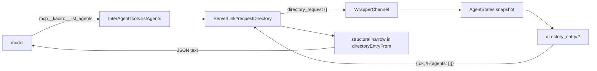

# Phase 27 — Add operational metadata to list_agents

## Goal

Implement [issue #150](https://github.com/sakuraiyuta/kaoiro/issues/150).
Add 6 operational-status fields to the peer entry returned by
`mcp__kaoiro__list_agents`, so that an agent can decide without operator
intervention to:

- avoid assigning heavy delegation to a peer whose remaining context is tight;
- avoid peers at their usage limit / wait for the window to open;
- avoid or report peers that have been inactive for a long time; and
- refrain from interrupting a peer that is in conversation.

The design decisions have been approved by the master
(#150 issuecomment-5384364147 / -5384364216). This plan reduces those
decisions to an implementation-ready level; the decisions themselves must not
change.

## Confirmed premises (must not change)

| # | Decision | Source |
|---|---|---|
| P1 | The retrieval method is a snapshot accumulated by the server from envelopes. Do not query the wrapper on every request | #150 comment-5384364147 (1) |
| P2 | Turn count (number of response round trips) is also derived by the server from envelopes | Same (2) |
| P3 | The initial version has no persistence (in-memory; reset on server restart is allowed). Investigate whether the existing `session_starts` DETS can be reused only for the session start time | Same (3) |
| P4 | IA conversation status is disclosed between agents only as whether an active conversation exists and a list of the other agent IDs. Add an inter-agent disclosure section to ADR-0021 | Same (4) |
| P5 | There are 6 added fields (remaining context / session start time / turn count / last activity time / IA conversation status / rate_limits) | #150 body + comment-5384364216 |

## Investigation of the current implementation path (#150 explicit item e)

`list_agents` is a local MCP tool in the wrapper; its actual implementation is
one round trip to the server using `directory_request`.



| Stage | Actual implementation | Current state |
|---|---|---|
| Tool definition | `wrapper/agent-common/src/inter_agent.ts` `descriptors()` / `listAgents()` / `LIST_AGENTS_DESCRIPTION` | Input schema is an empty object. Returns an error result if the provider is not injected |
| Sending | `wrapper/core/src/transport.ts` `ServerLink#requestDirectory` | Pushes `directory_request`; narrows reply `agents` with `directoryEntryFrom` |
| Type | `wrapper/core/src/transport.ts` `DirectoryEntry` | `agent_id` / `persona` / `state` are required; `engine` / `model` / `effort` are optional. **It does not live in `@kaoiro/protocol`; it lives in `@kaoiro/wrapper-core`** |
| Receiving | `server/lib/kaoiro_server_web/channels/wrapper_channel.ex` `handle_in("directory_request", …)` | Excludes self from `AgentStates.snapshot()` and passes the result to `directory_entry/2` |
| Formatting | Same `directory_entry/2` + `maybe_put_directory_field/3` | Only the latest envelope's `persona` / `state` and `ext.engine` / `ext.model` / `ext.effort`; included only when they are non-empty strings |

Important implementation findings:

1. **`AgentStates` keeps only one latest envelope per agent.** `ext` is from
   that latest envelope. The Claude adapter lazily stamps `#statusExt` on every
   state change (ADR-0040 D2), so `ext.context` / `ext.rate_limits` are present
   on the latest state change.
2. **`log` / `result` / `inter_agent_message` use the `append_log` path and do
   not update the latest envelope** (`store/1`). Therefore turn count and last
   activity time cannot be derived from the latest envelope; they must be
   measured at the ingest point (`handle_in("envelope", …)`).
3. **The `disconnected` envelope clears `ext` to `%{}`**
   (`AgentStates.disconnected_envelope/2`). For a disconnected peer,
   `context` / `rate_limits` disappear automatically. This is desirable, so use
   it as-is and do not expose stale values.
4. **`directoryEntryFrom` constructs entries explicitly and drops unknown
   fields.** Updating only the server would leave the new fields out of the
   model when using an old wrapper. The TypeScript narrow must be extended for
   backward compatibility.
5. **Removing the viewer from `ext` is the responsibility of
  `AgentsChannel.sanitize_envelope_for/2`, while `directory_request` is a
  separate `WrapperChannel` path.** The ADR-0021 viewer secrecy therefore does
   not apply to this change. Conversely, inter-agent disclosure is an axis not
   yet defined by ADR-0021 and needs an addition (P4).

### Whether to reuse `session_starts` DETS (P3 investigation)

`KaoiroServer.SessionStarts` stores `{agent_id, order, display, sid, pending}`
in DETS. `display` is ISO8601 and is the time at which the server recognized a
session transition. The conclusion on reuse is **use it only as a fallback,
never as the primary source**.

| Issue | Fact | Consequence |
|---|---|---|
| Coverage | `advance_transition/2` fires only when `prior != nil and prior != new_sid` (`wrapper_channel.ex maybe_advance_session_boundary/2`), plus the /clear and /new paths in `SessionResets` | **The first spawn of an agent has no record.** Making it primary would always leave new agents missing |
| Meaning | `display` is “the time the server recognized the transition.” A resume with the same sid does not advance it, so it is semantically consistent as the current session start time | The meaning can be reused |
| Side effects | The record consumes `IngressOrder` and affects the #106 clear watermark / #102 IA filtering boundary order | **Do not add writes.** Keep the reuse read-only |
| Persistence | Because it is DETS, it survives a server restart | It fills information lost by the in-memory tracker |

The design is therefore hybrid (see D3 below). The in-memory tracker covers
“all cases, including the first spawn,” while `SessionStarts` complements it by
restoring data across a server restart.

## Decision

### D1. Wire schema — add 6 flat fields to the peer entry

Add the fields to the same flat structure as the existing entry
(`agent_id` / `persona` / `state` / `engine?` / `model?` / `effort?`). Do not
create nested groups (they can be read in the same way as the existing 3
fields).

```json
{
  "agent_id": "lab-pc-1.claude-b",
  "persona": { "id": "ao", "name": "あお", "sprite_set": "ao" },
  "state": "idle",
  "engine": "claude-code",
  "model": "claude-opus-5",
  "effort": "high",
  "context": {
    "used_tokens": 132400,
    "max_tokens": 200000,
    "used_percentage": 66.2
  },
  "session_started_at": "2026-07-28T01:12:44Z",
  "turns": 17,
  "last_activity_at": "2026-07-28T03:41:09Z",
  "conversation": { "active": true, "peers": ["lab-pc-1.claude-a"] },
  "rate_limits": {
    "five_hour": {
      "status": "allowed",
      "utilization": 0.42,
      "resets_at": 1785200000
    },
    "seven_day": { "utilization": 0.71, "resets_at": 1785600000 }
  }
}
```

| Field | Type | Meaning | When absent |
|---|---|---|---|
| `context` | `{used_tokens, max_tokens, used_percentage}` | Context usage for the current session. **The numbers are identical to `ext.context`** (guaranteed to be the same values as the dashboard ctx meter) | For an engine that does not have `ext.session_capabilities.supports_context_usage == true` (absent / explicit false), when `ext.context` has not arrived, the shape is invalid, or the peer is disconnected, **omit the field entirely** (D4 capability gate) |
| `session_started_at` | ISO8601 (UTC) | The time the server **observed** the current session start (not a wrapper measurement; ruling O3) | Omit when the server has not observed the start of the current session and it cannot be restored from `SessionStarts` |
| `turns` | Non-negative integer | Number of response round trips in the current session (defined in D2) | **Return it only when the tracker observed the start of that session (`session_start_observed == true`).** Omit it for an entry whose `SessionStarts` fallback restored only `session_started_at`, because the start time is known but the round trips cannot be reconstructed (ruling O2) |
| `last_activity_at` | ISO8601 (UTC) | The time at which the server last accepted an envelope for that agent | Omit for an agent that has not sent any envelope since the server restarted |
| `conversation` | `{active: boolean, peers: string[]}` | Whether an active IA conversation exists and the other agent IDs | **Always include it** (the server can always determine it; see D5) |
| `rate_limits` | `{<window>: {status?, utilization?, resets_at?}}` | Usage-limit snapshot at the last turn; windows are `five_hour` / `seven_day` and other engine-specific names | Omit for an engine / session that has not reported it, an invalid shape, or a disconnected peer |

Do **not convert the numeric values** in `context` / `rate_limits`. Converting
them to remaining amount or remaining time would make the dashboard and this
value differ, violating the #150 acceptance criterion that the values must not
contradict the dashboard. Leave interpretation of the remaining amount
(100 − `used_percentage`) to the model.

However, “do not convert numbers” and “pass through the nested `ext` structure
unchanged” are **different requirements**. The server applies the D4
projection and constructs a new map containing only canonical keys. Unknown
nested keys from `ext` must not be exposed to peers (apply the F6-2 allow-list
through every nested level).

### D2. Definition of turn count (response round trips)

Increment by one for every accepted envelope with **`type: "result"`**.

- A `result` represents completion of one SDK turn (ADR-0012), and both engines
  emit it when a turn completes. Regardless of whether the input came from an
  operator or a peer, it means one “input → response” round trip completed.
- Add an envelope ending with `state: "error"` as well, and count that `result`.
  The round trip still completed and has the same weight as a fatigue indicator.
- Do not count `log` / `state_change` / `inter_agent_message`. Any number of
  them can occur within one turn, so they are not round trips.
- Resume replay (`history_reset` → JSONL replay) consists of `log` envelopes and
  is therefore not counted automatically. No additional guard is needed.
- Server-synthesized envelopes (`disconnected` / `escalate-to-user`) are not
  `result` envelopes and are not counted. Note that this is a **separate count**
  from the IA hard-limit turns (`ConversationStates.turns`) on the server.

#### Increment decision and reducer order (MUST)

Process an envelope **in exactly the following order**. Do not reorder it.

1. **Determine transition / reset** — first determine whether the envelope
   indicates the start of a new session (D3 L4), or adoption of a sid after an
   explicit reset (D3 L5).
2. **Initialize / adopt the entry** — for a transition, initialize `turns = 0`;
   for an adopt, retain `session_started_at` while only filling `session_id`.
3. **Count the envelope itself** — if the envelope has `type: "result"`, add 1
   to `turns` and update `last_activity_at` to the acceptance time.

This order is required because **the first envelope of a new session can be a
`result`**. With order 3 → 1, initialization would erase the increment and the
first round trip would disappear as 0.

Complete increment matrix (test requirement):

| Envelope | Increment |
|---|---|
| `result` (normal completion) | +1 |
| `result` (`state: "error"`) | +1 |
| `log` / `state_change` / `question_request` / `permission_request` | 0 |
| `inter_agent_message` | 0 |
| Resume-replay `log` entries | 0 |
| Server-synthesized (`disconnected` / `escalate-to-user`) | 0 |
| **The first envelope of a new session is `result`** | **+1** (not 0) |

### D3. Server-side data model — new `KaoiroServer.AgentActivity`

The entry is an in-memory GenServer with
`agent_id => %{owner, session_id, session_started_at,
session_start_observed, awaiting_sid, turns, last_activity_at}` and a separate
`pending` value for transitions. Do not add it to the existing `AgentStates`:
`AgentStates` has the single responsibility of storing the latest envelope and
already owns the history ring / boundary patch / disconnect-race guards. Mixing
measurement state into it would further multiply the put/append_log branches.

Use the **server acceptance time / hook execution time**, not `ts`. `ts` is the
wrapper host clock, and host-to-host clock skew must not enter the decision
inputs (protocol.md “warning about clock skew across hosts”).

#### Owner binding and transition identity (MUST)

`awaiting_sid` alone **cannot exclude envelopes from the old connection**. In a
live resume (old session A → new session B), the old wrapper can send envelopes
with sid=A during the window between the reset hook and the runner killing the
old wrapper. A sid-only design would adopt that as the new session's initial sid
(`result` would also be counted in `turns`), then reset again when sid=B arrives
and lose `t0`. With a same-sid resume (A → A), no sid change occurs, so old-turn
contamination remains forever.

Therefore **(i) bind the entry to a connection** and **(ii) attach a correlation
identifier to the transition itself**.

**(i) Owner binding** — on the recording side:

- `owner` is the `WrapperChannel` process for that agent (`self()`). This is a
  server-local value and does not need to be added to the wire.
- `AgentActivity` holds exactly one “currently active owner” and **ignores
  recording requests from every other owner**.
- Pass the owner and the **acceptance time captured by WrapperChannel** to
  `record_envelope/3`. Capture the time at the sender so cast delivery delay
  does not move it later.

**(ii) Transition identity** — on the transition-finalization side:

Owner binding alone leaves no correlation on the pending side, allowing all of
the following:

1. p1's delayed failure aborts p2 after p1 was GC'd by TTL and p2 began;
2. a live-switch command has not reached the runner, but a simple reconnect by
   the old wrapper activates p1 merely because it is a “new owner”; and
3. during consecutive switches, p1's delayed join activates p2's `t0`.

Therefore **pending must carry a server-issued `transition_id`, and both the
transition outcome and the join must be checked against that same id**
(end-to-end correlation).

##### Why this method was selected (author decision under Chloe's ruling)

The alternatives were (a) carry an end-to-end ID through the runner result and
wrapper join, or (b) guarantee that a stale result/join cannot match a later
pending transition using a single-flight / acknowledgment protocol. **Choose
(a).**

1. **There is an established precedent.** The session-reset path already passes
   the same `request_id` through all 4 hops and discards delayed
   `session_reset_result` using the CAS in `SessionResets.resolve/5` (ADR-0036
   F7; the comment at protocol/src/index.ts L825-830 is the SSOT). Extending the
   established pattern to the spawn path is more consistent than introducing a
   different solution for the same problem.
2. **(b) cannot avoid an ID on the result side.** The abort CAS
   (`pending.id == result.id`) needs a correlation value in `SpawnResult`. Once
   the ID is present, carrying it through the join has little additional cost.
3. **The third case cannot be excluded mechanically without an ID on the join.**
   Ack-gated activation can eliminate cases 1 and 2, but it cannot disprove the
   ordering “p1's wrapper joins after p2's ack”; that is only probabilistic
   mitigation. Fuji requires a mechanical guarantee.

##### Correlation wire (all additive / optional)

| Hop | Addition | Notes |
|---|---|---|
| server → runner `SpawnMessage` | `request_id?: string` | Issued by the server (UUIDv4). L1 / L3 |
| server → runner `SwitchSessionMessage` | `request_id?: string` | Same |
| runner → server `SpawnResult` | `request_id?: string` | Runner echoes it verbatim |
| server → runner `ResetSessionCommand` | **No addition** | Reuse the existing `request_id` (L2) |
| runner → wrapper (`WrapperConfig`) | One correlation field | Runner passes it to the wrapper during spawn |
| wrapper → server (join params) | `transition_id?: string` | Include it in the same join params as `persona_id` |

**Degrade fail-closed when absent (MUST):** if an old runner / old wrapper does
not return the correlation ID, do not activate pending; it disappears through
TTL GC, and `session_started_at` / `turns` for that agent are omitted.
**Existing functionality must not break** (spawn and restore continue to work as
before). This follows the phase-wide D6 policy: if a new field is absent,
quietly drop the new capability.

#### Session lifecycle (MUST)

Distinguish 7 session-boundary cases. **Do not reset on every wrapper join** —
that would break normal reconnect and restoration after a server restart, and
would reset a live session's `turns` to 0 each time.

| # | Case | Detection point | Behavior |
|---|---|---|---|
| L1 | Fresh spawn | Spawn-command emission in `AgentsChannel` | **Create pending** (fix `transition_id` and `t0`; do not damage the current entry) |
| L2 | /new / /clear | `after_join_handshake` of `SessionResets.confirm_connection` **successful branch** | **Create pending** (reuse the existing reset `request_id` as `transition_id`) |
| L3 | Restore / resume (including same sid) | Emission of the `resume_session` / restore / `switch_session` command | **Create pending** |
| L0 | New connection established | The new `WrapperChannel`'s `after_join_handshake` (after confirm_connection returns) | **Activate only when pending exists and the ID matches**. Otherwise only **rebind the owner** |
| L4 | Session change without server involvement | An envelope from the **active owner** changes `session_id` from a known non-empty value to another non-empty value | **Reset** |
| L5 | Adopt a lazily assigned sid | An active entry with **`awaiting_sid == true`** receives its first non-empty `session_id` | **Adopt** (do not reset) |
| L6 | First envelope from an unknown agent | No entry exists | Create an entry with `session_start_observed = false` and bind the owner |

- **Pending contents (L1–L3):** `%{id: transition_id, started_at: t0,
  kind: :spawn | :reset | :restore, created_at: t0}`. **Do not touch the
  current entry.** Until the transition is confirmed, the old entry's `turns` /
  `session_started_at` remain readable.
- **Single-flight (MUST):** there is **at most one** pending transition per
  agent. A new `begin_transition/3` supersedes an existing pending value
  (replace it and discard the old one). Results / joins for a superseded ID
  thereafter fail the CAS and are ignored.
- **Activation condition (L0, MUST):** activate only when a join whose
  `transition_id` matches `pending.id` exists. A **join with a matching
  `transition_id` is the commit signal**; `spawn_result(ok: true)` only forwards
  to the operator and acknowledges the runner, without mutating Activity
  (only the `ok == false` abort path mutates it).
- **Activation contents:** promote pending to the current entry. Set
  `turns = 0`, `session_started_at = pending.started_at` (**retain hook time
  `t0`**, not join time), `session_start_observed = true`, `session_id = nil`,
  `awaiting_sid = true`, and `owner` to the new `WrapperChannel` pid. Delete
  pending.
- **Rebind only (L0):** only replace `owner`; **retain** `turns`,
  `session_started_at`, and `session_id`. Normal reconnect and reconnect after
  a server restart take this path.
  - However, **a join with an absent / mismatched ID while pending exists** also
    sets `projection_suppressed` in addition to rebinding (see “Projection
    suppression for an uncorrelated join” below). Do not confuse this with a
    pure reconnect where there is no pending transition.
- **Adopt (L5):** only fill `session_id` and set `awaiting_sid = false`; retain
  `session_started_at` and `turns`. This is the path for Codex's lazy assignment
  (sid is nil at reset and becomes fixed after the first turn completes).
- **Handling records from the old owner (MUST):** when `owner` does not match
    the current owner, ignore `record_envelope/3` (no increment, adoption, or
  `last_activity_at` update).
  - Here “old owner” means the old connection viewed from the new generation
    after activation. Between begin and activation, the old connection is still
    the current owner, so **continue measuring the old current entry**; `result`
    entries in this period correctly add to the old session's `turns`. This is the
    intended behavior of pending, which leaves the current entry intact.
  - The essential guarantee is **no old turn enters the new generation**,
    achieved by replacing it with `turns = 0` on activation. Do not revoke the
    owner at begin time and stop measuring the old current entry: if the
    transition fails, the old child may remain alive and its measurements would
    be lost.
- **`last_activity_at` is updated with max (MUST):** a delayed cast must not
  move the timestamp backwards.
- **Do not reset twice (MUST):** do not fire L4 while `awaiting_sid == true`.
  Also, even if a delayed cast from the old owner reaches an already-adopted
  entry, do not fire L4 (the old owner is ignored by the rule above, so there
  is no rollback from new to old).
- Why L1 is needed: a fresh spawn is `nil → 非空 sid`, which does not meet
  L4's condition (known non-empty → different non-empty). `SessionStarts` also
  has no record (`advance_transition` fires only under the `prior != nil`
  condition), so without L1 a new agent's `session_started_at` / `turns` would
  be omitted forever.
- Why L3 is needed: normal restore **resumes the same SDK session_id**, so
  neither L4 (sid change) nor L2 (SessionResets) fires. To satisfy #150's
  “reset on restore,” create pending when the server emits the command.

##### Transition failure / non-arrival (MUST)

Treat pending as a **transaction** and do not damage the current entry on
failure.

| Failure | Behavior | Reason |
|---|---|---|
| L3 (live restore / `switch_session`) fails | **Discard pending and retain the current entry unchanged** | On a failed live switch, **the old child remains alive**; its session measurements must not be erased |
| L1 (fresh spawn) fails | Discard pending and delete the agent's entry | Do not retain the start time of a session that did not succeed; there was no entry originally |
| L2 (/new / /clear) fails / times out | **There is no abort path on the Activity side; current remains untouched** | L2 pending is created in the successful `confirm_connection` branch. Failure / timeout occurs **before pending is created**, so nothing needs to be discarded. `SessionResets` closes as before |
| Neither `spawn_result` nor join arrives (runner offline, etc.) | GC pending by **TTL**. Default 60 seconds = `SessionResets.@timeout_ms` (the existing window covering SPAWN + AWAITING_CONNECT) | Otherwise the transition would remain suspended forever |

- The failure is received at **`RunnerChannel.handle_in("spawn_result", …)`**.
  Add a cleanup hook where the current implementation only forwards to the
  operator (also add `runner_channel.ex` and its tests to the 27-A3 path).
- **Pending does not consume the agent-count cap (MUST).** If creating L1
  pending filled the `AgentActivity` limit, repeatedly spawning could exhaust
  the tracker. Apply the cap only to activated entries.
- **Do not add a cap to the pending-creation rate.** `begin_transition/3` can be
  triggered by spawn / restore / reset only through **operator-only input paths**
  (protocol.md F4 / ADR-0021 F4), whose rate is controlled by the operator. This
  differs from the auto-allowed `list_agents` path. Do not add telemetry in this
  phase; handle a real operational problem in a later phase.

##### Checks required before `spawn_result` can mutate state (MUST)

Until now `spawn_result` only stamped host_id and forwarded to the operator,
with no cross-agent side effect, so ownership checking was omitted (the relevant
comment in `runner_channel.ex` explains why). This phase changes it into a path
that **mutates Activity**, so apply the same checks as `session_reset_result`.
Without them, an authenticated runner A could claim another host B's
`agent_id` and **discard B's pending**; for L1 it could even **delete the entry**.

Processing order:

1. Check payload size with `check_size/1`.
2. Parse the payload shape (`agent_id` / `ok` / `request_id` / `reason`).
3. **`require_host_owns_agent(socket.assigns.host_id, agent_id)`** — require
   strict equality using `AgentId.host_id_from/1` (prefix matching would allow
   nested-prefix spoofing; follow the `session_reset_result` precedent).
4. **CAS:** mutate only when `pending.id == result.request_id`. Silently
   discard a mismatch, absent pending, or absent `request_id` (same treatment as
   the stale-completion rule in ADR-0036 F7).
5. Run the abort only when `ok == false`. `ok == true` delegates activation to
   the join side, so it does not mutate Activity.

Return an acknowledgment to the runner even when one of these checks rejects
the result (do not cause a resend). Update the existing
“spawn_result needs no ownership check” comment in `runner_channel.ex`.

#### L2 join CAS and handling of absent IDs (MUST)

L2 (/new / /clear) has a special issue. `SessionResets.confirm_connection/2`
currently checks only `%{phase: :awaiting_connect}`, then irreversibly commits
from timer cancellation through `SessionStarts.advance_transition`, boundary
update / detach / `session_reset_completed` broadcast. The existing
`request_id` CAS exists only on the result side (`session_reset_result` →
`SessionResets.resolve/5`), not on the join side. Consequently, even if
Activity's `activate_or_rebind/3` rejects a mismatched ID, the SessionResets
commit has already completed.

(The `confirm_connection/2` docstring already says that a mismatched request ID
means a stale join and should be a no-op, but the implementation does not
receive `request_id`. This phase brings the implementation in line with the
docstring.)

Fixes:

- **Pass the join `transition_id` to `confirm_connection` (MUST).** Proceed
  beyond timer cancellation and into the L2 pending creation only if it matches
  `lock.request_id`.
- **Treat a mismatch (present but unequal) as a stale join and make it a no-op
  (MUST).** Do not perform SessionStarts / detach / completed broadcast /
  Activity pending creation.
- **Absent (old wrapper) is a legacy fallback only for L2 (ruling).** A join
  without `transition_id` is **accepted by SessionResets as before**, preserving
  timer cancellation, `advance_transition`, detach, and completed behavior. Only
  the Activity side is fail-closed.

##### Contract for passing the result to L0 (MUST)

**Do not discard the result inside SessionResets.** A mismatched L2 join does not
create pending, so the trigger “absent / mismatched join while pending exists” can
never reach suppression if the result is lost. But “non-nil `transition_id` with
no pending means suppress” is also invalid: after a matched activation, the same
join parameters may be resent by a normal reconnect, and that legitimate
reconnect must not be suppressed.

Therefore `confirm_connection` returns the decision, and `WrapperChannel`
**explicitly passes it** to `activate_or_rebind/3`.

| Return value | What happened in SessionResets | L0 behavior |
|---|---|---|
| `:matched` | Committed + L2 pending created | **Activate** through the normal CAS |
| `:legacy_absent` | Committed + L2 pending created (legacy fallback) | **Force suppress** and rebind (do not activate) |
| `:mismatch` | **No-op** (no pending created) | **Force suppress regardless of pending**; and **do not activate any other Activity pending from this join** |
| `:noop` | No reset lock / wrong phase | Normal L1 / L3 CAS, or a pure reconnect |
| `:duplicate_waiter` | A first live waiter for the same reset already exists, so **no-op**. If an exact ID arrives after an absent first waiter, release the absent waiter with this result and keep the exact waiter | **Do not rebind or send a prompt; stop the channel**. The connection receiving this outcome does **not** acquire an owner generation |

Do not equate `:duplicate_waiter` with `:mismatch`. `:mismatch` means the value
does not match and signals contamination from another transition, so force
suppress + rebind. `:duplicate_waiter` means two connections for the same
transition; continuing would split the Activity owner from the AgentStates owner,
so reject the newcomer.

**Single-owner rule (MUST):** an early join while `:spawning` uses first-live-
waiter-wins. A later same-request-ID / absent join stops with
`:duplicate_waiter`. The one priority rule is that an exact request ID arriving
after an absent first waiter wins; stop the absent waiter with
`:duplicate_waiter` and retain only the exact waiter.

**L0 decision priority (MUST):**

1. `:mismatch` → force suppress + rebind. **Do not touch other pending values**
   (leave them for TTL or a later matched join).
2. `:legacy_absent` → force suppress + rebind. Leave the created L2 pending
   inactive until TTL removes it.
3. `:matched` → activate L2 pending through CAS.
4. `:noop` → as before: activate when the join `transition_id` matches
   `pending.id`; if pending exists and the ID is absent / mismatched, suppress +
   rebind; **if no pending exists, treat it as a pure reconnect and only rebind
   (do not suppress)**.
5. `:duplicate_waiter` → **stop the channel**. Do not change Activity / AgentStates
   owner, pending, or projection suppression.

It is also possible to set suppression directly inside `confirm_connection`, but
then define the same priority so later L0 processing cannot activate another
pending transition by mistake. Passing a return value is recommended: having
SessionResets touch Activity directly would reverse the layer dependency.

##### Definition of `absent` (MUST)

The `absent` to which the legacy fallback applies means **only that the
`transition_id` key itself is missing from the join parameters**.

- Present-but-empty (`""`), `null`, an invalid type, or an invalid charset is
  **malformed, not absent**. Treat it as equivalent to `:mismatch` (or reject
  the join itself).
- Reason: the absent branch is the only path that bypasses CAS. Leaving a path
  where sending an empty string receives legacy treatment would hollow out the
  CAS.

##### Exceptions to end-to-end correlation (MUST be explicit)

The principle for this phase is to carry the correlation ID end to end across
all hops, with an intentional exception only for an absent L2 ID. Do not confuse
the following three cases:

| Situation | SessionResets (existing functionality) | AgentActivity (new functionality) |
|---|---|---|
| IDs match | Commit | Activate |
| ID mismatch | **No-op** (stale join; do not create pending) | Do not activate. **Force suppress** + rebind |
| ID absent (key missing only) | **Commit as before** (legacy fallback) | Do not activate. **Force suppress** + rebind |

Failing closed on an absent ID and waiting for timeout would break the existing
operator **/new / /clear functionality** during a rolling upgrade. The phase
principle is “new functionality (measurement) fails quietly; existing
functionality does not break,” and the SessionResets commit belongs to the
existing functionality. A mismatch, on the other hand, proves that a join from
another transition has entered, so the existing functionality must stop too.

#### Projection suppression for an uncorrelated join (MUST)

“Do not activate” alone is not fail-closed. Rebind-only preserves the current
`session_id` / `session_started_at` / `turns`, so in a **same-sid restore** using
an old runner / old wrapper the G2 equality check also passes and the values from
before the restore are exposed again.

Set a `projection_suppressed` flag on the connection generation that received an
uncorrelated join. There are two trigger families:

| Origin | Condition | Is pending required? |
|---|---|---|
| **L2** (reset) | `confirm_connection` returns `:mismatch` or `:legacy_absent` | **No** (force suppress). A `:mismatch` has no pending |
| **L1 / L3** (spawn / restore) | The return is `:noop`, pending exists, and the join's `transition_id` is absent / mismatched | Pending is required |
| (do not suppress) | The return is `:noop` and there is no pending | Pure reconnect. Even if it resends a consumed `transition_id`, do not suppress |

The last row is important. After matched activation, the same wrapper can resend
the **consumed `transition_id` during a normal reconnect**. Suppressing merely
because the ID is non-nil while pending is absent would make a legitimate
reconnect lose measurement. Suppression is grounded in either the **reset
decision (`:mismatch`) or the existence of pending**, not in ID non-emptiness.

- Effect: suppress projection of `session_started_at` and `turns` (omit both
  fields from `directory_request`). `last_activity_at` and `conversation` are
  unaffected.
- **There are only two release conditions:** (a) a matched transition is
  established and activated, or (b) a trustworthy new boundary is observed (an
  L4 sid-change reset).
- **Do not restore old current values** after a correlated failure is confirmed
  or after TTL removes pending (ruling). Restoration would reintroduce the risk
  of exposing stale values. Follow the same “absence is safer than false data”
  treatment as ruling O2.

#### Call order (MUST)

Correlation and owner binding work only when hooks are called in the correct
order. Pin these three orders with channel-level tests.

1. **L1 / L3 — create pending → broadcast to runner.** The synchronous
   `begin_transition/3` call must **complete before** sending the
   `SpawnMessage` / `SwitchSessionMessage` to the runner. Otherwise a fast
   `spawn_result` or fast join can arrive **before pending is created**, and be dropped
   with no CAS target, leaving the transition permanently unresolved.
2. **L2 — `confirm_connection` → create pending → activate.** In
   `after_join_handshake`:
   (a) call `SessionResets.confirm_connection(agent_id, joined_session_id,
   transition_id)` (the current signature is
   `confirm_connection(agent_id, joined_session_id \\ nil, server)`; add a
   parameter for the join `transition_id` and return
   `:matched | :legacy_absent | :mismatch | :noop | :duplicate_waiter`.
   If a matching / absent join in `:spawning` arrives before the runner outcome,
   defer the caller and retain only the monitored first-live waiter. Stop a later
   duplicate with `:duplicate_waiter` (an exact ID arriving after an absent first
   waiter takes precedence));
   (b) synchronously create L2 pending at the completion point of the
   **`:matched` / `:legacy_absent` branch**; and
   (c) **after** `confirm_connection` returns, call `activate_or_rebind/3` with
   that return value. Calling L0 first would find no pending and rebind only,
   leaving the /new / /clear reset suspended until TTL.
3. **L2 failure occurs before pending creation.** Therefore Activity has no L2
   abort path; current remains untouched while `SessionResets` closes, as shown
   in the table above.

#### Other update triggers

| Trigger | Update |
|---|---|
| An envelope from the **active owner** is accepted (after validate / route / store) | Max-update `last_activity_at` with the acceptance time |
| Same, with `type == "result"` | Increment `turns` by 1 (order is D2's reducer order) |
| An envelope from the old owner | **Ignore** |
| `AgentsChannel` `delete_agent` | Delete the entry and pending (at the same locations as existing `AgentDirectory.delete` / `SessionStarts.delete`) |

#### Resolution order for `session_started_at`

0. If **`projection_suppressed` is set, immediately omit the field without
   evaluating anything below** (implementation fix, 2026-07-28). Suppression
   takes effect **before** the fallback. If it were later, a same-sid legacy
   restore after the tracker lost its observation would re-expose the old start
   time through `SessionStarts`, defeating suppression.
1. If `session_start_observed == true`, use the tracker value.
2. Otherwise, if `SessionStarts.get(agent_id)`'s `sid` matches the
   agent's current `session_id`, use its `display` (restoration across a server
   restart).
3. Otherwise **omit the field**, and omit `turns` as well.

Return `turns` only in case 1. Even when the start time is restored through
fallback case 2, the round trips cannot be reconstructed; do not report a value
counted again from 0 (ruling O2, following ADR-0040's practice of not reporting
estimates).

#### Concurrency guards (MUST)

`AgentActivity` is accessed through three paths: ingest (WrapperChannel),
lifecycle hooks (AgentsChannel / SessionResets), and reads
(directory_request). Observe these four points.

- **G1 — Limit what is recorded** (owner-placeholder policy, implementation
  affirmed by the 2026-07-28 ruling): create the entry as an **owner-bound
  placeholder at join** (`turns: 0` / `last_activity_at` unset). If the owner
  fence were delayed until envelope acceptance, the current connection could
  not be identified until the first envelope arrived. Thus G1 forbids not the
  **existence of the entry**, but **progress by a rejected envelope**.
  Call `record_envelope/3` only for an envelope for which `validate/2`,
  `route_inter_agent/2`, and `store/1` all returned `:ok`. If a rejected envelope
  advances measurement, a peer whose message was rejected appears active and can
  lead to a bad delegation choice. The agent-count limit is reserved by the
  join-time placeholder, so no path remains for unauthenticated connections to
  inflate the tracker.
- **G2 — Session equality check at projection:** in `directory_request`, include
  session-specific fields (`session_started_at` / `turns`) **only when**
  `AgentActivity`'s `session_id` equals the latest `AgentStates` envelope's
  `session_id`. If they differ, omit both fields. Since `record_envelope/3` is a
  cast (see G3), the two can briefly diverge. This check confines divergence to
  **temporary absence** and prevents old-session `turns` from being displayed as
  the new session's value. Treat `awaiting_sid == true` (`session_id = nil`) as
  a mismatch and omit them too. `last_activity_at` and `conversation` are not
  session-bound and are outside this check.
  - A generation with **`projection_suppressed` set also omits these two fields**.
    G2 blocks tracker/latest-envelope divergence; suppression blocks a transition
    that could not be correlated. A same-sid restore passes G2, so both guards
    are required.
- **G3 — Hook synchronization:** `record_envelope/3` is a hot-path cast
  (fire-and-forget). Casts from the same `WrapperChannel` process are delivered
  to the GenServer in order, so envelopes from one connection remain ordered.
  Lifecycle hooks (L0–L3) originate in other processes and therefore use
  **synchronous calls**, waiting for pending creation / activation to complete
  before proceeding.
- **G4 — Owner binding is the actual ordering guard (MUST):** G3's call
  guarantees ordering only relative to the hook caller. The old
  `WrapperChannel` is a different sender, so no global order is guaranteed
  between its cast and the hook; a call alone cannot prevent old-connection
  contamination. The **owner equality check** (the “ignore old owner” rule
  above) is the real race defense. G3 is only supporting machinery.
  - If an old-owner cast arrives after the hook, owner mismatch drops it.
  - If it arrives after a new sid was adopted, the same rule prevents an L4
    rollback.
  - Timestamp inversion is absorbed by max-updating `last_activity_at`.

### D4. Sources and projection for `context` / `rate_limits`

The primary source is the latest envelope returned by `AgentStates.snapshot()`,
specifically `ext.context` / `ext.rate_limits`. Do not store them in the tracker (avoid
creating a second source of truth). However, **do not pass raw values through**:
build a new map using the gate and projection below.

**Known temporary absence (allowed in the initial version):**
`permission_request` / `question_request` are handled by `AgentStates.put/2` and
do not have `ext`. Thus while a peer is `waiting_permission` /
`waiting_question`, `context` / `rate_limits` disappear from the latest envelope
and both fields are omitted. They return with the next `state_change`.
**Allow this as a best-effort temporary absence in the initial version** — the
decision not to delegate heavy work to a peer awaiting approval can be made from
`state` alone. Do not add a separate status-ext store (the same treatment as the
staleness P1 allows); handle an operational problem in a later issue.

#### `context` is capability-driven (MUST)

Do not decide from the **presence of `ext.context`**. Include `context` only when
both conditions hold:

1. The latest envelope has
   `ext.session_capabilities.supports_context_usage == true` (boolean `true`;
   absent / explicit `false` both mean no projection).
2. `ext.context` has arrived and `used_tokens` / `max_tokens` /
   `used_percentage` are all numeric.

Presence-driven projection is invalid because an **old Claude wrapper** during a
rolling upgrade stamps `ext.context` but has no capability field. The dashboard
follows ADR-0040 D1 and **hides** the ctx row when the capability is absent; a
presence-driven list_agents would expose a value that the dashboard hides,
violating the #150 acceptance criterion that the two displays do not contradict
each other. Use the same three-state interpretation (absent / false / true) as
the dashboard.

Do not disclose the capability field itself to peers (retain `session_capabilities`
in the F6-4 deny set). Use it only as the gate input inside the server. Continue
not to substitute `null` or estimates (ADR-0040 D1/D3, #150 explicit item b).

#### Projection / validation (MUST)

`ext` is an open schema that wrappers may extend freely. Passing it through
unchanged would let a future adapter's unknown nested keys bypass the peer
directory allow-list (F6-2). The server must **construct a new map containing
only canonical keys**.

| Target | Allowed keys | Validation | On violation |
|---|---|---|---|
| `context` | Only `used_tokens` / `max_tokens` / `used_percentage` | All are **finite and `\|x\| <= 2^53-1`** (safe-integer magnitude) | Omit the entire `context` field |
| `rate_limits` window value | Only `status` / `utilization` / `resets_at` (all 3 optional) | `status` is a string and **at most 64 UTF-8 bytes**; `utilization` is **finite and `\|x\| <= 2^53-1`**; `resets_at` is a **non-negative safe integer** | Drop that window; retain other windows |
| `rate_limits` window key | Open string (do not block engine-specific windows) | Length ≤ 32, charset `[A-Za-z0-9_-]` | Drop that window |
| Number of `rate_limits` windows | — | **At most 8** | Truncate to 8 using the selection rules below |

**A bound on values is required (MUST):** restricting only keys still allows an
unbounded `status` string, potentially nearly the envelope cap (about 256 KB) in
one window. Since `list_agents` is auto-allowed and one response contains every
peer, response amplification proportional to peer count would remain on the
value side. Cap `status` at **64 bytes and drop an overlong window**. The TS
narrow must use **the same limit** (if only one side is strict, a pass-through
path remains).

**Selection when the window count is too high must be deterministic (MUST).**
Apply it to the set of valid windows that passed **value validation and empty
drop**, not to the raw window set:

1. Apply value validation to each window first, dropping invalid and empty
   windows.
2. Among the remaining **valid** windows, always select canonical
   (`five_hour` / `seven_day`) windows **unconditionally first**. An
   engine-specific window must not displace them.
3. Fill remaining slots in lexical ascending order of the remaining window keys.
4. Drop the overflow.

Even a canonical window that fails validation is not retained (“canonical” does
not mean unconditionally retained).

**Drop empty windows:** after projection, drop a window if it has none of
`status` / `utilization` / `resets_at` left. Do not expose an empty window key to
peers.

Other rules:

- Do **not convert numbers** (D1). Projection only limits which keys are copied;
  it does not transform values. Whether to enforce a 0..1 range for
  `utilization` will be decided after checking real data in
  [#154](https://github.com/sakuraiyuta/kaoiro/issues/154); **do not add a range
  check now**.
- **Drop malformed data at the top-level field and retain valid siblings.** For
  example, when `context` is malformed, retain `rate_limits`.
- Do not copy unknown nested keys (apply the allow-list at every nested level).
- A disconnected peer has empty `ext`, so both fields naturally disappear. This
  is correct because it does not expose stale numbers.
- Apply the same rules to the TypeScript narrow (`directoryEntryFrom`). Do not
  create a path where a new server and an old narrow bypass the rules; test
  **both sides** (27-A5 / 27-B4).
- **Do not warn without limit per dropped window (MUST).** Because `list_agents`
  is auto-allowed, one warning per window can amplify logs. Aggregate it into one
  line per agent / request or rate-limit it. Do not silently drop while also
  avoiding log overflow.

#### Interpretation when `resets_at` has elapsed (#150 explicit item c)

`rate_limits` is a **snapshot at the peer's last turn** and does not update while
the peer is idle. Therefore:

- MUST: **the peer-directory consumer (the agent calling `list_agents`)** treats
  a window whose `resets_at` (Unix seconds) is in the past relative to the
  current time as open, and does not trust its `utilization` / `status`. The
  owner of this MUST is the agent; state it explicitly in
  `LIST_AGENTS_DESCRIPTION` (27-B3) so the model sees it.
- **This is not deterministic enforcement.** The server and wrapper do not
  substitute their own judgment; interpretation is left to the model as a
  best-effort convention. The spec must say this honestly and must not imply
  that enforcement is automatic.
- The server passes through `resets_at` unchanged, since the consumer needs it
  for the decision. Do not have the server detect an opened window and delete
  the field; a mismatch between the server clock and the engine's window
  boundary could create the dangerous error of showing an exhausted limit as
  empty.
- **Equivalent dashboard behavior is outside this phase's scope.** Delegate it
  to [#154](https://github.com/sakuraiyuta/kaoiro/issues/154) (Chloe will add
  scope to #154). Do not write this plan or the spec as if the dashboard already
  implements it.
- SHOULD: for a peer with an old `last_activity_at`, interpret its `rate_limits`
  as correspondingly old information. This is why the two fields are returned
  together.

### D5. Deriving IA conversation status (`conversation`)

`KaoiroServer.ConversationStates` stores
`conversation_id => %{agents: MapSet, …}`. Add one **side-effect-free read-only
API**:

```elixir
@doc """
参加中の会話から `agent_id => [peer_agent_id]` の index を 1 回で返す。
値は重複排除済みのソート済みリスト。会話に参加していない agent は
key ごと現れない。
"""
def peer_index(server \\ __MODULE__)
```

- **Do not make an API that performs one call per peer (MUST).** For each
  `directory_request`, take **one batch snapshot call** and look up the index at
  the caller. Calling `peers_of(agent_id)` once per peer would allow the upper
  bound (1,000 agents × 10,000 conversations) to hold the routing GenServer for
  a long time during one `list_agents`. `list_agents` is an auto-allowed,
  read-only tool that a model can call freely; blocking it can stop all
  inter-agent messaging.
- If constructing the index becomes expensive, it is acceptable to maintain an
  inverse index at each `record_message/6` / GC / `drop/2` update,
  `agent_id => conversation_ids` (implementation choice). The wire and call
  count do not change.
- Do **not return `conversation_id`**. P4 explicitly limits disclosure to the
  existence of an active conversation plus the other agent IDs; an identifier
  would **exceed** that scope. This is a scope decision, not a preemptive ruling
  on #17's confidentiality question (reassessing the trust boundary is a future
  item in ADR-0021 F6-6).
- Do not reuse `claim_unreachable_targets/3`, which has the side effect of setting
  a notified flag.
- Entries disappear when done, after a hard-limit overflow, or via wall-clock
  GC. Thus define “active” as “an entry exists in `ConversationStates` at that
  moment.” A delay of one GC period (60 seconds) is allowed.
- **Always include `conversation`** (including `{active: false, peers: []}`).
  Unlike the other 5 fields, it is engine-independent and the server can always
  determine it, so there is no reason to interpret omission as unknown. With an
  old server the field is absent, and the consumer can distinguish absent from
  `active: false`.

### D6. Backward compatibility (#150 explicit item a)

- Do not change any existing field. Add only. Keep `version` unchanged
  (unknown-key addition rules in ADR-0010 / ADR-0015).
- Old wrapper × new server: `directoryEntryFrom` drops new fields. The entry
  still returns as before, so this is a degradation of capability, not a break.
- New wrapper × old server: no new fields arrive, so the narrow drops them as
  optional. `conversation` is also absent and is treated as unknown.
- **All added fields are optional.** Evaluate fields independently so one missing
  field does not discard the entire entry (same policy as existing
  `maybe_put_directory_field` / `for key of [...]`).

### D7. Placement of the `DirectoryEntry` type

`DirectoryEntry` currently lives in `@kaoiro/wrapper-core`
(`wrapper/core/src/transport.ts`). The statement in #150 that “the shared type
should be added to `@kaoiro/protocol`” would require **a move** given the current
layout. Do not move it in this phase:

- Moving it is a pure refactor that changes import sources across four wrapper
  packages and is independent of adding 6 fields.
- The server and dashboard are Elixir / separately defined types, so there is no
  current practical benefit to placing it in the protocol package.

Add the new fields to the existing `DirectoryEntry` in `wrapper-core`. This was
settled by ruling O1; Chloe will open a separate issue for moving it to
`@kaoiro/protocol`.

The Track B ownership path **does include `protocol/**`**, but only to add the
MF-C1 correlation IDs (`request_id`, etc.), not as permission to move
`DirectoryEntry`. Do not confuse these two changes.

## Impacted spec docs

| Doc | Change policy |
|---|---|
| `docs/specs/protocol-inter-agent.md` | Main location. Rewrite the “peer directory information boundary (#99)” section for the 6 fields and remove `context` / `rate_limit` from the exclusion list. Update the `directory_request` entry shape. Update the companion-tool table's `list_agents` purpose. Add always-included `conversation` (D5) as a MUST under Constraints. State the `resets_at` interpretation (D4) as a **consumer-agent MUST**, alongside an explicit note that it is not deterministic enforcement (do not imply that the dashboard implements it; delegate to #154). State the `ext` projection rule (canonical keys only; do not disclose unknown nested keys) in the information-boundary section. Explicitly define `session_started_at` / `last_activity_at` as times “**observed by the server**,” not wrapper measurements (ruling O3) |
| `docs/specs/protocol.md` | The #99 drift in the `directory_request` row (`engine` / `model` / `effort`) was **already fixed during design (a9688bd)**. In this phase update that same row to the shape with all 6 fields and point to protocol-inter-agent for details (do not create duplicate prose) |
| `docs/specs/threat-model.md` | Keep the mitigation table and Constraints on the viewer/operator axes. Add one line noting the third axis of inter-agent disclosure and refer to the new ADR-0021 section |
| `docs/adr/0021-role-information-disclosure-policy.md` | Add F6 “agent-to-agent disclosure” as described below |

### Proposed ADR-0021 addition (P4)

Do **not** create a new ADR. ADR-0021 concerns the allow-list policy of who sees
what, and adding agents as a subject is an additional axis of the same subject.
Decision F1–F5 remain valid (the viewer/operator matrix is unchanged), so this
does not supersede the ADR. Adding a section to ADR-0021 follows the single-
source-of-truth principle.

The following is the exact prose to insert at the end of ADR-0021's Decision in
27-C1. This phase is design-only and must not edit the ADR body: placing an
unimplemented decision in an accepted ADR would make its status drift.

> ### F6: Agent-to-agent disclosure (peer directory)
>
> F1–F5 cover the `agents:lobby` delivery to the client (dashboard). Because
> [issue #150](https://github.com/sakuraiyuta/kaoiro/issues/150) introduced the
> requirement for an agent to read a peer's operational status when deciding
> delegation, **define `agent` as a third disclosure subject**.
>
> **F6-1 — `agent` is not a subset of `operator`.** The operator path
> (`agents:lobby` / `AgentsChannel.sanitize_envelope_for/2`) and the agent path
> (`wrapper:<id>` / `WrapperChannel.handle_in("directory_request", …)`) are
> separate implementations, and one allow-list does not protect the other.
> Decide them independently.
>
> **F6-2 — The peer directory also uses an allow-list.** Only fields explicitly
> enumerated by `directory_entry/2` may cross between agents. Never pass through
> the envelope's `ext` wholesale (same fail-closed rule as F2). Apply the
> allow-list **through nested levels**: even when including a structure from
> `ext`, construct a new map with only canonical keys and do not disclose
> unknown nested keys.
>
> **F6-3 — Current allow set:** `agent_id` /
> `persona{id, name, sprite_set}` / `state` / `engine` / `model` /
> `effort` / `context` / `session_started_at` / `turns` /
> `last_activity_at` / `conversation` / `rate_limits`. The final 6 fields are
> added by #150 (phase 27).
>
> **F6-4 — Explicit deny (remain excluded):** `cwd`, `permission` (`sandbox` /
> `approval`), `permission_mode` / `fast_mode`, `session_id`,
> `pending_permission` (especially `input`), `pending_question`,
> `slash_commands`, the `models` catalog, `resume_snapshot` / `resume_drift`,
> `model_source` / `effort_source`, `session_capabilities`, and `cost`. They
> are unnecessary for delegation decisions or could reveal operator-specific
> work. Read `session_capabilities` **only inside the server** as the gate input
> for projecting `supports_context_usage` into `context`; do not expose the value
> to peers.
>
> **F6-5 — `conversation` discloses the other `agent_id`s but not
> `conversation_id`.** The decided scope is “whether an active conversation
> exists + the other agent ID list” (#150 decision 4), and the identifier would
> exceed it. This does not decide the confidentiality of conversation_id in
> [#17](https://github.com/sakuraiyuta/kaoiro/issues/17); it is simply outside
> this scope. Reassess the trust boundary itself under future item F6-6.
>
> **F6-6 — Basis and re-evaluation condition.** kaoiro is currently a closed
> system under one operator, and peers are agents started by the same human.
> Exposure risk from mutual visibility of operational status is small, while the
> benefit of reducing operator intervention is greater. Re-evaluate this section
> when external inbound ([#95](https://github.com/sakuraiyuta/kaoiro/issues/95))
> is introduced or when the trust boundary between agents is no longer per
> operator.
>
> **F6-7 — Extension procedure.** When adding a field to the peer directory,
> explicitly decide whether agent disclosure is necessary, as with F5's viewer
> decision, and list it in either F6-3 or F6-4 before covering visibility for both
> subjects with tests.
> subjects with tests.

## Task split

Split the work so server (Elixir) and wrapper/protocol (TS) paths do not
overlap, allowing two people to implement in parallel. Because the working tree
is shared, **each person must specify only their assigned paths in `git add`.**

### Track A — server (Elixir)

Assigned paths: `server/lib/**`, `server/test/**`

| Task | Content | Main paths |
|---|---|---|
| 27-A1 | Create `KaoiroServer.AgentActivity` (D3). Implement `record_envelope/3` (cast, **acceptance time captured by the sender + owner**), `begin_transition/3` (call, **create pending with `transition_id`** = L1–L3, superseding an existing pending through single-flight), `activate_or_rebind/3` (call, L0, **CAS against the join's `transition_id`**), `resolve_transition/3` (CAS runner result + abort), `get/1`, and `delete/1`. Add `owner` / `awaiting_sid` / **`projection_suppressed`** to the entry and a separate `pending = %{id, started_at, kind, created_at}`. **Ignore casts from a non-matching owner**, max-update `last_activity_at`, and implement D2's reducer order. For a join with an absent / mismatched ID while pending exists, rebind and set **`projection_suppressed`**, releasing it **only on matched activation or an L4 reset** (do not restore after confirmed failure or TTL). GC pending after TTL 60 seconds and **do not count pending against the agent cap**. Register it in the `Application` supervision tree | `server/lib/kaoiro_server/agent_activity.ex`, `server/lib/kaoiro_server/application.ex` |
| 27-A2 | Add `ConversationStates.peer_index/1` (D5). **One batch call**, no side effects, deduplicated + sorted. Do not create the per-peer-call version | `server/lib/kaoiro_server/conversation_states.ex` |
| 27-A3 | Wire lifecycle + ingest (D3 L0–L6) and **observe call order**. (1) At every emission point for spawn / `resume_session` / restore / `switch_session`, broadcast to the runner **after `begin_transition/3` completes** (L1 / L3; issue a `request_id` and put it on the command). (2) In `after_join_handshake`, call `confirm_connection` → **synchronously create L2 pending in the success branch** → call `activate_or_rebind/3` after the return (L0, pass the join's `transition_id`). Add a parameter to **`SessionResets.confirm_connection` for the join `transition_id`, and make it return** `:matched` / `:legacy_absent` / `:mismatch` / `:noop` (four values). Proceed to timer cancellation and later side effects only when `lock.request_id` matches. A mismatch is a complete no-op; absent (key missing only) is a legacy fallback that commits as before. **Pass the return value into `activate_or_rebind/3` and branch using D3's priority** (`:mismatch` force-suppresses regardless of pending and does not activate another pending). Align the implementation with behavior already promised by the docstring. (3) Make `RunnerChannel.handle_in("spawn_result", …)` a mutation path — `check_size` → shape parse → **`require_host_owns_agent/2`** → **CAS (`pending.id == request_id`)** → only when `ok == false`, call `resolve_transition/3` to abort (L1 failure deletes the entry; L3 failure only discards pending). Return an acknowledgment even for rejected results. Update the existing comment that ownership checking is unnecessary. (4) In `WrapperChannel.handle_in("envelope", …)`, after validate / route / store all return :ok, call `record_envelope/3` (G1, owner = `self()`). (5) `delete_agent` → `delete/1` | `server/lib/kaoiro_server_web/channels/wrapper_channel.ex`, `server/lib/kaoiro_server_web/channels/runner_channel.ex`, `server/lib/kaoiro_server/session_resets.ex`, `server/lib/kaoiro_server_web/channels/agents_channel.ex` |
| 27-A4 | Extend `directory_entry/2` for the 6 fields (D1 / D3 / D4 / D5). Apply the **capability gate** (only when `supports_context_usage == true`, include `context`), **projection / validation** (copy canonical keys only, bounds on window count / key length), **G2 session equality** and **`projection_suppressed` checks** (if either applies, omit `session_started_at` / `turns`), and the `SessionStarts` fallback (D3 resolution order 2). Centralize omission rules in helpers | `server/lib/kaoiro_server_web/channels/wrapper_channel.ex` |
| 27-A5 | Tests. Add `agent_activity_test.exs`: **4 lifecycle cases** (fresh spawn / same-sid restore / different-sid restore / Codex nil→sid adoption), **owner binding and transition transaction** (see AC), **3 correlation CAS cases** (begin p2 after p1 is GC'd by TTL → delayed p1 failure does not abort p2 / unrelated reconnect during pending does not activate / p1 join during p2 pending does not activate p2), **first new-session envelope is result and adds 1**, the complete increment matrix (success/error result=+1, log / state_change / IA / resume replay / server synthesized=0), no double reset, max `last_activity_at`, pending TTL GC, pending does not consume cap, single-flight supersede, fallback, and bounds. In `conversation_states_test.exs`, add `peer_index/1`. In `runner_channel_test.exs`, test **host ownership checking** for `spawn_result` (a runner on another host cannot discard the pending), size / shape validation, discard on CAS mismatch, no mutation for `ok == true`, and cleanup on failure. Add **channel-level ordering tests** (begin → broadcast, confirm → pending → activate, current untouched on L2 failure). In `session_resets_test.exs`, test **4 join CAS cases** (`:matched` commits / `:mismatch` is a complete no-op — SessionStarts, detach, completed broadcast, and Activity pending all remain unchanged / `:legacy_absent` commits as before / present-but-empty, null, and invalid type do not enter the legacy path and are treated as mismatch). In `wrapper_channel_test.exs`, test **projection suppression** (after an old wrapper's same-sid restore, `session_started_at` / `turns` are omitted; **suppression is set even for an L2 mismatch with zero Activity pending**; it is not set for a normal reconnect that resends a consumed `transition_id`; a `:mismatch` join does not activate another pending; suppression does not revive after TTL; only matched activation and L4 reset release it; `last_activity_at` / `conversation` are not suppressed). `wrapper_channel_test.exs` also tests directory replies: the 4 combinations of capability absent/false/true × context presence, projection (unknown nested keys undisclosed / only malformed top-level is dropped / valid sibling retained / `status` over 64 bytes dropped / canonical-priority + lexical selection when window count is too high / empty window dropped), G2 omission on mismatch, always-present `conversation`, and disappearance of `context` / `rate_limits` after disconnect | `server/test/**` |

### Track B — TypeScript (wrapper / protocol / runner)

Assigned paths: `wrapper/**`, `protocol/**`, `runner/**`.

`protocol/**` may be touched **only to add MF-C1 correlation IDs**
(`SpawnMessage` / `SwitchSessionMessage` / `SpawnResult` /
`WrapperConfig` additive optional fields). **Moving `DirectoryEntry` to
`@kaoiro/protocol` remains out of scope** (ruling O1); do not confuse the two.
Touch `runner/**` only to propagate correlation IDs to the wrapper. There is no
path overlap with Track A (`server/**`).

| Task | Content | Main paths |
|---|---|---|
| 27-B1 | Add 6 optional fields to `DirectoryEntry` (D1 / D7). Add JSDoc for the omission rules (omitted = unknown, do not emit `null`, and do not interpret omitted `turns` as 0) | `wrapper/core/src/transport.ts` |
| 27-B2 | Extend `directoryEntryFrom`. Apply **the same projection rules and limits as the server** (D4): accept canonical keys only, do not copy unknown nested keys, drop malformed data at top-level field granularity while retaining valid siblings. Numbers must be **finite and `Math.abs(x) <= Number.MAX_SAFE_INTEGER`**; `resets_at` must be a non-negative safe integer (`Number.isSafeInteger` + `>= 0`); `status` must be **at most 64 UTF-8 bytes**; window key length ≤ 32 / allowed charset; at most 8 windows (canonical priority + lexical); drop empty windows. `conversation` is `{active: boolean, peers: string[]}`. **Do not add** a 0..1 range check for `utilization` (decide after checking real data for #154; note this in JSDoc) | `wrapper/core/src/transport.ts` |
| 27-B3 | Update `LIST_AGENTS_DESCRIPTION`. Describe the added fields and decisions the model should make: do not delegate heavy work to peers with tight remaining context / **compare `resets_at` (Unix seconds) with the current time and do not trust `utilization` / `status` if it is in the past** (D4 MUST, owned by the agent) / refrain from interrupting a peer with `conversation.active` / suspect a stalled peer when `last_activity_at` is old. **State that an omitted field must not be interpreted as 0 or as “no problem”** | `wrapper/agent-common/src/inter_agent.ts` |
| 27-B4 | Tests in `transport.test.ts`: normal narrow behavior, drop only malformed top-level fields, retain valid siblings, hide unknown nested keys, drop overlong `status`, and canonical-priority + lexical window selection when too many windows; test in `inter_agent.test.ts` that a list_agents result passes all new fields to the model without omission | `wrapper/core/test/**`, `wrapper/agent-common/test/**` |
| 27-B5 | **MF-C1 correlation IDs (additive).** In `protocol/src/index.ts`, add to `SpawnMessage` / `SwitchSessionMessage` the field `request_id?`, and add to `SpawnResult` the field `request_id?`, plus a correlation field to `WrapperConfig` (all optional; JSDoc says “when absent, the server does not activate and degrades”). The runner propagates the received ID to wrapper config and echoes it verbatim in `spawn_result`. The wrapper puts it in join params as `transition_id`. Lock backward compatibility with old runner / old wrapper (absent) in tests | `protocol/src/index.ts`, `runner/**`, `wrapper/core/src/transport.ts` |

### Track C — docs (in one batch after either implementation track completes)

| Task | Content | Main paths |
|---|---|---|
| 27-C1 | Add the F6 section to ADR-0021 (outline above) | `docs/adr/0021-role-information-disclosure-policy.md` |
| 27-C2 | In `protocol-inter-agent.md`, update the information-boundary section, `directory_request` row, companion-tool table, and Constraints | `docs/specs/protocol-inter-agent.md` |
| 27-C3 | In `protocol.md`, fix and point L222's drift to the canonical shape; in `threat-model.md`, add one line for the inter-agent disclosure axis | `docs/specs/protocol.md`, `docs/specs/threat-model.md` |
| 27-C4 | Update this plan's Progress table and frontmatter (`status` / `last_updated`), and the phase 27 row in `docs/plans/README.md` (registered as ⏳ at drafting time) to reflect reality | `docs/plans/**` |

Dependencies:

- Within Track A: 27-A1 → 27-A3 → 27-A4, and 27-A2 → 27-A4.
- Between Tracks A / B: peer-entry work can begin independently because wire
  definition D1 is the contract. **Correlation IDs are the exception** — the
  type additions in `protocol/src/index.ts` from 27-B5 are prerequisites for
  27-A3's CAS implementation. **Merge the 27-B5 type additions in one commit
  first** so both tracks can proceed (runner / wrapper propagation can follow).
- Track C follows completion of A and B.

## Progress

| Task | Status | Content |
|---|---|---|
| 27-A1 | ✅ | New `AgentActivity` |
| 27-A2 | ✅ | `ConversationStates.peer_index/1` (batch) |
| 27-A3 | ✅ | Lifecycle (L0–L3) / ingest / spawn_result cleanup wiring |
| 27-A4 | ✅ | `directory_entry/4` 6-field extension + capability gate + projection |
| 27-A5 | ✅ | Server tests (all ACs + review regressions, mix test 665 pass) |
| 27-B1 | ✅ | `DirectoryEntry` type extension |
| 27-B2 | ✅ | `directoryEntryFrom` narrow extension |
| 27-B3 | ✅ | `LIST_AGENTS_DESCRIPTION` update |
| 27-B4 | ✅ | Wrapper tests |
| 27-B5 | ✅ | MF-C1 correlation IDs (protocol additive + runner propagation + join params) |
| 27-C1 | ✅ | ADR-0021 F6 addition |
| 27-C2 | ✅ | `protocol-inter-agent.md` update |
| 27-C3 | ✅ | Update the `protocol.md` entry shape to include all 6 fields (#99 drift was fixed during design), and add the inter-agent disclosure axis to the mitigation table + Constraints in `threat-model.md` |
| 27-C4 | ✅ | Finalize Progress table / README / frontmatter (after Fuji approval / close) |

## Acceptance Criteria

- [ ] Each `list_agents` peer entry includes the 6 fields in the D1 shape

### Context capability gate (MF1)

- [ ] Only when `supports_context_usage == true` and `ext.context` is valid is
      `context` included
- [ ] For a wrapper where `supports_context_usage` is **absent**, even when
      `ext.context` has arrived, do **not** include `context` (rolling upgrade of
      the old Claude wrapper; match the dashboard's hidden ctx row)
- [ ] For `supports_context_usage: false` (Codex), omit `context`, with no
      `null` or estimate (follow ADR-0040)
- [ ] Do not include `session_capabilities` in the entry

### Session lifecycle (MF2)

- [ ] **Fresh spawn:** return `session_started_at` / `turns` for the initial
      session of a new agent (do not omit them forever)
- [ ] **Same-sid restore:** even normal restore resuming the same `session_id`
      resets `turns` to 0 and updates `session_started_at`
- [ ] **Different-sid restore / resume:** same behavior
- [ ] **/new / /clear:** same behavior
- [ ] **Codex lazy assignment:** after an explicit reset, when `session_id` is
      nil for a period and then becomes fixed, retain the reset time as
      `session_started_at` and **do not reset a second time** (do not roll back
      `turns`)
- [ ] Normal wrapper reconnect and restoration after a server restart do **not**
      reset (do not reset on every join)

### Owner binding and transition transaction (second review MF-A)

- [ ] **Exclude old-connection contamination:** after an L3 command is emitted
      and before the new wrapper joins, an old wrapper may send a **`result` for
      the old sid**, but it must not be adopted or counted in pending or the new
      generation (**a `result` during this period is counted in the old current
      entry's `turns`**; measurement of the old session continues until transition
      confirmation, as organized in MF-C4)
- [ ] **Exclude rollback:** an old-owner delayed cast after adopting a new sid
      must not fire L4 or roll back `session_id` / `turns`
- [ ] **Same-sid restore:** an old `result` must not mix into a same-sid resume;
      count `turns` again from 0
- [ ] **Transition failure:** a failed live `switch_session` retains the **old
      entry** (`turns` / `session_started_at` remain); a failed fresh spawn
      deletes pending and the entry
- [ ] **Normal reconnect:** a join with no pending only rebinds the owner and
      retains `turns` / `session_started_at`
- [ ] Pending that receives neither `spawn_result` nor join is GC'd after TTL
      (60 seconds). Pending does not consume the `AgentActivity` agent cap
- [ ] Delayed records do not roll back `last_activity_at` (max update)
- [ ] **Between begin and activation, continue measuring the old current entry**
      (a `result` in this interval adds to the old session's `turns`, then activation
      replaces it with `turns = 0`, as organized in MF-C4)

### Correlation, ordering, and authorization (second review MF-C1 / C2 / C3)

- [ ] **Delayed failure after TTL GC:** begin p2 after p1 is GC'd by TTL; if
      p1's `spawn_result(ok: false)` then arrives, **p2 is not aborted** (discard
      on CAS mismatch)
- [ ] **Unrelated reconnect:** an unrelated wrapper reconnecting while pending
      exists does **not** activate (rebind only)
- [ ] **Wrong activation of later pending:** a p1 join during p2 pending does
      **not** activate p2
- [ ] **Single-flight:** consecutive `begin_transition/3` calls leave only one
      pending value, and results / joins for superseded IDs are ignored
- [ ] **Absent correlation ID:** with an old runner / old wrapper (which returns
      no correlation ID), do not activate; degrade to rebind-only and let pending
      expire by TTL. **Spawn / restore itself still succeeds as before**
- [ ] **Host ownership check:** a runner authenticated on another host cannot
      discard pending or delete an entry by sending **another host's `agent_id`**
      in a `spawn_result` (strict `AgentId.host_id_from/1` equality)
- [ ] A payload failing `spawn_result` size / shape validation does not mutate;
      `ok == true` does not mutate Activity; rejected results still receive a
      runner acknowledgment
- [ ] **Order 1:** broadcast to the runner **after** `begin_transition/3`
      completes (no fast failure / fast join before pending exists)
- [ ] **Order 2:** `confirm_connection` → create L2 pending →
      `activate_or_rebind/3`, so /new / /clear does not wait until TTL
- [ ] **Order 3:** on L2 failure / timeout, Activity remains untouched while
      `SessionResets` closes (there is no L2 abort path on Activity)

### L2 join CAS and absent projection (second review MF-D1 / D2)

- [ ] **Join with another ID:** while `:awaiting_connect`, a join whose
      `transition_id` does **not match** `lock.request_id` performs absolutely no
      `SessionStarts` / detach / `session_reset_completed` broadcast / Activity
      pending work (complete no-op)
- [ ] **Absent join (legacy fallback):** a join without `transition_id` makes
      `SessionResets` commit **as before** (timer cancel → `advance_transition` →
      detach → completed). Activity does not activate, and /new / /clear does
      not break during rolling upgrade
- [ ] **Projection suppression for absent / mismatch:** after a **same-sid
      restore** from an old runner / old wrapper, `session_started_at` and
      `turns` are **omitted** (do not expose values from before the restore)
- [ ] **Suppression persists:** suppressed values do **not** return after a
      correlated failure is confirmed or pending is GC'd by TTL
- [ ] **Release suppression:** release only after matched-transition activation
      or observing an L4 sid-change reset
- [ ] `last_activity_at` and `conversation` are outside suppression and still
      return while suppression is active
- [ ] **Mismatch with zero pending:** even an L2 mismatch (where SessionResets
      does not create pending) sets suppression while Activity has zero pending
      entries (the `confirm_connection` return reaches L0)
- [ ] **Resend a consumed ID:** a wrapper activated by a match does not set new
      suppression when a normal reconnect resends the same consumed
      `transition_id` (without reset mismatch, a pending-free join is a pure
      reconnect)
- [ ] **Mismatch does not activate other pending:** a `:mismatch` join does not
      activate an unrelated L1 / L3 pending transition
- [ ] **Definition of `absent`:** a join with `transition_id` present-but-empty
      (`""`), `null`, or invalid type does not enter the legacy fallback and is
      handled as mismatch (no CAS bypass)

### Turn counting (MF3)

- [ ] When the **first envelope of a new session is `result`**, `turns == 1`
      (not erased to 0)
- [ ] Both a normal result and `result` with `state: "error"` add 1
- [ ] `log` / `state_change` / `inter_agent_message` / resume replay /
      server-synthesized envelopes add 0

### Projection / validation (MF5)

- [ ] Unknown nested keys under `ext.context` / `ext.rate_limits` do not appear
      in the entry
- [ ] Only a malformed top-level field is dropped; when `context` is invalid,
      valid siblings such as `rate_limits` remain
- [ ] A `rate_limits` window exceeding the window-count or key-length bounds is
      dropped
- [ ] **Drop a window whose `status` exceeds 64 bytes** (second-review MF-B
      response-amplification mitigation)
- [ ] **When there are more than 8 windows, retain `five_hour` / `seven_day`**
      (engine-specific windows cannot displace them); choose remaining slots
      deterministically in lexical order
- [ ] Drop an empty window with no remaining value after projection
- [ ] Drop a window whose `resets_at` is negative, non-integer, or unsafe
- [ ] **Numeric boundary:** exactly `Number.MAX_SAFE_INTEGER` is accepted;
      the value plus `+1` and huge values such as `1e20` are dropped (same boundary
      in server / TS)
- [ ] Drop logs are **aggregated per agent / request**, not an unlimited warning
      for each window
- [ ] Test the same checks and **same limits** on both server and TS narrow

### Absence rules / concurrency

- [ ] Omit `rate_limits` field for an engine / session that has not reported it
- [ ] `context` / `rate_limits` disappear for a disconnected peer
- [ ] While `waiting_permission` / `waiting_question`, temporarily omit
      `context` / `rate_limits`, and restore them on the next `state_change`
      (known initial-version absence, allowed as Ad1)
- [ ] Always include `conversation`; when there is no conversation it is
      `{active: false, peers: []}`. Do not include `conversation_id`
- [ ] Immediately after a server restart, an agent from which no envelope has
      arrived omits `turns` / `last_activity_at` / `session_started_at` (do not
      fill them with 0 or the current time)
- [ ] If `SessionStarts` has a record for the current `session_id`, restore
      `session_started_at` after a server restart, but omit `turns` (ruling O2)
- [ ] If `AgentActivity`'s `session_id` and the latest envelope's `session_id` do not
      match, omit `session_started_at` / `turns` (G2)
- [ ] A rejected envelope does **not advance** the tracker (G1). Because a
      join-time owner-bound placeholder (`turns: 0` / `last_activity_at` unset)
      already exists, verify not “entry is absent” but that “a rejected envelope
      does not move `turns` / `last_activity_at`” (owner-placeholder policy,
      affirmed by the 2026-07-28 ruling)

### Compatibility / consistency

- [ ] An old wrapper (narrow not updated) can send `directory_request` to a new
      server without breaking the entry, and continues with existing fields
- [ ] `context` / `rate_limits` numbers agree with the dashboard ctx meter / rate
      row (#150 acceptance criterion)
- [ ] One `list_agents` call makes one call to `ConversationStates` (not
      proportional to peer count, A1)
- [ ] ADR-0021 has F6 and enumerates the explicit deny set
- [ ] `server && mix test` / `wrapper && pnpm test` / `pnpm typecheck` pass

## Non-goals

- Persistence (DETS storage of turn count / last activity time). The initial
  version is in-memory under P3; create a later issue if needed.
- Inter-agent disclosure of `conversation_id`. It exceeds the P4 disclosure
  scope (this phase does not decide #17's confidentiality question).
- Projecting an estimated remaining-context value for engines without the
  capability (already rejected by ADR-0040).
- Moving the `DirectoryEntry` type to `@kaoiro/protocol` (D7, ruling O1).
- Adding dashboard display. This phase covers only the inter-agent wire.
- **Dashboard-side elapsed-`resets_at` handling.** D4's MUST is limited to the
  peer-directory consumer (the agent); delegate equivalent dashboard behavior to
  [#154](https://github.com/sakuraiyuta/kaoiro/issues/154).

## Risks / Notes

| Item | Content |
|---|---|
| Dependency on #154 | [#154](https://github.com/sakuraiyuta/kaoiro/issues/154) (Claude 5h always 0% / Claude 7day not shown / Codex 7day not shown) is the **same data source**. If #154 is not fixed before this phase is accepted, `rate_limits` acceptance cannot be validated. Treat completion of #154 as an acceptance prerequisite |
| Measurement hot path | `record_envelope/3` runs for every accepted envelope. A GenServer call on every event could bottleneck ingest. Implement it as a **cast**, like `AgentDirectory.touch/1`, and use calls only on the read side (`directory_request`) and lifecycle hooks (G3). Cast staleness is confined to temporary absence by G2 session equality |
| Auto-allow load | `list_agents` does not go through broker approval, so a model can call it freely. Making `ConversationStates` calls proportional to peer count could block the routing GenServer and stop all inter-agent messaging. Fix this at **one call per directory** with the batch API (D5) |
| Tracker cap | Give it an agent-count cap like `AgentStates`. Block a path where an unauthenticated wrapper inflates the map with fabricated agent IDs |
| GC delay | `conversation.active` follows the 60-second `ConversationStates` GC period, so it may appear active for up to 60 seconds after wall-clock expiry. This is acceptable as decision information; note it in the spec |
| Clock | `last_activity_at` / `session_started_at` use the server clock. Do not mix them with the peer's `ts` (wrapper-host clock) |

## Resolved questions (2026-07-28, master ruling via Chloe)

The three open items at drafting time were settled as recommended by the author.
Treat them as decisions from now on (do not reopen them).

| # | Question | Ruling |
|---|---|---|
| O1 | The #150 statement “add the shared type to `@kaoiro/protocol`” conflicts with the current location (`DirectoryEntry` is in `wrapper-core`) | **Keep this phase to a `wrapper-core` extension** (as in D7). Track moving it to `@kaoiro/protocol` as a separate issue (Chloe opened it). Keep the current Track B estimate |
| O2 | Condition for omitting `turns` (D3): after a restart, `last_activity_at` may be present while `turns` is not | **Omit until observed.** Missing is more truthful than pretending “0”; prioritize accuracy over numeric continuity |
| O3 | `session_started_at` fallback (`SessionStarts.display`) is not exactly the wrapper's session-start time | **Allowed.** Define it in the spec (27-C2) as the **time the server observed the transition**, so readers can tell it is not a measurement |

## Design-review change history

Fuji's design review (target a9688bd) identified 6 must-fix and 7 advisory
items; all were incorporated as follows.

| Finding | Content | Reflected in |
|---|---|---|
| MF1 | Change the `context` gate from presence-driven back to capability-driven | D4 “`context` is capability-driven,” the D1 omission column, the “Context capability gate” AC |
| MF2 | Lifecycle omitted fresh spawn / same-sid restore | D3 “Session lifecycle” (L1–L6), the “Session lifecycle” AC, 27-A1 / 27-A3 / 27-A5 |
| MF3 | Pin reducer order and prohibit double reset | D2 “Increment decision and reducer order,” D3 L5, “Turn counting” AC |
| MF4 | Guard cross-GenServer races | D3 “Concurrency guards” (G1 / G2 / G3), “Absence rules / concurrency” AC, Risks |
| MF5 | Raw `ext` pass-through violates the disclosure boundary | D4 “Projection / validation,” the D1 ending, ADR-0021 F6-2, the “Projection / validation” AC, 27-A4 / 27-B2 |
| MF6 | `resets_at` MUST had no owner (adopt option b) | D4 “Interpretation when `resets_at` has elapsed,” Non-goals, 27-B3 |
| A1 | Change `peers_of` per-peer calls to one batch call | D5, 27-A2, Risks “Auto-allow load” |
| A2 | Make the omission representation for `turns` consistent with ruling O2 | D1 omission column |
| A3 | Base non-disclosure of `conversation_id` on the P4 disclosure scope | D5, ADR-0021 F6-5, Non-goals |
| A4 | Remove `protocol/**` from Track B's assigned paths | Track B task split |
| A5 | Change 27-C3 progress from ✅ to 🟡 | Progress |
| A6 / A7 | Ratify the backward-compatibility matrix, read-only `SessionStarts` fallback, and protocol.md drift fix | No change (they already appear in D6 / D3 / the impact table) |

Fuji's review was fixed to a9688bd and did not cover the ruling update
(02f9ad7). Their consistency was checked: rulings O1–O3 do not conflict with the
must-fix items, and A2 / A3 / A4 propagate the rulings into the relevant
sections, so they are integrated in the same direction.

### Second review (target fa027df)

MF1 / MF3 / MF6, A1 / A2 / A4 / A5, and the `SessionStarts` read-only fallback
were judged resolved. The separation of G2 was also explicitly accepted. The
following 2 must-fix and 4 advisory items were incorporated.

| Finding | Content | Reflected in |
|---|---|---|
| MF-A | The `awaiting_sid` approach cannot exclude old-connection envelopes (live-resume kill window, permanent same-sid contamination, delayed-cast rollback) | New D3 “Owner binding by connection generation”; lifecycle comprehensively changed to pending / activation (add L0, change L1–L3 to pending creation); new “Transition failure / non-arrival” table; add G4; “Owner binding and transition transaction” AC; 27-A1 / 27-A3 / 27-A5 |
| MF-B | Missing `rate_limits` value bound (response amplification from unbounded `status`), non-deterministic overflow selection, and log amplification | Revised D4 “Projection / validation” table and rules (`status` ≤ 64 bytes, canonical priority + lexical order, empty-window drop, aggregated logs); “Projection / validation” AC; 27-B2 |
| Ad1 | `permission_request` / `question_request` have no `ext`, so `context` / `rate_limits` disappear while waiting (**ruling: allow and document in initial version**) | D4 opening “Known temporary absence”; “Absence rules / concurrency” AC |
| Ad2 | Pin TS narrow number checks (`Number.isFinite` / non-negative safe integer); decide `utilization` range after real data from #154 | D4 projection table, 27-B2 |
| Ad3 | Align the #17 explanation in References with the P4 disclosure-scope treatment | References |
| Ad4 | Update D7's “→ Open items O1” and the impact table's “already drifting” to current reality | D7, impacted-docs table |

The key point of MF-A is that `awaiting_sid` is a sid-based judgment and cannot
close the window in which an old connection keeps speaking with the old sid.
**Move the judgment axis from sid to connection (owner)**. Pending / activation
make the transition transactional so the current entry is not damaged while the
transition is in progress. G3 (synchronous call) orders only calls from the hook
caller; it is secondary. The actual race defense is G4 (owner equality).

### Third review (target 8f3482d)

MF-B and the four second-review advisories were judged resolved. The following 4
must-fix and 3 advisory items were incorporated.

| Finding | Content | Reflected in |
|---|---|---|
| MF-C1 | Pending had no correlation identity, allowing delayed failure after TTL, unrelated reconnect activation, and activation of a later pending transition | Add (ii), selection rationale, and wire table to D3 “Owner binding and transition identity”; lifecycle table (L0 / L2 detection points, activation condition, single-flight); “Correlation, ordering, and authorization” AC; 27-A1 / 27-A3 / 27-A5 / **new 27-B5**; Track B assigned paths |
| MF-C2 | Making `spawn_result` a mutation path requires a host-ownership check | New D3 “Checks required before `spawn_result` can mutate state”; AC; 27-A3 / 27-A5 |
| MF-C3 | Begin / confirm / activate order was not pinned; L2 abort description was wrong | New D3 “Call order”; fix L2 row in “Transition failure / non-arrival”; AC; 27-A3 / 27-A5 |
| MF-C4 | The old AC saying “current untouched” conflicted with the new “ignore old owner” rule | Rewrite the relevant “Owner binding and transition transaction” AC to “no adoption / increment in pending or new generation (but increment in old current)” |
| Ad-1 | A `record_envelope/2` reference remained | Unify G1 / G2 / Risks on `/3` |
| Ad-2 | Pending request rate was unspecified | Add the **no additional cap rationale** to “Transition failure / non-arrival” (begin is operator-only, so the operator controls rate) |
| Ad-3 | The scope of the window-selection input was unclear | Clarify D4 “Projection” as canonical priority over the valid-window set after validation and empty drop |

The selected MF-C1 method is **(a) end-to-end ID** (author decision under
Chloe's ruling). D3 gives three reasons: (1) the session-reset path already has
4-hop `request_id` correlation (ADR-0036 F7); (2) option (b) still needs a
result-side ID for abort CAS, so its additional cost is not lower; and (3) the
ordering “p1 joins after p2's acknowledgment” cannot be mechanically excluded
without a join-side ID. All IDs are additive / optional; when absent, **degrade
fail-closed** (measurement fields are omitted, while spawn / restore continue as
before).

This also restores `protocol/**` and `runner/**` to Track B's paths. **Ruling O1
(do not move `DirectoryEntry` to `@kaoiro/protocol`) remains valid**; touching
`protocol/**` is limited to additive correlation IDs.

### Fourth review (target e5aa3d7)

MF-C1–C3 and the three third-review advisories were judged resolved (the
five-stage `spawn_result` check, begin-before-broadcast, and L2 order were
explicitly accepted). The following 3 must-fix and 2 advisory items were
incorporated.

| Finding | Content | Reflected in |
|---|---|---|
| MF-D1 | `SessionResets.confirm_connection` committed irreversibly without checking the join ID, so existing-side effects completed before Activity could reject it | New D3 “L2 join CAS and handling of absent IDs” + “Exceptions to end-to-end correlation” table; “L2 join CAS and absent projection” AC; 27-A3 / 27-A5 |
| MF-D2 | Absent / mismatched rebind-only preserved current values, causing old start / turns to be re-exposed by an old-configuration same-sid restore | New D3 “Projection suppression for an uncorrelated join”; G2 addition; lifecycle rebind item; AC; 27-A1 / 27-A4 / 27-A5 |
| MF-D3 | An old MF-C4 AC remained and contradicted the new AC | Rewrite the relevant “Owner binding and transition transaction” AC to say pending / new generation do not adopt or count (old current does count) |
| Ad-1 | D7 said “remove `protocol/**` from Track B,” contrary to the current state | D7 ending |
| Ad-2 | Activation condition 3 was tautological | Simplify lifecycle activation: a matching `transition_id` join is the commit signal; `ok=true` only forwards / acknowledges |

MF-D1 makes absent L2 joins the **only intentional exception to end-to-end
correlation** in this phase. As ruled, an absent join commits as before on the
SessionResets side while Activity fails closed. Failing closed to timeout would
break the existing **operator /new / /clear functionality** during rolling
upgrade, so follow the phase principle “new measurement functionality fails
quietly; existing functionality does not break.” A mismatch proves another
transition entered and therefore also stops the existing side; do not equate
absent with mismatch.

MF-D2 closes a hole separate from G2. G2 checks tracker/latest-envelope
divergence, but a same-sid restore makes both equal and passes. The
`projection_suppressed` flag records the separate fact that the transition could
not be correlated; both dimensions are needed.

### Fifth review (target 91c394a)

Absent legacy fallback, same-sid restore suppression, non-revival after TTL, and
MF-D3 were all judged valid. The following 1 must-fix and 2 advisory items were
incorporated.

| Finding | Content | Reflected in |
|---|---|---|
| MF-E1 | An L2 mismatch creates no pending, so the trigger “absent / mismatch with pending” cannot reach suppression. But “non-nil with no pending → suppress” is also invalid because it would catch a legitimate reconnect resending a consumed ID | New D3 “Contract for passing the result to L0” (`:matched` / `:legacy_absent` / `:mismatch` / `:noop` and L0 priority); revise “Projection suppression” to two trigger families; exceptions table; add 4 ACs under “L2 join CAS and absent projection”; 27-A3 / 27-A5 |
| Ad-1 | The call-order section retained the old signature | Update order 2 to the current signature, added parameter, and return values |
| Ad-2 | Scope of `absent` in the legacy fallback | New D3 “Definition of `absent`” — missing key only; present-but-empty / null / invalid type is mismatch (no CAS bypass) |

The point of MF-E1 is **not to discard the decision inside SessionResets**.
Suppression is grounded in either the reset decision or pending, not in
non-empty `transition_id`: otherwise a legitimate reconnect after matched
activation would lose measurement. Passing a return value to L0 is recommended
so SessionResets does not depend directly on Activity. If suppression is set
inside `confirm_connection`, it must still obey the same priority.

### Implementation-phase diff review (Track A+B together)

Fuji reviewed Track A / B together after implementation. Track B changes were:

| Finding | Content | Reflected in |
|---|---|---|
| MF4-1 | Because `typeof [] === "object"`, arrays passed as objects and `rate_limits: [{...}]` became a window with key `"0"`. Elixir rejects this with `is_map/1`, so the accepted sets differed | Add a dedicated plain-object check for projection (leave existing `isObject` unchanged because it serves other uses) |
| MF4-2 | `localeCompare` made window tie-breaking locale-dependent; in many locales `"a" < "Z"`, diverging from the server's binary sort | Use ASCII code-unit order + mixed-case overflow test |
| MF4-3 | `Number.isFinite` alone accepts values outside the safe-integer range; precision loss makes them differ from Elixir's arbitrary-precision integers | Add `Math.abs(x) <= Number.MAX_SAFE_INTEGER` |
| MF5 | The runner's non-reset correlation path had no assertion | Add 9 cases (echo / propagation / switch overwrite / legacy / empty string / stop cancellation) to `supervisor.test.ts` |
| MF-R2 | Implementation was aligned on `\|x\| <= 2^53-1`, but D4 / 27-B2 / protocol-inter-agent.md still normatively said “finite,” so the spec and implementation diverged (`1e20` is finite but dropped) | Revise the normative wording below + boundary tests |
| MF-R3 (runner) | No assertion that a fresh relaunch for reset carries reset's `request_id` as `transition_id` | Add one case to `supervisor.test.ts` |
| Ad3 | G1's AC requested “no entry,” but implementation creates a join-time placeholder under the owner-placeholder policy | **Ruling: affirm the implementation.** Rewrite G1 in D3 and the AC for the placeholder policy |

#### Why narrow the numeric bound from finite to safe-integer magnitude

The **normative contract is `|x| <= 2^53-1` (safe-integer magnitude)**
(2026-07-28 ruling). Deliberately narrow it from the previous “finite” rule.
Reasons:

1. 2^53-1 is sufficiently broad for the real data domains (token counts, Unix
   seconds, `utilization` ≤ 1), and **no valid production value is excluded**.
2. Using IEEE-754's maximum finite value as the boundary makes equivalent Elixir
   and TS implementations cumbersome. Safe-integer magnitude is deterministic
   in both languages.
3. Above 2^53, double precision degrades and values cannot be trusted. Dropping
   them is the safer behavior.

`resets_at` already requires a non-negative safe integer (integer-ness in
addition to magnitude), and that requirement is unchanged.

## References

- [issue #150](https://github.com/sakuraiyuta/kaoiro/issues/150) — origin of this
  phase. Decisions are comment-5384364147 / -5384364216
- [issue #154](https://github.com/sakuraiyuta/kaoiro/issues/154) — rate_limits
  display bug (same data source; acceptance prerequisite)
- [issue #17](https://github.com/sakuraiyuta/kaoiro/issues/17) — origin of
  inter-agent messaging. `conversation_id` is outside P4's disclosure scope and
  is not disclosed in this phase (the confidentiality question itself is not
  decided)
- [ADR-0040](../adr/0040-context-usage-capability.md) — capability-driven
  context display and the practice of not reporting estimates
- [ADR-0021](../adr/0021-role-information-disclosure-policy.md) — information-
  disclosure policy (add F6 in this phase)
- [ADR-0010](../adr/0010-protocol-precisification.md) /
  [ADR-0015](../adr/0015-protocol-version-stamping.md) — unknown-key additions
  and the unchanged version rule
- [protocol-inter-agent](../specs/protocol-inter-agent.md) — peer-directory
  information boundary (#99)
- [phase-8-inter-agent-messaging](phase-8-inter-agent-messaging.md) — origin of
  directory_request
