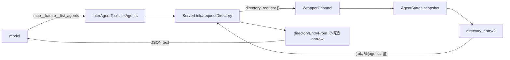

# Phase 27 — list_agents に状況判断メタデータを追加

## Goal

[issue #160](https://gitea.example.invalid/sakurai.yuta/kaoiro/issues/160)
を実装する。`mcp__kaoiro__list_agents` が返す peer entry に稼働状況
6 field を追加し、エージェントが operator の介在なしに

- 残コンテキストが逼迫した peer に重い委任をしない
- 利用上限に張り付いた peer を避ける / 窓明けを待つ
- 長時間無活動の peer を避ける・報告する
- 対話中の peer への割り込みを控える

を判断できるようにする。設計判断はマスター決裁済み
(#160 issuecomment-2211 / -2213)。本 plan はその決定を実装可能な粒度に
落としたもので、決定そのものは変更しない。

## 確定済み前提 (変更禁止)

| # | 決定 | 出典 |
|---|---|---|
| P1 | 取得方式は server が envelope から蓄積した snapshot。wrapper への都度照会はしない | #160 comment-2211 (1) |
| P2 | turn 数 (応答往復数) も server 側で envelope から導出 | 同 (2) |
| P3 | 初版は永続化なし (in-memory、server 再起動でリセット許容)。セッション開始日時のみ既存 `session_starts` DETS の流用可否を調査 | 同 (3) |
| P4 | IA 対話状況は「active な会話の有無 + 相手 agent_id 一覧」まで agent 間に開示。ADR-0021 に agent 間開示の節を追記 | 同 (4) |
| P5 | 追加 field は 6 つ (残コンテキスト / セッション開始日時 / turn 数 / 最終活動時刻 / IA 対話状況 / rate_limits) | #160 本文 + comment-2213 |

## 現行実装経路の調査結果 (#160 明記事項 e)

`list_agents` は wrapper のローカル MCP tool で、実体は server への
`directory_request` 1 往復である。



| 段 | 実体 | 現状 |
|---|---|---|
| tool 定義 | `wrapper/agent-common/src/inter_agent.ts` `descriptors()` / `listAgents()` / `LIST_AGENTS_DESCRIPTION` | 入力 schema は空オブジェクト。provider 未注入なら error result |
| 送信 | `wrapper/core/src/transport.ts` `ServerLink#requestDirectory` | `directory_request` を push、reply の `agents` を `directoryEntryFrom` で narrow |
| 型 | `wrapper/core/src/transport.ts` `DirectoryEntry` | `agent_id` / `persona` / `state` 必須、`engine` / `model` / `effort` optional。**`@kaoiro/protocol` ではなく `@kaoiro/wrapper-core` に居る** |
| 受信 | `server/lib/kaoiro_server_web/channels/wrapper_channel.ex` `handle_in("directory_request", …)` | `AgentStates.snapshot()` から自分を除外して `directory_entry/2` へ |
| 整形 | 同 `directory_entry/2` + `maybe_put_directory_field/3` | latest envelope の `persona` / `state` と `ext.engine` / `ext.model` / `ext.effort` のみ。non-empty string のときだけ載せる |

調査で判明した実装上の重要点:

1. **`AgentStates` は agent ごとに latest envelope 1 件しか持たない。**
   `ext` はその latest envelope のもの。Claude adapter は `#statusExt` を
   毎 state_change で lazy stamp する (ADR-0040 D2) ため
   `ext.context` / `ext.rate_limits` は最新 state_change に載っている。
2. **`log` / `result` / `inter_agent_message` は `append_log` 経路で、
   latest envelope を更新しない** (`store/1`)。よって turn 数・最終活動
   時刻を latest envelope から導出することはできない。ingest 点
   (`handle_in("envelope", …)`) での計測が必要。
3. **切断時の `disconnected` envelope は `ext` を `%{}` に落とす**
   (`AgentStates.disconnected_envelope/2`)。切断済み peer では
   `context` / `rate_limits` が自動的に消える。これは望ましい挙動なので
   そのまま利用する (stale 値を出さない)。
4. **`directoryEntryFrom` は entry を明示構築するので未知 field を落とす。**
   server だけ更新しても旧 wrapper では新 field が model に届かない。
   後方互換の観点で TS 側の narrow 拡張が必須。
5. **`ext` の viewer 除去は `AgentsChannel.sanitize_envelope_for/2` の
   責務で、`directory_request` は `WrapperChannel` の別経路**。つまり
   ADR-0021 の viewer 秘匿は本変更に一切かからない。逆に言えば agent 間
   開示は ADR-0021 が未定義の軸であり、追記が必要 (P4)。

### `session_starts` DETS の流用可否 (P3 の調査)

`KaoiroServer.SessionStarts` は `{agent_id, order, display, sid, pending}`
を DETS に持つ。`display` は ISO8601 で、session transition を server が
認識した時刻である。流用可否の結論は **「fallback としてのみ流用可、
primary source にはしない」**。

| 論点 | 事実 | 帰結 |
|---|---|---|
| カバー率 | `advance_transition/2` は `prior != nil and prior != new_sid` のときだけ発火 (`wrapper_channel.ex maybe_advance_session_boundary/2`) と、`SessionResets` の /clear・/new 経路のみ | **初回 spawn の agent には record が無い**。primary にすると新規 agent で常に欠損 |
| 意味 | `display` は「server が遷移を認識した時刻」。resume で同一 sid なら advance しないため、現セッションの開始時刻として整合的 | 意味論は流用可能 |
| 副作用 | record は `IngressOrder` を消費し、#109 clear watermark / #105 IA filtering の boundary order に効く | **書き込みを増やす改修は禁止**。read-only 参照に留める |
| 永続性 | DETS なので server 再起動を跨いで残る | in-memory tracker が失う情報を埋められる |

よって設計は hybrid とする (下記 D3)。in-memory tracker が
「初回 spawn を含む全ケース」を、`SessionStarts` が「server 再起動を
跨いだ復元」を、それぞれ相補的に埋める。

## Decision

### D1. wire schema — peer entry に 6 field を flat 追加

既存 entry (`agent_id` / `persona` / `state` / `engine?` / `model?` /
`effort?`) と同じ平坦構造に追加する。ネストしたグループは作らない
(既存 3 field と同じ読み方で済む)。

```json
{
  "agent_id": "lab-pc-1.claude-b",
  "persona": { "id": "ao", "name": "あお", "sprite_set": "ao" },
  "state": "idle",
  "engine": "claude-code",
  "model": "claude-opus-5",
  "effort": "high",
  "context": {
    "used_tokens": 132400,
    "max_tokens": 200000,
    "used_percentage": 66.2
  },
  "session_started_at": "2026-07-28T01:12:44Z",
  "turns": 17,
  "last_activity_at": "2026-07-28T03:41:09Z",
  "conversation": { "active": true, "peers": ["lab-pc-1.claude-a"] },
  "rate_limits": {
    "five_hour": {
      "status": "allowed",
      "utilization": 0.42,
      "resets_at": 1785200000
    },
    "seven_day": { "utilization": 0.71, "resets_at": 1785600000 }
  }
}
```

| field | 型 | 意味 | 欠損時 |
|---|---|---|---|
| `context` | `{used_tokens, max_tokens, used_percentage}` | 現セッションの context 使用量。**wire shape は `ext.context` と同一** (dashboard の ctx meter と同じ数値であることを担保) | capability=false / absent の engine、未報告、切断済みでは **field ごと省略** |
| `session_started_at` | ISO8601 (UTC) | 現セッションの開始日時 | server が現セッションの開始を観測しておらず `SessionStarts` からも復元できない場合は省略 |
| `turns` | 非負整数 | 現セッションの応答往復数 (定義は D2) | `session_started_at` を確定できていない entry では省略 (0 と「不明」を混同させない) |
| `last_activity_at` | ISO8601 (UTC) | server が当該 agent の envelope を最後に受理した時刻 | server 再起動後まだ 1 通も受けていない agent では省略 |
| `conversation` | `{active: boolean, peers: string[]}` | active な IA 会話の有無と相手 agent_id 一覧 | **常に含める** (server が必ず判定できるため、D5 参照) |
| `rate_limits` | `{<window>: {status?, utilization?, resets_at?}}` | 最終 turn 時点の利用上限 snapshot。window は `five_hour` / `seven_day` ほか engine 固有 | 未報告 engine / セッション、切断済みでは省略 |

`context` / `rate_limits` は「残量」に変換せず ext の raw shape をそのまま
返す。変換すると dashboard 表示と数値がずれ、#160 受け入れ基準
「dashboard 側の表示と矛盾しない」を破る。残量の解釈 (100 −
`used_percentage`) は model に委ねる。

### D2. turn 数 (応答往復数) の定義

**`type: "result"` の envelope を 1 件受理するごとに +1** とする。

- `result` は「1 回の SDK turn の完了」を表す envelope (ADR-0012) であり、
  両 engine が turn 完了時に emit する。operator 由来か peer 由来かに
  関わらず「入力 → 応答」の往復が 1 回閉じたことを意味する。
- `state: "error"` で終わった `result` も加算する。往復自体は成立して
  おり、疲弊度の指標としては同じ重みを持つ。
- `log` / `state_change` / `inter_agent_message` は加算しない。1 turn の
  中で任意個発生するため往復数にならない。
- resume 再生 (`history_reset` → JSONL replay) は `log` envelope なので
  自動的に加算されない。追加のガードは不要。
- server 合成 envelope (`disconnected` / `escalate-to-user`) は
  `result` ではないので加算されない。IA のハード制限 turn (server 側
  `ConversationStates.turns`) とは **別カウント** である点に注意。

### D3. server 側データモデル — `KaoiroServer.AgentActivity` (新設)

`agent_id => %{session_id, session_started_at, session_start_observed,
turns, last_activity_at}` を持つ in-memory GenServer を新設する。既存
`AgentStates` に相乗りさせない理由: `AgentStates` は「latest envelope の
保管庫」という単一責務で、履歴 ring / boundary patch / disconnect race
guard を既に抱えている。計測状態を混ぜると put/append_log の分岐が
さらに増える。

記録経路は `WrapperChannel.handle_in("envelope", …)` の ingest 1 点。

| 契機 | 更新 |
|---|---|
| 任意の envelope を受理 | `last_activity_at` を受理時刻 (server clock, ISO8601 UTC) で更新 |
| `type == "result"` | `turns` を +1 |
| envelope の `session_id` が既知の非空値から別の非空値へ変化 | セッション遷移とみなし entry を作り直す (`turns=0`、`session_started_at`=受理時刻、`session_start_observed=true`) |
| `SessionResets` が /clear・/new を完了 | 同上を明示 hook で実行 (Codex lazy 采番で `session_id` がまだ nil の期間を取りこぼさないため) |
| agent の初回 envelope (entry 無し) | entry を作るが `session_start_observed=false`。`session_started_at` / `turns` は未確定扱い |
| `AgentsChannel` の `delete_agent` | entry を削除 (既存の `AgentDirectory.delete` / `SessionStarts.delete` と同じ箇所) |

`ts` ではなく **server の受理時刻** を使う。`ts` は wrapper ホストの
時計であり、ホスト跨ぎのズレを判断材料に混ぜたくない
(protocol.md「ホスト跨ぎの時刻ズレに注意」)。

`session_started_at` の解決順序:

1. `session_start_observed == true` → tracker の値を使う
2. そうでなく、`SessionStarts.get(agent_id)` の `sid` が当該 agent の
   現 `session_id` と一致する → その `display` を使う (再起動復元)
3. どちらでもない → **field 省略**、`turns` も併せて省略

`turns` は 1 の場合だけ返す。2 の fallback で開始日時が復元できても
往復数は復元できないため、0 から数え直した値を出さない (ADR-0040 の
「推定値を出さない」作法の踏襲)。

### D4. `context` / `rate_limits` の取得元

`AgentStates.snapshot()` が返す latest envelope の `ext.context` /
`ext.rate_limits` をそのまま載せる。tracker には持たせない
(二重の真実源を作らない)。

- `ext.context` は Claude adapter が capability=true のときだけ stamp
  する (ADR-0040 D2/D3)。Codex では絶対に stamp されないので、field は
  自然に省略される。**server 側で `supports_context_usage` を見る分岐は
  書かない** — 値の有無がそのまま capability の投影になっている。
  `null` や推定値を代入しないこと (ADR-0040 D1/D3 踏襲、#160 明記事項 b)。
- `ext.rate_limits` は両 engine が stamp しうる (#16)。未報告なら省略。
- 切断済み peer は `ext` が空になるため両方が消える。stale な数値を
  peer に見せないという意味で正しい。

#### `resets_at` 経過時の解釈規約 (#160 明記事項 c)

`rate_limits` は **当該 peer の最終 turn 時点の snapshot** であり、
idle 中は更新されない。したがって:

- MUST (spec): `resets_at`(Unix 秒) が現在時刻より過去である window は
  **窓が明けたものとみなし、`utilization` / `status` を信用しない**。
- MUST (spec): 消費側 (model / dashboard) がこの判定を行う。server は
  snapshot を加工せず、判定に必要な `resets_at` をそのまま渡す。
  server が窓明けを検知して field を削る案は採らない — server 時計と
  engine 側の窓境界がずれた場合に「上限に達しているのに空に見える」
  という危険側の誤りを生むため。
- SHOULD: `last_activity_at` が古い peer の `rate_limits` は、その分だけ
  古い情報であると解釈する。両 field を並べて返すのはこのため。

### D5. IA 対話状況の導出 (`conversation`)

`KaoiroServer.ConversationStates` は
`conversation_id => %{agents: MapSet, …}` を保持している。ここに
**副作用のない read-only API** を 1 本追加する:

```elixir
@doc "agent_id が参加中の会話の、当該 agent 以外の参加者 id 集合。"
def peers_of(agent_id, server \\ __MODULE__)
```

- 戻り値は agent_id のソート済みリスト (会話をまたいで重複排除)。
- `conversation_id` は **返さない**。P4 の開示範囲は「有無 + 相手
  agent_id 一覧」までであり、`conversation_id` の機密性は
  [#17](https://gitea.example.invalid/sakurai.yuta/kaoiro/issues/17) の
  別論点として保留する。
- `claim_unreachable_targets/3` は notified フラグを立てる副作用がある
  ので流用しない。
- entry は done / ハード制限超過 / wallclock GC で消えるため、
  「active」の定義は「その時点で `ConversationStates` に entry がある」
  と一致する。GC 周期 (60 秒) 分の遅れは許容する。
- `conversation` は **常に載せる** (`{active: false, peers: []}` を含む)。
  他 5 field と違い engine 非依存で server が必ず判定できるため、
  「省略 = 不明」とする理由がない。旧 server では field ごと absent に
  なるので、消費側は absent と `active: false` を区別できる。

### D6. 後方互換 (#160 明記事項 a)

- 既存 field は一切変更しない。追加のみ。`version` 据え置き
  (ADR-0010 / ADR-0015 の未知キー追加規約)。
- 旧 wrapper × 新 server: `directoryEntryFrom` が新 field を落とす。
  entry 自体は今までどおり返るので機能低下のみ、破壊はしない。
- 新 wrapper × 旧 server: 新 field が来ないので narrow が optional として
  落とす。`conversation` も absent になり「不明」として扱われる。
- 追加 field は **すべて optional**。1 field の欠損が entry 全体の破棄に
  ならないよう、narrow は field 単位で判定する (既存
  `maybe_put_directory_field` / `for key of [...]` と同じ方針)。

### D7. `DirectoryEntry` 型の置き場所

現在 `DirectoryEntry` は `@kaoiro/wrapper-core`
(`wrapper/core/src/transport.ts`) にある。#160 本文の「共有型は
`@kaoiro/protocol` に追加する」は、この現状を踏まえると
**移動を伴う**。本 phase では移動しない:

- 移動は import 元の変更を wrapper 4 パッケージに波及させる純粋な
  リファクタで、6 field 追加とは独立している。
- server / dashboard は Elixir / 別型定義なので、protocol package に
  置く実利が現時点で無い。

新 field は既存 `DirectoryEntry` を拡張する形で `wrapper-core` に足す。
`@kaoiro/protocol` への移設が必要になったら別 issue とする
(→ Open items O1)。

## 影響範囲 (spec docs)

| doc | 差分方針 |
|---|---|
| `docs/specs/protocol-inter-agent.md` | 主戦場。「peer directory の情報境界 (#102)」節を 6 field 追加に合わせて書き直し、除外リストから `context` / `rate_limit` を外す。`directory_request` 行の entry shape を更新。コンパニオンツール表の `list_agents` 用途説明を更新。`resets_at` 解釈規約 (D4) と `conversation` の常時同梱 (D5) を Constraints に MUST として追加。`session_started_at` / `last_activity_at` は「**server が観測した時刻**」であり wrapper 実測値ではないと定義を明記する (裁定 O3) |
| `docs/specs/protocol.md` | L222 の `directory_request` 行が #102 の `engine`/`model`/`effort` 追加を反映しておらず既に drift している。本 phase で 6 field 込みの現行 shape に修正し、詳細は protocol-inter-agent へのポインタに寄せる (重複記述を作らない) |
| `docs/specs/threat-model.md` | 緩和策表と Constraints は viewer/operator 軸のまま。agent 間開示という第 3 の軸が入ったことを 1 行追記し、ADR-0021 の新節を参照させる |
| `docs/adr/0021-role-information-disclosure-policy.md` | F6「agent 間開示 (peer directory)」を追記。詳細は下記 |

### ADR-0021 追記案 (P4)

新規 ADR は **不要** と判断する。ADR-0021 の主題は「誰に何を見せるか」
の allow-list ポリシであり、agent という主体が増えるのは同じ主題の軸の
追加である。Decision の F1〜F5 は無効化されず (viewer/operator の
マトリクスは不変)、supersede にも当たらない。ADR-0021 に節を足すのが
単一情報源の原則に合う。

以下は 27-C1 でそのまま ADR-0021 の Decision 末尾へ挿入する実文案。
本 phase (設計) では ADR 本文には手を入れない — 未実装の決定を
accepted ADR に先行して載せると status が drift するため。

> ### F6: agent 間開示 (peer directory)
>
> F1〜F5 は client (dashboard) 向けの `agents:lobby` 配信を対象とする。
> [issue #160](https://gitea.example.invalid/sakurai.yuta/kaoiro/issues/160)
> で agent が peer の稼働状況を読んで委任判断を行う要求が生じたため、
> **第 3 の開示主体として `agent` を定義する**。
>
> **F6-1 — `agent` は `operator` の部分集合ではない。** operator が
> 見る経路 (`agents:lobby` / `AgentsChannel.sanitize_envelope_for/2`) と
> agent が見る経路 (`wrapper:<id>` /
> `WrapperChannel.handle_in("directory_request", …)`) は別実装であり、
> 片方の allow-list がもう片方を守らない。両者は独立に判断する。
>
> **F6-2 — peer directory も allow-list 方式。** `directory_entry/2` が
> 明示列挙した field だけが agent 間に出る。envelope の `ext` を丸ごと
> 流し込む実装は禁止する (F2 と同じ fail-closed)。
>
> **F6-3 — 現時点の allow 集合**: `agent_id` /
> `persona{id, name, sprite_set}` / `state` / `engine` / `model` /
> `effort` / `context` / `session_started_at` / `turns` /
> `last_activity_at` / `conversation` / `rate_limits`。
> 後半 6 field は #160 (phase-27) で追加。
>
> **F6-4 — 明示 deny (継続除外)**: `cwd`、`permission` (`sandbox` /
> `approval`)、`permission_mode` / `fast_mode`、`session_id`、
> `pending_permission` (特に `input`)、`pending_question`、
> `slash_commands`、`models` catalog、`resume_snapshot` /
> `resume_drift`、`model_source` / `effort_source`、
> `session_capabilities`、`cost`。委任判断に不要か、operator 固有の
> 作業内容を推測させるため。
>
> **F6-5 — `conversation` は相手 `agent_id` までを開示し、
> `conversation_id` は開示しない。** 会話の存在と相手は委任判断
> (割り込み回避) に必要だが、識別子まで渡すと第三者 agent が既存会話へ
> 割り込める余地を作る
> ([#17](https://gitea.example.invalid/sakurai.yuta/kaoiro/issues/17) の
> 機密性論点)。
>
> **F6-6 — 妥当性の根拠と再評価条件。** 現状 kaoiro は単一 operator
> 配下の閉じた系であり、peer は同一の人間が起動した agent に限られる。
> 稼働状況の相互可視化による露出リスクは小さく、operator 介在の削減
> という便益が上回る。外部 inbound
> ([#98](https://gitea.example.invalid/sakurai.yuta/kaoiro/issues/98))
> 導入時、または agent 間の信頼境界が operator 単位でなくなった時点で
> 本節を再評価する。
>
> **F6-7 — 拡張手順。** peer directory に新 field を足すときは、F5 の
> viewer 判断と同様に **agent 開示の要否を明示判断** し、F6-3 / F6-4 の
> どちらかに列挙してからテストで両主体の可視性を covering する。

## タスク分割

server (Elixir) と wrapper/protocol (TS) で path が重ならないよう分割し、
2 名で並行実装できる形にする。**共有 working tree のため
`git add` は各自の担当 path のみを指定すること。**

### Track A — server (Elixir)

担当 path: `server/lib/**`, `server/test/**`

| Task | 内容 | 主な path |
|---|---|---|
| 27-A1 | `KaoiroServer.AgentActivity` 新設 (D3)。GenServer + `record_envelope/2` / `reset_session/2` / `get/1` / `delete/1`、`@max_agents` 相当の上限、`Application` の supervision tree へ登録 | `server/lib/kaoiro_server/agent_activity.ex`, `server/lib/kaoiro_server/application.ex` |
| 27-A2 | `ConversationStates.peers_of/2` 追加 (D5)。副作用なし、重複排除 + ソート | `server/lib/kaoiro_server/conversation_states.ex` |
| 27-A3 | ingest 配線。`WrapperChannel.handle_in("envelope", …)` から `AgentActivity.record_envelope/2` を呼ぶ。`SessionResets` の /clear・/new 完了点から `reset_session/2` を呼ぶ。`delete_agent` 経路から `delete/1` | `server/lib/kaoiro_server_web/channels/wrapper_channel.ex`, `server/lib/kaoiro_server/session_resets.ex`, `server/lib/kaoiro_server_web/channels/agents_channel.ex` |
| 27-A4 | `directory_entry/2` を 6 field 対応に拡張 (D1/D3/D4/D5)。`SessionStarts` fallback (D3 解決順序 2) を実装。field 単位の省略規約を helper に集約 | `server/lib/kaoiro_server_web/channels/wrapper_channel.ex` |
| 27-A5 | テスト: `agent_activity_test.exs` 新設 (turn カウント / セッション遷移 / fallback / 上限)、`conversation_states_test.exs` に `peers_of/2`、`wrapper_channel_test.exs` に directory reply の 6 field 検査 (欠損時の省略、`conversation` 常時同梱、切断後に `context`/`rate_limits` が消えること) | `server/test/**` |

### Track B — wrapper / protocol (TypeScript)

担当 path: `wrapper/**`, `protocol/**`

| Task | 内容 | 主な path |
|---|---|---|
| 27-B1 | `DirectoryEntry` に 6 field を optional 追加 (D1/D7)。JSDoc に欠損規約 (省略 = 不明、`null` は出さない) を明記 | `wrapper/core/src/transport.ts` |
| 27-B2 | `directoryEntryFrom` の narrow 拡張。field 単位で型検査し、不正な field だけ落として entry は返す。`context` は 3 数値 field、`rate_limits` は window map、`conversation` は `{active: boolean, peers: string[]}` を検査 | `wrapper/core/src/transport.ts` |
| 27-B3 | `LIST_AGENTS_DESCRIPTION` を更新。追加 field の意味と、model が取るべき判断 (残 context 逼迫 peer に重い委任をしない / `resets_at` 経過なら窓明けとみなす / `conversation.active` な peer への割り込みを控える / `last_activity_at` が古い peer は停滞を疑う) を記述。**省略された field を「0」や「問題なし」と読まない** ことも明記 | `wrapper/agent-common/src/inter_agent.ts` |
| 27-B4 | テスト: `transport.test.ts` に narrow の正常系・malformed drop・未知 field 無視、`inter_agent.test.ts` に list_agents 結果が新 field を素通しすることの検査 | `wrapper/core/test/**`, `wrapper/agent-common/test/**` |

### Track C — docs (どちらかが実装完了後に一括)

| Task | 内容 | 主な path |
|---|---|---|
| 27-C1 | ADR-0021 に F6 節を追記 (上記骨子) | `docs/adr/0021-role-information-disclosure-policy.md` |
| 27-C2 | `protocol-inter-agent.md` の情報境界節・`directory_request` 行・コンパニオンツール表・Constraints 更新 | `docs/specs/protocol-inter-agent.md` |
| 27-C3 | `protocol.md` L222 の drift 修正 + ポインタ化、`threat-model.md` に agent 間開示軸の 1 行追記 | `docs/specs/protocol.md`, `docs/specs/threat-model.md` |
| 27-C4 | 本 plan の Progress 表と frontmatter (`status` / `last_updated`)、`docs/plans/README.md` の phase 27 行 (起案時に ⏳ で登録済み) を実状に更新 | `docs/plans/**` |

依存関係: 27-A1 → 27-A3 → 27-A4、27-A2 → 27-A4。Track B は Track A と
独立に着手できる (wire 定義 D1 が両者の契約)。Track C は A/B 完了後。

## Progress

| Task | 状態 | 内容 |
|---|---|---|
| 27-A1 | ⏳ | `AgentActivity` 新設 |
| 27-A2 | ⏳ | `ConversationStates.peers_of/2` |
| 27-A3 | ⏳ | ingest / reset / delete 配線 |
| 27-A4 | ⏳ | `directory_entry/2` 6 field 拡張 |
| 27-A5 | ⏳ | server テスト |
| 27-B1 | ⏳ | `DirectoryEntry` 型拡張 |
| 27-B2 | ⏳ | `directoryEntryFrom` narrow 拡張 |
| 27-B3 | ⏳ | `LIST_AGENTS_DESCRIPTION` 更新 |
| 27-B4 | ⏳ | wrapper テスト |
| 27-C1 | ⏳ | ADR-0021 F6 追記 |
| 27-C2 | ⏳ | `protocol-inter-agent.md` 更新 |
| 27-C3 | ✅ | `protocol.md` L222 の #102 drift 修正 (設計時に先行実施)。`threat-model.md` の 1 行追記は未 |
| 27-C4 | 🟡 | README へ phase 27 行を登録済み。plan status の更新は実装後 |

## Acceptance Criteria

- [ ] `list_agents` の各 peer entry に 6 field が D1 の shape で含まれる
- [ ] capability を持たない engine (Codex) では `context` が **省略** され、
      `null` も推定値も現れない (ADR-0040 踏襲)
- [ ] `rate_limits` を未報告の engine / セッションでは field ごと省略される
- [ ] 切断済み peer では `context` / `rate_limits` が消える
- [ ] `conversation` は常に含まれ、会話が無ければ
      `{active: false, peers: []}` になる。`conversation_id` は含まれない
- [ ] server 再起動直後、まだ envelope を受けていない agent では
      `turns` / `last_activity_at` / `session_started_at` が省略される
      (0 や現在時刻で埋めない)
- [ ] `SessionStarts` に現 `session_id` の record がある agent では、
      server 再起動後も `session_started_at` が復元される。ただし `turns`
      は復元されず省略される
- [ ] /clear・/new 実行後、`turns` が 0 に戻り `session_started_at` が
      更新される。restore (別 session_id での復帰) でも同様
- [ ] 旧 wrapper (narrow 未更新) が新 server に `directory_request` を
      投げても entry が壊れず、既存 field で従来どおり動作する
- [ ] `context` / `rate_limits` の数値が dashboard の ctx meter /
      rate 行と一致する (#160 受け入れ基準)
- [ ] ADR-0021 に F6 が追記され、明示 deny 集合が列挙されている
- [ ] `server && mix test` / `wrapper && pnpm test` / `pnpm typecheck` が
      pass

## Non-goals

- 永続化 (turn 数・最終活動時刻の DETS 保存)。P3 により初版は in-memory。
  必要になれば後続 issue。
- `conversation_id` の agent 間開示 (#17 の別論点)。
- capability を持たない engine への残コンテキスト推定値の投影
  (ADR-0040 で不採用済み)。
- `DirectoryEntry` 型の `@kaoiro/protocol` への移設 (D7)。
- dashboard 側の表示追加。本 phase は agent 間 wire のみ。

## Risks / 注意

| 項目 | 内容 |
|---|---|
| #164 との依存 | [#164](https://gitea.example.invalid/sakurai.yuta/kaoiro/issues/164) (claude 5h が常に 0% / claude 7day 未表示 / codex 7day 非表示) は **同一データ源**。#164 未修正のまま本 phase を検収すると `rate_limits` の受け入れ検証ができない。#164 の修正完了を検収の前提とする |
| 計測の hot path | `record_envelope/2` は全 envelope 受理で走る。GenServer call を毎回張ると ingest がボトルネックになりうる。`AgentDirectory.touch/1` と同じく **cast (fire-and-forget)** で実装し、read 側 (`directory_request`) だけ call にする |
| tracker の上限 | `AgentStates` と同じく agent 数上限を持たせる。未認証 wrapper が捏造 agent_id で map を膨らませる経路を塞ぐ |
| GC 周期の遅れ | `conversation.active` は `ConversationStates` の GC (60 秒周期) に従うため、wallclock 超過直後の最大 60 秒は active に見えうる。判断材料としては許容範囲だが spec に注記する |
| 時計 | `last_activity_at` / `session_started_at` は server clock。peer の `ts` (wrapper ホスト clock) と混ぜない |

## 裁定済み論点 (2026-07-28、クロエ経由でマスター裁定)

起案時の Open items 3 点は起案者推奨どおり確定した。以降は決定事項として
扱う (再提起不要)。

| # | 論点 | 裁定 |
|---|---|---|
| O1 | #160 本文の「共有型は `@kaoiro/protocol` に追加」と現状 (`DirectoryEntry` は `wrapper-core` 在) の食い違い | **本 phase は `wrapper-core` 拡張に留める** (D7 のとおり)。`@kaoiro/protocol` への移設は別 issue 化 (クロエが起票)。Track B の工数は現行見積のまま |
| O2 | `turns` の省略条件 (D3)。再起動後は `last_activity_at` だけ出て `turns` が無い状態が発生する | **observed するまで省略**。「0」と偽るより欠落が正しい。数値の連続性より正確さを優先 |
| O3 | `session_started_at` の fallback (`SessionStarts.display`) は wrapper のセッション開始時刻と厳密には一致しない | **許容**。ただし spec (27-C2) に「**server が遷移を観測した時刻**」と定義を明記すること。実測値ではないと読み手が判別できる形にする |

## References

- [issue #160](https://gitea.example.invalid/sakurai.yuta/kaoiro/issues/160)
  — 本 phase の起点。決定は comment-2211 / -2213
- [issue #164](https://gitea.example.invalid/sakurai.yuta/kaoiro/issues/164)
  — rate_limits 表示不具合 (同一データ源、検収の前提)
- [issue #17](https://gitea.example.invalid/sakurai.yuta/kaoiro/issues/17)
  — conversation_id 機密性の論点
- [ADR-0040](../adr/0040-context-usage-capability.md) — capability driven
  な context 表示、推定値を出さない作法
- [ADR-0021](../adr/0021-role-information-disclosure-policy.md) —
  情報開示ポリシ (本 phase で F6 を追記)
- [ADR-0010](../adr/0010-protocol-precisification.md) /
  [ADR-0015](../adr/0015-protocol-version-stamping.md) — 未知キー追加と
  version 据え置きの規約
- [protocol-inter-agent](../specs/protocol-inter-agent.md) — peer
  directory の情報境界 (#102)
- [phase-8-inter-agent-messaging](phase-8-inter-agent-messaging.md) —
  directory_request の初出
