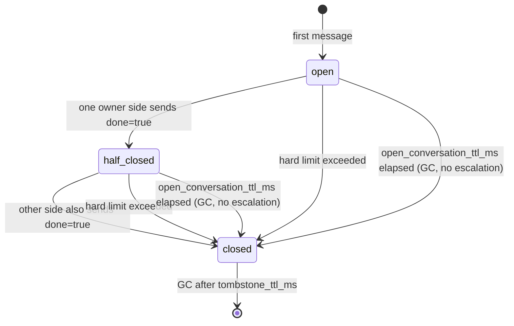

# Inter-agent conversation contract

Structure is defined by `Envelope`, `InterAgentMessagePayload`, and
`InterAgentMessageKind` in [@kaoiro/protocol](../../../protocol/src/index.ts);
this page specifies the corresponding semantics.

### Conversation owner and tie-breaker

`owner` records the intended subject responsible for a conversation. The current
shared wrapper sender emits `{kind: "user", id: "operator"}` for ordinary
messages; this is a placeholder, not a user identity resolved from the wrapper's
connection token. The server validates the field's shape but does not use it to
authorize a tie-breaker or cancellation. Conversation completion is determined
by the participating sender IDs and their `meta.done` values, not `owner.id`.

The original staged design below describes owner-driven coordination, not
implemented server controls. The Phase 3 owner/escalation policy remains future
work in [phase-8](../../plans/phase-8-inter-agent-messaging.md#future--stage-d--phase-3-after-87):

- The intended owner makes the final decision when discussion stalls.
- The Phase 1 design assigned ownership to the user explicitly starting the
  conversation; agent ownership was reserved for autonomous initiation in
  Phase 3. The current placeholder does not establish either provenance.
- For `owner.kind: "user"`, the proposed server intervention dialog on
  `escalate-to-user` would reuse AskUserQuestion's `question_request` /
  `waiting_question` ([ADR-0027](../../adr/0027-askuserquestion-envelope.md)).
  Today inter-agent messages, including this kind, are displayed as transcript
  entries; the kind does not itself create that dialog.
- Routing `escalate-to-owner` to an agent owner was a Phase 3 proposal. It is not
  a supported `kind` in the current nine-value enum.
- An owner-authorized whole-conversation `cancel` event was proposed for Phase 2
  onward. The implemented operator/admin `close_conversation` control instead
  checks the caller's role, not `owner.id`, and closes the tracked conversation
  with reason `operator_closed`, notifying its participants. It is distinct
  from the proposed owner-authorized event.

### Hard limits (config + mechanical enforcement)

The server mechanically monitors these limits per conversation and cuts off on
breach. It broadcasts a synthetic envelope (`kind: "escalate-to-user"`,
`body: "<reason>"`, `meta.done: true`) to every participating wrapper; both
wrappers inject it as SDK input.

| Config key | Unit | Default (Phase 1) | Use |
|---|---|---|---|
| `max_turns` | turns (= message count) | 20 | Total turns in one conversation |
| `max_tokens` | tokens | 100_000 | Cumulative body tokens (coarsely estimated server-side as `floor(byte_size(body)/3) + 1` (UTF-8 bytes, including 1 for an empty body)) |
| `max_concurrent_agents` | agents | 2 | Agents allowed in one conversation_id (fixed at 2 in Phase 1; 3+ considered in Phase 3) |

The implemented configuration is server-global: `ConversationStates` reads
`:kaoiro_server, :inter_agent` once at startup and applies the same limits to
every conversation. The originally proposed per-agent override layer is not
implemented.

**The former `max_wallclock` was removed in issue #211.** Cutting off based on
elapsed conversation time reached `max_turns` before a runaway fast ping-pong
(as in #167, short exchanges reach 20 turns in seconds to minutes), while
preferentially cutting off **slow but valid** conversations such as xhigh-effort
reviews. This reversal of selectivity was measured on 2026-08-11. See issue #211
for details and rationale.

- MUST: Do not count server-synthesized error notices in turns or tokens.

### Memory-reclamation TTL (config, not a hard limit)

These GC-only settings reclaim memory from conversation entries; they are not hard
limits. They return no `{:exceeded, reason}` and synthesize no
`escalate-to-user`—conversation length alone never causes a cutoff.

| Config key | Unit | Default | Use | Reference time |
|---|---|---|---|---|
| `open_conversation_ttl_ms` | ms | 86_400_000 (24 hours) | Reclaim an OPEN entry whose replies stopped (memory-DoS defense) | `started_at` |
| `tombstone_ttl_ms` | ms | 86_400_000 (24 hours) | Delete CLOSED tombstones and release their IDs | `closed_at` |

`tombstone_ttl_ms` is aligned with the wrapper's `CLOSED_TRACK_TTL_MS` (24 hours;
see “CID reuse is not a contract” below).

### Conversation lifecycle and post-close handling (issue #167)

After completion or cutoff, retain the conversation as a state distinct from
unknown/new (a tombstone). This prevents delayed, duplicate, or out-of-order
messages for the same `conversation_id` from being accepted as a new conversation
and restarting a done/escalate ping-pong (issue #167, observed 2026-07-31).

- **open**: Normal conversation; count turns and tokens (issue #211 removed
  wall-clock measurement and cutoff).
- **half-closed (one-sided done)**: One owner side sent `meta.done=true` and the
  other has not. Inject a dedicated “close proposal” rather than a normal reply
  directive: reply once with `done=true` to close, or use a normal response to
  continue (wrapper behavior below).
- **closed (terminal)**: Both owner sides sent done=true, a hard limit was
  exceeded, or `open_conversation_ttl_ms` elapsed (below). The server transitions
  the entry to a tombstone (`status: closed`, `reason`, `closed_at`, participating
  agent set, `last_turn`) without deleting it. Later messages for the same
  `conversation_id` are neither relayed, stored, nor normally broadcast; reject
  with `{:error, :conversation_closed}`. Terminal inbound messages on wrappers
  are **never injected into the model** (issue #211 direction 1). The old spec
  injected an “informational only, do not call send_to_agent” prompt, but spending
  a model turn on a no-reply notice was itself the issue #211 target. The track
  only learns `closed` and cannot trigger another send_to_agent.
- **Closed by `open_conversation_ttl` (issue #211)**: Periodic GC transitions an
  OPEN entry whose `started_at` is older than `open_conversation_ttl_ms` (default
  24 hours) to a tombstone (`reason: :open_conversation_ttl`) without waiting for
  a message. **This is memory reclamation, not a hard limit**; it does not
  synthesize `escalate-to-user` or cut off a conversation merely for being long.
  The former 10-minute `max_wallclock` hard limit also performed this transition;
  issue #211 separated the uses. Broadcast a synthetic `kind: "done"` envelope
  (`turn_number: 0`, `agent_id: "server"`, `meta.done: true`) to every
  participating agent (issue #211 direction 2). Because it is not
  `escalate-to-user`, receivers do not open a meaningless new conversation.
  Receiving wrappers recognize it as a server-originated closed notice via
  `isSynthetic` (below) and update the track to `closed`, but do not inject it into
  the model.
 - **tombstone GC**: Periodic server GC deletes tombstones older than
  `tombstone_ttl_ms`. This TTL is **memory reclamation for UUID collisions**, not
  an operational pattern for intentionally reusing `conversation_id` (see “CID
  reuse is not a contract”). Periodic GC does not immediately delete an expired
  open entry; it first transitions it to an `open_conversation_ttl` tombstone, so
  a delayed message cannot be accepted as new.
 - **Ingress validation and stale_turn rejection** (issue #167 review M1): live
  ingress (normal `envelope` push) accepts only positive integer
  `payload.turn_number`. `0` is reserved for server-synthesized notices and a
  wrapper cannot claim it on this path (the server synthesizes no live-ingress
  messages, so `0` is always invalid here). Even a positive value at or below an
  OPEN conversation's `max_turn_number` (duplicate or delayed) is rejected as
  `{:error, :stale_turn}` without advancing turns, tokens, or the maximum.
  `replay_ia` is a display-only restoration path that legitimately includes old
  `turn_number=0` rows from the wrapper host IA sidecar, so this live-ingress-only
  validation does not apply.

The wrapper (`agent-common`) keeps corresponding local state
(`localDone` / `remoteDone` / `closed`) per conversation_id:

 - After sending `done=true` and receiving peer `done=true`, mark terminal.
  **Also** mark terminal immediately on a server-synthesized closed notice
  (`turn_number=0`, `agent_id: "server"`, `meta.done=true`—
  `kind: "escalate-to-user"` for a hard-limit breach or `kind: "done"` when
  `open_conversation_ttl` elapses, issue #211 direction 2), regardless of local
  done. The server already tombstoned the conversation; misreading it locally as
  a one-sided close proposal would prompt a reply and wastefully bounce a reject
  for a closed conversation. Subsequent `send_to_agent` with that ID returns a
  local tool error without a server round trip. Omitting `conversation_id` starts
  a new conversation. Under issue #211 direction 1, no inbound classified as
  terminal is injected into SDK input (the old “informational only” prompt
  consumed a model turn for a no-reply notice).
- **Recheck queued input at the SDK input boundary**: A peer's inbound mode can
  become obsolete while an earlier host turn is still running. All three wrappers
  reclassify queued items when the peer queue advances and again immediately
  before the host hands input to the engine. Codex applies the latter check in
  both its SDK and app-server paths, before `runStreamed` and `turn/start`
  respectively. A now-terminal item is
  acknowledged without an SDK turn; surviving items use their current mode.
  If every item is removed, the host emits a ready state when its queue is empty.
  Antigravity may retain an unused epoch until its normal idle timer expires.
  An unconfirmed local `done=true` send
  cannot cause a queued item to be discarded: classification retains the saved
  mode until its acceptance is known. During that short wait, an already-sent
  proposal can still elicit a redundant reply after the send is accepted.
- **Serialize concurrent sends for one conversation_id** (issue #167 review
  round 2 M1): If `send_to_agent` calls for the same ID run concurrently (for
  example multiple calls in one turn), serialize numbering through application
  of the server response per conversation_id. Do not serialize the
  `wait_for_response` wait itself—it could block the other call for up to 300
  seconds. Without serialization, rollback after one rejection can overwrite the
  other call's accepted state (`localDone` / `closed`).
- **Delay classification while done is pending** (issue #167 review round 2,
  Fujino rework): If inbound for the same ID (peer done or a server hard-limit
  notice) arrives while a `done=true` send has only optimistically set
  `localDone` and acceptance is unconfirmed, delay classification and state
  application until that send's ack arrives. This short gate covers only that
  send, not the full `wait_for_response` wait. Without it: (1) a generic reject
  arriving after an authoritative server CLOSED can roll it back to OPEN
  ("server=closed, wrapper=open" split brain, violating AC10); or (2) a
  disposition inferred from optimistic `localDone` can be marked terminal,
  skip SDK injection and `notePendingInjection`, then lose the reply path when
  the send is rejected even though the close proposal was only one-sided.
- **Learn `conversation_closed` rejections** (issue #167 review round 2 M2):
  When the server rejects a send with `conversation_closed`, learn the local
  track as closed even if the wrapper never tracked that ID before (a brand-new
  local track). Otherwise each retry round-trips to the server and becomes
  accepted when the server's 24-hour tombstone TTL expires, bypassing the
  wrapper's 24-hour guard described below.
- **Only accepted sends consume `turn_number`** (issue #212): The wrapper-local
  `track.turnNumber` is one counter shared by send and receive. A tentative value
  is assigned before `#dispatch()` in `send_to_agent`; it is consumed only when
  the server **accepts**. A rejected number is not consumed. The old
  implementation advanced `track.turnNumber` after rejection (defect 1 below).
  **Two exceptions** (issue #212 phase-2 advisory 2, Fujino): this accept-gated
  contract applies only to normal sends through `send_to_agent` (`invoke()`).
  `stale_turn` notices (defect 3) and existing `resolveTurnEnd()` peer_error
  notices (issue #127) call `ServerLink#send()` directly in fire-and-forget paths
  and observe no ack. Their numbers therefore cannot be tied to server
  acceptance and are always treated as consumed. This residual asymmetry of
  pre-send numbering is an accepted permanent limit.
- **Rollback `turnNumber` on reject** (issue #212 defect 1): the
  `invoke()` reject branch decrements the tentatively assigned `turnNumber`
  by one only when no inbound activity (`receiveInbound()` /
  `observeInbound()`) for the same conversation_id interrupted the wait for
  `#dispatch()`. If an interruption occurred, the inbound value is
  authoritative and is left unchanged (detected by `mutationGen`; see the
  corresponding comment in `inter_agent.ts`). Rolling back a
  `conversation_closed` reject has little practical value (that CID cannot be
  reused anyway), but for other reject reasons where the conversation
  continues, omitting the rollback would make every later peer turn fail the
  stale check below forever.
- **Reject late, stale, or duplicate turns**: when an incoming
  `turn_number` is at or below the maximum already known for that
  conversation, do not inject it into the SDK or satisfy a reply waiter. The
  server-synthesized envelope (`turn_number=0` for hard-limit or
  unresponsive notices) is a separate path from the wrapper-origin turn
  sequence and is excluded from this check. **The condition must include
  `agent_id === "server"` in addition to `turn_number=0`** (issue #167 review
  M1): checking only the number would let a peer wrapper claim turn zero
  (accidentally or maliciously), causing the receiver to mistake it for a
  server notice and close its own track immediately ("server=open, receiver
  wrapper=closed" split brain). Live-ingress structural validation (below)
  also rejects this forge on the server, while the receiving wrapper checks
  provenance as a second defense. **Since issue #212 defect 3 this discard is
  not silent**: send a `stale_turn` notice to the envelope sender (see the
  [“Error codes”](errors.md#error-codes-initial-set) and [“stale_turn notice structure”](errors.md#stale_turn-notice-structure-issue-212-defect-3) sections for exceptions and
  resynchronization).
- Garbage-collect wrapper-side closed tracks after a 24-hour TTL (to prevent
  leaks in long-lived wrappers).
- **OPEN-track idle TTL and total cap** (issue #167 review round 2 M3, “open
  track unbounded path”): the closed-track TTL above applies only to tracks
  that this wrapper has learned are CLOSED. The server's periodic GC now
  propagates a self-created tombstone to peers through `open_conversation_ttl`
  (issue #211 direction 2; see “closed by open_conversation_ttl” above), but
  this is a single best-effort broadcast and delivery is not guaranteed (for
  example, the receiving wrapper may be disconnected at that moment).
  Therefore, when the notice is missed (the remaining part of issue #199), a
  closing turn is lost, or a peer crashes without reconnecting, the wrapper
  cannot learn that the track is closed; it remains OPEN and is not pruned by
  the closed-track TTL. To close this path, apply an independent 24-hour idle
  TTL from the last activity to OPEN tracks, and cap the combined open + closed
  count (default 20,000), evicting the oldest tracks first. Because issue #211
  removed the server-side `max_wallclock` hard limit, a conversation remaining
  open long enough for idle eviction is no longer guaranteed to have been
  stopped on the server. The server should independently reclaim the same
  entry using `open_conversation_ttl_ms` (default 24 hours, the same order of
  magnitude as this idle TTL), so eviction only discards local bookkeeping
  (`turnNumber` / `localDone` / `remoteDone`) and has little practical impact.
  Explicitly reusing the same conversation_id then creates a new local track
  and can be sent again; a correct server response (including
  `conversation_closed`) is learned locally as in M2 above.

Both the Claude Code and Codex engine adapters use the shared `agent-common`
logic (`InterAgentTool#receiveInbound` / `#invoke`), so the state machine
above is engine-independent.

- MUST (issue #167): Retain a conversation closed by both done flags, a hard
  limit, or `open_conversation_ttl_ms` (issue #211, GC only) as a tombstone
  until `tombstone_ttl_ms` expires. While closed, do not relay, store, or
  broadcast sends for that conversation; reject them with
  `{:error, :conversation_closed}`. Discard counters (turns/tokens/started_at/
  done_by) at closure and never reset them on retry.

#### CID reuse is not a contract (issue #167 review S2)

Looking only at the server tombstone TTL (`tombstone_ttl_ms`, default 24
hours) may suggest that a `conversation_id` can be reused after the TTL, but
that is a server-only detail, not a system-wide contract. **The wrapper-side
closed-track TTL is also 24 hours**; while traffic goes through
`send_to_agent` / `receiveInbound`, a closed `conversation_id` may remain
locally marked “closed” and keep returning a tool error after the server TTL
expires. If the same wrapper remains alive or reconnects, reuse immediately
after the server TTL still fails.

Therefore:

- The server tombstone TTL is only **memory reclamation assuming UUID
  collisions**; it does not mean that intentionally reusing the same
  `conversation_id` is supported. `conversation_id` values are assumed to be
  UUIDv4, so accidental retransmission of the same value is negligibly likely
  and deliberate reuse is not expected.
- The effective “this conversation has ended” guard is the **wrapper's
  24-hour TTL**. To start a new dialogue with the same peer, always omit
  `conversation_id` and let a new UUID be allocated. Explicitly resending a
  closed `conversation_id` is provided neither as a fallback nor as a formal
  API contract.
- **The server `tombstone_ttl_ms` and wrapper `CLOSED_TRACK_TTL_MS` were
  aligned to 24 hours by issue #211** (the old `max_wallclock_ms` was 10
  minutes, creating a shorter asymmetric server side). The alignment removed
  the former reason for short server retention—frequent hard-limit stops—after
  `max_wallclock` ceased to be a hard limit. Having the server forget first
  while the wrapper alone guards reuse has no benefit; equal TTLs simplify the
  operational mental model. The effective guard remains the wrapper's
  24-hour TTL.

## Related inter-agent topics

- [Inter-agent messaging](../../architecture/inter-agent-messaging.md).
- [Inter-agent message contract](messages.md).
- [Inter-agent conversation admission](conversation-admission.md).
- [Remaining protocol topics](../../specs/protocol-inter-agent.md), including [approval](../security/inter-agent-tool-authorization.md#approval-flow-permission_broker-integration), and [session-operation tools](session-tools.md).
- [Delivery confirmation and recovery](delivery.md).
- [Send and wait](send-and-wait.md).
- [Coordination monitoring and display](coordination-monitoring.md).
- [Peer directory and companion tools](directory.md).
