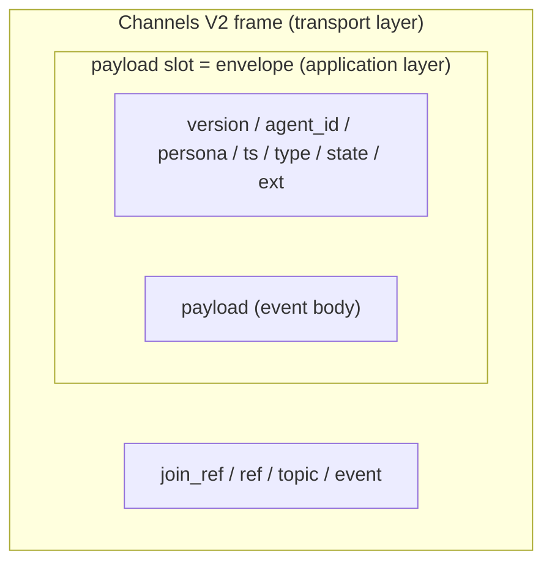

# Envelope contract

### Terms and hierarchy

An **envelope** is the shared JSON object wrapping one kaoiro event. Like an
addressed letter, common metadata (`agent_id`/`persona`/`ts`/`type`/`state`,
etc.) wraps the “contents” (`payload`). The same shape crosses wrapper, server,
and client boundaries, and the server can retain and deliver it without
interpreting contents (agent-independent).

| term | meaning |
|---|---|
| envelope | Common JSON wrapping one complete event, with the outer keys below. |
| outer frame keys | Fixed keys directly under the envelope: `version`/`agent_id`/`session_id?`/`persona`/`display_name`/`ts`/`seq?`/`type`/`state`/`payload`/`ext`. Fixed in v0 (`session_id?` and `seq?` are optional). `display_name` (issue #219 D19) is a mutable name independent of canonical, session-stable `persona.name`; runtime rename changes only the former. Required on every envelope, including server-synthesized ones. |
| `payload` | Event contents for each `type`; see “Types and payload” ([ADR-0010](../../adr/0010-protocol-precisification.md)). |
| `ext` | Extension area added by filters; the core does not depend on its contents. |

**Transport-layer distinction (important)**: the envelope is an application-
layer object. On the wire it is stored **whole in the payload slot** of a
Phoenix Channels V2 frame `[join_ref, ref, topic, event, payload]`. The two
“payload” terms differ: the frame payload is the complete envelope, while the
envelope payload is the event body.



### Envelope v0

```json
{
  "version": "0",
  "agent_id": "lab-pc-1.claude-a",
  "session_id": "f47ac10b-58cc-4372-a567-0e02b2c3d479",
  "persona": { "id": "mio", "name": "澪", "sprite_set": "mio" },
  "display_name": "澪",
  "ts": "2026-06-04T11:55:00Z",
  "seq": 42,
  "type": "state_change",
  "state": "tool_running",
  "payload": { "label": "Edit src/foo.ts", "summary": "ファイルを編集中" },
  "ext": {}
}
```

| field | meaning | notes |
|---|---|---|
| `version` | envelope version | String, used for backward-compatibility decisions |
| `agent_id` | **stable agent identifier** | Fixed by configuration and stable across restarts; charset `[A-Za-z0-9._-]` (no `/` for topic/URL safety) |
| `session_id` | running SDK session ID (optional) | Claude Agent SDK conversation unit; wrapper reports the real ID from init/first result. Separate from agent_id (one agent_id may have N session IDs); resume target ([ADR-0014](../../adr/0014-session-resume-and-restore.md)). Omit when not yet known (new key, same version). |
| `persona` | assigned persona | ID, display name, and sprite set configured by the wrapper. |
| `display_name` | mutable display name | Independent of `persona.name` (canonical, session-stable); a rename changes only this field. Required on every envelope, including server-synthesized ones ([ADR-0050](../../adr/0050-principal-model-and-graded-access-control.md) D1, issue #219 D19). |
| `ts` | event timestamp | ISO8601 (UTC); account for cross-host clock skew. |
| `seq` | wrapper monotonic sequence | Positive integer starting at 1 per process ([ADR-0011](../../adr/0011-phase3-reliability-and-auth.md)); ordering key `(agent_id, seq)` + `ts`. It resets on restart, so server latest-state selection remains **receive order** (last-write-wins). |
| `type` | event type | Closed enum; see “Types and payload”. |
| `state` | current state-machine state | See below. |
| `payload` | body for the type | Shape depends on `type`; see “Types and payload”. |
| `ext` | filter-added extension properties | Examples: `emotion`, `cost`, `danger`. Implemented fields include `cost` (cumulative USD, #8, attached to Claude Code results), `model` (at most 256 UTF-8 bytes), `cwd`, `context` (`{used_tokens,max_tokens,used_percentage}`), `context_budget` (`{work_budget_tokens,work_budget_percentage}`; the first uses the configured soft-work-budget token denominator against the raw window, the second may exceed 100%, issue #254), `rate_limits` (`{<window>:{status,utilization,resets_at}}`, windows such as `five_hour`/`seven_day`), `slash_commands` (`string[]` of available slash-command names for client `/` completion, #34), and `models` (`[{value, display_name, description, effort_levels?, default_effort?, resolved_model?, minimal_client_version?}]` for selectable models and effort ranges). `models.value` is the `setModel` alias; `effort_levels` is omitted for models without effort support; `default_effort` is an automatic candidate for LaunchDialog/model switching and one of `effort_levels` (phase-16, [ADR-0035](../../adr/0035-codex-model-catalog-and-mid-session-switch.md)); `resolved_model` copies upstream `ModelInfo.resolvedModel` as the canonical wire model ID (the target of aliases such as `default`, read-only metadata, absent = unknown; #54 / [ADR-0020](../../adr/0020-dashboard-battery-included-client.md)); `minimal_client_version` is the lowest Codex CLI version that can run the entry, omitted for operator-declared models whose compatibility kaoiro does not know. Also attach `permission_mode` (`'default'\|'acceptEdits'\|'bypassPermissions'\|'plan'\|'dontAsk'\|'auto'`, current Claude Code permission mode, #57), `fast_mode` (`'off'\|'cooldown'\|'on'`, #57), and `models_error` (boolean indicating bounded `supportedModels()` retries exhausted with no cache; `ext.models` remains valid at the bootstrap floor, and `refresh_models` clears the retry counter; [ADR-0037](../../adr/0037-claude-model-catalog-live-refresh.md) F6). `context_budget` is an unknown-key addition within the versioned envelope, not a new message (ADR-0015). Attach `pending_permission` (`{request_id, tool_name, input?, truncated?, ts}`, #59 / [ADR-0022](../../adr/0022-pending-permission-authoritative-source.md)) to `state_change` as the authoritative source while `waiting_permission`; likewise attach `pending_question` (`{request_id, questions, ts}`, [ADR-0027](../../adr/0027-askuserquestion-envelope.md)) while `waiting_question`. Other fields are empty initially. **`ext` is operator-only** and removed for viewers because it can contain sensitive values (issue #46, [threat-model](../../architecture/security-threat-model.md) / [ADR-0021](../../adr/0021-role-information-disclosure-policy.md)). |

#### `ext.engine` (2026-07-10, [ADR-0032](../../adr/0032-codex-adapter.md) F4a)

Engine identifier attached to `state_change`:

- Value: `"claude-code" | "codex" | "antigravity"` (same set as host
  `capabilities`).
- Source: the engine adapter adds it at startup and includes it on every later
  `state_change`.

**Note**: Use `ext.engine` only for display (engine badge) and log/telemetry
identity. **Never infer feature availability from the engine name** ([ADR-0034](../../adr/0034-session-capabilities-advertisement.md) F3); use
`ext.session_capabilities` for add/remove decisions.

## Related protocol topics

- [Message topology](../../architecture/message-topology.md).
- [Event types and payloads](events.md).
- [Channels and directional messages](channels.md).
- [Versioning policy](versioning.md).
- [Permission requests](permission-requests.md).
- [Permission state](permission-state.md).
- [Permission synchronization and audit](permission-sync-audit.md).
