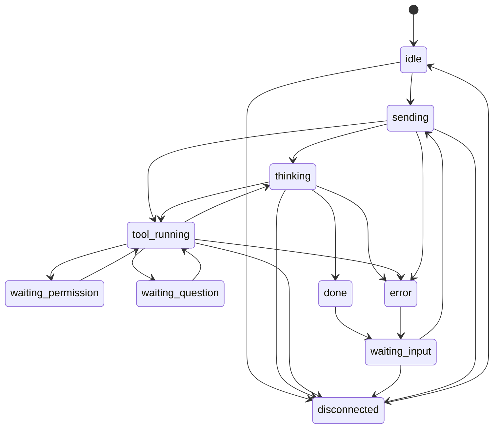

# State machine

### State-machine state set v0 (draft)

Core of practical goal (A), derived from Agent SDK messages. See [agent-sdk-events](../engines/claude-events.md)
for the SDK's **settled message/callback contract and derivation mapping**.

| State | Meaning | Source (SDK) | Future expression |
|---|---|---|---|
| `idle` | Started, no work yet | `SDKSystemMessage` (init) | Normal |
| `sending` | Instruction sent, waiting for response | Wrapper-derived on instruction acceptance (outside SDK, #32) | Sent |
| `thinking` | Model is generating | `SDKAssistantMessage` (text/thinking) | Thinking |
| `tool_running` | Tool is running | `SDKAssistantMessage` (tool_use) → `SDKUserMessage` (tool_result) | Focused |
| `waiting_permission` | Waiting for tool permission | `canUseTool` call with Promise pending | Waiting for operator |
| `waiting_question` | Waiting for AskUserQuestion answer | `canUseTool` (`toolName === "AskUserQuestion"`) with Promise pending, [ADR-0027](../../adr/0027-askuserquestion-envelope.md) | Offering choices |
| `waiting_input` | Turn complete, waiting for next instruction | After `SDKResultMessage`, waiting for streaming input | Waiting |
| `done` | Instant of turn completion | `SDKResultMessage` (success) | Happy (→ `waiting_input`) |
| `error` | Error/retry | `SDKResultMessage` (error_*/is_error) | Concerned |
| `disconnected` | Wrapper connection lost; `ext.disconnect?` identifies a validated origin/reason pair when the disconnect was terminal | Server-derived | Unknown/absent |

Control (gap 1) is also settled: streaming input (`AsyncIterable<SDKUserMessage>`),
`Query.interrupt()`, and `canUseTool` complete within one Query ([agent-sdk-events](../engines/claude-events.md)).

## Related protocol topics

- [Envelope contract](envelope.md).
- [Session lifecycle](session-lifecycle.md).
- [Attachment wire contract](attachments.md).
- [Attachment rendering by engine](../engines/attachment-rendering.md).
- [Message topology](../../architecture/message-topology.md).
