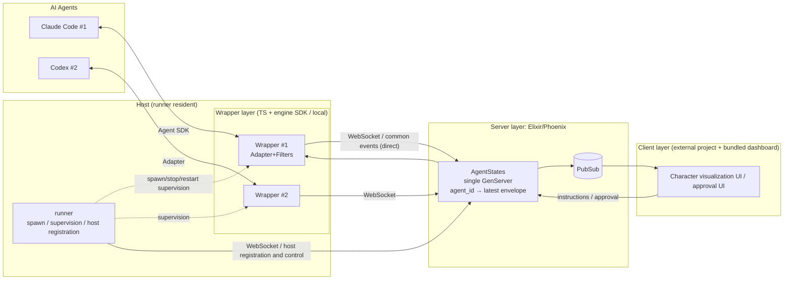

<!-- markdownlint-disable MD033 -->

# Architecture

## Purpose

Defines the three-layer structure, each layer's responsibilities, and the data
flow. See [plugin-model](plugin-model.md) for the plugin extension model and
[protocol](protocol.md) for event formats.

## Definition

### Wrapper package structure (added 2026-07-10, [ADR-0032](../adr/0032-codex-adapter.md) F1)

The wrapper is a four-package pnpm workspace
([ADR-0017](../adr/0017-wrapper-multientity-packages.md) materialized; work in
[phase-13-wrapper-multipackage-restructure](../plans/phase-13-wrapper-multipackage-restructure.md)):

- **`wrapper/core` (`@kaoiro/wrapper-core`)** — entity-independent transport,
  envelope framing, persona, config, and CLI framing
- **`wrapper/agent-common` (`@kaoiro/agent-common`)** — shared AI-agent layer:
  state machine, `EngineAdapter` interface, shared Tool description layer,
  permission broker, and instruction translation
- **`wrapper/claude-code` (`@kaoiro/claude-code`)** — concrete Claude Code CLI
  adapter
- **`wrapper/codex` (`@kaoiro/codex`)** — concrete Codex CLI adapter
  (implemented in
  [phase-14-codex-adapter](../plans/phase-14-codex-adapter.md))

The runner resolves engine selection through `SpawnMessage.engine` (values:
`claude-code` / `codex`; the runner control message in
[protocol](protocol.md)). LaunchDialog shows an engine selector only when the
host's `capabilities` has two or more types.

### Three-layer structure

### Integration approach: hosting engine SDKs

The wrapper hosts each engine's official SDK and uses one mechanism for
observation, control, and permission routing. Claude Code uses the Claude
Agent SDK (TS: `@anthropic-ai/claude-agent-sdk`) and Codex uses the Codex SDK;
both sit behind the `EngineAdapter` interface. For why PTY scraping was not
chosen and what alternatives were considered, see
[ADR-0001](../adr/0001-agent-sdk-integration.md); for the Codex decision, see
[ADR-0032](../adr/0032-codex-adapter.md).

| Use | SDK implementation |
|---|---|
| State observation | Derive state from typed message sequences ([protocol](protocol.md)) |
| Instruction injection | Session resume / streaming input |
| Waiting for permission | Route `canUseTool` (Claude) / tool host bridge (Codex) to the external UI |

Differences between engines are advertised as `ext.session_capabilities` in an
envelope. The UI determines feature availability from this capability rather
than engine names
([ADR-0034](../adr/0034-session-capabilities-advertisement.md)).

### Responsibilities of each layer

- **runner (TS/Node / host resident)**: One runs on each host. It is the
  **supervision layer** for the wrapper process lifecycle (spawn / stop /
  restart / monitoring) and session enumeration. It registers the host with
  the server, sends liveness notifications, and starts or stops wrappers in
  response to operator instructions. It does **not** terminate the data path:
  wrappers remain directly connected to the server (dedicated supervisor;
  [ADR-0023](../adr/0023-host-runner-architecture.md)). It supervises 1 wrapper
  = 1 agent = 1 process and is the unit of survival for failure recovery and
  resume ([ADR-0014](../adr/0014-session-resume-and-restore.md)).
- **wrapper (TS / local)**: SDK-based launch and control; translation of SDK
  messages into common envelopes and state **derivation** (adapter); filter
  pipeline; translation of instructions and approvals into SDK calls; and
  retention of persona and stable ID.
- **server (Elixir/Phoenix)**: WebSocket aggregation (1 connection = 1 channel
  process); one `AgentStates` GenServer holds the `agent_id → latest envelope`
  map; PubSub delivery; and instruction and approval routing. The wrapper
  **derives** state and the server **retains** it (agent-independent). The
  server is the SoT that aggregates persona-pack ingestion, `/api/personas`
  manifest delivery, and `persona_prompt` push
  ([ADR-0029](../adr/0029-persona-server-sot-and-pack-distribution.md),
  [persona-pack-schema](persona-pack-schema.md); the old bundled distribution
  [ADR-0008](../adr/0008-persona-asset-distribution.md) is superseded).
- **client**: Character and expression visualization, multiplexer UI, and
  approval UI. Its implementation is separated into another project. The main
  project includes a simple reference dashboard (Svelte) served by Phoenix
  (static-only delivery can be disabled in configuration; it dogfoods the
  public API, [ADR-0007](../adr/0007-client-separation-reference-dashboard.md)).
  Rendering uses static image variants by persona (animation/3D in the future,
  [ADR-0004](../adr/0004-client-rendering-staged.md)).

### Transport and network

Wrappers run locally, and multiple hosts connect to a central server through
WebSocket (Phoenix Channels). Wrapper token authentication, TLS, and heartbeats
are required; a disconnected connection has the `disconnected` state. See
[ADR-0002](../adr/0002-local-wrapper-websocket-topology.md) for the decision
details. Each host's runner also remains connected to the server for host
registration, liveness notifications, and spawn/stop/restart control. This is
a separate path from the data path
([ADR-0023](../adr/0023-host-runner-architecture.md)). See
[protocol](protocol.md) for the concrete control-message forms.

### Access control

User authentication between client and server uses OAuth + RBAC
([ADR-0005](../adr/0005-access-control-oauth-stub.md)). The prototype started
with a shared-token + role stub. phase-26 implemented individual OAuth
authentication with Google / GitHub / Nextcloud and a text allowlist
([ADR-0042](../adr/0042-oauth-allowlist-login.md)). The two coexist: token
authentication is enabled only when `KAOIRO_CLIENT_TOKENS` is configured. See
[auth-and-authz](auth-and-authz.md) for details.

### Elixir / OTP mapping (server side)

| Concept | OTP/Phoenix implementation |
|---|---|
| Isolation per connection | One channel process per connection (managed by Phoenix) |
| Agent-state retention | One `AgentStates` GenServer (an `agent_id → latest envelope` map; owner pid prevents reconnection races). phase-17 17-7 added history append for `session_boundary` marker envelopes and a `pending_boundary_patch` stash for Codex lazy ID allocation. |
| session-reset lifecycle | One in-memory `SessionResets` GenServer. `check_and_acquire/5` atomically verifies lock + KaoiroState + dispatch cooldown in one handle_call (the ADR-0036 F6 TOCTOU core); `resolve/6` moves the runner's spawn result from `:spawning → :awaiting_connect`; `confirm_connection/2`, triggered by the fresh wrapper's `WrapperChannel.after_join`, broadcasts `session_reset_completed` and runs `SessionPointers.detach_session/1` (the F2 two-phase completion: "only after confirming the connection"). |
| Persistence across restarts | DETS-based GenServer groups: `AgentDirectory` (identity ledger, [ADR-0030](../adr/0030-agent-directory-and-explicit-restore.md)), `SessionPointers` (latest session_id + last effective configuration snapshot), `PermissionModes`, `IngressOrder`, `SessionStarts` / `ClearWatermarks`, `TokenDenylist`, and `DeliveryStates` (recipient-local delivery-confirmation watermark, not a delivery queue, issue #247). Their locations can be replaced with `KAOIRO_*_PATH`. [ADR-0051](../adr/0051-history-restart-resilience.md) removed `InterAgentHistory` (the IA SoT is a sidecar on the wrapper host; display is rebuilt through per-pane projection + hydration handshake). |
| Restart resilience of display history | Display history remains a volatile projection within `AgentStates`. After a restart, it is rebuilt automatically from the transcript / IA sidecar through a hydration handshake with the wrapper (join-response verdict + server-allocated replay_id). The client discards a stale baseline using the projection epoch in a `history` push, then merges only live envelopes arriving between the join and the first `history` push for each connection generation ([ADR-0051](../adr/0051-history-restart-resilience.md)). |
| Failure isolation and restart | Placed under a Supervisor |
| State fan-out | Phoenix.PubSub |
| Client real-time delivery | Consolidated in Phoenix Channels ([ADR-0009](../adr/0009-client-transport.md)); it does not also provide LiveView, plain WebSocket, or SSE |
| Wrapper connection | Phoenix Channels (WebSocket) + token authentication |

### Data flow

1. The wrapper (TS) launches an agent through the Agent SDK and subscribes to
   its message sequence.
2. The adapter translates SDK messages into common envelopes and derives
   state.
3. The filter pipeline adds properties.
4. It sends the result to the server over WebSocket → the Registry updates
   state.
5. The server delivers it to clients through PubSub → expressions update.
6. Client instructions and approvals take the reverse route to the wrapper
   (SDK calls).

## Constraints

- MUST: The wrapper (adapter) derives state, and the server remains
  agent-independent.
- MUST: Do not use PTY scraping
  ([ADR-0001](../adr/0001-agent-sdk-integration.md)).

## Open Questions

None.

## See Also

- Related specs: [plugin-model](plugin-model.md), [protocol](protocol.md),
  [persona-pack-schema](persona-pack-schema.md)
- ADRs: [0001](../adr/0001-agent-sdk-integration.md),
  [0002](../adr/0002-local-wrapper-websocket-topology.md),
  [0004](../adr/0004-client-rendering-staged.md),
  [0005](../adr/0005-access-control-oauth-stub.md),
  [0007](../adr/0007-client-separation-reference-dashboard.md),
  [0008](../adr/0008-persona-asset-distribution.md) (superseded),
  [0014](../adr/0014-session-resume-and-restore.md),
  [0023](../adr/0023-host-runner-architecture.md),
  [0029](../adr/0029-persona-server-sot-and-pack-distribution.md),
  [0030](../adr/0030-agent-directory-and-explicit-restore.md),
  [0032](../adr/0032-codex-adapter.md),
  [0034](../adr/0034-session-capabilities-advertisement.md),
  [0042](../adr/0042-oauth-allowlist-login.md)
