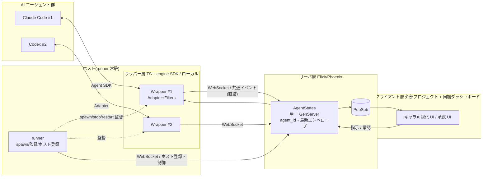

<!-- markdownlint-disable MD033 -->

# アーキテクチャ

## Purpose

3層構成、各層の責務、データフローを定義する。プラグインの拡張モデルは
[plugin-model](plugin-model.md)、イベント形式は [protocol](protocol.md)。

## Definition

### wrapper パッケージ構造 (2026-07-10 追記、[ADR-0032](../adr/0032-codex-adapter.md) F1)

wrapper は 4 パッケージの pnpm ワークスペースで構成される
([ADR-0017](../adr/0017-wrapper-multientity-packages.md) materialise、
実施は [phase-13-wrapper-multipackage-restructure](../plans/phase-13-wrapper-multipackage-restructure.md)):

- **`wrapper/core` (`@kaoiro/wrapper-core`)** — エンティティ非依存の
  transport / envelope 外枠 / persona / config / CLI 枠
- **`wrapper/agent-common` (`@kaoiro/agent-common`)** — AI エージェント
  共通層。状態機械、`EngineAdapter` interface、共通 Tool 記述層、
  permission broker、instruction 変換
- **`wrapper/claude-code` (`@kaoiro/claude-code`)** — Claude Code CLI
  具体アダプタ
- **`wrapper/codex` (`@kaoiro/codex`)** — Codex CLI 具体アダプタ
  ([phase-14-codex-adapter](../plans/phase-14-codex-adapter.md) で実装)

engine の切替は `SpawnMessage.engine` (値: `claude-code` / `codex`) で
runner が解決 ([protocol](protocol.md) の runner 制御メッセージ)、
LaunchDialog は host の `capabilities` が 2 種以上のときのみ engine
セレクトを表示する。

### 3層構成

### 統合方式 — engine SDK のホスティング

ラッパーは engine の公式 SDK をホストし、観測・制御・権限ルーティングを
1 機構で行う。Claude Code は Claude Agent SDK
(TS: `@anthropic-ai/claude-agent-sdk`)、Codex は Codex SDK を使い、
どちらも `EngineAdapter` interface の裏に入る。PTY スクレイプを採らない
理由・代替検討は [ADR-0001](../adr/0001-agent-sdk-integration.md)、Codex 側の
決定は [ADR-0032](../adr/0032-codex-adapter.md)。

| 用途 | SDK での実現 |
|---|---|
| 状態観測 | 型付きメッセージ列から状態導出([protocol](protocol.md)) |
| 指示注入 | セッション resume / ストリーミング入力 |
| 権限待ち | `canUseTool`(Claude)/ tool host bridge(Codex)を外部 UI へ回す |

engine ごとの差は envelope の `ext.session_capabilities` として advertise
し、UI は engine 名ではなくこの capability で機能可否を判定する
([ADR-0034](../adr/0034-session-capabilities-advertisement.md))。

### 各層の責務

- **runner(TS/Node / ホスト常駐)**: 各ホストに 1 つ常駐し、wrapper プロセスの
  ライフサイクル(spawn / stop / restart / 監視)と session 列挙を担う**監督層**。
  サーバへ自ホストを登録・生存通知し、operator 指示で wrapper を起動・停止する。
  データ経路は**終端せず**、wrapper は引き続きサーバへ直結する(supervisor 専任、
  [ADR-0023](../adr/0023-host-runner-architecture.md))。1 wrapper = 1 agent = 1
  process を監督し、障害復旧・resume の生存単位となる
  ([ADR-0014](../adr/0014-session-resume-and-restore.md))。
- **ラッパー(TS / ローカル)**: SDK 経由の起動・制御、SDK メッセージ → 共通
  エンベロープへの翻訳と状態**導出**(アダプタ)、フィルタ列、指示・承認の SDK
  呼び出しへの変換、ペルソナ・安定 ID の保持。
- **サーバ(Elixir/Phoenix)**: WebSocket 集約(1接続=1 channel プロセス)、
  単一の `AgentStates` GenServer が `agent_id → 最新エンベロープ` のマップを保持、
  PubSub 配信、指示・承認のルーティング。状態**導出**はラッパー、**保持**は
  サーバ(agent 非依存)。ペルソナ pack の ingest と `/api/personas`
  マニフェスト配信・`persona_prompt` push が集約する SoT
  ([ADR-0029](../adr/0029-persona-server-sot-and-pack-distribution.md)、
  [persona-pack-schema](persona-pack-schema.md)。旧 bundled 配布
  [ADR-0008](../adr/0008-persona-asset-distribution.md) は supersede 済)。
- **クライアント**: キャラ+表情の可視化、multiplexer UI、承認 UI。実装は別
  プロジェクトに分離し、本体はリファレンス用の簡易ダッシュボード(Svelte)を
  Phoenix 配信で同梱(設定で静的配信のみオフ可、公開 API を dogfooding、
  [ADR-0007](../adr/0007-client-separation-reference-dashboard.md))。描画は
  ペルソナ別の静的差分(将来アニメ/3D、
  [ADR-0004](../adr/0004-client-rendering-staged.md))。

### トランスポートとネットワーク

ラッパーはローカル動作、複数ホストが中央サーバへ WebSocket(Phoenix Channels)で
接続。ラッパートークン認証 + TLS + ハートビート必須、接続断は `disconnected`
状態。決定詳細は
[ADR-0002](../adr/0002-local-wrapper-websocket-topology.md)。各ホストの runner も
同サーバへ常時接続し、ホスト登録・生存通知と spawn/stop/restart 制御を行う(データ
経路とは別系統、[ADR-0023](../adr/0023-host-runner-architecture.md))。制御メッセージ
の具体形は [protocol](protocol.md)。

### アクセス制御

クライアント ↔ サーバのユーザ認証は OAuth + RBAC
([ADR-0005](../adr/0005-access-control-oauth-stub.md))。プロトタイプ期は
共有トークン + role の stub で始め、phase-26 で Google / GitHub /
Nextcloud の OAuth 個人認証とテキスト許可リストを実装した
([ADR-0042](../adr/0042-oauth-allowlist-login.md))。両者は併存し、
トークン認証は `KAOIRO_CLIENT_TOKENS` を設定したときだけ有効。詳細は
[auth-and-authz](auth-and-authz.md)。

### Elixir / OTP マッピング(サーバ側)

| 概念 | OTP/Phoenix での実体 |
|---|---|
| 接続ごとの分離 | 接続ごとに 1 channel プロセス(Phoenix 管理) |
| エージェント状態保持 | 単一 `AgentStates` GenServer(`agent_id → 最新エンベロープ` のマップ、owner pid で再接続レース防止)。phase-17 17-7 で `session_boundary` marker envelope の history append と、Codex lazy 采番用の `pending_boundary_patch` stash を追加 |
| session-reset ライフサイクル | 単一 `SessionResets` GenServer(in-memory)。`check_and_acquire/5` が lock + KaoiroState + dispatch-cooldown を単一 handle_call で atomic 検証 (ADR-0036 F6 TOCTOU 芯)、`resolve/6` が runner の spawn 結果を `:spawning → :awaiting_connect` に遷移、`confirm_connection/2` が fresh wrapper の `WrapperChannel.after_join` からの発火で `session_reset_completed` broadcast と `SessionPointers.detach_session/1` を実行 (F2 「接続確認した時だけ」の two-phase completion) |
| 再起動を越える永続 | DETS ベースの GenServer 群。`AgentDirectory`(identity 台帳、[ADR-0030](../adr/0030-agent-directory-and-explicit-restore.md))、`SessionPointers`(最新 session_id + 最後の実効設定 snapshot)、`PermissionModes`、`IngressOrder`、`SessionStarts` / `ClearWatermarks`、`TokenDenylist`、`DeliveryStates`(recipient-local の配送確認 watermark。配送キューではない、issue #247)。保存先は `KAOIRO_*_PATH` で差し替える。`InterAgentHistory` は [ADR-0051](../adr/0051-history-restart-resilience.md) で撤廃(IA の正本は wrapper ホストの sidecar、表示は per-pane projection + hydration handshake で再構築) |
| 表示履歴の再起動耐性 | 表示履歴は `AgentStates` 内の揮発投影のまま、再起動後は wrapper との hydration handshake(join 応答 verdict + server 採番 replay_id)で transcript / IA sidecar から自動再構築。client は `history` push の projection epoch で stale baseline を破棄し、connection generation ごとの join → 最初の `history` push の間に届いた live envelope だけを merge する([ADR-0051](../adr/0051-history-restart-resilience.md)) |
| 障害隔離・再起動 | Supervisor 配下に配置 |
| 状態の fan-out | Phoenix.PubSub |
| クライアント realtime 配信 | Phoenix Channels 一本化([ADR-0009](../adr/0009-client-transport.md))。LiveView も素の WebSocket / SSE も併設しない |
| ラッパー接続 | Phoenix Channels(WebSocket)+ トークン認証 |

### データフロー

1. ラッパー(TS)が Agent SDK でエージェントを起動し、メッセージ列を購読。
2. アダプタが SDK メッセージを共通エンベロープへ翻訳し、状態を導出。
3. フィルタ列が property を付加。
4. WebSocket でサーバへ送信 → Registry が状態を更新。
5. PubSub 経由でクライアントへ配信 → 表情を更新。
6. クライアント発の指示・承認は逆ルートでラッパー(SDK 呼び出し)へ。

## Constraints

- MUST: 状態の導出はラッパー(アダプタ)が行い、サーバは agent 非依存に保つ。
- MUST: PTY スクレイプを使わない
  ([ADR-0001](../adr/0001-agent-sdk-integration.md))。

## Open Questions

なし。

## See Also

- 関連 specs: [plugin-model](plugin-model.md), [protocol](protocol.md),
  [persona-pack-schema](persona-pack-schema.md)
- ADRs: [0001](../adr/0001-agent-sdk-integration.md),
  [0002](../adr/0002-local-wrapper-websocket-topology.md),
  [0004](../adr/0004-client-rendering-staged.md),
  [0005](../adr/0005-access-control-oauth-stub.md),
  [0007](../adr/0007-client-separation-reference-dashboard.md),
  [0008](../adr/0008-persona-asset-distribution.md)(superseded),
  [0014](../adr/0014-session-resume-and-restore.md),
  [0023](../adr/0023-host-runner-architecture.md),
  [0029](../adr/0029-persona-server-sot-and-pack-distribution.md),
  [0030](../adr/0030-agent-directory-and-explicit-restore.md),
  [0032](../adr/0032-codex-adapter.md),
  [0034](../adr/0034-session-capabilities-advertisement.md),
  [0042](../adr/0042-oauth-allowlist-login.md)
