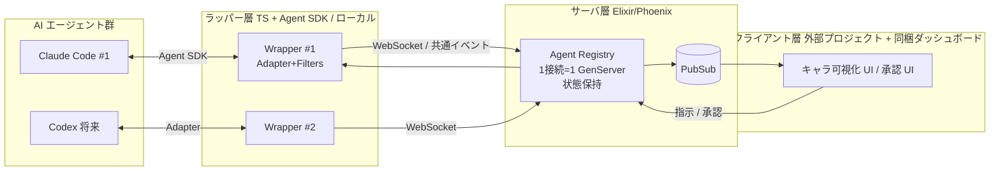

<!-- markdownlint-disable MD033 -->

# アーキテクチャ

## Purpose

3層構成、各層の責務、データフローを定義する。プラグインの拡張モデルは
[plugin-model](plugin-model.md)、イベント形式は [protocol](protocol.md)。

## Definition

### 3層構成

### 統合方式 — Claude Agent SDK

ラッパーは公式 Claude Agent SDK(TS: `@anthropic-ai/claude-agent-sdk`)を
ホストし、観測・制御・権限ルーティングを1機構で行う。採用理由・代替検討は
[ADR-0001](../adr/0001-agent-sdk-integration.md)。

| 用途 | SDK での実現 |
|---|---|
| 状態観測 | 型付きメッセージ列から状態導出([protocol](protocol.md)) |
| 指示注入 | セッション resume / ストリーミング入力 |
| 権限待ち | `PreToolUse`/`canUseTool` を外部 UI へ回す |

### 各層の責務

- **ラッパー(TS / ローカル)**: SDK 経由の起動・制御、SDK メッセージ → 共通
  エンベロープへの翻訳と状態**導出**(アダプタ)、フィルタ列、指示・承認の SDK
  呼び出しへの変換、ペルソナ・安定 ID の保持。
- **サーバ(Elixir/Phoenix)**: WebSocket 集約、1接続=1 GenServer で最新状態
  保持、PubSub 配信、指示・承認のルーティング。状態**導出**はラッパー、**保持**は
  サーバ(agent 非依存)。ペルソナアセットの保管・マニフェスト配信
  ([ADR-0008](../adr/0008-persona-asset-distribution.md))。
- **クライアント**: キャラ+表情の可視化、multiplexer UI、承認 UI。実装は別
  プロジェクトに分離し、本体はリファレンス用の簡易ダッシュボード(Svelte)を
  Phoenix 配信で同梱(設定で静的配信のみオフ可、公開 API を dogfooding、
  [ADR-0007](../adr/0007-client-separation-reference-dashboard.md))。描画は
  ペルソナ別の静的差分(将来アニメ/3D、
  [ADR-0004](../adr/0004-client-rendering-staged.md))。

### トランスポートとネットワーク

ラッパーはローカル動作、複数ホストが中央サーバへ WebSocket(Phoenix Channels)で
接続。ラッパートークン認証 + TLS + ハートビート必須、接続断は `disconnected`
状態。決定詳細は
[ADR-0002](../adr/0002-local-wrapper-websocket-topology.md)。

### アクセス制御

クライアント ↔ サーバのユーザ認証は OAuth + RBAC、プロトタイプは stub
(ホワイトリスト)。[ADR-0005](../adr/0005-access-control-oauth-stub.md)。

### Elixir / OTP マッピング(サーバ側)

| 概念 | OTP/Phoenix での実体 |
|---|---|
| 1 エージェント = 1 監視対象 | 接続ごとに 1 GenServer(最新状態を保持) |
| 障害隔離・再起動 | Supervisor 配下に配置 |
| 状態の fan-out | Phoenix.PubSub |
| クライアント realtime 配信 | Phoenix Channels(または LiveView) |
| ラッパー接続 | Phoenix Channels(WebSocket)+ トークン認証 |

### データフロー

1. ラッパー(TS)が Agent SDK でエージェントを起動し、メッセージ列を購読。
2. アダプタが SDK メッセージを共通エンベロープへ翻訳し、状態を導出。
3. フィルタ列が property を付加。
4. WebSocket でサーバへ送信 → Registry が状態を更新。
5. PubSub 経由でクライアントへ配信 → 表情を更新。
6. クライアント発の指示・承認は逆ルートでラッパー(SDK 呼び出し)へ。

## Constraints

- MUST: 状態の導出はラッパー(アダプタ)が行い、サーバは agent 非依存に保つ。
- MUST: PTY スクレイプを使わない
  ([ADR-0001](../adr/0001-agent-sdk-integration.md))。

## Open Questions

なし。

## See Also

- 関連 specs: [plugin-model](plugin-model.md), [protocol](protocol.md)
- ADRs: [0001](../adr/0001-agent-sdk-integration.md),
  [0002](../adr/0002-local-wrapper-websocket-topology.md),
  [0004](../adr/0004-client-rendering-staged.md),
  [0005](../adr/0005-access-control-oauth-stub.md),
  [0007](../adr/0007-client-separation-reference-dashboard.md),
  [0008](../adr/0008-persona-asset-distribution.md)
