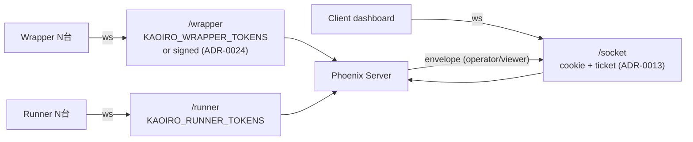

# 認証・認可マップ

## Purpose

認証・認可は protocol / threat-model / 個別 ADR に分散して定義されている。
本 doc は「**どの境界に何の機構があり、どこを越えるとどの権限になるか**」の
俯瞰図として、各境界の機構・実装位置・未設定時の挙動を一箇所に集める。

OSS 公開前監査 ([issue #91](https://gitea.example.invalid/sakurai.yuta/kaoiro/issues/91))
のチェックリストは本 doc を起点に作る。
[threat-model](threat-model.md) が「何を脅威と見なし何で緩和したか」を
扱うのに対し、本 doc は「いま実装されている境界の地図」。**WHY** は ADR /
threat-model 側へ、**HOW** は本 doc + コード参照へという役割分担。

## Definition

### 全体 topology

### Socket 認証 (`server/lib/kaoiro_server/auth.ex`)

| Socket | Topic 規約 | 認証 | env | 未設定時 |
|---|---|---|---|---|
| Wrapper | `wrapper:<agent_id>` | `agent_id:token` ペア / 又は server-minted signed token (ADR-0024) | `KAOIRO_WRAPPER_TOKENS` | `:dev`/`:test` = **dev 緩和** (誰でも join 可、warn ログ) / `:prod` = **fail-closed** (issue #138) |
| Runner | `runner:<host_id>` | `host_id:token` ペア | `KAOIRO_RUNNER_TOKENS` | 同上 (issue #138) |
| Client | `agents:lobby` | `token → role` (operator/viewer) | `KAOIRO_CLIENT_TOKENS` | **fail-closed** — 全 env で全 client 拒否 |

3 種ともトークン比較は `Plug.Crypto.secure_compare/2` で定数時間。
未配置 id でも比較が走るのでタイミング側チャネルなし。未設定時の状態は
起動時 `Auth.warn_token_config/0` が WARN ログを残す。

wrapper/runner の dev 緩和は `:prod` (`config.exs` の `env: config_env()` を
`Application.get_env(:kaoiro_server, :env)` で実行時参照) では働かない。
release を token 未設定のまま起動すると全 wrapper/runner 接続が拒否され、
`scripts/dev.sh` の `:dev` 実行には影響しない (issue #138)。

### Topic 認可 (channel `join/3`)

- Wrapper: `wrapper_channel.ex:32` で agent_id charset (`AgentId.valid?`) と
  二重接続 (`reject_if_connected/1`、 ADR-0024 D5 reject-newcomer) を検証
- Runner: `runner_channel.ex` で host_id charset 検証
- Client: `agents_channel.ex` は `agents:lobby` のみ。socket assigns に role
- charset は `[A-Za-z0-9._-]` ([#61](https://gitea.example.invalid/sakurai.yuta/kaoiro/issues/61))。
  topic 文字列インジェクションを構造的に防止

### Role-based 出力 gate ([ADR-0021](../adr/0021-role-information-disclosure-policy.md))

`AgentsChannel.handle_out` の **allow-list 方式**。viewer に届くのは:

- `state_change` (`ext` 除去 — cwd / model / context / rate_limits / pending_permission を全部隠す)
- `agent_deleted`
- `permission_request` (合成 `state_change(waiting_permission)` に書き換え — tool_name / input / request_id すべて除去)

他 (`log` / `result` / `inter_agent_message` / `runner_sessions` /
`spawn_result` / `hosts` / `history_cleared` / `history_reset`) は viewer
完全除去 (fail-closed)。新規 envelope type は明示宣言しない限り届かない
(`sanitize_envelope_for(:viewer, _) -> :drop`)。脅威ベース解説は
[threat-model](threat-model.md) MUST 群。

### Operator 限定 inbound (`handle_in`)

`require_operator(socket)` を最初に通す:

- `instruction` / `permission_decision` / `interrupt`
- `set_model` / `set_effort` / `set_permission_mode`
- `spawn` / `stop` / `restart` / `enumerate_sessions` / `restore`
- `clear_history` / `delete_agent`
- `attach_open` / `attach_chunk` / `attach_close`

viewer からの同 event は `{:error, :forbidden}` で拒否。

### ツール認可 — canUseTool / PermissionBroker

- wrapper の `Options.allowedTools` (config の `allowed_tools`) が SDK
  ツール実行の **天井**。server / client から拡張不可
- 既定 allow は read-only セット (Read / Grep / Glob / LS / NotebookRead)
- それ以外は SDK の `canUseTool` → `PermissionBroker.decide/2` → dashboard
  に `permission_request` envelope (operator 限定) → operator が許可/拒否
  (`permission_decision`、operator 限定 relay)
- broker timeout は wrapper config の `permission_timeout_ms`、未設定なら
  無期限待機 (SDK 既定) — operator 不在で deny に倒れる事故を避ける選択
  ([ADR-0022](../adr/0022-pending-permission-authoritative-source.md))

### MCP (`mcp__kaoiro__send_to_agent`)

- `wrapper/src/inter_agent.ts` の in-process SDK MCP server を
  `Options.mcpServers` に注入
- ツール名規約により **既定 allowedTools に含めない** → 必ず broker 経由
- routing は server の `route_inter_agent`、quota は `ConversationStates`
- 詳細: [protocol-inter-agent](protocol-inter-agent.md)

### Cookie / ticket セッション ([ADR-0013](../adr/0013-user-token-cookie-persistence.md))

- 初回認証: `?token=...` を **POST body** で交換 (URL ログ流出回避) →
  httpOnly + 暗号化 session cookie (3 日スライド)
- WS 再接続: GET `/session/ticket` で 30s 短命 Phoenix.Token → WS query
  接続 (Vite dev proxy が cookie を WS upgrade に転送できない制約への対応)
- socket id は `Auth.socket_id/1` で SHA-256 ハッシュ (revoke 用 ID、 raw token は保持しない)

### Wrapper トークンの 2 系統

1. **Pre-registered**: env `KAOIRO_WRAPPER_TOKENS` の `agent_id:token` ペア
2. **Server-minted signed token**: spawn 経路 (ADR-0024) で `Auth.mint_wrapper_token/1` が
   `Phoenix.Token.sign/3` で発行。secret は `Endpoint.secret_key_base`。
   有効期限は無期限、revoke は以下 2 経路 (2026-07-23、[#72](https://gitea.example.invalid/sakurai.yuta/kaoiro/issues/72) 実装済):
    - **per-agent_id denylist** (`KaoiroServer.TokenDenylist`、DETS 永続):
      `Auth.authorize_wrapper/2` が既存 signature check より前で照合、
      `delete_agent` 経路が auto-revoke で seed、operator の
      `revoke_wrapper_token` handler が明示投入。書き込みは synchronous +
      `:dets.sync/1` fsync-gated (ack / broadcast 前に永続確定)。live
      channel は `wrapper:<id>` topic への `revoked` broadcast を
      intercept して `handle_out` で `{:stop, :shutdown, socket}`。fail-closed:
      store corruption 時は起動 fail (DETS ファイルは forensic 用に保持)。
    - **secret_key_base rotation**: fleet 全体一括失効 (heavy-hammer)

## Known gaps (設計上の選択 + 未対応)

| 領域 | 現状 | 補償 | 関連 |
|---|---|---|---|
| **エージェント間 ACL** | A→B 送信のサーバ側許可リストなし | broker dialog (operator 都度承認) が唯一の人間ゲート | [#17](https://gitea.example.invalid/sakurai.yuta/kaoiro/issues/17) Phase 1 意図的選択 |
| **メッセージ内容検査** | server は payload を解釈しない (size cap のみ) | なし — prompt injection 攻撃は素通り | [#18](https://gitea.example.invalid/sakurai.yuta/kaoiro/issues/18) Phase 2 |
| **operator role 細分** | operator は全権 (spawn / interrupt / approve / clear など) | なし — 単一テナント前提 | [#65](https://gitea.example.invalid/sakurai.yuta/kaoiro/issues/65) OAuth + RBAC |
| **トークン即時失効** | 稼働中 WS の強制切断は未実装 | env 更新 + 再起動で次接続から効く / heartbeat 失敗で client 自発切断 | [#47](https://gitea.example.invalid/sakurai.yuta/kaoiro/issues/47) |
| **signed token revoke** | **per-agent_id denylist 実装済 (2026-07-23、[#72](https://gitea.example.invalid/sakurai.yuta/kaoiro/issues/72))**: TokenDenylist DETS + Auth.authorize_wrapper 照合 + delete_agent 連動 auto-revoke + operator 明示 revoke handler + revoked broadcast による live disconnect | key rotation はいまも fleet 全体一括失効の重量オプションとして残る | 実装完 |
| **マルチテナント隔離** | 全 operator が全エージェントを操作可能 | なし — single tenant 前提 | OAuth 本実装まで保留 |
| **dev fallback の混入リスク** | **解消済 (2026-07-25、[#138](https://gitea.example.invalid/sakurai.yuta/kaoiro/issues/138))**: `:dev`/`:test` は従来通り未設定で全許可、`:prod` は未設定なら fail-closed (全拒否) | 起動時 WARN ログ (env 別文言) | 実装完 |
| **監査ログ** | 「誰がいつどの agent に何を送ったか」の永続記録なし | なし | 将来 (SQLite 導入時) |
| **tool input マスキング** | コマンドライン / パスは生のまま operator dialog に表示 | operator 限定配信 + 16KB 切り詰め | 将来 |
| **runner-less wrapper auth** | localhost 直結のみ。spawn を経由しないと token 取得できない | runner 必須 | [#71](https://gitea.example.invalid/sakurai.yuta/kaoiro/issues/71) |
| **conversation_id 機密性** | dashboard 全 operator に観測される | participants_mismatch ガードで第三者流用は弾く | [#17](https://gitea.example.invalid/sakurai.yuta/kaoiro/issues/17) Phase 1 意図的 |

## Constraints (MUST)

- MUST: 認証境界・role gate の追加は本 doc にも反映する (single source of truth)
- MUST: `KAOIRO_*_TOKENS` のフォールバック挙動は変更時に 3 ノード分まとめて
  再検証する (`Auth.warn_token_config/0` も追従)
- MUST: 新規 envelope type / channel event を足す際は `sanitize_envelope_for/2`
  の allow-list を必ず更新 (fail-closed の前提が崩れる)
- MUST: 新規 operator-only inbound event は `require_operator/1` を `with` の
  最初に置く
- MUST: 新規 in-process MCP tool を SDK に注入する際、既定 allowedTools に
  含めるかどうかを明示判断する (含めない = 都度承認、含める = 無監督)

## Release-time audit checklist

OSS 公開前監査 ([#91](https://gitea.example.invalid/sakurai.yuta/kaoiro/issues/91)) では
本 doc を基準に以下を確認する。issue 側の checklist と同期させる。

- [ ] 各 socket の token 未設定時挙動 (warn + 緩和 / fail-closed) が doc 通り
- [ ] `AgentsChannel.handle_out` の allow-list が新規 envelope を漏らさない
  (sanitize_envelope_for 網羅性 + テスト coverage)
- [ ] operator-only inbound の `require_operator/1` 抜けなし
  (grep + テスト)
- [ ] dev fallback の risk 評価 ( `:prod` は token 未設定で fail-closed に
  なることをテストで担保、issue #138)
- [ ] secret 系の log 出力なし
  (Logger 経由で token / cookie / signed token を出していないか)
- [ ] `Phoenix.Token.sign` の `secret_key_base` が prod で固定値でない
- [ ] cookie SameSite / Secure / HttpOnly が prod config で意図通り
- [ ] CSRF (`check_origin`) が prod で有効
- [ ] envelope の `ext` キー追加時に viewer 除去が機能している
- [ ] inter-agent body の prompt injection リスクが README / threat-model に
  明記されている
- [ ] wrapper の `allowedTools` 上限上書き経路が server / client から無い
  (テスト)
- [ ] `scripts/dev.sh` のログにシークレットが残らない
  (`tmp/dev-logs/*.log` を grep)
- [ ] git log --all -p の token / .env / cookie / signed token 文字列スキャン
  (公開予定 commit に混入なし)

## See Also

- 関連 specs: [protocol](protocol.md), [threat-model](threat-model.md),
  [architecture](architecture.md), [protocol-inter-agent](protocol-inter-agent.md)
- ADRs: [0011](../adr/0011-phase3-reliability-and-auth.md) (wrapper token),
  [0012](../adr/0012-response-display-and-dashboard-scope.md) (log/result 配信),
  [0013](../adr/0013-user-token-cookie-persistence.md) (cookie / ticket),
  [0021](../adr/0021-role-information-disclosure-policy.md) (operator/viewer allow-list),
  [0022](../adr/0022-pending-permission-authoritative-source.md) (pending permission),
  [0023](../adr/0023-host-runner-architecture.md) (runner),
  [0024](../adr/0024-agent-instance-identity-and-spawn-auth.md) (spawn auth)
- 関連 issue: [#17](https://gitea.example.invalid/sakurai.yuta/kaoiro/issues/17) (inter-agent),
  [#28](https://gitea.example.invalid/sakurai.yuta/kaoiro/issues/28) (client fail-closed),
  [#46](https://gitea.example.invalid/sakurai.yuta/kaoiro/issues/46) (cwd 露出),
  [#47](https://gitea.example.invalid/sakurai.yuta/kaoiro/issues/47) (socket revoke),
  [#65](https://gitea.example.invalid/sakurai.yuta/kaoiro/issues/65) (OAuth),
  [#71](https://gitea.example.invalid/sakurai.yuta/kaoiro/issues/71) (runner-less auth),
  [#72](https://gitea.example.invalid/sakurai.yuta/kaoiro/issues/72) (signed token denylist),
  [#91](https://gitea.example.invalid/sakurai.yuta/kaoiro/issues/91) (OSS 公開準備)
