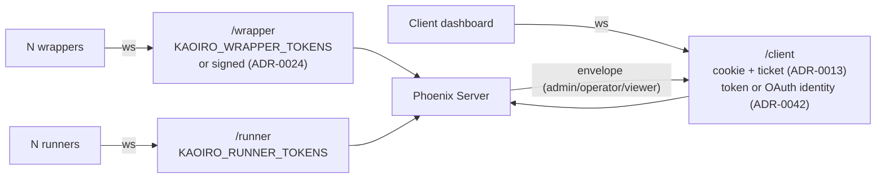

# Authentication and authorization map

## Purpose

Authentication and authorization are defined across the protocol, threat model,
and individual ADRs. This document is an overview of **which mechanism protects
each boundary and which privilege applies after crossing it**, collecting each
boundary's mechanism, implementation location, and unset behavior in one place.

Build the pre-OSS audit checklist (private Gitea issue 91) from this document.
While [threat-model](threat-model.md) covers “what is considered a threat and
how it is mitigated,” this document maps “the boundaries currently implemented.”
**WHY** belongs in ADRs / the threat model; **HOW** belongs here and in code
references.

## Definition

### Overall topology

### Socket authentication (`server/lib/kaoiro_server/auth.ex`)

| Socket | Topic convention | Authentication | env | When unset |
|---|---|---|---|---|
| Wrapper | `wrapper:<agent_id>` | `agent_id:token` pair / or server-minted signed token (ADR-0024) | `KAOIRO_WRAPPER_TOKENS` | `:dev`/`:test` = **dev fallback** (anyone may join; warning log) / `:prod` = pair auth disabled, **signed tokens accepted**, all else fail-closed (issue #133, revised 2026-08-02 to fix runner-only deployments rejecting every spawn) |
| Runner | `runner:<host_id>` | `host_id:token` pair | `KAOIRO_RUNNER_TOKENS` | `:dev`/`:test` = **dev fallback** / `:prod` = **fail-closed**, reject all (no signed-token branch; issue #133) |
| Client (token) | `agents:lobby` | `token → role` (admin/operator/viewer) | `KAOIRO_CLIENT_TOKENS` | **fail-closed** — reject every client in every environment |
| Client (OAuth) | `agents:lobby` | `identity (provider+uid) → role` (allowlist, [ADR-0042](../adr/0042-oauth-allowlist-login.md)) | `KAOIRO_OAUTH_*` + `KAOIRO_OAUTH_ALLOWLIST_PATH` | **fail-closed** — reject all when provider or allowlist is unset, missing, or mismatched |

All three token comparisons use constant-time `Plug.Crypto.secure_compare/2`.
Comparison also runs for an unconfigured id, leaving no timing side channel. At
startup `Auth.warn_token_config/0` (delegating OAuth to `OAuth.warn_config/0`)
leaves a WARN log for unset configuration.

The two client paths coexist independently. If `KAOIRO_CLIENT_TOKENS` is unset
and OAuth is enabled, only OAuth is available; the reverse enables only tokens;
with both unset no one can enter. The dashboard selects its login screen using
the unauthenticated `GET /session/auth-methods`
(`{"token": bool, "oauth": [provider, ...]}`).

The wrapper/runner dev fallback does not operate in `:prod` (the runtime reads
`env: config_env()` from `config.exs` via `Application.get_env(:kaoiro_server, :env)`).
Starting a release with tokens unset rejects every wrapper/runner connection and
does not affect `:dev` execution through `scripts/dev.sh` (issue #133).

### Topic authorization (channel `join/3`)

- Wrapper: `wrapper_channel.ex:32` validates the agent ID charset (`AgentId.valid?`)
  and duplicate connections (`reject_if_connected/1`, ADR-0024 D5 reject-newcomer).
- Runner: `runner_channel.ex` validates the host ID charset.
- Client: `agents_channel.ex` permits only `agents:lobby`; the role is stored in
  socket assigns.
- The charset is `[A-Za-z0-9._-]` ([#61](https://github.com/sakuraiyuta/kaoiro/issues/61)),
  structurally preventing topic-string injection.

### Three roles ([ADR-0050](../adr/0050-principal-model-and-graded-access-control.md) D2)

`admin` > `operator` > `viewer`, introduced in issue #188.

- There are only two declaration paths: `token:admin[:name]` in
  `KAOIRO_CLIENT_TOKENS`, and `provider:identifier:admin` in the OAuth allowlist.
  Do not create a dedicated file or env (the allowlist text format stays
  unchanged, so issue #160's `OAuthAllowlistWatcher` assumptions also hold).
- Misspellings fail closed. Both `parse_role/1` and `@roles` turn anything other
  than the three words into `nil` and reject authentication; never downgrade to
  viewer.
- Do not auto-promote existing operators (master decision 2026-08-14). Warn at
  startup when a deployment has zero admins (`Auth.warn_token_config/0`).
- **Every gate called “operator-only” on this page admits admin for both inbound
  and outbound paths.** The decision is centralized in
  `AgentsChannel`'s `@operator_capable_roles`; do not scatter direct
  `role == :operator` comparisons, which can create an asymmetric hole where
  inbound passes but outbound drops.
- The exception is `guard_against_reset_pending/2`. It is a restriction rather
  than a privilege, so admin is included in the guard as well.

### Role-based output gate ([ADR-0021](../adr/0021-role-information-disclosure-policy.md))

`AgentsChannel.handle_out` uses an **allow-list**. Viewers receive:

- `state_change` (remove `ext`, hiding cwd / model / context / rate_limits / pending_permission)
- `agent_deleted`
- `permission_request` (rewrite as synthetic `state_change(waiting_permission)`, removing tool_name / input / request_id)

All others (`log` / `result` / `inter_agent_message` / `runner_sessions` /
`spawn_result` / `hosts` / `history_cleared` / `history_reset`) are completely
removed for viewers (fail-closed). A new envelope type is not delivered unless
explicitly declared (`sanitize_envelope_for(:viewer, _) -> :drop`). See the
MUST items in [threat-model](threat-model.md) for threat-based rationale.

### Operator-only inbound (`handle_in`)

Call `require_operator(socket)` first, both directly and inside
`relay_to_wrapper_guarded/3` / `relay_to_runner_guarded/3`:

- `instruction` / `permission_decision` / `question_response` / `interrupt`
- `set_model` / `set_effort` / `set_permission_mode` / `refresh_models`
- `refresh_engine_catalog`
- `spawn` / `stop` / `restart` / `enumerate_sessions` / `restore` /
  `resume_session`
- `session_reset`
- `clear_history` / `delete_agent` / `revoke_wrapper_token`
- `attach_open` / `attach_chunk` / `attach_close`

The same events from a viewer are rejected with `{:error, :forbidden}`. Resolve
the role with `ClientSocket.role_for/1` for every operation rather than using a
snapshot (OAuth section, #148, below).

### Operator-only HTTP endpoint (issue #232)

Separate from the WS `handle_in` gate, an operator/admin-only HTTP endpoint
exists. `KaoiroServerWeb.RequireOperatorPlug` gates after `:fetch_session`: it
extracts the session-cookie credential with
`KaoiroServerWeb.SessionCredential.resolve/1` and live-resolves the role on
every request with `ClientSocket.role_for/1` (the same function as WS). Missing
or revoked credentials return 401; viewers return 403.

| endpoint | Reason |
|---|---|
| `GET /api/personas/:id` | Returns all manifest.json metadata and the full personality.md. A custom pack's personality.md is a system prompt and may contain proprietary operating instructions, so ADR-0021 F7's fail-closed default applies (new output surfaces are operator-only; viewer disclosure requires an explicit decision). |

### Tool authorization — canUseTool / PermissionBroker

- The wrapper's `Options.allowedTools` (`allowed_tools` in config) is the **ceiling**
  for SDK tool execution; server / client cannot extend it.
- The default allow set (`READ_ONLY_TOOLS`,
  `wrapper/claude-code/src/read_only_tools.ts`) contains read-only tools (Read /
  Grep / Glob / LS / NotebookRead) plus side-effect-free inter-agent helpers
  `mcp__kaoiro__list_agents` / `mcp__kaoiro__whoami`. **Membership is a security
  decision, not a convenience**: omission is the per-use approval gate itself
  (`mcp__kaoiro__send_to_agent` / `request_compact` /
  `request_session_reset` are intentionally omitted).
- Other tools flow through SDK `canUseTool` → `PermissionBroker.decide/2` → a
  `permission_request` envelope to the dashboard (operator-only), then an
  operator allows or denies (`permission_decision`, operator-only relay).
- Broker timeout is `permission_timeout_ms` in wrapper config; when unset it waits
  indefinitely (SDK default), avoiding accidental denial when no operator is
  present ([ADR-0022](../adr/0022-pending-permission-authoritative-source.md)).
- The ceiling takes a different form per engine: Claude = `allowedTools` +
  `canUseTool`; Codex = two axes fixed at spawn with no approval channel
  ([ADR-0033](../adr/0033-permission-model-dual-axis.md) F3); antigravity =
  the wrapper's tool-class table and cell matrix behind the hook gate
  (below). The rule that server and client cannot widen it holds for all
  three.

### MCP (`mcp__kaoiro__send_to_agent`)

- Inject the in-process MCP server from `wrapper/agent-common/src/inter_agent.ts`
  into the engine (Claude via `Options.mcpServers`, Codex via the tool-host bridge).
- `send_to_agent` is **not in the default allowedTools**, so it always goes through
  the broker. The colocated `list_agents` / `whoami` are read-only and therefore
  auto-allowed (the `READ_ONLY_TOOLS` set above).
- Routing uses the server's `route_inter_agent`; quotas use `ConversationStates`.
- Details: [protocol-inter-agent](protocol-inter-agent.md)

### Antigravity gate socket and customization dir (phase-34)

**Status: designed, implemented in phase-34 Stage A** — recorded here ahead
of the code so the boundary map is complete when it lands.

For the `antigravity` engine the approval decision does not come from an SDK
callback. `agy` runs with its own prompts disabled and invokes a PreToolUse
hook per tool call, which adds an intra-host boundary between the engine
child and the wrapper ([ADR-0057](../adr/0057-antigravity-adapter.md) F4).

| Boundary | Mechanism | Implementation | On failure |
|---|---|---|---|
| `agy` child → hook process | Hook registration in the wrapper-owned `.agents/hooks.json`, discovered through `--add-dir` | `wrapper/antigravity` customization-dir writer | Not registered → spawn fails with `antigravity_gate_not_registered`; hook exceeding the CLI `timeout` is killed and the tool call fails without running (measured) |
| hook process → wrapper | Per-agent unix socket inside a 0700 `mkdtemp` dir; per-spawn nonce carried in the hook's environment. Distinct from the `ToolHost` socket below — two sockets, two nonces, two protocols, so a shell that reaches the tool socket cannot answer gate questions | `hook.ts` → `gate.ts` | Socket error / wrapper deadline / malformed payload / missing nonce → `deny`; connection closed before an answer → the pending broker entry resolves as deny and `waiting_permission` is cleared |
| wrapper → operator | `PermissionBroker` → `permission_request` (operator-only) → `permission_decision` (operator-only relay) | shared with the Claude path above | unchanged |

- Each nonce rejects an unrelated same-uid process that guessed its socket
  path. Neither is a defence against the agent itself, whose shell
  inherits both socket paths and can read both nonces — which is why
  [threat-model](threat-model.md) records the gate self-verification as
  detection rather than authorization.
- The **execution-capability ceiling** for this engine is the wrapper's
  tool-class table plus the sandbox × approval × network cell matrix, not an
  SDK `allowedTools` list. It is local configuration and the server cannot
  widen it, exactly as the MUST below requires. The agent-internal tool class
  is denied unconditionally, and a tool name absent from the table is
  unclassified: denied under `approval: never`, escalated to the operator
  otherwise.
- kaoiro's own tool surface rides the `ToolHost` unix socket shared with the
  Codex adapter — a second socket, separate from the gate — invoked as a CLI
  through `run_command`. Its auto-allow is a whole-string
  match on a metacharacter-free alphabet (ADR-0057 F5). The socket is
  reachable from the agent's own shell and exposes only tools that agent
  already holds, so it is not a privilege boundary.
- The customization dir (persona rules + gate config) is wrapper-owned:
  0700 `mkdtemp`, rewritten from memory and hash-verified before every
  per-turn spawn, referencing writes and shell denied in every permission
  cell, deleted on close, with stale `kaoiro-agy-*` directories swept at
  startup after a SIGKILL.

### Cookie / ticket sessions ([ADR-0013](../adr/0013-user-token-cookie-persistence.md))

- Initial authentication exchanges `?token=...` in a **POST body** (avoiding URL
  log leakage) for an httpOnly, encrypted session cookie (three-day sliding).
- WS reconnect obtains a 30-second Phoenix.Token via GET `/session/ticket` and
  connects with it in the WS query (Vite dev proxy cannot forward cookies to a WS
  upgrade).
- Socket IDs are SHA-256 hashes from `Auth.socket_id/1` (IDs for revoke; raw
  tokens are never retained).
- A session always holds exactly one credential. Token login (`POST /session/new`)
  clears `oauth_identity` when writing; OAuth login clears `client_token`.
- Login CSRF mitigation (ADR-0042) blocks the two credential-writing paths
  separately. `POST /session/new` **requires JSON content-type** (otherwise 415):
  SameSite=Lax only prevents cookies on a cross-site POST, while the response's
  first-party `Set-Cookie` is still stored, allowing a shared-token holder to
  replace a logged-in operator's session with an auto-submit form. Cross-site HTML
  forms cannot send JSON content-type and cross-origin `fetch` stops at preflight.
  `GET /?token=` is a plain navigation that sends cookies, so it instead checks
  the session and ignores the token when `oauth_identity` is present.

### OAuth login ([ADR-0042](../adr/0042-oauth-allowlist-login.md))

- Providers are Google / GitHub / Nextcloud. Use `assent` + `Req`; only
  Nextcloud uses a custom `Assent.Strategy.OAuth2.Base` strategy
  (`KaoiroServer.OAuth.Nextcloud`, identity from OCS
  `/ocs/v2.php/cloud/user`, with `OCS-APIRequest: true` required).
- Route: `GET /auth/:provider` (302; store OAuth2 `state` in the session and bind
  it to the provider) → `GET /auth/:provider/callback` (validate state → normalize
  identity → check allowlist → `put_session` → 302 `/index.html`). An unconfigured
  provider returns 404; failures return
  `302 /index.html?auth_error={provider_error|not_allowed|invalid_state}`.
- The allowlist (`KaoiroServer.OAuthAllowlist`) is text in
  `provider:identifier[:role]` form. Omitted role means viewer; `#` and blank
  lines are ignored; malformed lines warn and skip (fail-visible). It is **parsed
  on every use**, so removing a line takes effect on the next connect / refresh
  without a restart.
- The session stores only identity (`%{provider, uid}`), not role. Resolve role
  from the allowlist on every connect / refresh (same shape as token-path
  `Auth.client_role/1` revalidation).
- **Re-resolve active sockets** ([#148](https://github.com/sakuraiyuta/kaoiro/issues/148),
  2026-07-28). The connect-time role is only a snapshot; freezing it would leave
  a demotion (operator → viewer) ineffective in an open tab. Dashboard cookie
  sliding is every 12 hours, too slow to rely on refresh alone. `ClientSocket`
  keeps the credential (`{:token, …}` / `{:oauth, …}`) in assigns, and
  `AgentsChannel.require_operator/1` calls `ClientSocket.role_for/1` again for
  every operator action. If it differs from the snapshot, broadcast #47
  `disconnect` to the `socket_id` topic; fan-out (operator-only delivery in
  `handle_out`) and client UI rebuild on reconnect.
- **Change-driven behavior also covers passive sockets that never act**
  ([#160](https://github.com/sakuraiyuta/kaoiro/issues/160), 2026-08-05). #148 cut
  sockets only when an action occurred, while `handle_out` fan-out kept using the
  connect-time snapshot, so a demoted socket with no operator action kept
  receiving data. `KaoiroServer.OAuthAllowlistWatcher` detects allowlist changes
  via file-system events (fast path) plus periodic reconcile (backstop bounded
  against missed events), and sends #47 disconnect only to changed identities via
  `oauth_socket_id` (it never enumerates active sockets; diff the allowlist
  snapshots instead). The diff checkpoint is `:persistent_term` (helper state
  surviving watcher restarts; the file remains authorization SoT). A race between
  allowlist change and connect/join is closed by live re-resolution in
  `AgentsChannel.join/3`. See the decision details in the
  [ADR-0042](../adr/0042-oauth-allowlist-login.md) Addendum.
- Socket ID is `Auth.oauth_socket_id/2` =
  `sha256("oauth:" <> provider <> ":" <> uid)`. Forced disconnect on logout /
  refresh 401 reuses the ADR-0013 / #47 broadcast plumbing.
- **Discard provider access tokens after obtaining identity**; retain none in
  session / cookie / DETS / logs (Nextcloud OAuth2 lacks scope support, so tokens
  have full access). Because Assent exceptions may render
  `Authorization: Bearer …` through response structs, `AuthController` logs
  **only the exception type name**.
- Google requires an HTTPS redirect URI outside localhost, so Google login is
  unavailable when deployed with `KAOIRO_PLAIN_HTTP=true` (GitHub / Nextcloud
  permit HTTP).

### Two wrapper token paths

1. **Pre-registered**: `agent_id:token` pairs in `KAOIRO_WRAPPER_TOKENS`
2. **Server-minted signed token**: The spawn path (ADR-0024) issues one through
   `Auth.mint_wrapper_token/1` and `Phoenix.Token.sign/3`; the secret is
   `Endpoint.secret_key_base`. Tokens do not expire. Revoke uses these two paths
   (implemented 2026-07-23, [#72](https://github.com/sakuraiyuta/kaoiro/issues/72)):
     - **per-agent_id denylist** (`KaoiroServer.TokenDenylist`, DETS-persisted):
       `Auth.authorize_wrapper/2` checks it before the existing signature check;
       `delete_agent` seeds auto-revoke and the operator's
       `revoke_wrapper_token` handler inserts explicit entries. Writes are
       synchronous and `:dets.sync/1` fsync-gated (durable before ack / broadcast).
       The live channel intercepts `revoked` broadcasts on `wrapper:<id>` and
       stops in `handle_out` with `{:stop, :shutdown, socket}`. Fail-closed:
       startup fails on store corruption (retain the DETS file for forensics).
     - **secret_key_base rotation**: revoke the entire fleet at once (heavy hammer)

## Known gaps (design choices and not yet addressed)

| Area | Current state | Compensation | Related |
|---|---|---|---|
| **Inter-agent ACL** | No server-side allowlist for A→B sends | Broker dialog (per-action operator approval) is the only human gate | [#17](https://github.com/sakuraiyuta/kaoiro/issues/17), intentional Phase 1 choice |
| **Message inspection** | Server does not interpret payloads (size cap only) | None — prompt-injection attacks pass through | [#18](https://github.com/sakuraiyuta/kaoiro/issues/18), Phase 2 |
| **Operator role granularity** | Issue #188 introduced admin / operator / viewer, but operators still have full power (spawn / interrupt / approve / clear, etc.). Per-pair permission demotion is not implemented | None — single-tenant assumption | [issue #189](https://github.com/sakuraiyuta/kaoiro/issues/189) (per-pair permissions, [ADR-0050](../adr/0050-principal-model-and-graded-access-control.md) D3) |
| **Immediate token revocation** | **Forced disconnect of active WS is implemented ([#47](https://github.com/sakuraiyuta/kaoiro/issues/47))**: logout (`DELETE /session`) and refresh 401 for a revoked credential call `disconnect_sockets/1`, broadcasting disconnect on the socket-id topic and dropping all connections. Delivery occurs when a detection trigger arrives rather than as an immediate push | Triggers are the next operator action (gate re-resolution in [#148](https://github.com/sakuraiyuta/kaoiro/issues/148)) / change-driven OAuth allowlist disconnect ([#160](https://github.com/sakuraiyuta/kaoiro/issues/160), including passive sockets) / 12-hour refresh / reconnect / explicit logout. Changing a shared `KAOIRO_CLIENT_TOKENS` value still requires restart because env is not reloaded (out of #160 scope) | Implemented |
| **Signed-token revoke** | **Per-agent ID denylist implemented (2026-07-23, [#72](https://github.com/sakuraiyuta/kaoiro/issues/72))**: TokenDenylist DETS + `Auth.authorize_wrapper` check + `delete_agent` auto-revoke + explicit operator revoke handler + live disconnect via revoked broadcast | Key rotation remains the heavy option that revokes the whole fleet | Implemented |
| **Sandbox enforcement (antigravity)** | The sandbox axis is advisory: `--sandbox` was measured ineffective, so `read-only` / `workspace-write` are enforced by wrapper argument inspection, never by the OS | `ext.permission.enforcement = "advisory"` plus a permanent dashboard badge; shell needs approval outside `danger-full-access` | [ADR-0057](../adr/0057-antigravity-adapter.md) F4 |
| **Gate spoofing by the agent itself (antigravity)** | The gate nonce and the correlation state are readable by any shell the agent runs, so a compromised agent can satisfy the self-verification | None — F4b detects a vendor mechanism that stops firing; it is not an authorization boundary | [ADR-0057](../adr/0057-antigravity-adapter.md) F4b |
| **Multi-tenant isolation** | Every operator can control every agent (OAuth identifies people but has no agent-owner boundary) | None — single-tenant assumption | [ADR-0042](../adr/0042-oauth-allowlist-login.md), out of scope |
| **Dev fallback leakage risk** | **Resolved (2026-07-25, [#133](https://github.com/sakuraiyuta/kaoiro/issues/133))**: `:dev`/`:test` still allow all when unset; `:prod` fails closed when unset (2026-08-02 revision: wrapper accepts only server-minted signed tokens, whose signature derives from `secret_key_base`) | Startup WARN log (environment-specific wording) | Implemented |
| **Audit logging** | No durable record of who sent what to which agent and when | None | Future (when SQLite is introduced) |
| **Tool-input masking** | Command lines / paths are shown raw in the operator dialog | Operator-only delivery + 16KB truncation | Future |
| **Runner-less wrapper auth** | Localhost direct connection only; a token is unavailable without going through spawn | Runner required | [#71](https://github.com/sakuraiyuta/kaoiro/issues/71) |
| **conversation_id confidentiality** | Observable by every dashboard operator | `participants_mismatch` guard rejects third-party reuse | [#17](https://github.com/sakuraiyuta/kaoiro/issues/17), intentional Phase 1 choice |

## Constraints (MUST)

- MUST: Reflect every new authentication boundary or role gate in this document
  (single source of truth).
- MUST: When changing `KAOIRO_*_TOKENS` fallback behavior, revalidate all three
  nodes together (and update `Auth.warn_token_config/0`).
- MUST: When adding an envelope type or channel event, update the
  `sanitize_envelope_for/2` allow-list (the fail-closed premise must hold).
- MUST: Put `require_operator/1` first in the `with` for every new operator-only
  inbound event.
- MUST: When injecting a new in-process MCP tool into the SDK, explicitly decide
  whether it belongs in default allowedTools (omitted = per-use approval;
  included = unsupervised).
- MUST: State the execution-capability ceiling form for every engine recorded
  here (SDK allowlist / axes fixed at spawn / wrapper policy table). An engine
  whose gate is enforced only by the wrapper must fail closed on a verification
  failure — there is no engine-side backstop to fall back on.

## Release-time audit checklist

For the pre-OSS audit (private Gitea issue 91), verify the following against this
document and keep it synchronized with the issue checklist.

- [ ] Each socket's unset-token behavior (warn + fallback / fail-closed) matches
  the document.
- [ ] Every OAuth login is rejected when the allowlist is unset, missing, or
  mismatched (ADR-0042 fail-closed).
- [ ] Provider access tokens do not remain in session / cookie / DETS / logs.
- [ ] The `AgentsChannel.handle_out` allow-list does not leak new envelopes
  (complete `sanitize_envelope_for` coverage + tests).
- [ ] No operator-only inbound event omits `require_operator/1` (grep + tests).
- [ ] The operator-only HTTP endpoint (`RequireOperatorPlug`) is covered by tests
  for anonymous 401 / viewer 403 / operator and admin 200 (issue #232).
- [ ] Dev fallback risk is assessed (`:prod` fails closed when tokens are unset,
  covered by tests; issue #133).
- [ ] No secret appears in logs (check Logger for token / cookie / signed token).
- [ ] `secret_key_base` used by `Phoenix.Token.sign` is not a fixed production
  value.
- [ ] Cookie SameSite / Secure / HttpOnly match production configuration intent.
- [ ] CSRF (`check_origin`) is enabled in production.
- [ ] Adding envelope `ext` keys still strips them for viewers.
- [ ] Inter-agent body prompt-injection risk is documented in README / threat model.
- [ ] Server / client have no path to override the wrapper `allowedTools` ceiling
  (tests).
- [ ] Antigravity: with the hook removed, the registration check and the
  completed-tool correlation invariant both fail closed, and the bridge
  auto-allow rejects every shell-injection fixture (phase-34).
- [ ] `scripts/dev.sh` logs contain no secrets (grep `tmp/dev-logs/*.log`).
- [ ] Scan `git log --all -p` for token / .env / cookie / signed-token strings;
  none may enter commits intended for publication.

## See Also

- Related specs: [protocol](protocol.md), [threat-model](threat-model.md),
  [architecture](architecture.md), [protocol-inter-agent](protocol-inter-agent.md)
- ADRs: [0011](../adr/0011-phase3-reliability-and-auth.md) (wrapper token),
  [0012](../adr/0012-response-display-and-dashboard-scope.md) (log/result delivery),
  [0013](../adr/0013-user-token-cookie-persistence.md) (cookie / ticket),
  [0021](../adr/0021-role-information-disclosure-policy.md) (role allow-list),
  [0022](../adr/0022-pending-permission-authoritative-source.md) (pending permission),
  [0023](../adr/0023-host-runner-architecture.md) (runner),
  [0024](../adr/0024-agent-instance-identity-and-spawn-auth.md) (spawn auth),
  [0042](../adr/0042-oauth-allowlist-login.md) (OAuth + allowlist),
  [0057](../adr/0057-antigravity-adapter.md) (antigravity gate socket)
- Related issues: [#17](https://github.com/sakuraiyuta/kaoiro/issues/17) (inter-agent),
  [#28](https://github.com/sakuraiyuta/kaoiro/issues/28) (client fail-closed),
  [#46](https://github.com/sakuraiyuta/kaoiro/issues/46) (cwd exposure),
  [#47](https://github.com/sakuraiyuta/kaoiro/issues/47) (socket revoke),
  [#65](https://github.com/sakuraiyuta/kaoiro/issues/65) (OAuth),
  [#71](https://github.com/sakuraiyuta/kaoiro/issues/71) (runner-less auth),
  [#72](https://github.com/sakuraiyuta/kaoiro/issues/72) (signed-token denylist),
  private Gitea issue 91 (OSS publication preparation)
