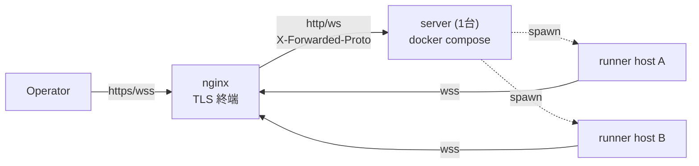
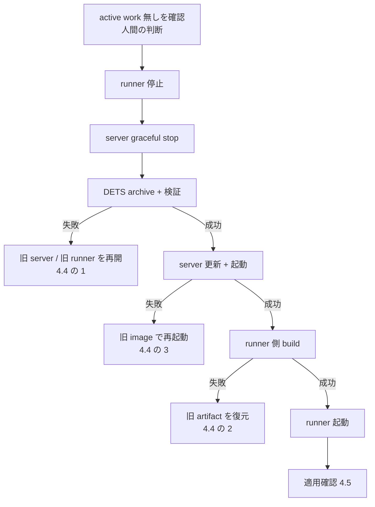

# マルチホスト配備手順書

## Purpose

デプロイ手順の正本が `server/docker-compose.yaml` のヘッダコメントと
`server/README.md` の数行に散在し、任意ホスト公開(実運用)に必要な情報
(nginx 設定・env 一覧・DETS パス・wss 制約)が欠落していた。本 doc が
**手動手順の唯一の正本**。[setup-wizards](setup-wizards.md) はこの手順の
自動化(env/config 生成)であり、DETS パスや nginx 設定など wizard が
扱わない領域は本 doc に完全記載する。

## 全体構成



server は 1 台、runner は host_id ごとに任意台数。TLS は nginx で終端し、
server は plain HTTP のまま(2026-06-11 決定、`docker-compose.yaml` 参照)。
VPN 内限定で公開する場合のみ、nginx を置かない直結配備(1.5)も選べる。

## 1. server の配備

### 1.1 認証 token の発行(3 種必須)

任意ホスト公開では 3 種すべて設定する([auth-and-authz](auth-and-authz.md))。
生成は `openssl rand -hex 32`(32 バイト hex)。

```sh
openssl rand -hex 32   # KAOIRO_CLIENT_TOKENS の token 部分に使う
openssl rand -hex 32   # KAOIRO_WRAPPER_TOKENS の token 部分に使う
openssl rand -hex 32   # KAOIRO_RUNNER_TOKENS の token 部分に使う
```

### 1.2 `.env` の作成

```sh
cd server && cp .env.example .env
```

| env | 必須 | 意味 |
|---|---|---|
| `SECRET_KEY_BASE` | 必須 | `mix phx.gen.secret` で生成(64 文字)。`openssl rand -hex 32` では短い |
| `PHX_HOST` | 必須 | 公開ホスト名。未設定は起動時 raise(fail-fast、issue #139) |
| `PORT` | 任意 | 既定 4000 |
| `KAOIRO_BIND_IP` | 任意 | :prod のみ有効。既定は全 IF。通常は既定のままで良い(issue #139) |
| `KAOIRO_CLIENT_TOKENS` | 必須 | `<token>:<role>,...`(role = `operator`/`viewer`)。未設定は全 client 拒否 |
| `KAOIRO_WRAPPER_TOKENS` | 任意 | `<agent_id>:<token>,...`(client と順序が逆)。spawn 経由のみの runner 配備では不要 — server-minted signed token で認証 (ADR-0024、2026-08-02 改訂)。固定 wrapper を pre-register する場合のみ設定 |
| `KAOIRO_RUNNER_TOKENS` | 必須 | `<host_id>:<token>,...`。1.1 で発行した token を runner 側 `runner.env` の `KAOIRO_RUNNER_TOKEN` と対にする |
| `KAOIRO_PERSONA_DIR` | 任意 | persona pack 取り込み用コンテナ内パス。読み取り専用 mount 可 |
| `KAOIRO_FOOTER_DIR` | 任意 | footer 2 ファイルのコンテナ内 root |
| | | 未設定時は内蔵既定のみ |
| `KAOIRO_PERSONA_CACHE_DIR` | 任意 | zip extraction cache のコンテナ内 path |
| | | compose 既定は `/var/lib/kaoiro/persona-cache` |

3 種いずれも未設定時の挙動は env ごとに異なる(client = fail-closed、
runner = :prod で fail-closed・dev/test のみ緩和、wrapper = :prod では
signed token のみ受理・dev/test は緩和、issue #138 / 2026-08-02 改訂)。

persona pack 取り込みは [ADR-0046](../adr/0046-persona-cache-relocation.md)
により extraction cache と分離済みであり、`KAOIRO_PERSONA_DIR` は `:ro`
mount できる。footer を運用者が差し替える場合は、host 側の
`/srv/kaoiro/footers` を次のように読み取り専用で mount する:

```yaml
      - /srv/kaoiro/footers:/etc/kaoiro/footers:ro
```

同梱 compose は `KAOIRO_PERSONA_CACHE_DIR=/var/lib/kaoiro/persona-cache`
を設定する。cache は書き込み可能な永続領域に置き、persona pack の
mount とは分離する。

**DETS パス 7 種**(restart 跨ぎで状態を残す DETS ファイルの格納先)は
同梱 `docker-compose.yaml` が `environment:` + named volume `kaoiro-state`
で設定済みのため、compose 運用では `.env` に書く必要はない。compose を
使わずホストで直接 release を動かす場合のみ、この 7 種を書き込み可能な
永続パスへ明示する: `KAOIRO_SESSION_POINTERS_PATH` /
`KAOIRO_AGENT_DIRECTORY_PATH` / `KAOIRO_PERMISSION_MODES_PATH` /
`KAOIRO_CLEAR_WATERMARKS_PATH` / `KAOIRO_SESSION_STARTS_PATH` /
`KAOIRO_INGRESS_ORDER_PATH` / `KAOIRO_TOKEN_DENYLIST_PATH`。未設定は
コンテナの `/tmp` 相当に落ち、
`docker compose down` で消える(offline agent 一覧が失われる)。

**2026-08-08 注記:** phase 30-7 で `InterAgentHistory` DETS は撤廃し、
`KAOIRO_INTER_AGENT_HISTORY_PATH` は server に読まれなくなった。同梱
`docker-compose.yaml` と `scripts/dev.sh` の unused export も phase-30
クローズ時に削除済み。本節の 7 種が実行時の正本である。

### 1.3 docker compose で起動

**build context はリポジトリルート**(dashboard/ が server/ 外にあるため、
issue #44)。`docker-compose.yaml` は `context: ..` を既に指定しているので
`server/` から通常どおり起動すれば良い。手動 `docker build` を直接叩く
場合はルートで `docker build -f server/Dockerfile .` とする。

```sh
cd server
docker compose up -d --build
```

既定で `127.0.0.1:4000` のみに bind(compose の `ports` マッピング)。
nginx からは同一ホストのループバック経由で到達させる。

### 1.4 nginx リバースプロキシ

TLS は nginx で終端し、WebSocket の Upgrade/Connection を転送、channel
heartbeat(30 秒間隔)より長い `proxy_read_timeout` を設定する。

```nginx
server {
    listen 443 ssl;
    server_name kaoiro.example.com;

    ssl_certificate     /etc/letsencrypt/live/kaoiro.example.com/fullchain.pem;
    ssl_certificate_key /etc/letsencrypt/live/kaoiro.example.com/privkey.pem;

    location / {
        proxy_pass http://127.0.0.1:4000;
        proxy_http_version 1.1;
        proxy_set_header Upgrade $http_upgrade;
        proxy_set_header Connection "upgrade";
        proxy_set_header Host $host;
        proxy_set_header X-Forwarded-Proto $scheme;
        proxy_set_header X-Forwarded-For $proxy_add_x_forwarded_for;
        proxy_read_timeout 75s;
    }
}
```

**制約(必読)**: prod は `force_ssl` が有効(`server/config/prod.exs`)で、
`X-Forwarded-Proto` が `https` でないリクエストを 301 で `https` へ
リダイレクトする。これは WebSocket ハンドシェイクでは接続失敗になる —
`proxy_set_header X-Forwarded-Proto $scheme;` を必ず設定し、**nginx を
介さず `ws://<host>:4000` へ直結することはできない**(`PHX_HOST` が
`localhost`/`127.0.0.1` の場合のみ `force_ssl` の対象外)。wrapper/runner
は必ず nginx 経由の `wss://` で接続する。VPN 内直結配備(1.5)では
`force_ssl` 自体をビルド時に無効化するため、この制約は掛からない。

### 1.5 VPN 内直結配備(nginx なし・plain HTTP、2026-07-26)

到達経路が VPN(WireGuard)内に閉じるホストでは、nginx を置かず
`http://<host>:<port>` へ直結する配備を選べる。token・cookie が VPN 内を
平文で流れるため、**経路の秘匿は VPN に委譲**する構成([threat-model](threat-model.md))。
公開インターネットには決して使わない。

`.env` に次の 2 つを追加する(それ以外の手順は 1.1〜1.3 と同じ):

| env | 値 | 意味 |
|---|---|---|
| `KAOIRO_PLAIN_HTTP` | `true` | ビルド時: `force_ssl`・Secure cookie を無効化(compile-time)。実行時: URL 生成・check_origin を `http://PHX_HOST:PORT` に切替。compose が同じ値を build arg と実行 env の両方へ配線し、不一致はサーバが起動時 raise |
| `KAOIRO_PUBLISH_IP` | ホストの VPN 側 IF の IP | compose の公開先(既定 `127.0.0.1`)。全 IF 公開ではなく VPN 側 IP に限定する |

`check_origin` は `http://PHX_HOST:PORT` と loopback の 2 つだけを許可する
(#154 M1 — 既定の host のみ比較では同一ホストの別ポートから operator
socket を奪える)。**それ以外の名前や IP 直打ちでダッシュボードを開くと
画面は出るが client socket が 403 になる** ので、必ず `PHX_HOST` と同じ
名前でアクセスする。

`PHX_HOST` は接続に使う FQDN(例 `linux-host.example`)。値を変えたら
`docker compose up -d --build` で再ビルドする(compile-time フラグのため
イメージ再利用不可)。runner の `server_url` は
`ws://<PHX_HOST>:<PORT>/runner`、ダッシュボードは
`http://<PHX_HOST>:<PORT>/?token=...` となる。

nginx が担うはずのセキュリティヘッダ(CSP / `nosniff` /
`X-Frame-Options` / `Referrer-Policy`)は、この構成では付与主体が居なく
なるためサーバ自身が全レスポンスに付ける(#155、
`KaoiroServerWeb.SecurityHeaders`。狙いと内訳は
[threat-model](threat-model.md) 緩和策)。CSP の `connect-src` は
**そのレスポンスを返しているオリジンと一致する `check_origin` エントリ
だけ**を `ws:`/`wss:` へ写すので、`PHX_HOST` / `PORT` を変えれば追随し、
外部 host 向けのページに loopback の WS 宛先が載ることもない。逆に
**ダッシュボードへ外部オリジンの script / style / 画像を持ち込む変更は
CSP で落ちる**。

### 1.6 OAuth ログイン(個人認証)の設定(任意、ADR-0042 / issue #65)

dashboard に Google / GitHub / Nextcloud の OAuth ログインを追加できる。
仕組みと設計判断は [ADR-0042](../adr/0042-oauth-allowlist-login.md)、
境界の地図は [auth-and-authz](auth-and-authz.md)。`KAOIRO_CLIENT_TOKENS`
未設定なら token 認証は無効(OAuth のみ)、設定時は併存する。

**redirect URI**(全 provider 共通。server が endpoint `url` 設定から
導出するため、登録値は必ずこの形):

```text
{scheme}://{PHX_HOST}[:{PORT}]/auth/{provider}/callback
# 例: https://kaoiro.example.com/auth/github/callback
#     http://localhost:4000/auth/google/callback   (dev)
```

**provider ごとの client 登録**(経路は 2026-07 時点):

| provider | 登録場所 | 注意 |
|---|---|---|
| Google | [console.cloud.google.com](https://console.cloud.google.com) → Google Auth Platform(初回は Get started で Branding/Audience 設定、Testing なら Test users に対象アカウント追加)→ Clients → Create Client → Web application → Authorized redirect URIs | **redirect URI は https 必須(localhost のみ http 可)**。plain-HTTP 配備(1.5)では使えない |
| GitHub | Settings → Developer settings → OAuth Apps → New OAuth App → Authorization callback URL。登録後 Generate a new client secret | **callback URL は 1 App につき 1 個**。環境ごとに別 App を作る |
| Nextcloud | 対象インスタンスの 設定 → 管理 → セキュリティ → OAuth 2.0 クライアント → 名前 + Redirection URI を追加 | scope 非対応(token はフルアクセス)だが server は identity 取得後に token を破棄する(ADR-0042)。PKCE 非対応、CSRF 防御は state のみ |

**設定の生成は `mix kaoiro.env` で自動化できる**(2026-07-27、
[setup-wizards](setup-wizards.md))。ウィザードの OAuth 質問群が
provider 選択 → id/secret 入力 → 許可リスト生成(最低 1 エントリを
促す)→ compose mount 行の案内までを行い、生成物は 0600 で書き出す。
以下は手動で設定する場合(およびウィザードが書く内容)の説明。

**`.env` への追記**(id + secret が揃った provider のみ有効化される。
Nextcloud は base_url も必須):

```sh
KAOIRO_OAUTH_GOOGLE_CLIENT_ID=...
KAOIRO_OAUTH_GOOGLE_CLIENT_SECRET=...
KAOIRO_OAUTH_GITHUB_CLIENT_ID=...
KAOIRO_OAUTH_GITHUB_CLIENT_SECRET=...
KAOIRO_OAUTH_NEXTCLOUD_CLIENT_ID=...
KAOIRO_OAUTH_NEXTCLOUD_CLIENT_SECRET=...
KAOIRO_OAUTH_NEXTCLOUD_BASE_URL=https://cloud.example.com
KAOIRO_OAUTH_ALLOWLIST_PATH=/etc/kaoiro/oauth-allowlist.txt
```

**許可リスト**(未設定・ファイル欠落・不一致はすべて認証拒否 =
fail-closed。malformed 行は warn ログの上 skip):

```text
# provider:identifier[:role]   role 省略時は viewer
# identifier: google=email(小文字)/ github=login / nextcloud=user id
google:alice@example.com:operator
github:octocat:viewer
nextcloud:alice:operator
```

compose 運用ではファイルを `server/` に置き、`docker-compose.yaml` の
`volumes:` へ read-only mount を 1 行足す:

```yaml
      - ./oauth-allowlist.txt:/etc/kaoiro/oauth-allowlist.txt:ro
```

**確認**:

```sh
curl http://<PHX_HOST>:<PORT>/session/auth-methods
# → {"token":true|false,"oauth":["github","nextcloud",...]}
```

ログイン画面に有効 provider のボタンが並び、許可リスト外のアカウントは
`auth_error=not_allowed` で拒否される。許可リストの行削除は次回接続 /
refresh(最長 12h)で反映。**operator→viewer の「降格」は稼働中 socket
に反映されない既知の穴がある(issue #158)**。拒否時の warn ログには
`provider:uid` がそのまま出るため、許可リストへ写す識別子はログから
確認できる。

## 2. runner の配備(複数ホスト)

現状は tarball 配布(issue #70、[ADR-0018](../adr/0018-runner-distribution.md)
2026-07-25 改訂)。各エージェントホストへ個別に展開する。手順の全文・
常駐化(systemd user unit / launchd LaunchAgent)は
[runner/README.md](../../runner/README.md) が正本 — ここでは複数ホスト
配備に固有の要点のみ書く。

```sh
# ビルドホスト(1 台)で対象アーキテクチャごとに生成
./scripts/build-runner-tarball.sh --target linux-x64
./scripts/build-runner-tarball.sh --target darwin-arm64

# 各エージェントホストへ転送・展開
tar xzf kaoiro-runner-<rev>-linux-x64.tar.gz
cd kaoiro-runner-<rev>-linux-x64
```

### `runner.config.json` の実例(`wss://` 必須)

nginx 越しの prod 配備では `server_url` は必ず `wss://` にする(1.4 の
制約どおり `ws://` 直結は 301 で弾かれる)。VPN 内直結配備(1.5)のみ
`ws://<PHX_HOST>:<PORT>/runner` とする。`host_id` はホストごとに
一意にする(サーバ側 `HostRegistry` が host_id をキーに register するため、
重複させると片方のホストが上書きされる)。

```json
{
  "host_id": "lab-pc-1",
  "server_url": "wss://kaoiro.example.com/runner",
  "cwd_allowlist": ["/home/agent/repos"],
  "capabilities": ["claude-code", "codex"]
}
```

`runner.env` に `KAOIRO_RUNNER_TOKEN=<1.1 で発行した token>` を設定し
(サーバ側 `KAOIRO_RUNNER_TOKENS` の `<host_id>:<token>` と対にする)、
`chmod 600` する。`server_url` は `runner.env` の
`KAOIRO_RUNNER_SERVER_URL`(issue #140、env が config ファイルより優先)
でも上書きできる。

### 常駐化

systemd user unit(Linux)/ launchd LaunchAgent(macOS)のテンプレートは
`runner/deploy/` に同梱。設置手順・終了コード・トラブルシュートは
[runner/README.md](../../runner/README.md)の「常駐化」節を参照。
**runner の再起動(サービス再起動含む)は配下の wrapper を
全停止させる**(SIGTERM 時の `supervisor.stopAll()`)— 稼働中エージェントがいる状態での
`systemctl --user restart` / `launchctl kickstart -k` は、対象ホストの
全エージェントが切断されることを意味する。

## 3. 疎通確認

1. server: `docker compose ps` で起動確認、`https://<host>/?token=<KAOIRO_CLIENT_TOKENS の token>` でダッシュボードが開く
2. runner: 起動ログに `runner: host=<host_id> connecting to wss://...` が出て切断が続かない(認証失敗は `unauthorized` で即切断)
3. ダッシュボードの host 一覧に該当 `host_id` が現れる

## 4. 既存配備の更新(暫定手順)

1〜2 節は**初回配備**の手順である。既に稼働している配備を新しいバージョンへ
上げる手順は本節が正本。

> **本節は暫定手順(manual interim procedure)である。**自動化が入るまでの
> 橋渡しとして書いており、完成形ではない。**「手順書があるから安全」ではない**
> — 4.1 の限界は手順を守っても残る。経緯と置換条件は issue #227。

### 4.1 既知の限界

| 限界 | 内容 | 解消する issue |
|---|---|---|
| **in-place build** | 稼働中の checkout の `dist` を直接上書きする。runner は wrapper を spawn するたびに on-disk の `dist` を解決する(`runner/src/spawn.ts` の `resolveWrapperLaunch()`)ため、build 中に spawn が起きると新旧の混ざった artifact を掴む。「停止中に build する」と手順で定めても、**順序を一度誤れば再発する** | #229 |
| **artifact provenance が無い** | 「実行中の artifact がその commit 由来である」ことを確認する手段が無い。**ファイルの mtime を代用してはならない**(4.5) | #228 |
| **自動 rollback が無い** | 失敗時の復旧はすべて手作業(4.4) | #230 |

3 つすべてが解消された時点で、本節は自動化手順の記述へ置換する。

### 4.2 事前条件

着手前に以下をすべて満たすこと。

- **target を full 40 桁 SHA で固定する。**`git pull` の結果に依存させない。
  作業記録にもその SHA を残す
- **source cleanliness を tracked / untracked の両方で判定する。**
  `git diff --quiet` は untracked を見ないため、これだけでは不十分
  (`git status --porcelain` の出力が空であることを確認する)
- **server ホストの SSH host key が `known_hosts` に登録済みであること。**
  `StrictHostKeyChecking=no` で迂回しない
- lockfile と `node_modules` の整合を確認する。疑わしい場合は frozen install
- **active な作業が無いことを確認する(人間の判断)。**runner の停止は配下の
  wrapper をすべて止める(2 節「常駐化」)。会話状態は永続化されていないため、
  進行中のやり取りは失われる

### 4.3 更新手順



**backup は server を停止してから取る。**稼働中に named volume を tar すると、
複数の DETS ファイル間で状態が混ざりうる(2026-08-12 の反映ではこの誤りが
あった)。バックアップは唯一のロールバック手段であるため、ここは省略できない。

以下、`<server-host>` / `<repo-path>` / `<backup-dir>` は各環境の値に読み替える。

**(1) runner を停止**

```sh
systemctl --user stop kaoiro-runner
```

**(2) server を停止し、DETS を archive する**

volume 名は環境ごとに異なるため、**container の mount 先から解決する**
(名前を決め打ちしない)。

```sh
ssh <server-host> 'cd <repo-path>/server && docker compose stop'

# /var/lib/kaoiro に mount されている volume 名を取得
ssh <server-host> 'docker inspect <container-name> \
  --format "{{range .Mounts}}{{if eq .Destination \"/var/lib/kaoiro\"}}{{.Name}}{{end}}{{end}}"'

# 停止中の volume を read-only で archive
ssh <server-host> 'docker run --rm -v <volume>:/data:ro -v <backup-dir>:/backup \
  alpine tar czf /backup/kaoiro-dets-<timestamp>.tar.gz -C /data .'
```

archive 後、**listing と SHA-256 を必ず検証する**。

```sh
ssh <server-host> 'tar tzf <backup-dir>/kaoiro-dets-<timestamp>.tar.gz | head -20; \
  sha256sum <backup-dir>/kaoiro-dets-<timestamp>.tar.gz'
```

作業記録に残すもの: **backup 先 / 旧 image ID / 旧 commit / target commit /
archive の SHA-256**。ロールバックは「旧 image + 対応する DETS」の**対**で
行うため、この 5 つが揃っていないと復旧できない。

**(3) server を更新して起動**

```sh
ssh <server-host> 'cd <repo-path> && git fetch origin && git merge --ff-only <target-sha> \
  && cd server && docker compose build && docker compose up -d'
```

**(4) runner 側をビルド**

```sh
pnpm -C <repo-path>/wrapper build && pnpm -C <repo-path>/runner build
```

**runner を停止した後に実行する。**稼働したままビルドすると 4.1 の
in-place build 問題を踏む。

**(5) runner を起動**

```sh
systemctl --user start kaoiro-runner
```

### 4.4 失敗時の対応

**(1) DETS の archive または検証に失敗した**

新 server へ**進まない**。旧 server を起動し、runner も起動して元の状態へ戻す。
バックアップが取れない状態での更新は、ロールバック手段を持たない更新になる。

**(2) runner 停止後に install / build が失敗した**

**runner が停止したまま、`dist` に途中状態が残る。**この状態で runner を
起動すると 4.1 の問題をそのまま踏む。

復旧は次のいずれか。

- ビルド前に `dist` を退避してあれば、それを戻して runner を起動する
- 退避が無い場合、**旧 commit を checkout して再ビルド**し、`dist` を既知の
  状態に戻してから起動する

いずれも取れない場合、runner は停止したままにする。**中途半端な `dist` で
起動しない。**

**(3) 新 server が起動しない**

旧 image ID で `docker compose up -d` し直す。**DETS を戻す必要があるかは
別判断** — 新 server が一度でも state を開いていれば、旧コードが読める保証は
無い(issue #219 で DETS の tuple が 3→4 要素になった前例がある)。その場合は
(2) で取った backup から restore する。restore は destructive なので、実行前に
現在の state を別途 archive しておく。

**(4) runner が再起動しない**

`systemctl --user status kaoiro-runner` と journal を確認する。終了コード 78
(`EX_CONFIG`)は設定エラーで、再起動では直らない(2 節「再起動ポリシーと
終了コード」)。`dist` の欠落もこのコードになるため、(2) の復旧手順を先に
確認する。

**(5) 適用確認ができない**

4.5 の確認項目が揃わない場合、**更新が成功したと見なさない。**判断がつかない
ときは、backup を保持したまま作業を中断し、状態を記録する。

### 4.5 適用確認と、その限界

確認できること。

| 対象 | 確認方法 |
|---|---|
| server の commit | `ssh <server-host> 'cd <repo-path> && git log --oneline -1'` |
| server container | `docker ps` で起動時刻と image が更新されていること |
| runner の source commit | ローカルの `git log --oneline -1` |
| runner / wrapper の artifact | `dist` 内の `.js` の mtime、または内容の検査 |

**確認できないこと。**

「実行中の artifact がその commit 由来である」ことを暗号学的に結びつける手段は
現時点で存在しない。上記はいずれも状況証拠にすぎない。build identity(#228)の
導入後、full SHA を返す health endpoint と runner の register 情報へ置換する。

**mtime を代用品にしないこと。**`dist` ディレクトリの mtime は、ファイルの
追加・削除が無ければ更新されない。2026-08-12 の反映では、実際には全パッケージが
再ビルドされていたにもかかわらず、3 パッケージのディレクトリ mtime が 10 日前を
指しており、誤読しかけた。**中の `.js` を見ること。**

変更が特定の識別子を含む場合、それが `dist` に入っているかを直接確認するのが
確実である。

```sh
grep -rl "<変更で追加した識別子>" <repo-path>/wrapper/*/dist
```

## See Also

- [auth-and-authz](auth-and-authz.md) — 3 種トークンの未設定時挙動の詳細
- [setup-wizards](setup-wizards.md) — 本 doc の手順を自動化する対話ウィザード
- [runner/README.md](../../runner/README.md) — 常駐化・tarball 配布の全文
- [server/README.md](../../server/README.md) — ローカル開発・Docker の基本
- [threat-model](threat-model.md) — dev fallback / token 未設定のリスク評価
