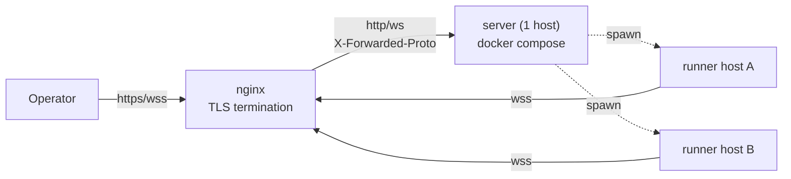
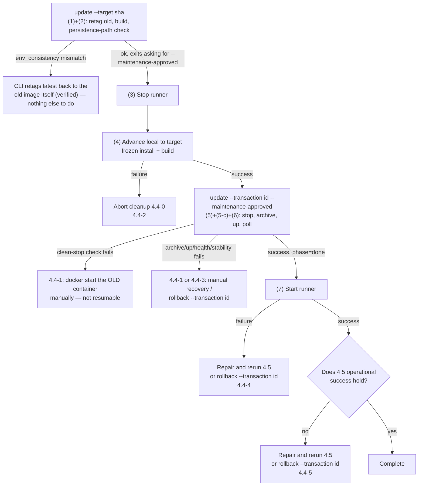

# Multi-host deployment guide

## Purpose

The canonical deployment procedure had been scattered across header comments in
`server/docker-compose.yaml` and a few lines in `server/README.md`, omitting the
information needed for public operation on an arbitrary host (nginx settings,
env list, DETS paths, and wss constraints). This document is the **sole canonical
manual procedure**. [setup-wizards](setup-wizards.md) automates env/config
generation for **initial deployment**; this document fully records areas the
wizard does not handle, such as DETS paths and nginx settings. **Updating an
existing deployment (section 4) is outside the wizard** and is being automated in
issues #218 / #219 / #220.

## Overall architecture



Use one server and any number of runners per host ID. TLS terminates at nginx;
the server remains plain HTTP (decision 2026-06-11, see `docker-compose.yaml`).
Only deployments restricted to a VPN may use the direct, nginx-free option (1.5).

## 1. Deploy the server

### 1.1 Issue authentication tokens (three required)

For public operation on an arbitrary host, configure all three
([auth-and-authz](auth-and-authz.md)). Generate them with
`openssl rand -hex 32` (32-byte hex).

```sh
openssl rand -hex 32   # KAOIRO_CLIENT_TOKENS の token 部分に使う
openssl rand -hex 32   # KAOIRO_WRAPPER_TOKENS の token 部分に使う
openssl rand -hex 32   # KAOIRO_RUNNER_TOKENS の token 部分に使う
```

### 1.2 Create `.env`

```sh
cd server && cp .env.example .env
```

| env | Required | Meaning |
|---|---|---|
| `SECRET_KEY_BASE` | Required | Generate with `mix phx.gen.secret` (64 characters); `openssl rand -hex 32` is too short |
| `PHX_HOST` | Required | Public hostname. Unset raises at startup (fail-fast, issue #134) |
| `PORT` | Optional | Defaults to 4000 |
| `KAOIRO_BIND_IP` | Optional | Effective only in :prod; defaults to all interfaces, which is normally fine (issue #134) |
| `KAOIRO_CLIENT_TOKENS` | Required | `<token>:<role>,...` (role = `operator`/`viewer`); unset rejects every client |
| `KAOIRO_WRAPPER_TOKENS` | Optional | `<agent_id>:<token>,...` (reverse order from client). Not needed when runners deploy only through spawn—authenticate with server-minted signed tokens (ADR-0024, revised 2026-08-02). Set only to pre-register fixed wrappers |
| `KAOIRO_RUNNER_TOKENS` | Required | `<host_id>:<token>,...`; pair the token issued in 1.1 with `KAOIRO_RUNNER_TOKEN` in the runner's `runner.env` |
| `KAOIRO_PERSONA_DIR` | Optional | Container path for persona-pack import; may be mounted read-only |
| `KAOIRO_FOOTER_DIR` | Optional | Container root for the two footer files |
| | | When unset, use built-in defaults only |
| `KAOIRO_PERSONA_CACHE_DIR` | Optional | Container path for the zip-extraction cache |
| | | Compose default is `/var/lib/kaoiro/persona-cache` |

Unset behavior differs by env (client = fail-closed; runner = fail-closed in
:prod and relaxed only in dev/test; wrapper = only signed tokens accepted in
:prod and relaxed in dev/test; issue #133, revised 2026-08-02).

Persona-pack import is separated from the extraction cache by
[ADR-0046](../adr/0046-persona-cache-relocation.md), so `KAOIRO_PERSONA_DIR` may
be mounted `:ro`. To replace footers, mount the host directory
`/srv/kaoiro/footers` read-only:

```yaml
      - /srv/kaoiro/footers:/etc/kaoiro/footers:ro
```

The bundled compose sets `KAOIRO_PERSONA_CACHE_DIR=/var/lib/kaoiro/persona-cache`.
Keep the cache on writable persistent storage, separate from the persona-pack
mount.

The existing DETS paths (locations of files that retain state across
restarts) are configured by the bundled `docker-compose.yaml` through
`environment:` and the named volume `kaoiro-state`; compose users need not put
them in `.env`. When running a release directly on the host without compose,
set the following paths explicitly to writable persistent locations, including
the conditional PermissionSettings entry when enabling set_permission: `KAOIRO_SESSION_POINTERS_PATH` /
`KAOIRO_AGENT_DIRECTORY_PATH` / `KAOIRO_PERMISSION_MODES_PATH` /
`KAOIRO_CLEAR_WATERMARKS_PATH` / `KAOIRO_SESSION_STARTS_PATH` /
`KAOIRO_INGRESS_ORDER_PATH` / `KAOIRO_USERS_PATH` /
`KAOIRO_TOKEN_DENYLIST_PATH` / `KAOIRO_DELIVERY_STATES_PATH` /
`KAOIRO_SESSION_LIFECYCLE_EVENTS_PATH` / `KAOIRO_QUAGMIRE_SETTINGS_PATH` /
`KAOIRO_PERMISSION_SETTINGS_PATH` (required when set_permission is enabled).
Unset paths fall under a container-equivalent of `/tmp` and disappear after `docker compose down`
(the offline-agent list is lost).

For deployments enabling `set_permission` (issue #305), the `PermissionSettings`
store adds `KAOIRO_PERMISSION_SETTINGS_PATH=/var/lib/kaoiro/permission_settings.dets`
to this required persistence set: the bundled `docker-compose.yaml` sets it, and
`mix kaoiro.env`'s sample `.env` documents it alongside the other restart-surviving
paths. Keep raw requested settings in this file; `session_pointers.dets` continues
to hold observed effective snapshots.

`SESSION_LIFECYCLE_MAX_EVENTS_PER_AGENT` (unprefixed, ADR-0055 phase-33
Stage B) caps the per-agent event count the `session_lifecycle` DETS
retains, oldest discarded first. Unset defaults to 10000.

**These paths, including PermissionSettings when enabled, are the canonical
persistence set.** The preflight in section 4
checks that every path resolves under the named volume using this list. A DETS
file not listed can **silently escape backup**—`KAOIRO_USERS_PATH` did exactly
that, and the user ledger was lost when the container was recreated without it
in compose (issue #217).

**Note 2026-08-08:** Phase 30-7 removed the `InterAgentHistory` DETS, and the
server no longer reads `KAOIRO_INTER_AGENT_HISTORY_PATH`. The unused exports in
the bundled `docker-compose.yaml` and `scripts/dev.sh` were also removed when
phase 30 closed. However, **`inter_agent_history.dets` created before removal
may remain as debris in existing volumes** and is included in backups (about
1.9 MB observed on 2026-08-12). It is harmless because runtime never reads it,
but it appears in archive size and listings.

### 1.3 Start with docker compose

**The build context is the repository root** because `dashboard/` is outside
`server/` (issue #44). `docker-compose.yaml` already sets `context: ..`, so start
normally from `server/`. For a manual `docker build`, run
`docker build -f server/Dockerfile .` from the root.

```sh
cd server
docker compose up -d --build
```

By default it binds only to `127.0.0.1:4000` (the compose `ports` mapping). nginx
reaches it through the same host's loopback.

### 1.4 nginx reverse proxy

Terminate TLS at nginx and forward the WebSocket Upgrade/Connection headers.
Set `proxy_read_timeout` longer than the channel heartbeat (30 seconds).

```nginx
server {
    listen 443 ssl;
    server_name kaoiro.example.com;

    ssl_certificate     /etc/letsencrypt/live/kaoiro.example.com/fullchain.pem;
    ssl_certificate_key /etc/letsencrypt/live/kaoiro.example.com/privkey.pem;

    location / {
        proxy_pass http://127.0.0.1:4000;
        proxy_http_version 1.1;
        proxy_set_header Upgrade $http_upgrade;
        proxy_set_header Connection "upgrade";
        proxy_set_header Host $host;
        proxy_set_header X-Forwarded-Proto $scheme;
        proxy_set_header X-Forwarded-For $proxy_add_x_forwarded_for;
        proxy_read_timeout 75s;
    }
}
```

**Read this constraint:** prod enables `force_ssl` (`server/config/prod.exs`) and
redirects requests whose `X-Forwarded-Proto` is not `https` to `https` with 301.
That fails a WebSocket handshake. Always set
`proxy_set_header X-Forwarded-Proto $scheme;`; **direct `ws://<host>:4000`
connections that bypass nginx are not supported** (only `localhost`/`127.0.0.1`
`PHX_HOST` values are exempt from `force_ssl`). Wrappers and runners must use
`wss://` through nginx. The VPN direct deployment (1.5) disables `force_ssl` at
build time, so this constraint does not apply.

### 1.5 Direct VPN deployment (no nginx, plain HTTP, 2026-07-26)

For hosts reachable only inside a VPN (WireGuard), you may deploy without nginx
and connect directly to `http://<host>:<port>`. Tokens and cookies travel in
plaintext inside the VPN, so **the VPN is responsible for path confidentiality**
([threat-model](threat-model.md)). Never expose this mode to the public Internet.

Add these two variables to `.env` (all other steps are the same as 1.1–1.3):

| env | Value | Meaning |
|---|---|---|
| `KAOIRO_PLAIN_HTTP` | `true` | Build time: disable `force_ssl` and Secure cookies (compile-time). Runtime: switch URL generation and `check_origin` to `http://PHX_HOST:PORT`. Compose wires the same value to both build arg and runtime env; mismatch raises at server startup |
| `KAOIRO_PUBLISH_IP` | Host's VPN-side interface IP | Compose bind address (default `127.0.0.1`); restrict to the VPN interface rather than publishing on all interfaces |

#### Boot order for a VPN publish address

If `KAOIRO_PUBLISH_IP` is an address that appears late during boot, such as a
VPN address, `docker.service` **MUST** start after the unit that creates that
address. This is unnecessary for the default `127.0.0.1` publish address behind
nginx. The only shipped asset for this ordering is the
[`docker-vpn-order.conf.example`](../../server/deploy/systemd/docker-vpn-order.conf.example)
template; replace `@@VPN_UNIT@@` with the actual VPN systemd unit, rather than
assuming a WireGuard interface name.

From the checkout root, expand the template, reload systemd, and verify the
result. This example uses `wg-quick@wg0.service`; substitute the unit that owns
the configured publish address.

```sh
VPN_UNIT=wg-quick@wg0.service
sudo install -d -m 0755 /etc/systemd/system/docker.service.d
sed "s|@@VPN_UNIT@@|${VPN_UNIT}|g" server/deploy/systemd/docker-vpn-order.conf.example \
  | sudo tee /etc/systemd/system/docker.service.d/kaoiro-vpn.conf >/dev/null
sudo systemctl daemon-reload
sudo systemctl show docker -p After -p Wants -p NeedDaemonReload
```

Do not restart Docker as part of this procedure: it affects every container
under the same daemon. The ordering applies on the next Docker start or boot.
`Wants=` and `After=` order the startup attempt; they do not guarantee that the
VPN unit succeeds or that its address is ready. If the VPN unit fails, Docker
may still start and the bind may still fail.

As a host-wide alternative, an operator may opt into IPv4
`net.ipv4.ip_nonlocal_bind=1`. It permits binding an address before the
interface owns it, but also lets an incorrect publish address bind successfully
and therefore makes configuration errors harder to notice. It is an explicit
operator choice, not a shipped sysctl asset or default.

`check_origin` allows only `http://PHX_HOST:PORT` and loopback (private Gitea
issue 154 M1: comparing only the default host would let another port on the same
host steal an operator socket). **Opening the dashboard with another name or a
literal IP renders the page but the client socket receives 403**, so always use
the same name as `PHX_HOST`.

`PHX_HOST` is the FQDN used for connections (for example,
`linux-host.example`). Rebuild with `docker compose up -d --build` after changing
it (compile-time flag; images cannot be reused). The runner `server_url` is
`ws://<PHX_HOST>:<PORT>/runner`; the dashboard is
`http://<PHX_HOST>:<PORT>/?token=...`.

Because nginx is absent in this mode, the server itself adds the security headers
nginx normally supplies (CSP / `nosniff` / `X-Frame-Options` /
`Referrer-Policy`) to every response (#145,
`KaoiroServerWeb.SecurityHeaders`; intent and details are in the
[threat-model](threat-model.md) mitigations). CSP `connect-src` copies to `ws:` /
`wss:` **only the `check_origin` entry matching the origin serving that response**;
changing `PHX_HOST` / `PORT` follows automatically and never puts a loopback WS
target on an external-host page. Conversely, **CSP rejects changes that bring
scripts, styles, or images from external origins into the dashboard**.

### 1.6 Configure OAuth login (optional, ADR-0042 / issue #65)

The dashboard can add Google / GitHub / Nextcloud OAuth login. See
[ADR-0042](../adr/0042-oauth-allowlist-login.md) for mechanism and design
decisions and [auth-and-authz](auth-and-authz.md) for the boundary map. If
`KAOIRO_CLIENT_TOKENS` is unset, token auth is disabled (OAuth only); when set,
the two paths coexist.

**Redirect URI** (common to all providers; the server derives it from the
endpoint `url`, so register exactly this form):

```text
{scheme}://{PHX_HOST}[:{PORT}]/auth/{provider}/callback
# 例: https://kaoiro.example.com/auth/github/callback
#     http://localhost:4000/auth/google/callback   (dev)
```

**Register a client for each provider** (paths current as of 2026-07):

| provider | Registration path | Notes |
|---|---|---|
| Google | [console.cloud.google.com](https://console.cloud.google.com) → Google Auth Platform (first use: Get started to configure Branding/Audience; for Testing add the account under Test users) → Clients → Create Client → Web application → Authorized redirect URIs | **Redirect URI must use https (http only for localhost)**; unavailable in plain-HTTP deployment (1.5) |
| GitHub | Settings → Developer settings → OAuth Apps → New OAuth App → Authorization callback URL; after registration, Generate a new client secret | **One callback URL per App**; create a separate App per environment |
| Nextcloud | Target instance Settings → Administration → Security → OAuth 2.0 clients → add a name + Redirection URI | No scope support (tokens have full access), but the server discards the token after obtaining identity (ADR-0042). No PKCE; CSRF protection is state only |

**Generate settings automatically with `mix kaoiro.env`** (2026-07-27,
[setup-wizards](setup-wizards.md)). The wizard's OAuth questions cover provider
selection → ID/secret entry → allowlist generation (prompting for at least one
entry) → a compose-mount line, and write generated files with mode 0600. The
following describes manual configuration (and what the wizard writes).

**Append to `.env`** (a provider is enabled only when both ID and secret exist;
Nextcloud also requires `base_url`):

```sh
KAOIRO_OAUTH_GOOGLE_CLIENT_ID=...
KAOIRO_OAUTH_GOOGLE_CLIENT_SECRET=...
KAOIRO_OAUTH_GITHUB_CLIENT_ID=...
KAOIRO_OAUTH_GITHUB_CLIENT_SECRET=...
KAOIRO_OAUTH_NEXTCLOUD_CLIENT_ID=...
KAOIRO_OAUTH_NEXTCLOUD_CLIENT_SECRET=...
KAOIRO_OAUTH_NEXTCLOUD_BASE_URL=https://cloud.example.com
KAOIRO_OAUTH_ALLOWLIST_PATH=/etc/kaoiro/oauth-allowlist.txt
```

**Allowlist** (unset, missing, or mismatched values all reject authentication =
fail-closed; malformed lines warn and skip):

```text
# provider:identifier[:role]   omitted role means viewer
# identifier: google=lowercase email / github=login / nextcloud=user id
google:alice@example.com:operator
github:octocat:viewer
nextcloud:alice:operator
```

For compose, put the file in `server/` and add one read-only mount under
`volumes:` in `docker-compose.yaml`:

```yaml
      - ./oauth-allowlist.txt:/etc/kaoiro/oauth-allowlist.txt:ro
```

**Verify**:

```sh
curl http://<PHX_HOST>:<PORT>/session/auth-methods
# → {"token":true|false,"oauth":["github","nextcloud",...]}
```

The login screen lists buttons for enabled providers; accounts outside the
allowlist are rejected with `auth_error=not_allowed`. Removing a line applies on
the next connection / refresh (up to 12h). **A known gap (issue #148) means an
operator→viewer demotion does not reach an active socket.** Rejection WARN logs
include `provider:uid`, so the identifier to copy into the allowlist can be read
from the log.

## 2. Deploy runners (multiple hosts)

Distribution currently uses tarballs (issue #70, revised 2026-07-25 in
[ADR-0018](../adr/0018-runner-distribution.md)); expand one on each agent host.
The full procedure and service setup (systemd user unit / launchd LaunchAgent)
are canonical in [runner/README.md](../../runner/README.md); this section covers
only points specific to multi-host deployment.

```sh
# ビルドホスト(1 台)で対象アーキテクチャごとに生成
./scripts/build-runner-tarball.sh --target linux-x64
./scripts/build-runner-tarball.sh --target darwin-arm64

# 各エージェントホストへ転送し、release として install する
# (展開先は <install-root>/releases/<rev>/、ADR-0018 2026-08-16 改訂)
./kaoiro-runner-install.sh kaoiro-runner-<rev>-linux-x64.tar.gz
./kaoiro-runner-switch.sh <release-id>
```

The install / switch scripts are in the package's `deploy/`. For the first
installation, expand the archive once and run from there
(`tar xzf ... && cd ... && ./deploy/kaoiro-runner-install.sh ../<archive>`).
Afterward use `<install-root>/current/deploy/`. Section 4.6 is canonical for
layout, updates, and rollback.

### `runner.config.json` example (`wss://` required)

For prod deployments through nginx, `server_url` must be `wss://` (`ws://`
direct connections receive 301 under the 1.4 constraint). Only the direct VPN
deployment (1.5) uses `ws://<PHX_HOST>:<PORT>/runner`. Make `host_id` unique per
host: the server's `HostRegistry` registers by host ID, so duplicates overwrite
one host with the other.

```json
{
  "host_id": "lab-pc-1",
  "server_url": "wss://kaoiro.example.com/runner",
  "cwd_allowlist": ["/home/agent/repos"],
  "capabilities": ["claude-code", "codex"]
}
```

Set `KAOIRO_RUNNER_TOKEN=<token issued in 1.1>` in `runner.env` (pair it with
`<host_id>:<token>` in server-side `KAOIRO_RUNNER_TOKENS`) and run `chmod 600`.
Override `server_url` with `KAOIRO_RUNNER_SERVER_URL` in `runner.env` as well
(issue #135; env takes precedence over the config file).

### Run as a service

Templates for systemd user units (Linux) and launchd LaunchAgents (macOS) ship
in `runner/deploy/`. See the “Run as a service” section of
[runner/README.md](../../runner/README.md) for installation, exit codes, and
troubleshooting. In the release profile set `@@DEPLOY_DIR@@` to
`<install-root>/current/deploy`; starting the unit through the symlink is what
makes switching atomic. **Restarting a runner (including service restart) stops
all wrappers beneath it** (`supervisor.stopAll()` on SIGTERM), so
`systemctl --user restart` / `launchctl kickstart -k` with active agents
disconnects every agent on that host.

## 3. Connectivity checks

1. server: verify with `docker compose ps`; open the dashboard at
   `https://<host>/?token=<token from KAOIRO_CLIENT_TOKENS>`.
2. runner: startup logs show `runner: host=<host_id> connecting to wss://...`
   without repeated disconnects (auth failure disconnects immediately as
   `unauthorized`).
3. Confirm the host list in the dashboard contains the `host_id`.

## 4. Update an existing deployment

Sections 1–2 cover **initial deployment**. This section is canonical for moving
an already-running deployment to a new version.

> **The server side is a CLI** (`server/deploy/kaoiro-server-deploy.mjs`,
> issue #306), driven by a transaction manifest + journal — 4.3/4.4 below
> document it. **The runner side remains a separate, still-manual (or
> checkout-direct) procedure** interleaved with the CLI calls; 4.6 covers the
> release-profile automation for it. Automation does not remove the 4.1
> limits by itself — they remain until their own resolving condition is met.

### 4.1 Known limits

| Limit | Details | Resolving issue |
|---|---|---|
| **In-place build** (checkout-direct hosts only) | Overwrites `dist` in the active checkout. Each wrapper spawn resolves on-disk `dist` (`resolveWrapperLaunch()` in `runner/src/spawn.ts`), so a spawn during build can capture a mixed old/new artifact. Even if the procedure says “build while stopped,” **one ordering mistake reproduces the failure** | #219 (implemented; **remains until the host moves to the release profile** — 4.6) |

**Missing artifact provenance (former #218) is resolved**: build identity
([ADR-0053](../adr/0053-build-identity.md)) exposes the full SHA through the
health endpoint and runner registration data (4.5).

**Manual-only rollback (former #220) is resolved**: `server/deploy/kaoiro-server-deploy.mjs
rollback --transaction <id> --confirm-restore` (4.4) restores the old image and its
corresponding pre-deploy archive as one unit, re-verifying the archive and the
restored volume's contents before starting the old image. It is operator-invoked,
not automatic — the CLI never rolls back on its own — but every mechanical step
(stop, forensic-archive, verify, wipe, restore, retag, start, health poll) that used
to be manual SSH commands is now one command.

**In-place build is resolved in the release profile** ([ADR-0018](../adr/0018-runner-distribution.md),
revised 2026-08-16). Releases expand to `releases/<revision>/` and the live path
is one `current` symlink, so **build and expansion never touch a running runner**.
This remains **a host installation-shape issue** rather than a code-only fix:
hosts whose `ExecStart` points directly to a repo checkout retain the limit until
they complete the 4.6 migration.

### 4.2 Preconditions

Satisfy all of the following before starting.

- **Pin the target to a full 40-character SHA.** Do not depend on `git pull`; record
  the SHA in the change log.
- **Advance both server and runner to the same target.** Advancing one side alone
  breaks the same-SHA postcondition and runs an unverified combination.
- **Check source cleanliness for tracked and untracked files.** `git diff --quiet`
  misses untracked files; require empty `git status --porcelain` output.
- **Ensure the server host's SSH host key is in `known_hosts`.** Do not bypass with
  `StrictHostKeyChecking=no`.
- **Ensure every persistence path resolves under the named volume.** The source of
  truth is the persistence set in 1.2. An unlisted DETS can **silently escape backup**
  (`KAOIRO_USERS_PATH` did so, losing the user ledger on container recreation;
  issue #217).
- **Confirm there is no active work** (human judgment). Stopping a runner stops all
  wrappers beneath it (section 2, “Run as a service”); conversation state is not
  persisted, so in-progress exchanges are lost.
- **The deploy host's `tar` must be GNU tar.** The CLI's own archive-listing
  parser assumes GNU `tar tv*`'s output format; a bsdtar or busybox host fails
  loudly (a parse error, not a silent misread) once the archive has already
  been written.
- **Use exactly one `backup_root` per deployment host.** The single-writer
  lock every mutating command (`start`/`update`/`rollback`) takes lives under
  `backup_root`, keyed by the checkout's own path — two DIFFERENT
  `backup_root` values for the SAME checkout get two INDEPENDENT locks, so a
  concurrent run against the same deployment would not be caught. Keep the
  `--config` file's `backup_root` the same across every invocation on a host
  (the default, `~/kaoiro-deploy`, already satisfies this without a config
  file at all).

### 4.3 Update procedure

The server side is `server/deploy/kaoiro-server-deploy.mjs` (issue #306): one
command per step, backed by a transaction manifest + journal under
`backup_root` (default `~/kaoiro-deploy/`). Run it as a normal user directly on
the server host, inside its checked-out repo — it runs every `git`/`docker`
call itself. Unlike the old manual runbook, **none of the commands below are
wrapped in `ssh '...'`**: log into the server host once for the CLI calls and
5-b's manual steps (all of them operate on the server's own containers/
volumes), and separately into the relevant runner host for (3)/(4)/(7)
(section 2 covers multi-host runner deployment; a single-host lab setup may
have both be the same machine).

```sh
node server/deploy/kaoiro-server-deploy.mjs <command> [flags...]
```

Config keys (`--config <0600 JSON file>`; every key defaults to the value
shown, so a file only needs to state what it overrides):

| Key | Default | Meaning |
|---|---|---|
| `backup_root` | `~/kaoiro-deploy` | Absolute path; transaction directories live under it |
| `keep_generations` / `retention_days` | `5` / `30` | DONE transactions kept regardless of age / max age beyond that |
| `health_poll_interval_ms` / `health_poll_timeout_ms` | `2000` / `60000` | `update`/`rollback`'s own health poll after `compose up` |
| `stability_window_ms` | `30000` | How long the container must stay `running` with an unchanged restart count after health passes, before `update` calls itself done |
| `health_url` | `null` (derived via `docker compose port <service> 4000`) | Override only if the derived URL is wrong for this host |
| `expected_clean_stop_exit_code` / `expected_clean_stop_oom_killed` | `null` / `null` | **Must be set from a measurement on this host** (step 5) — until then every stop is treated as abnormal, the safe direction to fail in |

**Separate prepare (no downtime) from commit (the stop window)** — steps
(1)/(2) below now run automatically, inside one `update` invocation, ending
right before the stop window; steps (5)/(6) run automatically inside a second
`update` invocation once `--maintenance-approved` is given.

**Do not count server-image build time as server downtime.** The old container
keeps running with its old image ID throughout (1)/(2).

**Do not edit `server/docker-compose.yaml` between prepare and commit/resume.**
The CLI records its sha256 at prepare and re-verifies it before the stop
window; a change since prepare refuses the commit/resume outright (`update`
exits non-zero, nothing is stopped) rather than starting against a compose
file this transaction never approved. The same check applies to `rollback`
(against the compose sha256 the ORIGINAL update recorded), before any
destructive step. If the compose change is intentional, start a fresh
transaction instead of resuming the old one.

**Whether runner build time is downtime depends on the host installation
shape** (unchanged — the runner is a separate system, outside issue #306's
scope).

- **Release profile** (migrated in 4.6): build and expansion stay under
  `releases/<revision>/`, so **downtime is only switching `current` and restarting**.
  Build time is not outage; the 4.6 update command handles the sequence.
- **Checkout-direct** (not migrated): the 4.1 in-place-build limit can capture a
  mixed artifact when building while active. Therefore **runner build time is
  runner downtime**; include it in outage estimates. Steps (3) / (4) below are
  for this shape.

In particular, **confirm runner build success before switching the server**. The
reverse order can leave an unverified “new server × old runner” combination when
the build fails.



**C / D in the diagram (stop runner → build) apply to checkout-direct hosts.**
Release-profile hosts can build in parallel with A; they stop the runner only just
before switching `current` (4.6).

Substitute each environment's values for the placeholders below.

`<container>` / `<volume>` / `<target-sha>` / `<transaction-id>` /
`<backup-dir>` / `<timestamp>` / `<uid>` / `<gid>`

**(1) Save the old image (automatic, inside `update`'s prepare)**

```sh
node server/deploy/kaoiro-server-deploy.mjs update --target <target-sha>
```

Retags the image ID **actually used by the running container** — never
`latest`, which the build in (2) is about to move — as
`kaoiro-server:rollback-<old-sha>`, and verifies the tag by read-back before
continuing. Recorded in the transaction's `journal.json`
(`<backup_root>/<transaction-id>/journal.json`, `old_image_saved` phase):
old image ID, rollback tag, old SHA, compose artifact SHA. Nothing to run
manually.

**(2) Prepare the server image (automatic, no downtime)**

Still part of the same `update` call. `KAOIRO_BUILD_VERSION` /
`KAOIRO_BUILD_CHANNEL` / `KAOIRO_BUILD_REVISION` / `KAOIRO_BUILD_DIRTY`
(build identity, issues #218/#288, [ADR-0053](../adr/0053-build-identity.md),
[ADR-0056](../adr/0056-project-calver-build-version.md)) are computed by
`scripts/build-identity.mjs` and passed **directly into `docker compose
build`'s child process environment** — no shell `eval`, so there is no
`set -a` step to forget (the exact footgun a hand-run `eval "$(...)"; docker
compose build` used to hit when the auto-export was missing). The old
container keeps running with its old image ID; failure here has zero impact
on the live system.

**Issue #220 absorption — persistence-path / env consistency.** The target
image exposes `KaoiroServer.PersistencePaths.manifest/0` (issue #310), and
`update` queries it by image ID:

```sh
docker run --rm --entrypoint /app/bin/kaoiro_server <image_id> eval \
  'IO.puts(Jason.encode!(KaoiroServer.PersistencePaths.manifest()))'
```

**The contract #310 must satisfy**: stdout is a JSON array; each element has
exactly the keys `store` (string), `env` (the persistence-path env var name),
`default_file` (the bare filename under the fallback dir), and `default_path`
(the ABSOLUTE path `runtime.exs`'s own fallback resolves to when `env` is
unset — A-MF-2 below). Two DIFFERENT failure modes, handled differently: the
eval **process** exiting non-zero means this module has not landed on this
image (a pre-#310 image, or an old image a rollback targets) — recorded as
`env_consistency: {skipped: true, reason}`, never a failure. The eval process
exiting **0 but printing anything else** (not a JSON array, an element
missing one of the four keys, an empty `env`/`default_path`) is treated as
actively wrong, not absent — `update` throws `DeployError` rather than
skipping, the same way `docker compose config` returning garbage does
elsewhere in this section.

Two image-side conditions make that probe work at all, and the `server-image`
CI job runs this exact command against the image it just built to keep both
pinned. `config/runtime.exs` skips its required-variable raises when
`RELEASE_COMMAND == "eval"` — the probe deliberately passes no env, so the
production guard would otherwise abort it and every image would read as
pre-#310, permanently. And the runtime image installs `libsctp1`: without it
the VM prints an esock warning to STDOUT ahead of the JSON, which this
section treats as actively wrong rather than absent, so every update would
fail. Both apply to any custom image built from this Dockerfile.

`update` then, for every reported persistence-path env var, compares
**compose's resolved
declaration** against **the currently-running (old) container's EFFECTIVE
path for that store** — the container's own env value if it is set, else the
image's own documented `default_path` for it (what the app itself falls back
to) — not the literal `.env` file, recorded separately as `declared` for
reference only (the bundled `docker-compose.yaml` sets every canonical
persistence-path var as a literal `environment:` entry, so `.env`'s own line
legitimately differs on every correctly-configured host; folding it into the
comparison would fail-close every update).

**Effective, not raw env, on purpose.** On the first application that adds a
NEW persistence-path var to compose, the old container was never recreated
with it, so its raw env can never equal compose's new value — comparing raw
env would fail-close every legitimate first application forever, since the
raw env cannot change before the very deploy the check is gating recreates
the container. Comparing against the effective path instead asks the right
question: compose merely starting to declare EXPLICITLY what was already the
default needs no migration (match); compose naming a genuinely different
location means a real first-application migration is needed (5-b, below) —
`update` aborts with a message naming the store and both paths. Compose not
declaring a required store AT ALL is its own, always-failing case (the #217
class: a required persistence var missing from compose can silently escape
backup).

Either failure aborts before the stop window: `latest` is retagged back to
the old image and the retag verified by read-back automatically — nothing to
do manually for this specific case. **Until #310 lands, the target image
lacks this module and the check reports `{skipped: true, reason: ...}`**; it
neither blocks nor verifies anything today.

`update` then exits non-zero, naming the transaction and requiring
`--maintenance-approved`:

```text
update requires --maintenance-approved before the stop window opens ...
resume with --transaction <transaction-id> --target <target-sha> --maintenance-approved
once the operator has approved the maintenance window
```

**(3) Stop the runner**

> **Do not perform (3) and (4) manually on release-profile hosts.** Run
> `kaoiro-runner-update.sh` from 4.6 once; it builds, expands, stops, switches,
> starts, and verifies without touching the active release. It stops the runner
> only immediately before switching. The following applies to checkout-direct
> hosts.

```sh
systemctl --user stop kaoiro-runner
```

**(4) Advance local to the target and build**

**Always use `--frozen-lockfile`.** If the target changed dependencies, building
with stale `node_modules` fails at runtime.

```sh
git fetch origin && git merge --ff-only <target-sha>
pnpm install --frozen-lockfile
pnpm -C wrapper build && pnpm -C runner build
```

**On failure, go to 4.4 (2).** The server-side transaction from (1)/(2) is
untouched — it is still sitting at `env_consistency_checked`, waiting for
`--maintenance-approved`.

**(5) Stop the server and determine whether it stopped cleanly (automatic)**

```sh
node server/deploy/kaoiro-server-deploy.mjs update --target <target-sha> \
  --transaction <transaction-id> --maintenance-approved
```

Re-verifies the container is still running and that `--target` still matches
what was already built, then runs `docker compose stop -t 30` and checks
`exit`/`oom` against `expected_clean_stop_exit_code` /
`expected_clean_stop_oom_killed` from `--config`. **An unset expectation, a
mismatch, or an unreadable docker field are all treated as abnormal** — never
as agreement by default. On an abnormal stop, `update` aborts immediately;
there is no automatic retry loop. Recovery is manual (4.4 (1)): `docker start
<container>` to recover the OLD container — never `docker compose up`, since
`latest` already points at the new image. **This transaction cannot resume
past this point**; once the stop failure is understood, a fresh `update`
starts a new transaction.

**Do this step's migration (5-b) BEFORE running the command above**, while the
old container is still running — this call stops it and immediately archives,
with no pause in between.

**(5-a) Resolve the volume (automatic)**

Re-resolved from the just-stopped container's own mount (never hard-coded),
recorded in `journal.json`'s `mount_resolved` phase. An empty result aborts
the run rather than archiving nothing.

**(5-b) Migrate the user ledger (first application only, manual)**

Outside `update`'s own scope (its `status` output says so explicitly: "does
not perform the first-application user-ledger migration judgment"). On the
**first application** that adds `KAOIRO_USERS_PATH` to compose, the **current
ledger is not in the volume** — the old container started without this env and
used the fallback under `System.tmp_dir!()` (`kaoiro_users.dets`) from
`KaoiroServer.Users.default_path/0`. **Recreating it as-is would make the
deployment that fixes compose discard the current ledger.** Do this once,
before step (5)'s commit call, while the old container is still running:

```sh
# 1. running container の実効 path を確認する (空なら unset = fallback 使用中)
docker inspect <container> \
  --format '{{range .Config.Env}}{{if eq (index (split . "=") 0) "KAOIRO_USERS_PATH"}}{{.}}{{end}}{{end}}'
```

Empty output means unset and the fallback path is in use. **If already
configured, skip this step** (and all later deployments do the same).

```sh
# 2. running container から ledger を退避し、checksum と numeric owner を記録する
#    (docker cp は running container に対しても動くので、停止前に実行できる)
docker cp <container>:/tmp/kaoiro_users.dets <backup-dir>/users-migrate-<timestamp>.dets
sha256sum <backup-dir>/users-migrate-<timestamp>.dets

# 復元すべき numeric owner を、既知の既存 DETS から決定的に取得する
docker run --rm -v <volume>:/data:ro alpine stat -c "%u:%g" /data/agent_directory.dets

# 3. volume 側に users.dets が既に無いことを確認する
docker run --rm -v <volume>:/data:ro alpine ls -la /data/users.dets 2>&1

# 4. volume へ配置する。owner は必ず numeric で指定する
#    alpine の `nogroup` は GID 65533 だが runtime の DETS は別 GID であり、
#    名前指定 (nobody:nogroup) では group が食い違う
docker run --rm -v <volume>:/data -v <backup-dir>:/backup \
  alpine sh -c "cp /backup/users-migrate-<timestamp>.dets /data/users.dets \
    && chown <uid>:<gid> /data/users.dets && chmod 600 /data/users.dets"

# 5. 配置後、退避元と bit 同一であることを確認する
docker run --rm -v <volume>:/data:ro alpine sha256sum /data/users.dets
# → 2 で記録した SHA-256 と一致すること
docker run --rm -v <volume>:/data:ro alpine ls -n /data/users.dets
# → owner / group / mode が既存 DETS と揃っていること
```

**A successful copy alone does not guarantee bit identity with the authority.**
Always compare SHA-256. **If the source file is absent, the ledger is already
lost.** Record this and let the operator decide; **do not silently create an
empty ledger**—distinguish “lost” from “never existed.”

**Setting `KAOIRO_USERS_PATH` in the operator's `.env` is optional and
reference-only** — the target compose's own `environment:` entry is what
actually gates the container, and `.env`'s own line (recorded as `declared`
by the #220 check above) is never compared. Do not treat it as a step to keep
in sync by hand: `.env.example` and `mix kaoiro.env` both emit this line
commented out by design, so a later wizard re-run silently drops a
manually-uncommented one — an operator relying on `.env` to remember this
setting would find it quietly gone. This step's DETS placement is included
in the pre-deploy archive step (5) takes right after; later deployments never
need this step again.

**(5-c) Archive and verify DETS (automatic)**

Full-traversal `tar tvzf` verification (never `| head`, whose exit status
would come from `head` and mask a corrupt archive); `required_entries`
recorded from that same listing, so the recorded set is provably what the
archive contains, never a separately-scanned guess that could disagree with
it. Both the archive and its SHA-256 are written to `manifest.json`, alongside
the env_consistency result, image ID, source/target SHA, volume ID, and
rollback tag — the durable transaction record `rollback` later reads.

**(6) Start the server with the prepared image (automatic)**

`docker compose up -d --no-build` (rebuilding here could produce an image
different from the one verified in (2)); then polls `GET .../api/health` until
`build_revision` equals the target SHA and `build_dirty` is `false`, waits
`stability_window_ms` confirming the container is still `running` with an
unchanged restart count, and only then advances to `done` and best-effort
prunes old transactions (`keep_generations`/`retention_days`). Any failure
from here on cannot resume via `--transaction` — see 4.4 (3) once a manifest
exists (it does, written in (5-c) before this step runs).

**(7) Start the runner**

Skip for release-profile hosts — already started by `kaoiro-runner-update.sh`
in (3)/(4).

```sh
systemctl --user start kaoiro-runner
```

**Checking status and reading a transaction's records**

```sh
node server/deploy/kaoiro-server-deploy.mjs status
```

Read-only; never mutates, never acquires the deploy lock. Returns one JSON
object:

| Field | Meaning |
|---|---|
| `command` | Always `"status"` |
| `docker` | `"docker"` or `"fake"` — the same override-visibility field every subcommand returns, so a gated test run (`KAOIRO_DEPLOY_DOCKER_BIN` + `--config allow_docker_override: true`) can never be mistaken for a production one when reading output back |
| `container` | `{running: true, container}`, or `{running: false, branch, reason, container}` (the A/B/D branch table below), or `{running: false, error}` when docker itself is unreachable |
| `health` | The target's own `GET /api/health` body when a container is running, `null` otherwise, or `{error}` if the request itself failed |
| `unfinishedTransaction` | `null`, `{id, phase, envConsistency}` for an in-progress transaction, or `{error, directory}` if its journal itself is unreadable/inconsistent |
| `doneTransactions` | Every completed transaction: `{id, sourceSha, targetSha, envConsistency, doneAt}` |
| `scopeNote` | States exactly what this command reads and does not (runner-side signals, the 5-b judgment, and a runner build failure's own cause are all out of scope) |

`container.branch` (only present when no *running* container is found) is one
of: `A` (one *exited* container — `start` would resume it directly with
`docker start`), `B` (no container, but this CLI's own transaction state or
the named volume still exists — recover with `update --transaction` or
`rollback`, never `start --initialize`), `C` (nothing at all —
`start --initialize` bootstraps), or `D` (anything else: 2+ containers, a
container in some OTHER status than `exited` — paused, restarting, dead — or
docker itself could not answer whether prior state exists — investigate
manually).

Every transaction's full record lives under `<backup_root>/<transaction-id>/`:
`journal.json` (the phase reached so far plus one history entry per
checkpoint — the authority for "how far did this get") and, from `archived`
onward, `manifest.json` (the durable facts: compose artifact SHA, env
consistency result, image ID, source/target SHA, volume ID, archive path+SHA,
required entries, rollback tag). Every phase `update`/`rollback` can reach,
in the order they occur:

| Phase | Meaning |
|---|---|
| `preflight` | The container was confirmed running; nothing else touched yet |
| `old_image_saved` | Old image retagged (`kaoiro-server:rollback-<sha>`) and verified by read-back |
| `build_prepared` | Target image built (`kaoiro-server:<target-sha>`) |
| `env_consistency_checked` | The #220 persistence-path check ran (or was recorded as skipped, pre-#310) |
| `maintenance_gate_passed` | The operator approved the stop window (`--maintenance-approved`) |
| `stopping` | About to run `docker compose stop` (checkpoint before the risky step) |
| `stopped` | Stop completed; exit code and OOM-killed recorded |
| `mount_resolved` | The volume name re-resolved from the now-stopped container |
| `archived` | DETS archived and verified; `manifest.json` written |
| `starting` | About to run `docker compose up` (checkpoint before the risky step) |
| `up` | New container running, not yet confirmed healthy |
| `healthy` | Health check confirmed the target `build_revision`, `build_dirty: false` |
| `done` | Stable for `stability_window_ms`; **terminal** |
| `rollback_stopped` | (`rollback` only) whatever was running has been stopped, or nothing was found to stop |
| `rollback_forensic_archived` | (`rollback` only) the CURRENT (pre-restore) volume state archived, before touching it |
| `rollback_restoring` | (`rollback` only) about to wipe and restore (checkpoint before the risky step) |
| `rollback_restored` | (`rollback` only) the restore verified against the manifest's `required_entries` |
| `rolled_back` | (`rollback` only) old image up, health confirmed for the old SHA; **terminal** |

A transaction stuck at any phase from `stopping` onward (`update`'s commit
half) cannot resume via `--transaction` — see 4.4.

### 4.4 Failure handling

Most failure modes now stop `kaoiro-server-deploy.mjs` itself with a non-zero
exit and a message naming the exact next command — read it first. The
subsections below cover the cases a message says to investigate manually, and
what `rollback` does once a transaction has reached a point it can act on.

**(0) A prepare-phase abort left `latest` pointing at the wrong image**

`update`'s own env_consistency-mismatch check retags `latest` back to the old
image automatically, verified by read-back (4.3 (2)) — no action needed for
that specific case. For any OTHER failure between "`docker compose build`
succeeds" (which retags `latest` to the new image as its own side effect,
inside 4.3 (2)) and the transaction reaching `maintenance_gate_passed`,
confirm manually:

```sh
docker image inspect kaoiro-server:latest --format '{{.Id}}'
docker inspect <container> --format '{{.Image}}'
```

If they differ, the old image ID is in the transaction's own `journal.json`
(`<backup_root>/<transaction-id>/journal.json`, `old_image_saved` phase,
`old_image_id`):

```sh
docker tag <old-image-id-from-journal> kaoiro-server:latest
```

**Leaving this state unattended lets the next `docker compose up` switch an
incomplete deployment into production.** The running container itself was
never touched by prepare; only `latest` needs restoring. Unlike the pre-CLI
runbook, `update` does not revert the local checkout on abort — `git merge
--ff-only <target-sha>` already ran as part of (2), and a later `update
--target <target-sha>` simply finds it already there (a no-op merge).

**(0a) `another run holds <lock-path>`**

`start`, `update`, and `rollback` all take the same single-writer lock for
one deployment (4.2's `backup_root` precondition) before reading any
state, and hold it through their own mutation — this message means another
one of the three is genuinely in flight against the same deployment right
now. Wait for it to finish (check `status`), or — only after confirming no
process actually holds it (a killed run leaves the lock directory behind) —
remove the named directory manually.

**(1) The commit step failed before reaching `done`** (4.3 step 5 / step 5-c)

The commit half (`update --maintenance-approved`) has no resume support: any
failure from `stopping` through `starting`/`up`/`healthy` leaves that
transaction permanently unresumable. What to do next depends on how far it
got — read the failing command's own error message, which names the phase.

- **Stop was not clean**, or **the archive failed or was refused** (empty
  volume, `tar` verification failed): the container is stopped and nothing
  past it has run. `docker start <container>` to recover the OLD container —
  never `docker compose up`, since `latest` still points at the new image
  (compose would start it). Inspect `docker logs --tail 50 <container>` for
  the actual reason; once understood, a fresh `update` (a new transaction)
  can retry. **Do not use `--force-recreate`** here — the original container
  (and, for a first-application migration, the fallback-path ledger inside
  it) still exists; recreating it would destroy the migration source.
- **`compose up` / health / stability failed after the archive succeeded**: a
  manifest now exists for this transaction (written in 4.3 (5-c), before
  `starting`), so **(3)** below — `rollback --transaction <transaction-id>
  --confirm-restore` — is the supported recovery once you decide not to keep
  retrying forward.

**(2) Runner build failed** (4.3 step 4)

The server has not switched — the old container is still running. **Still
check (0)**: if the server's own prepare (4.3 (1)/(2)) already succeeded,
`latest` points at the new server image regardless of what the runner build
did. The server-side transaction itself is untouched and still waiting at
`env_consistency_checked`; fix the runner build and retry, or abandon this
deploy (in which case also revert the runner build to the old commit/lockfile
before restarting it — there is nothing server-side to undo).

```sh
git checkout <old-sha>
pnpm install --frozen-lockfile
pnpm -C wrapper build && pnpm -C runner build
systemctl --user start kaoiro-runner
```

If that is unavailable, leave the runner stopped. **Do not start it with a
partial `dist`.**

**(3) Roll back a committed transaction** (4.3 step 6)

```sh
node server/deploy/kaoiro-server-deploy.mjs rollback \
  --transaction <transaction-id> --confirm-restore
```

(`--dry-run` first to preview without confirming.) `rollback` re-reads and
re-validates the transaction's journal before trusting anything in it, and
refuses a transaction that never reached `old_image_saved`, or one already
mid-rollback or fully rolled back — **do not leave “did the new server open
state?” to human judgment**; the eligible-phase check and the
destructive/non-destructive split below are both derived from the same phase
graph `update` itself advances through.

- **Non-destructive** (transaction reached anywhere from `old_image_saved`
  through `archived` — `docker compose up -d` never ran, so no DETS restore is
  needed): retags `latest` back to the old image (verified by read-back) and
  `docker start`s the original container — a harmless no-op if it was never
  actually stopped.
- **Destructive** (transaction reached `starting`/`up`/`healthy`/`done` — a
  new container was started at least once, so **treat state as opened**;
  there is no guarantee old code can read DETS written by new code, issue
  #209 previously changed a tuple from 3 to 4 elements): verifies the WHOLE
  recovery pair — the old image still exists, the pre-deploy archive's
  checksum and a full traversal, and `docker compose config` still
  renders — **before touching anything** (no stop, no wipe, without all of
  it present); only then stops whatever is currently running for the
  service (refuses on more than one match), forensically archives the
  CURRENT volume state before touching it (full-traversal verified),
  re-verifies the pre-deploy archive's checksum AND a full traversal AGAIN
  right before the destructive wipe (catches a change during the stop/
  forensic window itself), wipes the volume (`find -mindepth 1 -maxdepth 1
  -exec rm -rf -- {} +` — a bare `rm -rf /data/*` would leave dotfiles
  behind) and restores from it, re-archives the JUST-restored volume and
  confirms it matches the manifest's own `required_entries` **exactly**
  (owner and mode included), retags `latest` back (verified), brings the
  old image up with `--force-recreate`, and polls health for the old SHA.

Both paths advance the transaction to `rolled_back` on success — a rollback
of an already-`rolled_back` transaction is refused; investigate manually if it
needs to be redone. **The backup restored must correspond to the image
started**: `rollback` always restores the pair together, from the same
transaction's manifest, never “old image only” or “backup only”.

**(4) Runner does not restart** (4.3 step 7)

Check `systemctl --user status kaoiro-runner` and the journal. Exit code 78
(`EX_CONFIG`) is a configuration error and restart will not fix it (section 2,
“Restart policy and exit codes”). Missing `dist` also produces this code, so
first check the recovery procedure in (2).

**At this point the new server has already opened state.** Do not stop at
investigation; choose one of the following.

- **Repairable on target**: repair, start the runner, and **rerun 4.5**.
- **Not repairable, or rollback chosen**: stop the runner and run **(3)**.

**(5) Operational checks are incomplete**

When any 4.5 operational-success check is missing, **do not consider the update
successful.**

**“Abort” does not mean leaving the new server running.** Keeping a
configuration that fails success criteria in production is not an abort. Use
the same two exits as (4).

- **Repairable**: repair and **rerun 4.5**.
- **Not repairable, or rollback chosen**: stop the runner and run **(3)**.

Even if the decision takes time, **retain the backup**: retention only prunes
DONE transactions past `keep_generations`/`retention_days`, never the one
`--transaction` currently points at.

### 4.5 Verification and its limits

Verification has two layers. **Declare success only when every operational-success
check is present.**

#### Operational success (the success criteria)

| Item | Verification |
|---|---|
| Server source is exact target | `git rev-parse HEAD`, run on the server host, equals target SHA |
| Runner source is exact target | `git rev-parse HEAD`, run on the runner host, equals the same |
| Build succeeded | Every command in 4.3 steps (2) / (4) exits 0 |
| Container is stable | No restart after a reasonable interval (about 60 seconds); `docker ps` shows `Up` |
| **Connectivity checks in section 3 pass** | **Rerun them mandatorily** — dashboard opens, runner journal shows a sustained connection, and the target `host_id` appears in the host list |

**Do not skip section 3.** `docker ps`, `git log`, and the contents of `dist` do
not verify that the server handles requests without a restart loop, that the runner
authenticates and registers, or that dashboard host projection works.

#### Provenance verification (build identity, issue #218, [ADR-0053](../adr/0053-build-identity.md))

Build identity verifies that “the running JS / image derives from the target
commit” through a health endpoint returning the **full SHA** and runner
registration information.

| Item | Verification |
|---|---|
| Server `build_revision` equals target SHA | `build_revision` from `curl <server-url>/api/health` |
| Server `build_dirty` is intentional | `build_dirty` from `curl <server-url>/api/health` (`false` for a clean build at target SHA) |
| Server OCI label equals target SHA | `docker inspect kaoiro-server:latest --format '{{index .Config.Labels "org.opencontainers.image.revision"}}'` |
| Runner `build_revision` equals target SHA | Dashboard host list (LaunchDialog), or the `rev=<full SHA>` line in runner startup logs |
| Runner `--version` returns target identity | Release profile: `<install-root>/current/deploy/kaoiro-runner-launch.sh --version` (same path the unit starts, so missed `current` switches surface). Checkout-direct: `<repo-path>/runner/dist/cli.js --version`. Both work without config and print `kaoiro {channel} runner v{version} / <short-hash>` |

**mtime is still not evidence of success.** A `dist` directory mtime does not
change when files are only rebuilt in place. During the 2026-08-12 rollout, all
packages had been rebuilt but three directory mtimes still pointed ten days back,
nearly causing a false conclusion. Build identity removes any reason to use mtime.

**This is not cryptographic proof.** It relies on the builder honestly passing the
SHA it built as `KAOIRO_BUILD_REVISION`; a tampered value passes the “equals target
SHA” check. Signed attestation is outside this issue. A SHA mismatch is not itself
a deploy-rejection condition (ADR-0053)—docs-only commits, backports, and rolling
windows can legitimately differ; equality is only the **success check for this
runbook**.

### 4.6 Migrate to the release profile and update thereafter (issue #219)

[ADR-0018](../adr/0018-runner-distribution.md) (revised 2026-08-16) defines
immutable releases with an atomic switch. **The 4.1 in-place-build limit is
removed by this per-host migration, not by merging code.**

#### Layout

```text
<install-root>/
  releases/<revision>[-dirty]/   # tarball expansion; immutable thereafter
  current  -> releases/<revision>   # unit ExecStart goes through this
  previous -> releases/<revision>   # rollback target
```

The default `<install-root>` is Linux `${XDG_DATA_HOME:-~/.local/share}/kaoiro`
and macOS `~/Library/Application Support/kaoiro`. Override with
`KAOIRO_RUNNER_INSTALL_DIR` or each script's `--install-dir`.

**Estimate disk space.** An expanded release is **about 1.2 GB each** (measured
linux-x64 on 2026-08-16); the engine CLI itself is about 920 MB. The default
retention is three generations (`--keep`), using 3–4 GB in steady state.

`.lock.*` (exclusive locks) and `.staging.*` (expansion/build work areas) are
created directly under the install root. Staging from a run that missed its EXIT
trap (for example SIGKILL) is **garbage-collected immediately after the next run
acquires the lock**, so it does not accumulate.

**GC is prefix-scoped; each script targets only what it created**—install only
`.staging.install.*`, update only `.staging.build.*`. Deletion is justified only
when no other run of that script is active, within the scope guaranteed by its
lock. Install and update have separate locks, and update calls install; a glob
spanning both once let a **nested install delete an update's in-use build
directory** (`--from-repo` failed entirely; issue #219 review round 2). Lock
directories use the `.lock.*` prefix and match neither glob.

#### Activation contract (what may become `current`)

| Target | Contract |
|---|---|
| ID eligible for `current` | **Only a clean 40-digit hex**. `-dirty` / `unknown` require explicit `--allow-dirty` on a dev host |
| Reinstall a clean release | **Cannot replace** (content-addressed; reinstall is a no-op and has no override flag) |
| Reinstall dirty / unknown | Rejected by default; `--allow-dirty` permits replacement, but not while pointed to by `current` / `previous` |
| Rollback | No gate; `previous` was activated once already |

**Before a production update, confirm `git status --porcelain` is empty.** A build
from a dirty tree produces a `-dirty` ID and is rejected **before stopping the
runner** (the release-identity contract in [ADR-0018](../adr/0018-runner-distribution.md)).
`--allow-dirty` is for development hosts; in production it makes `current` a name
whose contents are not fixed.

#### 4.6.1 Migrate from checkout-direct (operator action, once per host)

**Only step (6) touches the running runner.** Agents disconnect only when it is
restarted there (the warning in section 2 “Run as a service” applies).

```sh
# 1. 現在の稼働状態を記録する。移行後に比較する基準になる
systemctl --user show -p ExecStart --value kaoiro-runner
<repo-path>/runner/dist/cli.js --version

# 2. repo から tarball を作る。runner は稼働したまま
cd <repo-path>
git status --porcelain   # 空であること (dirty だと id に -dirty が付く)
./scripts/build-runner-tarball.sh --target linux-x64

# 3. release として install する。稼働中の dist には触れない
./runner/deploy/kaoiro-runner-install.sh \
  dist-tarball/kaoiro-runner-<rev>-linux-x64.tar.gz

# 4. current を作る。unit はまだ旧 path を指しているので無影響
./runner/deploy/kaoiro-runner-switch.sh <release-id>

# 5. unit の ExecStart を current 経由へ張り替える
install_root="${XDG_DATA_HOME:-$HOME/.local/share}/kaoiro"
sed "s|@@DEPLOY_DIR@@|$install_root/current/deploy|" \
  runner/deploy/kaoiro-runner.service \
  > ~/.config/systemd/user/kaoiro-runner.service
systemctl --user daemon-reload

# 6. ここで初めて停止が起きる。配下のエージェントは全て切断される
systemctl --user restart kaoiro-runner

# 7. 確認する
systemctl --user status kaoiro-runner
"$install_root/current/deploy/kaoiro-runner-launch.sh" --version
```

Confirm (7)'s `--version` matches the value recorded in (1) and `status` is
`active (running)`. Rerun the connectivity checks in section 3.

**After migration, the repo's `dist` is no longer the live path.** The repo is a
build source; `pnpm -C runner build` does not affect the running runner.

#### 4.6.2 Subsequent updates

Advance the repo to the target SHA, then run the update as **one command**.

```sh
install_root="${XDG_DATA_HOME:-$HOME/.local/share}/kaoiro"
git -C <repo-path> fetch origin
git -C <repo-path> merge --ff-only <target-sha>
git -C <repo-path> status --porcelain   # 空であること

"$install_root/current/deploy/kaoiro-runner-update.sh" \
  --from-repo <repo-path> --detach
```

It performs build → install → stop → switch → start → identity check → prune in
order. **Stopping happens only immediately before switching**; build and expansion
never touch the active release. If build or expansion fails, it **never reaches
stop** and the old runner keeps running.

`--detach` queues the update as a transient **service** unit via
`systemd-run --user --no-block`. **Always use it when running from an agent under
the runner**; without it, stopping the runner kills the caller and later steps
never run.

**The isolation is by cgroup, not process group.** The `systemd.kill(5)` default
`KillMode=control-group` kills every process in a unit's cgroup when it stops. The
transient service escapes because it gets an **independent cgroup whose parent is
the service manager**; adding `--scope` removes this property (inherits the
caller's environment and runs synchronously).

**`--detach` does not report success.** With `--no-block`, `systemd-run(1)` returns
once the start request is “only verified and enqueued”; when this command returns,
the update **may not have started**. Output contains only the enqueued unit name
and check commands; its exit status says nothing about the result. **The operator
performs final verification.**

```sh
journalctl --user -u kaoiro-runner-update.service -f
systemctl --user status kaoiro-runner-update.service
"$install_root/current/deploy/kaoiro-runner-launch.sh" --version
```

Main options:

| Option | Default | Meaning |
|---|---|---|
| `--from-repo <path>` | — | Build a tarball from the repo and install it |
| `--tarball <path>` | — | Install an existing tarball (for distribution hosts) |
| `--service <name>` | `kaoiro-runner` | Target systemd user unit |
| `--keep <n>` | `3` | Generations to retain; excludes `current` / `previous` |
| `--install-dir <dir>` | Above default | Install root |
| `--allow-dirty` | — | Allow activation of `-dirty` / `unknown`; **development hosts only** |

Never delete the release referenced by `current` / `previous`, regardless of
`--keep`. The runner **does not resolve the Codex wrapper until the first Codex
spawn**, so the active release continues to be read after startup; deleting it
breaks a spawn that has not happened yet.

#### 4.6.3 Rollback

If a problem appears after switching, return to the previous release.

```sh
install_root="${XDG_DATA_HOME:-$HOME/.local/share}/kaoiro"
systemctl --user stop kaoiro-runner
"$install_root/previous/deploy/kaoiro-runner-switch.sh" --rollback
systemctl --user start kaoiro-runner
```

**Run the script from `previous`.** The `current` release is being rolled back
because it may be broken, so its scripts are not trusted.

If switching itself fails during an update, `kaoiro-runner-update.sh` restarts the
service without moving `current` and exits non-zero. No rollback is needed; it is
already running the old release.

#### 4.6.4 What tests do not guarantee (verify once on real hardware)

Deterministic tests pin the arguments passed by the update script to `systemd-run`
(`--user` / `--no-block` / a dedicated unit name / **no `--scope`** / no `PartOf` /
an absolute updater path) and worker ordering (stop → switch → start, with
rejections that can be decided before stopping handled before the stop).

**Tests do not pin systemd's behavior that `systemd-run --user --no-block` starts
the unit in a cgroup separate from the caller.** Testing it requires sharing the
host user-systemd instance, which has the active runner. Therefore **an operator
checks once on real hardware**, but **never use the production runner**; a
disposable probe unit is sufficient.

```sh
# 1. caller unit を作り、その中から updater と同じ形で worker を queue する
rm -f "$HOME/kaoiro-selftest.sentinel"
systemd-run --user --unit=kaoiro-selftest-caller \
  --description='kaoiro #229 self-stop probe (caller)' \
  /bin/sh -c 'systemd-run --user --no-block \
      --unit=kaoiro-selftest-worker \
      -- /bin/sh -c "sleep 20; date > $HOME/kaoiro-selftest.sentinel"; \
    sleep 300'

# 2. 2 つの unit の cgroup が別であることを確認する (ここが本題)
systemctl --user show -p ControlGroup --value kaoiro-selftest-caller.service
systemctl --user show -p ControlGroup --value kaoiro-selftest-worker.service
# → 異なる値であること。同一なら caller の停止で worker も死ぬ

# 3. caller を停止する (KillMode=control-group が caller の cgroup を皆殺しに
#    する。本番 runner の停止と同じ機構)
systemctl --user stop kaoiro-selftest-caller.service

# 4. worker が完走することを確認する
sleep 25
cat "$HOME/kaoiro-selftest.sentinel"          # 時刻が書かれていること
systemctl --user show -p Result --value kaoiro-selftest-worker.service
# → success

# 5. 後片付け
systemctl --user reset-failed kaoiro-selftest-caller.service \
  kaoiro-selftest-worker.service 2>/dev/null || true
rm -f "$HOME/kaoiro-selftest.sentinel"
```

Step (2) proves a separate cgroup and (4) proves completion after stopping the
caller. These are the prerequisites for `kaoiro-runner-update.sh --detach`; the
argv contract tests above ensure it starts in the same form. **Neither the
production runner service nor the `kaoiro-runner-update` unit is touched**, so run
this check at any time.

**Measurement record (2026-08-16, linux-host / Linux 6.8.0-137-generic, systemd
user instance):** the caller entered
`/user.slice/user-1000.slice/user@1000.service/app.slice/kaoiro-selftest-caller.service`,
while the worker entered a **separate cgroup** at the same `app.slice/kaoiro-selftest-worker.service`.
After `systemctl --user stop` stopped the caller, the worker wrote its sentinel and
exited `Result=success`; the active `kaoiro-runner` remained unaffected. **Repeat
the measurement when the host changes**—this is observed on one host, not a
guarantee for every systemd configuration.

## 5. Troubleshooting

### Container does not start after a reboot

**Symptom.** The server container is not running after a host reboot.

**Diagnosis.** Inspect the existing container's recorded error:

```sh
docker inspect --format '{{.State.Error}}' <container>
```

If it reports `cannot assign requested address`, check whether
`KAOIRO_PUBLISH_IP` is present on a host interface. A VPN address that is absent
while Docker starts causes the published port bind to fail.

**Remedy.** Install and verify the VPN ordering drop-in from [1.5](#15-direct-vpn-deployment-no-nginx-plain-http-2026-07-26), then start the existing
container with `docker start <container>` once the publish address is present.
Do not treat `docker compose up --no-build` as the general recovery command: a
prepared `latest` tag can point to a newer image, while the existing container
identifies the known deployment state.

## See Also

- [auth-and-authz](auth-and-authz.md) — details of unset behavior for the three tokens
- [setup-wizards](setup-wizards.md) — interactive wizard automating env / config
  generation for **initial deployment**; section 4 updates are out of scope
  (automation in #218 / #219 / #220)
- [runner/README.md](../../runner/README.md) — full service and tarball-distribution guide
- [server/README.md](../../server/README.md) — local development and Docker basics
- [threat-model](threat-model.md) — risk assessment for dev fallback / unset tokens
