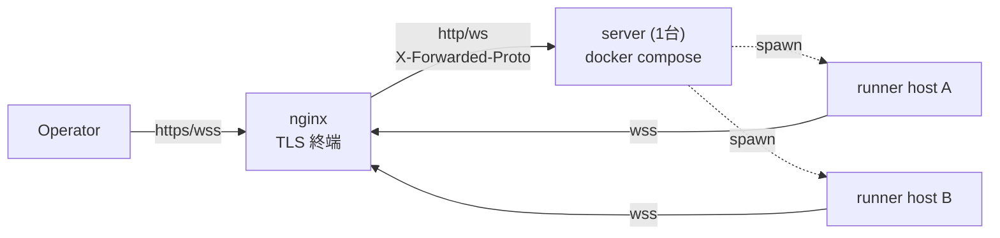
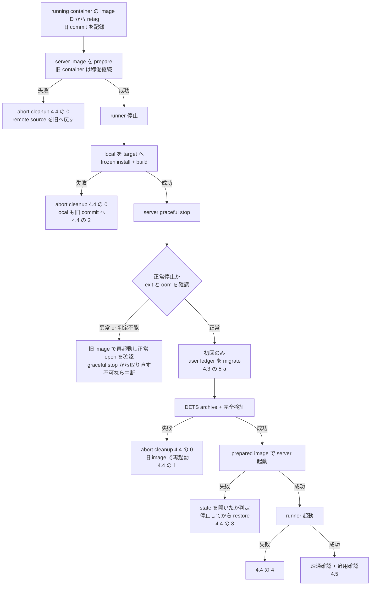

# マルチホスト配備手順書

## Purpose

デプロイ手順の正本が `server/docker-compose.yaml` のヘッダコメントと
`server/README.md` の数行に散在し、任意ホスト公開(実運用)に必要な情報
(nginx 設定・env 一覧・DETS パス・wss 制約)が欠落していた。本 doc が
**手動手順の唯一の正本**。[setup-wizards](setup-wizards.md) は**初回配備**の
env / config 生成を自動化するものであり、DETS パスや nginx 設定など wizard が
扱わない領域は本 doc に完全記載する。**既存配備の更新(4 節)は wizard の
対象外**で、自動化は issue #228 / #229 / #230 で進める。

## 全体構成



server は 1 台、runner は host_id ごとに任意台数。TLS は nginx で終端し、
server は plain HTTP のまま(2026-06-11 決定、`docker-compose.yaml` 参照)。
VPN 内限定で公開する場合のみ、nginx を置かない直結配備(1.5)も選べる。

## 1. server の配備

### 1.1 認証 token の発行(3 種必須)

任意ホスト公開では 3 種すべて設定する([auth-and-authz](auth-and-authz.md))。
生成は `openssl rand -hex 32`(32 バイト hex)。

```sh
openssl rand -hex 32   # KAOIRO_CLIENT_TOKENS の token 部分に使う
openssl rand -hex 32   # KAOIRO_WRAPPER_TOKENS の token 部分に使う
openssl rand -hex 32   # KAOIRO_RUNNER_TOKENS の token 部分に使う
```

### 1.2 `.env` の作成

```sh
cd server && cp .env.example .env
```

| env | 必須 | 意味 |
|---|---|---|
| `SECRET_KEY_BASE` | 必須 | `mix phx.gen.secret` で生成(64 文字)。`openssl rand -hex 32` では短い |
| `PHX_HOST` | 必須 | 公開ホスト名。未設定は起動時 raise(fail-fast、issue #139) |
| `PORT` | 任意 | 既定 4000 |
| `KAOIRO_BIND_IP` | 任意 | :prod のみ有効。既定は全 IF。通常は既定のままで良い(issue #139) |
| `KAOIRO_CLIENT_TOKENS` | 必須 | `<token>:<role>,...`(role = `operator`/`viewer`)。未設定は全 client 拒否 |
| `KAOIRO_WRAPPER_TOKENS` | 任意 | `<agent_id>:<token>,...`(client と順序が逆)。spawn 経由のみの runner 配備では不要 — server-minted signed token で認証 (ADR-0024、2026-08-02 改訂)。固定 wrapper を pre-register する場合のみ設定 |
| `KAOIRO_RUNNER_TOKENS` | 必須 | `<host_id>:<token>,...`。1.1 で発行した token を runner 側 `runner.env` の `KAOIRO_RUNNER_TOKEN` と対にする |
| `KAOIRO_PERSONA_DIR` | 任意 | persona pack 取り込み用コンテナ内パス。読み取り専用 mount 可 |
| `KAOIRO_FOOTER_DIR` | 任意 | footer 2 ファイルのコンテナ内 root |
| | | 未設定時は内蔵既定のみ |
| `KAOIRO_PERSONA_CACHE_DIR` | 任意 | zip extraction cache のコンテナ内 path |
| | | compose 既定は `/var/lib/kaoiro/persona-cache` |

3 種いずれも未設定時の挙動は env ごとに異なる(client = fail-closed、
runner = :prod で fail-closed・dev/test のみ緩和、wrapper = :prod では
signed token のみ受理・dev/test は緩和、issue #138 / 2026-08-02 改訂)。

persona pack 取り込みは [ADR-0046](../adr/0046-persona-cache-relocation.md)
により extraction cache と分離済みであり、`KAOIRO_PERSONA_DIR` は `:ro`
mount できる。footer を運用者が差し替える場合は、host 側の
`/srv/kaoiro/footers` を次のように読み取り専用で mount する:

```yaml
      - /srv/kaoiro/footers:/etc/kaoiro/footers:ro
```

同梱 compose は `KAOIRO_PERSONA_CACHE_DIR=/var/lib/kaoiro/persona-cache`
を設定する。cache は書き込み可能な永続領域に置き、persona pack の
mount とは分離する。

**DETS パス 8 種**(restart 跨ぎで状態を残す DETS ファイルの格納先)は
同梱 `docker-compose.yaml` が `environment:` + named volume `kaoiro-state`
で設定済みのため、compose 運用では `.env` に書く必要はない。compose を
使わずホストで直接 release を動かす場合のみ、この 8 種を書き込み可能な
永続パスへ明示する: `KAOIRO_SESSION_POINTERS_PATH` /
`KAOIRO_AGENT_DIRECTORY_PATH` / `KAOIRO_PERMISSION_MODES_PATH` /
`KAOIRO_CLEAR_WATERMARKS_PATH` / `KAOIRO_SESSION_STARTS_PATH` /
`KAOIRO_INGRESS_ORDER_PATH` / `KAOIRO_USERS_PATH` /
`KAOIRO_TOKEN_DENYLIST_PATH`。未設定はコンテナの `/tmp` 相当に落ち、
`docker compose down` で消える(offline agent 一覧が失われる)。

**この 8 種が「永続化対象の正本」である。**更新手順(4 節)の preflight は
この一覧を基準に、全 path が named volume 配下へ解決されることを確認する。
一覧に載っていない DETS が増えると、**backup の対象から静かに漏れる** —
`KAOIRO_USERS_PATH` は実際にこれを踏み、compose に無いまま container
recreate で user ledger が失われた(issue #227)。

**2026-08-08 注記:** phase 30-7 で `InterAgentHistory` DETS は撤廃し、
`KAOIRO_INTER_AGENT_HISTORY_PATH` は server に読まれなくなった。同梱
`docker-compose.yaml` と `scripts/dev.sh` の unused export も phase-30
クローズ時に削除済み。ただし**撤廃前に作られた
`inter_agent_history.dets` は既存 volume に残骸として残っている**ことが
あり、backup にも含まれる(2026-08-12 に約 1.9MB を確認)。実行時に
読まれないため害は無いが、archive のサイズと listing に現れる。

### 1.3 docker compose で起動

**build context はリポジトリルート**(dashboard/ が server/ 外にあるため、
issue #44)。`docker-compose.yaml` は `context: ..` を既に指定しているので
`server/` から通常どおり起動すれば良い。手動 `docker build` を直接叩く
場合はルートで `docker build -f server/Dockerfile .` とする。

```sh
cd server
docker compose up -d --build
```

既定で `127.0.0.1:4000` のみに bind(compose の `ports` マッピング)。
nginx からは同一ホストのループバック経由で到達させる。

### 1.4 nginx リバースプロキシ

TLS は nginx で終端し、WebSocket の Upgrade/Connection を転送、channel
heartbeat(30 秒間隔)より長い `proxy_read_timeout` を設定する。

```nginx
server {
    listen 443 ssl;
    server_name kaoiro.example.com;

    ssl_certificate     /etc/letsencrypt/live/kaoiro.example.com/fullchain.pem;
    ssl_certificate_key /etc/letsencrypt/live/kaoiro.example.com/privkey.pem;

    location / {
        proxy_pass http://127.0.0.1:4000;
        proxy_http_version 1.1;
        proxy_set_header Upgrade $http_upgrade;
        proxy_set_header Connection "upgrade";
        proxy_set_header Host $host;
        proxy_set_header X-Forwarded-Proto $scheme;
        proxy_set_header X-Forwarded-For $proxy_add_x_forwarded_for;
        proxy_read_timeout 75s;
    }
}
```

**制約(必読)**: prod は `force_ssl` が有効(`server/config/prod.exs`)で、
`X-Forwarded-Proto` が `https` でないリクエストを 301 で `https` へ
リダイレクトする。これは WebSocket ハンドシェイクでは接続失敗になる —
`proxy_set_header X-Forwarded-Proto $scheme;` を必ず設定し、**nginx を
介さず `ws://<host>:4000` へ直結することはできない**(`PHX_HOST` が
`localhost`/`127.0.0.1` の場合のみ `force_ssl` の対象外)。wrapper/runner
は必ず nginx 経由の `wss://` で接続する。VPN 内直結配備(1.5)では
`force_ssl` 自体をビルド時に無効化するため、この制約は掛からない。

### 1.5 VPN 内直結配備(nginx なし・plain HTTP、2026-07-26)

到達経路が VPN(WireGuard)内に閉じるホストでは、nginx を置かず
`http://<host>:<port>` へ直結する配備を選べる。token・cookie が VPN 内を
平文で流れるため、**経路の秘匿は VPN に委譲**する構成([threat-model](threat-model.md))。
公開インターネットには決して使わない。

`.env` に次の 2 つを追加する(それ以外の手順は 1.1〜1.3 と同じ):

| env | 値 | 意味 |
|---|---|---|
| `KAOIRO_PLAIN_HTTP` | `true` | ビルド時: `force_ssl`・Secure cookie を無効化(compile-time)。実行時: URL 生成・check_origin を `http://PHX_HOST:PORT` に切替。compose が同じ値を build arg と実行 env の両方へ配線し、不一致はサーバが起動時 raise |
| `KAOIRO_PUBLISH_IP` | ホストの VPN 側 IF の IP | compose の公開先(既定 `127.0.0.1`)。全 IF 公開ではなく VPN 側 IP に限定する |

`check_origin` は `http://PHX_HOST:PORT` と loopback の 2 つだけを許可する
(#154 M1 — 既定の host のみ比較では同一ホストの別ポートから operator
socket を奪える)。**それ以外の名前や IP 直打ちでダッシュボードを開くと
画面は出るが client socket が 403 になる** ので、必ず `PHX_HOST` と同じ
名前でアクセスする。

`PHX_HOST` は接続に使う FQDN(例 `linux-host.example`)。値を変えたら
`docker compose up -d --build` で再ビルドする(compile-time フラグのため
イメージ再利用不可)。runner の `server_url` は
`ws://<PHX_HOST>:<PORT>/runner`、ダッシュボードは
`http://<PHX_HOST>:<PORT>/?token=...` となる。

nginx が担うはずのセキュリティヘッダ(CSP / `nosniff` /
`X-Frame-Options` / `Referrer-Policy`)は、この構成では付与主体が居なく
なるためサーバ自身が全レスポンスに付ける(#155、
`KaoiroServerWeb.SecurityHeaders`。狙いと内訳は
[threat-model](threat-model.md) 緩和策)。CSP の `connect-src` は
**そのレスポンスを返しているオリジンと一致する `check_origin` エントリ
だけ**を `ws:`/`wss:` へ写すので、`PHX_HOST` / `PORT` を変えれば追随し、
外部 host 向けのページに loopback の WS 宛先が載ることもない。逆に
**ダッシュボードへ外部オリジンの script / style / 画像を持ち込む変更は
CSP で落ちる**。

### 1.6 OAuth ログイン(個人認証)の設定(任意、ADR-0042 / issue #65)

dashboard に Google / GitHub / Nextcloud の OAuth ログインを追加できる。
仕組みと設計判断は [ADR-0042](../adr/0042-oauth-allowlist-login.md)、
境界の地図は [auth-and-authz](auth-and-authz.md)。`KAOIRO_CLIENT_TOKENS`
未設定なら token 認証は無効(OAuth のみ)、設定時は併存する。

**redirect URI**(全 provider 共通。server が endpoint `url` 設定から
導出するため、登録値は必ずこの形):

```text
{scheme}://{PHX_HOST}[:{PORT}]/auth/{provider}/callback
# 例: https://kaoiro.example.com/auth/github/callback
#     http://localhost:4000/auth/google/callback   (dev)
```

**provider ごとの client 登録**(経路は 2026-07 時点):

| provider | 登録場所 | 注意 |
|---|---|---|
| Google | [console.cloud.google.com](https://console.cloud.google.com) → Google Auth Platform(初回は Get started で Branding/Audience 設定、Testing なら Test users に対象アカウント追加)→ Clients → Create Client → Web application → Authorized redirect URIs | **redirect URI は https 必須(localhost のみ http 可)**。plain-HTTP 配備(1.5)では使えない |
| GitHub | Settings → Developer settings → OAuth Apps → New OAuth App → Authorization callback URL。登録後 Generate a new client secret | **callback URL は 1 App につき 1 個**。環境ごとに別 App を作る |
| Nextcloud | 対象インスタンスの 設定 → 管理 → セキュリティ → OAuth 2.0 クライアント → 名前 + Redirection URI を追加 | scope 非対応(token はフルアクセス)だが server は identity 取得後に token を破棄する(ADR-0042)。PKCE 非対応、CSRF 防御は state のみ |

**設定の生成は `mix kaoiro.env` で自動化できる**(2026-07-27、
[setup-wizards](setup-wizards.md))。ウィザードの OAuth 質問群が
provider 選択 → id/secret 入力 → 許可リスト生成(最低 1 エントリを
促す)→ compose mount 行の案内までを行い、生成物は 0600 で書き出す。
以下は手動で設定する場合(およびウィザードが書く内容)の説明。

**`.env` への追記**(id + secret が揃った provider のみ有効化される。
Nextcloud は base_url も必須):

```sh
KAOIRO_OAUTH_GOOGLE_CLIENT_ID=...
KAOIRO_OAUTH_GOOGLE_CLIENT_SECRET=...
KAOIRO_OAUTH_GITHUB_CLIENT_ID=...
KAOIRO_OAUTH_GITHUB_CLIENT_SECRET=...
KAOIRO_OAUTH_NEXTCLOUD_CLIENT_ID=...
KAOIRO_OAUTH_NEXTCLOUD_CLIENT_SECRET=...
KAOIRO_OAUTH_NEXTCLOUD_BASE_URL=https://cloud.example.com
KAOIRO_OAUTH_ALLOWLIST_PATH=/etc/kaoiro/oauth-allowlist.txt
```

**許可リスト**(未設定・ファイル欠落・不一致はすべて認証拒否 =
fail-closed。malformed 行は warn ログの上 skip):

```text
# provider:identifier[:role]   role 省略時は viewer
# identifier: google=email(小文字)/ github=login / nextcloud=user id
google:alice@example.com:operator
github:octocat:viewer
nextcloud:alice:operator
```

compose 運用ではファイルを `server/` に置き、`docker-compose.yaml` の
`volumes:` へ read-only mount を 1 行足す:

```yaml
      - ./oauth-allowlist.txt:/etc/kaoiro/oauth-allowlist.txt:ro
```

**確認**:

```sh
curl http://<PHX_HOST>:<PORT>/session/auth-methods
# → {"token":true|false,"oauth":["github","nextcloud",...]}
```

ログイン画面に有効 provider のボタンが並び、許可リスト外のアカウントは
`auth_error=not_allowed` で拒否される。許可リストの行削除は次回接続 /
refresh(最長 12h)で反映。**operator→viewer の「降格」は稼働中 socket
に反映されない既知の穴がある(issue #158)**。拒否時の warn ログには
`provider:uid` がそのまま出るため、許可リストへ写す識別子はログから
確認できる。

## 2. runner の配備(複数ホスト)

現状は tarball 配布(issue #70、[ADR-0018](../adr/0018-runner-distribution.md)
2026-07-25 改訂)。各エージェントホストへ個別に展開する。手順の全文・
常駐化(systemd user unit / launchd LaunchAgent)は
[runner/README.md](../../runner/README.md) が正本 — ここでは複数ホスト
配備に固有の要点のみ書く。

```sh
# ビルドホスト(1 台)で対象アーキテクチャごとに生成
./scripts/build-runner-tarball.sh --target linux-x64
./scripts/build-runner-tarball.sh --target darwin-arm64

# 各エージェントホストへ転送・展開
tar xzf kaoiro-runner-<rev>-linux-x64.tar.gz
cd kaoiro-runner-<rev>-linux-x64
```

### `runner.config.json` の実例(`wss://` 必須)

nginx 越しの prod 配備では `server_url` は必ず `wss://` にする(1.4 の
制約どおり `ws://` 直結は 301 で弾かれる)。VPN 内直結配備(1.5)のみ
`ws://<PHX_HOST>:<PORT>/runner` とする。`host_id` はホストごとに
一意にする(サーバ側 `HostRegistry` が host_id をキーに register するため、
重複させると片方のホストが上書きされる)。

```json
{
  "host_id": "lab-pc-1",
  "server_url": "wss://kaoiro.example.com/runner",
  "cwd_allowlist": ["/home/agent/repos"],
  "capabilities": ["claude-code", "codex"]
}
```

`runner.env` に `KAOIRO_RUNNER_TOKEN=<1.1 で発行した token>` を設定し
(サーバ側 `KAOIRO_RUNNER_TOKENS` の `<host_id>:<token>` と対にする)、
`chmod 600` する。`server_url` は `runner.env` の
`KAOIRO_RUNNER_SERVER_URL`(issue #140、env が config ファイルより優先)
でも上書きできる。

### 常駐化

systemd user unit(Linux)/ launchd LaunchAgent(macOS)のテンプレートは
`runner/deploy/` に同梱。設置手順・終了コード・トラブルシュートは
[runner/README.md](../../runner/README.md)の「常駐化」節を参照。
**runner の再起動(サービス再起動含む)は配下の wrapper を
全停止させる**(SIGTERM 時の `supervisor.stopAll()`)— 稼働中エージェントがいる状態での
`systemctl --user restart` / `launchctl kickstart -k` は、対象ホストの
全エージェントが切断されることを意味する。

## 3. 疎通確認

1. server: `docker compose ps` で起動確認、`https://<host>/?token=<KAOIRO_CLIENT_TOKENS の token>` でダッシュボードが開く
2. runner: 起動ログに `runner: host=<host_id> connecting to wss://...` が出て切断が続かない(認証失敗は `unauthorized` で即切断)
3. ダッシュボードの host 一覧に該当 `host_id` が現れる

## 4. 既存配備の更新(暫定手順)

1〜2 節は**初回配備**の手順である。既に稼働している配備を新しいバージョンへ
上げる手順は本節が正本。

> **本節は暫定手順(manual interim procedure)である。**自動化が入るまでの
> 橋渡しとして書いており、完成形ではない。**「手順書があるから安全」ではない**
> — 4.1 の限界は手順を守っても残る。経緯と置換条件は issue #227。

### 4.1 既知の限界

| 限界 | 内容 | 解消する issue |
|---|---|---|
| **in-place build** | 稼働中の checkout の `dist` を直接上書きする。runner は wrapper を spawn するたびに on-disk の `dist` を解決する(`runner/src/spawn.ts` の `resolveWrapperLaunch()`)ため、build 中に spawn が起きると新旧の混ざった artifact を掴む。「停止中に build する」と手順で定めても、**順序を一度誤れば再発する** | #229 |
| **artifact provenance が無い** | 「実行中の artifact がその commit 由来である」ことを確認する手段が無い。**ファイルの mtime を代用してはならない**(4.5) | #228 |
| **自動 rollback が無い** | 失敗時の復旧はすべて手作業(4.4) | #230 |

3 つすべてが解消された時点で、本節は自動化手順の記述へ置換する。

### 4.2 事前条件

着手前に以下をすべて満たすこと。

- **target を full 40 桁 SHA で固定する。**`git pull` の結果に依存させない。
  作業記録にもその SHA を残す
- **server と runner の両方を同じ target へ進める。**片側だけを進めると、
  同一 SHA という postcondition が崩れ、互換の保証がない組み合わせが動く
- **source cleanliness を tracked / untracked の両方で判定する。**
  `git diff --quiet` は untracked を見ないため、これだけでは不十分
  (`git status --porcelain` の出力が空であることを確認する)
- **server ホストの SSH host key が `known_hosts` に登録済みであること。**
  `StrictHostKeyChecking=no` で迂回しない
- **永続化対象の全 path が named volume 配下へ解決されることを確認する。**
  正本は 1.2 節の 8 種。一覧に無い DETS が増えていると **backup から静かに
  漏れる**(`KAOIRO_USERS_PATH` が実際にこれを踏んだ — issue #227)
- **active な作業が無いことを確認する(人間の判断)。**runner の停止は配下の
  wrapper をすべて止める(2 節「常駐化」)。会話状態は永続化されていないため、
  進行中のやり取りは失われる

### 4.3 更新手順

**prepare(無停止)と commit(停止窓)を分ける。**build は停止時間に
含めない。特に **runner の build 成功を server の切替より前に確定させる** —
逆順にすると、build 失敗時に「新 server × 旧 runner」という互換の保証が
ない組み合わせが残る。



**backup は server を停止してから取る。**稼働中に named volume を tar すると、
複数の DETS ファイル間で状態が混ざりうる(2026-08-12 の反映ではこの誤りが
あった)。バックアップは唯一のロールバック手段であるため、ここは省略できない。

以下、`<server-host>` / `<repo-path>` / `<backup-dir>` / `<container>` /
`<target-sha>` / `<old-sha>` は各環境の値に読み替える。

**(1) 旧構成を退避し、記録する**

`docker compose build` は `kaoiro-server:latest` を新 image へ付け替える。
**build 前に旧 image へ別の tag を付けておかないと、rollback で指す先が
なくなる。**

**retag の元は `latest` ではなく、running container が実際に使っている
image ID である。**`latest` は prepare 済み / 失敗後 / retry の状態では
既に新 image を指しており、**本 runbook 自身が (2) でその状態を作る**。
`latest` から retag すると、最悪の場合 rollback tag まで新 image になり、
**戻す先が消える**。

```sh
# running container の image ID を正本として取得する
ssh <server-host> 'docker inspect <container> --format "{{.Image}}"'

# その ID に rollback tag を付ける (latest からではない)
ssh <server-host> 'docker tag <running-image-id> kaoiro-server:rollback-<old-sha>'

# tag が意図した ID を指しているか検証する
ssh <server-host> 'docker image inspect kaoiro-server:rollback-<old-sha> --format "{{.Id}}"'
# → <running-image-id> と一致すること

ssh <server-host> 'cd <repo-path> && git rev-parse HEAD'   # 旧 remote commit
git -C <repo-path> rev-parse HEAD                          # 旧 local commit
```

作業記録に残すもの: **running image ID / rollback tag / 旧 remote commit /
旧 local commit / target SHA / backup 先 / archive の SHA-256**。
ロールバックは「**旧 image + 対応する DETS**」の**対**で行うため、これらが
揃っていないと復旧できない。

**(2) server image を prepare(無停止)**

旧 container は旧 image ID を保持したまま動き続ける。ここで失敗しても
**稼働系への影響はゼロ**である。

```sh
ssh <server-host> 'cd <repo-path> && git fetch origin \
  && git merge --ff-only <target-sha> && cd server && docker compose build'
```

`up -d` はまだ実行しない。

**(3) runner を停止**

```sh
systemctl --user stop kaoiro-runner
```

**(4) local を target へ進め、build する**

**`--frozen-lockfile` は常に実行する。**target が依存を変えていた場合、
stale な `node_modules` のままビルドすると実行時に落ちる。

```sh
git -C <repo-path> fetch origin && git -C <repo-path> merge --ff-only <target-sha>
pnpm -C <repo-path> install --frozen-lockfile
pnpm -C <repo-path>/wrapper build && pnpm -C <repo-path>/runner build
```

**ここで失敗したら 4.4 の 2 へ。**server はまだ旧 container のままなので、
local を旧 commit へ戻せば元の構成に戻る。

**(5) server を停止し、停止の正常性を判定する**

graceful stop し、**正常に停止したことを確認する**。

```sh
ssh <server-host> 'cd <repo-path>/server && docker compose stop -t 30'
ssh <server-host> 'docker inspect <container> \
  --format "running={{.State.Running}} exit={{.State.ExitCode}} oom={{.State.OOMKilled}}"'
```

**`running=false` だけでは正常停止と判定できない。**timeout(`-t 30`)を
超えて SIGKILL された場合も `running=false` になる。`exit` と `oom` を併せて
見る(正常終了時の終了コードは実装依存なので、**平常時の値を控えておき、
それと異なるときは異常として扱う**)。判定に迷うときは `docker logs` の末尾で
shutdown が完走しているかを確認する。

**強制終了・異常終了が疑われる場合、この archive を rollback backup へ
昇格させてはならない。**本 runbook は backup を**唯一の rollback 手段**と
定義しており、consistent でないと分かった snapshot をその正本にするのは、
自らの不変条件に反する。次の順でやり直す。

1. forensic snapshot は取ってよい。ただし **rollback backup には昇格させない**
2. **旧 image のまま** server を再起動し、DETS が正常に open / recovery
   できることを確認する
3. 改めて graceful stop する
4. 正常停止を確認してから consistent backup を取り直す
5. 正常に open / stop できない場合は、**deploy を中断する**

**判定できないときも中断する。**「たぶん大丈夫」で先へ進まない。

**(5-a) 【初回のみ】user ledger の migration**

`KAOIRO_USERS_PATH` を compose へ追加した**最初の適用**では、**現在の
ledger が volume に無い**。旧 container はこの env 無しで起動しており、
`KaoiroServer.Users.default_path/0` の fallback(`System.tmp_dir!()` 配下の
`kaoiro_users.dets`)を使っているためである。**このまま recreate すると、
compose を直した当の deploy が現在の ledger を捨てる。**

```sh
# 1. running container の実効 path を確認する
ssh <server-host> 'docker inspect <container> \
  --format "{{range .Config.Env}}{{if eq (index (split . \"=\") 0) \"KAOIRO_USERS_PATH\"}}{{.}}{{end}}{{end}}"'
```

出力が空なら未設定 = fallback path を使っている。**設定済みならこの step は
不要**(以後の deploy も同じ)。

```sh
# 2. 停止済みの旧 container から ledger を退避し、checksum を記録する
ssh <server-host> 'docker cp <container>:/tmp/kaoiro_users.dets \
  <backup-dir>/users-migrate-<timestamp>.dets'
ssh <server-host> 'sha256sum <backup-dir>/users-migrate-<timestamp>.dets'

# 3. volume 側に users.dets が既に無いことを確認する
ssh <server-host> 'docker run --rm -v <volume>:/data:ro alpine ls -la /data/users.dets 2>&1'

# 4. volume へ配置し、runtime user が読める owner / mode にする
ssh <server-host> 'docker run --rm -v <volume>:/data -v <backup-dir>:/backup \
  alpine sh -c "cp /backup/users-migrate-<timestamp>.dets /data/users.dets \
    && chown nobody:nogroup /data/users.dets && chmod 600 /data/users.dets"'
```

**両方に存在する場合は、running container が実際に参照していた path を
authority とする。**推測で merge しない。

**退避元のファイルが存在しない場合、ledger は既に失われている。**その旨を
作業記録へ明記し、operator の判断で進む。**黙って空の ledger を新規作成
しない** —「失われた」と「もともと無かった」は区別する。

この migration は**次の step で取る pre-deploy archive に含まれる**ため、
以後の deploy では通常経路に乗る。

**(5-b) volume を解決して archive する**

volume 名を **container の mount 先から解決する**(名前を決め打ちしない)。

```sh
ssh <server-host> 'docker inspect <container> \
  --format "{{range .Mounts}}{{if eq .Destination \"/var/lib/kaoiro\"}}{{.Name}}{{end}}{{end}}"'
```

**出力が空でないことを確認する。**空なら mount 構成が変わっており、この先の
archive は何も取らずに成功してしまう。

```sh
ssh <server-host> 'docker run --rm -v <volume>:/data:ro -v <backup-dir>:/backup \
  alpine tar czf /backup/kaoiro-dets-<timestamp>.tar.gz -C /data .'
```

**検証は完全走査で行う。**

```sh
ssh <server-host> 'tar tzf <backup-dir>/kaoiro-dets-<timestamp>.tar.gz >/dev/null \
  && sha256sum <backup-dir>/kaoiro-dets-<timestamp>.tar.gz'
```

`tar tzf ... | head -20` と書いてはならない。**pipeline の終了ステータスは
`head` 側になり、`tar` の失敗が握りつぶされる。**壊れた archive でもファイル
自体は存在するので `sha256sum` は成功し、「検証した」ことになってしまう。

内容の目視は、検証とは**別のコマンド**で行う。

```sh
ssh <server-host> 'tar tzf <backup-dir>/kaoiro-dets-<timestamp>.tar.gz | head -20'
```

**1.2 節の 8 種がすべて含まれることを確認する。**含まれない DETS は
volume の外にあり、この backup では復元できない。

**(6) prepared image で server を起動**

```sh
ssh <server-host> 'cd <repo-path>/server && docker compose up -d --no-build'
```

`--no-build` を付ける。ここで再 build すると (2) で検証した image と別物に
なりうる。

**(7) runner を起動**

```sh
systemctl --user start kaoiro-runner
```

### 4.4 失敗時の対応

**(0) 中止時の共通クリーンアップ**

どの分岐で中止する場合も、**まずこれを実行する**。

process として旧 server が動き続けていても、**それだけでは「旧構成へ戻った」
ことにならない**。prepare が成功していれば、その時点で:

- remote checkout = **target**
- `kaoiro-server:latest` = **新 image**
- running container だけが旧 image ID

という状態になっている。**放置すると、次に誰かが `docker compose up` を
実行しただけで、未完了の deploy が本番へ切り替わる。**

実行中の container には触れずに、次を戻す。

```sh
# 1. remote source を旧 commit へ戻す
ssh <server-host> 'cd <repo-path> && git checkout <old-remote-sha>'

# 2. latest を旧 image へ戻す (prepare が成功していた場合)
ssh <server-host> 'docker tag <running-image-id> kaoiro-server:latest'

# 3. latest と running container の image ID が一致することを確認する
ssh <server-host> 'docker image inspect kaoiro-server:latest --format "{{.Id}}"'
ssh <server-host> 'docker inspect <container> --format "{{.Image}}"'
```

prepared な新 image を別の tag で保持しておくのは構わない。**`latest` と
production checkout だけは旧構成へ戻す。**

**`git checkout <sha>` は detached HEAD を残す。**復旧そのものには使えるが、
production checkout がどの branch を追っていたかという運用状態は失われる。
**rollback 中は detached である前提で扱い、復旧後に operator が branch
pointer を戻す。**source checkout を release として分離する #229 までは、
この限界が残る。

**(1) DETS の archive または検証に失敗した**(4.3 の 5)

新 server へ**進まない**。**(0) を実行**したうえで、旧 image で起動し直す。

```sh
ssh <server-host> 'cd <repo-path>/server && docker compose up -d --no-build --force-recreate'
```

local も旧 commit へ戻し、frozen install + build してから runner を起動する
((2) と同じ手順)。バックアップが取れない状態での更新は、**ロールバック手段を
持たない更新**になる。

**(2) build が失敗した**(4.3 の 4)

server はまだ切り替えていないので、旧 container が動いたままである。
**ただし (0) は必要**である — prepare が成功していれば `latest` は既に新
image を指している。

そのうえで local を戻す。**`dist` を退避してあれば戻す、という復旧は限定的に
しか使えない。**`pnpm install` が `node_modules` を書き換えた場合、`dist` だけ
戻しても実行時の依存が食い違う。**dist-only restore が成立するのは lockfile と
`node_modules` を変更していない場合に限る。**

通常の復旧の正本は、旧 commit とそのときの lockfile でやり直すことである。

```sh
git -C <repo-path> checkout <old-local-sha>
pnpm -C <repo-path> install --frozen-lockfile
pnpm -C <repo-path>/wrapper build && pnpm -C <repo-path>/runner build
systemctl --user start kaoiro-runner
```

これも取れない場合、runner は停止したままにする。**中途半端な `dist` で
起動しない。**

**(3) 新 server が起動しない**(4.3 の 6)

**「新 server が state を開いたか」を人の判断に委ねない。**次の observable な
境界で分ける。

- **`docker compose up -d` をまだ実行していない、または container process が
  開始していないと証明できる**: DETS の restore は不要。**(0)** を実行して
  旧 image で起動するだけでよい
- **一度でも新 container の開始を試みた、または開始したか不明**:
  **state を開いたものとして扱う。**新コードが書いた DETS を旧コードが読める
  保証は無い(issue #219 で tuple が 3→4 要素になった前例がある)

後者の手順は次のとおり。**restore は destructive なので、順序を守る。**

```sh
# 1. failed / new container を停止し、非 running を確認する
#    restart: unless-stopped のため、crash-loop 中の process が同じ volume へ
#    書いている可能性がある。止めずに tar / 削除 / 展開すると両方が壊れる
ssh <server-host> 'cd <repo-path>/server && docker compose stop -t 30'
ssh <server-host> 'docker inspect <container> --format "{{.State.Running}}"'   # false

# 2. volume 名を再解決し、operator が目視で確認する
ssh <server-host> 'docker inspect <container> \
  --format "{{range .Mounts}}{{if eq .Destination \"/var/lib/kaoiro\"}}{{.Name}}{{end}}{{end}}"'

# 3. 現在 (新) の state を forensic archive し、完全走査 + checksum を記録する
ssh <server-host> 'docker run --rm -v <volume>:/data:ro -v <backup-dir>:/backup \
  alpine tar czf /backup/kaoiro-dets-forensic-<timestamp>.tar.gz -C /data .'
ssh <server-host> 'tar tzf <backup-dir>/kaoiro-dets-forensic-<timestamp>.tar.gz >/dev/null \
  && sha256sum <backup-dir>/kaoiro-dets-forensic-<timestamp>.tar.gz'

# 4. pre-deploy archive を destructive delete の前に再検証する
#    記録済み SHA-256 との一致と、完全走査の両方
ssh <server-host> 'sha256sum <backup-dir>/kaoiro-dets-<timestamp>.tar.gz'
ssh <server-host> 'tar tzf <backup-dir>/kaoiro-dets-<timestamp>.tar.gz >/dev/null'

# 5. volume を完全に空にして restore する
#    rm -rf /data/* は dotfile を消さないため「完全に空」にならない。
#    mount root 自体は残して全 entry を消す
ssh <server-host> 'docker run --rm -v <volume>:/data -v <backup-dir>:/backup \
  alpine sh -c "find /data -mindepth 1 -maxdepth 1 -exec rm -rf -- {} + \
    && tar xzf /backup/kaoiro-dets-<timestamp>.tar.gz -C /data"'

# 6. restore 結果を確認する (1.2 節の 8 種の存在、owner / mode)
ssh <server-host> 'docker run --rm -v <volume>:/data:ro alpine ls -la /data/'
```

そのうえで **(0)** を実行し、旧 image で起動する。

```sh
ssh <server-host> 'cd <repo-path>/server && docker compose up -d --no-build --force-recreate'
```

**restore する backup は、その image と対になったものでなければならない。**
「旧 image だけ」「backup だけ」の片方では戻らない。

**(4) runner が再起動しない**(4.3 の 7)

`systemctl --user status kaoiro-runner` と journal を確認する。終了コード 78
(`EX_CONFIG`)は設定エラーで、再起動では直らない(2 節「再起動ポリシーと
終了コード」)。`dist` の欠落もこのコードになるため、(2) の復旧手順を先に
確認する。

**(5) 適用確認が揃わない**

4.5 の operational success がすべて揃わない場合、**更新が成功したと見なさない。**
判断がつかないときは、backup を保持したまま作業を中断し、状態を記録する。

### 4.5 適用確認と、その限界

確認は 2 層に分かれる。**成功と判定してよいのは operational success が
すべて揃ったときだけ**であり、provenance は現時点で証明できない。

#### operational success(これが成功条件)

| 項目 | 確認方法 |
|---|---|
| server の source が exact target | `ssh <server-host> 'cd <repo-path> && git rev-parse HEAD'` が target SHA と一致 |
| local の source が exact target | `git -C <repo-path> rev-parse HEAD` が同上 |
| build が成功した | 4.3 の 2 / 4 の各コマンドが exit 0 |
| container が stable | 一定時間(目安 60 秒)経過後も restart しておらず `docker ps` で `Up` |
| **3 節の疎通確認が通る** | **必須で再実行する** — dashboard が開く / runner の journal で接続が継続する / host 一覧に対象 `host_id` が出る |

**3 節の再実行は省略しない。**`docker ps` と `git log` と `dist` の中身だけでは、
server が restart loop せずリクエストを処理できるか、runner が認証と register に
成功するか、dashboard と host projection が動くかを何ひとつ確認できない。

#### 証明できないこと(provenance)

「**実行中の JS / image が target commit 由来である**」ことを暗号学的に
結びつける手段は、現時点で存在しない。

**ファイルの mtime は成功根拠にならない。**`dist` ディレクトリの mtime は、
ファイルの追加・削除が無ければ更新されない。2026-08-12 の反映では、実際には
全パッケージが再ビルドされていたにもかかわらず、3 パッケージのディレクトリ
mtime が 10 日前を指しており、誤読しかけた。中の `.js` の mtime も同様に、
「いつ書かれたか」しか語らず、「どの commit 由来か」は語らない。

変更が特定の識別子を含む場合、それが `dist` に入っているかを見るのは
**補助証拠としては有効**である。ただし変更ごとにしか使えず、成功判定の
一般条件にはならない。

```sh
grep -rl "<変更で追加した識別子>" <repo-path>/wrapper/*/dist
```

build identity(#228)の導入後、この節は full SHA を返す health endpoint と
runner の register 情報による確認へ置換する。

## See Also

- [auth-and-authz](auth-and-authz.md) — 3 種トークンの未設定時挙動の詳細
- [setup-wizards](setup-wizards.md) — **初回配備**の env / config 生成を自動化する
  対話ウィザード。4 節の更新手順は対象外(自動化は #228 / #229 / #230)
- [runner/README.md](../../runner/README.md) — 常駐化・tarball 配布の全文
- [server/README.md](../../server/README.md) — ローカル開発・Docker の基本
- [threat-model](threat-model.md) — dev fallback / token 未設定のリスク評価
