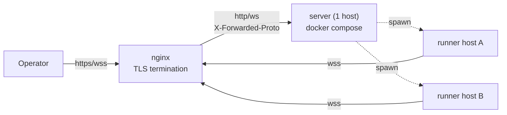
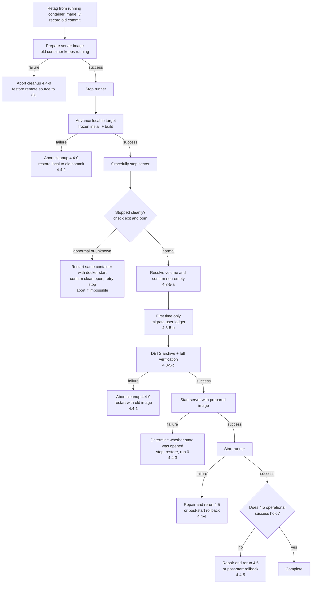

# Multi-host deployment guide

## Purpose

The canonical deployment procedure had been scattered across header comments in
`server/docker-compose.yaml` and a few lines in `server/README.md`, omitting the
information needed for public operation on an arbitrary host (nginx settings,
env list, DETS paths, and wss constraints). This document is the **sole canonical
manual procedure**. [setup-wizards](setup-wizards.md) automates env/config
generation for **initial deployment**; this document fully records areas the
wizard does not handle, such as DETS paths and nginx settings. **Updating an
existing deployment (section 4) is outside the wizard** and is being automated in
issues #218 / #219 / #220.

## Overall architecture



Use one server and any number of runners per host ID. TLS terminates at nginx;
the server remains plain HTTP (decision 2026-06-11, see `docker-compose.yaml`).
Only deployments restricted to a VPN may use the direct, nginx-free option (1.5).

## 1. Deploy the server

### 1.1 Issue authentication tokens (three required)

For public operation on an arbitrary host, configure all three
([auth-and-authz](auth-and-authz.md)). Generate them with
`openssl rand -hex 32` (32-byte hex).

```sh
openssl rand -hex 32   # KAOIRO_CLIENT_TOKENS の token 部分に使う
openssl rand -hex 32   # KAOIRO_WRAPPER_TOKENS の token 部分に使う
openssl rand -hex 32   # KAOIRO_RUNNER_TOKENS の token 部分に使う
```

### 1.2 Create `.env`

```sh
cd server && cp .env.example .env
```

| env | Required | Meaning |
|---|---|---|
| `SECRET_KEY_BASE` | Required | Generate with `mix phx.gen.secret` (64 characters); `openssl rand -hex 32` is too short |
| `PHX_HOST` | Required | Public hostname. Unset raises at startup (fail-fast, issue #134) |
| `PORT` | Optional | Defaults to 4000 |
| `KAOIRO_BIND_IP` | Optional | Effective only in :prod; defaults to all interfaces, which is normally fine (issue #134) |
| `KAOIRO_CLIENT_TOKENS` | Required | `<token>:<role>,...` (role = `operator`/`viewer`); unset rejects every client |
| `KAOIRO_WRAPPER_TOKENS` | Optional | `<agent_id>:<token>,...` (reverse order from client). Not needed when runners deploy only through spawn—authenticate with server-minted signed tokens (ADR-0024, revised 2026-08-02). Set only to pre-register fixed wrappers |
| `KAOIRO_RUNNER_TOKENS` | Required | `<host_id>:<token>,...`; pair the token issued in 1.1 with `KAOIRO_RUNNER_TOKEN` in the runner's `runner.env` |
| `KAOIRO_PERSONA_DIR` | Optional | Container path for persona-pack import; may be mounted read-only |
| `KAOIRO_FOOTER_DIR` | Optional | Container root for the two footer files |
| | | When unset, use built-in defaults only |
| `KAOIRO_PERSONA_CACHE_DIR` | Optional | Container path for the zip-extraction cache |
| | | Compose default is `/var/lib/kaoiro/persona-cache` |

Unset behavior differs by env (client = fail-closed; runner = fail-closed in
:prod and relaxed only in dev/test; wrapper = only signed tokens accepted in
:prod and relaxed in dev/test; issue #133, revised 2026-08-02).

Persona-pack import is separated from the extraction cache by
[ADR-0046](../adr/0046-persona-cache-relocation.md), so `KAOIRO_PERSONA_DIR` may
be mounted `:ro`. To replace footers, mount the host directory
`/srv/kaoiro/footers` read-only:

```yaml
      - /srv/kaoiro/footers:/etc/kaoiro/footers:ro
```

The bundled compose sets `KAOIRO_PERSONA_CACHE_DIR=/var/lib/kaoiro/persona-cache`.
Keep the cache on writable persistent storage, separate from the persona-pack
mount.

The **ten DETS paths** (locations of DETS files that retain state across
restarts) are already configured by the bundled `docker-compose.yaml` through
`environment:` and the named volume `kaoiro-state`; compose users need not put
them in `.env`. When running a release directly on the host without compose,
set all ten explicitly to writable persistent paths: `KAOIRO_SESSION_POINTERS_PATH` /
`KAOIRO_AGENT_DIRECTORY_PATH` / `KAOIRO_PERMISSION_MODES_PATH` /
`KAOIRO_CLEAR_WATERMARKS_PATH` / `KAOIRO_SESSION_STARTS_PATH` /
`KAOIRO_INGRESS_ORDER_PATH` / `KAOIRO_USERS_PATH` /
`KAOIRO_TOKEN_DENYLIST_PATH` / `KAOIRO_DELIVERY_STATES_PATH` /
`KAOIRO_SESSION_LIFECYCLE_EVENTS_PATH`. Unset paths fall
under a container-equivalent of `/tmp` and disappear after `docker compose down`
(the offline-agent list is lost).

`SESSION_LIFECYCLE_MAX_EVENTS_PER_AGENT` (unprefixed, ADR-0055 phase-33
Stage B) caps the per-agent event count the `session_lifecycle` DETS
retains, oldest discarded first. Unset defaults to 10000.

**These ten are the canonical persistence set.** The preflight in section 4
checks that every path resolves under the named volume using this list. A DETS
file not listed can **silently escape backup**—`KAOIRO_USERS_PATH` did exactly
that, and the user ledger was lost when the container was recreated without it
in compose (issue #217).

**Note 2026-08-08:** Phase 30-7 removed the `InterAgentHistory` DETS, and the
server no longer reads `KAOIRO_INTER_AGENT_HISTORY_PATH`. The unused exports in
the bundled `docker-compose.yaml` and `scripts/dev.sh` were also removed when
phase 30 closed. However, **`inter_agent_history.dets` created before removal
may remain as debris in existing volumes** and is included in backups (about
1.9 MB observed on 2026-08-12). It is harmless because runtime never reads it,
but it appears in archive size and listings.

### 1.3 Start with docker compose

**The build context is the repository root** because `dashboard/` is outside
`server/` (issue #44). `docker-compose.yaml` already sets `context: ..`, so start
normally from `server/`. For a manual `docker build`, run
`docker build -f server/Dockerfile .` from the root.

```sh
cd server
docker compose up -d --build
```

By default it binds only to `127.0.0.1:4000` (the compose `ports` mapping). nginx
reaches it through the same host's loopback.

### 1.4 nginx reverse proxy

Terminate TLS at nginx and forward the WebSocket Upgrade/Connection headers.
Set `proxy_read_timeout` longer than the channel heartbeat (30 seconds).

```nginx
server {
    listen 443 ssl;
    server_name kaoiro.example.com;

    ssl_certificate     /etc/letsencrypt/live/kaoiro.example.com/fullchain.pem;
    ssl_certificate_key /etc/letsencrypt/live/kaoiro.example.com/privkey.pem;

    location / {
        proxy_pass http://127.0.0.1:4000;
        proxy_http_version 1.1;
        proxy_set_header Upgrade $http_upgrade;
        proxy_set_header Connection "upgrade";
        proxy_set_header Host $host;
        proxy_set_header X-Forwarded-Proto $scheme;
        proxy_set_header X-Forwarded-For $proxy_add_x_forwarded_for;
        proxy_read_timeout 75s;
    }
}
```

**Read this constraint:** prod enables `force_ssl` (`server/config/prod.exs`) and
redirects requests whose `X-Forwarded-Proto` is not `https` to `https` with 301.
That fails a WebSocket handshake. Always set
`proxy_set_header X-Forwarded-Proto $scheme;`; **direct `ws://<host>:4000`
connections that bypass nginx are not supported** (only `localhost`/`127.0.0.1`
`PHX_HOST` values are exempt from `force_ssl`). Wrappers and runners must use
`wss://` through nginx. The VPN direct deployment (1.5) disables `force_ssl` at
build time, so this constraint does not apply.

### 1.5 Direct VPN deployment (no nginx, plain HTTP, 2026-07-26)

For hosts reachable only inside a VPN (WireGuard), you may deploy without nginx
and connect directly to `http://<host>:<port>`. Tokens and cookies travel in
plaintext inside the VPN, so **the VPN is responsible for path confidentiality**
([threat-model](threat-model.md)). Never expose this mode to the public Internet.

Add these two variables to `.env` (all other steps are the same as 1.1–1.3):

| env | Value | Meaning |
|---|---|---|
| `KAOIRO_PLAIN_HTTP` | `true` | Build time: disable `force_ssl` and Secure cookies (compile-time). Runtime: switch URL generation and `check_origin` to `http://PHX_HOST:PORT`. Compose wires the same value to both build arg and runtime env; mismatch raises at server startup |
| `KAOIRO_PUBLISH_IP` | Host's VPN-side interface IP | Compose bind address (default `127.0.0.1`); restrict to the VPN interface rather than publishing on all interfaces |

`check_origin` allows only `http://PHX_HOST:PORT` and loopback (private Gitea
issue 154 M1: comparing only the default host would let another port on the same
host steal an operator socket). **Opening the dashboard with another name or a
literal IP renders the page but the client socket receives 403**, so always use
the same name as `PHX_HOST`.

`PHX_HOST` is the FQDN used for connections (for example,
`linux-host.example`). Rebuild with `docker compose up -d --build` after changing
it (compile-time flag; images cannot be reused). The runner `server_url` is
`ws://<PHX_HOST>:<PORT>/runner`; the dashboard is
`http://<PHX_HOST>:<PORT>/?token=...`.

Because nginx is absent in this mode, the server itself adds the security headers
nginx normally supplies (CSP / `nosniff` / `X-Frame-Options` /
`Referrer-Policy`) to every response (#145,
`KaoiroServerWeb.SecurityHeaders`; intent and details are in the
[threat-model](threat-model.md) mitigations). CSP `connect-src` copies to `ws:` /
`wss:` **only the `check_origin` entry matching the origin serving that response**;
changing `PHX_HOST` / `PORT` follows automatically and never puts a loopback WS
target on an external-host page. Conversely, **CSP rejects changes that bring
scripts, styles, or images from external origins into the dashboard**.

### 1.6 Configure OAuth login (optional, ADR-0042 / issue #65)

The dashboard can add Google / GitHub / Nextcloud OAuth login. See
[ADR-0042](../adr/0042-oauth-allowlist-login.md) for mechanism and design
decisions and [auth-and-authz](auth-and-authz.md) for the boundary map. If
`KAOIRO_CLIENT_TOKENS` is unset, token auth is disabled (OAuth only); when set,
the two paths coexist.

**Redirect URI** (common to all providers; the server derives it from the
endpoint `url`, so register exactly this form):

```text
{scheme}://{PHX_HOST}[:{PORT}]/auth/{provider}/callback
# 例: https://kaoiro.example.com/auth/github/callback
#     http://localhost:4000/auth/google/callback   (dev)
```

**Register a client for each provider** (paths current as of 2026-07):

| provider | Registration path | Notes |
|---|---|---|
| Google | [console.cloud.google.com](https://console.cloud.google.com) → Google Auth Platform (first use: Get started to configure Branding/Audience; for Testing add the account under Test users) → Clients → Create Client → Web application → Authorized redirect URIs | **Redirect URI must use https (http only for localhost)**; unavailable in plain-HTTP deployment (1.5) |
| GitHub | Settings → Developer settings → OAuth Apps → New OAuth App → Authorization callback URL; after registration, Generate a new client secret | **One callback URL per App**; create a separate App per environment |
| Nextcloud | Target instance Settings → Administration → Security → OAuth 2.0 clients → add a name + Redirection URI | No scope support (tokens have full access), but the server discards the token after obtaining identity (ADR-0042). No PKCE; CSRF protection is state only |

**Generate settings automatically with `mix kaoiro.env`** (2026-07-27,
[setup-wizards](setup-wizards.md)). The wizard's OAuth questions cover provider
selection → ID/secret entry → allowlist generation (prompting for at least one
entry) → a compose-mount line, and write generated files with mode 0600. The
following describes manual configuration (and what the wizard writes).

**Append to `.env`** (a provider is enabled only when both ID and secret exist;
Nextcloud also requires `base_url`):

```sh
KAOIRO_OAUTH_GOOGLE_CLIENT_ID=...
KAOIRO_OAUTH_GOOGLE_CLIENT_SECRET=...
KAOIRO_OAUTH_GITHUB_CLIENT_ID=...
KAOIRO_OAUTH_GITHUB_CLIENT_SECRET=...
KAOIRO_OAUTH_NEXTCLOUD_CLIENT_ID=...
KAOIRO_OAUTH_NEXTCLOUD_CLIENT_SECRET=...
KAOIRO_OAUTH_NEXTCLOUD_BASE_URL=https://cloud.example.com
KAOIRO_OAUTH_ALLOWLIST_PATH=/etc/kaoiro/oauth-allowlist.txt
```

**Allowlist** (unset, missing, or mismatched values all reject authentication =
fail-closed; malformed lines warn and skip):

```text
# provider:identifier[:role]   omitted role means viewer
# identifier: google=lowercase email / github=login / nextcloud=user id
google:alice@example.com:operator
github:octocat:viewer
nextcloud:alice:operator
```

For compose, put the file in `server/` and add one read-only mount under
`volumes:` in `docker-compose.yaml`:

```yaml
      - ./oauth-allowlist.txt:/etc/kaoiro/oauth-allowlist.txt:ro
```

**Verify**:

```sh
curl http://<PHX_HOST>:<PORT>/session/auth-methods
# → {"token":true|false,"oauth":["github","nextcloud",...]}
```

The login screen lists buttons for enabled providers; accounts outside the
allowlist are rejected with `auth_error=not_allowed`. Removing a line applies on
the next connection / refresh (up to 12h). **A known gap (issue #148) means an
operator→viewer demotion does not reach an active socket.** Rejection WARN logs
include `provider:uid`, so the identifier to copy into the allowlist can be read
from the log.

## 2. Deploy runners (multiple hosts)

Distribution currently uses tarballs (issue #70, revised 2026-07-25 in
[ADR-0018](../adr/0018-runner-distribution.md)); expand one on each agent host.
The full procedure and service setup (systemd user unit / launchd LaunchAgent)
are canonical in [runner/README.md](../../runner/README.md); this section covers
only points specific to multi-host deployment.

```sh
# ビルドホスト(1 台)で対象アーキテクチャごとに生成
./scripts/build-runner-tarball.sh --target linux-x64
./scripts/build-runner-tarball.sh --target darwin-arm64

# 各エージェントホストへ転送し、release として install する
# (展開先は <install-root>/releases/<rev>/、ADR-0018 2026-08-16 改訂)
./kaoiro-runner-install.sh kaoiro-runner-<rev>-linux-x64.tar.gz
./kaoiro-runner-switch.sh <rev>
```

The install / switch scripts are in the package's `deploy/`. For the first
installation, expand the archive once and run from there
(`tar xzf ... && cd ... && ./deploy/kaoiro-runner-install.sh ../<archive>`).
Afterward use `<install-root>/current/deploy/`. Section 4.6 is canonical for
layout, updates, and rollback.

### `runner.config.json` example (`wss://` required)

For prod deployments through nginx, `server_url` must be `wss://` (`ws://`
direct connections receive 301 under the 1.4 constraint). Only the direct VPN
deployment (1.5) uses `ws://<PHX_HOST>:<PORT>/runner`. Make `host_id` unique per
host: the server's `HostRegistry` registers by host ID, so duplicates overwrite
one host with the other.

```json
{
  "host_id": "lab-pc-1",
  "server_url": "wss://kaoiro.example.com/runner",
  "cwd_allowlist": ["/home/agent/repos"],
  "capabilities": ["claude-code", "codex"]
}
```

Set `KAOIRO_RUNNER_TOKEN=<token issued in 1.1>` in `runner.env` (pair it with
`<host_id>:<token>` in server-side `KAOIRO_RUNNER_TOKENS`) and run `chmod 600`.
Override `server_url` with `KAOIRO_RUNNER_SERVER_URL` in `runner.env` as well
(issue #135; env takes precedence over the config file).

### Run as a service

Templates for systemd user units (Linux) and launchd LaunchAgents (macOS) ship
in `runner/deploy/`. See the “Run as a service” section of
[runner/README.md](../../runner/README.md) for installation, exit codes, and
troubleshooting. In the release profile set `@@DEPLOY_DIR@@` to
`<install-root>/current/deploy`; starting the unit through the symlink is what
makes switching atomic. **Restarting a runner (including service restart) stops
all wrappers beneath it** (`supervisor.stopAll()` on SIGTERM), so
`systemctl --user restart` / `launchctl kickstart -k` with active agents
disconnects every agent on that host.

## 3. Connectivity checks

1. server: verify with `docker compose ps`; open the dashboard at
   `https://<host>/?token=<token from KAOIRO_CLIENT_TOKENS>`.
2. runner: startup logs show `runner: host=<host_id> connecting to wss://...`
   without repeated disconnects (auth failure disconnects immediately as
   `unauthorized`).
3. Confirm the host list in the dashboard contains the `host_id`.

## 4. Update an existing deployment (interim procedure)

Sections 1–2 cover **initial deployment**. This section is canonical for moving
an already-running deployment to a new version.

> **This section is an interim manual procedure.** It bridges the period before
> automation and is not the final form. **A runbook does not make the operation
> safe**—the limits in 4.1 remain even when followed. History and replacement
> criteria are in issue #217.

### 4.1 Known limits

| Limit | Details | Resolving issue |
|---|---|---|
| **In-place build** (checkout-direct hosts only) | Overwrites `dist` in the active checkout. Each wrapper spawn resolves on-disk `dist` (`resolveWrapperLaunch()` in `runner/src/spawn.ts`), so a spawn during build can capture a mixed old/new artifact. Even if the procedure says “build while stopped,” **one ordering mistake reproduces the failure** | #219 (implemented; **remains until the host moves to the release profile** — 4.6) |
| **No automatic rollback** | All recovery after failure is manual (4.4) | #220 |

**Missing artifact provenance (former #218) is resolved**: build identity
([ADR-0053](../adr/0053-build-identity.md)) exposes the full SHA through the
health endpoint and runner registration data (4.5).

**In-place build is resolved in the release profile** ([ADR-0018](../adr/0018-runner-distribution.md),
revised 2026-08-16). Releases expand to `releases/<revision>/` and the live path
is one `current` symlink, so **build and expansion never touch a running runner**.
This remains **a host installation-shape issue** rather than a code-only fix:
hosts whose `ExecStart` points directly to a repo checkout retain the limit until
they complete the 4.6 migration.

### 4.2 Preconditions

Satisfy all of the following before starting.

- **Pin the target to a full 40-character SHA.** Do not depend on `git pull`; record
  the SHA in the change log.
- **Advance both server and runner to the same target.** Advancing one side alone
  breaks the same-SHA postcondition and runs an unverified combination.
- **Check source cleanliness for tracked and untracked files.** `git diff --quiet`
  misses untracked files; require empty `git status --porcelain` output.
- **Ensure the server host's SSH host key is in `known_hosts`.** Do not bypass with
  `StrictHostKeyChecking=no`.
- **Ensure every persistence path resolves under the named volume.** The source of
  truth is the ten paths in 1.2. An unlisted DETS can **silently escape backup**
  (`KAOIRO_USERS_PATH` did so, losing the user ledger on container recreation;
  issue #217).
- **Confirm there is no active work** (human judgment). Stopping a runner stops all
  wrappers beneath it (section 2, “Run as a service”); conversation state is not
  persisted, so in-progress exchanges are lost.

### 4.3 Update procedure

**Separate prepare (no downtime) from commit (the stop window).**

**Do not count server-image build time as server downtime.** The old container can
keep running with its old image ID.

**Whether runner build time is downtime depends on the host installation shape.**

- **Release profile** (migrated in 4.6): build and expansion stay under
  `releases/<revision>/`, so **downtime is only switching `current` and restarting**.
  Build time is not outage; the 4.6 update command handles the sequence.
- **Checkout-direct** (not migrated): the 4.1 in-place-build limit can capture a
  mixed artifact when building while active. Therefore **runner build time is
  runner downtime**; include it in outage estimates. Steps (3) / (4) below are
  for this shape.

In particular, **confirm runner build success before switching the server**. The
reverse order can leave an unverified “new server × old runner” combination when
the build fails.



**C / D in the diagram (stop runner → build) apply to checkout-direct hosts.**
Release-profile hosts can build in parallel with B; they stop the runner only just
before switching `current` (4.6).

**Take the backup after stopping the server.** Tarring a live named volume can mix
state across DETS files (this mistake occurred in the 2026-08-12 rollout).
The backup is the only rollback path, so this step is mandatory.

Substitute each environment's values for the placeholders below.

`<server-host>` / `<repo-path>` / `<backup-dir>` / `<container>` /
`<volume>` / `<target-sha>` / `<old-sha>` / `<old-remote-sha>` /
`<old-local-sha>` / `<running-image-id>` / `<timestamp>` / `<uid>` / `<gid>`

**(1) Preserve and record the old configuration**

`docker compose build` retags `kaoiro-server:latest` to the new image.
**Tag the old image separately before building or rollback will have nowhere to
point.**

**Retag from the image ID actually used by the running container, not `latest`.**
After prepare, failure, or retry, `latest` may already point to the new image—the
runbook itself creates that state in (2). Retagging from `latest` can make even
the rollback tag point to the new image, **destroying the rollback target**.

```sh
# running container の image ID を正本として取得する
ssh <server-host> 'docker inspect <container> --format "{{.Image}}"'

# その ID に rollback tag を付ける (latest からではない)
ssh <server-host> 'docker tag <running-image-id> kaoiro-server:rollback-<old-sha>'

# tag が意図した ID を指しているか検証する
ssh <server-host> 'docker image inspect kaoiro-server:rollback-<old-sha> --format "{{.Id}}"'
# → <running-image-id> と一致すること

ssh <server-host> 'cd <repo-path> && git rev-parse HEAD'   # 旧 remote commit
git -C <repo-path> rev-parse HEAD                          # 旧 local commit
```

Record: **running image ID / rollback tag / old remote commit / old local commit /
target SHA / backup destination / archive SHA-256**. Rollback uses the pair
“**old image + its DETS**”; recovery is impossible without all of these.

**(2) Prepare the server image (no downtime)**

The old container keeps running with its old image ID; failure here has **zero
impact on the live system**.

**Pass `KAOIRO_BUILD_VERSION` / `KAOIRO_BUILD_CHANNEL` /
`KAOIRO_BUILD_REVISION` / `KAOIRO_BUILD_DIRTY` explicitly** (build identity,
issues #218/#288, [ADR-0053](../adr/0053-build-identity.md),
[ADR-0056](../adr/0056-project-calver-build-version.md)). Because `.dockerignore`
excludes `.git` from the build context, the Dockerfile cannot read git; forgetting
these values makes `GET /api/health` return an unknown development identity (the
build still succeeds, affecting observability only). Obtain all four from
`scripts/build-identity.mjs` (the same calculation that generates runner
`dist/build-info.json`; issue #218 round 2 avoids two dirty definitions). Do not
write them to `.env`; pass them as one-shot build environment variables (ADR-0053
Alternatives Considered).

**Do not forget `set -a`.** `scripts/build-identity.mjs` prints four plain
`KEY=VALUE` lines without `export`. `eval` alone creates non-exported variables
in the caller shell, and `docker compose build` is a separate process that does
not inherit them. Running `eval` under `set -a` auto-exports subsequent
assignments (issue #218 round 2 observed this regression after a rollback:
leaving `eval "$(...)"; docker compose build` fell back to `unknown` / `false`,
defeating MF-2). The behavior was measured with
`bash -c 'eval "$(printf "X=1\\n")"; bash -c "echo [\\$X]"'`, which returns `[]`.

```sh
ssh <server-host> 'cd <repo-path> && git fetch origin \
  && git merge --ff-only <target-sha> \
  && set -a && eval "$(node scripts/build-identity.mjs)" && set +a \
  && cd server && docker compose build'
```

Do not run `up -d` yet.

**(3) Stop the runner**

> **Do not perform (3) and (4) manually on release-profile hosts.** Run
> `kaoiro-runner-update.sh` from 4.6 once; it builds, expands, stops, switches,
> starts, and verifies without touching the active release. It stops the runner
> only immediately before switching. The following applies to checkout-direct
> hosts.

```sh
systemctl --user stop kaoiro-runner
```

**(4) Advance local to the target and build**

**Always use `--frozen-lockfile`.** If the target changed dependencies, building
with stale `node_modules` fails at runtime.

```sh
git -C <repo-path> fetch origin && git -C <repo-path> merge --ff-only <target-sha>
pnpm -C <repo-path> install --frozen-lockfile
pnpm -C <repo-path>/wrapper build && pnpm -C <repo-path>/runner build
```

**On failure, go to 4.4 (2).** The server is still the old container, so restoring
local to the old commit returns the original configuration.

**(5) Stop the server and determine whether it stopped cleanly**

Gracefully stop and **verify a clean shutdown**.

```sh
ssh <server-host> 'cd <repo-path>/server && docker compose stop -t 30'
ssh <server-host> 'docker inspect <container> \
  --format "running={{.State.Running}} exit={{.State.ExitCode}} oom={{.State.OOMKilled}}"'
```

**`running=false` alone does not prove a clean stop.** A timeout (`-t 30`) followed
by SIGKILL also yields `running=false`. Inspect `exit` and `oom` together (normal
exit codes are implementation-dependent; **record the normal value and treat any
different value as abnormal**). When uncertain, inspect the end of `docker logs`
to confirm shutdown completed.

**Do not promote this archive to the rollback backup when forced or abnormal
termination is suspected.** This runbook defines the backup as the **only rollback
path**; making a known-inconsistent snapshot canonical violates its invariant.
Retry in this order.

1. You may take a forensic snapshot, but **do not promote it to the rollback backup**.
2. **Restart the same stopped container.** Do not use `docker compose up`: remote
   source is now target and `latest` points to the new image, so **compose would
   start the new image**.

   ```sh
   ssh <server-host> 'docker start <container>'
   ssh <server-host> 'docker logs --tail 50 <container>'   # inspect DETS open / recovery
   ```

3. If it opens cleanly, gracefully stop it again.

   ```sh
   ssh <server-host> 'docker stop -t 30 <container>'
   ssh <server-host> 'docker inspect <container> \
     --format "running={{.State.Running}} exit={{.State.ExitCode}} oom={{.State.OOMKilled}}"'
   ```

4. After confirming a clean stop, retake a consistent backup.
5. If it cannot open or stop cleanly, **abort the deployment**.

**There is another reason to restart the same container with `docker start`.** This
branch precedes migration (5-b); recreating the container would **destroy the
migration source itself (the ledger inside the old container)**.

**Abort when you cannot determine the state.** Do not proceed on “probably fine.”

**(5-a) Resolve the volume**

Resolve the volume name **from the container mount** (do not hard-code it).
**Resolve it first**; all later migration and archive steps use this value.

```sh
ssh <server-host> 'docker inspect <container> \
  --format "{{range .Mounts}}{{if eq .Destination \"/var/lib/kaoiro\"}}{{.Name}}{{end}}{{end}}"'
```

**Confirm the output is non-empty.** Empty output means the mount layout changed;
the archive could then succeed with nothing and migration could target the wrong
volume.

**(5-b) Migrate the user ledger (first application only)**

On the **first application** that adds `KAOIRO_USERS_PATH` to compose, the
**current ledger is not in the volume**. The old container started without this
env and used the fallback under `System.tmp_dir!()` (`kaoiro_users.dets`) from
`KaoiroServer.Users.default_path/0`. **Recreating it as-is would make the
deployment that fixes compose discard the current ledger.**

```sh
# 1. running container の実効 path を確認する
ssh <server-host> 'docker inspect <container> \
  --format "{{range .Config.Env}}{{if eq (index (split . \"=\") 0) \"KAOIRO_USERS_PATH\"}}{{.}}{{end}}{{end}}"'
```

Empty output means unset and that the fallback path is in use. **If configured,
skip this step** (and all later deployments do the same).

```sh
# 2. 停止済みの旧 container から ledger を退避し、checksum と numeric owner を記録する
ssh <server-host> 'docker cp <container>:/tmp/kaoiro_users.dets \
  <backup-dir>/users-migrate-<timestamp>.dets'
ssh <server-host> 'sha256sum <backup-dir>/users-migrate-<timestamp>.dets'

# 復元すべき numeric owner を、既知の既存 DETS から決定的に取得する
ssh <server-host> 'docker run --rm -v <volume>:/data:ro \
  alpine stat -c "%u:%g" /data/agent_directory.dets'

# 3. volume 側に users.dets が既に無いことを確認する
ssh <server-host> 'docker run --rm -v <volume>:/data:ro alpine ls -la /data/users.dets 2>&1'

# 4. volume へ配置する。owner は必ず numeric で指定する
#    alpine の `nogroup` は GID 65533 だが runtime の DETS は別 GID であり、
#    名前指定 (nobody:nogroup) では group が食い違う
ssh <server-host> 'docker run --rm -v <volume>:/data -v <backup-dir>:/backup \
  alpine sh -c "cp /backup/users-migrate-<timestamp>.dets /data/users.dets \
    && chown <uid>:<gid> /data/users.dets && chmod 600 /data/users.dets"'

# 5. 配置後、退避元と bit 同一であることを確認する
ssh <server-host> 'docker run --rm -v <volume>:/data:ro alpine sha256sum /data/users.dets'
# → 2 で記録した SHA-256 と一致すること
ssh <server-host> 'docker run --rm -v <volume>:/data:ro alpine ls -n /data/users.dets'
# → owner / group / mode が既存 DETS と揃っていること
```

**A successful copy alone does not guarantee bit identity with the authority.**
Always compare SHA-256.

**If both exist, the path actually referenced by the running container is the
authority.** Do not merge by guesswork.

**If the source file is absent, the ledger is already lost.** Record this and let
the operator decide. **Do not silently create an empty ledger**—distinguish
“lost” from “never existed.”

**Keep the same setting in the operator's `.env` so rollback also points to the
volume.**

The target compose contains this under `environment:`, but **the old rollback
compose does not**. Starting from the old source would make the server ignore the
restored `/var/lib/kaoiro/users.dets` and **recreate an empty ledger at the
fallback path**. The “old image + corresponding DETS” pair would no longer hold
for Users; rollback of the compose fix would discard the ledger it fixes.

Both compose versions use `env_file: - .env`, and `.env` is outside git, so it
survives restoring source to the old commit. Put the setting there to **point to
the volume in both directions**.

```sh
ssh <server-host> 'grep -q "^KAOIRO_USERS_PATH=" <repo-path>/server/.env \
  || printf "KAOIRO_USERS_PATH=/var/lib/kaoiro/users.dets\n" >> <repo-path>/server/.env'
```

The target duplicates the compose `environment:` entry, but **the identical value
has no effect**. **Include this external setting in the change log and rollback
pair**; otherwise the next operator cannot trace why restoring compose produced
an empty ledger.

This migration is **included in the pre-deploy archive taken in the next step**;
later deployments use the normal path.

**(5-c) Archive and verify DETS**

```sh
ssh <server-host> 'docker run --rm -v <volume>:/data:ro -v <backup-dir>:/backup \
  alpine tar czf /backup/kaoiro-dets-<timestamp>.tar.gz -C /data .'
```

**Verify with a complete traversal.**

```sh
ssh <server-host> 'tar tzf <backup-dir>/kaoiro-dets-<timestamp>.tar.gz >/dev/null \
  && sha256sum <backup-dir>/kaoiro-dets-<timestamp>.tar.gz'
```

Do not write `tar tzf ... | head -20`. **The pipeline status comes from `head`,
masking a `tar` failure.** A corrupt archive still exists, so `sha256sum` succeeds
and falsely appears to verify it.

Inspect contents with a **separate command** from verification.

```sh
ssh <server-host> 'tar tzf <backup-dir>/kaoiro-dets-<timestamp>.tar.gz | head -20'
```

**Confirm that all ten paths in 1.2 are included.** Any missing DETS is outside
the volume and cannot be restored from this backup.

**(6) Start the server with the prepared image**

```sh
ssh <server-host> 'cd <repo-path>/server && docker compose up -d --no-build'
```

Use `--no-build`; rebuilding here could produce an image different from the one
verified in (2).

**(7) Start the runner**

```sh
systemctl --user start kaoiro-runner
```

### 4.4 Failure handling

**(0) Common abort cleanup**

**When to run it depends on whether a new container was started.**

- **Abort before starting a new container** ((1) / (2)): **run (0) first**.
- **After starting a new container, or when start status is unknown** ((3) / (4) /
  (5)): **run the restore procedure in (3) first, then (0)**. Step (0) restores
  `latest` to the old image and **checks its image ID against the running
  container**; running it first while the new container is active intentionally
  fails that check.

Even if the old server process keeps running, **that alone does not restore the old
configuration**. After a successful prepare, the state is:

- remote checkout = **target**
- `kaoiro-server:latest` = **new image**
- only the running container has the old image ID

**Leaving this state unattended lets the next `docker compose up` switch an
incomplete deployment into production.**

Restore the following without touching the running container.

```sh
# 1. Restore remote source to the old commit
ssh <server-host> 'cd <repo-path> && git checkout <old-remote-sha>'

# 2. Restore latest to the old image (if prepare succeeded)
ssh <server-host> 'docker tag <running-image-id> kaoiro-server:latest'

# 3. Confirm latest and the running container have the same image ID
ssh <server-host> 'docker image inspect kaoiro-server:latest --format "{{.Id}}"'
ssh <server-host> 'docker inspect <container> --format "{{.Image}}"'
```

It is fine to retain the prepared new image under another tag. **Restore only
`latest` and the production checkout to the old configuration.**

**`git checkout <sha>` leaves a detached HEAD.** It works for recovery but loses
which branch the production checkout followed. **Treat rollback as detached and
have the operator restore the branch pointer afterward.** This limit remains until
the source checkout is separated as a release (#219).

**(1) DETS archive or verification failed** (4.3 step 5)

**Do not proceed to the new server.** Run **(0)**, then **restart the same
container**.

**Do not use `--force-recreate`.** For an initial deployment, the **original
container containing the fallback-path ledger—the authority—still exists**;
recreating it would **destroy the migration source**.

```sh
ssh <server-host> 'docker start <container>'
```

Restore local to the old commit, run frozen install + build, then start the runner
(same procedure as (2)). An update without a backup is an **update without a
rollback path**.

**(2) Build failed** (4.3 step 4)

The server has not switched, so the old container is still running. **Still run
(0)**—if prepare succeeded, `latest` already points to the new image.

Then restore local. **Restoring a saved `dist` is only a limited recovery**:
if `pnpm install` changed `node_modules`, restoring only `dist` leaves runtime
dependencies inconsistent. **A dist-only restore is valid only when lockfile and
`node_modules` were unchanged.**

The canonical recovery is to redo the build from the old commit and its lockfile.

```sh
git -C <repo-path> checkout <old-local-sha>
pnpm -C <repo-path> install --frozen-lockfile
pnpm -C <repo-path>/wrapper build && pnpm -C <repo-path>/runner build
systemctl --user start kaoiro-runner
```

If that is unavailable, leave the runner stopped. **Do not start it with a partial
`dist`.**

**(3) New server does not start** (4.3 step 6)

**Do not leave “did the new server open state?” to human judgment.** Use these
observable boundaries.

- **`docker compose up -d` has not run, or you can prove the container process
  never started**: no DETS restore is needed; run **(0)** and start the old image.
- **A new container was started even once, or start status is unknown**: **treat
  state as opened**. There is no guarantee that old code can read DETS written by
  new code (issue #209 previously changed a tuple from 3 to 4 elements).

For the latter case, follow these steps. **Restore is destructive; preserve this
order.**

```sh
# 1. failed / new container を停止し、非 running を確認する
#    restart: unless-stopped のため、crash-loop 中の process が同じ volume へ
#    書いている可能性がある。止めずに tar / 削除 / 展開すると両方が壊れる
ssh <server-host> 'cd <repo-path>/server && docker compose stop -t 30'
ssh <server-host> 'docker inspect <container> --format "{{.State.Running}}"'   # false

# 2. volume 名を再解決し、operator が目視で確認する
ssh <server-host> 'docker inspect <container> \
  --format "{{range .Mounts}}{{if eq .Destination \"/var/lib/kaoiro\"}}{{.Name}}{{end}}{{end}}"'

# 3. 現在 (新) の state を forensic archive し、完全走査 + checksum を記録する
ssh <server-host> 'docker run --rm -v <volume>:/data:ro -v <backup-dir>:/backup \
  alpine tar czf /backup/kaoiro-dets-forensic-<timestamp>.tar.gz -C /data .'
ssh <server-host> 'tar tzf <backup-dir>/kaoiro-dets-forensic-<timestamp>.tar.gz >/dev/null \
  && sha256sum <backup-dir>/kaoiro-dets-forensic-<timestamp>.tar.gz'

# 4. pre-deploy archive を destructive delete の前に再検証する
#    記録済み SHA-256 との一致と、完全走査の両方
ssh <server-host> 'sha256sum <backup-dir>/kaoiro-dets-<timestamp>.tar.gz'
ssh <server-host> 'tar tzf <backup-dir>/kaoiro-dets-<timestamp>.tar.gz >/dev/null'

# 5. volume を完全に空にして restore する
#    rm -rf /data/* は dotfile を消さないため「完全に空」にならない。
#    mount root 自体は残して全 entry を消す
ssh <server-host> 'docker run --rm -v <volume>:/data -v <backup-dir>:/backup \
  alpine sh -c "find /data -mindepth 1 -maxdepth 1 -exec rm -rf -- {} + \
    && tar xzf /backup/kaoiro-dets-<timestamp>.tar.gz -C /data"'

# 6. restore 結果を確認する (1.2 節の 9 種の存在、owner / mode)
ssh <server-host> 'docker run --rm -v <volume>:/data:ro alpine ls -la /data/'
```

Then run **(0)** and start the old image. **Before starting, verify that old
compose also puts `KAOIRO_USERS_PATH` in the container environment** (the setting
written to `.env` in 5-b).

```sh
ssh <server-host> 'cd <repo-path>/server && docker compose config | grep KAOIRO_USERS_PATH'
ssh <server-host> 'cd <repo-path>/server && docker compose up -d --no-build --force-recreate'
```

**Without this env the server creates an empty ledger at the fallback path instead
of reading restored `users.dets`.** In post-start rollback the **original container
has already been replaced**, so the `.env` setting from 5-b is the only path.

**The backup you restore must correspond to that image.** “Old image only” or
“backup only” cannot restore the deployment.

**(4) Runner does not restart** (4.3 step 7)

Check `systemctl --user status kaoiro-runner` and the journal. Exit code 78
(`EX_CONFIG`) is a configuration error and restart will not fix it (section 2,
“Restart policy and exit codes”). Missing `dist` also produces this code, so first
check the recovery procedure in (2).

**At this point the new server has already opened state.** Do not stop at
investigation; choose one of the following.

- **Repairable on target**: repair, start the runner, and **rerun 4.5**.
- **Not repairable or rollback chosen**: stop the runner and run **post-start
  rollback in (3)**. Restore local to the old commit, frozen install / build, and
  start the old runner.

**(5) Operational checks are incomplete**

When any 4.5 operational-success check is missing, **do not consider the update
successful.**

**“Abort” does not mean leaving the new server running.** Keeping a configuration
that fails success criteria in production is not an abort. Use the same two exits
as (4).

- **Repairable**: repair and **rerun 4.5**.
- **Not repairable or rollback chosen**: stop the runner and perform **post-start
  rollback in (3)**.

Even if the decision takes time, **retain the backup** and **record the state**.

### 4.5 Verification and its limits

Verification has two layers. **Declare success only when every operational-success
check is present.**

#### Operational success (the success criteria)

| Item | Verification |
|---|---|
| Server source is exact target | `ssh <server-host> 'cd <repo-path> && git rev-parse HEAD'` equals target SHA |
| Local source is exact target | `git -C <repo-path> rev-parse HEAD` equals the same |
| Build succeeded | Every command in 4.3 steps 2 / 4 exits 0 |
| Container is stable | No restart after a reasonable interval (about 60 seconds); `docker ps` shows `Up` |
| **Connectivity checks in section 3 pass** | **Rerun them mandatorily** — dashboard opens, runner journal shows a sustained connection, and the target `host_id` appears in the host list |

**Do not skip section 3.** `docker ps`, `git log`, and the contents of `dist` do
not verify that the server handles requests without a restart loop, that the runner
authenticates and registers, or that dashboard host projection works.

#### Provenance verification (build identity, issue #218, [ADR-0053](../adr/0053-build-identity.md))

Build identity verifies that “the running JS / image derives from the target
commit” through a health endpoint returning the **full SHA** and runner
registration information.

| Item | Verification |
|---|---|
| Server `build_revision` equals target SHA | `build_revision` from `curl <server-url>/api/health` |
| Server `build_dirty` is intentional | `build_dirty` from `curl <server-url>/api/health` (`false` for a clean build at target SHA) |
| Server OCI label equals target SHA | `docker inspect kaoiro-server:latest --format '{{index .Config.Labels "org.opencontainers.image.revision"}}'` |
| Runner `build_revision` equals target SHA | Dashboard host list (LaunchDialog), or the `rev=<full SHA>` line in runner startup logs |
| Runner `--version` returns target SHA | Release profile: `<install-root>/current/deploy/kaoiro-runner-launch.sh --version` (same path the unit starts, so missed `current` switches surface). Checkout-direct: `<repo-path>/runner/dist/cli.js --version`. Both work without config |

**mtime is still not evidence of success.** A `dist` directory mtime does not
change when files are only rebuilt in place. During the 2026-08-12 rollout, all
packages had been rebuilt but three directory mtimes still pointed ten days back,
nearly causing a false conclusion. Build identity removes any reason to use mtime.

**This is not cryptographic proof.** It relies on the builder honestly passing the
SHA it built as `KAOIRO_BUILD_REVISION`; a tampered value passes the “equals target
SHA” check. Signed attestation is outside this issue. A SHA mismatch is not itself
a deploy-rejection condition (ADR-0053)—docs-only commits, backports, and rolling
windows can legitimately differ; equality is only the **success check for this
runbook**.

### 4.6 Migrate to the release profile and update thereafter (issue #219)

[ADR-0018](../adr/0018-runner-distribution.md) (revised 2026-08-16) defines
immutable releases with an atomic switch. **The 4.1 in-place-build limit is
removed by this per-host migration, not by merging code.**

#### Layout

```text
<install-root>/
  releases/<revision>[-dirty]/   # tarball expansion; immutable thereafter
  current  -> releases/<revision>   # unit ExecStart goes through this
  previous -> releases/<revision>   # rollback target
```

The default `<install-root>` is Linux `${XDG_DATA_HOME:-~/.local/share}/kaoiro`
and macOS `~/Library/Application Support/kaoiro`. Override with
`KAOIRO_RUNNER_INSTALL_DIR` or each script's `--install-dir`.

**Estimate disk space.** An expanded release is **about 1.2 GB each** (measured
linux-x64 on 2026-08-16); the engine CLI itself is about 920 MB. The default
retention is three generations (`--keep`), using 3–4 GB in steady state.

`.lock.*` (exclusive locks) and `.staging.*` (expansion/build work areas) are
created directly under the install root. Staging from a run that missed its EXIT
trap (for example SIGKILL) is **garbage-collected immediately after the next run
acquires the lock**, so it does not accumulate.

**GC is prefix-scoped; each script targets only what it created**—install only
`.staging.install.*`, update only `.staging.build.*`. Deletion is justified only
when no other run of that script is active, within the scope guaranteed by its
lock. Install and update have separate locks, and update calls install; a glob
spanning both once let a **nested install delete an update's in-use build
directory** (`--from-repo` failed entirely; issue #219 review round 2). Lock
directories use the `.lock.*` prefix and match neither glob.

#### Activation contract (what may become `current`)

| Target | Contract |
|---|---|
| ID eligible for `current` | **Only a clean 40-digit hex**. `-dirty` / `unknown` require explicit `--allow-dirty` on a dev host |
| Reinstall a clean release | **Cannot replace** (content-addressed; reinstall is a no-op and has no override flag) |
| Reinstall dirty / unknown | Rejected by default; `--allow-dirty` permits replacement, but not while pointed to by `current` / `previous` |
| Rollback | No gate; `previous` was activated once already |

**Before a production update, confirm `git status --porcelain` is empty.** A build
from a dirty tree produces a `-dirty` ID and is rejected **before stopping the
runner** (the release-identity contract in [ADR-0018](../adr/0018-runner-distribution.md)).
`--allow-dirty` is for development hosts; in production it makes `current` a name
whose contents are not fixed.

#### 4.6.1 Migrate from checkout-direct (operator action, once per host)

**Only step (6) touches the running runner.** Agents disconnect only when it is
restarted there (the warning in section 2 “Run as a service” applies).

```sh
# 1. 現在の稼働状態を記録する。移行後に比較する基準になる
systemctl --user show -p ExecStart --value kaoiro-runner
<repo-path>/runner/dist/cli.js --version

# 2. repo から tarball を作る。runner は稼働したまま
cd <repo-path>
git status --porcelain   # 空であること (dirty だと id に -dirty が付く)
./scripts/build-runner-tarball.sh --target linux-x64

# 3. release として install する。稼働中の dist には触れない
./runner/deploy/kaoiro-runner-install.sh \
  dist-tarball/kaoiro-runner-<rev>-linux-x64.tar.gz

# 4. current を作る。unit はまだ旧 path を指しているので無影響
./runner/deploy/kaoiro-runner-switch.sh <rev>

# 5. unit の ExecStart を current 経由へ張り替える
install_root="${XDG_DATA_HOME:-$HOME/.local/share}/kaoiro"
sed "s|@@DEPLOY_DIR@@|$install_root/current/deploy|" \
  runner/deploy/kaoiro-runner.service \
  > ~/.config/systemd/user/kaoiro-runner.service
systemctl --user daemon-reload

# 6. ここで初めて停止が起きる。配下のエージェントは全て切断される
systemctl --user restart kaoiro-runner

# 7. 確認する
systemctl --user status kaoiro-runner
"$install_root/current/deploy/kaoiro-runner-launch.sh" --version
```

Confirm (7)'s `--version` matches the value recorded in (1) and `status` is
`active (running)`. Rerun the connectivity checks in section 3.

**After migration, the repo's `dist` is no longer the live path.** The repo is a
build source; `pnpm -C runner build` does not affect the running runner.

#### 4.6.2 Subsequent updates

Advance the repo to the target SHA, then run the update as **one command**.

```sh
install_root="${XDG_DATA_HOME:-$HOME/.local/share}/kaoiro"
git -C <repo-path> fetch origin
git -C <repo-path> merge --ff-only <target-sha>
git -C <repo-path> status --porcelain   # 空であること

"$install_root/current/deploy/kaoiro-runner-update.sh" \
  --from-repo <repo-path> --detach
```

It performs build → install → stop → switch → start → identity check → prune in
order. **Stopping happens only immediately before switching**; build and expansion
never touch the active release. If build or expansion fails, it **never reaches
stop** and the old runner keeps running.

`--detach` queues the update as a transient **service** unit via
`systemd-run --user --no-block`. **Always use it when running from an agent under
the runner**; without it, stopping the runner kills the caller and later steps
never run.

**The isolation is by cgroup, not process group.** The `systemd.kill(5)` default
`KillMode=control-group` kills every process in a unit's cgroup when it stops. The
transient service escapes because it gets an **independent cgroup whose parent is
the service manager**; adding `--scope` removes this property (inherits the
caller's environment and runs synchronously).

**`--detach` does not report success.** With `--no-block`, `systemd-run(1)` returns
once the start request is “only verified and enqueued”; when this command returns,
the update **may not have started**. Output contains only the enqueued unit name
and check commands; its exit status says nothing about the result. **The operator
performs final verification.**

```sh
journalctl --user -u kaoiro-runner-update.service -f
systemctl --user status kaoiro-runner-update.service
"$install_root/current/deploy/kaoiro-runner-launch.sh" --version
```

Main options:

| Option | Default | Meaning |
|---|---|---|
| `--from-repo <path>` | — | Build a tarball from the repo and install it |
| `--tarball <path>` | — | Install an existing tarball (for distribution hosts) |
| `--service <name>` | `kaoiro-runner` | Target systemd user unit |
| `--keep <n>` | `3` | Generations to retain; excludes `current` / `previous` |
| `--install-dir <dir>` | Above default | Install root |
| `--allow-dirty` | — | Allow activation of `-dirty` / `unknown`; **development hosts only** |

Never delete the release referenced by `current` / `previous`, regardless of
`--keep`. The runner **does not resolve the Codex wrapper until the first Codex
spawn**, so the active release continues to be read after startup; deleting it
breaks a spawn that has not happened yet.

#### 4.6.3 Rollback

If a problem appears after switching, return to the previous release.

```sh
install_root="${XDG_DATA_HOME:-$HOME/.local/share}/kaoiro"
systemctl --user stop kaoiro-runner
"$install_root/previous/deploy/kaoiro-runner-switch.sh" --rollback
systemctl --user start kaoiro-runner
```

**Run the script from `previous`.** The `current` release is being rolled back
because it may be broken, so its scripts are not trusted.

If switching itself fails during an update, `kaoiro-runner-update.sh` restarts the
service without moving `current` and exits non-zero. No rollback is needed; it is
already running the old release.

#### 4.6.4 What tests do not guarantee (verify once on real hardware)

Deterministic tests pin the arguments passed by the update script to `systemd-run`
(`--user` / `--no-block` / a dedicated unit name / **no `--scope`** / no `PartOf` /
an absolute updater path) and worker ordering (stop → switch → start, with
rejections that can be decided before stopping handled before the stop).

**Tests do not pin systemd's behavior that `systemd-run --user --no-block` starts
the unit in a cgroup separate from the caller.** Testing it requires sharing the
host user-systemd instance, which has the active runner. Therefore **an operator
checks once on real hardware**, but **never use the production runner**; a
disposable probe unit is sufficient.

```sh
# 1. caller unit を作り、その中から updater と同じ形で worker を queue する
rm -f "$HOME/kaoiro-selftest.sentinel"
systemd-run --user --unit=kaoiro-selftest-caller \
  --description='kaoiro #229 self-stop probe (caller)' \
  /bin/sh -c 'systemd-run --user --no-block \
      --unit=kaoiro-selftest-worker \
      -- /bin/sh -c "sleep 20; date > $HOME/kaoiro-selftest.sentinel"; \
    sleep 300'

# 2. 2 つの unit の cgroup が別であることを確認する (ここが本題)
systemctl --user show -p ControlGroup --value kaoiro-selftest-caller.service
systemctl --user show -p ControlGroup --value kaoiro-selftest-worker.service
# → 異なる値であること。同一なら caller の停止で worker も死ぬ

# 3. caller を停止する (KillMode=control-group が caller の cgroup を皆殺しに
#    する。本番 runner の停止と同じ機構)
systemctl --user stop kaoiro-selftest-caller.service

# 4. worker が完走することを確認する
sleep 25
cat "$HOME/kaoiro-selftest.sentinel"          # 時刻が書かれていること
systemctl --user show -p Result --value kaoiro-selftest-worker.service
# → success

# 5. 後片付け
systemctl --user reset-failed kaoiro-selftest-caller.service \
  kaoiro-selftest-worker.service 2>/dev/null || true
rm -f "$HOME/kaoiro-selftest.sentinel"
```

Step (2) proves a separate cgroup and (4) proves completion after stopping the
caller. These are the prerequisites for `kaoiro-runner-update.sh --detach`; the
argv contract tests above ensure it starts in the same form. **Neither the
production runner service nor the `kaoiro-runner-update` unit is touched**, so run
this check at any time.

**Measurement record (2026-08-16, linux-host / Linux 6.8.0-137-generic, systemd
user instance):** the caller entered
`/user.slice/user-1000.slice/user@1000.service/app.slice/kaoiro-selftest-caller.service`,
while the worker entered a **separate cgroup** at the same `app.slice/kaoiro-selftest-worker.service`.
After `systemctl --user stop` stopped the caller, the worker wrote its sentinel and
exited `Result=success`; the active `kaoiro-runner` remained unaffected. **Repeat
the measurement when the host changes**—this is observed on one host, not a
guarantee for every systemd configuration.

## See Also

- [auth-and-authz](auth-and-authz.md) — details of unset behavior for the three tokens
- [setup-wizards](setup-wizards.md) — interactive wizard automating env / config
  generation for **initial deployment**; section 4 updates are out of scope
  (automation in #218 / #219 / #220)
- [runner/README.md](../../runner/README.md) — full service and tarball-distribution guide
- [server/README.md](../../server/README.md) — local development and Docker basics
- [threat-model](threat-model.md) — risk assessment for dev fallback / unset tokens
