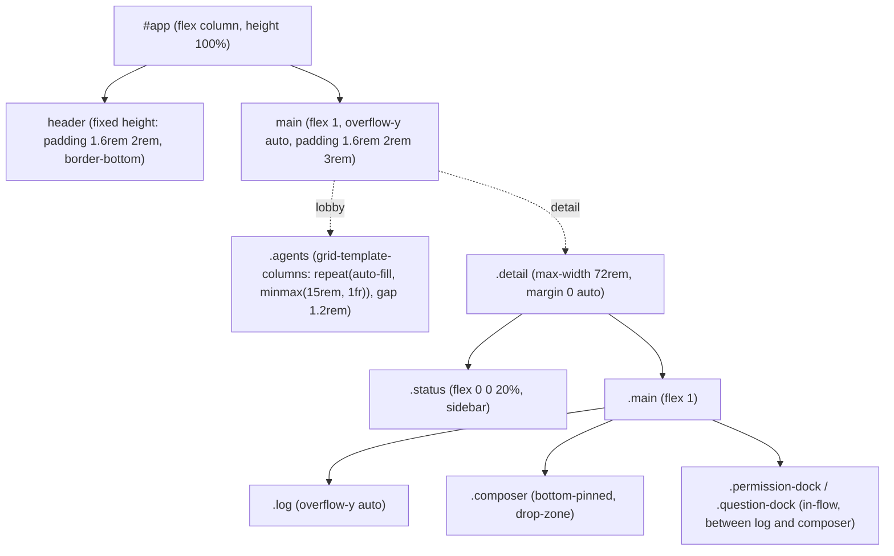

# kaoiro design principles

> This file follows the [DESIGN.md format](https://github.com/google/design.md) (alpha). The YAML frontmatter is the canonical token set; prose explains **why** each value exists and how to apply it. Read both together to understand the intent.
>
> [personas.md](personas.md) is canonical for persona portraits and expression acting. This document covers the dashboard UI only.

## Overview

**Lab control-board tone meets character chrome.** The dashboard is an operator console for monitoring multiple CLI AI agents side by side. It uses a near-monochrome foundation where **only state (the agent's “face color”) carries saturation**. As the project name “kaoiro = face color” suggests, saturation signals state rather than decorating the UI.

The base uses only deep indigo-black (`{colors.bg}`) and a body color slightly grayer than paper (`{colors.fg}`). All visual noise (borders, card boundaries, subtle text differences) stays within **three gray steps between bg and fg**. Only when an accent is needed—an agent starts thinking, requests permission, or stops with an error—does its state color appear simultaneously on the card outline, lamp, and text accent.

The UI's primary goal is to make these three facts readable at a glance:

1. **Which agent is in which state** (state palette + facial expression double encoding)
2. **Who is waiting for the operator** (blinking badge + blindspot indicator)
3. **Recent messages and tool-call history** (an internally scrolling log stream)

Every expression carries the implicit constraint that it can be disabled cleanly
with **prefers-reduced-motion**. Sway, bounce, and blink encode state rather than
atmosphere, so disabling them never removes information.

## Colors

**The color system has two layers, 5 + 9.** The upper layer has five neutrals for
the UI shell (background, card, line, foreground, dim foreground). The lower layer
is a state palette with one fixed color for each of the nine protocol states.
**Nothing outside state colors is saturated.**

### Brand Primary

kaoiro intentionally has no single brand color, but DESIGN.md consumers require a
`primary`; alias the **normal-state representative `{colors.primary}` (equal to
`state-idle`)** as primary. Treat the color worn by every card in normal operation
as “kaoiro's face when it is idle.” The state palette itself is the identity, so
there is no fixed brand color; `primary` exists only as a compatibility shim for
tools.

### Neutral Shell

- **bg (`{colors.bg}`)** — Base of every screen: deep indigo-black. Avoiding pure black and adding slight warmth lets state colors (especially warm sending/tool_running) stand out.
- **bg-card (`{colors.bg-card}`)** — Surface for cards, buttons, textareas, and docks. One step brighter than bg, lifting the structure by one level.
- **bg-elevate (`{colors.bg-elevate}`)** — Used only in the body-top radial gradient (`radial-gradient(120% 90% at 50% -20%, {colors.bg-elevate} 0%, transparent 60%)`). A faint light source at the top of the scroll shows that the screen is not an infinite plane.
- **line (`{colors.line}`)** — Reserved for 1px borders. Every outline without a state accent uses this color.
- **fg (`{colors.fg}`)** — Body text. Shifted toward 88% gray instead of pure white for comfortable long viewing.
- **fg-dim (`{colors.fg-dim}`)** — Metadata, timestamps, disabled states, and captions. Midway between fg and bg: readable but recessed.

### State Palette (canonical)

It maps one-to-one to the nine states defined by the protocol. **This mapping must
match protocol.md.**

| state | token | Hue | Appears |
|---|---|---|---|
| idle | `{colors.state-idle}` | Blue-gray | Normal lamps and borders |
| sending | `{colors.state-sending}` | Warm amber | Sending textarea border + tint |
| thinking | `{colors.state-thinking}` | Cool cyan | Thinking lamp, `code` decoration |
| tool_running | `{colors.state-tool_running}` | Bright amber | Tool-running lamp and linked flash |
| waiting_permission | `{colors.state-waiting_permission}` | Wisteria | Permission-dock outline and attention badge |
| waiting_question | `{colors.state-waiting_question}` | Pale violet-pink | AskUserQuestion dock outline and option emphasis |
| waiting_input | `{colors.state-waiting_input}` | Young-leaf green | Restore button and meter fill |
| done | `{colors.state-done}` | Mint turquoise | Completion lamp and facial cue |
| error | `{colors.state-error}` | Vermilion pink | Error badge and danger (terminate) button |
| disconnected | `{colors.state-disconnected}` | Recessed slate | Grayscaled sprite/card |

### `--tone` Variable (Component-level State Channel)

Each agent card/detail view has one CSS variable, `--tone`, dynamically switching
among the ten colors according to the current state:

```css
.card { --tone: var(--c-idle); }            /* 既定 */
.card[data-state="thinking"] { --tone: var(--c-thinking); }
/* …以下 9 状態すべて */
```

This changes card outline, lamp, glow, and title accent **simultaneously from one
switch**. Many places that do not directly reference `{colors.state-*}` in the
component spec (the YAML `components` above) use `--tone` in implementation; those
details live in prose because the DESIGN.md standard properties cannot express
them.

### Tinting via `color-mix`

When a state color is lightly applied as a background (sending textarea, danger
button hover, attention blinking pill), use `color-mix(in srgb, var(--tone) NN%,
var(--bg-card))` with 14% / 22% / 35% blends rather than a solid color. **Solid
fills are forbidden** (see Do's and Don'ts); this keeps state color as an accent,
not a surface.

## Typography

**One monospace family + tiny size gradations.** Build hierarchy with placement and
density, not type shape.

### Font stack

All text shares this stack:

```
"IBM Plex Mono", "JetBrains Mono", "Fira Code", ui-monospace,
"Cascadia Mono", monospace
```

Do **not use serif, sans-serif, or proportional fonts** (see Do's and Don'ts).
Using one monospace family visually connects CLI-agent output (snippets, paths,
JSON) with prose; it is not decoration.

### Size scale (semantic)

| Token | Value | Use |
|---|---|---|
| `h1` | 1.1rem / 600 / letter-spacing 0.35em | `kaoiro` title; open, not tight |
| `h2` | 0.95rem / 600 / letter-spacing 0.1em | Detail-view section headings and large state labels |
| `body` | 0.85rem / line-height 1.5 | Message body and log stream |
| `body-sm` | 0.75rem / line-height 1.5 | Notes and lists |
| `metadata` | 0.7rem / letter-spacing 0.1em | Timestamps, turn-boundary labels, Claude Code metadata |
| `caption` | 0.65rem | Agent chips and in-card labels |
| `micro` | 0.6rem | Badge and permission-pill text |
| `input` | 0.85rem / line-height 1.4 | textarea / input |

`letter-spacing` **opens as heading level rises** (0.1em → 0.35em); body text is
not tight. This echoes the rhythm of a printed handout: “title = sign, body =
page.”

### Weight

Use only two weights, `400` (default) and `600`. **Do not use bold = 700**; 700 is
visually too heavy inside cards with a monospace font.

Use `600` only for:

- h1 / h2 headings
- `.state` labels (state names)
- Primary buttons (`interrupt` / `back` / `blindspot` / `instruct` / `login`)

Do not tokenize this rule; usage depends on location.

## Layout

Use a one-column flex shell that fits the viewport height, with a fixed header,
internal body scrolling, and a bottom-pinned composer (#33).



### Spacing scale

| Token | Value | Main use |
|---|---|---|
| `xs` | 0.25rem | Tight adjacent elements, micro gaps |
| `sm` | 0.4rem | Compact flex and small-button padding |
| `md` | 0.6rem | Standard padding and line spacing |
| `lg` | 1rem | Between section blocks and inside cards |
| `xl` | 1.5rem | Grid-card gaps and detail two-column gap |
| `2xl` | 2rem | Header horizontal padding and major layout divisions |

Implementation is rem-based (1rem ≈ 16px) and **roughly a 4px scale**. Fine
adjustments such as 0.45rem exist, but choose values from these six steps first.

### Grid

The lobby uses an auto-fill grid, `repeat(auto-fill, minmax(15rem, 1fr))`; **viewer
sessions do not fix the column count**, so agents wrap naturally with window
width. Operator sessions fix the count to place the response timeline in a right
pane and share width between grid and pane (the pane is operator-only;
[ADR-0012](../adr/0012-response-display-and-dashboard-scope.md)). Detail views are
centered at `max-width: 72rem`, preventing stretched lines on wide screens.

See [responsive-layout.md](responsive-layout.md) for canonical per-size columns
and pane placement.

### Responsive

**Treat PC, tablet, and smartphone as equal tiers.** Every size reaches every
function and piece of information; smartphones can inspect, send instructions, and
approve permissions. Paths may differ by size, and each region has its own fallback:
the **response timeline moves to a bottom sheet at smartphone width (and low-height
override)**, while **AgentDetail status moves there at tablet width and below**.

Breakpoint values, region layout rules, sheet mechanism, and safe-area handling are
canonical in [responsive-layout.md](responsive-layout.md). Per-element paths by
size are in [responsive-reachability.md](responsive-reachability.md). The
transition history and rejected alternatives are in [ADR-0052](../adr/0052-responsive-three-tier-layout.md).

> Before 2026-08-09 this section said “mobile/narrow is not first-class, but does
> not break.” ADR-0052 withdrew that policy. Measurement showed that even before
> withdrawal the 640px grid had already collapsed to 136px, so “does not break”
> was not factual.
>
> **This section and the two referenced specs are target descriptions based on
> ADR-0052 until [phase-31](../plans/phase-31-responsive-ui.md) completes, not an
> affirmation of implementation.** They are an exception to this file's opening
> principle of affirming implementation as canonical; resynchronize with the
> implementation when phase-31 completes.

## Elevation & Depth

**Build hierarchy with glow rather than depth.** Use drop shadows only to physically
separate menu layers (slash-menu, switch-menu) from the main surface, not to make
cards feel elevated.

| Use | Value |
|---|---|
| State lamp | `0 0 6px var(--tone)` (colored glow) |
| Around face sprite (detail/card) | `0 0 18px color-mix(in srgb, var(--tone) 35%, transparent)` |
| Popover menu | `0 4px 16px rgba(0, 0, 0, 0.3)` |
| disconnected | `none` (recede with grayscale + opacity) |

Do **not use** modern-flat-material soft shadows that make cards “float.” kaoiro is
a tabletop instrument panel; **indicator glow**, not depth, signals one level up.

## Shapes

Keep corner radii restrained (0.3–0.5rem), a chamfer-like scale close to
instrument panels rather than fully square or fully round.

| Token | Value | Use |
|---|---|---|
| `sm` | 0.3rem | badge, small button, meter |
| `md` | 0.4rem | Standard button, input, textarea, menu |
| `lg` | 0.5rem | card, permission-dock, modal |
| `pill` | 9999px | (Reserved for future use; currently unused) |

> Design-specific values such as the lamp's `border-radius: 50%` and face-sprite
> eyes (`6%` radius) remain literal in components rather than tokens (the DESIGN.md
> spec limits rounded units to px/rem/em, so percentage values cannot be tokens).

## Components

Combination patterns for major components. Describe each with the five minimal
properties: `backgroundColor` / `textColor` / `border` / `padding` / `rounded`.
Places involving state colors resolve dynamically through `var(--tone)`.

### Card

- `background`: `var(--bg-card)` with a 9% `var(--tone)` radial gradient overlaid from the top
- `border`: `1px solid var(--line)`
- `box-shadow`: Glow around the face sprite (see `{Elevation}`)
- Stack face / lamp / state label / metadata rows vertically inside

### Buttons

Three variants. All sit on `bg-card`; only outline and text color vary:

- **Default** — border `var(--line)`, text `var(--fg)`, border rises to `var(--tone)` on hover
- **Danger (terminate)** — border/text `var(--c-error)`, background `color-mix(in srgb, var(--c-error) 14%, var(--bg-card))`, blend 24% on hover
- **Restore** — border/text `var(--c-waiting_input)`, background with the same 14% blend

### Inputs / Textarea

- **input**: bg `var(--bg)` (darker than the body, giving an inset feel)
- **textarea**: bg `var(--bg-card)`. During sending, border and background switch to a 22% `var(--c-tool_running)` blend, letting the input itself express state

### Permission Dock

Float above the composer with `absolute` positioning. Switch **collapsed (bottom-right
pill) ↔ expanded (wide card)** with a 0.25s eased transition. The border is always
`var(--c-waiting_permission)` and the surface is `bg-card`. Avoid covering the
conversation log (master decision history: #82 / ADR-0022 family).

### Lamp (State Indicator)

Circle, 0.55–0.7rem in diameter. Background `var(--tone)`, glow
`0 0 6px var(--tone)`. Use the same shape in card headers, detail sidebars, and
chip navigation; only size varies by context. **Keeping shape constant and
changing only size makes it immediately recognizable as a state lamp.**

### Badge (Attention)

Pill signalling “action required” for waiting_permission / error. Background is the
state color; text is inverted `var(--bg)`. Blink with `blink 1.2s ease-in-out
infinite`, dropping to 0.4 opacity at 50%. **This is the only solid fill allowed**:
edge-of-vision recognition takes priority over the subtlety of color-mix.

### Meter

Progress bar: track `var(--bg)`, fill `var(--c-waiting_input)`, border `1px solid
var(--line)`, `rounded.sm`. Animate fill width over 0.15s ease-out.

### Slash Menu / Switch Menu

Slash-command and option popovers: bg `var(--bg-card)`, border `var(--line)`, and
`box-shadow 0 4px 16px rgba(0,0,0,0.3)`. The only layer raised above the main surface.

## Motion

**Motion encodes state rather than decorating.** Disable every effect safely with
`prefers-reduced-motion: reduce`.

### Transitions

| Target | Value |
|---|---|
| border-color / color hover | `0.2s` |
| composer drop-zone (D&D feedback) | `0.12s ease-out` |
| meter fill width | `0.15s ease-out` |
| permission-dock fold/unfold, menu opacity | `0.25s ease` |

### Keyframes

| Name | Duration | Easing | Target / use |
|---|---|---|---|
| `rise` | 0.45s | ease-out | Upward fade for `.agents > li` initial display (stagger: `--stagger: index × 60ms`) |
| `dissolve` | 0.35s | ease-out | State-switch fade for face sprite / face |
| `sway` | 2.4s ∞ | ease-in-out | Thinking head sway (rotate ±4°) |
| `hop` | 1.1s ∞ | ease-in-out | Waiting-permission face bounce (translateY -0.25rem) |
| `blink` | 1.2s ∞ | ease-in-out | Attention badge / permission-pill-lamp blink |
| `flash` | 1s | ease-out | Highlight when a tool-use ↔ result pair arrives |

### Reduced Motion

```css
@media (prefers-reduced-motion: reduce) {
  *, *::before, *::after {
    animation-duration: 0.01ms !important;
    animation-iteration-count: 1 !important;
  }
}
```

Also collapse JS animations (for example `AgentDetail.expandFrom` duration 240ms)
to zero when `matchMedia('(prefers-reduced-motion: reduce)')` matches. Assume
**removing motion never removes information**: state is simultaneously encoded in
lamp color, badge display, and label text, so it remains readable without sway.

## Do's and Don'ts

### Don'ts

- **Do not use saturation outside state.** Never borrow state-palette colors for
  decorative accents, logo colors, or links; state color signals the momentary
  state and loses meaning when reused as global decoration.
- **Do not paint broad surfaces with solid state colors.** Badge is the only
  exception; textarea/dock/button accents use 14–35% `color-mix` blends.
- **Do not mix serif, sans-serif, or proportional fonts.** Use IBM Plex Mono (and
  monospace fallbacks) alone.
- **Do not use bold (font-weight 700).** Build hierarchy with 400/600, size, and
  spacing.
- **Do not overuse modern-material drop shadows.** Shadows are limited to menu
  layers (`0 4px 16px rgba(0,0,0,0.3)`) and state glow (`0 0 6px var(--tone)`).
- **Do not use large corner radii (>0.5rem).** kaoiro is an instrument panel;
  keep rounding restrained.
- **Do not use gradients as decoration.** The only allowed gradient is the body-top
  radial gradient (the faint `bg-elevate` light source).
- **Do not add decorative animation.** Every motion must encode state; motion that
  loses information when stopped by `prefers-reduced-motion` is forbidden.
- **Do not give AgentCard and AgentDetail different expression rules.** The same
  state must look the same (centralize in `expression.ts`).

### Do's

- **Receive state color through `var(--tone)`.** Do not hard-code
  `var(--c-thinking)` in components; switch once with
  `.card[data-state="thinking"] { --tone: ... }`.
- **Tint with `color-mix(in srgb, var(--tone) NN%, ...)`.** Common values are 14% /
  22% / 35%.
- **Choose `font-size` from the semantic scale** (h1/h2/body/body-sm/metadata/
  caption/micro). Pause before adding an intermediate value.
- **Choose spacing from the semantic scale** (xs/sm/md/lg/xl/2xl). Fine tuning
  (0.45rem, etc.) is acceptable when needed, but start from the six steps.
- **Double-encode state.** Show color (lamp) + shape (expression) + text (state
  label) together, readable under reduced motion and color-vision differences.
- **Desaturate disconnected.** Recede the card with
  `filter: grayscale(1) opacity(0.45)`.
- **Respect prefers-reduced-motion for every motion.** Check both CSS and JS
  (`matchMedia`) whenever adding an animation.
- **Add colors only when adding a state.** Extend the palette only when protocol.md
  gains a state, adding exactly one `--c-*` variable named `state-{name}`.

## Extending the Spec

The DESIGN.md standard component properties (`backgroundColor` / `textColor` /
`typography` / `rounded` / `padding` / `size` / `height` / `width`) cannot fully
express these three kaoiro concepts. Keep describing them in prose:

1. **Dynamic `--tone` token** — a color channel switching at runtime by state.
   Component values reference `var(--tone)`, but YAML cannot express it.
2. **`color-mix` blends** — derived values such as
   `color-mix(in srgb, var(--tone) 22%, var(--bg-card))` are not retained as tokens.
3. **Glow shadow / radial-gradient** — glow expressions such as
   `0 0 18px color-mix(...)` are outside the YAML schema.

If `motion`, `elevation`, or `state-system` sections should become formal tokens in
the future, DESIGN.md **allows arbitrary top-level keys**, so they can be added and
the file can evolve without changing the specification.

### Expected Lint Warnings

Running `npx @google/design.md lint` always produces the warnings below. They are
intentional and may be ignored:

- **`orphaned-tokens` (state colors consumed only through `--tone`, plus
  `bg-elevate` and `line`)** — the state palette switches dynamically through the
  `--tone` CSS variable instead of direct component-property references.
  `bg-elevate` serves the body-top radial gradient and `line` serves border-color;
  both are outside the standard DESIGN.md `components` properties
  (`backgroundColor` / `textColor` / `typography` / `rounded` / `padding` / `size` /
  `height` / `width`).
- **Future `missing-typography` and similar warnings** — when caused by an
  expression outside the spec, document the rationale in prose and retain the
  warning as expected. **Always fix errors; retain warnings only when intentional**
  (the operating policy of this file).

## References

- Implementation: [dashboard/src/app.css](../../dashboard/src/app.css), [App.svelte](../../dashboard/src/App.svelte), [AgentCard.svelte](../../dashboard/src/lib/AgentCard.svelte), [AgentDetail.svelte](../../dashboard/src/lib/AgentDetail.svelte), [LaunchDialog.svelte](../../dashboard/src/lib/LaunchDialog.svelte)
- Dimensions and layout switching: [responsive-layout.md](responsive-layout.md) (breakpoints / region rules / sheet mechanism)
- Per-size reachability: [responsive-reachability.md](responsive-reachability.md) (element paths / scroll owners)
- State definitions: [protocol.md](protocol.md) (one-to-one state palette)
- Expressions and persona portraits: [personas.md](personas.md)
- Format specification: [DESIGN.md (Google, alpha)](https://github.com/google/design.md)
