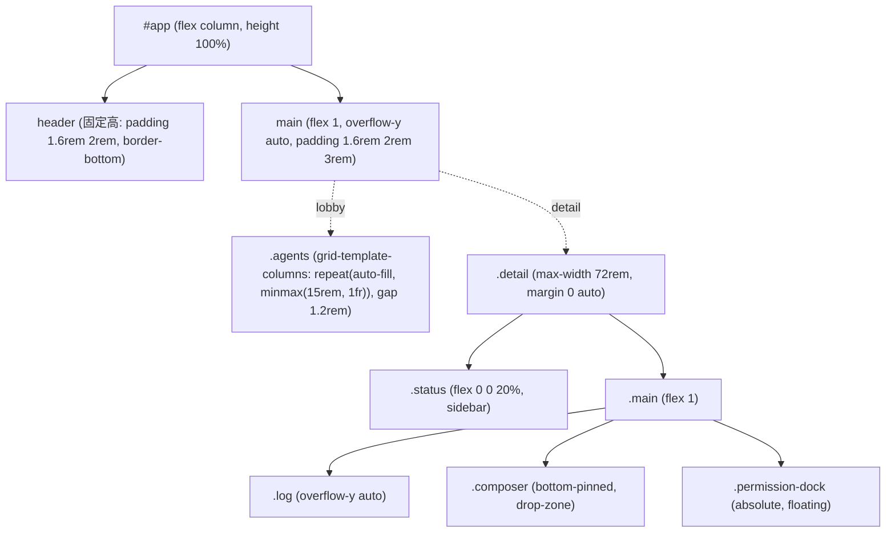

# kaoiro デザイン方針

> このファイルは [DESIGN.md フォーマット](https://github.com/google/design.md) (alpha) に準拠する。YAML フロントマターは正規トークン、本文は **なぜ** その値が存在し、どう適用するかを述べる散文。トークンと散文の両方を読み合わせて初めて意図が伝わる。
>
> ペルソナ立ち絵・表情演技の方針は [personas.md](personas.md) が canonical。本ドキュメントはダッシュボード UI 側のみ扱う。

## Overview

**Lab control-board tone meets character chrome.** ダッシュボードは複数の CLI AI エージェントを横並びで監視するためのオペレータコンソールであり、近モノクロームの基盤の上に **state (顔色) だけが彩度を持つ** よう設計されている。プロジェクト名 "kaoiro = 顔色" の通り、彩度は状態を読ませる信号であって装飾ではない。

ベースは深い藍墨 (`{colors.bg}`) と紙より少しグレーの本文色 (`{colors.fg}`) のみで構成され、すべての視覚的ノイズ (ボーダー・カード境界・微差テキスト) は **bg と fg の間の 3 段階のグレー** に閉じ込められる。アクセントが必要な瞬間 — エージェントが思考に入った、許可を求めている、エラーで止まった — そのときだけ、対応する state 色がカードの輪郭・ランプ・テキストアクセントに同時に立ち上がる。

UI の主目的は次の 3 つを 1 グランスで読ませることである:

1. **どのエージェントが今何の状態か** (state palette + 顔表情の二重符号化)
2. **誰が今オペレータの応答を待っているか** (badge 点滅 + blindspot 表示)
3. **直近の発話・ツール呼び出し履歴** (内部スクロールするログストリーム)

すべての表現は **prefers-reduced-motion で破綻なく無効化できる** ことを暗黙の制約として持つ。揺らし・バウンス・点滅は雰囲気ではなく状態符号化であり、停止しても情報を欠かない設計になっている。

## Colors

**カラーシステムは 5 + 9 の二層構造。** 上層は UI シェル (背景・カード・線・前景・控え目前景) を構成する 5 つのニュートラル。下層は protocol で定義された 9 状態のそれぞれに 1 色ずつ固定された state palette。**state 色以外は決して彩度を持たない**。

### Brand Primary

kaoiro は単一のブランド色を持たない設計だが、DESIGN.md spec の consumer が `primary` を要求するため、**平常時の代表色 `{colors.primary}` (= `state-idle` と同値)** を primary としてエイリアスする。すべてのエージェントカードが平常運転時に纏うこの色を「kaoiro が止まっている時の顔色」として扱う。固定ブランド色を立てない理由は state palette 自体がアイデンティティだからであり、`primary` は飽くまでツール用の互換シムとして存在する。

### Neutral Shell

- **bg (`{colors.bg}`)** — 全画面の基底。深い藍墨。純黒を避けて少し色温度を持たせることで、上に乗る state 色 (特に warm 系の sending/tool_running) を浮かせる
- **bg-card (`{colors.bg-card}`)** — カード・ボタン・テキストエリア・dock の面色。bg より一段明るく、構造を 1 ステップだけ持ち上げる
- **bg-elevate (`{colors.bg-elevate}`)** — body 上部の radial-gradient (`radial-gradient(120% 90% at 50% -20%, {colors.bg-elevate} 0%, transparent 60%)`) でのみ使用。スクロール最上段に薄い光源を置き、画面が無限平面ではないことを示す
- **line (`{colors.line}`)** — 1px ボーダー専用。state アクセントが入らない時の輪郭はすべてこの色
- **fg (`{colors.fg}`)** — 本文。純白を避けて 88% グレー寄せ。長時間凝視に耐える落ち着き
- **fg-dim (`{colors.fg-dim}`)** — メタデータ・タイムスタンプ・無効状態・キャプション。fg と bg の中間で「読めるが沈む」階調

### State Palette (canonical)

protocol で定義された 9 状態に 1:1 対応する。**この対応は protocol.md と一致しなければならない**。

| state | token | 色相 | 出現箇所 |
|---|---|---|---|
| idle | `{colors.state-idle}` | 青みグレー | 平常時のランプ・ボーダー |
| sending | `{colors.state-sending}` | 暖アンバー | 送信中の textarea border + tint |
| thinking | `{colors.state-thinking}` | 涼やかシアン | 思考中ランプ、`code` 装飾 |
| tool_running | `{colors.state-tool_running}` | 明るい琥珀 | ツール実行中ランプ・tool linked flash |
| waiting_permission | `{colors.state-waiting_permission}` | 藤紫 | 許可ドック輪郭・attention badge |
| waiting_question | `{colors.state-waiting_question}` | 淡い菫桃 | AskUserQuestion ドック輪郭・選択肢の強調 |
| waiting_input | `{colors.state-waiting_input}` | 若芽グリーン | restore ボタン、meter fill |
| done | `{colors.state-done}` | ミントターコイズ | 完了時ランプ・顔のサイン |
| error | `{colors.state-error}` | 朱桃 | エラー badge・danger ボタン (terminate) |
| disconnected | `{colors.state-disconnected}` | 沈んだスレート | grayscale 化されたスプライト/カード |

### `--tone` Variable (Component-level State Channel)

各エージェントカード/詳細は `--tone` という CSS 変数を 1 本持ち、現在の state に応じて 10 色のうちのいずれかに動的に切り替わる:

```css
.card { --tone: var(--c-idle); }            /* 既定 */
.card[data-state="thinking"] { --tone: var(--c-thinking); }
/* …以下 9 状態すべて */
```

これによりカード輪郭・ランプ・グロー・タイトルアクセントが **1 箇所の切替で全要素同時** に変わる。コンポーネント仕様 (上の YAML `components`) で `{colors.state-*}` を直接参照していない箇所の多くは、実装上はこの `--tone` を経由しており、DESIGN.md スキーマの標準プロパティでは表現しきれない部分が散文側に寄っている。

### Tinting via `color-mix`

state 色を背景として薄く敷く場面 (sending 時の textarea 背景、danger ボタンの hover、attention 点滅ピル) では、純色ではなく `color-mix(in srgb, var(--tone) NN%, var(--bg-card))` で 14% / 22% / 35% を主流ブレンドとして使う。**純色のベタ塗りは禁則** (Do's and Don'ts 参照)。これは state 色の登場を「面ではなくアクセント」に閉じ込めるためのルールである。

## Typography

**単一の等幅フォント + 微小サイズ階調**。形ではなく場所と密度で階層を作る。

### フォントスタック

すべてのテキストが下記スタックを共有する:

```
"IBM Plex Mono", "JetBrains Mono", "Fira Code", ui-monospace,
"Cascadia Mono", monospace
```

セリフ / サンセリフ / プロポーショナルは **使わない** (Do's and Don'ts)。等幅 1 種で押し通すのは、CLI エージェントの出力 (コード片・パス・JSON) と地の文の境目を視覚的に滑らかに繋ぐためであり、装飾ではない。

### サイズスケール (semantic)

| Token | 値 | 用途 |
|---|---|---|
| `h1` | 1.1rem / 600 / letter-spacing 0.35em | `kaoiro` タイトル。詰めない、開く |
| `h2` | 0.95rem / 600 / letter-spacing 0.1em | 詳細ビューのセクション見出し、状態大ラベル |
| `body` | 0.85rem / line-height 1.5 | メッセージ本文、log ストリーム |
| `body-sm` | 0.75rem / line-height 1.5 | 補足、リスト |
| `metadata` | 0.7rem / letter-spacing 0.1em | タイムスタンプ、turn boundary label、Claude Code メタ |
| `caption` | 0.65rem | エージェントチップ、in-card ラベル |
| `micro` | 0.6rem | badge、permission pill 内テキスト |
| `input` | 0.85rem / line-height 1.4 | textarea / input |

`letter-spacing` は **見出しレベルが上がるほど開く** (0.1em → 0.35em)。本文は詰めない。これは「タイトル＝看板、本文＝紙面」という、印刷ハンドアウト的なリズム感に近い。

### ウェイト

`400` (既定) と `600` の 2 段階のみ。**Bold = 700 は使わない** (等幅フォントで 700 を入れるとカードの中で視覚的に重くなりすぎる)。

`600` の使用は次に限る:

- h1 / h2 の見出し
- `.state` ラベル (state 名表示)
- 主要ボタン (`interrupt` / `back` / `blindspot` / `instruct` / `login`)

トークン化はしない (使用条件が場所依存)。

## Layout

ビューポート高にフィットする 1 カラム flex シェルで、ヘッダ固定 + 本体内部スクロール + composer ボトム固定 (#33) を実現する。



### Spacing スケール

| Token | 値 | 主な用途 |
|---|---|---|
| `xs` | 0.25rem | 隣接要素のタイト並び、micro gap |
| `sm` | 0.4rem | コンパクト flex、小ボタン padding |
| `md` | 0.6rem | 標準 padding、行間 |
| `lg` | 1rem | section ブロック間、card 内 |
| `xl` | 1.5rem | grid card 間、detail 2-column gap |
| `2xl` | 2rem | header 横 padding、layout 大区切り |

実装は rem ベース (1rem ≒ 16px) の **概ね 4px 系**。0.45rem 等の微調整はあるが、思考時の値選びは上記 6 段階を基準にする。

### グリッド

ロビーは `repeat(auto-fill, minmax(15rem, 1fr))` の auto-fill グリッド。**列数を固定しない** — エージェント数が増えてもウィンドウ幅に合わせて自然に折り返る。詳細ビューは `max-width: 72rem` で中央寄せされ、画面が広くても 1 行が間延びしない。

### Responsive

`@media (max-width: 640px)` で詳細ビューが column へ折れ、`.log` が `max-height: 60vh` に制限される。モバイル/狭幅は first-class ではないが、破綻はしない。

## Elevation & Depth

**深さよりも発光で階層を作る**。ドロップシャドウは「上に乗っている感」を出すためではなく、メニュー層 (slash-menu, switch-menu) を本体と物理的に切り離すためにのみ使う。

| 用途 | 値 |
|---|---|
| state ランプ | `0 0 6px var(--tone)` (色付きグロー) |
| 顔スプライト周囲 (詳細・カード) | `0 0 18px color-mix(in srgb, var(--tone) 35%, transparent)` |
| ポップオーバーメニュー | `0 4px 16px rgba(0, 0, 0, 0.3)` |
| disconnected | `none` (グレースケール + 透明度で後退させる) |

「カードがふわっと浮いている」ような modern flat material 風のソフトシャドウは **使わない**。kaoiro は卓上の計器盤であり、深度ではなく **インジケータの発光** が一階層上の合図になる。

## Shapes

角丸は控えめ (0.3-0.5rem)。完全な直角でも完全な丸でもない、計器類に近い「面取り」のスケール。

| Token | 値 | 用途 |
|---|---|---|
| `sm` | 0.3rem | badge、small button、meter |
| `md` | 0.4rem | 標準 button、input、textarea、menu |
| `lg` | 0.5rem | card、permission-dock、modal |
| `pill` | 9999px | (将来用予約。現状は使用なし) |

> lamp の `border-radius: 50%` や顔スプライトの目 (`6%` 角丸) など意匠固有の値は token 化せず、コンポーネント内 literal で保持する (DESIGN.md spec が rounded の単位を px/rem/em に限るため `%` ベースの値はトークン化できない)。

## Components

主要コンポーネントの組合せパターン。`backgroundColor` / `textColor` / `border` / `padding` / `rounded` の 5 項目を最小単位として記述する。state 色を含む箇所は `var(--tone)` 経由で動的に解決される。

### Card

- `background`: `var(--bg-card)` + radial-gradient で `var(--tone)` 9% を上端から被せる
- `border`: `1px solid var(--line)`
- `box-shadow`: 顔スプライト周囲のグロー (`{Elevation}` 参照)
- 内側に face / lamp / state ラベル / メタ列を縦に積む

### Buttons

3 つの variant。すべて `bg-card` の上に乗り、輪郭とテキスト色だけが分岐する:

- **既定** — border `var(--line)`、text `var(--fg)`、hover で border が `var(--tone)` に上がる
- **danger (terminate)** — border `var(--c-error)`、text `var(--c-error)`、bg `color-mix(in srgb, var(--c-error) 14%, var(--bg-card))`、hover で blend を 24% へ
- **restore** — border `var(--c-waiting_input)`、text 同色、bg 同様に 14% blend

### Inputs / Textarea

- **input**: bg `var(--bg)` (本体より暗い = 凹み感)
- **textarea**: bg `var(--bg-card)`。送信中は border と背景が `var(--c-tool_running)` 22% blend に切り替わり、状態を入力欄自身が表現する

### Permission Dock

`absolute` 配置で composer の上に浮く。**collapsed (右下 pill) ↔ expanded (横長カード)** を 0.25s eased transition で切り替える。border は常に `var(--c-waiting_permission)`、本体は `bg-card`。会話ログを遮らないことが第一義 (これはマスタの判断履歴: #82 / ADR-0022 系)。

### Lamp (State Indicator)

直径 0.55-0.7rem の円。背景 `var(--tone)`、グロー `0 0 6px var(--tone)`。カードのヘッダ・詳細のサイドバー・チップナビすべてで同形を使い、サイズだけが文脈で変わる。**形を変えずに大きさだけ変えることで一目で「状態ランプだ」と読める**。

### Badge (Attention)

waiting_permission / error 時に「要対応」を伝えるピル。bg = state 色そのもの、text = `var(--bg)` (反転)。`blink 1.2s ease-in-out infinite` で 50% opacity 0.4 まで落ちる点滅。**ここだけは純色のベタ塗りを許す** — 視野の隅でも視認させる必要があるため、color-mix の上品さよりベタの強さを優先する例外。

### Meter

進捗バー。track `var(--bg)`、fill `var(--c-waiting_input)`、border `1px solid var(--line)`、`rounded.sm`。fill width のアニメは 0.15s ease-out。

### Slash Menu / Switch Menu

スラッシュコマンド・選択肢ポップオーバー。bg `var(--bg-card)`、border `var(--line)`、`box-shadow 0 4px 16px rgba(0,0,0,0.3)`。本体より一段浮かせる唯一の場所。

## Motion

**Motion は装飾ではなく状態符号化**。すべて `prefers-reduced-motion: reduce` で安全に無効化できる。

### Transition

| 対象 | 値 |
|---|---|
| border-color / color hover | `0.2s` |
| composer drop-zone (D&D feedback) | `0.12s ease-out` |
| meter fill width | `0.15s ease-out` |
| permission-dock fold/unfold、menu opacity | `0.25s ease` |

### Keyframes

| Name | Duration | Easing | 対象 / 用途 |
|---|---|---|---|
| `rise` | 0.45s | ease-out | `.agents > li` 初期表示時の上昇フェード (stagger: `--stagger: index × 60ms`) |
| `dissolve` | 0.35s | ease-out | 顔スプライト / face の state 切替フェード |
| `sway` | 2.4s ∞ | ease-in-out | thinking の頭部揺らし (rotate ±4°) |
| `hop` | 1.1s ∞ | ease-in-out | waiting_permission の顔バウンス (translateY -0.25rem) |
| `blink` | 1.2s ∞ | ease-in-out | attention badge / permission-pill-lamp 点滅 |
| `flash` | 1s | ease-out | tool use ↔ result ペア跳躍時のハイライト |

### Reduced Motion

```css
@media (prefers-reduced-motion: reduce) {
  *, *::before, *::after {
    animation-duration: 0.01ms !important;
    animation-iteration-count: 1 !important;
  }
}
```

加えて、JS 側のアニメーション (`AgentDetail.expandFrom` の duration 240ms など) も `matchMedia('(prefers-reduced-motion: reduce)')` を見て 0 に折り畳む。**動きが消えても情報は欠けない** ことを設計の前提に置く (state はランプ色・badge 表示・ラベル文字で同時符号化されているため、揺れがなくても読める)。

## Do's and Don'ts

### Don'ts

- **彩度を state 以外に使わない。** 装飾アクセント、ロゴカラー、リンクカラーとして state palette の色を「持ち出す」のは禁則。state 色はあくまで「今その瞬間の状態シグナル」であり、グローバル装飾に流用すると意味が薄まる
- **state 色を純色のベタで広い面に塗らない。** 例外は badge のみ。textarea/dock/button の state アクセントは `color-mix` で 14-35% blend を通す
- **セリフ・サンセリフ・プロポーショナルフォントを混ぜない。** IBM Plex Mono (とフォールバック等幅) 単独で押し通す
- **Bold (font-weight 700) を使わない。** 階層は 400/600 とサイズ・スペーシングで作る
- **drop shadow を modern material 風に多用しない。** 影は menu 層 (`0 4px 16px rgba(0,0,0,0.3)`) と state グロー (`0 0 6px var(--tone)`) のみ
- **角丸を大きく取らない (>0.5rem)。** kaoiro は計器盤であり、丸みは控えめが基本
- **グラデーションを装飾に使わない。** 唯一許されるグラデは body 上端の radial-gradient (`bg-elevate` の薄い光源) のみ
- **アニメーションを装飾として加えない。** 動きはすべて状態符号化に紐付ける。`prefers-reduced-motion` で停止して情報が欠ける動きは禁則
- **AgentCard と AgentDetail で顔表情のルールを違える。** 同じ state は同じ表情で見える必要がある (`expression.ts` に集約)

### Do's

- **state 色は `var(--tone)` 経由で受ける。** コンポーネント内に `var(--c-thinking)` を直書きせず、`.card[data-state="thinking"] { --tone: ... }` で 1 箇所だけ切り替える
- **`color-mix(in srgb, var(--tone) NN%, ...)` で薄敷きする。** 主流は 14% / 22% / 35%
- **font-size は semantic スケール (h1/h2/body/body-sm/metadata/caption/micro) から選ぶ。** 新しい中間値を増やすときは追加可否を一度立ち止まる
- **spacing も semantic スケール (xs/sm/md/lg/xl/2xl) から選ぶ。** 微調整 (0.45rem 等) は必要なら許容するが、まずは 6 段階から始める
- **状態を二重符号化する。** 色 (ランプ) + 形 (顔表情) + テキスト (state ラベル) を同時に出す。reduced-motion でも色覚特性でも読める設計
- **disconnected は彩度を抜く。** `filter: grayscale(1) opacity(0.45)` でカード自体を視覚的に後退させる
- **prefers-reduced-motion を全 motion で尊重する。** CSS でも JS (matchMedia) でも、新規 animation を入れるたびに確認する
- **新しい色は state を増やす時にだけ追加する。** protocol.md で状態が増えた場合のみ palette を拡張し、そのとき必ず `state-{name}` の命名で `--c-*` 変数を 1 本だけ追加する

## Extending the Spec

DESIGN.md の標準 components プロパティ (`backgroundColor` / `textColor` / `typography` / `rounded` / `padding` / `size` / `height` / `width`) では kaoiro の以下 3 つは表現しきれない。これらは prose 側で記述する慣習を守ること:

1. **`--tone` 動的トークン** — state に応じて runtime に切り替わる色チャンネル。components の各値で `var(--tone)` を参照しているが YAML には書けない
2. **`color-mix` blend 表現** — `color-mix(in srgb, var(--tone) 22%, var(--bg-card))` のような派生値は token として保持しない
3. **glow shadow / radial-gradient** — `0 0 18px color-mix(...)` 等の発光表現は YAML スキーマ範囲外

将来 `motion`, `elevation`, `state-system` セクションを正式にトークン化したくなった場合、DESIGN.md は **任意トップレベルキーを許容する** ので追加可能。仕様変更を伴わずに本ファイルで進化できる。

### Expected Lint Warnings

`npx @google/design.md lint` を当てると下記の warning が常に発生するが、いずれも本設計の意図通りであり無視してよい:

- **`orphaned-tokens` (state 色のうち `--tone` 経由のみで消費されるもの・`bg-elevate`・`line`)** — state palette はコンポーネントプロパティで直接参照する代わりに、`--tone` CSS 変数経由で動的に切り替わる。`bg-elevate` は body 上端の radial-gradient 用、`line` は border-color 用で、いずれも DESIGN.md `components` スキーマの標準プロパティ (`backgroundColor` / `textColor` / `typography` / `rounded` / `padding` / `size` / `height` / `width`) では表現範囲外
- **将来 `missing-typography` 等が出る場合** — 同様に、spec 範囲外の表現が原因なら prose 側で根拠を明記し、warning を expected として残してよい。**error は必ず解消する。warning は意図と一致するなら残す**、というのが本ファイルの運用方針

## References

- 実装本体: [dashboard/src/app.css](../../dashboard/src/app.css), [App.svelte](../../dashboard/src/App.svelte), [AgentCard.svelte](../../dashboard/src/lib/AgentCard.svelte), [AgentDetail.svelte](../../dashboard/src/lib/AgentDetail.svelte), [LaunchDialog.svelte](../../dashboard/src/lib/LaunchDialog.svelte)
- 状態定義: [protocol.md](protocol.md) (state palette と 1:1 対応)
- 顔表情・ペルソナ立ち絵: [personas.md](personas.md)
- フォーマット仕様: [DESIGN.md (Google, alpha)](https://github.com/google/design.md)
