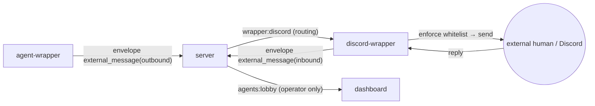

<!-- markdownlint-disable MD033 -->

# External human messaging protocol

## Purpose

Defines the protocol surface that lets AI agents (office staff) send messages to
and receive replies from **external humans** who are operator contacts, through
Discord. It is a **superset** of
[protocol-inter-agent](protocol-inter-agent.md) (the counterpart is an external
human, not an agent) and reuses its routing, observation, and quota mechanisms.

The phased implementation plan is
[phase-9-external-human-messaging](../plans/phase-9-external-human-messaging.md),
and the decision context is [ADR-0028](../adr/0028-external-human-messaging.md).

## Definition

### Core principle — bidirectional transport / one-way authority

Transport is bidirectional (agent ↔ external human), but **authority is
one-way**. An external human's utterance **never drives** agent action, whether
destructive, non-destructive, or investigative (it is untrusted input). External
input remains notification material for the operator; decisions to act belong
only to the operator and content generated by the agent itself.

### Topology — discord-wrapper

The server preserves the principle of remaining a broker
([architecture](architecture.md)); a dedicated **discord-wrapper** retains the
Discord connection (an external-channel adapter entity, following the
multi-entity precedent of [ADR-0017](../adr/0017-wrapper-multientity-packages.md)
and the non-Claude-entity precedent of
[ADR-0019](../adr/0019-subagent-workflow-entity-and-task-envelope.md)). The bot
token remains within the discord-wrapper process and is not passed to the server
or agent-wrapper. The runner supervises it
([ADR-0023](../adr/0023-host-runner-architecture.md)).

### envelope.type: "external_message"

This is a reserved extension of the common outer frame in
[protocol.md](protocol.md) (`version` remains unchanged,
[ADR-0010](../adr/0010-protocol-precisification.md)). `agent_id` identifies the
relevant agent (the outbound sender or inbound recipient). `payload` is below.

| direction | Path | Main payload fields |
|---|---|---|
| `outbound` | agent-wrapper → server → discord-wrapper | `channel`("discord") / `to` (**logical contact ID**) / `conversation_id` / `turn_number` / `body` / `meta {done, propose_next?}` / `agent {agent_id, persona_name}` |
| `inbound` | discord-wrapper → server → dashboard (operator only) | `channel` / `from {contact_id, display}` / `to_agent` (agent_id) / `conversation_id` / `turn_number` / `body` (**original verbatim**) |

- `to` exposes only a logical contact ID to agents, **never a raw Discord ID**.
  The discord-wrapper resolves it to its raw value and enforces the whitelist.
- The discord-wrapper's filter adds inbound `ext.interpretation` (Tier B; below).
  It **never overwrites** the original `body`.

### Contact model (discord-wrapper configuration)

The whitelist is managed by the operator in the discord-wrapper's **configuration
file**. A GUI is future work
([external-human-contact-management-ux](../open-questions/external-human-contact-management-ux.md)).

| Field | Meaning |
|---|---|
| `id` | Logical contact ID (the destination specified by an agent) |
| `display` | Display name (may be disclosed to agents) |
| `delivery` | Per contact: `dm` (a direct message to the user) or `channel` (a post to a specified channel) |
| `discord_target` | Raw Discord user/channel snowflake (**inside the wrapper only**; not disclosed to agents) |

### Outbound flow

1. An agent calls the `send_to_human(to, body, ...)` tool (the wrapper's SDK MCP,
   analogous to `send_to_agent`). `list_contacts` and `whoami` are companion
   tools for destination resolution.
2. The wrapper requests **per-use operator approval** through the existing
   `permission_broker` path. The dialog presents the **destination and complete
   body** ([ADR-0022](../adr/0022-pending-permission-authoritative-source.md)).
3. Approval sends `external_message(outbound)`. The discord-wrapper validates
   and resolves `to` through the whitelist, then sends it to Discord. It tells
   the recipient that it is **from AI/kaoiro** (no impersonation of the operator).

### Inbound flow — Tier A / Tier B

When the discord-wrapper receives a reply:

- **Tier A (phase-0; default and fail-soft fallback)**: without an LLM, sends the
  external human a limited reply from a **fixed template** and relays the
  original verbatim to the operator. There is no injection surface.
- **Tier B (phase-1; after the spike gate)**: a **zero-tool intake LLM** (Haiku,
  text-to-text transformation only; no tool calls) adds a summary to
  `ext.interpretation` (the first use of plugin-model's filter mechanism and
  issue #18's first concrete implementation), and a responder generates a
  limited reply. It is **not injected** into the working agent's live session.
  Final adoption is decided by
  [external-human-inbound-llm-tier](../open-questions/external-human-inbound-llm-tier.md).

In both cases, inbound traffic is **operator-only** (completely removed for
viewers, [ADR-0021](../adr/0021-role-information-disclosure-policy.md)).

### Safeguard (quota)

Each conversation has a **three-turn cap** (a transport exchange: agent contact
→ external reply → agent close). The server's existing `ConversationStates`
enforces it mechanically, shared with inter-agent messaging. Conversation
contents are **ephemeral** (not persisted by the server); only contact-list
configuration is persistent.

## Constraints

- **MUST**: An external human's utterance never drives agent action (one-way
  authority). External input is not executed as an instruction.
- **MUST**: The server remains a broker and does not interpret payload semantics.
  Discord-specific processing and the bot token remain inside the
  discord-wrapper.
- **MUST**: Outbound destinations are limited to the operator-created whitelist.
  The discord-wrapper enforces it. Agents receive no raw Discord ID or PII (only
  logical IDs and display names).
- **MUST**: Every outbound message receives `permission_broker` approval after
  presenting its destination and complete body.
- **MUST**: `external_message` (both directions) is operator-only and completely
  removed for viewers.
- **MUST**: External humans are told that the message is from AI/kaoiro.
- **MUST (Tier B)**: The intake LLM is zero-tool (text-to-text only), in a
  separate context from and not injected into the working agent's live session.
  The original `body` remains verbatim and receives an added
  `ext.interpretation` (never overwritten or removed), so the operator always
  receives the original. Replies to an external human remain fixed to the same
  person who sent the message (they do not move to a new destination).
- **MUST**: The server (`ConversationStates`) mechanically enforces three turns
  per conversation.
- **MUST**: The untrusted-external path is **separate** in types and tools from
  the trusted-agent (inter-agent) path (`external_message` / `send_to_human`).

## Open Questions

- [external-human-inbound-llm-tier](../open-questions/external-human-inbound-llm-tier.md)
- [external-human-inbound-loss](../open-questions/external-human-inbound-loss.md)
- [external-human-agent-consumes-input](../open-questions/external-human-agent-consumes-input.md)
- [external-human-recv-permission-model](../open-questions/external-human-recv-permission-model.md)
- [external-human-contact-management-ux](../open-questions/external-human-contact-management-ux.md)

## See Also

- Related specs: [protocol](protocol.md) (common envelope foundation and the
  `external_message` type extension),
  [protocol-inter-agent](protocol-inter-agent.md) (the source superset and
  routing/quota mechanisms), [plugin-model](plugin-model.md) (Tier B filter
  insertion point), and [threat-model](threat-model.md) (operator-only delivery
  and untrusted input)
- Related plans:
  [phase-9-external-human-messaging](../plans/phase-9-external-human-messaging.md)
- ADRs: [0028](../adr/0028-external-human-messaging.md) (decision for this
  feature),
  [0010](../adr/0010-protocol-precisification.md),
  [0017](../adr/0017-wrapper-multientity-packages.md),
  [0021](../adr/0021-role-information-disclosure-policy.md),
  [0022](../adr/0022-pending-permission-authoritative-source.md),
  [0023](../adr/0023-host-runner-architecture.md)
- kaoiro issue #18 (message filter = the first concrete Tier B implementation)
