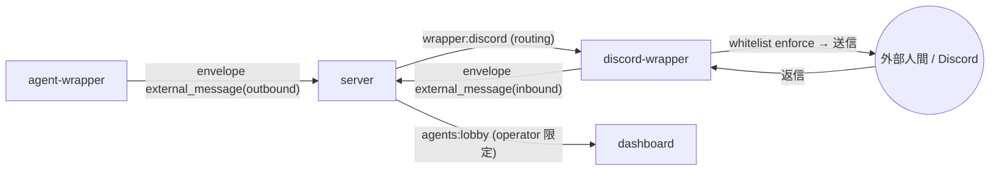

<!-- markdownlint-disable MD033 -->

# 外部人間メッセージング・プロトコル

## Purpose

AI エージェント(オフィスのスタッフ)が、operator の連絡先である**外部の
人間**へ Discord 経由でメッセージを投げ、返信も受け取れるようにする
protocol surface を定める。[protocol-inter-agent](protocol-inter-agent.md)
の **superset**(相手が agent でなく外部人間)であり、既存 inter-agent の
routing / observation / quota 機構を再利用する。

段階的実装計画は
[phase-9-external-human-messaging](../plans/phase-9-external-human-messaging.md)、
決定背景は [ADR-0028](../adr/0028-external-human-messaging.md)。

## Definition

### 中核原則 — 双方向 transport / 一方向 authority

transport は双方向(agent ↔ 外部人間)だが、**authority は一方向**。
外部人間の発言は agent の行動を破壊的/非破壊的/調査問わず**一切駆動
しない**(untrusted input)。外部入力は operator への通知 material に留まり、
実行判断は operator と、agent 自身が生成した内容にのみ帰属する。

### トポロジ — discord-wrapper

server は broker に徹する原則([architecture](architecture.md))を堅持し、
Discord 接続は専用 **discord-wrapper**(外部チャネル adapter entity、
[ADR-0017](../adr/0017-wrapper-multientity-packages.md) の multientity /
[ADR-0019](../adr/0019-subagent-workflow-entity-and-task-envelope.md) の
非 Claude entity の前例)が保持する。bot token は discord-wrapper プロセスに
閉じ、server にも agent-wrapper にも渡さない。runner が監督する
([ADR-0023](../adr/0023-host-runner-architecture.md))。

### envelope.type: "external_message"

[protocol.md](protocol.md) 共通外枠を継承する予約追補(`version` 据え置き、
[ADR-0010](../adr/0010-protocol-precisification.md))。`agent_id` は当該
agent(outbound の送信元 / inbound の宛先 agent)。`payload` は下記。

| direction | 経路 | payload 主フィールド |
|---|---|---|
| `outbound` | agent-wrapper → server → discord-wrapper | `channel`("discord")/ `to`(**論理 contact id**)/ `conversation_id` / `turn_number` / `body` / `meta {done, propose_next?}` / `agent {agent_id, persona_name}` |
| `inbound` | discord-wrapper → server → dashboard(operator 限定) | `channel` / `from {contact_id, display}` / `to_agent`(agent_id)/ `conversation_id` / `turn_number` / `body`(**原文 verbatim**) |

- `to` は agent には**生の Discord ID を出さず**論理 contact id のみ。raw
  への解決と whitelist enforce は discord-wrapper が行う。
- inbound の `ext.interpretation`(Tier B)は discord-wrapper の
  フィルタが付与する(後述)。`body`(原文)は**上書きしない**。

### contact モデル(discord-wrapper の config)

operator が discord-wrapper の**config ファイル**で管理する
whitelist。GUI 化は将来
([external-human-contact-management-ux](../open-questions/external-human-contact-management-ux.md))。

| フィールド | 意味 |
|---|---|
| `id` | 論理 contact id(agent が指定する宛先) |
| `display` | 表示名(agent に開示可) |
| `delivery` | `dm`(相手ユーザへ私信)or `channel`(指定 channel へ投稿)、contact ごと |
| `discord_target` | 生の Discord user/channel snowflake(**wrapper 内のみ**、agent 非開示) |

### outbound フロー

1. agent が `send_to_human(to, body, ...)` ツール(wrapper の SDK MCP、
   `send_to_agent` と同型)を呼ぶ。宛先解決のため `list_contacts` /
   `whoami` を companion tool として提供。
2. wrapper は既存 `permission_broker` 経路で **operator に都度承認**を求める。
   dialog には**宛先 + 本文全文**を提示する
   ([ADR-0022](../adr/0022-pending-permission-authoritative-source.md))。
3. approve で `external_message(outbound)` を送信。discord-wrapper が
   `to` を whitelist で検証・解決し Discord へ送る。相手には **AI/kaoiro
   発**であることを明示する(operator 個人へのなりすまし禁止)。

### inbound フロー — Tier A / Tier B

discord-wrapper が返信を受信したら:

- **Tier A(phase-0、既定・fail-soft 縮退先)**: LLM を使わず**固定
  テンプレ**で外部人間へ限定返信し、原文を operator へ verbatim 中継する。
  injection 面ゼロ。
- **Tier B(phase-1、spike gate 後)**: **zero-tool の受付 LLM**
  (Haiku、text→text 変換のみ・tool_call 不可)が要約を `ext.interpretation`
  に付与(plugin-model のフィルタ機構の初適用、issue #18 の初実体)、
  responder が限定返信を生成する。working agent の live session には
  **注入しない**。最終採用は
  [external-human-inbound-llm-tier](../open-questions/external-human-inbound-llm-tier.md)。

いずれも inbound は **operator 限定配信**(viewer 完全除去、
[ADR-0021](../adr/0021-role-information-disclosure-policy.md))。

### 安全弁(quota)

1 会話 **3 turn 上限**(transport 往復上限: agent コンタクト → 外部返信 →
agent 締め)。server の既存 `ConversationStates` で機械強制(inter-agent と
共通)。会話内容は **ephemeral**(server 非永続)、contact 一覧 config のみ永続。

## Constraints

- MUST: 外部人間の発言は agent の行動を一切駆動しない(一方向 authority)。
  外部入力は指示として実行しない。
- MUST: server は payload 意味論を解釈せず broker に徹する。Discord 固有
  処理・bot token は discord-wrapper に閉じる。
- MUST: outbound 宛先は operator 作成 whitelist 内のみ。enforce は
  discord-wrapper。agent には生 Discord ID / PII を出さない(論理 id +
  表示名まで)。
- MUST: outbound は `permission_broker` で宛先 + 本文全文を提示して都度承認。
- MUST: `external_message`(両 direction)は operator 限定配信。viewer 完全除去。
- MUST: 外部人間へは AI/kaoiro 発であることを明示する。
- MUST(Tier B): 受付 LLM は zero-tool(text→text のみ)。working agent の
  live session とは別 context・非注入。原文 `body` は verbatim 保持し
  `ext.interpretation` を追加(上書き/除去禁止)、operator は常に原文を得る。
  外部人間への返信は発信してきた同一相手に固定(新規宛先に振れない)。
- MUST: 1 会話 3 turn を server(`ConversationStates`)で機械強制。
- MUST: untrusted-external 経路は trusted-agent(inter-agent)経路と型・
  ツールを**分離**する(`external_message` / `send_to_human`)。

## Open Questions

- [external-human-inbound-llm-tier](../open-questions/external-human-inbound-llm-tier.md)
- [external-human-inbound-loss](../open-questions/external-human-inbound-loss.md)
- [external-human-agent-consumes-input](../open-questions/external-human-agent-consumes-input.md)
- [external-human-recv-permission-model](../open-questions/external-human-recv-permission-model.md)
- [external-human-contact-management-ux](../open-questions/external-human-contact-management-ux.md)

## See Also

- 関連 specs: [protocol](protocol.md)(envelope 共通基盤・`external_message`
  type 追補)、[protocol-inter-agent](protocol-inter-agent.md)(superset 元・
  routing/quota 機構)、[plugin-model](plugin-model.md)(Tier B フィルタの
  挿入点)、[threat-model](threat-model.md)(operator 限定配信・untrusted 入力)
- 関連 plans:
  [phase-9-external-human-messaging](../plans/phase-9-external-human-messaging.md)
- ADRs: [0028](../adr/0028-external-human-messaging.md)(本機能の決定)、
  [0010](../adr/0010-protocol-precisification.md),
  [0017](../adr/0017-wrapper-multientity-packages.md),
  [0021](../adr/0021-role-information-disclosure-policy.md),
  [0022](../adr/0022-pending-permission-authoritative-source.md),
  [0023](../adr/0023-host-runner-architecture.md)
- kaoiro issue #18(メッセージフィルタ = Tier B の初実体)
