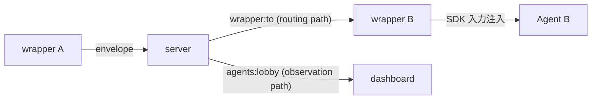

<!-- markdownlint-disable MD033 -->

# エージェント間メッセージング・プロトコル

## Purpose

複数 AI エージェントが kaoiro サーバを介して直接メッセージをやり取り
できるようにするための protocol surface を定める。kaoiro issue #17
本実装の機械的仕様であり、段階的実装計画は
[phase-8-inter-agent-messaging](../plans/phase-8-inter-agent-messaging.md)、
設計判断の背景は kaoiro issue #87 と #17 issuecomment-1359 を参照。

[protocol](protocol.md) の予約追補(同一 `version`)として envelope
`type: "inter_agent_message"` を新設する([ADR-0010](../adr/0010-protocol-precisification.md))。

## Definition

### 全体像

エージェント A の wrapper が `send_to_agent` ツールを呼ぶと、wrapper
は通常の `envelope` イベントで `type: "inter_agent_message"` の
envelope を server へ送る。server は次の 2 系統に分岐する:



- **routing path**: server は `payload.to` を読み、`wrapper:<to>`
  channel に envelope を push する。受信した wrapper は SDK の次
  ターン入力として注入する
- **observation path**: server は通常の `agents:lobby` broadcast にも
  同じ envelope を載せる(operator 限定配信、後述)。dashboard は
  inter-agent message を A・B 両方の log 欄に表示できる

server は payload の意味論(kind / payload テキスト / meta)を解釈
しない。`to` フィールドのみをルーティング目的で参照する(agent 非依存
の原則を保つ最小の構造的アクセス)。

### envelope.type: "inter_agent_message"

[protocol.md](protocol.md) の envelope 共通外枠
(`version`/`agent_id`/`session_id?`/`persona`/`ts`/`seq`/`type`/`state`/`payload`/`ext`)
はそのまま継承。`agent_id` は送信側エージェント、`state` は当該 wrapper
の現在状態(通常 `tool_running`)を据え置く。

新規追加するのは `type` 値と `payload` schema のみ。

| フィールド | 意味 |
|---|---|
| `type` | `"inter_agent_message"` |
| `payload` | 下記 "Inner envelope" 参照 |

### Inner envelope(`payload` schema)

```json
{
  "to": "lab-pc-1.claude-b",
  "conversation_id": "cnv-7f3a1c",
  "turn_number": 3,
  "kind": "propose",
  "body": "ベンチマーク結果を踏まえ、CSV 出力を採用するのはどうか",
  "meta": {
    "done": false,
    "propose_next": "B の同意があれば実装に入る",
    "confidence": 0.7
  },
  "owner": {
    "kind": "user",
    "id": "operator"
  }
}
```

| フィールド | 必須 | 意味 |
|---|---|---|
| `to` | MUST | 宛先 `agent_id`。`[A-Za-z0-9._-]` 制約は protocol 全体と同じ |
| `conversation_id` | MUST | 同一対話を紐付ける識別子。発起側 wrapper が採番(セッション内一意、UUIDv4 ベース) |
| `turn_number` | MUST | 1 起点の正整数。同一 conversation 内で送信ごとに +1。`(conversation_id, turn_number)` で全順序 |
| `kind` | MUST | 下記 9 種 enum |
| `body` | MUST | メッセージ本文(自由テキスト)。意味論はエージェントに任せる |
| `meta.done` | MUST | bool。当該エージェントが対話の終了を提案する場合 true。**両 owner 側エージェントから true で conversation 完了** |
| `meta.propose_next` | MUST | string。次に何を期待するか(空文字可) |
| `meta.confidence` | optional | 0.0〜1.0 |
| `meta.reject_reason` | `kind=reject` 時 MUST | string。提案を拒否する具体的理由 |
| `error.code` | optional | 相手が応答不能になったことを示すエラー種別コード(open string)。詳細は「応答不能エラーの通知」節 |
| `error.message` | `error` 有時 MUST | string。人間可読の理由(秘匿情報マスク済・切り詰め済) |
| `owner.kind` | MUST | `"user"` または `"agent"` |
| `owner.id` | MUST | owner の識別子。user の場合は接続トークンに紐づく user_id、agent の場合は `agent_id` |

### kind enum(9 種)

意味論の出典・採否判断は kaoiro リポジトリ #17 issuecomment-1359
および vault `(private vault note)`。

| kind | 役割 | 典型ペア |
|---|---|---|
| `request` | 作業依頼 | → `response` |
| `response` | 依頼への結果報告 | `request` ← |
| `query` | 問い(Yes/No・値・意見) | → `inform` |
| `inform` | 情報共有・意見表明・query への回答 | `query` ← または独立 |
| `propose` | 合意候補を出す | → `accept` または `reject` |
| `accept` | propose への賛成 | `propose` ← |
| `reject` | propose への反対(`meta.reject_reason` 必須) | `propose` ← |
| `escalate-to-user` | 人間判断要請(tie-breaker) | → user |
| `done` | 終了申告 | 両 owner-side で揃って完了 |

カバーケース:

- 依頼: `request` → `response`
- 相談: `query` → `inform` のラリー
- 議論: `propose` → `accept` / `reject` → 反対側が `propose`(対案)の
  ラリー → 最終 `propose` に両 owner-side が `accept` + `done`
- 結論不能: 任意の時点で `escalate-to-user`、または下記ハード制限
  超過で自動打ち切り

### conversation owner と tie-breaker

`owner` は対話を起動した主体。Phase 1 では常に user(operator が
明示指示で起動するため)。Phase 3 でエージェント autonomously 起動を
許可した場合のみ `owner.kind: "agent"` が現れる。

- 行き詰まり時の最終判断は owner に集約する
- `owner.kind: "user"` の場合 → server は `escalate-to-user` を受け
  たら dashboard に介入ダイアログを出す(AskUserQuestion 系の構造化
  ダイアログを流用。実体は [ADR-0027](../adr/0027-askuserquestion-envelope.md)
  の `question_request` / `waiting_question`)
- `owner.kind: "agent"` の場合 → owner エージェントへ
  `escalate-to-user` の代わりに `escalate-to-owner` ルーティング
  (Phase 3 で確定、本 spec は Phase 1〜2 のみ機械強制)
- 暴走時の停止権限も owner に帰属。owner は conversation 全体を
  キャンセルできる(`cancel` イベント、Phase 2 以降)

### ハード制限(config + 機械強制)

server は conversation 単位で以下の制限を機械的に監視し、超過時に
自動打ち切りする。打ち切り時は当該 conversation の参加 wrapper
全てに合成 envelope(`kind: "escalate-to-user"`、
`body: "<理由>"`、`meta.done: true`)を broadcast し、両 wrapper
は SDK 入力として注入する。

| config キー | 単位 | 既定値(Phase 1) | 用途 |
|---|---|---|---|
| `max_turns` | turn(=メッセージ件数) | 20 | conversation 1 件の対話ターン総数 |
| `max_tokens` | token | 100_000 | 全 body の累積トークン(server 側で粗く近似、`length(body)/3` 切り上げ) |
| `max_wallclock` | ms | 600_000(10 分) | conversation_id 発生から経過時間 |
| `max_concurrent_agents` | agent 数 | 2 | 同一 conversation_id に参加可能な agent 数(Phase 1 は 2 固定、Phase 3 で 3 以上検討) |

config は kaoiro server 設定で agent 単位 / global の二段。global を
agent 単位で上書き可。

### 観測経路(dashboard 表示)

server は inter_agent_message envelope を `agents:lobby` にも
broadcast する。ただし `log` / `result` と同様に **operator 限定配信**
([ADR-0021](../adr/0021-role-information-disclosure-policy.md))。

dashboard は受信時、`agent_id`(送信側)と `payload.to`(受信側)の
両 agent の log 欄に inter-agent message を表示する。表示形式は
クライアント実装で確定するが、最小限以下を満たす:

- 送信側エージェントの log: `→ to <to>: <body>(kind, conversation_id 抜粋)`
- 受信側エージェントの log: `← from <agent_id>: <body>(kind, conversation_id 抜粋)`
- conversation_id でグルーピング可能な視覚要素(同一対話を辿れる)

`log` envelope とは別 type なので、既存の log フィルタ・既読管理と
は独立して扱う。

### Channels イベント増分

inter_agent_message 本体は既存 `envelope` イベント上で運ばれるが、
コンパニオン機能のため **`directory_request`** を追補する。

#### peer directory の情報境界 (#102 / #160)

phase-8 では宛先名の解決だけを目的に directory entry を
`agent_id / persona / state` へ絞っていた。phase-15 で engine 間の state
envelope schema が確定したため、#102 ではこの最小性判断を
**「名前解決に加え、peer の実行特性を見て委譲先を選べる read-only
directory」**へ引き直し、`engine / model / effort` を公開した。

issue #160 (phase-27) はこれをさらに **「peer の稼働状況を見て委譲の
可否まで判断できる directory」** へ広げる。エージェントが operator の介在なしに
「context が逼迫した peer に重い委任をしない」「利用上限に張り付いた peer
を避ける」「対話中の peer に割り込まない」「長時間無活動の peer を報告
する」を判断できることが要件。

##### 開示 field 一覧

| field | 型 | 意味 | 省略される条件 |
|---|---|---|---|
| `agent_id` | string | 宛先識別子 | MUST(常に存在) |
| `persona` | `{id, name, sprite_set}` | 表示名解決用 | MUST |
| `state` | string | 現在状態 | MUST |
| `engine` / `model` / `effort` | string | 実行特性(#102) | non-empty string でないとき |
| `context` | `{used_tokens, max_tokens, used_percentage}` | context 使用量 | 下記 capability gate 不成立、未報告、shape 不正、切断済み |
| `session_started_at` | ISO8601 (UTC) | **server が観測した**現セッション開始時刻 | server が開始を観測しておらず `SessionStarts` からも復元できないとき |
| `turns` | 非負整数 | 現セッションの応答往復数 | server が当該セッションの開始を観測していないとき(fallback で開始時刻だけ復元した場合も省略) |
| `last_activity_at` | ISO8601 (UTC) | server が envelope を最後に受理した時刻 | まだ 1 通も受理していないとき |
| `conversation` | `{active, peers[]}` | active な IA 会話の有無と相手 | **省略しない**(下記) |
| `rate_limits` | `{<window>: {status?, utilization?, resets_at?}}` | 最終 turn 時点の利用上限 snapshot | 未報告、全 window が projection で drop、切断済み |

`session_started_at` / `last_activity_at` は **server 側の時刻** である。
wrapper が実測した値ではなく、envelope の `ts`(wrapper ホストの時計)
とも別軸。ホスト跨ぎの時計ズレを判断材料に混ぜないための規約。

##### `context` の capability gate

`ext.context` の存在では判定しない。
`ext.session_capabilities.supports_context_usage == true` かつ
`used_tokens` / `max_tokens` / `used_percentage` がすべて数値のときだけ
投影する。capability が absent(旧 wrapper)や explicit `false`(Codex)
では **field ごと省略** し、`null` も推定値も出さない
([ADR-0040](../adr/0040-context-usage-capability.md) D1 の 3-state 判定を
dashboard と揃える)。capability field 自体は peer に開示しない。

##### `ext` からの projection

`ext` は wrapper が自由に拡張できる open schema なので、**raw を素通し
しない**。canonical key だけを写した新しい map を組み立てる
([ADR-0021](../adr/0021-role-information-disclosure-policy.md) F6-2 の
allow-list を nested 階層まで適用)。

| 対象 | 許可 key | 検証 |
|---|---|---|
| `context` | `used_tokens` / `max_tokens` / `used_percentage` のみ | すべて有限数。1 つでも欠ける・不正なら `context` ごと省略 |
| `rate_limits` の window 値 | `status` / `utilization` / `resets_at` のみ(3 つとも optional) | `status` = string かつ UTF-8 64 bytes 以下、`utilization` = 有限数、`resets_at` = 非負の safe integer |
| `rate_limits` の window key | open string | UTF-8 32 bytes 以下、charset `[A-Za-z0-9_-]` |
| `rate_limits` の window 数 | — | 8 件以下 |

- **key 自体が無い**ときだけ absent として許容する。key があって値が
  invalid(`null` を含む)なら **当該 window ごと drop** する。値を 1 つ
  だけ捨てて残りを返すと、不完全な窓が完全な窓と同じ形で読めてしまう。
- projection 後に値が 1 つも残らない **empty window は drop**。
- window 数が 8 を超えるときは、**validation と empty drop を通過した
  valid window 集合** に対して canonical(`five_hour` → `seven_day`)を
  無条件優先し、残り枠を lexical 昇順で埋める。canonical であっても
  validation を通らない window は保持しない。
- **malformed は top-level field 単位で drop** し、valid な sibling は
  残す(`context` が壊れていても `rate_limits` は載る)。
- 数値は換算しない。projection は「写す key を絞る」操作であって値の
  加工ではない。`utilization` の 0..1 range 検査は入れない
  ([#164](https://gitea.example.invalid/sakurai.yuta/kaoiro/issues/164) の
  実データ確認後に判断)。
- drop のログは window 単位で無制限に warn せず、agent / request 単位で
  集約する(`list_agents` は auto-allow 経路であり、log amplification を
  作らないため)。
- **同じ規約・同じ上限値を wrapper 側の narrow にも適用する**。片側だけ
  緩いと server が閉じた素通しを client が開け直すことになる。

##### `conversation` は常に載せる

他の field と違い engine 非依存で server が必ず判定できるため、会話が
無くても `{"active": false, "peers": []}` を返す。旧 server では field
ごと absent になるので、消費側は **absent(不明)と `active: false`
(会話なし)を区別できる**。`conversation_id` は開示しない
(ADR-0021 F6-5)。

##### 継続除外

この変更は ext 全体の peer 公開ではない。`cwd`、permission / sandbox、
`session_id`、model catalog、pending state、resume snapshot / drift、
`model_source / effort_source`、`session_capabilities`、`cost` は引き続き
directory から除外する。除外集合の正本は ADR-0021 F6-4。

| event (方向) | 形 | server の振る舞い |
|---|---|---|
| `envelope` (W→S, type=inter_agent_message) | 上記 Inner envelope | (a) `payload.to` で指定された `wrapper:<to>` channel に push、(b) `agents:lobby` に broadcast(operator 限定)、(c) 該当 conversation の turn count / token count / wallclock を更新 |
| `envelope` 合成 (S→W) | ハード制限超過時 | 両 wrapper の `wrapper:<id>` + `agents:lobby` へ push |
| `envelope` 合成 (S→W) | wrapper 切断時 | 当該 wrapper が参加中の各 conversation の他参加者へ `kind=inform` + `error.code=disconnected` を push(「応答不能エラーの通知」節) |
| `directory_request` (W→S) | `{}`(空 payload) | wrapper-A は **自分以外** の peer entry リストを `{:ok, %{agents: [...]}}` 返却で受け取る。entry の field と省略規則は上記「peer directory の情報境界」。list_agents 用 (後述) |

未知 `to` / 自己 routing / participants 不一致時のエラー (`unknown_agent` /
`self_routing` / `participants_mismatch`) は `envelope` の reply で返す。

### 承認フロー(permission_broker 統合)

wrapper-A が `send_to_agent` ツールを呼ぶ際、wrapper は既存の
`canUseTool` 経路で operator に承認を求める([ADR-0022](../adr/0022-pending-permission-authoritative-source.md))。

- ツール名: `send_to_agent`
- `input` には宛先 `to` / kind / body 抜粋 / `conversation_id` を
  含める(operator が判断するための材料)
- dialog UX は Phase 1 では既存 permission dialog を流用、Phase 2 で
  専用 UI に磨く
- deny した場合、tool 呼び出しは失敗。wrapper-A は SDK に「送信
  拒否」のエラーを返し、エージェントは別の応答を試みる
- 自動承認の仕組み(per conversation_id whitelist)は Phase 2 以降

### 受信側(wrapper-B)の挙動

wrapper-B は `wrapper:<id>` channel で `envelope`(type=inter_agent_message、
agent_id ≠ self)を受信したら、当該 envelope を SDK 次ターンの入力
として注入する。注入形は:

```text
[from <agent_id>] <kind>: <body>

(meta: done=<done>, propose_next=<propose_next>, conversation_id=<conversation_id>, turn_number=<turn_number>)
```

エージェントが返信する場合は `send_to_agent` ツールで応答する。
返信しない場合は通常の応答(`result` envelope)を返し、conversation
は自然消滅(server 側 wallclock タイムアウトで自動 done を付与)。

#### 同期 reply 待ち (`send_to_agent.wait_for_response`)

通常の受信は上記どおり次 SDK turn への注入である。現在の SDK turn
の中で peer の応答を必要とする場合だけ、送信側は
`wait_for_response: true` を指定できる。wrapper は送信後、同じ
`conversation_id` の次 inbound envelope を待ち、受信 envelope 全文
（`body` / `meta` を含む）をその **同じ tool result** で返す。

- 既定は `false` であり、既存の fire-and-forget / 次turn注入の挙動は不変。
- `timeout_ms` は省略時 300,000ms、正の整数、最大 300,000ms。timeout時は
  送信済み ack と `reply_pending=true` を返し、送信を取り消さない。
- waiter が受け取った envelope は次 SDK turn へ重複注入しない。timeout後に
  遅れて到着した envelope は通常どおり次turn注入する。
- 同一 `conversation_id` では waiter を1件だけ許可する。重複した同期waitは
  送信前に tool error とする。

### 応答不能エラーの通知 (`payload.error`)

相手エージェントが利用制限・コンテキスト超過・接続断などで応答不能に
なったとき、その事実を **送信元エージェント自身** に返す
([issue #131](https://gitea.example.invalid/sakurai.yuta/kaoiro/issues/131))。
送信元が「再送しても無駄か / 時間を置くべきか / operator に
エスカレートすべきか」を自ら判断できることが要件であり、単なる無応答
タイムアウト (`reply_pending`) と区別できなければならない。

新 envelope type も kind enum 拡張も行わない。判別は `payload.error` の
有無のみで行う。

```json
{
  "to": "lab-pc-1.claude-a",
  "conversation_id": "cnv-7f3a1c",
  "turn_number": 0,
  "kind": "inform",
  "body": "peer lab-pc-1.claude-b is unreachable: rate limit reached",
  "error": {
    "code": "rate_limit",
    "message": "peer lab-pc-1.claude-b is unreachable: rate limit reached"
  },
  "meta": { "done": false, "propose_next": "" },
  "owner": { "kind": "user", "id": "system" }
}
```

- `kind` は `"inform"` を流用する(9 種 enum 不変)。`error` を知らない
  旧受信側は通常の inform として劣化表示する
- `body` にも同じ人間可読理由を重複記載する(旧クライアント表示互換)
- `meta.done` は false 固定(Phase 1。会話を打ち切るかの判断は送信元
  エージェントに委ねる)
- `error.message` に秘匿情報(トークン等)を載せない。マスクと切り詰めは
  発火元 wrapper の責務

#### エラー種別コード(初期セット)

`code` は open string。将来の engine 固有コード追加を阻害しないため
enum にはしない。未知の `code` を受けた側は `api_error` と同等に扱う。

| code | 意味 | 送信元エージェントの推奨行動 |
|---|---|---|
| `rate_limit` | 利用制限・クォータ超過 | 即時再送は無駄。時間を置くか operator にエスカレート |
| `context_overflow` | コンテキスト長超過 | 同内容の再送は無駄。要約・分割するか operator にエスカレート |
| `api_error` | engine / API 側エラー。分類不能時の縮退先 | 一度の再送は可。続くならエスカレート |
| `timeout` | peer 側処理のタイムアウト | 時間を置いて再送 |
| `interrupted` | peer の turn が中断された | operator 都合の可能性。再送前に状況確認 |
| `disconnected` | peer wrapper の接続断 | 復帰まで再送は無駄。エスカレート |

#### 発火元(2 系統)

| 発火元 | 契機 | 経路 |
|---|---|---|
| peer 側 wrapper | SDK turn が is_error 終了し、その turn に未返信の inter-agent 注入があった | 当該 conversation の送信元へ ServerLink 直送(モデル経由でないため broker 承認なし)。通常の `inter_agent_message` として既存ルーティングに乗る |
| server | wrapper channel の切断 (terminate) | `code=disconnected` を server が合成し、当該 wrapper が参加中の各 conversation の他参加者へ push |

engine 差は共通 classifier の中で吸収する(engine-agnostic、
[ADR-0032](../adr/0032-codex-adapter.md) F5)。分類不能な事象は
`api_error` に縮退する。engine 由来の reason / detail 文字列は
**分類のキーワード検査にのみ内部利用**し、`error.message` / `body`
には常に code ごとの固定テンプレート文言を用いる(生の例外文字列を
peer の LLM コンテキストへ露出させない。秘匿情報マスクの MUST は
この固定テンプレート化で担保する)。

#### server 合成 (`disconnected`) の規則

- 合成 envelope の `agent_id` は `"server"`、`turn_number` は 0、`owner`
  は `{kind: "user", id: "system"}`。ハード制限超過時の合成 envelope と
  同形(recipient ごとに `payload.to` をその受信者にする)
- 宛先は当該 wrapper が参加中の各 conversation の **他参加者全員**
  (Phase 1 は `max_concurrent_agents` = 2 なので実質は送信元のみ)
- `wrapper:<recipient>` と `agents:lobby` の双方へ push する(合成
  escalate と同じ観測経路)
- 合成 notice は turn / token カウントに **加算しない**。server 由来の
  メタ通知であって対話ターンではないため(合成 escalate と同じ扱い)
- conversation entry は削除しない。wrapper が復帰すれば同じ
  `conversation_id` で継続でき、放置分は既存の wallclock GC が回収する
- 再接続後に遅れて走った stale な terminate では合成しない(server が
  `disconnected` 状態を実際に採用した場合のみ発火する)
- 同一 conversation への通知は 1 回きり。当該 agent がその conversation で
  再び発言するまで再通知しない。entry は切断で消えず turn/token にも
  加算しないため、この抑止がないと crash loop / フラッピングする wrapper が
  peer のターンを消費し続ける
- 1 回の切断で通知する conversation 数には上限を設ける(実装既定 50)。
  通知 1 件につき `wrapper:<peer>` と `agents:lobby` の 2 broadcast が
  走るため、多数の conversation を抱えた wrapper の切断が fan-out を
  増幅させないようにする。打ち切った分は warning ログに残す(黙って
  落とさない)

#### 受信側の扱い

- `wait_for_response: true` の待受中に `error` 付き envelope を受けた
  場合、wrapper はそれを reply として同じ tool result で返す。送信元は
  `error.code` の有無で `reply_pending` と区別する
- 非同期(次 turn 注入)の場合、注入テキストに `error.code` を含める
  (SHOULD)。既存の注入形の meta 行へ `error=<code>` を併記する形を
  推奨する。送信元エージェントが code から行動を選べることが要件

### コンパニオンツール (wrapper の SDK MCP)

wrapper は `send_to_agent` (broker 経由) のほか、以下を **既定 allowedTools
に含めて auto-allow** で提供する。 read-only / 副作用なしで、 model が宛先
解決や自己同定に使うため都度承認の対象外:

| Tool (full name) | 用途 | 経路 |
|---|---|---|
| `mcp__kaoiro__list_agents` | 同接続中の他 agent の一覧を取得。宛先解決 (id / persona name / state) に加え、委譲先選定のための実行特性 (engine / model / effort) と稼働状況 (context / session_started_at / turns / last_activity_at / conversation / rate_limits) を返す | wrapper → server の `directory_request` を呼び、reply の `agents` を narrow して返す |
| `mcp__kaoiro__whoami` | 「server から見た自分」 = agent_id / persona / 現 state / engine / 実効 model・effort と source / permission / network_access / legacy permission_mode・fast_mode / session_id / cwd を返す | wrapper のローカル `EffectiveStatusSnapshot` を読むのみ。server round-trip なし |

`whoami` の実効設定は state envelope と別に組み立てず、各 host が持つ共通
`EffectiveStatusSnapshot` から投影する。`model` / `effort` / source と
`network_access` は既知の場合だけ返す。`permission` は engine-neutral な
`{sandbox, approval}`、`permission_mode` / `fast_mode` は Claude 互換 field
として取得済みの場合だけ併記する。SDK / rollout がまだ値を報告していない field
は stale 値や推測値で埋めず、key 自体を省略する。

#### 宛先解決の指針

`send_to_agent.to` は **agent_id を必須** とする (charset `[A-Za-z0-9._-]`)。
operator が `@あお` のような名前で指示しても、 model は send_to_agent に
直接渡さず先に `list_agents` で resolve すること:

1. `list_agents` で persona.name == "あお" の entry を集める
2. 1 件 → その agent_id を `send_to_agent.to` に
3. 複数 → operator に 「どちらの『あお』に送りますか? (候補: …)」と質問し、 候補から指示を得てから送信
4. 0 件 → 「該当ペルソナが見当たりません」と operator に伝える

固有名で共同作業を指示された相手は既存 kaoiro peer である。上の解決を
省いて内部サブエージェント(engine 固有の spawn 機構)を同名で代替
生成してはならない([ADR-0038](../adr/0038-codex-internal-subagents-toggle.md))。
内部サブエージェントは明示指示時に限り **役割名**(persona 名ではない)で
作る。また `send_to_agent` で実際に送信し応答を受けるまで、共同作業・
共同調査が済んだかのように報告しない。

候補対応 (3) は inject text / TOOL_DESCRIPTION で明示する。

### envelope.type の予約と version

[protocol.md](protocol.md) の type 一覧に `inter_agent_message` を
**確定追補**として追加する(`version` 据え置き、
[ADR-0010](../adr/0010-protocol-precisification.md) /
[ADR-0015](../adr/0015-protocol-version-stamping.md))。

| type | 状態 | payload |
|---|---|---|
| `inter_agent_message` | **確定**(本 spec) | 上記 "Inner envelope" 参照 |

## Constraints

- MUST: server は payload の意味論(kind / body / meta)を解釈しない。
  `to` フィールドのみをルーティング目的で参照する
  - carve-out (issue #131): `payload.error` については **構造のみ**
    検証する(`code` は非空 string、`message` は string)。code の値や
    message の内容は解釈しない。加えて wrapper 切断時に限り server が
    `code=disconnected` の envelope を合成する。いずれも意味論の解釈
    ではなく、可観測性のための最小限の構造的関与に留める
- MUST: `payload.error` を持つ envelope の `kind` も 9 種 enum の
  いずれか。応答不能エラーの通知は `inform` を使う
- MUST: server 合成の error notice は turn / token カウントに加算しない
- MUST: `inter_agent_message` envelope は **operator 限定配信**
  ([ADR-0021](../adr/0021-role-information-disclosure-policy.md))。
  viewer には完全除去する
- MUST: `send_to_agent` ツール呼び出しは Phase 1 では permission_broker
  の都度承認を経由する。autonomous な承認スキップは Phase 3 まで導入
  しない
- MUST: server は config のハード制限(`max_turns` / `max_tokens` /
  `max_wallclock` / `max_concurrent_agents`)を機械的に強制する
- MUST: `meta.done` は両 owner-side エージェントから true で
  conversation が完了。片側だけでは done としない
- MUST: `payload.to == agent_id` の自己ルーティングは server が拒否
- MUST: `kind: "reject"` の envelope は `meta.reject_reason` を空でない
  string で持つ
- MUST: `send_to_agent.to` は agent_id のみ受理 (charset 制約あり)。
  persona 名による解決は wrapper の `list_agents` ツールが担い、
  ambiguous 時は operator 確認を経由する
- MUST: peer directory は **allow-list**。`directory_entry` が明示列挙
  した field だけを agent 間に出し、`ext` を丸ごと流し込まない。
  allow-list は nested 階層まで適用し、canonical key だけを写した新しい
  map を組み立てる([ADR-0021](../adr/0021-role-information-disclosure-policy.md)
  F6-2、上記「`ext` からの projection」)
- MUST: `context` は
  `ext.session_capabilities.supports_context_usage == true` のときだけ
  投影する。capability が absent / explicit false では field ごと省略し、
  `null` も推定値も出さない([ADR-0040](../adr/0040-context-usage-capability.md))
- MUST: `rate_limits` の window は、key が無いときだけ absent として
  許容し、key があって値が invalid(`null` 含む)なら **当該 window ごと
  drop** する。値が 1 つも残らない window も drop する
- MUST: server と wrapper は **同一の projection 規約・同一の上限値** を
  適用する。片側だけ緩いと server が閉じた素通しを client が開け直す
- MUST: `conversation` は会話が無くても
  `{"active": false, "peers": []}` を返す(省略しない)。
  `conversation_id` は開示しない
- MUST: `session_started_at` / `last_activity_at` は **server が観測した
  時刻** であり、wrapper の実測値でも envelope の `ts` でもない
- MUST: `list_agents` の消費側(呼び出した agent)は、`rate_limits` の
  `resets_at`(Unix 秒)を現在時刻と比較し、**過去であればその window は
  窓が明けたものとみなして `utilization` / `status` を信用しない**。
  snapshot は peer の最終 turn 時点の値であり idle 中は更新されないため。
  ただしこれは **deterministic に強制される仕組みではない** — server も
  wrapper も判定を代行せず、model の解釈に委ねる best-effort な規約で
  ある。dashboard 側の同等対応は
  [#164](https://gitea.example.invalid/sakurai.yuta/kaoiro/issues/164) の
  scope
- MUST: 省略された field は **「不明」であって 0 でも「問題なし」でも
  ない**。`turns` の省略は 0 往復ではなく、`context` の省略は余裕が
  あることでも、`rate_limits` の省略は無制限でもない
- SHOULD: `conversation_id` は UUIDv4 ベースで採番、衝突回避と
  グルーピング容易性を両立する
- SHOULD: `body` は protocol 全体の他フィールド同様 wrapper 側で
  16 KB を超える場合切り詰める(`truncated: true` を `meta` に付与)

## Open Questions

- conversation の永続化方針(server 再起動越えで conversation_id を
  保持するか、Phase 4 / ADR-0014 範疇との接続)— Phase 2 で確定
- メッセージフィルタ(kaoiro issue #18)の挿入位置 — Phase 2 で
  検討開始
- `owner.kind: "agent"` 起動時の自動エスカレーション規則 —
  Phase 3 / kaoiro issue #87 待ち

## See Also

- 関連 specs: [protocol](protocol.md)(envelope 共通基盤)、
  [subagent-tasks](subagent-tasks.md)(類似の予約 type パターン)、
  [plugin-model](plugin-model.md)(将来のフィルタ挿入位置)、
  [threat-model](threat-model.md)(operator 限定配信の根拠)
- 関連 plans: [phase-8-inter-agent-messaging](../plans/phase-8-inter-agent-messaging.md)、
  [phase-27-list-agents-metadata](../plans/phase-27-list-agents-metadata.md)
  (peer directory の稼働状況 6 field)
- ADRs: [0010 protocol-precisification](../adr/0010-protocol-precisification.md),
  [0015 protocol-version-stamping](../adr/0015-protocol-version-stamping.md),
  [0021 role-information-disclosure-policy](../adr/0021-role-information-disclosure-policy.md)
  (F6 = agent 間開示の allow-list),
  [0022 pending-permission-authoritative-source](../adr/0022-pending-permission-authoritative-source.md),
  [0040 context-usage-capability](../adr/0040-context-usage-capability.md)
  (`context` の capability gate)
- kaoiro issue #17(本実装の起点)、#18(メッセージフィルタ)、
  #87(調査の傘 issue)、#131(応答不能エラーの通知)、
  #160(peer directory の稼働状況)、#164(rate_limits 表示不具合)
