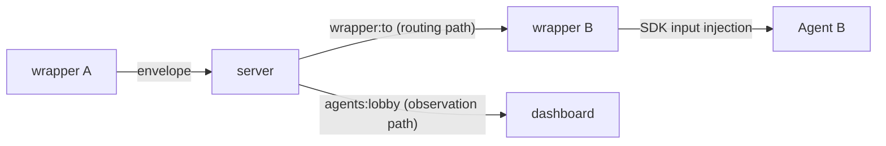
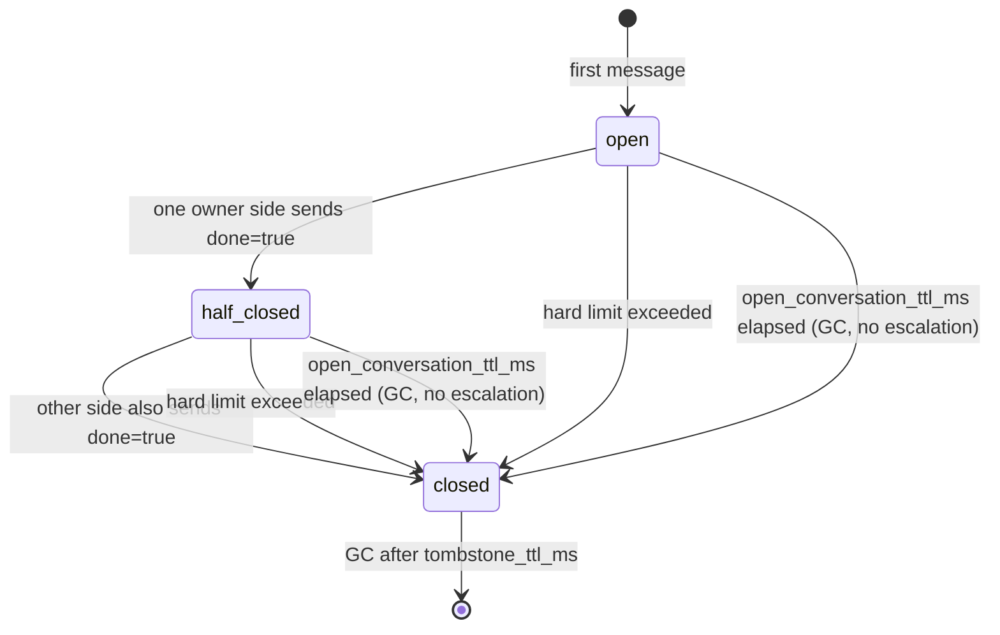

<!-- markdownlint-disable MD033 -->

# Inter-agent messaging protocol

## Purpose

Define the protocol surface that lets multiple AI agents exchange messages
directly through the kaoiro server. This is the mechanical specification for
issue #17; see [phase-8-inter-agent-messaging](../plans/phase-8-inter-agent-messaging.md)
for the staged implementation plan and kaoiro issues #87 and #17
issuecomment-5384349594 for design rationale.

Add envelope `type: "inter_agent_message"` as a reserved supplement to
[protocol](protocol.md) (same `version`), per
[ADR-0010](../adr/0010-protocol-precisification.md).

## Dispatch-confirmation ledger (issue #237)

`ingress_stamp` records server acceptance, not confirmation that the receiving
wrapper read an SDK turn. Per-recipient
`inter_agent_delivery = {issued_seq, acked_seq, pending_since?}` is a ledger that
observes later **dispatch confirmation** only; it does not retain payloads or
guarantee retransmission or delivery.

- For live/synthetic messages to a wrapper that joined with capability
  `inter_agent_delivery_ack: "dispatch-v1"`, the server adds a recipient-local
  positive `delivery_seq` to the outer envelope and advances `issued_seq`.
- A wrapper does not ack queue insertion or `receiveInbound` arrival. It confirms
  a contiguous prefix as `delivery_ack {delivery_seq}` when an actual SDK turn
  starts, or when intentional non-injection (consumed/terminal/stale) is fully
  classified. Until then, a gap remains as `issued_seq > acked_seq`;
  `pending_since` is the timestamp of the first divergence.
- `whoami`, `list_agents` entries, and the operator dashboard's
  `snapshot.deliveries` / `delivery_status` all read the same server ledger. An
  absent field is **unknown** (legacy/disarmed), not zero.

`transition_id` correlates session transitions and cannot identify a process because
a runner crash relaunch may reuse it. An ack-capable `ServerLink` joins with a
random per-process `delivery_generation`. WebSocket reconnects with the same
generation retain gaps. A different generation (reset/crash/explicit restart) is a
boundary that lost the old process memory, so the server atomically abandons old
gaps with `acked_seq := issued_seq`. The sequence remains monotonic; nothing is
resent to the new process.

## Review-quagmire detection (issue #273)

Two failure modes of multi-agent review are invisible until an operator goes
looking: a review loop that keeps exchanging messages without reaching a
deliverable, and a message that was accepted but never dispatched. The server
detects both and pushes an operator-only notice; it never closes a
conversation and never messages an agent.

### Rally

A rally is counted per **agent group across conversations**, not per
`conversation_id`. `max_turns` closes a conversation and the protocol then
forces the peers onto a fresh id, so a loop that recurses far enough
necessarily spans several entries and a per-conversation count measures the
wrong unit. `ConversationStates.pair_rally/2` sums each OPEN entry's live
`turns` and every tombstone closed within `rally_window_ms`, keyed by the
sorted participant list.

`rally_window_ms` must not exceed `inter_agent.tombstone_ttl_ms`: tombstones
are the only record of a closed conversation, so a longer window silently
under-reports rather than reaching further back. The server refuses to boot
on a violation.

### Stall

A stall is an unacknowledged dispatch gap: `acked_seq < issued_seq` with
`pending_since` older than `stall_ms`, read from the dispatch-confirmation
ledger above.

**It is a suspicion, not a verdict.** The same shape appears while the
recipient is simply mid-turn: a wrapper acknowledges only when an SDK turn
actually starts, and a long tool run or a review workflow routinely exceeds
half an hour. `stall_ms` therefore sits ABOVE the Claude wrapper's 30-minute
turn-watchdog inactivity default, so the detector does not double-announce
what that watchdog's own interrupt already handles, and the operator-facing
wording says "suspected" rather than asserting the agent is stuck.

**Known limit:** the ledger is a watermark, and a wrapper process replacing
its predecessor abandons the gap (`acked_seq := issued_seq`), so a stall is
detected only while one wrapper generation persists. A stall spanning a
wrapper restart is not reported.

The alternative reading — "every agent sits in `waiting_input` with no
traffic" — is deliberately NOT implemented. A quiet system is usually just
quiet, so it would fire every night; an operator would mute it, and the real
signal above would be muted with it.

### Wire

- `quagmire_notice` is an operator-only push on `agents:lobby`, gated in
  `handle_out` like `delivery_status`. It is **edge-triggered**: one notice
  per condition per subject when it first crosses, and again only after the
  subject has fallen back below. It is deliberately not a join snapshot
  frame — a joining operator reads the current picture from
  `list_conversations` and `delivery_snapshot`. A sweep whose store is
  unavailable skips that detector alone and keeps what the other already
  announced, so one outage does not re-announce an unrelated condition on
  every tick.
  - rally: `{kind: "rally", participants, turns, conversations, threshold, window_ms}`
  - stall: `{kind: "stall", agent_id, undelivered, pending_since, threshold_ms}`
- `list_conversations` rows additionally carry `rally_turns`,
  `rally_conversations`, and `quagmire`. The verdict is computed server-side
  rather than shipping the threshold for a client to compare, so one place
  owns what "quagmire" means.

### Configuration

`config :kaoiro_server, :quagmire` — deliberately separate from
`:inter_agent`, whose entries are all hard limits that reject or close.
`rally_turns` / `rally_window_ms` / `stall_ms` / `sweep_interval_ms`;
`KAOIRO_QUAGMIRE_RALLY_TURNS` and `KAOIRO_QUAGMIRE_STALL_MS` override the two
an operator would retune without a rebuild, and an invalid value raises at
boot rather than reverting to a default nobody chose.

**The defaults are provisional.** `rally_turns: 16` rests on a thin sample: a
healthy delegation runs well under 10 turns, and the incident that motivated
the issue reached round 18. Revisit it against the `rally_turns` the
`list_conversations` projection reports after a month of real traffic.
`stall_ms: 3_600_000` is set above the Claude wrapper's 30-minute
turn-watchdog inactivity default for the reason given under Stall.

### Deliberate omissions

- Detection is process-local and starts empty, so a server restart
  re-announces every condition still standing. Accepted rather than
  persisting operator-visible notice state.
- No `escalate-to-user` envelope and no `inform` message to the director. A
  false positive that stops a working loop costs far more than a missed
  notice. Follow-up: a director-addressed notice can be reconsidered once the
  false-positive rate is known from real data.
- No automatic closing. `close_by_operator` remains the only path from a
  notice to a terminated conversation, and an operator takes it deliberately.

## Definition

### Overview

When agent A's wrapper calls `send_to_agent`, it sends an envelope with
`type: "inter_agent_message"` to the server as a normal `envelope` event. The
server splits it into two paths:



- **routing path**: The server reads `payload.to` and pushes the envelope to the
  `wrapper:<to>` channel. The receiving wrapper injects it as input for the next
  SDK turn.
- **observation path**: The server also includes the envelope in the normal
  `agents:lobby` broadcast (operator-only delivery, below). The dashboard can
  display the inter-agent message in both A and B log panes.

The server does not interpret payload semantics (kind / payload text / meta). It
reads only `to` for routing, the minimum structural access that preserves the
agent-independent principle.

### envelope.type: "inter_agent_message"

The common envelope outer shape in [protocol.md](protocol.md)
(`version`/`agent_id`/`session_id?`/`persona`/`display_name?`/`ts`/`seq`/`type`/`state`/`payload`/`ext`)
is inherited unchanged. `agent_id` is the sending agent and `state` remains the
current state of that wrapper (normally `tool_running`).

Only the `type` value and `payload` schema are new.

| Field | Meaning |
|---|---|
| `type` | `"inter_agent_message"` |
| `payload` | See “Inner envelope” below |

### Inner envelope(`payload` schema)

```json
{
  "to": "lab-pc-1.claude-b",
  "conversation_id": "cnv-7f3a1c",
  "turn_number": 3,
  "kind": "propose",
  "body": "ベンチマーク結果を踏まえ、CSV 出力を採用するのはどうか",
  "meta": {
    "done": false,
    "propose_next": "B の同意があれば実装に入る",
    "confidence": 0.7
  },
  "owner": {
    "kind": "user",
    "id": "operator"
  },
  "new_conversation": false
}
```

| Field | Required | Meaning |
|---|---|---|
| `to` | MUST | Destination `agent_id`; `[A-Za-z0-9._-]` constraint is shared by the protocol |
| `conversation_id` | MUST | Identifier linking one conversation. The initiating wrapper assigns it (session-unique, UUIDv4-based) |
| `new_conversation` | MUST (compliant wrapper); server treats omitted as `true` (below) | Boolean. True only when the sender omitted `conversation_id` and this wrapper assigned a new one (issue #252); false for explicit IDs, replies, and notices. The server uses it to distinguish an omitted new ID from an explicit unknown ID—see “Explicitly specified unknown conversation_id” |
| `turn_number` | MUST | Positive integer starting at 1; increment per send in a conversation. `(conversation_id, turn_number)` defines total order |
| `kind` | MUST | Nine-value enum below |
| `body` | MUST | Free-text message body; agents define its semantics |
| `meta.done` | MUST | Boolean. True when this agent proposes ending the conversation. **Both owner-side agents must send true to complete** |
| `meta.propose_next` | MUST | String describing the next expectation (may be empty) |
| `meta.confidence` | optional | 0.0–1.0 |
| `meta.reject_reason` | MUST when `kind=reject` | String with the concrete reason for rejecting a proposal |
| `error.code` | optional | Open-string error code indicating the peer became unable to respond (see “Unresponsive-error notices”) |
| `error.message` | MUST when `error` exists | Human-readable reason with secrets masked and truncated |
| `owner.kind` | MUST | `"user"` or `"agent"` |
| `owner.id` | MUST | Owner identifier: user_id bound to the connection token for a user, or `agent_id` for an agent |

### kind enum (nine values)

Semantics and adoption decisions are in kaoiro repository issue #17
issuecomment-5384349594.

| kind | Role | Typical pair |
|---|---|---|
| `request` | Work request | → `response` |
| `response` | Result report | `request` ← |
| `query` | Question (yes/no, value, opinion) | → `inform` |
| `inform` | Information, opinion, or answer to a query | `query` ← or standalone |
| `propose` | Candidate agreement | → `accept` or `reject` |
| `accept` | Agreement with propose | `propose` ← |
| `reject` | Opposition to propose (`meta.reject_reason` required) | `propose` ← |
| `escalate-to-user` | Request for human tie-breaker; also used for server-synthesized notices on hard-limit breach | → user |
| `done` | Completion declaration | Agent-originated completion requires both owner sides. Server notices at `open_conversation_ttl` (issue #211 direction 2) also use this kind, but are one-shot, one-way events distinct from agent-to-agent agreement |

Covered cases:

- Request: `request` → `response`
- Consultation: `query` → `inform` exchange
- Debate: `propose` → `accept` / `reject` → the other side proposes an alternative
  → both owner sides `accept` + `done` on the final `propose`
- No conclusion: `escalate-to-user` at any point, or automatic cutoff on a hard-limit breach

### Conversation owner and tie-breaker

`owner` is the subject that started the conversation. In Phase 1 it is always the
user (the operator explicitly starts it). `owner.kind: "agent"` appears only if
Phase 3 permits autonomous agent initiation.

- The owner makes the final decision when discussion stalls.
- For `owner.kind: "user"`, the server presents an intervention dialog in the
  dashboard on `escalate-to-user` (reuse the AskUserQuestion structured dialog,
  concretely `question_request` / `waiting_question` from
  [ADR-0027](../adr/0027-askuserquestion-envelope.md)).
- For `owner.kind: "agent"`, route `escalate-to-owner` to the owner agent instead
  of `escalate-to-user` (settled in Phase 3; this spec mechanically enforces only
  Phase 1–2).
- The owner also has authority to stop a runaway conversation and can cancel the
  whole conversation (`cancel` event, Phase 2 onward).

### Hard limits (config + mechanical enforcement)

The server mechanically monitors these limits per conversation and cuts off on
breach. It broadcasts a synthetic envelope (`kind: "escalate-to-user"`,
`body: "<reason>"`, `meta.done: true`) to every participating wrapper; both
wrappers inject it as SDK input.

| Config key | Unit | Default (Phase 1) | Use |
|---|---|---|---|
| `max_turns` | turns (= message count) | 20 | Total turns in one conversation |
| `max_tokens` | tokens | 100_000 | Cumulative body tokens (coarsely estimated server-side as ceil(`length(body)/3`)) |
| `max_concurrent_agents` | agents | 2 | Agents allowed in one conversation_id (fixed at 2 in Phase 1; 3+ considered in Phase 3) |

Configure in two kaoiro-server layers, per-agent and global; per-agent values may
override global.

**The former `max_wallclock` was removed in issue #211.** Cutting off based on
elapsed conversation time reached `max_turns` before a runaway fast ping-pong
(as in #167, short exchanges reach 20 turns in seconds to minutes), while
preferentially cutting off **slow but valid** conversations such as xhigh-effort
reviews. This reversal of selectivity was measured on 2026-08-11. See issue #211
for details and rationale.

### Memory-reclamation TTL (config, not a hard limit)

These GC-only settings reclaim memory from conversation entries; they are not hard
limits. They return no `{:exceeded, reason}` and synthesize no
`escalate-to-user`—conversation length alone never causes a cutoff.

| Config key | Unit | Default | Use | Reference time |
|---|---|---|---|---|
| `open_conversation_ttl_ms` | ms | 86_400_000 (24 hours) | Reclaim an OPEN entry whose replies stopped (memory-DoS defense) | `started_at` |
| `tombstone_ttl_ms` | ms | 86_400_000 (24 hours) | Delete CLOSED tombstones and release their IDs | `closed_at` |

`tombstone_ttl_ms` is aligned with the wrapper's `CLOSED_TRACK_TTL_MS` (24 hours;
see “CID reuse is not a contract” below).

### Conversation lifecycle and post-close handling (issue #167)

After completion or cutoff, retain the conversation as a state distinct from
unknown/new (a tombstone). This prevents delayed, duplicate, or out-of-order
messages for the same `conversation_id` from being accepted as a new conversation
and restarting a done/escalate ping-pong (issue #167, observed 2026-07-31).



- **open**: Normal conversation; count turns and tokens (issue #211 removed
  wall-clock measurement and cutoff).
- **half-closed (one-sided done)**: One owner side sent `meta.done=true` and the
  other has not. Inject a dedicated “close proposal” rather than a normal reply
  directive: reply once with `done=true` to close, or use a normal response to
  continue (wrapper behavior below).
- **closed (terminal)**: Both owner sides sent done=true, a hard limit was
  exceeded, or `open_conversation_ttl_ms` elapsed (below). The server transitions
  the entry to a tombstone (`status: closed`, `reason`, `closed_at`, participating
  agent set, `last_turn`) without deleting it. Later messages for the same
  `conversation_id` are neither relayed, stored, nor normally broadcast; reject
  with `{:error, :conversation_closed}`. Terminal inbound messages on wrappers
  are **never injected into the model** (issue #211 direction 1). The old spec
  injected an “informational only, do not call send_to_agent” prompt, but spending
  a model turn on a no-reply notice was itself the issue #211 target. The track
  only learns `closed` and cannot trigger another send_to_agent.
- **Closed by `open_conversation_ttl` (issue #211)**: Periodic GC transitions an
  OPEN entry whose `started_at` is older than `open_conversation_ttl_ms` (default
  24 hours) to a tombstone (`reason: :open_conversation_ttl`) without waiting for
  a message. **This is memory reclamation, not a hard limit**; it does not
  synthesize `escalate-to-user` or cut off a conversation merely for being long.
  The former 10-minute `max_wallclock` hard limit also performed this transition;
  issue #211 separated the uses. Broadcast a synthetic `kind: "done"` envelope
  (`turn_number: 0`, `agent_id: "server"`, `meta.done: true`) to every
  participating agent (issue #211 direction 2). Because it is not
  `escalate-to-user`, receivers do not open a meaningless new conversation.
  Receiving wrappers recognize it as a server-originated closed notice via
  `isSynthetic` (below) and update the track to `closed`, but do not inject it into
  the model.
 - **tombstone GC**: Periodic server GC deletes tombstones older than
  `tombstone_ttl_ms`. This TTL is **memory reclamation for UUID collisions**, not
  an operational pattern for intentionally reusing `conversation_id` (see “CID
  reuse is not a contract”). Periodic GC does not immediately delete an expired
  open entry; it first transitions it to an `open_conversation_ttl` tombstone, so
  a delayed message cannot be accepted as new.
 - **Ingress validation and stale_turn rejection** (issue #167 review M1): live
  ingress (normal `envelope` push) accepts only positive integer
  `payload.turn_number`. `0` is reserved for server-synthesized notices and a
  wrapper cannot claim it on this path (the server synthesizes no live-ingress
  messages, so `0` is always invalid here). Even a positive value at or below an
  OPEN conversation's `max_turn_number` (duplicate or delayed) is rejected as
  `{:error, :stale_turn}` without advancing turns, tokens, or the maximum.
  `replay_ia` is a display-only restoration path that legitimately includes old
  `turn_number=0` rows from the wrapper host IA sidecar, so this live-ingress-only
  validation does not apply.

The wrapper (`agent-common`) keeps corresponding local state
(`localDone` / `remoteDone` / `closed`) per conversation_id:

 - After sending `done=true` and receiving peer `done=true`, mark terminal.
  **Also** mark terminal immediately on a server-synthesized closed notice
  (`turn_number=0`, `agent_id: "server"`, `meta.done=true`—
  `kind: "escalate-to-user"` for a hard-limit breach or `kind: "done"` when
  `open_conversation_ttl` elapses, issue #211 direction 2), regardless of local
  done. The server already tombstoned the conversation; misreading it locally as
  a one-sided close proposal would prompt a reply and wastefully bounce a reject
  for a closed conversation. Subsequent `send_to_agent` with that ID returns a
  local tool error without a server round trip. Omitting `conversation_id` starts
  a new conversation. Under issue #211 direction 1, no inbound classified as
  terminal is injected into SDK input (the old “informational only” prompt
  consumed a model turn for a no-reply notice).
- **Serialize concurrent sends for one conversation_id** (issue #167 review
  round 2 M1): If `send_to_agent` calls for the same ID run concurrently (for
  example multiple calls in one turn), serialize numbering through application
  of the server response per conversation_id. Do not serialize the
  `wait_for_response` wait itself—it could block the other call for up to 300
  seconds. Without serialization, rollback after one rejection can overwrite the
  other call's accepted state (`localDone` / `closed`).
- **Delay classification while done is pending** (issue #167 review round 2,
  Fujino rework): If inbound for the same ID (peer done or a server hard-limit
  notice) arrives while a `done=true` send has only optimistically set
  `localDone` and acceptance is unconfirmed, delay classification and state
  application until that send's ack arrives. This short gate covers only that
  send, not the full `wait_for_response` wait. Without it: (1) a generic reject
  arriving after an authoritative server CLOSED can roll it back to OPEN
  ("server=closed, wrapper=open" split brain, violating AC10); or (2) a
  disposition inferred from optimistic `localDone` can be marked terminal,
  skip SDK injection and `notePendingInjection`, then lose the reply path when
  the send is rejected even though the close proposal was only one-sided.
- **Learn `conversation_closed` rejections** (issue #167 review round 2 M2):
  When the server rejects a send with `conversation_closed`, learn the local
  track as closed even if the wrapper never tracked that ID before (a brand-new
  local track). Otherwise each retry round-trips to the server and becomes
  accepted when the server's 24-hour tombstone TTL expires, bypassing the
  wrapper's 24-hour guard described below.
- **Only accepted sends consume `turn_number`** (issue #212): The wrapper-local
  `track.turnNumber` is one counter shared by send and receive. A tentative value
  is assigned before `#dispatch()` in `send_to_agent`; it is consumed only when
  the server **accepts**. A rejected number is not consumed. The old
  implementation advanced `track.turnNumber` after rejection (defect 1 below).
  **Two exceptions** (issue #212 phase-2 advisory 2, Fujino): this accept-gated
  contract applies only to normal sends through `send_to_agent` (`invoke()`).
  `stale_turn` notices (defect 3) and existing `resolveTurnEnd()` peer_error
  notices (issue #127) call `ServerLink#send()` directly in fire-and-forget paths
  and observe no ack. Their numbers therefore cannot be tied to server
  acceptance and are always treated as consumed. This residual asymmetry of
  pre-send numbering is an accepted permanent limit.
- **Rollback `turnNumber` on reject** (issue #212 defect 1): the
  `invoke()` reject branch decrements the tentatively assigned `turnNumber`
  by one only when no inbound activity (`receiveInbound()` /
  `observeInbound()`) for the same conversation_id interrupted the wait for
  `#dispatch()`. If an interruption occurred, the inbound value is
  authoritative and is left unchanged (detected by `mutationGen`; see the
  corresponding comment in `inter_agent.ts`). Rolling back a
  `conversation_closed` reject has little practical value (that CID cannot be
  reused anyway), but for other reject reasons where the conversation
  continues, omitting the rollback would make every later peer turn fail the
  stale check below forever.
- **Reject late, stale, or duplicate turns**: when an incoming
  `turn_number` is at or below the maximum already known for that
  conversation, do not inject it into the SDK or satisfy a reply waiter. The
  server-synthesized envelope (`turn_number=0` for hard-limit or
  unresponsive notices) is a separate path from the wrapper-origin turn
  sequence and is excluded from this check. **The condition must include
  `agent_id === "server"` in addition to `turn_number=0`** (issue #167 review
  M1): checking only the number would let a peer wrapper claim turn zero
  (accidentally or maliciously), causing the receiver to mistake it for a
  server notice and close its own track immediately ("server=open, receiver
  wrapper=closed" split brain). Live-ingress structural validation (below)
  also rejects this forge on the server, while the receiving wrapper checks
  provenance as a second defense. **Since issue #212 defect 3 this discard is
  not silent**: send a `stale_turn` notice to the envelope sender (see the
  “Error codes” and “stale_turn notice structure” sections for exceptions and
  resynchronization).
- Garbage-collect wrapper-side closed tracks after a 24-hour TTL (to prevent
  leaks in long-lived wrappers).
- **OPEN-track idle TTL and total cap** (issue #167 review round 2 M3, “open
  track unbounded path”): the closed-track TTL above applies only to tracks
  that this wrapper has learned are CLOSED. The server's periodic GC now
  propagates a self-created tombstone to peers through `open_conversation_ttl`
  (issue #211 direction 2; see “closed by open_conversation_ttl” above), but
  this is a single best-effort broadcast and delivery is not guaranteed (for
  example, the receiving wrapper may be disconnected at that moment).
  Therefore, when the notice is missed (the remaining part of issue #199), a
  closing turn is lost, or a peer crashes without reconnecting, the wrapper
  cannot learn that the track is closed; it remains OPEN and is not pruned by
  the closed-track TTL. To close this path, apply an independent 24-hour idle
  TTL from the last activity to OPEN tracks, and cap the combined open + closed
  count (default 20,000), evicting the oldest tracks first. Because issue #211
  removed the server-side `max_wallclock` hard limit, a conversation remaining
  open long enough for idle eviction is no longer guaranteed to have been
  stopped on the server. The server should independently reclaim the same
  entry using `open_conversation_ttl_ms` (default 24 hours, the same order of
  magnitude as this idle TTL), so eviction only discards local bookkeeping
  (`turnNumber` / `localDone` / `remoteDone`) and has little practical impact.
  Explicitly reusing the same conversation_id then creates a new local track
  and can be sent again; a correct server response (including
  `conversation_closed`) is learned locally as in M2 above.

Both the Claude Code and Codex engine adapters use the shared `agent-common`
logic (`InterAgentTool#receiveInbound` / `#invoke`), so the state machine
above is engine-independent.

#### CID reuse is not a contract (issue #167 review S2)

Looking only at the server tombstone TTL (`tombstone_ttl_ms`, default 24
hours) may suggest that a `conversation_id` can be reused after the TTL, but
that is a server-only detail, not a system-wide contract. **The wrapper-side
closed-track TTL is also 24 hours**; while traffic goes through
`send_to_agent` / `receiveInbound`, a closed `conversation_id` may remain
locally marked “closed” and keep returning a tool error after the server TTL
expires. If the same wrapper remains alive or reconnects, reuse immediately
after the server TTL still fails.

Therefore:

- The server tombstone TTL is only **memory reclamation assuming UUID
  collisions**; it does not mean that intentionally reusing the same
  `conversation_id` is supported. `conversation_id` values are assumed to be
  UUIDv4, so accidental retransmission of the same value is negligibly likely
  and deliberate reuse is not expected.
- The effective “this conversation has ended” guard is the **wrapper's
  24-hour TTL**. To start a new dialogue with the same peer, always omit
  `conversation_id` and let a new UUID be allocated. Explicitly resending a
  closed `conversation_id` is provided neither as a fallback nor as a formal
  API contract.
- **The server `tombstone_ttl_ms` and wrapper `CLOSED_TRACK_TTL_MS` were
  aligned to 24 hours by issue #211** (the old `max_wallclock_ms` was 10
  minutes, creating a shorter asymmetric server side). The alignment removed
  the former reason for short server retention—frequent hard-limit stops—after
  `max_wallclock` ceased to be a hard limit. Having the server forget first
  while the wrapper alone guards reuse has no benefit; equal TTLs simplify the
  operational mental model. The effective guard remains the wrapper's
  24-hour TTL.

### Explicitly supplied unknown conversation_id (issue #252)

The only canonical path for starting a new conversation is to omit
`conversation_id` (above). Before issue #252, however, the server did not
distinguish this case and **silently accepted an explicitly supplied unknown
`conversation_id` as a new conversation**. Three director transcription errors
on 2026-08-16–17 became apparently valid threads instead of errors. This path
now fails fast and visibly.

- **Transmit the distinction with `payload.new_conversation` (MUST)**:
  true only for an initiating wrapper send where the caller omitted
  `conversation_id` and this wrapper allocated a new one. Replies and notices
  (`peer_error` / `stale_turn`) and sends where the agent supplied an explicit
  ID use false. The server cannot distinguish omission from an erroneous
  explicit ID by the CID string alone (allocation and UUID uniqueness belong
  entirely to the wrapper), so this boolean is the sole input to the check.
- **Server decision** (`ConversationStates.record_message/8`): reject with
  `{:error, :unknown_conversation_id}` only when no entry for the
  `conversation_id` exists (neither open nor tombstoned) and
  `new_conversation? == false`. If an entry exists (open or closed), ignore
  this flag; `conversation_closed`, `participants_mismatch`, and `stale_turn`
  retain their existing precedence. An unknown CID with
  `new_conversation? == true` is the normal new-conversation path and never
  reaches this check.
- **Sender-wrapper tool result**: do not return the raw
  `unknown_conversation_id` reason. Return wording that asks for a retry with
  the correct ID or a new conversation by omission
  (`send_to_agent failed: conversation_id=<id> is unknown to the server — retry
  with the correct conversation_id, or omit it to start a new conversation
  (this can also mean the server restarted since this conversation began,
  which drops all of its state).`). The server has no persistence, so a
  restart removes every in-flight conversation and makes subsequent explicit
  sends unknown. Mentioning this possibility avoids wasting a turn while the
  sender assumes only a transcription error. No special local-track handling
  is needed: an explicitly supplied unknown CID naturally satisfies the
  `wasBlank` (“no meaningful history”) test and existing reject cleanup resets
  it.
- **Known exception (intentionally accepted residual)**: a send with
  `new_conversation? == false` that is a valid reply or continuation of an
  existing entry is unaffected because `existing != nil` bypasses this check;
  all messages after the first use this path. Only an explicitly supplied CID
  from a typo or copied old session that matches no entry is affected.
- **Treat missing `payload.new_conversation` as true rather than rejecting**
  (review, issue #252 delta, Chloe M1):
  `validate_live_inter_agent_payload/1` requires the key only when present and
  rejects non-boolean values. Wrappers predating issue #252 omit the field,
  while the Phoenix client keeps reconnect/heartbeat itself
  (`wrapper/core/src/transport.ts`), so old processes can continue sending
  after only the server is redeployed. Making the key mandatory would reject
  all such live sends with `missing key: payload.new_conversation`, contrary to
  [ADR-0015](../adr/0015-protocol-version-stamping.md)'s best-effort policy of
  ACKing and processing version mismatches. `preflight_inter_agent/2` reads a
  missing key as true (`case payload do %{"new_conversation" => false} ->
  false; %{"new_conversation" => true} -> true; _ -> ... end`) and emits the
  same style of protocol-version warning as `agents_channel.ex` for each such
  message (`inter_agent_message: client declared new_conversation (absent);
  accepting as true (issue #262 legacy best-effort accept)`). During migration,
  an explicit unknown CID from an old wrapper therefore opens a new
  conversation silently instead of being rejected; this temporary regression
  disappears once wrappers are updated and is not a permanent bypass.
  - **Per-message warnings from old wrappers are intentional** (review, Chloe):
    existing ADR-0015 warnings such as `refresh_engine_catalog` occur only on
    connection or catalog updates, whereas this warning appears on **every
    inter-agent send** until the old wrapper is updated. The high frequency is
    not itself an anomaly; this paragraph is normative so operators do not
    misread the growing log share during a long migration.
  - **`ConversationStates.record_message/8` has no default** (director ruling,
    issue #252 delta round 2): the initial implementation gave
    `new_conversation?` a `\\ true` default so channel callers could omit the
    branch, merely moving the “silently allow when forgotten” defect from the
    wire layer into the internal API. Making the argument mandatory forces
    every future caller to state the decision explicitly; the absent branch in
    `preflight_inter_agent/2` above is the only legal place to choose the
    permissive side. The cost is mechanical argument updates for existing
    callers (mostly tests, about 90 sites).
  - **Removal criterion**: this absent-field branch is not permanent. Once
    operations confirms that every running wrapper is built after issue #252,
    make `validate_live_inter_agent_payload/1` require the key again and remove
    `warn_legacy_new_conversation_absent/0`. The trigger is the operator's
    confirmation that no old wrappers remain, not a fixed TTL such as
    `CLOSED_TRACK_TTL_MS`.

### Observation path (dashboard display)

The server also broadcasts each `inter_agent_message` envelope to
`agents:lobby`, but, like `log` and `result`, delivery is **operator-only**
([ADR-0021](../adr/0021-role-information-disclosure-policy.md)).

On receipt, the dashboard displays the message in the log panes of both
`agent_id` (sender) and `payload.to` (recipient). The client defines the exact
format, but it must at least provide:

- sender log: `→ to <to>: <body>(kind, conversation_id excerpt)`
- recipient log: `← from <agent_id>: <body>(kind, conversation_id excerpt)`
- a visual grouping by conversation_id so one dialogue can be followed.

Because this is a separate envelope type from `log`, existing log filters and
read-state handling remain independent.

The server retains display state as a **per-pane projection** (volatile sender
and receiver panes). Live display, F5 restoration, and replay after restart
all use the same upsert contract ([ADR-0051](../adr/0051-history-restart-resilience.md)
D3-1). The cap is the newest 200 envelopes in the final projection after
transcript rows and IA are merged chronologically per pane; IA no longer gets
an exemption from the cap.

### IA sidecar and display restoration ([ADR-0051](../adr/0051-history-restart-resilience.md))

The canonical store for structured IA is the **IA sidecar on the wrapper
host**, not the server (`InterAgentHistory` DETS is retired).

- **Recording**: when a wrapper sends or receives IA, append the complete wire
  envelope and the server-assigned `ingress_stamp` in structured form to a
  sidecar file beside the engine transcript. Each JSONL line is
  `{"ingress_stamp": [us, seq], "envelope": {...}}`.
  - Path (fixed at implementation, 2026-08-08): `<transcript dir>/<session-id>.ia.jsonl`.
    claude-code uses `~/.claude/projects/<encoded-cwd>/`; codex uses the
    directory containing the rollout file.
  - Receiver: record when delivery from the server is received, **before** SDK
    injection. Server-synthesized envelopes (direct error notices) are also
    recorded. A phantom sidecar row left by failed injection is accepted.
  - Sender: record when the **acceptance ack reply `{ingress_stamp}`** for the
    `envelope` push arrives. Do not use the MCP tool result as the ack
    (`wait_for_response=true` waits for the peer reply). Do not record rejects,
    timeouts, or lost acks (loss is accepted; warn on stderr).
  - **Ack and tool-result relationship** (Fujino 30-10 must-fix M5,
    2026-08-08. The ack path and reject-as-tool-error requested by issue #167
    Stage 3 were already satisfied by this ADR-0051 implementation; #167 only
    added `conversation_closed` to the reject-reason list): the recording
    trigger remains the ack, and the `send_to_agent` **tool result is decided
    by the same ack**. Accepted sends keep returning `sent ...`; explicit
    server rejects (`unknown_agent`, `self_routing`, `participants_mismatch`,
    `conversation_closed` (issue #167), `unknown_conversation_id` (issue #252),
    etc.) return an **error result carrying the reason**. Only
    `unknown_conversation_id` includes the special wording that asks for a
    correct-ID retry or a new conversation by omission (below). A timeout or
    lost ack is “delivery unknown”: do not call it an error because retrying
    might duplicate delivery, and state this in the result body. Rejects and
    unknown delivery release `wait_for_response` immediately instead of waiting
    for a peer that cannot answer. If a peer reply has already arrived when the
    ack is lost, treat delivery as successful and return normal `sent + reply`
    (the reply itself proves delivery; Fujino 30-10 round-2 R3,
    2026-08-08).
  - **Relation to unresponsive notices (#127)** (Fujino 30-10 round-2 R2,
    2026-08-08): the “replied” decision for an injected inbound is also based
    on acceptance. Clear the pending injection for accepted or unknown
    delivery, but **not for a reject**—the send did not happen, so an error
    notice must be emitted at turn end. Unknown delivery clears it because a
    notice would otherwise contradict a message that may have been delivered.
  - Skip corrupt or truncated rows and warn on stderr; fsync is not required.
    Keep paths inside the transcript directory, sanitize session_id, and never
    follow symlinks.
  - **Read order** (Fujino 30-10 must-fix M3, 2026-08-08): the newest 200 rows
    on restore are the last 200 by ascending `ingress_stamp`, **not the last
    200 file lines**. Append order can differ from ingress order: on quota
    overshoot a server notice (high stamp) arrives first, while the triggering
    message (low stamp) is appended after its ack. Cutting by file order would
    keep the old notice and drop the new message. Collapse duplicate rows with
    the same stamp into one row (from bind-time appends).
- **Session lifecycle**: before a session_id is assigned, append to a pending
  journal namespaced by `{agent_id, reset_generation}`; once the session_id is
  known, bind it to that session's sidecar (rename, or append when the target
  already exists). Pending journals cannot live in the transcript directory:
  codex rollout paths are date-nested and cannot be resolved before the
  session_id exists. Use
  `${KAOIRO_IA_PENDING_DIR:-~/.kaoiro/ia-pending}/<agent_id>__<generation>.ia.jsonl`,
  where `generation` is the launch `transition_id` (or a per-process random
  value when the runner does not provide one; fixed at implementation,
  2026-08-08). If a session_id is allocated again mid-session, bind the
  current sidecar to its new path as well; replay covers only the current
  session, so skipping this would lose that conversation's IA. Orphan journals
  from a crash before bind are excluded from replay and garbage-collected on
  next startup (fail-closed). `/new` and `/clear` stop appending to the old
  generation immediately and switch to the new one; only reset rollback returns
  to the old generation. Agent deletion leaves host-local artifacts
  (transcript/sidecar) in place.
 - **Restore**: a wrapper instructed to replay by the hydration verdict reads
  its sidecar and reprojects its pane's display rows through the `replay_ia`
  event ([protocol](protocol.md) event table). No routing or SDK injection
  occurs. Hide cleared rows by comparing their stored `ingress_stamp` with
  durable `ClearWatermarks`; discard rows without a stamp (fail-closed).
  Accepted restored rows are broadcast to `agents:lobby` as
  **`history_replay_envelope { pane_agent_id, envelope }`** for display fan-out
  to connected tabs. Do not use the ordinary `envelope`: it has no pane and
  the client would fan it out to `agent_id ∪ payload.to`, leaving a restored
  row in panes that should not display it after reload (Fujino 30-10 must-fix
  M2, 2026-08-08). `pane_agent_id` comes from the replaying wrapper's channel
  assignment; wrapper payloads cannot choose a pane.
  A single `replay_ia` push is split at a JSON byte length of **1,000,000
  bytes** on the wrapper side. With an 8MB socket `max_frame_size`, 200
  64KiB envelopes would be about 12MB and each frame would be rejected before
  `complete`, leaving the pane permanently unhydrated. Send all pushes for one
  `replay_id` before `history_replay_complete`. A row that cannot fit even a
  single split is **dropped rather than sent**; sending it would repeat the
  frame-reject / missing-complete / rejoin loop, the same fail-closed decision
  as a corrupt sidecar row (Fujino 30-10 round-2 should, 2026-08-08). See the
  `replay_ia` row in [protocol](protocol.md) for details.
- **Relation to resume reconstruction**: do **not** reproject IA injection
  framing text from the SDK transcript into the `kind=user` log. Structured
  display is provided by sidecar-derived `replay_ia`, preventing duplicates.

### Channel event additions

The `inter_agent_message` body continues to use the existing `envelope` event;
the companion feature adds **`directory_request`**.

#### Peer-directory information boundary (#99 / #150)

Phase 8 limited directory entries to `agent_id / persona / state` for name
resolution. Once the cross-engine state-envelope schema was fixed in phase 15,
#99 expanded that minimal read-only directory so agents could choose a
delegate by peer execution characteristics, exposing `engine / model / effort`.

Issue #150 (phase 27) expands it again into a directory that can judge whether
delegation is appropriate from peer liveness. Without operator involvement an
agent must be able to avoid heavy work for a peer near its context limit, avoid
peers at their usage limit, avoid interrupting a peer in conversation, and
report peers that have been inactive for a long time.

##### Exposed fields

| field | type | meaning | omitted when |
|---|---|---|---|
| `agent_id` | string | destination identifier | MUST (always present) |
| `persona` | `{id, name, sprite_set}` | canonical identity from the pack; `name` is stable within a session (issue #209 D19) | MUST |
| `display_name` | string | mutable runtime name used for display (issue #209 D19/D26, ADR-0021 F6-3) | old wrapper did not report it |
| `state` | string | current state | MUST |
| `engine` / `model` / `effort` | string | execution characteristics (#99) | not a non-empty string |
| `context` | `{used_tokens, max_tokens, used_percentage}` | context usage | capability gate fails, unreported, malformed, or disconnected |
| `session_started_at` | ISO8601 (UTC) | **server-observed** current-session start | server did not observe or recover the start; also omitted for uncorrelated joins even when `SessionStarts` has a value |
| `turns` | non-negative integer | response round trips in the current session | server did not observe that session start, or the join is uncorrelated |
| `last_activity_at` | ISO8601 (UTC) | time the server last accepted an envelope | no envelope accepted yet |
| `conversation` | `{active, peers[]}` | whether an IA conversation is active and its peers | **never omitted** (below) |
| `rate_limits` | `{<window>: {status?, utilization?, resets_at?}}` | usage-limit snapshot at the last turn | unreported, all windows dropped in projection, or disconnected |
| `directory_only` | boolean (`true` fixed, issue #259) | entry comes only from persistent `AgentDirectory`, with no live envelope in `AgentStates` ([ADR-0030](../adr/0030-agent-directory-and-explicit-restore.md)) | omitted for live entries; unlike other fields, absent means live-directory origin rather than unknown |
| `last_seen` | ISO8601 (UTC), issue #259 | memory-only hint of the last envelope accepted by `AgentDirectory` | after server restart / never touched, or for live entries (which have `last_activity_at`) |

`session_started_at` and `last_activity_at` are **server timestamps**. They
are not wrapper measurements and are independent of envelope `ts` (the
wrapper host clock), avoiding cross-host clock skew in decisions.

##### Directory-only entry (issue #259)

The `agents` array in a `directory_request` response merges live entries built
from the in-memory `AgentStates` snapshot with `AgentDirectory` entries that
have no envelope in `AgentStates`. A single array keeps persona-name
resolution and the existing `send_to_agent` flow identical for live and
directory-only entries. Merge rules:

- **Deduplication**: when an `agent_id` exists in both, prefer the live
  `AgentStates` entry and do not create a `directory_only` entry.
- **Merged entry**: `agent_id`, fixed `state: "disconnected"`,
  `directory_only: true`, always-present `persona` (including typed unresolved,
  below), resolved `display_name` when available, always-present
  `conversation` (`{active, peers[]}` like live entries), and `last_seen` when
  available.
- **Omitted fields**: `engine`, `model`, `effort`, `context`, `rate_limits`,
  `session_started_at`, `turns`, and `last_activity_at` are always omitted
  because `AgentDirectory` has no values for them (the normal absent = unknown
  rule).
- **Typed-unresolved persona** (same rule as [#209](https://github.com/sakuraiyuta/kaoiro/issues/209)
  D21): when `persona_id` resolves in `PersonaAssets`, return canonical
  `{id, name, sprite_set}`; otherwise return only `{id: persona_id}`.
  **The `persona` key itself is always present**; omitting it would make the
  wrapper's narrow (which requires `persona`) drop the whole entry.
- **Count cap**: `AgentDirectory` grows until an operator explicitly deletes
  entries, so keep at most **N=32** directory-only entries ordered by descending
  `last_seen` (unknown last, ties by ascending `agent_id`). Warn once per
  agent/request about truncation, following the same aggregation as rate-limit
  window-drop logs.
- **Charset / display_name validation**: drop an entry whose `agent_id` fails
  `AgentId.valid?/1` (the first gate before DETS-loaded IDs reach an agent).
  If `display_name` validation fails, omit only that field and keep the entry,
  as for live entries.
- **Exclude the requester** once live and directory-only entries have been
  merged.

##### `context` capability gate

Do not decide from the presence of `ext.context`. Project it only when
`ext.session_capabilities.supports_context_usage == true` and
`used_tokens`, `max_tokens`, and `used_percentage` are all numeric. If the
capability is absent (old wrapper) or explicitly `false` (Codex), **omit the
field** and emit neither `null` nor an inferred value
([ADR-0040](../adr/0040-context-usage-capability.md) D1's three-state decision,
aligned with the dashboard). Do not disclose the
capability field itself to peers.

##### Projection from `ext`

`ext` is an open schema that wrappers may extend freely, so **never pass it
through raw**. Build a new map containing only canonical keys, applying the
allow-list recursively
([ADR-0021](../adr/0021-role-information-disclosure-policy.md) F6-2).

| target | allowed keys | validation |
|---|---|---|
| `context` | only `used_tokens` / `max_tokens` / `used_percentage` | all **finite with `\|x\| <= 2^53-1`**; omit `context` if any is missing or invalid |
| `rate_limits` window value | only `status` / `utilization` / `resets_at` (all optional) | `status` is a string ≤64 UTF-8 bytes; `utilization` is **finite with `\|x\| <= 2^53-1`**; `resets_at` is a non-negative safe integer |
| `rate_limits` window key | open string | ≤32 UTF-8 bytes, charset `[A-Za-z0-9_-]` |
| `rate_limits` window count | — | at most 8 |

 - **Only a missing key is absent**: if a key exists but its value is invalid
  (including `null`), drop that window. Dropping one value while returning the
  rest would make an incomplete window look complete.
- Drop an **empty window** when projection leaves no values.
- When more than eight windows remain, consider only windows that passed
  validation and empty-drop; always prefer canonical windows (`five_hour` then
  `seven_day`) and fill the rest in lexical order. Canonical windows that fail
  validation are not retained.
- Drop malformed data at the top-level field and retain valid siblings (a bad
  `context` does not remove `rate_limits`).
- Do not convert numbers. Projection only narrows keys; it does not transform
  values. Do not enforce a 0..1 range for `utilization` (defer until real data
  is checked for [#154](https://github.com/sakuraiyuta/kaoiro/issues/154)).
- Aggregate drop logs per agent/request rather than warning without bound per
  window (`list_agents` is auto-allowed and must not amplify logs).
- Apply the same rules and limits to wrapper-side narrowing; a looser side
  would let the client reopen data the server closed.

##### Always include `conversation`

Unlike other fields, the server can determine this engine-independent value
every time. Return `{"active": false, "peers": []}` even with no conversation.
An old server may omit the field entirely, so consumers can distinguish
**absent (unknown)** from `active: false` (no conversation). Never disclose
`conversation_id` (ADR-0021 F6-5).

##### Omit session fields for uncorrelated connections

On every spawn, restore, or reset the server issues a transition correlator and
matches the resulting wrapper connection at join (implementation details:
[phase-27](../plans/phase-27-list-agents-metadata.md) D3). For an uncorrelated
connection—an old wrapper that returns no correlator, or a join belonging to a
different transition—**omit** `session_started_at` and `turns` for that
connection.

**This omission takes precedence over restoration from `SessionStarts`.** If
it were applied later, a legacy restore that reuses a session_id could expose
the pre-restore start time and turn count. Without correlation those values
cannot be asserted to describe the current session, so omission follows the
spec-wide “omitted = unknown” rule.

`last_activity_at` and `conversation` are not session-bound and are not
omitted here.

##### Persistent exclusions

This change does not expose all of `ext` to peers. Continue excluding `cwd`,
permission/sandbox, `session_id`, model catalog, pending state, resume
snapshot/drift, `model_source / effort_source`, `session_capabilities`, and
`cost` from the directory. ADR-0021 F6-4 is the canonical exclusion set.

##### Exposed user fields (issue #187 phase 2, ADR-0021 F6-8)

The `directory_request` reply always includes **`users`** alongside `agents`,
including an empty array. Its contents follow the operator setting
`KAOIRO_EXPOSE_USERS_TO_AGENTS`: **the config default is `true`** (unset means
expose, implementing the issue #187 “visible by default” constraint), and an
explicit `false` opts out. Only an abnormal case where the config key cannot
be read (for example `config/runtime.exs` did not run) uses a closed fallback.
This is a separate allow-list from the `agents` list (F6-2/F6-3); ADR-0021
F6-8 is authoritative.

| field | type | meaning | omitted when |
|---|---|---|---|
| `id` | string | user_id, using the same charset as agent_id (`[A-Za-z0-9._-]`, issue #61); ADR-0050 D1 defines one ID space | MUST (always present) |
| `kind` | string | always the literal `"user"` | MUST |
| `display_name` | string | display name (contract below) | MUST |
| `role` | string | `"admin"` \| `"operator"` \| `"viewer"` | MUST |

**If a user's role cannot be resolved** (revoked from the allow-list or made
unknown by a config change), omit the entire entry rather than only the field.
`role` is a required wire field like the other three fields and has no
per-field “unknown” representation; this differs from the agents' normal
absent = unknown rule.

**`display_name` contract (issue #187 phase 2, Fujino MF-1 review):** after
trimming, the wire value must be non-empty, at most **64 grapheme clusters**,
and contain no control characters (C0 `\x00`–`\x1f` or DEL `\x7f`), enforced
by the server (`WrapperChannel.valid_display_name/1`). “Grapheme cluster” is
exactly the unit counted by Elixir `String.length/1`; JavaScript UTF-16
`.length` or Unicode-code-point `[...s].length` overcounts combining marks and
ZWJ emoji (measured example `"👨‍👩‍👧‍👦é́"`: `String.length/1` = 2,
`.length` = 13, `[...s].length` = 9). Wrapper narrowing
(`userDirectoryEntryFrom`, `wrapper/core/src/transport.ts`) enforces the same
contract and drops only violating entries. Matching both sides of the double
projection (D7) keeps rolling upgrades, malformed payloads, and future server
regressions consistent.

##### Meaning of a live role join

For every response, resolve the user's source (`{:oauth, provider, uid}` or
`{:token, token_hash}`, server-internal only) against the authorization source
of truth (`OAuthAllowlist` allow-list text or the `client_tokens` setting).

“Live” guarantees only that a repeated `directory_request` on the same wrapper
socket sees the role at that moment. It is neither revocation of a previous
response nor push invalidation: `directory_request` is a pull API and the
server has no proactive change notification to wrappers. Until the next call,
an old role may remain visible or a new entry may be absent.

Within one response, read each authorization source once
(`OAuthAllowlist.snapshot/1` or the `client_tokens` token_hash→role map), so
users from one source type cannot mix old and new roles. The two sources are
read sequentially, however, so **cross-source atomicity is not guaranteed**:
`client_tokens` may change after OAuth users are resolved and before token users
are read.

##### User backward compatibility (issue #187 phase 2)

From phase 2 onward the server always returns `users` (an empty `[]` when
opted out). A missing key indicates only a pre-phase-2 server. A server with
`KAOIRO_EXPOSE_USERS_TO_AGENTS` disabled still returns the key with an empty
array; the wrapper narrows both cases to `users: []` because consumers
(`list_agents`) have no useful distinction.

| event (direction) | shape | server behavior |
|---|---|---|
| `envelope` (W→S, type=inter_agent_message) | Inner envelope above | Preserve causal order ([ADR-0051](../adr/0051-history-restart-resilience.md) D3-1): (1) **validate / preflight** participants, hard limits, planned intents (`peer_reconnecting` / `peer_reconnecting_capacity`), an unexpectedly disconnected target (`disconnected`, issue #257), and conversation quota. `ConversationStates.record_message/5` checks and atomically updates turn/token/wallclock counters in one call, so **counter updates happen here** (splitting them opens a TOCTOU gap; fixed at implementation, 2026-08-08). Complete every check that could determine rejection before proceeding; return a planned reject before ConversationStates, pane, or delivery ledger. (2) **Allocate ingress stamp** (globally unique ingress-order domain, wire form `[us, seq]`). (3) Upsert sender and receiver panes with the same stamp (`identity = ingress_stamp\|pane_agent_id`). (4) Push the stamped envelope to `wrapper:<to>` and broadcast to `agents:lobby` (operator-only). (5) Return `{ingress_stamp}` to the sender wrapper as the **acceptance ack**, which triggers sender-side sidecar recording. Routing after upsert is only the peer push; rejected IA must not remain in a pane. |
| synthesized `envelope` (S→W) | hard-limit exceeded | Push to both `wrapper:<id>` and `agents:lobby`. |
| synthesized `envelope` (S→W) | wrapper disconnect / matching recovery | For each other participant in conversations of the wrapper, push `kind=inform` with `error.code=reconnecting` for planned disconnect, `error.code=disconnected` for unplanned disconnect, or error-free `kind=inform` (`reconnected`) after exact-token recovery (see “Unresponsive notices”). |
| `directory_request` (W→S) | `{}` (empty payload) | wrapper-A receives all peer entries **except itself** in `{:ok, %{agents: [...], users: [...]}}`. Agent fields and omission rules follow “Peer-directory information boundary”; users follow “Exposed user fields” (issue #187 phase 2). Used by `list_agents` (below). |

Errors for unknown `to`, self-routing, participant mismatch, invalid
`turn_number`, stale turns, closed conversations, or explicitly unknown
conversation IDs (`unknown_agent`, `self_routing`, `participants_mismatch`,
`invalid value: payload.turn_number`, `stale_turn`, `conversation_closed`
 (the latter three from issue #167), `unknown_conversation_id` (issue #252),
`peer_reconnecting`, `peer_reconnecting_capacity` (issue #256), and
`disconnected` (issue #257, when `to` is known but not currently connected
and no planned intent covers it)) are returned in the `envelope` reply.
`peer_reconnecting` and `disconnected` are normalized by the wrapper to a
structured `peer_error` (`code=reconnecting` / `code=disconnected`
respectively), distinct from a generic tool error; either reject happens
before `ConversationStates.record_message`, so it never mutates the delivery
ledger or either pane. `peer_reconnecting_capacity` is a terminal tool error:
the message was not accepted and no close notice was scheduled; fixed
wording asks the sender to retry later with the same conversation_id.

### Approval flow (permission_broker integration)

When wrapper-A invokes `send_to_agent`, it asks the operator for approval
through the existing `canUseTool` path ([ADR-0022](../adr/0022-pending-permission-authoritative-source.md)).

- Tool name: `send_to_agent`.
- `input` contains destination `to`, kind, a body excerpt, and
  `conversation_id` so the operator can decide.
- Phase 1 reuses the existing permission dialog; Phase 2 may provide a
  dedicated UI.
- On denial the tool call fails; wrapper-A returns a send-rejected error to the
  SDK and the agent can try another response.

#### Automatic approval (conversation-scoped whitelist, ADR-0044 F2 addendum, option B)

Subsequent `send_to_agent` calls for the same `(conversation_id, to)` are
automatically allowed without `canUseTool` (no operator dialog) **only when
this wrapper process just received an accepted ack from the server for that
pair**.

- The whitelist exists **only in wrapper-process memory** as
  `autoAllowedPeer` on the conversation lifecycle track (issue #167
  `ConversationTrack` extension). It is bound to both `conversation_id` and
  the approved `to` (issue #165 round-3 review, Fujino M2); binding only the
  conversation would allow an `unknown_agent` rejection to be replaced by a
  different recipient without approval. It is not persisted by the server.
  A wrapper restart (including relaunch), or track TTL/cap eviction, clears it
  and requires first-send approval again. A transport reconnect does not clear
  it: the same-process `InterAgentTool` survives, and reconnect does not revoke
  an operator-approved conversation.
- Each wrapper instance has an independent whitelist. When B first replies to
  a conversation started by A, B has no local entry and needs normal
  `canUseTool` approval.
- The first send of a new conversation (caller omitted `conversation_id`, and
  the wrapper allocates one after sending) always goes through `canUseTool`;
  no ID exists yet to match a whitelist entry.
- **Establish a whitelist entry only for the first send that is both operator-
  approved and server-accepted** (issue #165 round-4 review, Fujino design
  approval, condition A — [issue #201 comment 5384486838](https://github.com/sakuraiyuta/kaoiro/issues/201#issuecomment-5384486838)).
  `canUseTool` approval (dialog or an existing auto-allow) merely permits the
  attempt and does not write the whitelist. Register `(conversation_id, to)`
  when `#dispatch()` returns `{kind: "accepted"}`. **Rejected sends and
  `unknown` (delivery unknown because no ack arrived) never touch the
  whitelist**. Keeping unknown state gated is consistent with the repository's
  safe default of retaining approval requirements ([ADR-0051](../adr/0051-history-restart-resilience.md)
  D3-2): the cost is repeated dialogs, whereas promoting unknown delivery
  would create a permission-bypass risk. The former optimistic registration at
  the canUseTool boundary was discarded after three review rounds; see
  [#201 comment 5384486746](https://github.com/sakuraiyuta/kaoiro/issues/201#issuecomment-5384486746)
  and the design decision in [#201 comment 5384486838](https://github.com/sakuraiyuta/kaoiro/issues/201#issuecomment-5384486838).
- **Race with inbound during a non-`done` dispatch** (issue #165 round-3
  review, Fujino M3, gitea issue #201): if a valid inbound (including a
  server-synthesized hard-limit stop) arrives for the same conversation while
  `#dispatch()` is pending, the accepted-only rule prevents a rejected send
  from establishing a whitelist through the race. `mutationGen` protects
  `closed` / `turnNumber` state so reject cleanup cannot overwrite inbound
  writes such as `closed=true` (a counter increments only on actual value
  changes; issue #165 round-4 review, Fujino condition C). The comments in
  `wrapper/agent-common/src/inter_agent.ts` `invoke()` and `receiveInbound()`
  are authoritative.
- This section applies **only to Claude's canUseTool path**. Codex fixes
  approval to `never` and has no canUseTool-equivalent route ([ADR-0033](../adr/0033-permission-model-dual-axis.md)
  F3), so `send_to_agent` is already unconditionally allowed and this
  whitelist has no additional role.
- Kind does not affect the decision (query/response and request/propose share
  the whitelist). Responsibility scope from ADR-0044 F2 is not an auto-allow
  axis; only first approval per conversation is the gate.

### Receiver-side behavior (wrapper-B)

When wrapper-B receives an `envelope` (type `inter_agent_message`,
`agent_id` not self) on `wrapper:<id>`, it injects it as input to the next SDK
turn in this form:

```text
[from <agent_id>] <kind>: <body>

(meta: done=<done>, propose_next=<propose_next>, conversation_id=<conversation_id>, turn_number=<turn_number>)
```

An agent replies with `send_to_agent` when it chooses to respond. Otherwise a
normal `result` envelope is sufficient; it need not send `done`. The
conversation remains open until both sides send `done=true`, a hard limit is
exceeded, or `open_conversation_ttl_ms` elapses (default 24 hours, issue
#211). The former server `max_wallclock` hard limit automatically attached
`done` on timeout; issue #211 removed it. `open_conversation_ttl_ms` is now
memory reclamation only and never marks a conversation done (see “Conversation
lifecycle” above).

#### Coalescing pending messages (issue #211 phase 3)

When a wrapper is busy (at least one SDK injection is queued) and multiple
inbound messages arrive from the **same peer**, coalesce them into **one SDK
turn** instead of separate turns. Coalescing may span conversation IDs but
never spans peers (Chloe ruling, 2026-08-11). The goal is to reduce model-call
count and the high cost of xhigh effort.

- **The trigger is busy state, not a time debounce.** An idle wrapper injects a
  lone message immediately with no added delay. Only messages from the same
  peer that arrive while an injection is pending join the next flush batch.
- **Preserve receive order.** Each message keeps its own
  `[from <agent_id>] <kind>: <body>` block (including its conversation_id) and
  blocks are concatenated in arrival order. The model can select the matching
  conversation from each block.
- **Cap count and total size.** A batch has at most **10 messages** (the same
  order as `MAX_ATTACHMENTS_PER_INSTRUCTION`) and formatted text totals at most
  **16,384 bytes** (the wrapper's `MAX_INPUT_BYTES`,
  `MAX_TASKLIST_ITEMS_JSON_BYTES`, and `MAX_LOG_BYTES`). Overflow is **not
  dropped**; defer it to the next batch/turn. A single oversized message still
  delivers by itself; the first item is always included regardless of the cap.

**Trade-off: one turn failure affects every conversation in the batch.**
After sending a turn to the SDK the wrapper cannot identify which message
caused a failure. If a coalesced turn fails with `context_overflow`,
`api_error`, or similar, send a `payload.error` notice (see “Unresponsive
notices”) **separately to every conversation_id in the batch**. Unrelated peers
therefore receive the same peer_error. This is an intentional cost of reducing
turn count (Chloe ruling, 2026-08-11); the total-size cap also limits how often
large batches trigger context overflow.

Replies consumed by a `send_to_agent.wait_for_response` waiter are not
coalesced: the waiter consumes the inbound envelope immediately, so no SDK
turn injection occurs (below).

#### Synchronous reply wait (`send_to_agent.wait_for_response`)

Normal reception injects the next SDK turn as above. When the current SDK turn
needs the peer's answer, the sender may set `wait_for_response: true`. After
sending, the wrapper waits for the next inbound envelope for the same
`conversation_id` and returns the complete envelope (including `body` and
`meta`) in the **same tool result**.

- Default is `false`; existing fire-and-forget and next-turn injection are
  unchanged.
- `timeout_ms` defaults to 300,000 ms, must be a positive integer, and is
  capped at 300,000 ms. On timeout return the send ack and `reply_pending=true`;
  do not cancel the send.
- Do not inject an envelope consumed by the waiter into the next SDK turn.
  An envelope arriving after timeout is injected normally.
- Allow one waiter per `conversation_id`; reject duplicate synchronous waits
  before sending.
- If the server rejects the send (`unknown_agent`, etc.) or no acceptance ack
  arrives, **release the waiter immediately** and return a reject or delivery-
  unknown result (Fujino 30-10 M5, 2026-08-08). Do not wait the full timeout for
  a peer that cannot answer.

### Unresponsive notices (`payload.error`)

When a peer cannot answer because of a usage limit, context overflow, or lost
connection, return that fact to the **originating agent itself**
([issue #127](https://github.com/sakuraiyuta/kaoiro/issues/127)). The origin
must be able to decide whether retrying is futile, whether to wait, or whether
to escalate to an operator, and must distinguish this from a silent timeout
(`reply_pending`). No new envelope type or kind enum member is added; presence
of `payload.error` is the discriminator.

```json
{
  "to": "lab-pc-1.claude-a",
  "conversation_id": "cnv-7f3a1c",
  "turn_number": 0,
  "kind": "inform",
  "body": "peer lab-pc-1.claude-b is unreachable: rate limit reached",
  "error": {
    "code": "rate_limit",
    "message": "peer lab-pc-1.claude-b is unreachable: rate limit reached"
  },
  "meta": { "done": false, "propose_next": "" },
  "owner": { "kind": "user", "id": "system" }
}
```

 - `kind` reuses `"inform"` (the nine-member enum is unchanged). Older
  receivers that do not know `error` display it as a normal inform.
- Repeat the same human-readable reason in `body` for old-client display
  compatibility.
- `meta.done` is always false in Phase 1; the originating agent decides whether
  to end the conversation.
- Never put secrets such as tokens in `error.message`; the emitting wrapper
  masks and truncates it.

#### Error codes (initial set)

`code` is an open string rather than an enum so engine-specific values can be
added later. Treat an unknown code as `api_error`.

| code | meaning | recommended action for origin |
|---|---|---|
| `rate_limit` | usage or quota exceeded | Immediate retry is futile; wait or escalate. |
| `context_overflow` | context length exceeded | Retry with the same content is futile; summarize/split or escalate. |
| `api_error` | engine/API error or classification fallback | One retry is allowed; escalate if it repeats. |
| `timeout` | peer processing timed out | Wait, then retry. |
| `interrupted` | peer turn was interrupted | It may be operator-driven; check state before retrying. |
| `reconnecting` | server announced a wrapper restart | Do not escalate; wait for `reconnected`, then retry the same `conversation_id`. |
| `disconnected` | peer wrapper disconnected | Retry is futile until it returns; escalate. |
| `stale_turn` | receiver discarded a message whose turn_number was at or below its known maximum (AC9) | Send using a new conversation_id. |

#### Sources (four paths)

| source | trigger | path |
|---|---|---|
| peer wrapper | SDK turn ended with `is_error` while an inter-agent injection in that turn remained unanswered | Send directly through ServerLink to the conversation origin (no broker approval because it bypasses the model); route as a normal `inter_agent_message`. |
| server | wrapper channel terminated | Synthesize `code=reconnecting` for a planned cycle or `code=disconnected` otherwise, then push to every other participant in each conversation of that wrapper. |
| server (preflight) | `envelope` send addressed to a `to` that is known but unexpectedly disconnected, with no active planned intent | Reject the `envelope` push itself with `disconnected` before `ConversationStates.record_message` (issue #257) — without this, the disconnect that would ever trigger the notice above already fired (or never will while `to` stays down), so no notice follows and the send would silently drop. The sending wrapper maps the synchronous reject to the same structured `peer_error.code=disconnected` as the async notice. |
| receiver wrapper | AC9 discarded a stale/duplicate turn (issue #212 defect 3) | Send directly through ServerLink to the discarded envelope's sender, except when that envelope is itself an error notice or the conversation is already closed (next section). |

#### `stale_turn` notice structure (issue #212 defect 3)

Unlike other codes, `stale_turn` is both a **notice and a side effect that
resynchronizes the receiver's turn number to the sender**. Its
`turn_number` is freshly allocated from the receiving wrapper's
`track.turnNumber`. The sender's `receiveInbound()` treats the envelope as a
normal (non-stale) inbound and advances its own track to that value. Its next
send can therefore use the same `conversation_id` with the skew removed. Keep
this resynchronization role in mind if the mechanism is reconsidered.

Send the notice when AC9 rejects a stale turn, but not unconditionally:

- **If the target envelope already has `payload.error`** (it is itself a
  notice), replying with another notice could bounce forever between two
  skewed counters. Advancing the number cannot prevent this because stale
  comparison uses the receiver's own track. Excluding notices bounds the
  exchange to one message.
- **If the target conversation is already `closed`**. A late message for a
  closed conversation differs from a stale turn in a live conversation; the
  sender has already (or will on its next send) receive `conversation_closed`
  and the AC10 local rejection. Retrying adds no value and there is no target to
  resynchronize. Still log the discard so this exception does not create a new
  silent path.

Engine differences are absorbed in the shared classifier (engine-agnostic,
[ADR-0032](../adr/0032-codex-adapter.md) F5); unclassifiable events fall back
to `api_error`. Engine reason/detail strings are used **only for internal
keyword classification**. Always use a fixed code-specific template for
`error.message` and `body`, never exposing raw exception text to a peer LLM;
the template also guarantees the required secret masking.

#### Server-synthesized (`reconnecting` / `reconnected` / `disconnected`) rules

- A synthesized envelope uses `agent_id: "server"`, `turn_number: 0`, and
  `owner: {kind: "user", id: "system"}`, matching hard-limit envelopes; set
  `payload.to` per recipient.
- Candidate destinations are **all other participants** in every conversation
  of the wrapper. Planned cycles apply the target-pair cap below (Phase 1 has
  `max_concurrent_agents = 2`, so this is effectively one recipient per
  conversation).
- Push to both `wrapper:<recipient>` and `agents:lobby`, the same observation
  path as synthesized escalation.
- Do **not** add synthesized notices to turn or token counters: they are
  server metadata, not dialogue turns.
- Keep the conversation entry. A returning wrapper can continue with the same
  `conversation_id`; existing wall-clock GC reclaims abandoned entries.
- Planned cycles are limited to `session_reset` (operator or agent-self), a
  live agent `resume_session` (`switch_session`), and operator `restart`.
  Before sending to the runner, reserve one intent per agent and carry the
  server-issued `request_id` through runner to wrapper `transition_id`.
  Direct kills, SIGKILL, autonomous runner/service restarts, and operator
  `stop` do not start a planned cycle. If `stop` races an active intent,
  cancel the intent instead of returning `agent_busy`, and close already-notified
  targets with terminal `disconnected`.
- On a planned disconnect, take a read-only snapshot of peers in open
  conversations and send `reconnecting`. The notification source of truth is
  the deduplicated union of that snapshot and `{conversation_id, sender}` pairs
  bounced with `peer_reconnecting` during the planned window. Cap the union at
  50 `{conversation_id, peer}` pairs, preferring tracked bounces and filling
  remaining slots from the snapshot; warn with count and targets for omitted
  pairs. Do not consume the ordinary-unreachable mark: a peer that already got a
  terminal notice may still need `reconnected`, and can receive `disconnected`
  again after recovery without exchanging IA.
- In either `announced` or `disconnected` phase, close the intent and send a
  normal `kind=inform` with no `payload.error` (protocol outcome `reconnected`)
  only when a later join presents the same non-empty `transition_id`. Fixed
  wording says the peer is reachable and may be retried with the same
  conversation_id without asserting physical reconnection. Mismatched, empty,
  or missing tokens do not close the intent.
- On planned-intent timeout or terminal failure, if authoritative `AgentStates`
  is still `disconnected`, send terminal `disconnected` to the target union
  regardless of ordinary `notified_unreachable` marks. If an old or rollback
  wrapper is live, send `reconnected` to the same union rather than leaving
  bounced senders waiting, then close the window. For reset,
  `spawn_failed` means rollback startup succeeded, so retain the intent until a
  matching join or timeout; `rollback_failed` closes it as terminal failure
  (issue #248).
- Do not synthesize for a stale terminate after reconnection; emit only when the
  server actually adopts `disconnected` state.
- An ordinary unexpected `disconnected` is sent once per conversation and is
  suppressed until that agent speaks again. A terminal planned-cycle
  `disconnected` that closes the target union bypasses this mark. Entries remain
  and counters do not change on disconnect; without suppression a crash-looping
  wrapper would consume peer turns repeatedly.
- Cap ordinary notifications by conversation count and planned cycles by target
  pairs (both default to 50). Each notice produces two broadcasts
  (`wrapper:<peer>` and `agents:lobby`), so the cap prevents fan-out
  amplification. Log overflow rather than silently dropping it.
  `PlannedDisconnects.max_unreachable_notices/0` is the shared source for
  ordinary claims and planned snapshots. Retain a bounced target that already
  received `peer_reconnecting` so its close notice is guaranteed. Planned
  terminal handling marks and delivers only this bounded union and claims no
  additional ordinary target.

New IA to a destination with an active planned intent is rejected during server
preflight as `peer_reconnecting`. The reject updates no `ConversationStates`,
pane, or recipient delivery ledger. The active check and union insertion are
atomic in one `PlannedDisconnects.track_bounce` call. If closure wins first and
returns `:noop`, continue normal preflight and do not return
`peer_reconnecting` for a message that was not recorded. After 50 slots, an
unregistered pair is rejected as `peer_reconnecting_capacity` and is not added
to state. Its sender receives no `reconnecting` and has no contract to wait for
a later close notice; old wrappers treat the unknown reason as their generic
`isError=true` reject (only the new wrapper's fixed retry guidance is missing).
The wrapper normalizes the tool result to
`{peer_error: {code: "reconnecting", message, from}}` and neither retries nor
escalates until `reconnected`. Momentary delivery gaps outside the planned
window are issue #257.

Every state-machine exit (matching join, failure, timeout, operator stop,
disconnected-agent purge, or setup failure before runner relay) passes the same
target union to either `reconnected` or terminal `disconnected`. The existing
ordinary-claim rule—do not notify the same conversation again until it speaks—
remains; delivery gaps outside the planned window are out of scope.

#### Receiver handling

- When a `wait_for_response: true` waiter receives an envelope with `error`,
  return it as the reply in the same tool result. The sender distinguishes it
  from `reply_pending` by the presence of `error.code`.
- For asynchronous next-turn injection, include `error.code` in the injected
  text (SHOULD), preferably as `error=<code>` on the existing metadata line.
  The originating agent must be able to choose an action from the code.

### Companion tools (wrapper SDK MCP)

In addition to broker-mediated `send_to_agent`, the wrapper provides the
following tools in the **default allowedTools with auto-allow**. They are
read-only and side-effect free, so models use them for destination resolution
and self-identification without per-call approval.

| Tool (full name) | purpose | path |
|---|---|---|
| `mcp__kaoiro__list_agents` | Lists other agents on the connection, returning destination identifiers (id/persona name/state), execution characteristics (engine/model/effort), and liveness (context/session_started_at/turns/last_activity_at/conversation/rate_limits). | Calls server `directory_request`, then narrows the reply's `agents`. |
| `mcp__kaoiro__whoami` | Returns the server's view of this agent: agent_id/persona/state/engine, effective model/effort and sources, permission/network_access, legacy permission_mode/fast_mode, session_id/cwd, `context`, `rate_limits`, and `inter_agent_delivery` when available. | Reads identity/effective settings/context/rate_limits from local `EffectiveStatusSnapshot` and host cache. If delivery status is wired, performs a server `delivery_status_request` round trip and includes `inter_agent_delivery` only on success. |

Build `whoami` local fields from the shared host `EffectiveStatusSnapshot` and
cache rather than a separate state envelope. Return model/effort/source and
network_access only when known; permission is engine-neutral `{sandbox,
approval}`, while permission_mode/fast_mode are included only when available as
Claude-compatible fields. Omit fields the SDK or rollout has not reported
instead of filling stale or inferred values. Unlike these local fields,
`inter_agent_delivery` observes a server ledger and is not guaranteed on every
call.

`context` (phase-28 A2, [#158](https://github.com/sakuraiyuta/kaoiro/issues/158))
returns `{used_tokens, max_tokens, used_percentage}`. Its `DirectoryContext`
shape and semantics are **identical** to what peers read through
`list_agents`, so self and peer views are comparable, though transport delay
can make their timestamps differ.

- **Cached last successful measurement**: `whoami` never refreshes. It returns
  the host's latest successful measurement, which may lag the current turn;
  no on-demand refresh is provided because a control request on every call
  would encourage constant polling.
- Engines with `supports_context_usage: false` (Codex) omit each key.
  **Absent = unknown**, not zero or “plenty of room”.
- Context compaction and conversation reset start a new epoch; omit each key
  until a measurement succeeds in that epoch and withdraw the old value.
  Absent therefore means either never measured or no longer valid.
- Tool descriptions say to inspect values when needed and do not encourage
  constant viewing (avoid context anxiety; #158 comment-5384365227, P3).

`inter_agent_delivery` (issue #237 addendum) exposes the server's
recipient-local delivery ledger `{issued_seq, acked_seq, pending_since?}`. It
is not a local snapshot. The wrapper sends `delivery_status_request` and adds
the field only when a reply arrives. Omit each key—and treat **absent as
unknown**—for an old or incapable server, a disconnect, or a failed query.
This ledger observes delivery unconfirmed before SDK turn start; it is not a
delivery guarantee, resend queue, or failure inference.

`rate_limits` (addendum [#244](https://github.com/sakuraiyuta/kaoiro/issues/244))
returns this agent's windows as `{<window>: {status?, utilization?, resets_at?}}`.
Its `DirectoryRateLimitWindow` shape and semantics are **identical** to the
value peers read through `list_agents`.

- **This addressed a self-observation gap, not a display gap.** Because
  `list_agents` excludes its caller, an agent told to stop work at a 7-day
  utilization threshold had no way to read its own number. `whoami` is now the
  single self-observation point.
- Read values from the **host's latest snapshot**, not a server copy. The
  wrapper produces them, so the host map is at least as fresh as the directory;
  any mismatch with a peer is temporary transport delay. Keep one implementation
  path and pin **equal values** in tests (matching shape alone cannot detect a
  split).
- Reading `rate_limits` itself does **not** cause a server round trip; `whoami`
  uses host cache. A call that also requests `inter_agent_delivery` sends the
  independent `delivery_status_request` described above, so there is no
  “whoami never round-trips” guarantee.
- The snapshot is from the **last turn** and is not updated while idle. Compare
  `resets_at` (Unix seconds) with current time and stop trusting
  `utilization`/`status` after expiry, as specified by the `list_agents` tool
  description.
- Omit each key until the engine has reported it once. **Absent = unknown**, not
  unlimited (Claude before the first usage refresh; Codex immediately after a
  spawn with no rollout tail).

#### Session operation tool — `request_compact` (phase-28 B2)

Unlike the two tools above, `mcp__kaoiro__request_compact` is **not auto-allowed**.
Leaving it out of default allowedTools triggers canUseTool and asks the operator
through `permission_broker` each time ([#158](https://github.com/sakuraiyuta/kaoiro/issues/158)
P2, same shape as [ADR-0028](../adr/0028-external-human-messaging.md) D4).

**Approval effectiveness depends on the agent's permission mode**
([ADR-0043](../adr/0043-agent-initiated-session-reset.md) D4 addendum, verified
on hardware 2026-07-28). The canUseTool → `permission_broker` dialog appears
only in SDK modes that consult canUseTool (`default` family). In `auto`,
`dontAsk`, or `bypassPermissions`, the SDK auto-approves by mode semantics, so
no dialog appears. This applies to every canUseTool tool, including
`send_to_agent` and `request_session_reset`. Operators requiring strict
per-call approval must set a `default`-family mode.

| item | content |
|---|---|
| input | `{ reason?: string, resume_prompt?: string }`, both optional. `reason` appears in the approval dialog and is echoed in the tool result. `resume_prompt` is an automatic post-compaction instruction ([ADR-0055](../adr/0055-compaction-resume-and-lifecycle-log.md), phase-33 Stage A); the agent writes it while full context is available. Omitting it preserves the legacy opt-in behavior. |
| approval | Queue the **fixed string `/compact`** and return “reservation accepted”; do not wait for compaction. Keep `resume_prompt` in wrapper memory when supplied. |
| denial | SDK returns a deny message as the tool result; the handler does not run. |
| timeout | Existing `permission_broker` rule (`permission_timeout_ms` unset means wait indefinitely, [ADR-0022](../adr/0022-pending-permission-authoritative-source.md) F6). |
| engine | **Claude only**; Codex has no `/compact` path and relies on engine auto-compaction. |

Rules:

- **MUST**: Input is the fixed literal `/compact`; never concatenate `reason`
  or let the model inject arbitrary text into the input stream.
- **MUST**: Queue the input. It fires at a turn boundary and never interrupts
  a running turn ([ADR-0036](../adr/0036-session-lifecycle-commands.md) F6).
- Observe completion through the Phase-A `compact_boundary` log (`kind:"system"`).
  The tool does not wait. Duration depends on context size (measured 13.7 s at
  ~22k tokens and 168.8 s at ~293k tokens) and can reach minutes; neither the
  tool description nor result promises a duration.
- Do **not** auto-trigger at 85% or similar. SDK-native autoCompact is the last
  line of defense; kaoiro triggers always require operator approval (P2).

**`resume_prompt` firing rule** ([ADR-0055](../adr/0055-compaction-resume-and-lifecycle-log.md), phase-33 Stage A):

- The wrapper fires on `compact_boundary` and injects a **fixed prefix template**
  followed verbatim by the `resume_prompt` body as a user turn through the same
  serialized instruction queue as threshold notices. The fixed prefix states
  provenance and keeps arbitrary model text out of the injection path; only the
  agent-authored body is verbatim.
- Reservations live only in wrapper memory. If the wrapper dies during
  compaction, the reservation may disappear (timeline remains distinguishable
  as Stage-B `resume_reserved` without `resume_fired`).
- **MUST**: `resume_prompt` is checked against two independent limits before
  `/compact` is queued, and exceeding either fails the whole `request_compact`
  call rather than truncating, which would break the verbatim guarantee above:
  its own raw length, capped at 8,192 UTF-8 bytes; and the full serialized
  `request_compact` input (`reason` + `resume_prompt` + JSON overhead), which
  must fit PermissionBroker's approval-payload ceiling (16,384 bytes) once
  serialized — JSON escaping can inflate a raw value well past the first cap
  alone, so a value under it is not sufficient on its own.
- Engine is **Claude only**, as for `request_compact`
  ([codex-lifecycle-observability](../open-questions/codex-lifecycle-observability.md)).

#### Threshold notice (phase-28 B1)

Whenever a `context` measurement updates, the wrapper evaluates
`used_percentage` and injects one notice **per context epoch** at the default
70% threshold (a user turn through the normal instruction queue). Deduplication
is per epoch and resets at compaction or conversation reset.

- **MUST**: Do not notify on an unconfirmed reading immediately after an epoch
  boundary. `getContextUsage()` may still report the pre-compaction value
  (Track-S measurement), causing a duplicate immediately after compact.
  Confirm when boundary metadata (`post_tokens`, or `pre_tokens` if absent)
  indicates the new epoch, or after the bounded number of post-boundary
  readings.
- **MUST**: Confirmation cannot rely on a **greater-than comparison alone**.
  Discrete observations can remain above the threshold forever; without a
  bounded escape such as a reading count, a valid notice could be suppressed
  permanently.
- **MUST**: Use the same serialized route as operator instructions,
  inter-agent messages, and `request_compact`. Drop a notice whose epoch changes
  while queued; never carry an old-epoch notice into a new epoch.

Do not show the notice continuously or reinject every turn (#158 P3, avoid
context anxiety). Wording should state that recovery options exist and no
immediate action is required, not imply imminent danger. The threshold remains
the wrapper constant `CONTEXT_NOTICE_THRESHOLD_PERCENT`; config wiring is
deferred until dogfooding.

#### `request_session_reset` (phase-28 C2)

Tool for an agent to ask the operator to rebuild its own session
([ADR-0043](../adr/0043-agent-initiated-session-reset.md)). Like
`request_compact`, it is Claude-only and requires per-call approval, but its
**effect occurs at a different point**.

| item | content |
|---|---|
| input | `{ mode: "new" \| "clear", reason?: string }`; `mode` is required. |
| approval | Wrapper returns a **reservation only**; execution follows that turn's `result` processing. |
| turn boundary | Wrapper sends `session_reset_request {mode, reason?}` to the server, which applies the same capability/pending-lock/state/cooldown gates as operator requests. |
| denial | SDK returns a deny message as the tool result; no reservation is created. |
| engine | **Claude only**; not exposed to Codex. |

Rules:

- **MUST**: Execute only at a turn boundary; a tool call never resets
  immediately ([ADR-0043](../adr/0043-agent-initiated-session-reset.md) D3).
  The approval-to-execution delay is specified, and the server may reject if
  state changed meanwhile.
- **MUST**: Put `reason` only in the `session_reset_request` payload. Never
  concatenate it into instructions or runner payloads, and do not echo it in
  the tool result.
- **MUST**: Surface a server rejection to the agent on the next turn and log
  it for the operator; never silently abandon it.
- **MUST**: Retry only a confirmed retryable rejection (`agent_busy`). A push
  timeout does not prove non-acceptance, and `session_reset_pending` may mean
  the reset is already running; retrying could request it twice.
- **MUST**: Do not claim that an unconfirmed result (timeout,
  `session_reset_pending`, or unknown reason) means “not executed” or “context
  unchanged.” Say that the result is unknown and a reset may be in progress.
- **MUST**: Put no deadline on resolving an unconfirmed result. The server reset
  transaction has its own 60-second timeout independent of wrapper turn
  boundaries, and an accepted reset may replace the process just after a short
  turn. Only process replacement or an operator lifecycle event confirms the
  outcome. Until then say not to retry and keep durable state safe for either
  result.
- **MUST**: Accept only closed-vocabulary server reasons; collapse unknown,
  non-object, or empty values to `unknown_error`. Reasons appear in operator
  logs and injected turns, so they must not be an arbitrary text channel.
- **MUST**: The tool description must tell the agent to write handoff context
  externally before calling (D5); unlike compact, no summary or handoff is
  created.
- Do not promise duration or result metadata (same reason as B2 MF3).

#### Destination-resolution guidance

`send_to_agent.to` requires an **agent_id** (charset `[A-Za-z0-9._-]`). If an
operator names a persona such as `@あお`, the model must resolve it with
`list_agents` before calling `send_to_agent`:

1. Collect entries with `persona.name == "あお"` from `list_agents`.
2. One entry → use its agent_id as `send_to_agent.to`.
3. Multiple → ask the operator which matching persona should receive this
   (include the candidate IDs) and wait for a choice before sending.
4. None → tell the operator “No matching persona was found.”

An agent named by the operator is an existing kaoiro peer. Do not skip the
resolution above and create a same-named internal subagent as a substitute
([ADR-0038](../adr/0038-codex-internal-subagents-toggle.md)). Create internal
subagents only when explicitly requested and by **role name**, not persona
name. Do not report collaboration or investigation as complete until an actual
`send_to_agent` is sent and answered.

Spell out candidate handling (3) in injected text and TOOL_DESCRIPTION.

### Reserved `envelope.type` and version

Add `inter_agent_message` to the type list in [protocol.md](protocol.md) as a
**settled addendum** (keep `version` unchanged;
[ADR-0010](../adr/0010-protocol-precisification.md) and
[ADR-0015](../adr/0015-protocol-version-stamping.md)).

| type | status | payload |
|---|---|---|
| `inter_agent_message` | **settled** (this spec) | see “Inner envelope” above |

## Constraints

- MUST: The server must not interpret payload semantics (`kind` / `body` /
  `meta`); it may read only `to` for routing. Carve-out (issue #127): validate
  `payload.error` structurally (`code` non-empty string, `message` string) but
  do not interpret values. The server may synthesize `reconnecting` or
  `disconnected` envelopes on wrapper disconnect and an error-free `reconnected`
  inform after exact-token planned recovery; these are minimal structural hooks
  for observability, not semantic interpretation.
- MUST: An envelope with `payload.error` still uses one of the nine kinds;
  unresponsive notices use `inform`.
- MUST: Do not count server-synthesized error notices in turns or tokens.
- MUST: Deliver `inter_agent_message` envelopes **to operators only**
  ([ADR-0021](../adr/0021-role-information-disclosure-policy.md)); remove them
  entirely for viewers.
- MUST: In Phase 1 every `send_to_agent` call goes through per-call
  `permission_broker` approval (effect depends on permission mode; auto modes
  include approval). Do not add kaoiro autonomous approval skipping before
  Phase 3.
- MUST: Enforce config hard limits (`max_turns`, `max_tokens`,
  `max_concurrent_agents`) mechanically. Issue #211 removed old
  `max_wallclock` as a hard limit.
- MUST: A conversation completes only when both owner-side agents send
  `meta.done=true`; one side alone is not done.
- MUST (issue #167): Retain a conversation closed by both done flags, a hard
  limit, or `open_conversation_ttl_ms` (issue #211, GC only) as a tombstone
  until `tombstone_ttl_ms` expires. While closed, do not relay, store, or
  broadcast sends for that conversation; reject them with
  `{:error, :conversation_closed}`. Discard counters (turns/tokens/started_at/
  done_by) at closure and never reset them on retry.
- MUST (issue #167): Closed conversations are inactive in `peer_index` and in
  disconnect unresponsive notices.
- MUST: Reject self-routing where `payload.to == agent_id`.
- MUST: A `kind: "reject"` envelope carries a non-empty string
  `meta.reject_reason`.
- MUST: Accept only agent IDs in `send_to_agent.to` (charset constrained).
  Resolve persona names through the wrapper `list_agents` tool and ask the
  operator when ambiguous.
- MUST: The peer directory is an **allow-list**. Expose only fields explicitly
  listed by `directory_entry`; never pass `ext` through. Apply the allow-list at
  nested levels and construct a new map of canonical keys
  ([ADR-0021](../adr/0021-role-information-disclosure-policy.md) F6-2 and
  “Projection from `ext`” above).
- MUST (issue #187 phase 2): Apply the same allow-list discipline to `users`
  ([ADR-0021](../adr/0021-role-information-disclosure-policy.md) F6-8). Build literal maps with per-value validation; do not use a
  `Map.take/2`-style key-only filter that bypasses shape checks. Omit an entire
  user entry when its role cannot be resolved.
- MUST (issue #187 phase 2): Expose users by default—unset
  `KAOIRO_EXPOSE_USERS_TO_AGENTS` means open, explicit `false` opts out. A
  closed read-site fallback is only for the abnormal case where the config key
  itself is missing, not normal boot.
- MUST: Project `context` only when
  `ext.session_capabilities.supports_context_usage == true`; with absent or
  explicit false capability omit each field and emit neither `null` nor an
  inferred value ([ADR-0040](../adr/0040-context-usage-capability.md)).
- MUST: For `rate_limits` windows, accept absence only when the key is missing;
  if present with an invalid value (including `null`), drop that window. Drop
  windows left empty after projection.
- MUST: Server and wrapper apply **identical projection rules and limits**; a
  looser side must not reopen data closed by the other.
- MUST: Return `{"active": false, "peers": []}` even without a conversation;
  never disclose `conversation_id`.
- MUST: `session_started_at` and `last_activity_at` are **server-observed
  timestamps**, not wrapper measurements or envelope `ts`.
- MUST: A `list_agents` consumer compares `rate_limits.resets_at` (Unix seconds)
  with current time and, after expiry, does not trust that window's
  `utilization` or `status`. Snapshots come from the peer's last turn and do
  not update while idle. This is a best-effort model convention, not a
  deterministic server/wrapper enforcement; dashboard parity is tracked in
  [#154](https://github.com/sakuraiyuta/kaoiro/issues/154).
- MUST: An omitted field means **unknown**, never zero, healthy, or unlimited.
- SHOULD: Allocate `conversation_id` values from UUIDv4 for collision
  resistance and easy grouping.
- SHOULD: Truncate `body` at 16 KB on the wrapper like other protocol fields and
  set `meta.truncated=true`.

## Open Questions

- Conversation persistence (whether conversation_id survives a server restart
  and how it connects to Phase 4 / ADR-0014) — settle in Phase 2.
- Insertion point for the message filter (kaoiro issue #18) — begin review in
  Phase 2.
- Automatic escalation when starting an `owner.kind: "agent"` conversation —
  pending Phase 3 / kaoiro issue #87.

## See Also

- Related specs: [protocol](protocol.md) (common envelope foundation),
  [subagent-tasks](subagent-tasks.md) (similar reserved-type patterns),
  [plugin-model](plugin-model.md) (future filter insertion point), and
  [threat-model](threat-model.md) (basis for operator-only delivery).
- Related plans: [phase-8-inter-agent-messaging](../plans/phase-8-inter-agent-messaging.md)
  and [phase-27-list-agents-metadata](../plans/phase-27-list-agents-metadata.md)
  (six peer-directory liveness fields).
- ADRs: [0010 protocol-precisification](../adr/0010-protocol-precisification.md),
  [0015 protocol-version-stamping](../adr/0015-protocol-version-stamping.md),
  [0021 role-information-disclosure-policy](../adr/0021-role-information-disclosure-policy.md)
  (F6 = allow-list for agent disclosure, F6-8 = user disclosure allow-set),
  [0022 pending-permission-authoritative-source](../adr/0022-pending-permission-authoritative-source.md),
  [0040 context-usage-capability](../adr/0040-context-usage-capability.md)
  (the `context` capability gate),
  [0050 principal-model-and-graded-access-control](../adr/0050-principal-model-and-graded-access-control.md)
  (D5 = identity disclosure policy)
- kaoiro issues #17 (implementation origin), #18 (message filter), #87
  (umbrella investigation), #127 (unresponsive notices), #150
  (peer-directory liveness), #154 (rate-limit display defect), #167
  (conversation lifecycle, tombstone, stale-turn rejection), and #187 (user
  disclosure, phase 2).
