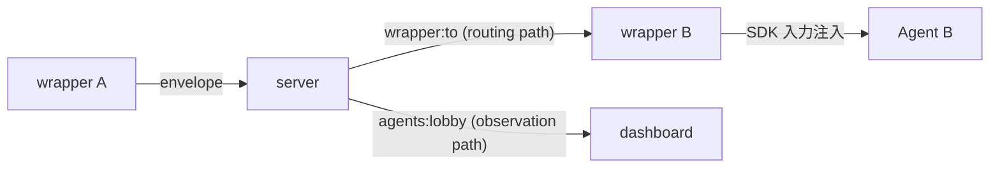
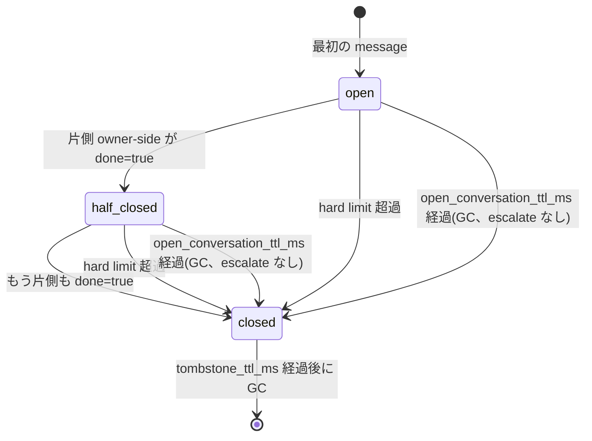

<!-- markdownlint-disable MD033 -->

# エージェント間メッセージング・プロトコル

## Purpose

複数 AI エージェントが kaoiro サーバを介して直接メッセージをやり取り
できるようにするための protocol surface を定める。kaoiro issue #17
本実装の機械的仕様であり、段階的実装計画は
[phase-8-inter-agent-messaging](../plans/phase-8-inter-agent-messaging.md)、
設計判断の背景は kaoiro issue #87 と #17 issuecomment-1359 を参照。

[protocol](protocol.md) の予約追補(同一 `version`)として envelope
`type: "inter_agent_message"` を新設する([ADR-0010](../adr/0010-protocol-precisification.md))。

## Dispatch-confirmation ledger (issue #247)

`ingress_stamp` は server acceptance であって、受信 wrapper が SDK turn として
読んだ確認ではない。recipient ごとの `inter_agent_delivery = {issued_seq,
acked_seq, pending_since?}` は後段の **dispatch confirmation** を観測するだけの
ledger であり、payload 保存・再送保証・配送保証はしない。

- `inter_agent_delivery_ack: "dispatch-v1"` capability を join した wrapper
  宛の live/synthetic message には、server が outer envelope に recipient-local
  正整数 `delivery_seq` を付けて `issued_seq` を進める。
- wrapper は queue 追加や `receiveInbound` 到達では ack しない。inject は実 SDK
  turn start、consumed/terminal/stale の意図的 non-injection は分類完了で、連続
  prefix を `delivery_ack {delivery_seq}` として確認する。従ってその間の停滞は
  `issued_seq > acked_seq` として残る。`pending_since` は最初の乖離時刻である。
- `whoami`、`list_agents` entry、operator dashboard の `snapshot.deliveries` と
  `delivery_status` は同じ server ledger を読む。field absent は **unknown**
  （legacy/disarmed）であり、zero ではない。

`transition_id` は session transition 相関用であり、runner crash relaunch が同値を
再利用し得るので process identity に使えない。ack-capable `ServerLink` は process
ごとの random `delivery_generation` を join する。同 generation の websocket
reconnect は gap を保持する。異 generation（reset/crash/explicit restart）は旧
process の memory を失った境界なので server が `acked_seq := issued_seq` として
旧 gap を atomically abandon する。sequence は単調に続くが、新 process への再送は
しない。

## Definition

### 全体像

エージェント A の wrapper が `send_to_agent` ツールを呼ぶと、wrapper
は通常の `envelope` イベントで `type: "inter_agent_message"` の
envelope を server へ送る。server は次の 2 系統に分岐する:



- **routing path**: server は `payload.to` を読み、`wrapper:<to>`
  channel に envelope を push する。受信した wrapper は SDK の次
  ターン入力として注入する
- **observation path**: server は通常の `agents:lobby` broadcast にも
  同じ envelope を載せる(operator 限定配信、後述)。dashboard は
  inter-agent message を A・B 両方の log 欄に表示できる

server は payload の意味論(kind / payload テキスト / meta)を解釈
しない。`to` フィールドのみをルーティング目的で参照する(agent 非依存
の原則を保つ最小の構造的アクセス)。

### envelope.type: "inter_agent_message"

[protocol.md](protocol.md) の envelope 共通外枠
(`version`/`agent_id`/`session_id?`/`persona`/`display_name?`/`ts`/`seq`/`type`/`state`/`payload`/`ext`)
はそのまま継承。`agent_id` は送信側エージェント、`state` は当該 wrapper
の現在状態(通常 `tool_running`)を据え置く。

新規追加するのは `type` 値と `payload` schema のみ。

| フィールド | 意味 |
|---|---|
| `type` | `"inter_agent_message"` |
| `payload` | 下記 "Inner envelope" 参照 |

### Inner envelope(`payload` schema)

```json
{
  "to": "lab-pc-1.claude-b",
  "conversation_id": "cnv-7f3a1c",
  "turn_number": 3,
  "kind": "propose",
  "body": "ベンチマーク結果を踏まえ、CSV 出力を採用するのはどうか",
  "meta": {
    "done": false,
    "propose_next": "B の同意があれば実装に入る",
    "confidence": 0.7
  },
  "owner": {
    "kind": "user",
    "id": "operator"
  },
  "new_conversation": false
}
```

| フィールド | 必須 | 意味 |
|---|---|---|
| `to` | MUST | 宛先 `agent_id`。`[A-Za-z0-9._-]` 制約は protocol 全体と同じ |
| `conversation_id` | MUST | 同一対話を紐付ける識別子。発起側 wrapper が採番(セッション内一意、UUIDv4 ベース) |
| `new_conversation` | MUST(準拠 wrapper)。省略時は server が `true` とみなす(下記) | bool。送信元エージェントが `conversation_id` を省略し、この wrapper が新規採番した送信でのみ true(issue #262)。それ以外(明示指定・返信・通知)は false。server はこれを見て、未知の `conversation_id` が「省略による新規」か「明示指定の誤り」かを判定する — 詳細は下記「明示指定された conversation_id が未知のとき」 |
| `turn_number` | MUST | 1 起点の正整数。同一 conversation 内で送信ごとに +1。`(conversation_id, turn_number)` で全順序 |
| `kind` | MUST | 下記 9 種 enum |
| `body` | MUST | メッセージ本文(自由テキスト)。意味論はエージェントに任せる |
| `meta.done` | MUST | bool。当該エージェントが対話の終了を提案する場合 true。**両 owner 側エージェントから true で conversation 完了** |
| `meta.propose_next` | MUST | string。次に何を期待するか(空文字可) |
| `meta.confidence` | optional | 0.0〜1.0 |
| `meta.reject_reason` | `kind=reject` 時 MUST | string。提案を拒否する具体的理由 |
| `error.code` | optional | 相手が応答不能になったことを示すエラー種別コード(open string)。詳細は「応答不能エラーの通知」節 |
| `error.message` | `error` 有時 MUST | string。人間可読の理由(秘匿情報マスク済・切り詰め済) |
| `owner.kind` | MUST | `"user"` または `"agent"` |
| `owner.id` | MUST | owner の識別子。user の場合は接続トークンに紐づく user_id、agent の場合は `agent_id` |

### kind enum(9 種)

意味論の出典・採否判断は kaoiro リポジトリ #17 issuecomment-1359
および vault `(private vault note)`。

| kind | 役割 | 典型ペア |
|---|---|---|
| `request` | 作業依頼 | → `response` |
| `response` | 依頼への結果報告 | `request` ← |
| `query` | 問い(Yes/No・値・意見) | → `inform` |
| `inform` | 情報共有・意見表明・query への回答 | `query` ← または独立 |
| `propose` | 合意候補を出す | → `accept` または `reject` |
| `accept` | propose への賛成 | `propose` ← |
| `reject` | propose への反対(`meta.reject_reason` 必須) | `propose` ← |
| `escalate-to-user` | 人間判断要請(tie-breaker)。hard limit 超過時の server 合成通知にも使う | → user |
| `done` | 終了申告 | agent 発は両 owner-side で揃って完了。`open_conversation_ttl` 到達時の server 合成通知(issue #221 direction 2)もこの kind を使うが、agent-to-agent の相互合意とは別物(単発・片方向) |

カバーケース:

- 依頼: `request` → `response`
- 相談: `query` → `inform` のラリー
- 議論: `propose` → `accept` / `reject` → 反対側が `propose`(対案)の
  ラリー → 最終 `propose` に両 owner-side が `accept` + `done`
- 結論不能: 任意の時点で `escalate-to-user`、または下記ハード制限
  超過で自動打ち切り

### conversation owner と tie-breaker

`owner` は対話を起動した主体。Phase 1 では常に user(operator が
明示指示で起動するため)。Phase 3 でエージェント autonomously 起動を
許可した場合のみ `owner.kind: "agent"` が現れる。

- 行き詰まり時の最終判断は owner に集約する
- `owner.kind: "user"` の場合 → server は `escalate-to-user` を受け
  たら dashboard に介入ダイアログを出す(AskUserQuestion 系の構造化
  ダイアログを流用。実体は [ADR-0027](../adr/0027-askuserquestion-envelope.md)
  の `question_request` / `waiting_question`)
- `owner.kind: "agent"` の場合 → owner エージェントへ
  `escalate-to-user` の代わりに `escalate-to-owner` ルーティング
  (Phase 3 で確定、本 spec は Phase 1〜2 のみ機械強制)
- 暴走時の停止権限も owner に帰属。owner は conversation 全体を
  キャンセルできる(`cancel` イベント、Phase 2 以降)

### ハード制限(config + 機械強制)

server は conversation 単位で以下の制限を機械的に監視し、超過時に
自動打ち切りする。打ち切り時は当該 conversation の参加 wrapper
全てに合成 envelope(`kind: "escalate-to-user"`、
`body: "<理由>"`、`meta.done: true`)を broadcast し、両 wrapper
は SDK 入力として注入する。

| config キー | 単位 | 既定値(Phase 1) | 用途 |
|---|---|---|---|
| `max_turns` | turn(=メッセージ件数) | 20 | conversation 1 件の対話ターン総数 |
| `max_tokens` | token | 100_000 | 全 body の累積トークン(server 側で粗く近似、`length(body)/3` 切り上げ) |
| `max_concurrent_agents` | agent 数 | 2 | 同一 conversation_id に参加可能な agent 数(Phase 1 は 2 固定、Phase 3 で 3 以上検討) |

config は kaoiro server 設定で agent 単位 / global の二段。global を
agent 単位で上書き可。

**旧 `max_wallclock` は issue #221 で撤廃した。** conversation 発生から
の経過時間そのものを打ち切り条件にする方式は、暴走した高速 ping-pong
より先に `max_turns` へ到達し(#177 のケース同様、短いメッセージの
往復は秒〜分単位で 20 turn に達する)、逆に xhigh effort のレビューの
ような**低速だが正当な**対話を優先的に打ち切るという選択性の逆転が
2026-08-11 に実測された。撤廃の詳細と根拠は issue #221 本文を参照。

### メモリ回収用 TTL(config、ハード制限ではない)

以下はハード制限ではなく、conversation エントリのメモリ回収のみを
目的とする GC 専用の config。`{:exceeded, reason}` を返さず、
`escalate-to-user` も合成しない — 対話の長さそのものを理由に
打ち切ることは一切しない。

| config キー | 単位 | 既定値 | 用途 | 基準時刻 |
|---|---|---|---|---|
| `open_conversation_ttl_ms` | ms | 86_400_000(24 時間) | 応答が途絶えた OPEN entry の回収(memory-DoS 防御) | `started_at` |
| `tombstone_ttl_ms` | ms | 86_400_000(24 時間) | CLOSED tombstone の削除、`conversation_id` 再利用の解禁 | `closed_at` |

`tombstone_ttl_ms` は wrapper 側の `CLOSED_TRACK_TTL_MS`(24 時間)と
値を揃えている(下記「CID 再利用は契約にしない」参照)。

### conversation のライフサイクルと終了後の扱い (issue #177)

完了・打ち切り後の conversation は unknown/new と区別される状態
(tombstone) として保持する。同じ `conversation_id` への遅延・重複・
out-of-order message が新規 conversation として再受理され、done /
escalate の ping-pong が止まらなくなる不具合(issue #177、2026-07-31
observed)の再発防止。



- **open**: 通常の対話中。turn / token を計測する(issue #221 で
  wallclock 自体の計測・打ち切りは廃止)。
- **half-closed(one-sided done)**: 一方の owner-side が
  `meta.done=true` を送り、もう一方はまだの状態。受信側には「close
  proposal」として注入する — 一般の返信 directive ではなく、「閉じる
  なら一度だけ `done=true` で応答、続けるなら通常の応答」という専用
  文言にする(wrapper 側、下記)。
- **closed(terminal)**: 両 owner-side の done=true が揃った、hard
  limit 超過、または `open_conversation_ttl_ms` 経過(下記)。server は
  この時点で entry を tombstone(`status: closed`、`reason`、
  `closed_at`、参加 agent 集合、`last_turn` を保持)へ遷移させ、削除
  しない。同一 `conversation_id` への以後の message は relay・store・
  通常 broadcast せず `{:error, :conversation_closed}` で拒否する。
  wrapper 側の受信も terminal な inbound は **model への注入を一切
  行わない**(issue #221 direction 1)— 旧仕様は「informational
  only、send_to_agent を呼ぶな」という専用文言で SDK 入力へ注入して
  いたが、返信不要な通知のために model turn を消費すること自体が
  issue #221 の解消対象だった。track は `closed` を学習するのみで、
  追加の send_to_agent はもとより誘発しない。
- **open_conversation_ttl による closed(issue #221)**: periodic GC は
  OPEN entry の `started_at` から `open_conversation_ttl_ms`
  (既定 24 時間)経過したものを、message の到着を待たず tombstone
  (`reason: :open_conversation_ttl`)へ遷移させる。**これはハード
  制限ではなくメモリ回収専用**であり、`escalate-to-user` は合成しない
  — 応答が途絶えたまま長時間残る entry を回収するだけで、対話が長い
  こと自体を理由に打ち切りはしない。旧 `max_wallclock` ハード制限
  (10 分)がこの遷移も兼ねていたが、issue #221 で用途を分離した。この
  遷移は参加していた全 agent へ `kind: "done"`(`turn_number: 0`、
  `agent_id: "server"`、`meta.done: true`)の合成 envelope を
  broadcast する(issue #221 direction 2)— `escalate-to-user` では
  ないので、受信側が新規 conversation を開いて継続するという無意味な
  挙動を誘発しない。受信側 wrapper はこれを `isSynthetic` 判定
  (下記)で server 発の closed 通知と認識し、track を `closed` に
  更新するが、上記のとおり model へは注入しない。
- **tombstone GC**: closed から `tombstone_ttl_ms` 以上経過した
  tombstone は server の periodic GC が削除する。この TTL は
  **UUID 衝突時のメモリ解放**であり、`conversation_id` を意図的に
  再利用する運用パターンではない(下記「CID 再利用は契約にしない」
  参照)。periodic GC は open entry も TTL 超過時に即削除せず、まず
  `open_conversation_ttl` tombstone へ遷移させる — 削除してしまうと、
  遅延到着した message が「新規」として再受理されてしまうため。
- **turn_number の ingress 検証と stale_turn 拒否**(issue #177 review
  M1): live ingress(通常の `envelope` push)は `payload.turn_number`
  を正の整数のみ受理する — `0` は server 合成通知専用の予約値であり、
  wrapper がこの経路で自称することはできない(server はこの経路を
  経由する message を一切合成しないため、`0` はここでは常に不正)。
  正の整数であっても、OPEN な conversation の `max_turn_number`
  以下(重複・遅延到着)なら `{:error, :stale_turn}` で拒否し、
  turns / tokens / max_turn_number を進めない。`replay_ia`(表示専用の
  復元経路)は wrapper ホストの IA sidecar に記録された過去の
  `turn_number=0` 行を正当に含むため、この live ingress 限定の
  検証は適用しない。

wrapper 側(`agent-common`)も上記と対になるローカル状態
(`localDone` / `remoteDone` / `closed`)を conversation_id ごとに持つ:

- 自分が既に `done=true` を送り、peer の `done=true` を受けたら
  terminal。**加えて**、server 合成の closed 通知(`turn_number=0`、
  `agent_id: "server"`、`meta.done=true` — hard limit 超過時の
  `kind: "escalate-to-user"`、または `open_conversation_ttl` 到達時の
  `kind: "done"`、issue #221 direction 2)を受けた時点でも、自分側の
  done 送信有無に関わらず即 terminal にする — server 側は既にこの
  conversation を tombstone 化して閉じており、ローカルだけ「相手から
  の一方的な close 提案」と誤読すると、受信側 wrapper がその通知に
  対して再度 `send_to_agent` を呼んでしまい(close-proposal の注入
  文言が返信を誘う)、closed な conversation への送信として server に
  往復拒否される無駄が起きる。以後同一 `conversation_id` を指定した
  `send_to_agent` はローカルで即 tool error にする(server 往復なしで
  完結する)。`conversation_id` を省略すれば新規 conversation を開始
  できる。issue #221 direction 1: いずれの経路で terminal と判定
  された inbound も SDK 入力へは一切注入しない(旧仕様は
  「informational only」という専用文言で注入していたが、返信不要な
  通知のために model turn を消費すること自体が issue #221 の解消
  対象だった)。
- **同一 conversation_id への並行 send_to_agent の直列化**(issue #177
  review 2巡目 M1): 同じ conversation_id への `send_to_agent` 呼び出しが
  並行に(例えば同一ターン内で複数回)行われた場合、採番から
  server 応答の反映までを conversation_id 単位で直列化する
  (`wait_for_response` の応答待ち自体は対象外 — 最大 300 秒他方を
  塞いでしまうため)。直列化がないと、片方が reject された際の
  ロールバックが、その間に accept されたもう片方の状態
  (`localDone` / `closed`)を巻き戻してしまう競合が起きる。
- **pending-done 中の受信分類の遅延**(issue #177 review 2巡目、ふじ
  差し戻し): `done=true` の `send_to_agent` がまだ acceptance 未確定
  (楽観的な `localDone` 反映のみ)の間に、同じ conversation_id への
  inbound(peer 自身の done、または server 合成のハード制限通知)が
  届いた場合、その inbound の分類・状態反映は pending 中の
  acceptance が確定するまで待つ(`wait_for_response` の応答待ち全体
  ではなく、その 1 件の送信の ack が着くまでの短い gate)。これが
  ないと 2 通りの不具合が起きる: (1) 権威的な server 合成 CLOSED を
  その inbound が正当に反映した直後、後着の(`conversation_closed`
  以外の理由の)generic reject のロールバックがそれを OPEN に巻き戻す
  ("server=closed、wrapper=open" split-brain、AC10 も破られる)。
  (2) 楽観的な `localDone` を見て「両側 done で terminal」と確定した
  disposition が engine アダプタへ渡り、SDK 入力へ注入せず(issue
  #221 direction 1、track だけ closed へ更新)`notePendingInjection`
  も skip した後でその送信が reject されると、実際には片側提案
  (close-proposal) のままなのに返信経路が失われる(取り消し不能)。
- **`conversation_closed` reject の学習**(issue #177 review 2巡目
  M2): `send_to_agent` の送信が server から `conversation_closed`
  で拒否された場合、その conversation_id をこの wrapper が事前に
  一度も追跡していなかった(brand-new local track)場合でも、
  ローカル track を closed として学習する。学習せずに track を
  破棄すると、同じ `conversation_id` を指定した次回の試行が毎回
  server へ往復し、server 側 tombstone TTL(既定 24 時間)が明けた
  時点で受理されてしまい、下記「CID 再利用は契約にしない」の
  wrapper 側 24 時間 guard が骨抜きになる。
- **turn_number は accept された送信のみが消費する**(issue #222):
  wrapper-local な `track.turnNumber` は送受信双方が共有する 1 個の
  カウンタで、`send_to_agent` 呼び出しの `#dispatch()` 前に暫定採番
  する。この暫定採番は server が実際に **accept** した場合にのみ
  確定した消費として扱う契約であり、reject された採番は消費された
  ことにしない。旧実装はこの契約を守れておらず、reject 後も
  `track.turnNumber` が進んだままになる欠陥があった(欠陥 1、下記)。
  **例外が 2 つある**(issue #222 段階2 差し戻し advisory2、ふじ指摘):
  この accept-gated 契約は `send_to_agent`(`invoke()`)経由の通常送信
  にのみ適用される。`stale_turn` notice(欠陥3、下記)と既存の
  `resolveTurnEnd()` peer_error notice(issue #131)は、どちらも
  `#dispatch()` を経由せず `ServerLink#send()` を直接呼ぶ
  fire-and-forget 経路で、ack を待たず accept/reject を観測しない。
  したがって、いずれも自身の採番を server の受理と結び付けられず、
  常に「消費した」ものとして扱う(採番した `turn_number` を無条件に
  使用済みとして進める)。これは送信前 turn 採番という設計そのものの
  残存する非対称であり、恒久的な限界として受け入れている。
- **reject 時の turnNumber ロールバック**(issue #222 欠陥1): `invoke()`
  の reject 分岐は、`#dispatch()` 待機中に同じ conversation_id への
  inbound 活動(`receiveInbound()` / `observeInbound()`)が割り込んで
  いなかった場合に限り、暫定採番した `turnNumber` を 1 戻す。割り込みが
  あった場合はその inbound 側の値が authoritative なので触らない
  (`mutationGen` による検出、`inter_agent.ts` の該当コメント参照)。
  `conversation_closed` reject は戻しても実害・利益ともに乏しい
  (その cid はいずれにせよ二度と使えない) が、それ以外の reject 理由で
  会話が継続するケースでは、戻さないと以後 peer の正当な turn が
  下記の stale 判定に恒久的に引っかかり続ける。
- **late / stale / duplicate turn の拒否**: 受信 `turn_number` が当該
  conversation で既知の最大値以下なら、SDK 入力へ注入しない(返信待ち
  の waiter も満たさない)。ただし server 合成 envelope(ハード制限
  超過・応答不能通知)の `turn_number=0` は wrapper-origin の turn 系列
  と別経路であり、この判定から除外する。**判定条件は `turn_number=0`
  に加えて `agent_id === "server"` も必須**(issue #177 review M1)—
  `turn_number` の値だけを見ると、peer wrapper 自身が(バグまたは
  悪意で)`turn_number=0` を自称した message を送れてしまい、受信側が
  それを server 合成通知と誤認して即座に自 track を closed
  にしてしまう("server=open、受信側 wrapper だけ closed" という
  split-brain)。この forge は live ingress の構造検証(下記)でも
  server 側で拒否されるが、受信側 wrapper 自身も provenance を
  検証することで二重に防ぐ。**issue #222 欠陥3 以降、この破棄は
  完全な無言ではない** — 破棄した envelope の送信元へ `stale_turn`
  notice を送る(例外条件と再同期の役割は「エラー種別コード」節
  「stale_turn 通知の構造」参照)。
- wrapper 側の closed track も TTL(24 時間)経過後に GC する(長寿命
  wrapper のメモリリーク防止)。
- **OPEN track の idle TTL と総数上限**(issue #177 review 2巡目
  M3、「open track の unbounded 経路」): 上記の closed track TTL は
  この wrapper 自身が CLOSED と学習した track にしか効かない。
  server の periodic GC が自発的に tombstone 化したことは、
  `open_conversation_ttl` 経由の遷移に限り issue #221 direction 2 で
  peer へ伝播するようになった(上記「open_conversation_ttl による
  closed」参照)が、この伝播は broadcast 一発の best-effort であり
  配送を保証しない(受信側 wrapper がその瞬間切断していた等)。
  したがって、通知が届かなかった場合(issue #209 の残存部分)や
  closing turn を取りこぼした・peer が再接続なしにクラッシュした
  等の経路では、wrapper が closed を学習できなかった track は
  OPEN のまま残り続け、closed track TTL では prune されない。
  これを塞ぐため、OPEN track にも最終アクティビティから 24 時間の
  idle TTL を独立に適用し、さらに open + closed 合算の総数上限
  (既定 20,000、最も古い track から evict)も設ける。issue #221 で
  server 側の `max_wallclock` ハード制限は撤廃されたため、idle
  対象になるほど長時間 open な conversation が「server 側で
  打ち切り済み」である保証はもはや無い — server 側は今や
  `open_conversation_ttl_ms`(既定 24 時間、この idle TTL と同じ
  order of magnitude)で独立に同じ entry を回収しているはずなので、
  evict は該当 conversation_id のローカル bookkeeping
  (`turnNumber` / `localDone` / `remoteDone`)を破棄するだけで実害は
  小さい — 以後同じ conversation_id を明示指定すれば新規 track として
  再送でき、server からの正しい応答(`conversation_closed` なら
  上記 M2 の学習で再度ローカルに反映される)を得られる。

Claude Code / Codex いずれの engine アダプタも共通の `agent-common`
判定(`InterAgentTool#receiveInbound` / `#invoke`)を経由するため、
上記の状態機械はエンジンに依存しない。

#### CID 再利用は契約にしない(issue #177 review S2)

server の tombstone TTL(`tombstone_ttl_ms`、既定 24 時間)だけを見ると
「TTL 経過後は `conversation_id` を再利用できる」ように読めるが、
これは server 単体の話であって system 全体の契約ではない。
**wrapper 側の closed track TTL も 24 時間** であり、その `send_to_agent`
/ `receiveInbound` を経由する限り、閉じた `conversation_id` は
server 側 TTL が明けた後もローカルで「closed」のまま tool error を
返し続けうる。同一 wrapper が生存または再接続していれば、server 側
TTL 経過直後の再利用は失敗する。

したがって:

- server の tombstone TTL は **UUID 衝突を想定したメモリ解放** に過ぎず、
  「同じ `conversation_id` を意図的に使い回してよい」という設計ではない。
  `conversation_id` は UUIDv4 で採番される前提上、同一値が偶然再送され
  る確率は無視できるほど小さく、積極的な再利用は起こらない想定である。
- 実効的な「この会話はもう終わった」guard は **wrapper 側の 24 時間
  TTL** である。エージェント側が同じ相手と新しい対話を始めたい場合は、
  常に `conversation_id` を省略して新規 UUID を採番させること。閉じた
  `conversation_id` を明示的に指定して再送する経路は、フォールバック
  としても正式な API 契約としても提供しない。
- **server 側 `tombstone_ttl_ms` と wrapper 側 `CLOSED_TRACK_TTL_MS` は
  issue #221 で同じ 24 時間へ揃えた**(旧 `max_wallclock_ms` は
  10 分で、server 側だけ短い非対称構成だった)。揃えたのは、旧
  `max_wallclock` ハード制限の撤廃で server 側が短命だったことの
  積極的な理由(頻繁な hard-limit 打ち切りに追従した短い回収)が
  消えたため — server が先に忘れて wrapper だけが guard を担う設計に
  積極的な利点はなく、揃えた方が運用上のメンタルモデルが単純になる。
  実効的な guard が wrapper 側 24 時間である点自体は変わらない。

### 明示指定された conversation_id が未知のとき (issue #262)

新規 conversation を開始する正規経路は `conversation_id` の省略のみ
(上記)だが、issue #262 以前の server はこの区別を持たず、**明示指定
された未知の `conversation_id` も同じく新規 conversation として無言で
受理**していた。director の conversation_id 誤転記が 2026-08-16〜17 に
3 回、エラーにならず紛れ込みスレッドとして成立した実害があり、これを
fail fast and visible にする。

- **区別の伝達は `payload.new_conversation` (MUST) が担う**: 発起側
  wrapper (`send_to_agent` の呼び出し元が `conversation_id` を省略し、
  この wrapper が新規採番した)送信でのみ true。返信・通知
  (peer_error / stale_turn)・エージェントが明示指定した送信は false。
  server は cid そのものからは「省略による新規」と「明示指定の誤り」
  を区別できない(採番も UUID の一意性もすべて wrapper 側の責務であり、
  server はその結果の文字列しか見ない)ため、この bool が唯一の判断
  材料になる。
- **server の判定**(`ConversationStates.record_message/8`):
  `conversation_id` に対応する entry が存在せず(open でも tombstone
  でもない)、かつ `new_conversation? == false` のときに限り
  `{:error, :unknown_conversation_id}` で拒否する。entry が存在する
  場合(open・closed いずれも)はこのフラグを一切見ない —
  `conversation_closed` / `participants_mismatch` / `stale_turn` は
  従来どおり優先される。`new_conversation? == true` の cid が未知
  なのは正常系そのものなので、このチェックには到達しない。
- **送信側 wrapper の tool result**: 生の reason
  (`unknown_conversation_id`)をそのまま返すのではなく、「正しい id
  での再送か省略での新規開始を促す」専用文言を返す
  (`send_to_agent failed: conversation_id=<id> is unknown to the
  server — retry with the correct conversation_id, or omit it to
  start a new conversation (this can also mean the server restarted
  since this conversation began, which drops all of its state).`)。
  後半の「server 再起動」の言及はレビュー (クロエ) 指摘: `ConversationStates`
  は永続化を持たないため、server 再起動で進行中の全 conversation が
  消え、以後その cid への明示送信は全て `unknown_conversation_id` に
  なる。文言に候補を挙げないと、送信側エージェントは「自分の転記
  ミス」とだけ解釈して 1 ターン浪費しかねない。ローカル track 側の
  特別扱いは不要 — 明示指定した未知 cid のローカル track は
  `wasBlank` 判定(「実質的な履歴が無い」)に自然に該当し、既存の
  reject-cleanup がそのままリセットする。
- **既知の反例**(意図的に許容する残余): `new_conversation? == false`
  の送信が「既存 entry への正当な返信・継続」であるケースは、この
  チェックが `existing != nil` で素通しするため一切影響を受けない —
  対話の 2 通目以降は常にこの経路である。影響するのは「タイポ・古い
  session のコピペ由来で、どの entry にも一致しない cid を明示指定
  した」場合のみ。
- **`payload.new_conversation` の欠落は拒否せず true 扱いにする**
  (レビュー、issue #262 delta、クロエ M1): `validate_live_inter_agent_payload/1`
  は key の存在を要求しない — bool 以外の値のときだけ拒否する。
  issue #262 より前の wrapper はこの field を送らないが、Phoenix
  client は reconnect/heartbeat を自前で持つため
  (`wrapper/core/src/transport.ts`)、server だけ再デプロイしても旧
  wrapper プロセスは再起動なしで生き残り送信を続ける。key を必須に
  すると、そうした旧 wrapper の live send を全部
  `missing key: payload.new_conversation` で弾いてしまい、
  [ADR-0015](../adr/0015-protocol-version-stamping.md) が確立した
  「version 不一致でも ACK して処理は継続する」というベストエフォート
  受理の方針と矛盾する。`preflight_inter_agent/2` は欠落を `true`
  として読み(`case payload do %{"new_conversation" => false} -> false;
  %{"new_conversation" => true} -> true; _ -> ... end`)、欠落側では
  `agents_channel.ex` の protocol version 警告と同型式の
  `Logger.warning` をメッセージ 1 通ごとに出す(`inter_agent_message:
  client declared new_conversation (absent); accepting as true (issue
  #262 legacy best-effort accept)`)。代償として、旧 wrapper からの
  明示指定・未知 cid はこの移行期間中 `unknown_conversation_id` で
  拒否されず無言で新規 conversation を開くが、これは新 wrapper へ
  更新されるまでの一時的な後退であり、恒久的な抜け道ではない。
  - **warning が旧 wrapper からの送信ごとに出続けることは意図的**
    (レビュー、クロエ): `refresh_engine_catalog` 等の既存 ADR-0015
    警告は接続・カタログ更新時のみで頻度が低いが、この警告は旧
    wrapper が更新されるまで**全 inter-agent 送信**で出る。頻度が
    高いこと自体を「異常」と読まれるのを避けるため、この段落を
    正本として残す — 移行期間が長引くほど log に占める割合が増える
    のは設計どおりで、対処すべき異常ではない。
  - **`ConversationStates.record_message/8` 自身は既定値を持たない**
    (director 裁定、issue #262 delta 2巡目): 当初は `new_conversation?`
    にも `\\ true` の既定値を与え、この channel 側の分岐を単に呼び出す
    だけで済ませていたが、それは「渡し忘れたら黙って許可」という
    #262 が閉じようとした欠陥そのものを、wire 層から内部 API 層へ
    移しただけだった。既定値を廃し必須引数にしたことで、
    `record_message/8` の将来の呼び出し元は全員この判断を明示しなけ
    ればならず、`preflight_inter_agent/2` の上記 absent 分岐が
    「合法的に許容側へ倒す唯一の場所」になる。コストは既存呼び出し
    (主にテスト、約 90 箇所) への機械的な引数追加
  - **廃止の目安**: この absent 分岐は永続の契約ではない。稼働中の
    全 wrapper が issue #262 以降のビルドであると確認できた時点で、
    `validate_live_inter_agent_payload/1` を key 必須に戻し、
    `warn_legacy_new_conversation_absent/0` ごと削除してよい
    (`CLOSED_TRACK_TTL_MS` のような固定 TTL ではなく、運用側が
    「もう旧 wrapper はいない」と判断した時点が基準)

### 観測経路(dashboard 表示)

server は inter_agent_message envelope を `agents:lobby` にも
broadcast する。ただし `log` / `result` と同様に **operator 限定配信**
([ADR-0021](../adr/0021-role-information-disclosure-policy.md))。

dashboard は受信時、`agent_id`(送信側)と `payload.to`(受信側)の
両 agent の log 欄に inter-agent message を表示する。表示形式は
クライアント実装で確定するが、最小限以下を満たす:

- 送信側エージェントの log: `→ to <to>: <body>(kind, conversation_id 抜粋)`
- 受信側エージェントの log: `← from <agent_id>: <body>(kind, conversation_id 抜粋)`
- conversation_id でグルーピング可能な視覚要素(同一対話を辿れる)

`log` envelope とは別 type なので、既存の log フィルタ・既読管理と
は独立して扱う。

server 側の表示保持は **per-pane projection**(sender pane /
receiver pane それぞれの揮発投影)で行い、live 表示・F5 復元・
再起動後の replay 復元がすべて同一の upsert contract に載る
([ADR-0051](../adr/0051-history-restart-resilience.md) D3-1)。cap は
transcript 行と IA を pane ごとに時系列 merge した**最終投影で newest
200 envelope**(IA の cap 免除は廃止)。

### IA sidecar と表示復元([ADR-0051](../adr/0051-history-restart-resilience.md))

構造化 IA の正本は server ではなく **wrapper ホストの IA sidecar**
とする(`InterAgentHistory` DETS は撤廃)。

- **記録**: wrapper は IA を送受信した時点で、wire envelope 全体 +
  server 採番の `ingress_stamp` を engine transcript と同じ
  ディレクトリの sidecar file へ構造化のまま append する。1 行 =
  `{"ingress_stamp": [us, seq], "envelope": {...}}` の JSONL。
  - パス(実装時確定、2026-08-08): `<transcript dir>/<session-id>.ia.jsonl`。
    claude-code は `~/.claude/projects/<encoded-cwd>/`、codex は当該
    rollout ファイルと同じディレクトリ。
  - 受信側: server からの配信受領時(SDK 注入の**前**)。server 合成
    envelope(エラー直送通知)も同様に記録。注入失敗で sidecar だけ
    残る phantom は受容。
  - 送信側: `envelope` push への **acceptance ack reply
    `{ingress_stamp}`** の到着時。MCP tool result は ack として
    使わない(`wait_for_response=true` では peer reply まで返らない
    ため)。reject / timeout / ack 喪失時は記録しない(loss 受容、
    stderr warn)。
  - **ack と tool result の関係**(ふじ 30-10 must-fix M5、2026-08-08。
    issue #177 の Stage 3 が要求する「ack 経路の追加・reject の tool
    error 化」はこの ADR-0051 実装で先行して満たされていた —
    #177 は新規実装ではなく、`conversation_closed` を下記の reject
    reason 一覧へ追加しただけ):
    記録トリガは ack のままだが、`send_to_agent` の **tool result も
    同じ ack で決まる**。accepted = 従来どおり `sent ...`、server の
    明示 reject(`unknown_agent` / `self_routing` /
    `participants_mismatch` / `conversation_closed`(issue #177)/
    `unknown_conversation_id`(issue #262)等)は
    **error result に reason を載せる**(`unknown_conversation_id` のみ、
    正しい id での再送か省略での新規開始を促す専用文言 — 下記参照)、
    timeout / ack 喪失は
    「配送不明」— 再送が重複配送になり得るため error にはせず、その旨を
    result 本文に明記する。reject / 配送不明では `wait_for_response`
    の待ちも即座に解除する(誰も応答しない会話を timeout まで待たない)。
    ただし **ack 喪失時に peer reply が既に着いていれば配送成功**として
    扱い、通常の `sent + reply` を返す(reply の到着自体が配送の証拠。
    ふじ 30-10 2 巡目 R3、2026-08-08)。
  - **応答不能通知(#131)との関係**(ふじ 30-10 2 巡目 R2、2026-08-08):
    注入された inbound に対する「返信済み」判定も acceptance で決まる。
    accepted / 配送不明では pending injection を解消し、**reject では
    解消しない** — 送信が成立していない以上、turn 終了時のエラー通知は
    出さなければならない。配送不明で解消するのは、配送済みだった場合に
    通知を重ねると相手に矛盾する 2 通が届くため。
  - 破損・途中切れ行は skip + stderr warn。fsync は要求しない。
    パスは transcript ディレクトリ固定・session_id サニタイズ・
    symlink は辿らない。
  - **読み出し順**(ふじ 30-10 must-fix M3、2026-08-08): 復元時の
    「新しい 200 件」は **file の末尾 200 行ではなく `ingress_stamp`
    昇順の末尾 200 件**。append 順は ingress 順と一致しない — quota
    overshoot では server 合成通知(高い stamp)が先に届き、それを
    起こした元 message(低い stamp)は ack 後に append されるため、
    file 順で切ると古い方を落として新しい方を残すという逆転が起きる。
    同一 stamp の重複行は 1 行に畳む(bind 時の追記由来)。
- **session lifecycle**: session_id 未採番期間は
  `{agent_id, reset_generation}` で namespace した pending journal へ
  append し、session_id 確定時に当該 session の sidecar へ bind
  (rename。bind 先が既にあれば追記)する。pending journal は
  transcript ディレクトリには置けない — codex の rollout ディレクトリ
  は日付ネストで session_id 確定まで解決できないため。パスは
  `${KAOIRO_IA_PENDING_DIR:-~/.kaoiro/ia-pending}/<agent_id>__<generation>.ia.jsonl`
  で、`generation` は launch 時の `transition_id`(runner が渡さない
  場合はプロセス毎の乱数)(実装時確定、2026-08-08)。session_id が
  途中で再採番された場合も同じ bind 処理で現行 sidecar を新パスへ移す
  (replay 対象が現 session 分のみのため、移さないと当該会話の IA が
  落ちる)。bind 前に crash した orphan journal は replay
  対象外で次回起動時に GC(fail-closed)。`/new`・`/clear` は旧
  generation への append を即停止して新 generation へ切り替え、
  reset rollback 時のみ旧 generation へ戻る。agent 削除では host
  local artifact(transcript / sidecar)は残置。
- **復元**: hydration verdict で replay を指示された wrapper が
  sidecar を読み、`replay_ia` イベント([protocol](protocol.md)
  イベント表)で自 pane の表示行を再投影する。routing・SDK 注入は
  発生しない。clear 済み行は保存された `ingress_stamp` と durable
  `ClearWatermarks` の比較で hide、stamp 欠落行は fail-closed で
  破棄。受理された復元行は `agents:lobby` へ
  **`history_replay_envelope { pane_agent_id, envelope }`** として
  broadcast する(接続中タブの IA を戻すための display fan-out)。
  通常の `envelope` を使わないのは、その形が pane を持たず client 側で
  `agent_id ∪ payload.to` へ広がるため、復元行が reload 後には表示され
  ない peer の pane にも残ってしまうから(ふじ 30-10 must-fix M2、
  2026-08-08)。`pane_agent_id` は replay 中 wrapper の channel assign
  由来で、wrapper の payload には pane 指定権を与えない。
  1 回の `replay_ia` push は wrapper 側が JSON 実 byte 長 **1,000,000 bytes**
  を上限に分割する
  (socket の `max_frame_size` 8MB に対し 200 行 × 64KiB envelope は
  約 12MB になり frame ごと reject され、complete が届かず永久に
  unhydrated になるため)。同一 `replay_id` の複数 push を
  `history_replay_complete` の前にすべて送る。単独で分割上限に収まらない
  行は **送らずに落とす**(送れば frame reject → complete 未達 → 再 join
  で同じ行、の loop に戻るだけで、破損 sidecar 行と同じ fail-closed 判断。
  ふじ 30-10 2 巡目 should、2026-08-08)。詳細は
  [protocol](protocol.md) の `replay_ia` 行を参照。
- **resume reconstruction との関係**: SDK transcript 内の IA 注入
  framing テキストは従来どおり `kind=user` log へ再投影**しない**
  (structured 表示は sidecar 由来の `replay_ia` が担う。二重表示
  防止)。

### Channels イベント増分

inter_agent_message 本体は既存 `envelope` イベント上で運ばれるが、
コンパニオン機能のため **`directory_request`** を追補する。

#### peer directory の情報境界 (#102 / #160)

phase-8 では宛先名の解決だけを目的に directory entry を
`agent_id / persona / state` へ絞っていた。phase-15 で engine 間の state
envelope schema が確定したため、#102 ではこの最小性判断を
「**名前解決に加え、peer の実行特性を見て委譲先を選べる read-only
directory**」へ引き直し、`engine / model / effort` を公開した。

issue #160 (phase-27) はこれをさらに **「peer の稼働状況を見て委譲の
可否まで判断できる directory」** へ広げる。エージェントが operator の介在なしに
「context が逼迫した peer に重い委任をしない」「利用上限に張り付いた peer
を避ける」「対話中の peer に割り込まない」「長時間無活動の peer を報告
する」を判断できることが要件。

##### 開示 field 一覧

| field | 型 | 意味 | 省略される条件 |
|---|---|---|---|
| `agent_id` | string | 宛先識別子 | MUST(常に存在) |
| `persona` | `{id, name, sprite_set}` | pack 由来の canonical identity。`name` は session 中不変(issue #219 D19) | MUST |
| `display_name` | string | 稼働中に変わり得る通称。表示に使うのはこちら(issue #219 D19/D26、ADR-0021 F6-3) | envelope が旧 wrapper build で `display_name` を未報告のとき |
| `state` | string | 現在状態 | MUST |
| `engine` / `model` / `effort` | string | 実行特性(#102) | non-empty string でないとき |
| `context` | `{used_tokens, max_tokens, used_percentage}` | context 使用量 | 下記 capability gate 不成立、未報告、shape 不正、切断済み |
| `session_started_at` | ISO8601 (UTC) | **server が観測した**現セッション開始時刻 | server が開始を観測しておらず `SessionStarts` からも復元できないとき。**相関できない join を受けた connection では、`SessionStarts` から復元できる場合でも省略する**(下記) |
| `turns` | 非負整数 | 現セッションの応答往復数 | server が当該セッションの開始を観測していないとき(fallback で開始時刻だけ復元した場合も省略)。上と同じく、相関できない join を受けた connection でも省略 |
| `last_activity_at` | ISO8601 (UTC) | server が envelope を最後に受理した時刻 | まだ 1 通も受理していないとき |
| `conversation` | `{active, peers[]}` | active な IA 会話の有無と相手 | **省略しない**(下記) |
| `rate_limits` | `{<window>: {status?, utilization?, resets_at?}}` | 最終 turn 時点の利用上限 snapshot | 未報告、全 window が projection で drop、切断済み |

`session_started_at` / `last_activity_at` は **server 側の時刻** である。
wrapper が実測した値ではなく、envelope の `ts`(wrapper ホストの時計)
とも別軸。ホスト跨ぎの時計ズレを判断材料に混ぜないための規約。

##### `context` の capability gate

`ext.context` の存在では判定しない。
`ext.session_capabilities.supports_context_usage == true` かつ
`used_tokens` / `max_tokens` / `used_percentage` がすべて数値のときだけ
投影する。capability が absent(旧 wrapper)や explicit `false`(Codex)
では **field ごと省略** し、`null` も推定値も出さない
([ADR-0040](../adr/0040-context-usage-capability.md) D1 の 3-state 判定を
dashboard と揃える)。capability field 自体は peer に開示しない。

##### `ext` からの projection

`ext` は wrapper が自由に拡張できる open schema なので、**raw を素通し
しない**。canonical key だけを写した新しい map を組み立てる
([ADR-0021](../adr/0021-role-information-disclosure-policy.md) F6-2 の
allow-list を nested 階層まで適用)。

| 対象 | 許可 key | 検証 |
|---|---|---|
| `context` | `used_tokens` / `max_tokens` / `used_percentage` のみ | すべて **有限かつ `\|x\| <= 2^53-1`**。1 つでも欠ける・不正なら `context` ごと省略 |
| `rate_limits` の window 値 | `status` / `utilization` / `resets_at` のみ(3 つとも optional) | `status` = string かつ UTF-8 64 bytes 以下、`utilization` = **有限かつ `\|x\| <= 2^53-1`**、`resets_at` = 非負の safe integer |
| `rate_limits` の window key | open string | UTF-8 32 bytes 以下、charset `[A-Za-z0-9_-]` |
| `rate_limits` の window 数 | — | 8 件以下 |

- **key 自体が無い**ときだけ absent として許容する。key があって値が
  invalid(`null` を含む)なら **当該 window ごと drop** する。値を 1 つ
  だけ捨てて残りを返すと、不完全な窓が完全な窓と同じ形で読めてしまう。
- projection 後に値が 1 つも残らない **empty window は drop**。
- window 数が 8 を超えるときは、**validation と empty drop を通過した
  valid window 集合** に対して canonical(`five_hour` → `seven_day`)を
  無条件優先し、残り枠を lexical 昇順で埋める。canonical であっても
  validation を通らない window は保持しない。
- **malformed は top-level field 単位で drop** し、valid な sibling は
  残す(`context` が壊れていても `rate_limits` は載る)。
- 数値は換算しない。projection は「写す key を絞る」操作であって値の
  加工ではない。`utilization` の 0..1 range 検査は入れない
  ([#164](https://gitea.example.invalid/sakurai.yuta/kaoiro/issues/164) の
  実データ確認後に判断)。
- drop のログは window 単位で無制限に warn せず、agent / request 単位で
  集約する(`list_agents` は auto-allow 経路であり、log amplification を
  作らないため)。
- **同じ規約・同じ上限値を wrapper 側の narrow にも適用する**。片側だけ
  緩いと server が閉じた素通しを client が開け直すことになる。

##### `conversation` は常に載せる

他の field と違い engine 非依存で server が必ず判定できるため、会話が
無くても `{"active": false, "peers": []}` を返す。旧 server では field
ごと absent になるので、消費側は **absent(不明)と `active: false`
(会話なし)を区別できる**。`conversation_id` は開示しない
(ADR-0021 F6-5)。

##### 相関できない接続では session 系 field を省略する

server は spawn / restore / reset のたびに遷移の相関子を発行し、その遷移
が生んだ wrapper 接続を join 時に照合する(実装詳細は
[phase-27](../plans/phase-27-list-agents-metadata.md) D3)。照合できない
接続 — 相関子を返さない旧 wrapper や、別の遷移に属する join — を受けた
場合、その接続については `session_started_at` と `turns` を **省略する**。

**`SessionStarts` からの復元より優先して省略する。** 後段に置くと、
同一 session_id で復帰する legacy な restore のときに、restore 前の
開始時刻と往復数が再公開されてしまう。「相関を確認できなかった」以上
その値は現セッションのものと断定できないため、誤った値を見せるより
省略する(本 spec 全体の「省略 = 不明」規約と同じ立場)。

`last_activity_at` と `conversation` は session に紐づかないので、この
省略の対象外。

##### 継続除外

この変更は ext 全体の peer 公開ではない。`cwd`、permission / sandbox、
`session_id`、model catalog、pending state、resume snapshot / drift、
`model_source / effort_source`、`session_capabilities`、`cost` は引き続き
directory から除外する。除外集合の正本は ADR-0021 F6-4。

##### users 開示 field 一覧 (issue #197 段階2, ADR-0021 F6-8)

`directory_request` の reply は `agents` と並列で **`users`** を必ず
返す(空配列を含む)。中身は運用者設定 `KAOIRO_EXPOSE_USERS_TO_AGENTS`
に従う — **config の既定は `true`**(未設定 = 開示。issue #197 制約節
「原則見える」は config の既定値として実現する)、明示 `false` で
opt-out。`config` key そのものが読めない異常系(config/runtime.exs が
走っていない等)でのみ実装側 fallback が閉じる方向に倒れる。`agents`
の allow-list (F6-2/F6-3) とは独立の allow 集合で、ADR-0021 F6-8 が
正本。

| field | 型 | 意味 | 省略される条件 |
|---|---|---|---|
| `id` | string | user_id。agent_id と同一 charset (`[A-Za-z0-9._-]`、issue #61) — ADR-0050 D1 が id 空間を単一と定めるため | MUST(常に存在) |
| `kind` | string | 常に literal `"user"` | MUST |
| `display_name` | string | 表示名 (下記 contract 参照) | MUST |
| `role` | string | `"admin"` \| `"operator"` \| `"viewer"` | MUST |

**role を解決できない (allow-list から revoke 済み、config 変更で未知に
なった等) user は、field を省略するのではなく entry ごと省略する。**
`role` は他 3 field と同じく wire 必須 field であり、per-field の
「不明」を表現する余地が無いため — `agents` 側の「省略 = 不明」規約
(このセクション冒頭) とは異なる扱いになる点に注意。

**`display_name` の contract (issue #197 段階2、ふじ MF-1 レビュー
指摘):** wire に乗る値は trim 後 non-empty、**grapheme cluster 単位で
64 以下**、制御文字 (C0: `\x00`-`\x1f`、および DEL: `\x7f`) を
含まないことを server (`WrapperChannel.valid_display_name/1`) が
enforce する。「grapheme cluster 単位」は Elixir `String.length/1` が
数える単位そのものを指す — UTF-16 code unit 数(JS の素の
`.length`)や Unicode code point 数(`[...s].length`)は結合文字・ZWJ
絵文字を過大カウントし、server が通した有効な値を誤って弾く(実測:
`"👨‍👩‍👧‍👦é́"` は `String.length/1` = 2、`.length` = 13、
`[...s].length` = 9 — grapheme cluster ベースの数え方だけが一致する)。
wrapper 側の narrow (`userDirectoryEntryFrom`, `wrapper/core/src/
transport.ts`) も同じ contract を検証し、違反する entry だけを drop
する。二重 projection (D7) の双方が同じ境界を守ることで、rolling
upgrade 中や不正 payload、将来の server 側 regression のいずれでも
挙動が揃う。

##### role のライブ join の意味

`role` は user の source (`{:oauth, provider, uid}` または
`{:token, token_hash}`、server 内部限定) を、応答のたびに認可 SoT
(`OAuthAllowlist` の allow-list テキスト、または `client_tokens` 設定)
へ都度問い合わせて解決する。

「ライブ」が保証する範囲は **同一 wrapper socket のまま
`directory_request` を再度呼んだとき、その時点の role が見えること**
に限る。過去に返した応答を取り消す仕組みでも、role 変更を検知した
push invalidate でもない — `directory_request` は pull API であり、
server から wrapper へ変更を能動的に通知する経路は存在しない。次に
呼ぶまで、古い role を見せ続けることも新しい entry の欠落も起こり得る。

1 回の応答内では、認可 SoT の種別ごと(`OAuthAllowlist.snapshot/1` /
`client_tokens` の token_hash→role map)に **1 回だけ読み**、同じ
種別の user 間で新旧 role が混在することはない。ただし 2 つの SoT は
逐次 read であり、**source 種別をまたいだ atomicity は保証しない**
(ふじ M4 レビュー指摘)— OAuth 由来の user を解決した直後に
`client_tokens` が書き換わり、token 由来の user だけ新しい値を
拾う、というケースはあり得る。

##### users の後方互換 (issue #197 段階2)

`users` キーは **段階2以降の server なら常に返る**(opt-out 時は空
配列 `[]`)。キーが reply に **無い** のは issue #197 段階2 より前の
server だけ — `KAOIRO_EXPOSE_USERS_TO_AGENTS` を無効化した server でも
キー自体は返り、中身が空になるだけ(ふじ M4 レビュー指摘: 「未設定
server」と「opt-out server」を同一視していた誤りを訂正)。wrapper 側の
narrow はどちらも区別せず `users: []` に正規化する — 消費側
(`list_agents` ツール) の挙動はどちらのケースでも変わらないため、
区別する実利が無い。

| event (方向) | 形 | server の振る舞い |
|---|---|---|
| `envelope` (W→S, type=inter_agent_message) | 上記 Inner envelope | 因果順を固定([ADR-0051](../adr/0051-history-restart-resilience.md) D3-1): (1) **validate / preflight** — participant / ハード制限、planned intent (`peer_reconnecting`)、および conversation quota の検査。quota は `ConversationStates.record_message/5` が検査と turn/token/wallclock 更新を単一呼び出しで atomic に行うため、**counter 更新もこの段で走る**(分割すると検査と更新の間に TOCTOU が開く。実装時確定、2026-08-08)。**reject が確定し得る検査はすべてここまでで終える**。`peer_reconnecting` は ConversationStates / pane / delivery ledger の全てより前に返す、(2) **ingress stamp 採番**(ingress-order domain、globally unique。wire 形は整数 2 要素配列 `[us, seq]`)、(3) per-pane projection へ sender pane + receiver pane を同一 stamp で upsert(identity = `ingress_stamp\|pane_agent_id`)、(4) `payload.to` の `wrapper:<to>` channel に **stamp を載せた envelope** を push + `agents:lobby` broadcast(operator 限定)、(5) push の **acceptance ack reply として `{ingress_stamp}`** を送信元 wrapper に返す(送信側 sidecar 記録のトリガ)。upsert 後に行う routing は peer push のみで、reject 済み IA が pane に残らないこと |
| `envelope` 合成 (S→W) | ハード制限超過時 | 両 wrapper の `wrapper:<id>` + `agents:lobby` へ push |
| `envelope` 合成 (S→W) | wrapper 切断 / matching 復帰時 | 当該 wrapper が参加中の各 conversation の他参加者へ、planned 切断なら `kind=inform` + `error.code=reconnecting`、予告なし切断なら `error.code=disconnected`、exact-token 復帰なら error なしの `kind=inform` (`reconnected`) を push(「応答不能エラーの通知」節) |
| `directory_request` (W→S) | `{}`(空 payload) | wrapper-A は **自分以外** の peer entry リストを `{:ok, %{agents: [...], users: [...]}}` 返却で受け取る。`agents` の field と省略規則は上記「peer directory の情報境界」、`users` は「users 開示 field 一覧」(issue #197 段階2)。list_agents 用 (後述) |

未知 `to` / 自己 routing / participants 不一致 / turn_number 不正 /
stale turn / closed な conversation / 明示指定の未知 conversation_id
への送信時のエラー(`unknown_agent` / `self_routing` /
`participants_mismatch` / `invalid value: payload.turn_number` /
`stale_turn` / `conversation_closed`(後 3 者は issue #177)/
`unknown_conversation_id`(issue #262) / `peer_reconnecting`(issue #266))は
`envelope` の reply で返す。`peer_reconnecting` だけは wrapper が
structured `peer_error.code=reconnecting` へ正規化し、一般の tool error と
機械的に区別する。

### 承認フロー(permission_broker 統合)

wrapper-A が `send_to_agent` ツールを呼ぶ際、wrapper は既存の
`canUseTool` 経路で operator に承認を求める([ADR-0022](../adr/0022-pending-permission-authoritative-source.md))。

- ツール名: `send_to_agent`
- `input` には宛先 `to` / kind / body 抜粋 / `conversation_id` を
  含める(operator が判断するための材料)
- dialog UX は Phase 1 では既存 permission dialog を流用、Phase 2 で
  専用 UI に磨く
- deny した場合、tool 呼び出しは失敗。wrapper-A は SDK に「送信
  拒否」のエラーを返し、エージェントは別の応答を試みる

#### 自動承認 (conversation 単位 whitelist、ADR-0044 F2 追補・案 B)

同一 `(conversation_id, to)` への 2 回目以降の `send_to_agent` は、
**この wrapper プロセスが直前にその `(conversation_id, to)` への
`send_to_agent` を server に受理 (accepted ack) させていれば**
canUseTool を経由せず自動許可する(operator ダイアログは出ない)。

- whitelist は **wrapper プロセスのメモリ内のみ**(conversation の
  lifecycle track に載る field(`autoAllowedPeer`)、issue #177 の
  `ConversationTrack` 拡張)。`conversation_id` と、承認時点の `to` の
  **両方**に束縛される
  (issue #175 review round 3、ふじ M2 — `conversation_id` 単独では、
  `unknown_agent` reject 後に同一 `conversation_id` のまま別 `to` へ
  差し替える送信も自動許可してしまう)。server 側の永続化はしない。
  **wrapper プロセスの再起動 (再 launch を含む)**、または track 自体の
  TTL/cap eviction で失われ、その conversation は再度初回承認からに
  なる。transport の reconnect (WS 切断→再接続) はこれに含まれない
  — 同一プロセス内の `InterAgentTool` インスタンスはそのまま生き続け、
  reconnect は operator が既に承認した会話の信頼を失効させる理由には
  ならない。
- whitelist は **wrapper インスタンスごとに独立**する。A が開始した
  conversation を B が初めて返信する際、B 側 wrapper にとってはその
  conversation_id が未知のため、B の初回送信は通常どおり canUseTool
  で承認を要する。
- 新規 conversation(`conversation_id` 省略、送信後に wrapper が
  新規採番して返す)の**最初の送信は必ず** canUseTool を経由する
  (この時点では `conversation_id` が確定していないため whitelist に
  何も無い)。
- **whitelist を確立するのは「最初に operator-approved かつ
  server-accepted な送信」のみ**(issue #175 review round 4、ふじ
  design-review approve、条件 A — gitea issue #211
  [comment 2719](https://gitea.example.invalid/sakurai.yuta/kaoiro/issues/211#issuecomment-2719))。
  canUseTool の承認(operator dialog、または既存の auto-allow)は
  「送信を試みてよいか」を決めるだけで、それ自体は whitelist を
  書き込まない。実装は `#dispatch()` が server から
  `{kind: "accepted"}` を返した時点で `(conversation_id, to)` を
  whitelist へ登録する — **reject された送信、および ack が届かない
  `unknown`(配送不明)は whitelist に一切触れない**。`unknown` を
  昇格させない判断の根拠は、不明な状態は承認要求を維持する安全側へ
  倒すという本リポジトリの一貫した設計方針
  ([ADR-0051](../adr/0051-history-restart-resilience.md) D3-2 等)との
  整合、および代償の非対称性(`accepted` のみに限定した場合の代償は
  `unknown` が続く限り dialog が出続ける UX 上の不便に留まるのに対し、
  `unknown` を whitelist 化した場合の代償は「配送されたか分からない
  peer への送信が以後無承認で行われる」という permission bypass 方向の
  リスクである)。
  旧実装(issue #175 review round 1-3)は「canUseTool 通過時点で
  楽観的に登録し、reject 時にケースごとに保護/巻き戻す」設計を採って
  おり、3 巡の内部レビューで新規欠陥を出し続けた末に破棄した — 失敗
  履歴は
  [#211 comment 2715](https://gitea.example.invalid/sakurai.yuta/kaoiro/issues/211#issuecomment-2715)、
  設計判定は
  [#211 comment 2719](https://gitea.example.invalid/sakurai.yuta/kaoiro/issues/211#issuecomment-2719)
  を参照。
- **非 `done` 送信の dispatch 待機中に届いた inbound とのレース
  (issue #175 review round 3、ふじ M3、gitea issue #211)**:
  `#dispatch()` の応答を待っている間に、同じ `conversation_id` へ
  正当な inbound (server 合成の hard-limit 強制終了通知を含む) が
  届くケースでは、whitelist 登録が上記のとおり accepted 時のみに
  限定されたため、reject された送信がこの race を通じて whitelist を
  不正に確立することは構造的にない。track の `closed` / `turnNumber`
  状態については、reject 時のクリーンアップが inbound の書き込み
  (`closed=true` 等) を上書きしないよう `mutationGen`(実際に値が
  変化した時のみ加算するカウンタ、issue #175 review round 4、ふじ
  条件 C)で保護している — 詳細は
  `wrapper/agent-common/src/inter_agent.ts` の `invoke()` /
  `receiveInbound()` のコードコメントを正とする。
- 本節は **Claude の canUseTool 経路にのみ適用される**。Codex は
  approval が `never` 固定で canUseTool 相当の経路自体が無い
  ([ADR-0033](../adr/0033-permission-model-dual-axis.md) F3) ため、
  `send_to_agent` はもとから無条件で自動許可されており、本節の
  whitelist を追加で適用する対象がない。
- kind による区別はしない(query/response も request/propose も同じ
  whitelist を共有する)。責務範囲(ADR-0044 F2)を auto-allow の判定
  軸には使わない — 責務内外に関わらず、conversation 単位の初回承認
  だけがゲートになる。

### 受信側(wrapper-B)の挙動

wrapper-B は `wrapper:<id>` channel で `envelope`(type=inter_agent_message、
agent_id ≠ self)を受信したら、当該 envelope を SDK 次ターンの入力
として注入する。注入形は:

```text
[from <agent_id>] <kind>: <body>

(meta: done=<done>, propose_next=<propose_next>, conversation_id=<conversation_id>, turn_number=<turn_number>)
```

エージェントが返信する場合は `send_to_agent` ツールで応答する。
返信しない場合は通常の応答(`result` envelope)を返せばよく、
`done` を送る義務はない — conversation はその後も open のまま
残り続け、双方の `done=true` が揃う、hard limit 超過、または
`open_conversation_ttl_ms` 経過(既定 24 時間、issue #221)の
いずれかで初めて閉じる。旧 `max_wallclock` ハード制限は server が
タイムアウトで自動的に `done` を付与する仕組みだったが、issue #221
で撤廃した — `open_conversation_ttl_ms` はメモリ回収専用であり
conversation を `done` 扱いにはしない(上記「conversation の
ライフサイクル」参照)。

#### 保留メッセージの合流(issue #221 段階3)

wrapper が busy な間(SDK への注入が既に1件以上溜まっている間)に、
**同一 peer** から複数の inbound message が到着した場合、wrapper は
それらを個別の SDK turn に分けず、**1 回の turn へ合流させて注入する**
(合流単位は同一 peer — 複数 conversation_id をまたいでよいが、peer
をまたぐ合流はしない。2026-08-11 クロエ裁定)。合流の目的は turn 数
(= モデル呼び出し回数、xhigh effort では特にコストが大きい)を削減
することにある。

- **トリガーは busy-trigger であり、時間デバウンスではない。** wrapper
  が idle であれば単独メッセージでもそのまま即座に注入する(遅延を
  追加しない)。既に注入待ちの turn がある間に到着した同一 peer からの
  メッセージだけが、次の flush まで同じ batch へ追記される。
- **順序は受信順を保つ。** batch 内の各メッセージは、それぞれ単独の
  ときと同じ `[from <agent_id>] <kind>: <body>` ブロック(自分自身の
  `conversation_id` を含む)を保ったまま、受信順に並べて 1 つの turn
  テキストへ連結される — モデルはどの返信をどの `conversation_id`
  へ送ればよいか、blockごとの記載から判断する。
- **合流件数・合計サイズに上限がある。** 1 batch あたり最大 **10 件**
  (wrapper の `MAX_ATTACHMENTS_PER_INSTRUCTION` と同じ桁)、かつ
  各メッセージの整形済みテキストの合計が **16,384 バイト**(wrapper の
  `MAX_INPUT_BYTES` / `MAX_TASKLIST_ITEMS_JSON_BYTES` / `MAX_LOG_BYTES`
  と同じ値)を超えない。超過分は**捨てず**、次の batch(= 次の turn)
  へ回す。単独で上限を超える巨大な1件は、それだけでも従来どおり
  配送する(batchの先頭1件は上限に関わらず必ず入る)。

**トレードオフ: 1 turn の失敗が batch 内の全 conversation へ波及する。**
wrapper は turn を SDK へ送った後、どのメッセージが失敗の原因だったか
を知る手段を持たない。そのため合流された turn が
`context_overflow` / `api_error` 等で失敗した場合、`payload.error` の
notice(下記「応答不能エラーの通知」参照)は**batch に含まれていた
全ての conversation_id へ個別に**送られる — 実際に失敗を引き起こした
のが1件であっても、無関係な残りの peer 全員が同じ peer_error を
受け取る。これは turn 数を減らす代償として意図的に許容している
挙動であり、隠さず明記する(2026-08-11 クロエ裁定)。合流の合計サイズ
上限(上記)は、この波及の起きやすさ(= batch が大きいほど
`context_overflow` を誘発しやすい)を抑える目的も兼ねている。

`send_to_agent.wait_for_response` で待機中の waiter が受け取る返信は
合流の対象にならない — waiter は inbound envelope 到着時点で即座に
消費され、SDK turn への注入自体が発生しない(下記参照)。

#### 同期 reply 待ち (`send_to_agent.wait_for_response`)

通常の受信は上記どおり次 SDK turn への注入である。現在の SDK turn
の中で peer の応答を必要とする場合だけ、送信側は
`wait_for_response: true` を指定できる。wrapper は送信後、同じ
`conversation_id` の次 inbound envelope を待ち、受信 envelope 全文
（`body` / `meta` を含む）をその **同じ tool result** で返す。

- 既定は `false` であり、既存の fire-and-forget / 次turn注入の挙動は不変。
- `timeout_ms` は省略時 300,000ms、正の整数、最大 300,000ms。timeout時は
  送信済み ack と `reply_pending=true` を返し、送信を取り消さない。
- waiter が受け取った envelope は次 SDK turn へ重複注入しない。timeout後に
  遅れて到着した envelope は通常どおり次turn注入する。
- 同一 `conversation_id` では waiter を1件だけ許可する。重複した同期waitは
  送信前に tool error とする。
- server が送信そのものを reject した場合(`unknown_agent` 等)、および
  acceptance ack が来なかった場合は、**waiter を即座に解除**して reject /
  配送不明の tool result を返す(ふじ 30-10 must-fix M5、2026-08-08)。
  誰も応答しない会話を `timeout_ms` いっぱい待たない。

### 応答不能エラーの通知 (`payload.error`)

相手エージェントが利用制限・コンテキスト超過・接続断などで応答不能に
なったとき、その事実を **送信元エージェント自身** に返す
([issue #131](https://gitea.example.invalid/sakurai.yuta/kaoiro/issues/131))。
送信元が「再送しても無駄か / 時間を置くべきか / operator に
エスカレートすべきか」を自ら判断できることが要件であり、単なる無応答
タイムアウト (`reply_pending`) と区別できなければならない。

新 envelope type も kind enum 拡張も行わない。判別は `payload.error` の
有無のみで行う。

```json
{
  "to": "lab-pc-1.claude-a",
  "conversation_id": "cnv-7f3a1c",
  "turn_number": 0,
  "kind": "inform",
  "body": "peer lab-pc-1.claude-b is unreachable: rate limit reached",
  "error": {
    "code": "rate_limit",
    "message": "peer lab-pc-1.claude-b is unreachable: rate limit reached"
  },
  "meta": { "done": false, "propose_next": "" },
  "owner": { "kind": "user", "id": "system" }
}
```

- `kind` は `"inform"` を流用する(9 種 enum 不変)。`error` を知らない
  旧受信側は通常の inform として劣化表示する
- `body` にも同じ人間可読理由を重複記載する(旧クライアント表示互換)
- `meta.done` は false 固定(Phase 1。会話を打ち切るかの判断は送信元
  エージェントに委ねる)
- `error.message` に秘匿情報(トークン等)を載せない。マスクと切り詰めは
  発火元 wrapper の責務

#### エラー種別コード(初期セット)

`code` は open string。将来の engine 固有コード追加を阻害しないため
enum にはしない。未知の `code` を受けた側は `api_error` と同等に扱う。

| code | 意味 | 送信元エージェントの推奨行動 |
|---|---|---|
| `rate_limit` | 利用制限・クォータ超過 | 即時再送は無駄。時間を置くか operator にエスカレート |
| `context_overflow` | コンテキスト長超過 | 同内容の再送は無駄。要約・分割するか operator にエスカレート |
| `api_error` | engine / API 側エラー。分類不能時の縮退先 | 一度の再送は可。続くならエスカレート |
| `timeout` | peer 側処理のタイムアウト | 時間を置いて再送 |
| `interrupted` | peer の turn が中断された | operator 都合の可能性。再送前に状況確認 |
| `reconnecting` | server が予告済みの wrapper 再起動中 | エスカレートしない。`reconnected` notice を待ち、同じ `conversation_id` で再送 |
| `disconnected` | peer wrapper の接続断 | 復帰まで再送は無駄。エスカレート |
| `stale_turn` | 受信側 wrapper が turn_number を既知の最大値以下(AC9)と判定し、メッセージを破棄した | 新しい conversation_id で送り直す |

#### 発火元(3 系統)

| 発火元 | 契機 | 経路 |
|---|---|---|
| peer 側 wrapper | SDK turn が is_error 終了し、その turn に未返信の inter-agent 注入があった | 当該 conversation の送信元へ ServerLink 直送(モデル経由でないため broker 承認なし)。通常の `inter_agent_message` として既存ルーティングに乗る |
| server | wrapper channel の切断 (terminate) | 予告済みの planned cycle は `code=reconnecting`、それ以外は `code=disconnected` を合成し、当該 wrapper が参加中の各 conversation の他参加者へ push |
| 受信側 wrapper | AC9(stale/duplicate turn_number)判定でメッセージを破棄した(issue #222 欠陥3) | 破棄した envelope の送信元へ ServerLink 直送。ただし対象がそれ自体エラー通知の場合、または対象 conversation が既に closed の場合は送信しない — 詳細は次項 |

#### stale_turn 通知の構造(issue #222 欠陥3)

`stale_turn` は他の code と異なり、**通知であると同時に受信側の
turn_number を送信側へ再同期させる副次効果を持つ**。通知の
`turn_number` は受信側 wrapper 自身の `track.turnNumber` を新規採番
した値であり、これを受け取った送信側の `receiveInbound()` はこの
envelope を(stale ではない)通常の inbound として処理し、自分の
track をその値まで前進させる。結果として送信側の次の送信は、たとえ
同じ `conversation_id` を使っても、ずれを解消した番号で行われる —
「通知」だけでなく「再同期」の役割を持つことは、将来この機構の
要否を再検討する際にも踏まえること。

受信側で AC9 の stale 判定が発火したときに通知を送るが、無条件では
ない。2 つのケースでは意図的に通知を生成しない:

- **対象 envelope 自体が `payload.error` を持つ場合**(= それ自体が
  notice)。notice への返信として更に notice を返すと、turn_number が
  ずれた 2 者間で無限に往復しうる。turn_number の前進だけではこれを
  防げない — stale 判定は受信側自身の track との比較であり、送信側が
  どれだけ番号を進めても受信側の判定には無関係だからである。notice を
  notice の対象から除外することで、往復は構造的に 1 回に収まる。
- **対象 conversation が既に `closed` の場合**。閉じた会話への遅延到着
  は、ずれてはいるがまだ生きている会話への stale とは性質が異なる —
  送信側は既に(または次の送信で)`conversation_closed` reject と
  AC10 のローカル拒否を経験しているはずで、そこへ通知を重ねても
  意味がない。再送も起きないので再同期する対象も無い。この場合も
  破棄自体はログへ残す(無言の破棄経路を潰す issue で新しい無言
  経路を作らないため)。

engine 差は共通 classifier の中で吸収する(engine-agnostic、
[ADR-0032](../adr/0032-codex-adapter.md) F5)。分類不能な事象は
`api_error` に縮退する。engine 由来の reason / detail 文字列は
**分類のキーワード検査にのみ内部利用**し、`error.message` / `body`
には常に code ごとの固定テンプレート文言を用いる(生の例外文字列を
peer の LLM コンテキストへ露出させない。秘匿情報マスクの MUST は
この固定テンプレート化で担保する)。

#### server 合成 (`reconnecting` / `reconnected` / `disconnected`) の規則

- 合成 envelope の `agent_id` は `"server"`、`turn_number` は 0、`owner`
  は `{kind: "user", id: "system"}`。ハード制限超過時の合成 envelope と
  同形(recipient ごとに `payload.to` をその受信者にする)
- 宛先は当該 wrapper が参加中の各 conversation の **他参加者全員**
  (Phase 1 は `max_concurrent_agents` = 2 なので実質は送信元のみ)
- `wrapper:<recipient>` と `agents:lobby` の双方へ push する(合成
  escalate と同じ観測経路)
- 合成 notice は turn / token カウントに **加算しない**。server 由来の
  メタ通知であって対話ターンではないため(合成 escalate と同じ扱い)
- conversation entry は削除しない。wrapper が復帰すれば同じ
  `conversation_id` で継続でき、放置分は既存の wallclock GC が回収する
- planned cycle は `session_reset` (operator / agent-self)、live agent の
  `resume_session` (`switch_session`)、operator `restart` に限る。server が
  runner へ送る前に agent ごとの intent を 1 件だけ確保し、
  server-issued `request_id` を runner → wrapper の `transition_id` まで運ぶ。
  direct kill、SIGKILL、runner / service の自律再起動、operator `stop`
  は planned cycle を開始しない。stop が active intent と競合した場合は
  `agent_busy` にせず intent を cancel し、既通知 target を terminal
  `disconnected` で閉じる
- planned disconnect 時は、その時点の open conversation peer を
  read-only snapshot して `reconnecting` を配る。intent はこの snapshot と、
  planned window 中に `peer_reconnecting` で bounce した
  `{conversation_id, sender}` の deduplicated union を通知先 SoT として持つ。
  通常の unreachable
  通知済み mark は参照も消費もしない(過去に terminal 通知済みの
  peer も、後続の `reconnected` を受ける必要があるため)。これにより、
  復帰後に一度も IA
  を交わさず再度異常切断した場合も `disconnected` を通知できる
- 後続 join が同じ non-empty `transition_id` を提示したときだけ
  intent を閉じ、target union 全体へ通常の
  `kind=inform` (`payload.error` なし、protocol outcome は `reconnected`)を
  配る。固定本文は物理的な再接続を断定せず「peer は到達可能、必要なら
  同じ conversation_id で再送可」とする。不一致・空・欠落 token は intent
  を閉じない
- planned intent の timeout / terminal failure 時は、`AgentStates` の
  authoritative state がまだ `disconnected` なら、ordinary の
  `notified_unreachable` mark に関係なく target union 全体へ terminal
  `disconnected` を配る。旧 wrapper または rollback wrapper が live なら、
  既に bounce された sender を無言で待たせず同じ union へ `reconnected`
  outcome を配って window を閉じる。reset の
  `spawn_failed` は rollback 起動成功を意味するため例外的に
  matching join または timeout まで intent を保持し、
  `rollback_failed` は terminal failure として閉じる(issue #258)
- 再接続後に遅れて走った stale な terminate では合成しない(server が
  `disconnected` 状態を実際に採用した場合のみ発火する)
- unexpected disconnect の ordinary `disconnected` は、同一 conversation へ
  1 回きり。当該 agent がその conversation で再び発言するまで再通知しない。
  planned cycle の target union を閉じる terminal `disconnected` はこの mark を
  bypass する。entry は切断で消えず turn/token にも加算しないため、ordinary
  path にこの抑止がないと crash loop / フラッピングする wrapper が peer の
  ターンを消費し続ける
- 1 回の切断で通知する conversation 数には上限を設ける(実装既定 50)。
  通知 1 件につき `wrapper:<peer>` と `agents:lobby` の 2 broadcast が
  走るため、多数の conversation を抱えた wrapper の切断が fan-out を
  増幅させないようにする。打ち切った分は warning ログに残す(黙って
  落とさない)。この値は `PlannedDisconnects.max_unreachable_notices/0` が
  単一ソースで、ordinary claim と planned snapshot が共有する。すでに
  `peer_reconnecting` を返した bounce target は close notice を保証するため、
  snapshot cap で後から捨てない

planned intent が active な宛先への新規 IA は、server の
preflight で `peer_reconnecting` として reject する。この reject は
`ConversationStates`、送受信 pane、recipient delivery ledger を一切更新しない。
active 判定と target union への追加は同じ `PlannedDisconnects.track_bounce`
call で atomic に行う。close が先に勝って `:noop` なら通常 preflight を続け、
target を記録できなかった message に `peer_reconnecting` を返さない。
wrapper は tool result を `{peer_error: {code: "reconnecting", message, from}}`
に正規化し、送信先の `reconnected` notice まで再送も operator
への escalate も行わない。planned window 外の瞬間的な delivery gap は
issue #267 の範囲である。

state-machine の消費経路(matching join / fail / timeout / operator stop /
disconnected agent purge / runner relay 前の setup failure)は、いずれも同じ
target union を `reconnected` または terminal `disconnected` のどちらかへ
必ず渡す。unexpected disconnect の ordinary claim と「再発話まで同一
conversation を再通知しない」規則は従来どおりであり、planned-window 外の
delivery gap は扱わない。

#### 受信側の扱い

- `wait_for_response: true` の待受中に `error` 付き envelope を受けた
  場合、wrapper はそれを reply として同じ tool result で返す。送信元は
  `error.code` の有無で `reply_pending` と区別する
- 非同期(次 turn 注入)の場合、注入テキストに `error.code` を含める
  (SHOULD)。既存の注入形の meta 行へ `error=<code>` を併記する形を
  推奨する。送信元エージェントが code から行動を選べることが要件

### コンパニオンツール (wrapper の SDK MCP)

wrapper は `send_to_agent` (broker 経由) のほか、以下を **既定 allowedTools
に含めて auto-allow** で提供する。 read-only / 副作用なしで、 model が宛先
解決や自己同定に使うため都度承認の対象外:

| Tool (full name) | 用途 | 経路 |
|---|---|---|
| `mcp__kaoiro__list_agents` | 同接続中の他 agent の一覧を取得。宛先解決 (id / persona name / state) に加え、委譲先選定のための実行特性 (engine / model / effort) と稼働状況 (context / session_started_at / turns / last_activity_at / conversation / rate_limits) を返す | wrapper → server の `directory_request` を呼び、reply の `agents` を narrow して返す |
| `mcp__kaoiro__whoami` | 「server から見た自分」 = agent_id / persona / 現 state / engine / 実効 model・effort と source / permission / network_access / legacy permission_mode・fast_mode / session_id / cwd / `context` / `rate_limits` と、利用可能な場合は `inter_agent_delivery` を返す | identity / 実効設定 / `context` / `rate_limits` は wrapper のローカル `EffectiveStatusSnapshot` と host cache から読む。配送 status 照会が配線された `whoami` は wrapper → server の `delivery_status_request` で recipient ledger を読むため server round-trip を行い、応答が得られた場合だけ `inter_agent_delivery` を載せる |

`whoami` の local field は state envelope と別に組み立てず、各 host が持つ共通
`EffectiveStatusSnapshot` と host cache から投影する。`model` / `effort` /
source と `network_access` は既知の場合だけ返す。`permission` は engine-neutral
な `{sandbox, approval}`、`permission_mode` / `fast_mode` は Claude 互換 field
として取得済みの場合だけ併記する。SDK / rollout がまだ値を報告していない field
は stale 値や推測値で埋めず、key 自体を省略する。これら local field と異なり、
`inter_agent_delivery` は下記の server ledger 観測であり、同じ `whoami` の呼び出し
でも常に返ることを約束しない。

`context` は phase-28 A2 ([#168](https://gitea.example.invalid/sakurai.yuta/kaoiro/issues/168))
の追補で、自分の context window 使用量 `{used_tokens, max_tokens,
used_percentage}` を返す。peer が `list_agents` で読む `context` と
**shape も semantics も同一** (`DirectoryContext`) なので、自己認識と
他者認識をそのまま比較できる。ただし同時点の値とは限らない — peer 側の
コピーは server の directory projection を経由するため、配送差で一時的に
値がずれうる。

- **cached last successful measurement**: whoami 自身は refresh を起こさない。
  host が最後に成功した計測値をそのまま返すため、現ターンの実値から遅れうる。
  on-demand refresh は提供しない(呼ぶだけで control request が走る tool は
  常時参照を誘発する)
- `supports_context_usage: false` の engine (codex) は key ごと省略する。
  **absent = unknown** であり 0 でも「余裕あり」でもない
- context 圧縮 / 会話リセットの境界で epoch が切れ、次の計測が成功する
  までは key ごと省略される (圧縮前の値を残さない)。取得済みだった値は
  その時点で撤回されるので、absent は「一度も測っていない」だけでなく
  「直前の値がもう有効でない」も意味する
- tool 説明では「必要なときに見る」に留め、常時参照を促さない
  (context anxiety 回避。#168 comment-2287 の決定 P3)

`inter_agent_delivery` は issue #247 の追補で、server が持つ recipient-local な
配送確認 ledger `{issued_seq, acked_seq, pending_since?}` を返す。これは local
snapshot ではない。wrapper は `delivery_status_request` を server へ送り、その
応答が得られた場合だけ field を載せる。旧 server / capability 未対応、切断、または
照会失敗では key ごと省略し、**absent = unknown** とする。これは「SDK turn 開始
まで未確認の配送」を観測する ledger であって、配送保証・再送 queue・失敗の推測では
ない。

`rate_limits` は [#254](https://gitea.example.invalid/sakurai.yuta/kaoiro/issues/254)
の追補で、自分の rate limit window を `{<window>: {status?, utilization?,
resets_at?}}` で返す。peer が `list_agents` で読む `rate_limits` と
**shape も semantics も同一** (`DirectoryRateLimitWindow`)。

- **これは表示の穴ではなく自己監視の穴だった**。`list_agents` は呼び出し元を
  除外するため、「7-day 使用率 N% で新規作業を止めよ」と指示された agent が
  その数値を観測する手段が無かった。2026-08-16 の運用で 3 名が当たり、いずれも
  director の `list_agents` 転記で代替している。`whoami` はこの唯一の
  自己観測点になる
- 値は **host 自身の最新スナップショット**から読む。server のコピーではない —
  これらの値を生産しているのは wrapper 側なので、host の map は directory が
  返しうる何よりも新しいか同じである。したがって peer が見る値と食い違うのは
  配送差の一時的なずれだけで、実装として二経路にはしない
  (テストで **同値**を固定している。同形では検出できない)
- **`rate_limits` の取得自体は server round-trip を起こさない**。`whoami` が
  `rate_limits` を返すだけなら host cache を読むだけである。ただし同じ tool call が
  `inter_agent_delivery` も観測するときは、前節どおり独立した
  `delivery_status_request` が server へ送られる。「whoami は常に round-trip なし」
  という契約ではない
- **snapshot は最終 turn 時点**で、idle 中は更新されない。`resets_at`
  (Unix 秒) を現在時刻と突き合わせ、通過後は `utilization` / `status` を
  信用しない。読み方の正本は `list_agents` の tool description と揃える
- engine が一度も報告していない間は key ごと省略する。**absent = unknown**
  であり「無制限」ではない (claude: 初回 usage refresh 前、codex: rollout
  tail が存在しない spawn 直後)

#### セッション操作ツール — `request_compact` (phase-28 B2)

`mcp__kaoiro__request_compact` は上の 2 つと違い **auto-allow しない**。
`send_to_agent` と同じく既定 allowedTools に含めないことで canUseTool が
発火し、`permission_broker` が operator に都度承認を求める
([#168](https://gitea.example.invalid/sakurai.yuta/kaoiro/issues/168)
決定 P2、[ADR-0028](../adr/0028-external-human-messaging.md) D4 と同じ形)。

**承認の実効性は agent の permission mode に従属する**
([ADR-0043](../adr/0043-agent-initiated-session-reset.md) D4 追補、
2026-07-28 実機確定)。canUseTool → `permission_broker` のダイアログが
出るのは SDK が canUseTool を照会する mode (`default` 系) に限られ、
`auto` / `dontAsk` / `bypassPermissions` では SDK が mode の意味論として
自動承認するためダイアログは出ない。これは `send_to_agent` /
`request_session_reset` を含む canUseTool 経由の全 tool に共通する。
厳格な都度承認が必要な agent は operator が mode を `default` 系へ
設定する。

| 項目 | 内容 |
|---|---|
| 入力 | `{ reason?: string }`。任意。承認ダイアログに表示され、tool result にも echo される |
| 承認時 | wrapper が instruction queue へ **固定文字列 `/compact`** を投入し、「予約受理」を返す。圧縮完了は待たない |
| 拒否時 | SDK が deny message を tool result として model に返す。handler は走らない |
| timeout | `permission_broker` の既存規約 (`permission_timeout_ms` 未設定なら無期限待機、[ADR-0022](../adr/0022-pending-permission-authoritative-source.md) F6) |
| engine | **Claude のみ**。codex には出さない (`/compact` 経路が無く、engine 側 auto-compaction 前提) |

規約:

- **MUST**: 投入テキストは固定リテラル `/compact`。`reason` を連結しない。
  model が入力ストリームへ任意テキストを流し込む経路にしない
- **MUST**: 投入は queue 経由。turn 境界で自然に発火するため、実行中の
  turn を interrupt しない ([ADR-0036](../adr/0036-session-lifecycle-commands.md) F6 と非衝突)
- 完了は Phase A の `compact_boundary` log (`kind:"system"`) で観測する。
  tool は完了を待たない。所要は圧縮対象の文脈量に依存し (実測 13.7 秒
  @ ~22k tokens / 168.8 秒 @ ~293k tokens)、数分に達し得る。tool
  description も tool result も所要秒数を約束しない
- 85% 等での**自動発動は実装しない**。SDK native の autoCompact を最終
  防衛線とし、kaoiro 側の発動は必ず operator 承認を通す (P2)

#### 閾値通知 (phase-28 B1)

wrapper は `context` の計測が更新されるたびに `used_percentage` を機械判定し、
既定 70% 以上で **その context epoch につき 1 回だけ** agent へ通知を注入する
(通常の instruction queue 経由の user turn)。dedup は epoch 単位で、
compact 境界 / 会話リセットで解除される。

- **MUST**: epoch 境界直後の未確定 reading では通知しない。境界直後の
  `getContextUsage()` は圧縮前の値を返し得る (Track S 実測) ため、
  compact 直後に 2 通目を出してしまう。確定条件は次のいずれか:
  boundary metadata (`post_tokens`、無ければ `pre_tokens`) を基準に
  reading が新 epoch を反映していると言えること、または境界後の reading
  が既定回数に達したこと
- **MUST**: 確定条件を**大小比較だけにしない**。観測は離散なので、境界後の
  reading が一度も基準を下回らない列は成立し得る。回数などの bounded な
  逃げ道が無いと、その epoch の正当な通知が永久に出なくなる
- **MUST**: 注入は operator instruction / inter-agent / `request_compact` と
  同じ直列化経路に乗せる。queue 待ちの間に epoch が変わった通知は破棄し、
  旧 epoch の通知を新 epoch へ持ち越さない

常時表示や毎 turn の再注入はしない (#168 決定 P3: context anxiety の回避)。
文言も「切迫」ではなく「回復手段があること」と「今すぐ動く必要はないこと」を
述べるに留める。閾値は現状 wrapper 内の定数
(`CONTEXT_NOTICE_THRESHOLD_PERCENT`)。config 配線は dogfood 後に判断する。

#### `request_session_reset` (phase-28 C2)

agent が自分自身の session を作り直すよう operator に要求する tool
([ADR-0043](../adr/0043-agent-initiated-session-reset.md))。`request_compact`
と同じく Claude 限定・都度承認だが、**効果の発生時点が違う**。

| 項目 | 内容 |
|---|---|
| 入力 | `{ mode: "new" \| "clear", reason?: string }`。`mode` 必須 |
| 承認時 | wrapper は**予約のみ**返す。実行は当該 turn の `result` 処理後 |
| turn 境界 | wrapper が `session_reset_request {mode, reason?}` を server へ送る。server は operator 起点と同じ gate (capability / pending lock / state / cooldown) を通す |
| 拒否時 | SDK が deny message を tool result として model に返す。予約は作られない |
| engine | **Claude のみ**。codex には出さない |

規約:

- **MUST**: 実行は turn 境界のみ。tool call 時点では reset しない
  ([ADR-0043](../adr/0043-agent-initiated-session-reset.md) D3)。承認と実行の
  時間差は仕様であり、その間に state が変われば server が拒否してよい
- **MUST**: `reason` は `session_reset_request` payload にのみ載せる。
  instruction や runner payload へ連結せず、tool result にも echo しない
- **MUST**: server が拒否したら黙って諦めない。agent へ次 turn で通知し
  operator にも log する。reset したつもりの agent が書き続けるのを防ぐ
- **MUST**: 再送は**結果が確定した retryable な拒否** (`agent_busy`) に
  限る。push timeout は不受理を意味せず、`session_reset_pending` は自分の
  reset が進行中である可能性がある。これらを再送すると受理済みの reset を
  二重要求しかねない
- **MUST**: 結果が確定していない拒否 (timeout / `session_reset_pending` /
  語彙外) を「実行されなかった」「context は変わっていない」と断定しない。
  「結果を確認できていない・reset が進行中の可能性がある」と正直に伝える。
  断定は agent がそれを前提に行動するぶんだけ害が大きい
- **MUST**: 未確定を解消する**時限を切らない**。「次の turn までに何も
  起きなければ実行されていない」といった期限は根拠が無い — server の
  reset transaction は独自の timeout (60 秒) を持ち、wrapper の turn 境界
  とは無関係で、短い turn の直後に受理済み reset が process を置換する列
  は普通に成立する。確定は process 置換または operator 向け lifecycle
  event のみが与える。通知は「再要求しない」「どちらの結果でも安全なよう
  durable state を保つ」までに留める
- **MUST**: server から返る reason は closed vocabulary の値のみ採用し、
  語彙外・非 object・空文字は `unknown_error` に潰す。reason は operator
  log と agent への注入 turn の両方に載るため、任意テキストの通り道に
  しない
- **MUST**: tool description に「呼ぶ前に引き継ぎを外部へ書き出す」ことを
  明記する (D5)。compact と違い要約は作られず、何も引き継がれない
- 所要秒数や結果 metadata を約束しない (B2 の MF3 と同じ理由)

#### 宛先解決の指針

`send_to_agent.to` は **agent_id を必須** とする (charset `[A-Za-z0-9._-]`)。
operator が `@あお` のような名前で指示しても、 model は send_to_agent に
直接渡さず先に `list_agents` で resolve すること:

1. `list_agents` で persona.name == "あお" の entry を集める
2. 1 件 → その agent_id を `send_to_agent.to` に
3. 複数 → operator に 「どちらの『あお』に送りますか? (候補: …)」と質問し、 候補から指示を得てから送信
4. 0 件 → 「該当ペルソナが見当たりません」と operator に伝える

固有名で共同作業を指示された相手は既存 kaoiro peer である。上の解決を
省いて内部サブエージェント(engine 固有の spawn 機構)を同名で代替
生成してはならない([ADR-0038](../adr/0038-codex-internal-subagents-toggle.md))。
内部サブエージェントは明示指示時に限り **役割名**(persona 名ではない)で
作る。また `send_to_agent` で実際に送信し応答を受けるまで、共同作業・
共同調査が済んだかのように報告しない。

候補対応 (3) は inject text / TOOL_DESCRIPTION で明示する。

### envelope.type の予約と version

[protocol.md](protocol.md) の type 一覧に `inter_agent_message` を
**確定追補**として追加する(`version` 据え置き、
[ADR-0010](../adr/0010-protocol-precisification.md) /
[ADR-0015](../adr/0015-protocol-version-stamping.md))。

| type | 状態 | payload |
|---|---|---|
| `inter_agent_message` | **確定**(本 spec) | 上記 "Inner envelope" 参照 |

## Constraints

- MUST: server は payload の意味論(kind / body / meta)を解釈しない。
  `to` フィールドのみをルーティング目的で参照する
  - carve-out (issue #131): `payload.error` については **構造のみ**
    検証する(`code` は非空 string、`message` は string)。code の値や
    message の内容は解釈しない。加えて wrapper 切断時に server が
    `code=reconnecting` または `code=disconnected` の envelope を合成し、
    planned cycle の exact-token 復帰時に error なしの `reconnected`
    inform を合成する。いずれも意味論の解釈ではなく、
    可観測性のための最小限の構造的関与に留める
- MUST: `payload.error` を持つ envelope の `kind` も 9 種 enum の
  いずれか。応答不能エラーの通知は `inform` を使う
- MUST: server 合成の error notice は turn / token カウントに加算しない
- MUST: `inter_agent_message` envelope は **operator 限定配信**
  ([ADR-0021](../adr/0021-role-information-disclosure-policy.md))。
  viewer には完全除去する
- MUST: `send_to_agent` ツール呼び出しは Phase 1 では permission_broker
  の都度承認を経由する (実効性は permission mode に従属 — 「セッション
  操作ツール」節の注記と ADR-0043 D4 追補を参照。auto 系 mode では mode
  が承認を包含する)。kaoiro 側の autonomous な承認スキップ機構は
  Phase 3 まで導入しない
- MUST: server は config のハード制限(`max_turns` / `max_tokens` /
  `max_concurrent_agents`)を機械的に強制する(issue #221: 旧
  `max_wallclock` はハード制限から撤廃済み)
- MUST: `meta.done` は両 owner-side エージェントから true で
  conversation が完了。片側だけでは done としない
- MUST(issue #177): 完了(両 owner-side done)、hard limit 超過、または
  `open_conversation_ttl_ms` 経過(issue #221、GC 専用)で closed に
  なった `conversation_id` は tombstone として保持し、
  `tombstone_ttl_ms` 経過まで削除しない。closed 中の同一
  `conversation_id` への送信は relay・store・通常 broadcast せず
  `{:error, :conversation_closed}` で拒否する。counters
  (turns / tokens / started_at / done_by)は closed 遷移時に破棄し、
  再送によるリセットを許さない
- MUST(issue #177): closed な conversation は `peer_index` /
  disconnect 時の unreachable 通知("応答不能エラーの通知"節)で
  active 扱いしない
- MUST: `payload.to == agent_id` の自己ルーティングは server が拒否
- MUST: `kind: "reject"` の envelope は `meta.reject_reason` を空でない
  string で持つ
- MUST: `send_to_agent.to` は agent_id のみ受理 (charset 制約あり)。
  persona 名による解決は wrapper の `list_agents` ツールが担い、
  ambiguous 時は operator 確認を経由する
- MUST: peer directory は **allow-list**。`directory_entry` が明示列挙
  した field だけを agent 間に出し、`ext` を丸ごと流し込まない。
  allow-list は nested 階層まで適用し、canonical key だけを写した新しい
  map を組み立てる([ADR-0021](../adr/0021-role-information-disclosure-policy.md)
  F6-2、上記「`ext` からの projection」)
- MUST(issue #197 段階2): `users` も同じ allow-list 規律に従う
  ([ADR-0021](../adr/0021-role-information-disclosure-policy.md) F6-8)。
  server 側の組み立ては literal map + 値ごとの再検証とし、キーだけを
  絞る `Map.take/2` 相当は使わない — 値の shape を検証しないまま wire
  へ通す経路になるため。role を解決できない user は field 省略ではなく
  **entry ごと省略**する(上記「users 開示 field 一覧」)
- MUST(issue #197 段階2): `users` 開示は **config の既定値**として
  open にする — `KAOIRO_EXPOSE_USERS_TO_AGENTS` 未設定は開示、明示
  `false` で opt-out(issue #197 制約節「原則見える」は config の
  デフォルト値として実現する、ADR-0021 F6-8)。実装側の read-site
  fallback (closed) は config key そのものが欠落する異常系専用であり、
  通常運用のデフォルトにしてはならない(ふじ M1 レビュー指摘: config
  default と実装 fallback を混同すると、通常 boot で意図せず閉じる)
- MUST: `context` は
  `ext.session_capabilities.supports_context_usage == true` のときだけ
  投影する。capability が absent / explicit false では field ごと省略し、
  `null` も推定値も出さない([ADR-0040](../adr/0040-context-usage-capability.md))
- MUST: `rate_limits` の window は、key が無いときだけ absent として
  許容し、key があって値が invalid(`null` 含む)なら **当該 window ごと
  drop** する。値が 1 つも残らない window も drop する
- MUST: server と wrapper は **同一の projection 規約・同一の上限値** を
  適用する。片側だけ緩いと server が閉じた素通しを client が開け直す
- MUST: `conversation` は会話が無くても
  `{"active": false, "peers": []}` を返す(省略しない)。
  `conversation_id` は開示しない
- MUST: `session_started_at` / `last_activity_at` は **server が観測した
  時刻** であり、wrapper の実測値でも envelope の `ts` でもない
- MUST: `list_agents` の消費側(呼び出した agent)は、`rate_limits` の
  `resets_at`(Unix 秒)を現在時刻と比較し、**過去であればその window は
  窓が明けたものとみなして `utilization` / `status` を信用しない**。
  snapshot は peer の最終 turn 時点の値であり idle 中は更新されないため。
  ただしこれは **deterministic に強制される仕組みではない** — server も
  wrapper も判定を代行せず、model の解釈に委ねる best-effort な規約で
  ある。dashboard 側の同等対応は
  [#164](https://gitea.example.invalid/sakurai.yuta/kaoiro/issues/164) の
  scope
- MUST: 省略された field は **「不明」であって 0 でも「問題なし」でも
  ない**。`turns` の省略は 0 往復ではなく、`context` の省略は余裕が
  あることでも、`rate_limits` の省略は無制限でもない
- SHOULD: `conversation_id` は UUIDv4 ベースで採番、衝突回避と
  グルーピング容易性を両立する
- SHOULD: `body` は protocol 全体の他フィールド同様 wrapper 側で
  16 KB を超える場合切り詰める(`truncated: true` を `meta` に付与)

## Open Questions

- conversation の永続化方針(server 再起動越えで conversation_id を
  保持するか、Phase 4 / ADR-0014 範疇との接続)— Phase 2 で確定
- メッセージフィルタ(kaoiro issue #18)の挿入位置 — Phase 2 で
  検討開始
- `owner.kind: "agent"` 起動時の自動エスカレーション規則 —
  Phase 3 / kaoiro issue #87 待ち

## See Also

- 関連 specs: [protocol](protocol.md)(envelope 共通基盤)、
  [subagent-tasks](subagent-tasks.md)(類似の予約 type パターン)、
  [plugin-model](plugin-model.md)(将来のフィルタ挿入位置)、
  [threat-model](threat-model.md)(operator 限定配信の根拠)
- 関連 plans: [phase-8-inter-agent-messaging](../plans/phase-8-inter-agent-messaging.md)、
  [phase-27-list-agents-metadata](../plans/phase-27-list-agents-metadata.md)
  (peer directory の稼働状況 6 field)
- ADRs: [0010 protocol-precisification](../adr/0010-protocol-precisification.md),
  [0015 protocol-version-stamping](../adr/0015-protocol-version-stamping.md),
  [0021 role-information-disclosure-policy](../adr/0021-role-information-disclosure-policy.md)
  (F6 = agent 間開示の allow-list、F6-8 = users 開示の allow 集合),
  [0022 pending-permission-authoritative-source](../adr/0022-pending-permission-authoritative-source.md),
  [0040 context-usage-capability](../adr/0040-context-usage-capability.md)
  (`context` の capability gate),
  [0050 principal-model-and-graded-access-control](../adr/0050-principal-model-and-graded-access-control.md)
  (D5 = identity 原則開示の方針)
- kaoiro issue #17(本実装の起点)、#18(メッセージフィルタ)、
  #87(調査の傘 issue)、#131(応答不能エラーの通知)、
  #160(peer directory の稼働状況)、#164(rate_limits 表示不具合)、
  #177(conversation lifecycle・tombstone・stale turn 拒否)、
  #197(users 開示、段階2)
