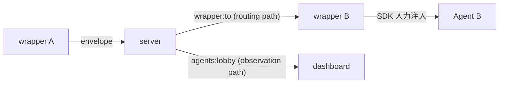

<!-- markdownlint-disable MD033 -->

# エージェント間メッセージング・プロトコル

## Purpose

複数 AI エージェントが kaoiro サーバを介して直接メッセージをやり取り
できるようにするための protocol surface を定める。kaoiro issue #17
本実装の機械的仕様であり、段階的実装計画は
[phase-8-inter-agent-messaging](../plans/phase-8-inter-agent-messaging.md)、
設計判断の背景は kaoiro issue #87 と #17 issuecomment-1359 を参照。

[protocol](protocol.md) の予約追補(同一 `version`)として envelope
`type: "inter_agent_message"` を新設する([ADR-0010](../adr/0010-protocol-precisification.md))。

## Definition

### 全体像

エージェント A の wrapper が `send_to_agent` ツールを呼ぶと、wrapper
は通常の `envelope` イベントで `type: "inter_agent_message"` の
envelope を server へ送る。server は次の 2 系統に分岐する:



- **routing path**: server は `payload.to` を読み、`wrapper:<to>`
  channel に envelope を push する。受信した wrapper は SDK の次
  ターン入力として注入する
- **observation path**: server は通常の `agents:lobby` broadcast にも
  同じ envelope を載せる(operator 限定配信、後述)。dashboard は
  inter-agent message を A・B 両方の log 欄に表示できる

server は payload の意味論(kind / payload テキスト / meta)を解釈
しない。`to` フィールドのみをルーティング目的で参照する(agent 非依存
の原則を保つ最小の構造的アクセス)。

### envelope.type: "inter_agent_message"

[protocol.md](protocol.md) の envelope 共通外枠
(`version`/`agent_id`/`session_id?`/`persona`/`ts`/`seq`/`type`/`state`/`payload`/`ext`)
はそのまま継承。`agent_id` は送信側エージェント、`state` は当該 wrapper
の現在状態(通常 `tool_running`)を据え置く。

新規追加するのは `type` 値と `payload` schema のみ。

| フィールド | 意味 |
|---|---|
| `type` | `"inter_agent_message"` |
| `payload` | 下記 "Inner envelope" 参照 |

### Inner envelope(`payload` schema)

```json
{
  "to": "lab-pc-1.claude-b",
  "conversation_id": "cnv-7f3a1c",
  "turn_number": 3,
  "kind": "propose",
  "body": "ベンチマーク結果を踏まえ、CSV 出力を採用するのはどうか",
  "meta": {
    "done": false,
    "propose_next": "B の同意があれば実装に入る",
    "confidence": 0.7
  },
  "owner": {
    "kind": "user",
    "id": "operator"
  }
}
```

| フィールド | 必須 | 意味 |
|---|---|---|
| `to` | MUST | 宛先 `agent_id`。`[A-Za-z0-9._-]` 制約は protocol 全体と同じ |
| `conversation_id` | MUST | 同一対話を紐付ける識別子。発起側 wrapper が採番(セッション内一意、UUIDv4 ベース) |
| `turn_number` | MUST | 1 起点の正整数。同一 conversation 内で送信ごとに +1。`(conversation_id, turn_number)` で全順序 |
| `kind` | MUST | 下記 9 種 enum |
| `body` | MUST | メッセージ本文(自由テキスト)。意味論はエージェントに任せる |
| `meta.done` | MUST | bool。当該エージェントが対話の終了を提案する場合 true。**両 owner 側エージェントから true で conversation 完了** |
| `meta.propose_next` | MUST | string。次に何を期待するか(空文字可) |
| `meta.confidence` | optional | 0.0〜1.0 |
| `meta.reject_reason` | `kind=reject` 時 MUST | string。提案を拒否する具体的理由 |
| `owner.kind` | MUST | `"user"` または `"agent"` |
| `owner.id` | MUST | owner の識別子。user の場合は接続トークンに紐づく user_id、agent の場合は `agent_id` |

### kind enum(9 種)

意味論の出典・採否判断は kaoiro リポジトリ #17 issuecomment-1359
および vault `(private vault note)`。

| kind | 役割 | 典型ペア |
|---|---|---|
| `request` | 作業依頼 | → `response` |
| `response` | 依頼への結果報告 | `request` ← |
| `query` | 問い(Yes/No・値・意見) | → `inform` |
| `inform` | 情報共有・意見表明・query への回答 | `query` ← または独立 |
| `propose` | 合意候補を出す | → `accept` または `reject` |
| `accept` | propose への賛成 | `propose` ← |
| `reject` | propose への反対(`meta.reject_reason` 必須) | `propose` ← |
| `escalate-to-user` | 人間判断要請(tie-breaker) | → user |
| `done` | 終了申告 | 両 owner-side で揃って完了 |

カバーケース:

- 依頼: `request` → `response`
- 相談: `query` → `inform` のラリー
- 議論: `propose` → `accept` / `reject` → 反対側が `propose`(対案)の
  ラリー → 最終 `propose` に両 owner-side が `accept` + `done`
- 結論不能: 任意の時点で `escalate-to-user`、または下記ハード制限
  超過で自動打ち切り

### conversation owner と tie-breaker

`owner` は対話を起動した主体。Phase 1 では常に user(operator が
明示指示で起動するため)。Phase 3 でエージェント autonomously 起動を
許可した場合のみ `owner.kind: "agent"` が現れる。

- 行き詰まり時の最終判断は owner に集約する
- `owner.kind: "user"` の場合 → server は `escalate-to-user` を受け
  たら dashboard に介入ダイアログを出す(既存 AskUserQuestion 系 UI
  流用)
- `owner.kind: "agent"` の場合 → owner エージェントへ
  `escalate-to-user` の代わりに `escalate-to-owner` ルーティング
  (Phase 3 で確定、本 spec は Phase 1〜2 のみ機械強制)
- 暴走時の停止権限も owner に帰属。owner は conversation 全体を
  キャンセルできる(`cancel` イベント、Phase 2 以降)

### ハード制限(config + 機械強制)

server は conversation 単位で以下の制限を機械的に監視し、超過時に
自動打ち切りする。打ち切り時は当該 conversation の参加 wrapper
全てに合成 envelope(`kind: "escalate-to-user"`、
`body: "<理由>"`、`meta.done: true`)を broadcast し、両 wrapper
は SDK 入力として注入する。

| config キー | 単位 | 既定値(Phase 1) | 用途 |
|---|---|---|---|
| `max_turns` | turn(=メッセージ件数) | 20 | conversation 1 件の対話ターン総数 |
| `max_tokens` | token | 100_000 | 全 body の累積トークン(server 側で粗く近似、`length(body)/3` 切り上げ) |
| `max_wallclock` | ms | 600_000(10 分) | conversation_id 発生から経過時間 |
| `max_concurrent_agents` | agent 数 | 2 | 同一 conversation_id に参加可能な agent 数(Phase 1 は 2 固定、Phase 3 で 3 以上検討) |

config は kaoiro server 設定で agent 単位 / global の二段。global を
agent 単位で上書き可。

### 観測経路(dashboard 表示)

server は inter_agent_message envelope を `agents:lobby` にも
broadcast する。ただし `log` / `result` と同様に **operator 限定配信**
([ADR-0021](../adr/0021-role-information-disclosure-policy.md))。

dashboard は受信時、`agent_id`(送信側)と `payload.to`(受信側)の
両 agent の log 欄に inter-agent message を表示する。表示形式は
クライアント実装で確定するが、最小限以下を満たす:

- 送信側エージェントの log: `→ to <to>: <body>(kind, conversation_id 抜粋)`
- 受信側エージェントの log: `← from <agent_id>: <body>(kind, conversation_id 抜粋)`
- conversation_id でグルーピング可能な視覚要素(同一対話を辿れる)

`log` envelope とは別 type なので、既存の log フィルタ・既読管理と
は独立して扱う。

### Channels イベント増分

新しい channels event は導入しない。既存の `envelope` イベント上で
新 type が運ばれる。server 側の新しい振る舞いのみ:

| 場面 | server の振る舞い |
|---|---|
| wrapper-A から `envelope`(type=inter_agent_message)受信 | (a) `payload.to` で指定された `wrapper:<to>` channel に push、(b) `agents:lobby` に broadcast(operator 限定)、(c) 該当 conversation の turn count / token count / wallclock を更新 |
| ハード制限超過 | 合成 envelope を両 wrapper の `wrapper:<id>` channel + `agents:lobby` に push |
| 未知 `to` agent_id | wrapper-A に `{:error, unknown_agent}` を返す(既存 `instruction` と同様) |
| `payload.to == payload.from(=agent_id)` | server が拒否、wrapper に `{:error, self_routing}` |

### 承認フロー(permission_broker 統合)

wrapper-A が `send_to_agent` ツールを呼ぶ際、wrapper は既存の
`canUseTool` 経路で operator に承認を求める([ADR-0022](../adr/0022-pending-permission-authoritative-source.md))。

- ツール名: `send_to_agent`
- `input` には宛先 `to` / kind / body 抜粋 / `conversation_id` を
  含める(operator が判断するための材料)
- dialog UX は Phase 1 では既存 permission dialog を流用、Phase 2 で
  専用 UI に磨く
- deny した場合、tool 呼び出しは失敗。wrapper-A は SDK に「送信
  拒否」のエラーを返し、エージェントは別の応答を試みる
- 自動承認の仕組み(per conversation_id whitelist)は Phase 2 以降

### 受信側(wrapper-B)の挙動

wrapper-B は `wrapper:<id>` channel で `envelope`(type=inter_agent_message、
agent_id ≠ self)を受信したら、当該 envelope を SDK 次ターンの入力
として注入する。注入形は:

```text
[from <agent_id>] <kind>: <body>

(meta: done=<done>, propose_next=<propose_next>, conversation_id=<conversation_id>, turn_number=<turn_number>)
```

エージェントが返信する場合は `send_to_agent` ツールで応答する。
返信しない場合は通常の応答(`result` envelope)を返し、conversation
は自然消滅(server 側 wallclock タイムアウトで自動 done を付与)。

### envelope.type の予約と version

[protocol.md](protocol.md) の type 一覧に `inter_agent_message` を
**確定追補**として追加する(`version` 据え置き、
[ADR-0010](../adr/0010-protocol-precisification.md) /
[ADR-0015](../adr/0015-protocol-version-stamping.md))。

| type | 状態 | payload |
|---|---|---|
| `inter_agent_message` | **確定**(本 spec) | 上記 "Inner envelope" 参照 |

## Constraints

- MUST: server は payload の意味論(kind / body / meta)を解釈しない。
  `to` フィールドのみをルーティング目的で参照する
- MUST: `inter_agent_message` envelope は **operator 限定配信**
  ([ADR-0021](../adr/0021-role-information-disclosure-policy.md))。
  viewer には完全除去する
- MUST: `send_to_agent` ツール呼び出しは Phase 1 では permission_broker
  の都度承認を経由する。autonomous な承認スキップは Phase 3 まで導入
  しない
- MUST: server は config のハード制限(`max_turns` / `max_tokens` /
  `max_wallclock` / `max_concurrent_agents`)を機械的に強制する
- MUST: `meta.done` は両 owner-side エージェントから true で
  conversation が完了。片側だけでは done としない
- MUST: `payload.to == agent_id` の自己ルーティングは server が拒否
- MUST: `kind: "reject"` の envelope は `meta.reject_reason` を空でない
  string で持つ
- SHOULD: `conversation_id` は UUIDv4 ベースで採番、衝突回避と
  グルーピング容易性を両立する
- SHOULD: `body` は protocol 全体の他フィールド同様 wrapper 側で
  16 KB を超える場合切り詰める(`truncated: true` を `meta` に付与)

## Open Questions

- conversation の永続化方針(server 再起動越えで conversation_id を
  保持するか、Phase 4 / ADR-0014 範疇との接続)— Phase 2 で確定
- メッセージフィルタ(kaoiro issue #18)の挿入位置 — Phase 2 で
  検討開始
- `owner.kind: "agent"` 起動時の自動エスカレーション規則 —
  Phase 3 / kaoiro issue #87 待ち

## See Also

- 関連 specs: [protocol](protocol.md)(envelope 共通基盤)、
  [subagent-tasks](subagent-tasks.md)(類似の予約 type パターン)、
  [plugin-model](plugin-model.md)(将来のフィルタ挿入位置)、
  [threat-model](threat-model.md)(operator 限定配信の根拠)
- 関連 plans: [phase-8-inter-agent-messaging](../plans/phase-8-inter-agent-messaging.md)
- ADRs: [0010 protocol-precisification](../adr/0010-protocol-precisification.md),
  [0015 protocol-version-stamping](../adr/0015-protocol-version-stamping.md),
  [0021 role-information-disclosure-policy](../adr/0021-role-information-disclosure-policy.md),
  [0022 pending-permission-authoritative-source](../adr/0022-pending-permission-authoritative-source.md)
- kaoiro issue #17(本実装の起点)、#18(メッセージフィルタ)、
  #87(調査の傘 issue)
