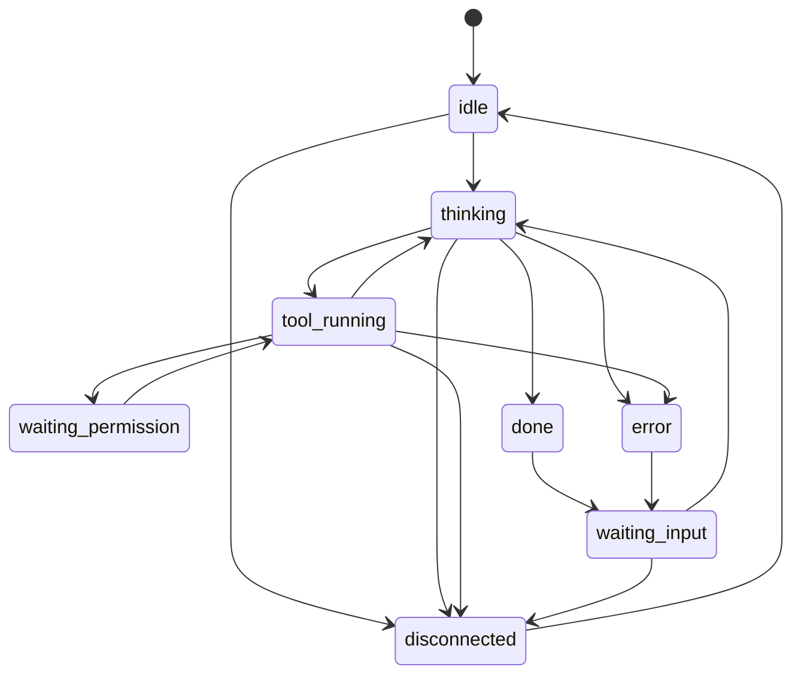

<!-- markdownlint-disable MD033 -->

# 共通イベント・プロトコル(v0)

## Purpose

ラッパー/サーバ/クライアント間でやり取りする共通イベントの**外枠**を定義する。
**生きた仕様**であり、中身は各フェーズで詰める(完全確定は目指さない)。差し込み
境界の背景は [plugin-model](plugin-model.md)。

## Definition

### 設計意図

- このエンベロープはアダプタ/フィルタを差し込む境界そのもの。外枠を早めに固定
  すると拡張が楽になる。
- フィルタは `payload` / `ext` だけを触り、外枠には依存しすぎない。
- 状態の**導出**はラッパー(アダプタ)が行い `state` を確定して送る。サーバは
  受け取った `state` を保持・配信するだけ(agent 非依存)。

### エンベロープ v0(たたき台)

```json
{
  "version": "0",
  "agent_id": "lab-pc-1/claude-a",
  "persona": { "id": "mio", "name": "澪", "sprite_set": "mio" },
  "ts": "2026-06-04T11:55:00Z",
  "type": "state_change",
  "state": "tool_running",
  "payload": { "label": "Edit src/foo.ts", "summary": "ファイルを編集中" },
  "ext": {}
}
```

| フィールド | 意味 | 備考 |
|---|---|---|
| `version` | エンベロープのバージョン | 文字列。後方互換の判断に使う |
| `agent_id` | エージェントの**安定識別子** | 設定で固定。再起動をまたいで同一 |
| `persona` | 担当ペルソナ | id/表示名/立ち絵セット。ラッパー初期設定で指定 |
| `ts` | イベント発生時刻 | ISO8601(UTC)。ホスト跨ぎの時刻ズレに注意 |
| `type` | イベント種別 | `state_change`/`log`/`permission_request`/`result` 等(未確定) |
| `state` | 状態機械の現在状態 | 下記参照 |
| `payload` | 種別ごとの本体 | 型は `type` に依存(未確定) |
| `ext` | フィルタが付ける拡張プロパティ | 例: `emotion`,`cost`,`danger`。初期は空 |

### 同一性とペルソナ(マスト)

- `agent_id` は設定で固定する安定 ID(実行時生成の揮発 ID は使わない)。
- `persona`(id/表示名/立ち絵)はラッパー初期設定で指定。どのホスト/プロセスが
  どのペルソナを担当するかはユーザ指定。
- サーバ/クライアントは `agent_id`(+ `persona.id`)をキーに表示・機嫌を持続。
- 決定詳細は
  [ADR-0003](../adr/0003-persona-identity-persistence.md)。将来 `persona` に
  描画種別(静的差分/アニメ/3D)を持たせる
  ([ADR-0004](../adr/0004-client-rendering-staged.md))。

### 状態機械の状態セット v0(たたき台)

実用ゴール (A) の中核。Agent SDK のメッセージから導出する。SDK の**確定済み
メッセージ/コールバック仕様と導出マッピング**は
[agent-sdk-events](agent-sdk-events.md) を参照。

| 状態 | 意味 | 導出元(SDK) | 表情の方向性(将来) |
|---|---|---|---|
| `idle` | 起動済み・未着手 | `SDKSystemMessage`(init) | 通常 |
| `thinking` | モデルが生成中 | `SDKAssistantMessage`(text/thinking) | 考え中 |
| `tool_running` | ツール実行中 | `SDKAssistantMessage`(tool_use)〜 `SDKUserMessage`(tool_result) | 集中 |
| `waiting_permission` | ツール許可待ち | `canUseTool` 呼び出し中(Promise 保留) | こちらを見て待つ |
| `waiting_input` | ターン完了・次の指示待ち | `SDKResultMessage` 後、ストリーミング入力待ち | こちらを見て待つ |
| `done` | ターン完了(瞬間) | `SDKResultMessage`(success) | 喜ぶ(→ `waiting_input`) |
| `error` | エラー/リトライ | `SDKResultMessage`(error_*/is_error) | 困り顔 |
| `disconnected` | ラッパー接続断 | サーバ側で導出 | 不明/不在 |

制御(穴1)も確定: ストリーミング入力(`AsyncIterable<SDKUserMessage>`)+
`Query.interrupt()` + `canUseTool` が同一 Query で完結する
([agent-sdk-events](agent-sdk-events.md))。



## Constraints

- MUST: `agent_id` は安定 ID。MUST: 状態導出はラッパー側。

## Open Questions

- [protocol-precisification](../open-questions/protocol-precisification.md)
  — `type`/`payload` 型体系、方向別メッセージ種別、バージョニング方針。

## See Also

- 関連 specs: [architecture](architecture.md), [plugin-model](plugin-model.md)
- ADRs: [0001](../adr/0001-agent-sdk-integration.md),
  [0003](../adr/0003-persona-identity-persistence.md)
