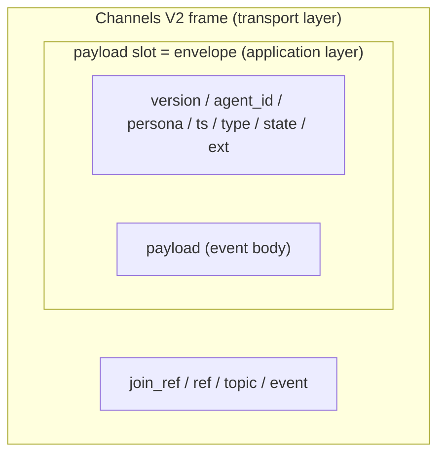
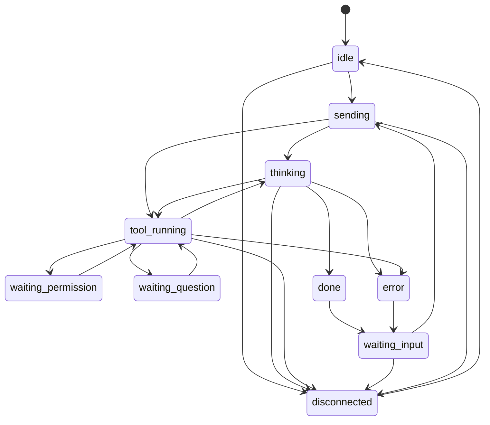

<!-- markdownlint-disable MD033 -->

# Common event protocol (v0)

## Purpose

Define the **outer envelope** for common events exchanged among wrapper, server,
and client. This is a **living specification** whose details are refined by
phase rather than frozen all at once. The insertion boundary is described in
[plugin-model](plugin-model.md).

## Definition

### Terms and hierarchy

An **envelope** is the shared JSON object wrapping one kaoiro event. Like an
addressed letter, common metadata (`agent_id`/`persona`/`ts`/`type`/`state`,
etc.) wraps the “contents” (`payload`). The same shape crosses wrapper, server,
and client boundaries, and the server can retain and deliver it without
interpreting contents (agent-independent).

| term | meaning |
|---|---|
| envelope | Common JSON wrapping one complete event, with the outer keys below. |
| outer frame keys | Fixed keys directly under the envelope: `version`/`agent_id`/`session_id?`/`persona`/`display_name?`/`ts`/`type`/`state`/`payload`/`ext`. Fixed in v0 (`session_id?` is optional). `display_name` (issue #209 D19) is a mutable name independent of canonical, session-stable `persona.name`; runtime rename changes only the former. Optional preserves old-wrapper compatibility. |
| `payload` | Event contents for each `type`; see “Types and payload” ([ADR-0010](../adr/0010-protocol-precisification.md)). |
| `ext` | Extension area added by filters; the core does not depend on its contents. |

**Transport-layer distinction (important)**: the envelope is an application-
layer object. On the wire it is stored **whole in the payload slot** of a
Phoenix Channels V2 frame `[join_ref, ref, topic, event, payload]`. The two
“payload” terms differ: the frame payload is the complete envelope, while the
envelope payload is the event body.



### Design intent

- The envelope is the boundary where adapters and filters plug in; fixing the
  outer shape early makes extension easier.
- Filters touch only `payload` / `ext` and should not depend heavily on outer
  keys.
- The wrapper (adapter) **derives** state and sends a confirmed `state`; the
  server only retains and delivers that value (agent-independent).

### Envelope v0

```json
{
  "version": "0",
  "agent_id": "lab-pc-1.claude-a",
  "session_id": "f47ac10b-58cc-4372-a567-0e02b2c3d479",
  "persona": { "id": "mio", "name": "澪", "sprite_set": "mio" },
  "ts": "2026-06-04T11:55:00Z",
  "seq": 42,
  "type": "state_change",
  "state": "tool_running",
  "payload": { "label": "Edit src/foo.ts", "summary": "ファイルを編集中" },
  "ext": {}
}
```

| field | meaning | notes |
|---|---|---|
| `version` | envelope version | String, used for backward-compatibility decisions |
| `agent_id` | **stable agent identifier** | Fixed by configuration and stable across restarts; charset `[A-Za-z0-9._-]` (no `/` for topic/URL safety) |
| `session_id` | running SDK session ID (optional) | Claude Agent SDK conversation unit; wrapper reports the real ID from init/first result. Separate from agent_id (one agent_id may have N session IDs); resume target ([ADR-0014](../adr/0014-session-resume-and-restore.md)). Omit when not yet known (new key, same version). |
| `persona` | assigned persona | ID, display name, and sprite set configured by the wrapper. |
| `ts` | event timestamp | ISO8601 (UTC); account for cross-host clock skew. |
| `seq` | wrapper monotonic sequence | Positive integer starting at 1 per process ([ADR-0011](../adr/0011-phase3-reliability-and-auth.md)); ordering key `(agent_id, seq)` + `ts`. It resets on restart, so server latest-state selection remains **receive order** (last-write-wins). |
| `type` | event type | Closed enum; see “Types and payload”. |
| `state` | current state-machine state | See below. |
| `payload` | body for the type | Shape depends on `type`; see “Types and payload”. |
| `ext` | filter-added extension properties | Examples: `emotion`, `cost`, `danger`. Implemented fields include `cost` (cumulative USD, #8, attached to Claude Code results), `model`, `cwd`, `context` (`{used_tokens,max_tokens,used_percentage}`), `context_budget` (`{work_budget_tokens,work_budget_percentage}`; the first uses the configured soft-work-budget token denominator against the raw window, the second may exceed 100%, issue #254), `rate_limits` (`{<window>:{status,utilization,resets_at}}`, windows such as `five_hour`/`seven_day`), `slash_commands` (`string[]` of available slash-command names for client `/` completion, #34), and `models` (`[{value, display_name, description, effort_levels?, default_effort?, resolved_model?}]` for selectable models and effort ranges). `models.value` is the `setModel` alias; `effort_levels` is omitted for models without effort support; `default_effort` is an automatic candidate for LaunchDialog/model switching and one of `effort_levels` (phase-16, [ADR-0035](../adr/0035-codex-model-catalog-and-mid-session-switch.md)); `resolved_model` copies upstream `ModelInfo.resolvedModel` as the canonical wire model ID (the target of aliases such as `default`, read-only metadata, absent = unknown; #54 / [ADR-0020](../adr/0020-dashboard-battery-included-client.md)). Also attach `permission_mode` (`'default'\|'acceptEdits'\|'bypassPermissions'\|'plan'\|'dontAsk'\|'auto'`, current Claude Code permission mode, #57), `fast_mode` (`'off'\|'cooldown'\|'on'`, #57), and `models_error` (boolean indicating bounded `supportedModels()` retries exhausted with no cache; `ext.models` remains valid at the bootstrap floor, and `refresh_models` clears the retry counter; [ADR-0037](../adr/0037-claude-model-catalog-live-refresh.md) F6). `context_budget` is an unknown-key addition within the versioned envelope, not a new message (ADR-0015). Attach `pending_permission` (`{request_id, tool_name, input?, truncated?, ts}`, #59 / [ADR-0022](../adr/0022-pending-permission-authoritative-source.md)) to `state_change` as the authoritative source while `waiting_permission`; likewise attach `pending_question` (`{request_id, questions, ts}`, [ADR-0027](../adr/0027-askuserquestion-envelope.md)) while `waiting_question`. Other fields are empty initially. **`ext` is operator-only** and removed for viewers because it can contain sensitive values (issue #46, [threat-model](threat-model.md) / [ADR-0021](../adr/0021-role-information-disclosure-policy.md)). |

#### Two-axis `ext.permission` (2026-07-10, [ADR-0033](../adr/0033-permission-model-dual-axis.md))

With the Codex adapter ([ADR-0032](../adr/0032-codex-adapter.md)), represent the
common permission abstraction at agent level as two-axis `ext.permission` (do
not duplicate axes inside `pending_permission`; ADR-0033 F1):

- `ext.permission`: `{ sandbox, approval, enforcement? }`, attached to `state_change`
  - `sandbox`: `"read-only" | "workspace-write" | "danger-full-access"`
  - `approval`: `"untrusted" | "on-request" | "on-failure" | "never"`
    (`on-failure` is an upstream deprecated alias and kaoiro wrappers do not emit it)
  - `enforcement` (ADR-0057 F4/F4c): `"os" | "mode" | "advisory"` — how the
    sandbox axis is actually enforced, so the dashboard never branches on
    engine name; only `"advisory"` (Antigravity) renders a permanent badge

The Claude adapter has a six-mode → two-axis mapping table (ADR-0033 F2,
display approximation) and stamps `enforcement: "mode"`. The Codex adapter
projects its spawn sandbox_mode and fixed `approval: "never"` because exec
has no approval flow (ADR-0033 F3), stamping `enforcement: "os"` (its
sandbox is the real OS sandbox). The Antigravity adapter stamps
`enforcement: "advisory"` because its `--sandbox` flag was measured to have
no effect; the wrapper enforces the cell by inspecting tool arguments,
never by the OS (ADR-0057 F4).

**Deprecation of `ext.permission_mode`**: `ext.permission` is the successor.
Emit both fields for one release window, then remove `permission_mode` in the
next release (ADR-0033 F1, D-A). New clients read only `ext.permission`.

#### `ext.engine` (2026-07-10, [ADR-0032](../adr/0032-codex-adapter.md) F4a)

Engine identifier attached to `state_change`:

- Value: `"claude-code" | "codex" | "antigravity"` (same set as host
  `capabilities`).
- Source: the engine adapter adds it at startup and includes it on every later
  `state_change`.

**Note**: Use `ext.engine` only for display (engine badge) and log/telemetry
identity. **Never infer feature availability from the engine name** ([ADR-0034](../adr/0034-session-capabilities-advertisement.md) F3); use
`ext.session_capabilities` for add/remove decisions.

#### `ext.model_source` / `ext.effort_source` (2026-07-11, [ADR-0032](../adr/0032-codex-adapter.md) F4bc addendum, phase 15)

Source vocabulary indicating how model/effort values were chosen. Because it
communicates provenance, **preserve an explicit source even after SDK
confirmation**.

- Value: `"launch" | "env" | "config" | "default"` (`ModelSource` type)
  - `launch` — SpawnMessage.model / SpawnMessage.effort.
  - `env` — engine-specific environment (`KAOIRO_CLAUDE_CODE_DEFAULT_MODEL` /
    `KAOIRO_CODEX_DEFAULT_MODEL`).
  - `config` — `model` / `effort` in `kaoiro.config.json`.
  - `default` — no explicit value; delegate to the engine account / SDK default.
- Resolution priority: `launch > env > config > default`.
- Startup stamp: **when explicitly supplied**, stamp `model` and
  `model_source=launch|env|config` immediately (optimistic stamp, phase-15
  [15-4b/4c]). SDK confirmation may update only the value (for example alias
  expansion in Claude), never the source; replacing it with `default` would
  falsely claim an account default.
- **When unspecified**: stamp neither `model` nor `model_source` at startup;
  the first SDK report emits `model` with `model_source="default"`.
- Effort follows the same semantics (`ext.effort_source`): without an explicit
  startup value the wrapper does not know the SDK default and waits for its
  report.

#### `ext.session_capabilities` (2026-07-11, [ADR-0034](../adr/0034-session-capabilities-advertisement.md) F1/F2)

An envelope field expressing feature availability per session. It absorbs
differences (auth mode, plan tier, wrapper implementation) that engine names
cannot represent.

- Shape (`SessionCapabilitiesExt`):
  - `supports_attachments: boolean` — whether attachments are accepted (false disables the Composer attach button and shows a “not supported in this session” tooltip).
  - `attachment_types?: ("image")[]` — optional attachment restriction. **Absent preserves legacy behavior with no type restriction**; when present, only listed types are allowed. SDK block names are not exposed. Codex advertises `supports_attachments: true, attachment_types: ["image"]`, limiting picker/paste/drop to images; Claude omits the field and accepts all legacy types.
  - `supports_user_input_dialog: boolean` — availability of `ask_user_question`.
  - `user_input_modes?: string[]` — conditions when dialog firing is limited to a mode or sandbox (empty/absent = unconditional).
- **Stamp timing**: from the first `state_change` immediately after spawn (do not wait for a session-init event; Codex `thread.started` may not occur before the first turn, so waiting would show a false fail-closed default).
- Unstamped means conservatively “feature unavailable” (fail-closed); UI decisions use only this field.
- `supports_model_switch: boolean` — whether mid-session `set_model` is accepted (phase 16, [ADR-0035](../adr/0035-codex-model-catalog-and-mid-session-switch.md) F4).
- `supports_effort_switch: boolean` — whether mid-session `set_effort` is accepted. UI shows/hides model and effort selectors from each boolean, never from engine name (ADR-0034 F3).
- `supports_session_reset: boolean` / `session_reset_modes?: ("new" | "clear")[]` — whether the operator can run `session_reset` and which modes are available. This is separate from exposing the agent's `request_session_reset` tool, currently Claude-only (ADR-0043).
- `supports_context_usage: boolean` — whether this session provides an authoritative context-window snapshot in `ext.context` (phase 21, [ADR-0040](../adr/0040-context-usage-capability.md)). UI has three states:
  - **absent** — unstamped capability from an old wrapper during rolling upgrade; hide the context row rather than treating it as unsupported.
  - **explicit `false`** — adapter cannot provide an exact snapshot (currently Codex); show “unsupported”.
  - **explicit `true`** — adapter promises to stamp `ext.context`; show a meter when it arrives and a loading placeholder before then.
- Claude is `true`: SDK `getContextUsage()` can return exact `totalTokens`/`maxTokens`/`percentage` (best-effort even immediately after init; failures leave “loading”). Codex is `false`: `turn.completed.usage.input_tokens` is per-turn input only and shrinks on compaction, excluding reasoning/output, so it is not context usage (see [codex-sdk-events](codex-sdk-events.md)).

#### `ext.resume_snapshot` / `ext.effective` / `ext.resume_drift` (2026-07-11, [ADR-0032](../adr/0032-codex-adapter.md) F4bc + [ADR-0033](../adr/0033-permission-model-dual-axis.md) F4 addendum, phase 15)

Envelope extensions for D8 (resume drift detection), detecting unintended model
or permission substitutions on the resume path.

- `ext.resume_snapshot` (`ResolvedSnapshotExt`): the **last effective values** in
  the source session—`model`, `model_source`, `effort`, `effort_source`,
  `permission_mode`, `sandbox`, `network_access`, and `approval` (Antigravity's
  launch-fixed approval axis, [ADR-0057](../adr/0057-antigravity-adapter.md)
  F4c; unset means absent).
  **Important**: use the last effective values, not spawn values. If an operator
  changed model, effort, or permission mode mid-session, snapshot the latest
  values so an intentional change does not trigger a resume drift.
- `ext.effective` (`ResolvedSnapshotExt`): values forced by this host, same shape.
- `ext.resume_drift` (`ResumeDriftExt`): per-field differences between the two
  snapshots as `Array<{field, prev, now}>`; an empty array means no difference,
  absent means a fresh spawn rather than a resume.
- On a difference, the wrapper warns on stderr and AgentDetail shows a drift badge.

#### `ext.pending_model` / `ext.pending_effort` / `ext.switch_error` / `ext.effort_reset` (2026-07-13, [ADR-0035](../adr/0035-codex-model-catalog-and-mid-session-switch.md) F1–F3, phase 16)

Represent the pending/effective/rollback stages of a mid-session model or effort
switch in the envelope. **The current turn is unchanged; apply from the next
turn** ([ADR-0035](../adr/0035-codex-model-catalog-and-mid-session-switch.md) F1).

- `ext.pending_model?: string` — value requested by `set_model` but not yet
  applied as the next turn's `turn_context.model`; promote it to
  `ext.effective.model` and clear `pending_model` at the next turn. AgentDetail
  shows `pending: <display_name>`.
- `ext.pending_effort?: string` — same semantics for effort.
- `ext.effective` (phase 16) also carries the **current effective model/effort**
  during the session, promoting pending values at the next turn boundary and
  retaining them on subsequent `state_change` events.
- `ext.effort_reset?: boolean` — when the old effort is not in the new model's
  `effort_levels`, report that it was reset to `default_effort` instead of
  silently downgrading ([ADR-0035](../adr/0035-codex-model-catalog-and-mid-session-switch.md)).
  UI states that the old effort was unavailable.
- `ext.switch_error?: {kind: "model" | "effort", requested: string, reason: string, rolled_back_to?: string}` — one-shot report when the post-switch turn
  fails loudly (400/404, etc.); clear it at the next turn boundary (one stamp,
  ADR-0035 F3). `rolled_back_to` is the previous pinned last-known-good value
  (normally the prior turn's effective value). UI reports failure and rollback;
  never put the failed value in effective or resume snapshots (phase-16 16-7).

**Operator drift filter for `resume_drift`** (phase-16 addendum, [ADR-0035](../adr/0035-codex-model-catalog-and-mid-session-switch.md) F2): do not include
model/effort changes intentionally made by an operator mid-session (intentional
change is not drift). Consult the adapter's `modelRollbackPinned` flag and
switch history; emit drift only for an unintended substitution immediately
after resume.

### Types and payload (v0 settled)

`type` is a closed enum. The v0 payload for each type is defined below; details
are refined incrementally ([ADR-0010](../adr/0010-protocol-precisification.md)).

| type | status | payload |
|---|---|---|
| `state_change` | **settled** | `{ label?: string, summary?: string }`; optional short destination label (for example `"Edit src/foo.ts"`) and human-readable summary. |
| `log` | **settled** | `{ kind: "assistant" \| "tool_use" \| "tool_result" \| "user" \| "system", text?, tool_name?, tool_use_id?, input?, output?, truncated? }`. Relays agent output: assistant model text; tool_use call; tool_result output; user echoes operator instructions (#31); system is a wrapper-observed session event such as compaction or reset (phase-28 A1, #158). Never substitute assistant for system or wrapper notices appear as model replies. `tool_use_id` links use/result when supplied by the SDK (#40). UI collapses tool I/O by default; wrapper truncates long text (`truncated: true`). **Operator role only** ([threat-model](threat-model.md), [ADR-0012](../adr/0012-response-display-and-dashboard-scope.md)). |
| `permission_request` | **settled** | `{ request_id: string, tool_name: string, input?: object, truncated?: boolean }`. Wrapper-generated session-unique request ID ([ADR-0011](../adr/0011-phase3-reliability-and-auth.md)); tool input is clipped to about 16 KB with `truncated: true` and follows [threat-model](threat-model.md). State is `waiting_permission`. This is an initial notification only; authoritative pending state is `state_change.ext.pending_permission` ([ADR-0022](../adr/0022-pending-permission-authoritative-source.md)). Keep the envelope for compatibility and “new pending” notification, with payload/ext fields synchronized. New clients should read ext. Deliver operator-only; viewers receive a synthetic `state_change(waiting_permission)` with empty payload/ext ([ADR-0021](../adr/0021-role-information-disclosure-policy.md)). |
| `question_request` | **settled** | `{ request_id: string, questions: [...] }` structured SDK `AskUserQuestion` data (one to four questions, each with two to four options). Authoritative pending state is `state_change.ext.pending_question` ([ADR-0027](../adr/0027-askuserquestion-envelope.md)); retain this initial notification for compatibility with synchronized `request_id`/`questions`/`ts`. Answers use directional `question_response`. Operator-only; viewers receive synthetic `state_change(waiting_question)` with empty payload/ext ([ADR-0021](../adr/0021-role-information-disclosure-policy.md)). |
| `result` | **settled** | `{ text?: string, is_error?: boolean, error_subtype?: string, error_detail?: string, error_code?: string, error_summary?: string, recovery_hint?: string }`. Final response when a turn completes. `is_error` distinguishes error termination; `error_subtype` carries the SDK termination subtype and `error_detail` relays the SDK body to the client (#123). Claude Code uses the closed vocabulary `error_max_turns` / `error_during_execution` / `error_max_budget_usd` / `error_max_structured_output_retries`; other values are rounded to `error_during_execution`, **including a `success`-subtype result that still carries `is_error: true`** (an SDK-classified API error — e.g. authentication failure — surfacing as error text in the success payload's own `result` field rather than an `errors[]` array; issue #287). `error_detail` joins `SDKResultError.errors` with `"; "` (or `stop_reason` when absent); it is **not summarized or masked, but is not raw either**—clip to 16,384 UTF-8 bytes before sending (`clipText`, as for `log`; no `truncated` flag). `error_code` / `error_summary` / `recovery_hint` (issue #287) are additive safe fields, set only when the wrapper's underlying SDK classifies the failure at the assistant/API level (independent of `error_subtype`, which is the turn-termination subtype): `error_code` is the SDK's own error-class string (e.g. `authentication_failed`) forwarded as-is, including a value the wrapper does not yet recognize; `error_summary`/`recovery_hint` are built by the wrapper from a closed, wrapper-owned code -> text table and contain **no raw SDK text at all**, so the client may render them directly with no further masking or clipping. **Display priority**: when `error_summary` is present the client shows it as the primary line in place of a generic `error_subtype` label; `error_detail` remains available as an optional detail-expansion (e.g. a collapsed `<details>`) rather than an always-on second line. All three are absent on success and absent whenever the wrapper has no code for the failure. Relaying the error body follows [ADR-0016](../adr/0016-error-body-relay.md); its single `error_message` proposal was not implemented, and the wire uses subtype plus body instead (the ADR's proposal to send the last error before wrapper process exit is also unimplemented). **The Codex adapter normally omits this subtype because its SDK has no such concept.** If resume failure detail matches a rollout-corruption candidate and full-file validation confirms it, create a backup, remove only invalid lines, validate every line with at least one non-empty entry, then atomically replace the file (issue #262). On repair success, retry the same resume immediately and return the successful result. If there are zero valid entries or backup/repair/revalidation fails, leave the original untouched, return `error_rollout_corrupted`, and skip later resume attempts until manual intervention. **When the candidate does not match, or the rollout is normal/unresolved, omit `error_subtype` and follow the normal `is_error: true` path.** State becomes `waiting_input` after `done`/`error`; a `success`-subtype `is_error: true` result (above) emits `error`, never `done` (issue #287). Total USD cost is attached in `ext.cost` (#8). As with `log`, **operator-only delivery** ([ADR-0012](../adr/0012-response-display-and-dashboard-scope.md)). |
| `task` | **settled** | Dedicated type notifying subagent/workflow start, update, and completion (implemented—[subagent-tasks](subagent-tasks.md) stages 1–3, issue #170). `{ kind: "started" \| "updated" \| "completed", agent_id, task_id, task_type, status, subagent_type?, workflow_name?, description?, usage?, last_tool_name?, summary?, skip_transcript? }`. `kind` is the lifecycle event; `status` is coarse (`running`/`completed`/`failed`/`stopped`); `task_type` is an extensible enum (SDK values `local_agent`/`local_workflow`/`local_bash` pass through unchanged). `tasklist` is an additional single entity carrying the agent's complete todo list in optional `items`, with whole-list replacement ([ADR-0049](../adr/0049-tasklist-on-task-envelope.md)); unknown values fall back to generic display. `task_id` is limited to 256 bytes at ingress (**source of truth**: server `WrapperChannel.@max_task_id_field_bytes`; M1 round-3 fix, issue #170). In the task snapshot wire, `task_id` appears both as the payload value and as the outer key of the `tasks` map, so an unlimited length could exhaust the snapshot byte budget with few envelopes; ADR-0047 F2 does not state this cap and this row is authoritative. Tasks are independent of the parent `state_change` and reference the parent `agent_id`. `kind=updated` is throttled by the wrapper (three seconds plus either a token delta of 500 or a tool-name change; `started`/`completed` are immediate). Later connections receive the active set under `task_snapshot.tasks`. **Operator-only**: viewers receive no task events and their join always has `tasks: {}`; this uses the existing server gate for operator-only types (`log`/`result`/`hosts`) and adds no new branch ([ADR-0021](../adr/0021-role-information-disclosure-policy.md) + [ADR-0048](../adr/0048-task-aggregation-delivery.md) addendum). ([ADR-0019](../adr/0019-subagent-workflow-entity-and-task-envelope.md) / [ADR-0047](../adr/0047-task-envelope-schema.md) / [ADR-0048](../adr/0048-task-aggregation-delivery.md)). `version` remains unchanged for this addendum. |
| `attach_rejected` | **settled** | `{ upload_id, reason, detail? }`. Rejection of one upload (wrapper validation at `attach_close`, SDK error, or interrupt). The reason enum is defined by [file-upload](file-upload.md): `size_over` / `mime_denied` / `count_over` / `timeout` / `interrupted` / `unfittable_image` / `unfittable_pdf` / `text_too_large` / `total_request_over` / `sdk_error`. **Operator-only delivery** (allow-list, [ADR-0021](../adr/0021-role-information-disclosure-policy.md)). The aggregate specification is [file-upload](file-upload.md), with rationale in [ADR-0025](../adr/0025-file-upload-wire-and-wrapper-rendering.md). `version` remains unchanged for this addendum. |
| `instruction_rejected` | **settled** | `{ attachment_ids?, reason, detail? }`. Rejection of the whole instruction (aggregate limit, SDK error, interrupt, etc.). The reason enum and delivery gate are the same as `attach_rejected`; `version` remains unchanged. |
| `inter_agent_message` | **settled** | Conversation message from agent A to B. Payload has `to` / `conversation_id` / `turn_number` / `kind` (nine-value enum) / `body` / `meta {done, propose_next, confidence?, reject_reason?}` / `owner {kind, id}` / `error? {code, message}`. `error` is an optional addendum sent back to the sender when the peer cannot respond (`kind` reuses `inform`; presence of `error` distinguishes it, #127). The server routes by `to` and broadcasts observations without interpreting semantics; carve-outs are structural `error` validation, synthesizing `code=reconnecting` / `code=disconnected` on wrapper disconnect, and synthesizing an error-free `reconnected` inform after an exact-token return. The normative text is [protocol-inter-agent](protocol-inter-agent.md). **Operator-only delivery**; `version` remains unchanged. |
| `external_message` (reserved) | **reserved** | Discord message with an external human (`direction: outbound\|inbound`). Payload may contain `channel` / `to`\|`from` / `conversation_id` / `turn_number` / `body` / `meta`, etc. The server routes by `to` to discord-wrapper without interpreting semantics. The inbound `ext.interpretation` is attached by the discord-wrapper filter. Normative text is [protocol-external-human](protocol-external-human.md), implementation [phase-9](../plans/phase-9-external-human-messaging.md). **Operator-only delivery**; `version` remains unchanged. |
| `session_boundary` | **settled** | `{ mode: "new" \| "clear", request_id: string, ts, previous_session_id?: string, to_session_id?: string \| null }`. Session-lifecycle marker for `/new` and `/clear`. The normal `envelope` path broadcasts it; `/new` appends to existing history and `/clear` reduces that agent's history to one marker row (ADR-0036 F3 restoration, 2026-07-24). `history_reset` is resume-replay-only and neither command emits it. For lazy Codex allocation, `to_session_id: null` is patched in the first envelope. Viewer payload is sanitized to `{ "mode" }`. |
| `refresh_models_result` | **settled** | `{ request_id: string, ok: boolean, reason?: string, models_count?: number }`. Wrapper completion report for the operator's `refresh_models` ([ADR-0039](../adr/0039-engine-catalog-live-probe.md) F9 v2). `agent_id` is in the outer envelope and is **not duplicated**. `reason` appears only on failure and shares the engine-catalog probe vocabulary (`auth_failed` / `spawn_failed` / `cli_error` / `invalid_output` / `timeout` / `unsupported_engine`; non-Claude adapters no-op the control and return `unsupported_engine`). `models_count` is a success-only size signal; the updated catalog is carried by the immediately preceding `state_change.ext.models`. This envelope is transient: the server does not put it into `AgentStates`, and the client special-dispatches it before normal envelope handling. **Operator-only delivery**. |

### `task_type: "tasklist"` addendum (issue #178, ADR-0049 F4)

In addition to the general `task` rules, an agent's own todo is always the single entity
`{ agent_id, task_id: "tasklist", task_type: "tasklist" }`. The reserved word is bidirectional:
when `task_type` is `tasklist`, `task_id` must be `tasklist`, and vice versa.
The server rejects either mismatch. This prevents child task IDs from being used for this
entity and prevents child tasks from using the reserved ID.

The payload is `{ kind: "updated", status: "running", items, omitted? }`.
`items` is a whole-list snapshot of `{ text: string, status: "pending" | "in_progress" | "completed" }`,
with the latest snapshot replacing the whole list (LWW). Do not send `kind: "completed"`
when all items are complete. `items: []` is a valid replacement meaning that the current
todo is empty; retain the entity until its parent wrapper leaves. The dashboard must not
show a float for an empty list (avoiding a meaningless `0/0`), but must not delete the
entity from state.

The wrapper sends at most 50 items in source order, normalizing each `text` to at most
256 UTF-8 bytes and the `items` JSON to at most 16,384 bytes. If later source items exist,
it must include `omitted: { count, completed }`, so the operator can see that the detail is
partial and how many items are complete overall. The server defensively validates the same
limits and rejects violations; normal over-limit input is made displayable by wrapper normalization.

`tasklist` is outside the three-second/token/tool-name throttle used for child-task
`kind=updated`. Todo changes have no later token/tool signal to flush, so that throttle
could permanently lose updates. The wrapper de-duplicates only consecutive snapshots with
identical content and sends changed snapshots immediately. Claude Code `TodoWrite` maps
`content` and the three-valued status. `activeForm` is Claude-local UI text; the wire item
settled by ADR-0049 contains only text and status, so it is not sent. Showing it later
requires a protocol extension rather than an implicit field addition. Codex
`todo_list.completed: boolean` maps `false -> pending` and `true -> completed`.
Both cover only the parent thread's list. On socket reconnect, wrapper transport resends
active `task` entities with a fresh seq, so they can be restored even after the old channel
terminates and purges the server task table, without tasklist content de-duplication blocking it.
The resend cache is capped at `5,000` entities / JSON `6,000,000` bytes. This prevents
crashed/killed child tasks that never send `completed` from remaining forever; on overflow,
the least recently updated child entities leave the cache and the wrapper warns on stderr.
The parent `tasklist` snapshot is retained while any other eviction target exists. This is
a local-memory bound for reconnects, not a substitute for server-side TaskStates ingress/byte
bounds across multiple wrappers.

### Directional message types (v0 settled)

Channel event names and contents. Topics are `wrapper:<agent_id>` for wrappers and
`agents:lobby` for clients.

**For the client → server, server → wrapper, and server → runner rows completed in stage 1,
`version` is a common flat outer key and is not repeated in each payload column**
([ADR-0015](../adr/0015-protocol-version-stamping.md)); this is the same treatment as not
repeating envelope outer keys in every `type` row. A row explicitly mentioning `version`
does so only for a producer/domain-specific note; omission does not mean the stamp is absent.
The complete coverage and the permanent `attach_chunk` exception are normative in the
"version inventory" below.

| Direction | Event | Contents |
|---|---|---|
| wrapper → server | `envelope` | Full envelope. Only `inter_agent_message` receives an `{ ingress_stamp: [us, seq] }` acceptance ack; other types receive an empty reply. Causal ordering follows [protocol-inter-agent](protocol-inter-agent.md); sidecar recording uses [ADR-0051](../adr/0051-history-restart-resilience.md). |
| wrapper → server | `delivery_ack` | `{ delivery_seq: positive integer }`, the SDK-dispatch confirmation watermark (issue #237); unnegotiated, duplicate, or future values are no-op, not resend requests. |
| wrapper → server | `wrapper_build_info` | `{ build_revision, build_dirty, build_version, build_channel }` reports the wrapper artifact immediately after each successful channel join. The server derives `agent_id` from the topic, validates the complete identity pair, keeps only the latest connected value, and broadcasts it to operator-capable clients. The flat protocol `version` is added by the wrapper control-event funnel. |
| wrapper → server | `delivery_status_request` | `{}`; reads the sender's `{ delivery?: {issued_seq, acked_seq, pending_since?} }`. Absence is legacy/disarmed unknown. |
| wrapper → server | `history_reset` | `{ replay_id }` starts replay. Use the server ID when the join verdict requires replay, otherwise a legacy wrapper ID. Clear display projection, retain IA for `replay_ia`, and acknowledge an absent entry as no-op ([ADR-0051](../adr/0051-history-restart-resilience.md), [ADR-0014](../adr/0014-session-resume-and-restore.md)). |
| wrapper → server | `history_replay_complete` | `{ replay_id }` follows the final JSONL/sidecar row. The server broadcasts it and CAS-transitions matching in-flight hydration ([ADR-0051](../adr/0051-history-restart-resilience.md)). |
| wrapper → server | `replay_ia` | `{ replay_id, items: [{ envelope, ingress_stamp }] }` restores one pane from the sidecar. Bind to the topic agent, upsert only that pane, reject stale/malformed stamps, and broadcast `history_replay_envelope`; operator-only ([ADR-0051](../adr/0051-history-restart-resilience.md)). |
| wrapper → server | `directory_request` | `{}` requests the peer directory. The server allow-lists AgentStates, merges AgentDirectory-only disconnected entries, and removes the sending wrapper once. It replies with `{ agents: [...], users: [...] }` only when the complete production JSON reply fits the transport frame budget; otherwise its Phoenix error body is `{ reason: "directory_too_large" }`. It never returns a partial directory, so a wrapper cannot use incomplete data for peer name resolution. Projection rules are normative in [protocol-inter-agent](protocol-inter-agent.md). |
| server → client | `snapshot` | `{ agents: { <agent_id>: envelope }, snapshot_incomplete?: true }` is pushed after join. The TransportLimits-bounded projection marks omission with `snapshot_incomplete`; compact entries may lose display-only fields while control state is unchanged. |
| server → client | `task_snapshot` | `{ tasks: { <agent_id>: { <task_id>: envelope } } }` is the active subagent/workflow set, separate from agents. Viewer joins always receive `tasks: {}` ([ADR-0048](../adr/0048-task-aggregation-delivery.md)). |
| server → client | `delivery_snapshot` | `{ deliveries: { <agent_id>: { issued_seq, acked_seq, pending_since? } }, snapshot_incomplete?: true }` reports recipient-local confirmation gaps, not a resend queue. Connected or gapped entries are prioritized; viewers receive `{ deliveries: {} }` ([ADR-0048](../adr/0048-task-aggregation-delivery.md)). |
| server → client | `delivery_status` | `{ agent_id, delivery?: { issued_seq, acked_seq, pending_since? } }` reports a ledger update; capability loss omits `delivery`. Operator-only. |
| server → client | `wrapper_build_info` | Join snapshot is `{ builds: { "<agent_id>": { build_revision, build_dirty, build_version, build_channel } }, build_info_incomplete?: true }`; live update is the same flat identity plus `agent_id`, and disconnect is `{ agent_id, cleared: true }`. Only currently connected wrappers appear in the snapshot. `build_info_incomplete: true` means the join snapshot omits one or more complete entries to fit the transport frame budget; live update semantics are unchanged. Operator-only. |
| server → client | `envelope` | The complete envelope, broadcast on each state change. |
| server → client | `history` | `{ agents: { "<pane_agent_id>": [...] }, clear_watermarks: { ... }, history_projection: "per-pane-v1", projection_epoch, history_incomplete?: true }` is pushed after join. `history_incomplete: true` means one or more oldest history entries or clear-watermark entries were omitted to fit the transport frame budget. Each retained pane remains chronological and contains a newest suffix; it does not alter the server's history or clear-watermark state. Operator-only. |
| server → client | `directory` | `{ entries: { "<agent_id>": { ... } }, directory_incomplete?: true }` is pushed after join and after a directory change. `directory_incomplete: true` means complete directory entries were omitted to fit the transport frame budget; it does not change the directory state used by wrapper peer-name resolution. Operator-only. |
| server → client | `history_cleared` | `{ agent_id, session_id, clear_watermark }` follows operator `clear_history` and filters non-IA rows by session and IA rows by watermark. `/new` and `/clear` use session-reset lifecycle events instead. Missing start points warn and leave the watermark unchanged; operator-only. |
| server → client | `history_reset` | `{ agent_id, preserve_inter_agent: boolean, replay_id? }` is sent only for replay reconstruction. `preserve_inter_agent` is explicitly `false` during compatibility; `/new` and `/clear` do not use this event. Operator-only ([ADR-0051](../adr/0051-history-restart-resilience.md)). |
| server → client | `history_replay_complete` | `{ agent_id, replay_id }` marks the resume JSONL replay boundary; matching rows are excluded from new-message animation. Operator-only. |
| server → client | `history_replay_envelope` | `{ pane_agent_id, envelope }` delivers one restored IA row to the named pane only; it must not fan out by `agent_id ∪ payload.to` ([ADR-0051](../adr/0051-history-restart-resilience.md), [protocol-inter-agent](protocol-inter-agent.md)). Operator-only. |
| server → client | `agent_deleted` | `{ agent_id }` follows successful deletion and removes the agent from grid and display logs; viewers receive it for grid consistency ([ADR-0021](../adr/0021-role-information-disclosure-policy.md)). |
| client → server | `attach_open` | `{ agent_id, upload_id, filename, mime, size, chunks }` announces an attachment. Operator-only; upload IDs are client-assigned and relayed to the wrapper, with unknown agents rejected. See the file-upload wire section. |
| client → server | `attach_chunk` | Binary V2 frame `<u32 upload_id_len><upload_id utf8><u32 chunk_index><chunk_bytes>`, relayed opaquely to the wrapper. This is the permanent `version` carve-out because no JSON object exists. |
| client → server | `attach_close` | `{ agent_id, upload_id }` completes one upload (optional chunk-complete acknowledgement). Operator-only; wrapper validates MIME, size, count, and TTL. |
| client → server | `instruction` | `{ agent_id, text, attachment_ids? }` is relayed without interpretation. The wrapper renders completed uploads as SDK content blocks and rejects unknown agents or invalid attachments ([file-upload](file-upload.md), [ADR-0025](../adr/0025-file-upload-wire-and-wrapper-rendering.md)). |
| client → server | `permission_decision` | `{ agent_id, request_id, allow, message? }`, operator-only relay matched to the pending permission. |
| client → server | `question_response` | `{ agent_id, request_id, answers, cancelled? }`, operator-only relay matched to AskUserQuestion; `cancelled` denies and answers use option labels ([ADR-0027](../adr/0027-askuserquestion-envelope.md)). |
| client → server | `interrupt` | `{ agent_id }` requests an operator-only turn interrupt. Relay is fire-and-forget; SDK returns an error result and the wrapper drops pending upload bytes, emitting `attach_rejected{reason="interrupted"}` ([ADR-0025](../adr/0025-file-upload-wire-and-wrapper-rendering.md)). |
| client → server | `set_model` | `{ agent_id, model }` selects an `ext.models[].value` alias and is relayed fire-and-forget; unknown agents are rejected (#54, [ADR-0020](../adr/0020-dashboard-battery-included-client.md)). |
| client → server | `set_effort` | `{ agent_id, effort }` selects one of the model's `effort_levels` and is relayed fire-and-forget; unknown agents are rejected (#54, [ADR-0020](../adr/0020-dashboard-battery-included-client.md), [ADR-0035](../adr/0035-codex-model-catalog-and-mid-session-switch.md)). |
| client → server | `refresh_models` | `{ agent_id }` asks the wrapper to retry its supported-model catalog fetch ([ADR-0037](../adr/0037-claude-model-catalog-live-refresh.md) F6). It is a no-op for an absent session and rejects while `session_reset` is pending. |
| client → server | `set_permission_mode` | `{ agent_id, mode }` relays a six-value SDK mode and persists it per agent for the next wrapper join. Unknown mode/agent returns `invalid value: mode` / `unknown_agent` (#58). |
| client → server | `clear_history` | `{ agent_id }` purges prior-session display logs from the server ring buffer and broadcasts `history_cleared`; it never touches wrapper JSONL. Unknown agent/current session returns `unknown_agent` / `no_current_session` (#48). |
| client → server | `delete_agent` | `{ agent_id }` is accepted only for disconnected agents. Requiring the disconnected pre-check, revoking and fsyncing the token, broadcasting `revoked`, closing planned targets, purging all server stores, then broadcasting `agent_deleted` preserves fail-closed ordering ([ADR-0051](../adr/0051-history-restart-resilience.md), [#14](https://github.com/sakuraiyuta/kaoiro/issues/14), [#72](https://github.com/sakuraiyuta/kaoiro/issues/72)). |
| client → server | `revoke_wrapper_token` | `{ agent_id }` immediately places the per-agent signed token on the denylist, fsyncs, and force-disconnects the wrapper. It is accepted for live or disconnected agents and survives restart ([ADR-0024](../adr/0024-agent-instance-identity-and-spawn-auth.md), [#72](https://github.com/sakuraiyuta/kaoiro/issues/72)). |
| client → server | `rename_agent` | `{ version, agent_id, display_name }` renames the instance; `AgentDirectory.rename/2` is the sole write, returns a monotonic revision, dual-emits `persona_sync`/`display_name_sync`, and updates operator directory projections. Invalid names/revisions fail closed (issue #209, [ADR-0021](../adr/0021-role-information-disclosure-policy.md)). |
| client → server | `rename_user` | `{ version, user_id, display_name }` synchronously renames an existing user and returns `{ id, kind, display_name }`; unknown users and invalid names return `unknown_user` / `invalid_name`. |
| client → server | `list_users` | `{ version }` is an operator-only read query returning an explicit `{ id, kind, display_name, role }` projection from `Users.all_with_role/1`; no live push or runner relay.  ([../adr/0021-role-information-disclosure-policy.md](../adr/0021-role-information-disclosure-policy.md)) |
| server → wrapper | `attach_open` | `{ upload_id, filename, mime, size, chunks }` creates a five-minute pending upload. |
| server → wrapper | `attach_chunk` | Binary relay parsed by the wrapper into the upload chunk buffer; the binary frame is the permanent `version` exception. |
| server → wrapper | `attach_close` | `{ upload_id }` closes an upload; wrapper enforces MIME, 128 MB file size, 20 in-flight count, and emits `attach_rejected` when invalid. |
| server → wrapper | `instruction` | `{ text, attachment_ids? }` enters the input queue; completed attachments render as image/document/text blocks (Office via markitdown), with whole-instruction rejection reported by `instruction_rejected` ([file-upload](file-upload.md), [ADR-0025](../adr/0025-file-upload-wire-and-wrapper-rendering.md)). |
| server → wrapper | `permission_decision` | `{ request_id, allow, message? }` relays to the matching pending approval. |
| server → wrapper | `question_response` | `{ request_id, answers, cancelled? }` relays to the matching pending question; cancelled is deny and allowed answers are returned through SDK `updatedInput.answers` ([ADR-0027](../adr/0027-askuserquestion-envelope.md)). |
| server → wrapper | `interrupt` | `{}` calls SDK `Query.interrupt()` and drops pending upload bytes, emitting interrupted attachment rejections when needed (#51, [ADR-0025](../adr/0025-file-upload-wire-and-wrapper-rendering.md)). |
| server → wrapper | `set_model` | `{ model }` calls `Query.setModel(value)` for subsequent turns; absent sessions are a no-op (#54). |
| server → wrapper | `set_effort` | `{ effort }` calls `Query.applyFlagSettings({ effortLevel })` for subsequent turns; absent sessions are a no-op (#54). |
| server → wrapper | `refresh_models` | `{}` resets retry state and kicks `#refreshSupportedModels()`; it remains usable after a silent cap and is a no-op without a session ([ADR-0037](../adr/0037-claude-model-catalog-live-refresh.md) F6). |
| server → wrapper | `set_permission_mode` | `{ mode }` relays or pushes after join. Before a session it updates internal state for the next query; `bypassPermissions` is accepted only when startup enabled `allowDangerouslySkipPermissions` (#58). |
| server → wrapper | `persona_sync` | `{ version, name, revision }` is the legacy half of the dual emit with `display_name_sync`; both update only display_name and guard monotonic safe revisions (issue #209). |
| server → wrapper | `display_name_sync` | `{ version, display_name, revision }` is the new dual-emitted form with the same contract and revision guard; wrappers route both forms through `renameDisplayName`. |
| client → server | `session_reset` | `{ agent_id, mode: "new" \| "clear" }` is operator-only. Validate role, agent, mode, capability, idle state, and pending lock atomically, then broadcast `session_reset_started` and push runner `reset_session`; reserved literal commands are rejected ([ADR-0036](../adr/0036-session-lifecycle-commands.md)). |
| wrapper → server | `session_reset_request` | `{ mode: "new" \| "clear", reason?: string }` is the agent-self deferred reset request. Bind agent_id to the connection, reuse SessionResets checks, and return `{ request_id }` as lock confirmation only; use existing lifecycle rejection vocabulary ([ADR-0043](../adr/0043-agent-initiated-session-reset.md)). |
| wrapper → server | `session_lifecycle` | `{ kind, trigger?, at }` records one session-lifecycle transition (phase-33, [ADR-0055](../adr/0055-compaction-resume-and-lifecycle-log.md)). `kind` — wrapper-produced: `compacting` \| `compact_boundary` \| `compact_failed` \| `resume_reserved` \| `resume_fired` \| `threshold_notice` \| `conversation_reset`; server-merged into the same per-agent timeline: `disconnected` \| `reconnecting` \| `reconnected` \| `session_reset_started` \| `session_reset_completed` (a reset-driven rejoin records only `session_reset_completed`, never also `reconnected`). `trigger` applies only to `compact_boundary`: `request_compact` when the wrapper's own FIFO reservation queue attributes this boundary to a `request_compact` call; otherwise the SDK's own account (`sdk_auto` for its `"auto"`, `manual` for its `"manual"` — which also covers an operator-typed `/compact` directly, indistinguishable from the SDK's side); omitted when neither is determinable. `at` is the wrapper's own observation timestamp, not server receipt time. Server retains up to `SESSION_LIFECYCLE_MAX_EVENTS_PER_AGENT` events per agent (default 10,000, oldest discarded first) and does not notify peers. |
| client → server | `list_conversations` | `{ version }` is an operator-only pull query. It replies `{ conversations: [{ conversation_id, agents, status, started_at, turns, tokens }, ...], conversations_incomplete?: true }`, newest first. `conversations_incomplete: true` means a newest-first prefix was returned because further complete entries would exceed the transport frame budget. |
| client → server | `list_session_events` | `{ version, agent_id }` is an operator-only pull query for one agent's `session_lifecycle` timeline, with the same `require_operator` gate as `list_conversations` / `list_users` (phase-33, [ADR-0055](../adr/0055-compaction-resume-and-lifecycle-log.md)). `agent_id` is format-validated only (no existence check): `delete_agent` does not purge the `session_lifecycle` store, so a deleted agent's history stays queryable for post-hoc debugging — that retention is a deliberate decision, not an oversight, made together with this query (issue #200 closing note); an unknown/never-existed `agent_id` returns `{ "events": [] }`. Replies `{ events: [{ kind, trigger, at }, …], events_incomplete?: true }`, newest first. `events_incomplete: true` means a newest-first prefix was returned because further complete entries would exceed the transport frame budget. |
| server → client | `session_reset_started` | `{ request_id, agent_id, mode, origin: "operator" \| "agent_self", previous_session_id?, reason? }` is operator-only; dashboard shows progress and disables Composer.  ([../adr/0021-role-information-disclosure-policy.md](../adr/0021-role-information-disclosure-policy.md)) |
| server → client | `session_reset_completed` | `{ request_id, agent_id, mode, previous_session_id?, to_session_id: string \| null, clear_watermark?: string }` is emitted after fresh wrapper join confirms completion. `/clear` includes a SessionStarts-derived watermark used to filter panes. |
| server → client | `session_reset_failed` | `{ request_id, agent_id, mode, reason }` is operator-only with closed lifecycle vocabulary; dashboard displays a loud reason notice. |
| server → wrapper | `session_reset_failed` | `{ request_id, reason }` is a private relay only to the old wrapper that reserved the matching reset; stale IDs and fresh wrappers are ignored. |
| server → runner | `reset_session` | `{ version, agent_id, mode, request_id, previous_session_id?, resume_snapshot? }` terminates the old child, then fresh-launches or rolls back. It never double-starts after timeout and uses SessionPointers to apply the resume snapshot ([ADR-0036](../adr/0036-session-lifecycle-commands.md), [ADR-0014](../adr/0014-session-resume-and-restore.md)). |
| runner → server | `session_reset_result` | `{ version, host_id, agent_id, mode, request_id, ok, reason?, to_session_id?: string \| null }` reports fresh spawn/rollback after exact host binding. Success waits for wrapper join; failure broadcasts and releases the lock. |

### Planned wrapper cycle (issue #256)

The server reserves an in-memory `PlannedDisconnects` intent immediately before sending the
runner command on only three paths: operator or agent-self `session_reset`, live
`resume_session` (`switch_session`), and operator `restart` for a live agent. Each agent has
one `{transition_id, kind, phase, timer, targets}` entry. `targets` is the union of the
disconnect-time snapshot and senders bounced with `peer_reconnecting` during the planned
window. One target is a `{conversation_id, peer_id}` pair for one synthetic envelope; the
union is capped at 50. Conflicting lifecycle operations are rejected as `agent_busy`. A
reset that fails between intent allocation and runner send silently cancels the matching
`SessionResets` lock.

An owner-checked wrapper terminate advances the phase `announced → disconnected`, takes a
read-only snapshot of open-conversation peers, and sends IA `error.code=reconnecting`.
Tracked bounces take priority and only remaining slots are filled from the snapshot; skipped
pairs are recorded with their count and targets in a warning. In either phase, only a later
join whose non-empty `transition_id` exactly matches closes the intent and sends an error-free
`reconnected` inform to the same target union. The text says only that the peer is reachable,
not that a physical reconnection occurred; a mismatched token is never a return.
On intent timeout or terminal failure, if `AgentStates` is still `disconnected`, send
`error.code=disconnected` to the entire target union regardless of prior ordinary marks.
If an old or rollback wrapper is live, close the planned window with `reconnected` to the
same union instead of silently leaving bounced senders. `spawn_failed` means the rollback
wrapper started successfully, so keep the intent until a matching rollback join or timeout,
separate from issue #248 failure notification and connectivity; `rollback_failed` closes it
terminally.

IA to an active planned target is bounced as `peer_reconnecting` in preflight, before
ConversationStates, panes, or the delivery ledger. Active detection and adding
`{conversation_id, sender}` to the target union are atomic in one GenServer call; no bounce
is returned before recording the target. A registered pair consumes no new slot. After 50
slots, a new pair is rejected as `peer_reconnecting_capacity` without changing state and
does not promise a close notice. The wrapper reports a terminal `isError=true` tool failure:
the message was not accepted, no close notice will arrive for this attempt, and it may be
resent later with the same `conversation_id`. The common wrapper layer maps only admitted
`peer_reconnecting` to structured `peer_error.code=reconnecting` and waits for `reconnected`
without escalating; delivery gaps outside the planned window are issue #257.

Planned terminals mark and deliver only the bounded target union and never claim ordinary
targets later. Ordinary claims for unexpected disconnect retain the 50-conversation cap;
conflicts outside the planned window are issue #257.

Operator `stop` does not start a planned cycle and is not blocked by an active intent as
`agent_busy`. After role, size, and host-ownership guards it cancels the active intent,
sends terminal `disconnected` to its target union, then relays stop. Stop/restart first
validate `AgentId.host_id_from(agent_id) == host_id` before any intent mutation and reject a
mismatch as `agent_not_owned`; ordinary unexpected-disconnect claim rules are unchanged.

Rolling deploy proceeds **runner/wrapper first, server second**. Before the new server emits
restart `request_id` and `peer_reconnecting`, the runner must replace the wrapper config's
restart token and the wrapper must understand structured peer-error guidance. Reversing the
order leaves IA to that agent bounced as `peer_reconnecting` for up to 60 seconds while the
old runner cannot carry the transition token into relaunch and the old wrapper cannot clear
the receiver's reconnecting state.

**Permission flow**: On `canUseTool`, the wrapper sets `state_change.ext.pending_permission`
and sends a compatibility `permission_request` envelope (the type table above), keeping the
Promise pending until `permission_decision`. The ext field remains authoritative, so it
survives intervening `state_change` events (thinking, tool_running, or session-init idle)
([ADR-0022](../adr/0022-pending-permission-authoritative-source.md)).
No response means **wait indefinitely** by default, matching the SDK (no timeout; finite
timeouts are wrapper opt-in, with configuration in issue #60). A deny still keeps the
session alive. The server only relays instruction and approval **without interpreting their
contents**, remaining agent-independent. Delivery is not guaranteed: relay to a disconnected
wrapper is lost and the requester restores `ext.pending_permission` from the next join snapshot.

**Reconnect resynchronization**: After disconnect, the client simply rejoins the channel;
`snapshot` / `task_snapshot` / `delivery_snapshot` resynchronize all projections. The three
frames replace independently, and join start clears all three previous projections. If the
connection breaks midway, old and new generations are not mixed; only the received prefix is
shown. No diff tracking or resend request is needed (last-write-wins per agent_id). Ordering
and de-duplication use `seq` ([ADR-0011](../adr/0011-phase3-reliability-and-auth.md)).
At join, the latest state and recent reply-log history (the server's **in-memory ring buffer**,
[ADR-0012](../adr/0012-response-display-and-dashboard-scope.md)) are sent, restoring logs on
reload/reconnect. History is memory-only, but after a server restart the wrapper hydration
handshake rebuilds it automatically (see "Projection hydration and restart resilience",
[ADR-0051](../adr/0051-history-restart-resilience.md); server-side disk persistence issue #24
remains rejected). The **source of truth for reply history is the wrapper host's composite
SSOT** (engine transcript + IA sidecar); the ring buffer is a rebuildable projection. During
replay, the wrapper reads the session transcript directly, maps `user`/`assistant` rows to
`log` envelopes and the IA sidecar to `replay_ia`, then overwrites server display history via
`history_reset` → replay ([ADR-0014](../adr/0014-session-resume-and-restore.md) phase-2, #50).
The direct read is required because the SDK does not re-yield prior history into the
`query()` stream on resume.

#### Projection hydration and restart resilience ([ADR-0051](../adr/0051-history-restart-resilience.md))

- **Hydration verdict**: The wrapper channel **join response** contains
  `hydration: { replay_required: boolean, replay_id? }`. The server decides from the
  per-boot volatile AgentStates status (`unhydrated` / `in_flight(replay_id, channel_owner)` /
  `hydrated`) and returns a server-generated `replay_id` when required. The wrapper starts
  replay only after the verdict and uses that ID consistently for `history_reset`, `replay_ia`,
  and `history_replay_complete`. Only an absent verdict (old server) falls back to legacy
  startup replay with a wrapper-generated ID. There is no dedicated S→W event: reconnect is
  a new join and the verdict always arrives in the join response.
- **Completion and retry**: `history_replay_complete` performs the CAS transition (see the
  event table). If the channel disconnects while `in_flight`, return to `unhydrated` and ask
  again on the next join. A fresh session (no session ID or transcript) uses an empty replay
  (`history_reset` followed immediately by complete).
- **Invalidating hydrated state**: The server discards hydration only for operator-initiated
  transitions carrying `resume_session_id` (`restore` resume branch or `resume_session`) and
  sets the next verdict to `replay_required: true`. `/new`, `/clear`, fresh restore, and a
  runner-autonomous crash restart do not invalidate it. See [ADR-0051](../adr/0051-history-restart-resilience.md) D2.
- **Ingress-stamp wire shape**: The server ingress-order tuple is encoded in JSON as the
  **two-integer array `[us, seq]`**. The same shape is used by top-level envelope
  `ingress_stamp`, acceptance-ack replies, wrapper sidecar rows, and `replay_ia` items.
  Receivers strictly validate two integers and discard out-of-shape values fail-closed.
- **Projection epoch**: Join `history` push payloads carry `projection_epoch`, an opaque UUID
  assigned at AgentStates initialization. On mismatch, the client discards its old baseline
  (display logs, clearWatermarks, replay markers, unread state) and merges only authoritative
  history with live envelopes received on this connection. Matching epochs retain the old
  merge; absent (old server) falls back to legacy behavior ([ADR-0051](../adr/0051-history-restart-resilience.md) D4).
  The live-buffer window runs only from each connection-generation join until that connection's
  first `history` push. Each new join drops the prior buffer and replay marker; live envelopes
  after the window closes are not buffered, preventing disconnected rows from reappearing on
  the next epoch mismatch (Fujino 30-10 must-fix M1).
- **`replay_ia` batch boundary**: The wrapper splits each push to **1,000,000 JSON bytes** or
  less and sends all chunks for one `replay_id` before `history_replay_complete`. A sidecar row
  that cannot fit alone is dropped fail-closed; otherwise Phoenix rejects the frame, complete
  never arrives, and every join resends the same row (Fujino 30-10 must-fix M4 / round-two should).
- **Per-pane projection contract**: Live IA display and replay restoration use the same per-pane
  upsert API. Live acceptance is ordered as validate (including every check that can reject,
  such as participant/quota) → assign ingress stamp → upsert both sender and receiver panes →
  push to the peer. See [protocol-inter-agent](protocol-inter-agent.md).

### Session visibility semantics (#106 / ADR-0036 F3 restoration, 2026-07-24)

`/new` and an external session switch only fsync their start point in `SessionStarts`; they
do not change log/IA display or `ClearWatermarks`. In addition to its SessionStarts record,
`/clear` makes `SessionResets.confirm_connection/2` adopt `{order, display}` via
`ClearWatermarks.record/3` and reduces that agent's `AgentStates` history to one marker row.
The peer pane hides IA through a per-pane `ClearWatermarks` filter, comparing the cutoff
with the ingress stamp persisted on IA ([ADR-0051](../adr/0051-history-restart-resilience.md)
D3-4). The durable `InterAgentHistory` DETS ledger was removed by that ADR; the wrapper
host's IA sidecar is authoritative. Operator `clear_history` (#48) remains a separate API
that broadcasts `history_cleared` to purge logs from other sessions of the current session.

Live clients update `/clear` from `session_reset_completed.clear_watermark`; the reload
path uses server-side `merged_histories` as SSOT. Neither `/new` nor `/clear` broadcasts
`history_reset` (resume replay only). Without a start point, operator `clear_history` warns,
leaves the watermark unchanged, and retains IA (never fall back to deleting current-session
IA). Existing `ClearWatermarks` DETS rows survive migration so hidden IA is not exposed
again; pre-M6 ISO-only rows remain until the next real clear.

### File-upload wire

These incremental operations let an operator pass dashboard attachments (image, text, PDF,
or Office) to an agent. The protocol surface of record is the directional message table
above, the `attach_rejected` / `instruction_rejected` envelope types, and the binary frame
layout below. Feature details are collected in [file-upload](file-upload.md), with rationale
in [ADR-0025](../adr/0025-file-upload-wire-and-wrapper-rendering.md).

**Transport**: Keep the existing single Channels transport
([ADR-0009](../adr/0009-client-transport.md)); do not add another socket or HTTP POST upload.
The server neither interprets nor persists upload bytes and transparently relays them to the
`wrapper:<agent_id>` channel (no disk access, [ADR-0020](../adr/0020-dashboard-battery-included-client.md) F3).

**Order**: `attach_open` × N → `attach_chunk*` (parallel allowed) → `attach_close` × N
→ `instruction(attachment_ids=[...])`. On instruction receipt the wrapper verifies every
`attachment_id` completed `attach_close`; incomplete uploads are rejected with
`instruction_rejected{reason="timeout"}` or a corresponding reason.

**`attach_chunk` payload format** (MVP layout inside a V2 binary-frame payload):

The Phoenix V2 binary serializer receives a WebSocket binary-opcode frame and passes the
bytes below to server `handle_in("attach_chunk", {:binary, payload}, socket)` as a
`{:binary, binary()}` tuple (V2 tuple form; do not confuse with V1). phoenix.js automatically
creates the binary frame when an `ArrayBuffer` is passed directly to
`channel.push("attach_chunk", arrayBuffer)`; a Blob must first be converted with
`arrayBuffer()`.

```text
<u32 upload_id_len><upload_id utf8><u32 chunk_index><chunk_bytes>
```

- `upload_id_len`: big-endian unsigned 32-bit UTF-8 byte length of `upload_id`.
- `upload_id`: UTF-8 string, a client-assigned ID unique within the session.
- `chunk_index`: big-endian unsigned 32-bit, zero-based.
- `chunk_bytes`: remaining bytes of the chunk.

Concurrency and chunk size are client-defined (MVP recommendation: 64 KB per chunk,
[ADR-0025](../adr/0025-file-upload-wire-and-wrapper-rendering.md) F14).

The V2 frame header (`<<kind::8, join_ref_size::8, ref_size::8, topic_size::8,
event_size::8, ...>>`) is handled by Phoenix. Each size field is 8-bit, so join_ref, ref,
topic, and event are each at most 255 bytes (well above kaoiro's
`wrapper:<agent_id>` / `attach_chunk`).

**Transport safety**: The server enforces an 8 MB frame limit and 20 in-flight uploads per
wrapper for DoS protection. Phoenix defaults `max_frame_size` to `:infinity`, so endpoint
configuration sets it explicitly:

```elixir
# lib/kaoiro_web/endpoint.ex
socket "/wrapper", KaoiroWeb.WrapperSocket,
  websocket: [
    timeout: 60_000,
    max_frame_size: 8_000_000  # 8 MB
  ]
```

Leaving `:infinity` would let one 128 MB frame allocate 128 MB in a receiving process and
risk OOM. The wrapper makes the final decision on per-file size (128 MB), allowed MIME,
count (10 per instruction), and TTL (unreferenced or incomplete chunks are GC'd after five
minutes) ([file-upload](file-upload.md), ADR-0025 F4/F6/F7/F13).

**Delivery gate**: `attach_open` / `attach_chunk` / `attach_close` /
`attach_rejected` / `instruction_rejected` are all **operator-only** (allow-list,
[ADR-0021](../adr/0021-role-information-disclosure-policy.md)); remove them entirely for viewers.

**Fit-to-SDK responsibility**: The wrapper absorbs the gap between the 128 MB protocol
limit and hard SDK limits (exact image/document block values are confirmed by a pre-
implementation spike) using image downsize, PDF page extraction, text truncation, and
Office → markitdown → text. If fitting is impossible, reject with a dedicated reason
(`unfittable_image` / `unfittable_pdf` / `text_too_large`).

### Session resume and restoration

Wrapper restoration (continuing context after process loss) and recalling an existing session
use one mechanism: **resume** with an existing `session_id` ([ADR-0014](../adr/0014-session-resume-and-restore.md)).
This adds resume mode to issue #22's `client -> server -> runner (boot service) -> wrapper`
path. Restore commands (spawn-with-resume) and session enumeration are defined with the
issue #22 runner specification ([ADR-0023](../adr/0023-host-runner-architecture.md)) and
settled in the runner table below ([#66](https://github.com/sakuraiyuta/kaoiro/issues/66)).
The earlier phase-0 protocol change only added top-level `session_id` to the envelope; the
wrapper reports it and the server stores the `(agent_id, host, cwd, session_id)` pointer.

### Runner control messages (v0 settled, [#66](https://github.com/sakuraiyuta/kaoiro/issues/66))

The runner resident on each host ([ADR-0023](../adr/0023-host-runner-architecture.md))
connects to the server on the dedicated `runner:<host_id>` topic, separate from the direct
`wrapper:<agent_id>` data path. It registers the host, reports liveness, and controls the
wrapper lifecycle (spawn / stop / restart / session enumeration), including resume. Messages
use the existing **Channels event** mechanism; no envelope `type` is added.

| Direction | Event | Payload |
|---|---|---|
| runner → server | `register` | `{ host_id, cwd_allowlist, allowed_personas? \| blocked_personas? \| personas?, capabilities?, engines?, build_revision?, build_dirty?, build_version?, build_channel? }`. Sent once at connection to declare the cwd allowlist and persona trust mode. Exactly one of `allowed_personas`, `blocked_personas`, or none (accept-all) may be set; multiple values are invalid ([ADR-0031](../adr/0031-runner-persona-trust-mode.md)). Legacy `personas` is deprecated and interpreted as an ID allowlist; `name`/`sprite_set` are ignored because server SoT owns them ([ADR-0029](../adr/0029-persona-server-sot-and-pack-distribution.md)). `engines` carries per-engine launch catalogs for the LaunchDialog cascade ([ADR-0032](../adr/0032-codex-adapter.md) F4bc). Capabilities are `"claude-code" \| "codex" \| "antigravity"`; old `"claude"` is normalized for one release then rejected ([ADR-0032](../adr/0032-codex-adapter.md) F4a, [ADR-0057](../adr/0057-antigravity-adapter.md) F1). `build_revision`/`build_dirty` identify the git artifact and `build_version`/`build_channel` identify its CalVer project version and channel (issue #288, [ADR-0056](../adr/0056-project-calver-build-version.md)); each pair may be omitted for pre-feature compatibility, but a pair must be complete and values must be in-domain. When the version/channel pair is present with `channel: "release"`, the revision/dirty pair is also required, and it must be a known 40-hex revision with `dirty: false`; the version must be a known CalVer value. Any incomplete, out-of-domain, or contradictory release identity is rejected as `invalid_build_info`. |
| runner → server | `heartbeat` | `{ host_id }`. Liveness notification. |
| runner → server | `sessions` | `{ host_id, cwd, sessions: [{ session_id, summary?, mtime? }], engine? }`. Response to `enumerate_sessions`; minimal JSONL metadata, **operator-only** (T2, [ADR-0014](../adr/0014-session-resume-and-restore.md)). Echoes the requested engine so dashboards discard stale results ([ADR-0032](../adr/0032-codex-adapter.md) F8). |
| runner → server | `spawn_result` | `{ host_id, agent_id, ok, reason?, request_id? }`. Failure reasons are `already_running` / `cwd_not_found` / `session_not_found` (T3 validation under cwd failed, [#101](https://github.com/sakuraiyuta/kaoiro/issues/101)) / `error`. Echo `request_id` from `spawn`/`switch_session`; the server applies it only when matching the stored transition (phase-27 / [#150](https://github.com/sakuraiyuta/kaoiro/issues/150)). Old runners omit it and the server silently drops correlation. |
| server → runner | `spawn` | `{ agent_id, persona, cwd, server_url?, token?, initial_prompt?, resume_session_id?, resume_snapshot?, apply_resume_snapshot?, engine?, model?, effort?, permission_mode?, sandbox?, network_access?, approval?, request_id? }`. **Operator-only**. The runner supplies `server_url` from its config when omitted; `initial_prompt` is the wrapper's first turn. `model`/`effort` are LaunchDialog values ([ADR-0032](../adr/0032-codex-adapter.md) F4bc). Claude `permission_mode` is persisted at spawn so explicit spawn wins; Codex/Antigravity `sandbox`/`network_access` are fixed launch permissions, and Antigravity's `approval` is likewise launch-fixed ([ADR-0033](../adr/0033-permission-model-dual-axis.md), [ADR-0033](../adr/0033-permission-model-dual-axis.md) F3, [ADR-0057](../adr/0057-antigravity-adapter.md) F4c). `request_id` is the server session-transition correlation echoed as wrapper `transition_id`; `resume_session_id` selects resume. `agent_id` and `token` are server-issued, not client input ([ADR-0024](../adr/0024-agent-instance-identity-and-spawn-auth.md) D3/D4). `engine?: "claude-code" \| "codex" \| "antigravity"` selects the wrapper package and is checked against registered capabilities ([ADR-0032](../adr/0032-codex-adapter.md) F1, [ADR-0057](../adr/0057-antigravity-adapter.md) F1). `apply_resume_snapshot?: true` requests fresh-restore without a resume ID (phase-25, [ADR-0030](../adr/0030-agent-directory-and-explicit-restore.md) D8 / [ADR-0014](../adr/0014-session-resume-and-restore.md) F1). |
| server → runner | `stop` | `{ agent_id }`. **Operator-only**. Validate the client host binding before intent mutation; cancel any planned intent and deliver terminal `disconnected` to tracked peers before relay (issue #256). |
| server → runner | `restart` | `{ agent_id, request_id? }`. **Operator-only**. Validate host binding first. New servers assign a non-empty request ID for planned live-agent restarts; new runners map it to wrapper `transition_id` after relaunch, while omission preserves old behavior (issue #256). |
| server → runner | `enumerate_sessions` | `{ agent_id?, cwd, engine? }`. **Operator-only**. Requests resume candidates under `cwd`, scoped to one engine (default `claude-code`, [ADR-0032](../adr/0032-codex-adapter.md) F8). The server strips `host_id`, fills `cwd` from SessionPointers when omitted, and forwards a runner shape where `cwd` always exists; `agent_id` remains only for detail-view requests. Client must provide at least `cwd` or `agent_id`; both are accepted, with explicit `cwd` taking precedence. |
| server → runner | `switch_session` | `{ agent_id, resume_session_id, request_id?, resume_snapshot? }`. **Operator-only**. Replaces the resume target of a live agent without changing agent_id/cwd. Runner transfers the F4 lock and restarts the wrapper, rechecking T3 and F4; failures use `spawn_result` ([ADR-0014](../adr/0014-session-resume-and-restore.md)). `request_id` distinguishes the new connection; `resume_snapshot` carries the server's current SessionPointers snapshot (phase-15 D8). |
| server → runner | `refresh_engine_catalog` | `{ engine, request_id, force? }`. **Operator-only** request to re-probe the LaunchDialog engine catalog ([ADR-0039](../adr/0039-engine-catalog-live-probe.md) Option E). It is keyed by `(host, engine)`, not agent; `force` bypasses TTL. Only Claude currently probes live; Codex advertises statically ([ADR-0035](../adr/0035-codex-model-catalog-and-mid-session-switch.md) F1). |
| runner → server | `catalog_result` | `{ host_id, engine, request_id, ok, reason?, models_count? }`. Completion report for `refresh_engine_catalog`, forwarded to operators. Failure reasons are `auth_failed` / `spawn_failed` / `cli_error` / `invalid_output` / `timeout` / `unsupported_engine`; `models_count` is only a toast signal and the catalog arrives in the runner's normal `hosts` broadcast ([ADR-0039](../adr/0039-engine-catalog-live-probe.md)). |

**Authentication**: The runner connects with per-host tokens (a server-configured
`host_id:token` list, extending ADR-0011's per-entity token principle). host_id is fixed in
configuration and is not server-assigned; this is separate from per-agent wrapper tokens
([ADR-0011](../adr/0011-phase3-reliability-and-auth.md)).

**Version**: Runner messages also carry flat outer `version` (currently `"0"`)
([ADR-0015](../adr/0015-protocol-version-stamping.md)); adding message types keeps the same
version for forward compatibility.

There are two `version` stamping authorities. Messages whose payload is **assembled** by
server or runner (`register` / `heartbeat` / `sessions` / `spawn` / `spawn_result` /
`switch_session` / `reset_session` / `session_reset_result` / `catalog_result`) are stamped
at assembly. In pass-through routes where the server strips only `host_id` from client
payload (`enumerate_sessions` / `refresh_engine_catalog` / `stop` / `restart`),
`relay_to_runner/4` warns about the client value and normalizes `version` to `"0"`.
Dashboard pushes also all carry `version` through the single `pushVersioned` funnel (issue
#208 onward). Runners warn on mismatch, including omission, and accept best-effort (ADR-0015).

`restart` still lacks a dashboard push producer, but implementation will use the funnel above
and therefore stamp `version` automatically. See "version inventory" below for coverage.

**Safety** (spawn is effectively remote code execution): accepting spawn / resume /
resume_session / stop / restart is **operator-only**. Runner T3 verifies that the resume
session exists under the agent-bound cwd; `switch_session` rechecks the target in the same
immutable cwd. The cwd is restricted to the runner `cwd_allowlist` (#22, T1).

**Duplicate-start prevention** uses two layers: existing server-owner fencing plus a
runner-local lock ([ADR-0014](../adr/0014-session-resume-and-restore.md) F4). The runner
rejects a spawn race with `spawn_result.reason = already_running`. A wrapper join for an
`agent_id` that already has a live owner is also explicitly rejected, making accidental
double starts visible instead of silently applying last-write-wins ([ADR-0024](../adr/0024-agent-instance-identity-and-spawn-auth.md) D5).

### WrapperConfig fields relayed by the runner (issue #292)

`WrapperConfig` (protocol/src/index.ts) is the runner's per-spawn config
handoff to the wrapper process it launches — a process-boundary data
structure, not a `runner:<host_id>` channel message like the table above.
Most of its ~20 fields mirror the `spawn` payload verbatim
(`resolveWrapperConfig`, runner/src/supervisor.ts); this section documents
only the two fields that instead come from `runner.config.json`'s
per-engine blocks, since nothing else in this spec names `WrapperConfig`.

- `codex_extra_models` / `antigravity_extra_models` (`EngineModelInfo[]`)
  — the operator's `codex.extra_models` / `antigravity.extra_models`
  declaration (runner.config.json), already merged by the runner's
  `buildRegister` into the launch catalog it advertises. Relayed so the
  wrapper applies the SAME merge to its own catalog resolution — `ext.models`,
  effort-switch availability (Codex only), and `setModel` validation must
  all recognise a declared model too, not only the register's launch-time
  list. Absent / empty on either field means no declarations for that
  engine. See [codex-model-catalog](codex-model-catalog.md) (D) and
  runner/README.md's "Codex 設定" / "Antigravity configuration" sections
  for the declaration syntax and merge semantics.

### Client → server launch control (#22, [ADR-0024](../adr/0024-agent-instance-identity-and-spawn-auth.md))

Launch-UI requests from the dashboard operator are relayed by the server to
`runner:<host_id>` (see the runner control table). **Persona is a type; agent_id is an
instance**. Multiple spawns with the same character are represented by one persona and
different agent IDs (D1).

`version` follows the directional-message rules above: in stage-1 client → server rows it is
a common outer key, and appears in a payload column only for producer-specific notes. The
version inventory below is normative for all routes.

| Direction | Event | Payload |
|---|---|---|
| client → server | `spawn` | `{ host_id, persona, cwd, name?, initial_prompt?, resume_session_id?, engine?, model?, effort?, permission_mode?, sandbox?, network_access?, approval? }`. **Operator-only**. LaunchDialog values are passed through to runner; `persona` is an ID resolved against the host declaration. The server allocates `agent_id` and issues the per-agent token (plan A, D3/D4; [ADR-0024](../adr/0024-agent-instance-identity-and-spawn-auth.md)); runner supplies `server_url` from config. Optional `name` overrides the per-instance display name (agent_id/persona.id unchanged, 64 characters, no controls). `resume_session_id` selects resume and seeds cwd in SessionPointers. `engine` must be advertised by the host ([ADR-0032](../adr/0032-codex-adapter.md) F1, [ADR-0032](../adr/0032-codex-adapter.md) F1, [phase-14-codex-adapter](../plans/phase-14-codex-adapter.md)). |
| client → server | `launch_defaults` | `{ version }`. **Operator-only** request for LaunchDialog's per-persona previous effort ([issue #88](https://github.com/sakuraiyuta/kaoiro/issues/88)); it is computed synchronously by the server and never relayed to runner. ADR-0015 still requires the version stamp, with mismatch/absence warned and accepted best-effort. Reply status is Phoenix `ok`, body `{ defaults: { "<persona_id>": "<effort>" } }`. The server joins AgentDirectory and SessionPointers at read time; for each persona choose the highest `effort_revision`, the sole candidate, or one common value, and omit conflicting preferences. Invalid entries are dropped fail-closed; LaunchDialog falls back silently to `default_effort`. |
| client → server | `stop` / `restart` | `{ version, host_id, agent_id }`. **Operator-only**. Verify exact host binding and reject mismatches as `agent_not_owned`; stop comes from the dashboard end button and derives host_id from agent_id. A future restart producer will use `pushVersioned` and receive the stamp automatically (issue #208). |
| client → server | `restore` | `{ agent_id }`. **Operator-only**. Re-spawn a disconnected agent with the same ID and resume pointer (ADR-0014). Missing pointer/cwd returns `no_session`; a live agent returns `not_disconnected`. |
| client → server | `resume_session` | `{ agent_id, session_id }`. **Operator-only**. Select a resume target while retaining agent_id/cwd (ADR-0014 resume-swap). Live agents use runner `switch_session` (kill → relaunch); disconnected agents use `spawn`. Session IDs match `[A-Za-z0-9-]{1,128}`; missing/invalid values return `missing_session_id` / `invalid_session_id`, and missing cwd returns `no_session`. |
| client → server | `enumerate_sessions` | `{ version, host_id, cwd }` or `{ version, host_id, agent_id }`. **Operator-only** request for resume candidates. The server fills cwd from SessionPointers when omitted; neither field returns `invalid_cwd`, and a pointer without cwd returns `no_session`. |
| client → server | `refresh_engine_catalog` | `{ version, host_id, engine, request_id, force? }`. **Operator-only** LaunchDialog refresh. The server checks role, host_id, and payload size, then relays the remaining fields opaquely to `runner:<host_id>`; runner validates engine/request_id/force ([ADR-0039](../adr/0039-engine-catalog-live-probe.md)). |
| server → client | `hosts` | `{ hosts: { "<host_id>": { personas, cwd_allowlist, capabilities?, engines?, build_revision?, build_dirty?, build_version?, build_channel?, registered_at } }, hosts_incomplete?: true }`. A **map keyed by host_id**, pushed on host changes and immediately after join. `personas` is the host trust policy applied to the server persona pool, not raw runner IDs ([ADR-0031](../adr/0031-runner-persona-trust-mode.md)). `hosts_incomplete: true` means complete host entries were omitted to fit the transport frame budget. Build identity fields pass through runner `register` (issues #218/#288, [ADR-0053](../adr/0053-build-identity.md), [ADR-0056](../adr/0056-project-calver-build-version.md)); the dashboard shows the runner's CalVer/channel in the host selector and retains mismatch warnings without blocking. **Operator-only** ([ADR-0021](../adr/0021-role-information-disclosure-policy.md)). |
| server → client | `runner_sessions` | Forwarded runner `sessions` response to `enumerate_sessions`. **Operator-only**. |
| server → client | `spawn_result` | Forwarded `{ host_id, agent_id, ok, reason?, request_id? }`. **Operator-only**. |
| server → client | `catalog_result` | Forwarded runner result. **Operator-only**; the successful catalog itself arrives in the runner's subsequent `hosts` broadcast. |

**Spawn authentication path**: Spawn is unified through the runner (resident or one-shot
`kaoiro-runner spawn …`). Trust starts with the per-host runner token
([ADR-0023](../adr/0023-host-runner-architecture.md)) plus the per-agent token issued and
injected by the server at spawn; pre-registering per-agent tokens is unnecessary
([ADR-0024](../adr/0024-agent-instance-identity-and-spawn-auth.md) D2/D4). Token issuance
and lifetime are defined by ADR-0024. Full runner-less direct `node wrapper` support is [#71](https://github.com/sakuraiyuta/kaoiro/issues/71).

### Versioning policy

- Receivers **ignore unknown keys** for forward compatibility.
- ADR-0015 requires a flat outer `version` on **every wrapper/server/client message**. The
  implementation is staged; stage 1 covers client → server, server → wrapper, and server →
  runner. The inventory below is normative for all routes, including stage 2.
- A receiver treats only an exact version match as normal and logs a **warning** on mismatch,
  while continuing best-effort processing ([ADR-0015](../adr/0015-protocol-version-stamping.md)).
- Additive keys and reserved types keep the same `version`; only breaking semantic changes or
  removals bump it.
- `ext` is a filter namespace and is not interpreted by the core.
- Transport version is negotiated independently by Channels `vsn`
  ([ADR-0009](../adr/0009-client-transport.md)).

### Version inventory (issue #208)

This records staged fulfillment of ADR-0015's requirement for all three parties. Stage 1
(client → server, server → wrapper, server → runner) was completed in issue #208; baseline
is `develop` `8b1d287` (2026-08-21). The same misreading—"this message is not relayed to the
runner, so it needs no version"—became a must-fix twice in [#88](https://github.com/sakuraiyuta/kaoiro/issues/88)
and stage 3 of [#187](https://github.com/sakuraiyuta/kaoiro/issues/187). Except for the
explicit `attach_chunk` carve-out in ADR-0015, no implicit route exception exists; the table
below is authoritative and a neighboring message without a stamp is not precedent.

The **stamping authority** is route-specific. A producer stamps when assembling its payload;
for client payloads passed through by the server, the server **normalizes** (`relay/5` /
`relay_to_runner/4` overwrites `version` with `"0"`). This is not authentication of the
client claim but normalization that guarantees the receiver independent of sender build; the
original claim is warned before normalization.

#### Client → server (stage 1, completed in #208)

| Status | Message |
|---|---|
| Stamped | `instruction` / `permission_decision` / `question_response` / `interrupt` / `set_model` / `set_effort` / `refresh_models` / `refresh_engine_catalog` / `set_permission_mode` / `rename_agent` / `clear_history` / `delete_agent` / `stop` / `restore` / `resume_session` / `session_reset` / `spawn` / `launch_defaults` / `enumerate_sessions` / `attach_open` / `attach_close` |
| Permanent carve-out | `attach_chunk` (below) |
| Producer not implemented | `restart` (no dashboard push call; implementation will use `pushVersioned` and stamp automatically) |

Dashboard stamps through the single `pushVersioned` send point (`dashboard/src/lib/protocol.ts`)
rather than call-site discipline, eliminating the structural opportunity for the above error.
`rename_user`/`list_users` producers (`connection.renameUser`/`connection.listUsers`) use the
same funnel. The unimplemented `revoke_wrapper_token` has only server-side receive checks.

#### Server → wrapper (stage 1, completed in #208)

| Status | Message |
|---|---|
| Server normalizes (`relay/5`) | `instruction` / `permission_decision` / `question_response` / `interrupt` / `set_model` / `set_effort` / `refresh_models` / `set_permission_mode` |
| Stamped during assembly | `attach_open` / `attach_close` / `revoked` / `session_reset_failed` / `delivery_status` / `persona_prompt` / join `set_permission_mode` / `persona_sync` / `display_name_sync` |
| From envelope | `envelope` (IA relay; frame key carries `version`, including synthesized `SynthEnvelope`) |
| Permanent carve-out | `attach_chunk` (below) |

#### Server → runner (stage 1, completed in issues #171/#172)

`spawn` / `reset_session` / `switch_session` are stamped during server assembly.
`stop` / `restart` / `enumerate_sessions` / `refresh_engine_catalog` are normalized by
`relay_to_runner/4`.

#### Runner → server (complete; outside #208 scope)

`register` / `heartbeat` / `sessions` / `spawn_result` / `catalog_result` /
`session_reset_result` are all assembled by the runner with `version: "0"`.

#### Wrapper → server (stage 2, completed in issue #260; wrapper identity in issue #288 Stage 3)

`envelope` is stamped by its frame key. `delivery_ack` / `delivery_status_request` /
`history_reset` / `replay_ia` / `history_replay_complete` / `directory_request` /
`session_reset_request` / `wrapper_build_info` are declared in `WRAPPER_CONTROL_EVENT_POLICY`;
the wrapper's sole send point `#pushVersioned` adds flat `version`. The server's
`@wrapper_event_policy` and single `handle_in/3` funnel warn on omission/mismatch and accept
best-effort. `wrapper_build_info` is sent after every join/rejoin from the wrapper's own
generated artifact; it is not inferred from runner identity.

#### Server → client (stage 2, completed in issue #260; wrapper identity in issue #288 Stage 3)

`envelope` is stamped by its frame key. The remaining 19 events
(`history_replay_envelope` / `snapshot` / `task_snapshot` / `delivery_snapshot` / `history` /
`hosts` / `directory` / `history_cleared` / `history_reset` / `history_replay_complete` /
`agent_deleted` / `delivery_status` / `session_reset_started` / `session_reset_completed` /
`session_reset_failed` / `spawn_result` / `runner_sessions` / `catalog_result` /
`wrapper_build_info`) receive flat
`version` from server `push_versioned/3`. Internal PubSub and runner claims are not wire SoT.
Dashboard's `CLIENT_EVENT_VERSION_POLICY` and `bindServerEvent` funnel warn and accept best-effort.

#### Permanent carve-out — `attach_chunk`

`attach_chunk` is a V2 binary frame (fixed header plus raw bytes, [file-upload](file-upload.md));
there is no JSON object on which to place a `version` key. Adding one would change the wire
(and bump the protocol version), outside #208. It is therefore a **permanent exception**;
the same rationale is recorded at the sender (`dashboard/src/lib/protocol.ts` `attachChunk`),
server receiver (`agents_channel.ex` `handle_in("attach_chunk", {:binary, data}, ...)`, the
only path calling `require_operator_role/1` directly), and wrapper receiver (`transport.ts`
`SERVER_EVENT_VERSION_POLICY` `binaryFrame`).

#### Receiver validation

ADR-0015's warn-then-accept rule (no warning on match; warn and continue on omission or
mismatch) is implemented on every receive path (server / wrapper / runner / dashboard).
It is guaranteed in two layers: a **mechanism enforcing validation** and
**tests detecting bypasses**, rather than handler-by-handler discipline.

The mechanism alone is insufficient: it can encourage validation but cannot prevent a new
route from bypassing it. Each layer therefore has a test that turns red when bypassed
(Fujino #208 review MF-3/MF-4).

| Receiver | Mechanism | Bypass detection |
|---|---|---|
| Server | `require_operator/4` invokes `warn_on_version_mismatch/3` after the role check (viewers cannot forge versions to create logs). | Enumerate `handle_in` event names from the module AST, push an invalid version to each, and assert warnings; new clauses are included automatically. |
| Wrapper | `#bindServerEvent` is the sole `channel.on` call and its event type must be a `SERVER_EVENT_VERSION_POLICY` key. | Assert the registered event set equals policy and each event is registered exactly once; Phoenix invokes every callback, so a raw duplicate `channel.on` is visible by count. |
| Runner | `bindControlEvents` loops over the event table to bind. | — |
| Client | `CLIENT_EVENT_VERSION_POLICY` and `bindServerEvent` validate 19 server → client events on receipt. | Integration tests cover every policy omission/match/mismatch and continued acceptance, and check `c.on(` appears only in the bind function. |

#### Non-map payload handling

Clients speaking Phoenix directly may place any JSON term in payload. Since handlers expect
maps, `AgentsChannel` returns **non-map payloads fail-closed as `missing_agent_id`** at the
start of `handle_in/3`. Binary `attach_chunk` frames are excluded because their correct
payload is `{:binary, data}`.

The shape gate runs before role resolution, so viewers receive a shape verdict rather than
`forbidden`. This preserves the intended priority and the one role resolution per message
(issue #148). A malformed-payload verdict concerns the sender's own input and discloses no
server state.

### Identity and persona (must)

 - `agent_id` is a stable ID fixed in configuration; do not use volatile runtime IDs.
 - `session_id` identifies an SDK conversation and is independent of agent_id (one agent to
   many sessions). The server keeps only the last session_id per agent as the default resume
   target; the host runner enumerates all candidates ([ADR-0014](../adr/0014-session-resume-and-restore.md)).
 - `persona` (ID, display name, sprite) is selected by wrapper initial configuration; the user
   assigns personas to hosts/processes.
 - Server and client persist display and mood keyed by `agent_id` (and `persona.id`).
 - Details are in [ADR-0003](../adr/0003-persona-identity-persistence.md); future rendering
   kinds (static diff, animation, 3D) may be added to `persona` ([ADR-0004](../adr/0004-client-rendering-staged.md)).

### State-machine state set v0 (draft)

Core of practical goal (A), derived from Agent SDK messages. See [agent-sdk-events](agent-sdk-events.md)
for the SDK's **settled message/callback contract and derivation mapping**.

| State | Meaning | Source (SDK) | Future expression |
|---|---|---|---|
| `idle` | Started, no work yet | `SDKSystemMessage` (init) | Normal |
| `sending` | Instruction sent, waiting for response | Wrapper-derived on instruction acceptance (outside SDK, #32) | Sent |
| `thinking` | Model is generating | `SDKAssistantMessage` (text/thinking) | Thinking |
| `tool_running` | Tool is running | `SDKAssistantMessage` (tool_use) → `SDKUserMessage` (tool_result) | Focused |
| `waiting_permission` | Waiting for tool permission | `canUseTool` call with Promise pending | Waiting for operator |
| `waiting_question` | Waiting for AskUserQuestion answer | `canUseTool` (`toolName === "AskUserQuestion"`) with Promise pending, [ADR-0027](../adr/0027-askuserquestion-envelope.md) | Offering choices |
| `waiting_input` | Turn complete, waiting for next instruction | After `SDKResultMessage`, waiting for streaming input | Waiting |
| `done` | Instant of turn completion | `SDKResultMessage` (success) | Happy (→ `waiting_input`) |
| `error` | Error/retry | `SDKResultMessage` (error_*/is_error) | Concerned |
| `disconnected` | Wrapper connection lost | Server-derived | Unknown/absent |

Control (gap 1) is also settled: streaming input (`AsyncIterable<SDKUserMessage>`),
`Query.interrupt()`, and `canUseTool` complete within one Query ([agent-sdk-events](agent-sdk-events.md)).



### Persona asset distribution

HTTP API resolving `persona.sprite_set` to images. [ADR-0008](../adr/0008-persona-asset-distribution.md)
initially covered sprites only; [ADR-0029](../adr/0029-persona-server-sot-and-pack-distribution.md)
expanded it on 2026-07-05 to persona-pack zip distribution, a server aggregate SoT, and
auto-watch. It is independent of Channels and not gated by `:serve_dashboard` (public API).
Asset layout and format are defined by [personas](personas.md); the pack schema is
[persona-pack-schema](persona-pack-schema.md).

- `GET /api/personas` — manifest JSON:

```json
{
  "version": "<16hex>",
  "personas": {
    "<sprite_set>": {
      "name": "<display name>",
      "pack_version": "<semver>",
      "description": "<optional 1-line>",
      "states": {
        "<state>": {
          "url": "/personas/<sprite_set>/<state>.png?v=<12hex>",
          "hash": "sha256:<64hex>"
        }
      }
    }
  }
}
```

- `version` is the aggregate version derived from asset contents; clients refetch sprite URLs
  only when it changes (incremental sync).
- `name` / `pack_version` / `description` come from the persona pack `manifest.json`
  ([persona-pack-schema](persona-pack-schema.md)). `personality.md` is not exposed by this API;
  it is pushed only during the WS wrapper handshake (see "Personality prompt delivery").
- Hashed `url` forms are immutable with `cache-control: public, max-age=31536000, immutable`;
  URLs without `?v=` are `no-cache`.
- Only files listed in the manifest are served; unknown paths return 404.
- A missing sprite falls back to the `idle` image. `disconnected` has no image (MUST NOT in
  personas.md) and is shown as grayscale idle. Missing manifests or unlisted sprite sets fall
  back to sprite-less rendering (CSS face in the reference implementation).
- **Auto-watch**: the server watches the intake directory with Elixir `FileSystem`, detects zip
  additions/updates/deletions, and rebuilds the manifest ([ADR-0029](../adr/0029-persona-server-sot-and-pack-distribution.md) F6); no manual restart is needed.

### Personality prompt delivery (ADR-0029)

Under [ADR-0029](../adr/0029-persona-server-sot-and-pack-distribution.md), the personality
prompt is pushed from the server aggregate SoT (`personality.md` in the persona pack) to the
wrapper during the WS handshake.

- **Reject unknown persona.id at wrapper join**: when accepting `wrapper:<agent_id>`, the server
  checks the persona ID from the agent-token mapping against the manifest. IDs absent from the
  manifest are refused (enforcing no stray personas,
  [ADR-0029](../adr/0029-persona-server-sot-and-pack-distribution.md)
  F3).
- **after_join push**: server pushes the following message to the wrapper:

  | Direction | Type | Payload | Notes |
  |---|---|---|---|
  | server → wrapper | `persona_prompt` | `{ prompt }` | Sent once after wrapper join. `prompt` is persona-pack `personality.md` plus the server-joined common footer ([ADR-0029](../adr/0029-persona-server-sot-and-pack-distribution.md) F5). The wrapper injects it unchanged with SDK `systemPrompt.append` ([persona-personality-injection](persona-personality-injection.md)); no hot-swap push occurs during the session (F9). |

- **Fail-closed when server is unreachable**: the wrapper cannot complete spawn until it
  receives `persona_prompt`, including dev/local operation where a minimal server runs in
  [ADR-0029](../adr/0029-persona-server-sot-and-pack-distribution.md)
  F10).

### Client transport

Client ↔ server connections use **Phoenix Channels exclusively**
([ADR-0009](../adr/0009-client-transport.md)); no raw WebSocket endpoint or SSE is added.

- The wire format is fixed to the Channels V2 serializer and requires query `vsn=2.0.0`.
  Frame shape (`[join_ref, ref, topic, event, payload]`) follows the official guide
  [Writing a Channels Client](https://hexdocs.pm/phoenix/writing_a_channels_client.html)
  as specified.
- kaoiro defines only topics, event names, and payloads (the type/payload and directional
  message tables above).

### Connection authentication (v0 settled, [ADR-0011](../adr/0011-phase3-reliability-and-auth.md))

TLS terminates at the reverse proxy (decision 2026-06-11; Phoenix uses plain HTTP).
Heartbeats use the Channels built-in provided by the client library.

| Connection | Method | Server setting |
|---|---|---|
| Wrapper (`/wrapper`) | **Per-agent token** presented as connection `token`; verify the pair on `wrapper:<agent_id>` join. | `KAOIRO_WRAPPER_TOKENS` (`id:token,id:token`) |
| Client (`/client`) | **User token + role** in connection `token`; role is `viewer` or `operator`. | `KAOIRO_CLIENT_TOKENS` (`token:role,...`) |

- Token mismatch and unknown tokens reject the connection; unset env behavior differs by
  socket and `MIX_ENV` (issues #28/#133, with a startup warning):
  - **Unset `KAOIRO_CLIENT_TOKENS` disables token authentication in every env**. Unauthenticated
    operation is never enabled; OAuth login is the alternative ([ADR-0042](../adr/0042-oauth-allowlist-login.md), [auth-and-authz](auth-and-authz.md)).
  - **Unset `KAOIRO_WRAPPER_TOKENS` disables wrapper auth only in `:dev`/`:test`** (loopback
    convenience). **`:prod` is fail-closed**; runner-issued server tokens still authenticate
    spawn, so pre-registration is unnecessary in runner-only deployments (#133).
  - **Unset `KAOIRO_RUNNER_TOKENS`** has the same dev/test relaxation and prod fail-closed
    behavior, but runners have no signed-token path, so all runners are rejected in prod (#133).
  - Production must set client, wrapper, and runner env values ([threat-model](threat-model.md)).
- **Spawned wrappers** authenticate with the server-issued per-agent token in addition to the
  pre-registered token ([ADR-0024](../adr/0024-agent-instance-identity-and-spawn-auth.md) D2/D4).
  Direct manual pre-registration remains as above.
- `instruction` / `permission_decision` are accepted only for operator role.
- The server detects wrapper disconnect and derives the agent state as `disconnected`; its
  derived envelope has no `seq` (the wrapper assigns the sequence).

## Constraints

- MUST: `agent_id` is stable. MUST: state derivation is wrapper-side.
- MUST: `agent_id` uses `[A-Za-z0-9._-]`, 1–256 characters.
- MUST: client connections use only Phoenix Channels (`vsn=2.0.0`).
- MUST: receivers ignore unknown envelope keys (forward compatibility).
- MUST: `instruction` / `permission_decision` / `interrupt` are operator-only.
- MUST: permission waits are **unlimited** by default, matching the SDK (Promise remains
  pending). Finite timeout is wrapper opt-in and then fails closed with deny ([ADR-0022](../adr/0022-pending-permission-authoritative-source.md), issue #60).
- MUST: while `waiting_permission`, pending state persists in `state_change.ext.pending_permission`,
  the authoritative source; `permission_request` is only the initial notification
  ([ADR-0022](../adr/0022-pending-permission-authoritative-source.md)).
- MUST: `log` / `result` envelopes are delivered only to operator role ([ADR-0012](../adr/0012-response-display-and-dashboard-scope.md)).
- MUST: `agents:lobby` uses an **allow-list**. Viewers receive only `state_change` (with `ext`
  removed) and `agent_deleted`; all other events/types are removed ([ADR-0021](../adr/0021-role-information-disclosure-policy.md)).
  `permission_request` is replaced for viewers by synthetic `state_change(waiting_permission)` to keep the grid consistent.
- MUST: file-upload operations (`attach_open` / `attach_chunk` / `attach_close` /
  `attach_rejected` / `instruction_rejected` / `instruction.attachment_ids`) are **operator-only**
  for both delivery and acceptance ([ADR-0021](../adr/0021-role-information-disclosure-policy.md) /
  [ADR-0025](../adr/0025-file-upload-wire-and-wrapper-rendering.md)).
- MUST: the server neither interprets nor persists upload bytes; it transparently relays them
  without disk access ([ADR-0020](../adr/0020-dashboard-battery-included-client.md) F3).
- MUST: attachment rendering (image/document/text block choice and Office conversion) is
  **wrapper-internal**. Protocol, client, and server do not use Anthropic API terms
  ([file-upload](file-upload.md), [ADR-0025](../adr/0025-file-upload-wire-and-wrapper-rendering.md) F1).

## Open Questions

None; protocol reliability was settled by [ADR-0011](../adr/0011-phase3-reliability-and-auth.md).

## See Also

- Related specs: [architecture](architecture.md),
  [plugin-model](plugin-model.md), [personas](personas.md),
  [subagent-tasks](subagent-tasks.md),
  [file-upload](file-upload.md)
- ADRs: [0001](../adr/0001-agent-sdk-integration.md),
  [0003](../adr/0003-persona-identity-persistence.md),
  [0008](../adr/0008-persona-asset-distribution.md),
  [0009](../adr/0009-client-transport.md),
  [0010](../adr/0010-protocol-precisification.md),
  [0011](../adr/0011-phase3-reliability-and-auth.md),
  [0012](../adr/0012-response-display-and-dashboard-scope.md),
  [0014](../adr/0014-session-resume-and-restore.md),
  [0015](../adr/0015-protocol-version-stamping.md),
  [0016](../adr/0016-error-body-relay.md),
  [0019](../adr/0019-subagent-workflow-entity-and-task-envelope.md),
  [0021](../adr/0021-role-information-disclosure-policy.md),
  [0022](../adr/0022-pending-permission-authoritative-source.md),
  [0023](../adr/0023-host-runner-architecture.md),
  [0025](../adr/0025-file-upload-wire-and-wrapper-rendering.md)
