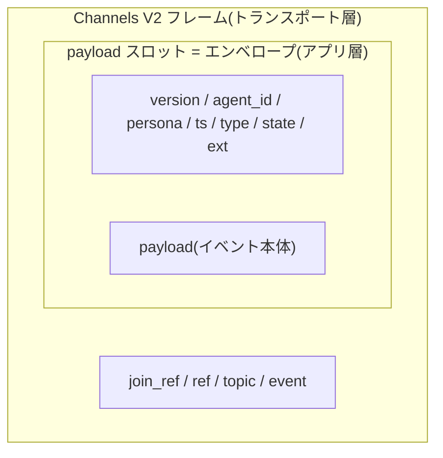
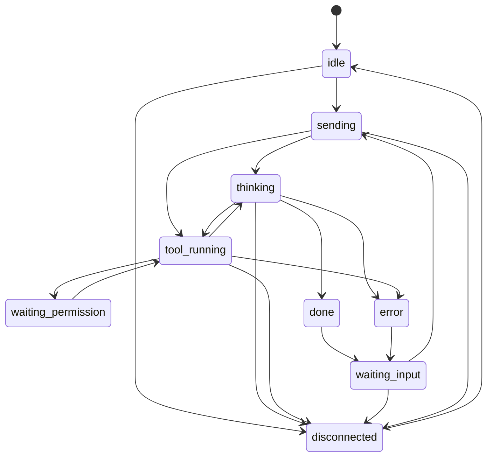

<!-- markdownlint-disable MD033 -->

# 共通イベント・プロトコル(v0)

## Purpose

ラッパー/サーバ/クライアント間でやり取りする共通イベントの**外枠**を定義する。
**生きた仕様**であり、中身は各フェーズで詰める(完全確定は目指さない)。差し込み
境界の背景は [plugin-model](plugin-model.md)。

## Definition

### 用語と階層

**エンベロープ(envelope)**とは、kaoiro の 1 イベントを包む共通の JSON
オブジェクトのこと。封筒のメタファであり、「宛名書き」にあたる共通メタデータ
(`agent_id`/`persona`/`ts`/`type`/`state` など)で「中身」(`payload`)を包む。
ラッパー/サーバ/クライアントのどの区間でも同じ形で受け渡し、サーバは
中身を解釈せずに保持・配信できる(agent 非依存)。

| 用語 | 意味 |
|---|---|
| エンベロープ | 1 イベント全体を包む共通 JSON。下記の外枠キーを持つ |
| 外枠(フレームキー) | エンベロープ直下の固定キー集合 `version`/`agent_id`/`session_id?`/`persona`/`ts`/`type`/`state`/`payload`/`ext`。v0 で固定済み(`session_id?` は optional、後述) |
| `payload` | `type` ごとのイベント本体(中身)。型体系は下記「type と payload」([ADR-0010](../adr/0010-protocol-precisification.md)) |
| `ext` | フィルタが付加する拡張領域。コアは中身に依存しない |

**トランスポート層との区別(重要)**: エンベロープはアプリケーション層の
形式であり、ワイヤ上では Phoenix Channels V2 フレーム
`[join_ref, ref, topic, event, payload]` の **payload スロットの中に
丸ごと格納**されて運ばれる。Channels フレームの「payload」と
エンベロープの「payload」は**別物**(前者の payload = エンベロープ全体、
後者 = エンベロープ内のイベント本体)。



### 設計意図

- このエンベロープはアダプタ/フィルタを差し込む境界そのもの。外枠を早めに固定
  すると拡張が楽になる。
- フィルタは `payload` / `ext` だけを触り、外枠には依存しすぎない。
- 状態の**導出**はラッパー(アダプタ)が行い `state` を確定して送る。サーバは
  受け取った `state` を保持・配信するだけ(agent 非依存)。

### エンベロープ v0

```json
{
  "version": "0",
  "agent_id": "lab-pc-1.claude-a",
  "session_id": "f47ac10b-58cc-4372-a567-0e02b2c3d479",
  "persona": { "id": "mio", "name": "澪", "sprite_set": "mio" },
  "ts": "2026-06-04T11:55:00Z",
  "seq": 42,
  "type": "state_change",
  "state": "tool_running",
  "payload": { "label": "Edit src/foo.ts", "summary": "ファイルを編集中" },
  "ext": {}
}
```

| フィールド | 意味 | 備考 |
|---|---|---|
| `version` | エンベロープのバージョン | 文字列。後方互換の判断に使う |
| `agent_id` | エージェントの**安定識別子** | 設定で固定。再起動をまたいで同一。文字種は `[A-Za-z0-9._-]`(topic/URL 安全のため `/` 等は不可) |
| `session_id` | 実行中の SDK セッション ID(optional) | Claude Agent SDK の会話単位。wrapper が init/最初の result で得た実 ID を報告。agent_id とは別軸で 1 agent_id : N session_id。復帰・召喚時の resume 先([ADR-0014](../adr/0014-session-resume-and-restore.md))。未取得時は省略(未知キー追加なので同一 version) |
| `persona` | 担当ペルソナ | id/表示名/立ち絵セット。ラッパー初期設定で指定 |
| `ts` | イベント発生時刻 | ISO8601(UTC)。ホスト跨ぎの時刻ズレに注意 |
| `seq` | ラッパー単調増分の連番 | プロセス起動ごと 1 起点の正整数([ADR-0011](../adr/0011-phase3-reliability-and-auth.md))。整列キーは `(agent_id, seq)` + `ts`。再起動で巻き戻るため、サーバの最新状態判定は**受信順**(last-write-wins)のまま |
| `type` | イベント種別 | 閉じた enum。下記「type と payload」 |
| `state` | 状態機械の現在状態 | 下記参照 |
| `payload` | 種別ごとの本体 | 型は `type` に依存。下記「type と payload」 |
| `ext` | フィルタが付ける拡張プロパティ | 例: `emotion`,`cost`,`danger`。実装済: `cost`(累計 USD、#8、Claude Code アダプタが result に付与)/ `model`・`cwd`・`context`(`{used_tokens,max_tokens,used_percentage}`)・`rate_limits`(`{<window>:{status,utilization,resets_at}}`、window=`five_hour`/`seven_day`…)・`slash_commands`(`string[]`、利用可能なスラッシュコマンド名、クライアントの `/` 補完用、#34)を state_change に付与(#16/#34、Claude Code アダプタ。SDK が公開した時のみ・best-effort)。他は初期空。**`ext` は operator 限定配信**(viewer には全 type で除去。cwd 等の機微を含むため、#46、[threat-model](threat-model.md) / [ADR-0021](../adr/0021-role-information-disclosure-policy.md)) |

### type と payload(v0 確定)

`type` は閉じた enum。v0 の各種別の payload を下記に定義する(段階的精緻化の
方針は [ADR-0010](../adr/0010-protocol-precisification.md))。

| type | 状態 | payload |
|---|---|---|
| `state_change` | **確定** | `{ label?: string, summary?: string }`。`label` は短い行先表示(例 `"Edit src/foo.ts"`)、`summary` は人間可読の説明。どちらも省略可 |
| `log` | **確定** | `{ kind: "assistant" \| "tool_use" \| "tool_result" \| "user", text?, tool_name?, tool_use_id?, input?, output?, truncated? }`。エージェント応答の逐次中継。`assistant`=モデル発話(`text`)、`tool_use`=ツール呼出(`tool_name`/`input`)、`tool_result`=実行結果(`tool_name`/`output`)、`user`=operator 指示を会話ログにエコー(`text`、#31。wrapper が instruction 受信時に発行し、履歴・operator 限定配信に乗る)。`tool_use_id` は `tool_use`/`tool_result` の対応付け用(#40。SDK が付与した時のみ)。tool 入出力はクライアント UI で折りたたみ既定。長文は wrapper が切り詰め(`truncated: true`)。**operator role のみへ配信**(viewer 非配信。シークレット混入の主経路、[threat-model](threat-model.md)、[ADR-0012](../adr/0012-response-display-and-dashboard-scope.md)) |
| `permission_request` | **確定** | `{ request_id: string, tool_name: string, input?: object, truncated?: boolean }`。`request_id` はラッパー生成のセッション内一意 ID([ADR-0011](../adr/0011-phase3-reliability-and-auth.md))。`input` はツール入力(ラッパーが 16KB 程度に切り詰め、切り詰め時 `truncated: true`。シークレット混入リスクは [threat-model](threat-model.md))。state は `waiting_permission`。**operator 限定配信**: viewer には完全除去し、grid 整合のため合成 `state_change(waiting_permission)`(`payload={}` / `ext` なし)に置換して配信([ADR-0021](../adr/0021-role-information-disclosure-policy.md)) |
| `result` | **確定** | `{ text?: string, is_error?: boolean, error_message?: string }`。ターン完了時の最終応答。`is_error` でエラー終了を区別し、`error_message` にエラー本文(生)を載せてクライアントへリレーする(整形なし。SDK/API エラー本文に加え、wrapper プロセス異常終了時は落ちる直前の最後のエラーを送る。[ADR-0016](../adr/0016-error-body-relay.md))。state は `done`/`error` の後 `waiting_input`。累計コスト USD は `ext.cost` に付与(#8)。`log` と同様 **operator 限定配信**([ADR-0012](../adr/0012-response-display-and-dashboard-scope.md)) |
| `task`(予約) | **予約** | subagent/workflow の起動/更新/完了を通知する専用 type(正式名称・スキーマは未確定)。親 `state_change` とは独立し、親 `agent_id` 参照で紐づく子エンティティを運ぶ([subagent-tasks](subagent-tasks.md)、[ADR-0019](../adr/0019-subagent-workflow-entity-and-task-envelope.md))。予約追補のため `version` 据え置き |

### 方向別メッセージ種別(v0 確定)

Channels のチャネルイベント名と内容。トピックは
ラッパー側 `wrapper:<agent_id>`、クライアント側 `agents:lobby`。

| 方向 | イベント | 内容 |
|---|---|---|
| ラッパー → サーバ | `envelope` | エンベロープ全体 |
| サーバ → クライアント | `snapshot` | `{ agents: { <agent_id>: envelope } }`。join 直後に push |
| サーバ → クライアント | `envelope` | エンベロープ全体(状態変化の都度 broadcast) |
| サーバ → クライアント | `history_cleared` | `{ agent_id, session_id }`。`clear_history` 成功後に broadcast。クライアントは当該 agent の表示用ログを `session_id` 一致のものだけへ再フィルタ(#48)。**operator 限定配信**(viewer は log 自体を持たないため、[ADR-0021](../adr/0021-role-information-disclosure-policy.md)) |
| サーバ → クライアント | `agent_deleted` | `{ agent_id }`。`delete_agent` 成功後に broadcast。クライアントは当該 agent をグリッドと表示用ログから除去(#14)。viewer にも配信(grid 整合のため、[ADR-0021](../adr/0021-role-information-disclosure-policy.md)) |
| クライアント → サーバ | `instruction` | `{ agent_id, text }`。**operator のみ**。サーバは text を解釈せず該当ラッパーへ relay。未知 agent_id は `{:error, unknown_agent}` |
| クライアント → サーバ | `permission_decision` | `{ agent_id, request_id, allow, message? }`。**operator のみ**。該当ラッパーへ relay |
| クライアント → サーバ | `interrupt` | `{ agent_id }`。**operator のみ**。実行中ターンの中断要求(ESC 相当、ADR-0020、#51)。該当ラッパーへ fire-and-forget で relay。未知 agent は `unknown_agent`。中断後 SDK は `error_*` 系の `SDKResultMessage` を返し、既存の `error → waiting_input` 遷移に乗る(専用状態は持たない) |
| クライアント → サーバ | `clear_history` | `{ agent_id }`。**operator のみ**。当該 agent の過去セッション(現在の `session_id` 以外/無し)の返答ログを**サーバのインメモリ・リングバッファ**から消去し `history_cleared` を broadcast。掃除するのは表示用履歴のみで wrapper の JSONL には触れない。未知 agent は `unknown_agent`、現在 `session_id` 不明は `no_current_session`(#48) |
| クライアント → サーバ | `delete_agent` | `{ agent_id }`。**operator のみ**。当該 agent が `disconnected` の時のみ受理し、サーバの最新状態エントリを削除して `agent_deleted` を broadcast。稼働中は `not_disconnected`、未知 agent は `unknown_agent`(#14) |
| サーバ → ラッパー | `instruction` | `{ text }`(relay。ラッパーは入力キューへ投入) |
| サーバ → ラッパー | `permission_decision` | `{ request_id, allow, message? }`(relay。`request_id` で保留中の承認と突合) |
| サーバ → ラッパー | `interrupt` | `{}`(relay。ラッパーは SDK の `Query.interrupt()` を呼ぶ。turn 進行中以外は no-op。#51) |

**承認フロー**: ラッパーは `canUseTool` 発火で `permission_request`
エンベロープ(上記 type 表)を送って Promise を保留し、
`permission_decision` の受信(または既定 600 秒のタイムアウト = deny、
[ADR-0011](../adr/0011-phase3-reliability-and-auth.md))で解決する。
deny でもセッションは継続する。サーバは指示・承認の**中身を解釈せず
relay するだけ**で、agent 非依存を維持する。配達保証はしない(未接続
ラッパーへの relay は消失し、要求側はタイムアウトで知る)。

**再接続時の再同期**: クライアントは切断後、チャネルへ再 join するだけで
`snapshot` により全エージェントの最新状態へ再同期する。差分追跡や再送
要求は不要(agent_id ごと last-write-wins)。順序保証・重複排除の整列
キーは `seq`([ADR-0011](../adr/0011-phase3-reliability-and-auth.md))。
join 時には最新状態に加え、直近の返答ログ履歴(サーバの**インメモリ・
リングバッファ**、[ADR-0012](../adr/0012-response-display-and-dashboard-scope.md))も
配信する(再読込・再接続で返答ログを復元)。履歴はインメモリのみで、サーバ
再起動で消える(ディスク永続は将来 issue #24)。配信形の詳細は実装で確定。
返答履歴の**正本は wrapper ホストの SDK JSONL**であり、リングバッファは
そこから再構築可能な投影と位置づける(resume 時の再構築は
[ADR-0014](../adr/0014-session-resume-and-restore.md))。

### セッション resume と復帰(召喚)

wrapper の復帰(プロセス落ち後の文脈継続)と既存セッションの召喚は、既存
session_id を指定して **resume** する単一機構で行う
([ADR-0014](../adr/0014-session-resume-and-restore.md))。制御は issue #22 の
`client -> server -> runner(boot service)-> wrapper` 起動経路に「resume
モード」を足したもので、復帰コマンド(spawn-with-resume)とセッション列挙
クエリは issue #22 / runner 仕様(issue #23)と併せて定義する(具体メッセージ
schema は本 spec では未確定)。先行する phase-0 の protocol 変更は**エンベロープ
への top-level `session_id` 追加のみ**(wrapper が報告 → サーバが
`(agent_id, host, cwd, session_id)` ポインタを保持)。

### バージョニング方針

- 受信側は**未知キーを無視**する(前方互換)。
- version は**ラッパー/サーバ/クライアントの全メッセージ**にフラットな外枠
  キーとして付与する(エンベロープ以外の `instruction` / `permission_decision`
  / `snapshot` 等にも乗せる)。将来 `ts` 等の共通メタも同じ枠で追加可
  ([ADR-0015](../adr/0015-protocol-version-stamping.md))。
- 受信側は自分の version と**完全一致のみ正常**とみなし、不一致なら
  **警告ログ**を出す。ただし**ベストエフォートで受理して処理は継続**する
  (不一致でも止めない、[ADR-0015](../adr/0015-protocol-version-stamping.md))。
- キーの追加・予約 type の追補は同一 `version` のまま行う。
- 既存キーの意味変更・削除など破壊的変更のみ `version` を上げる。
- `ext` はフィルタの名前空間であり、コアは解釈しない。
- トランスポート層のバージョンは Channels の `vsn` 交渉
  ([ADR-0009](../adr/0009-client-transport.md))が担い、本節とは独立。

### 同一性とペルソナ(マスト)

- `agent_id` は設定で固定する安定 ID(実行時生成の揮発 ID は使わない)。
- `session_id` は SDK の会話単位 ID で agent_id とは別軸(1 agent_id : N
  session_id)。サーバは復帰の既定先として agent_id ごとに最後の session_id
  のみ保持し、全候補はホストの runner が列挙する
  ([ADR-0014](../adr/0014-session-resume-and-restore.md))。
- `persona`(id/表示名/立ち絵)はラッパー初期設定で指定。どのホスト/プロセスが
  どのペルソナを担当するかはユーザ指定。
- サーバ/クライアントは `agent_id`(+ `persona.id`)をキーに表示・機嫌を持続。
- 決定詳細は
  [ADR-0003](../adr/0003-persona-identity-persistence.md)。将来 `persona` に
  描画種別(静的差分/アニメ/3D)を持たせる
  ([ADR-0004](../adr/0004-client-rendering-staged.md))。

### 状態機械の状態セット v0(たたき台)

実用ゴール (A) の中核。Agent SDK のメッセージから導出する。SDK の**確定済み
メッセージ/コールバック仕様と導出マッピング**は
[agent-sdk-events](agent-sdk-events.md) を参照。

| 状態 | 意味 | 導出元(SDK) | 表情の方向性(将来) |
|---|---|---|---|
| `idle` | 起動済み・未着手 | `SDKSystemMessage`(init) | 通常 |
| `sending` | 指示送信済み・応答開始待ち | ラッパーが instruction 受理時に導出(SDK 外、#32) | 送った |
| `thinking` | モデルが生成中 | `SDKAssistantMessage`(text/thinking) | 考え中 |
| `tool_running` | ツール実行中 | `SDKAssistantMessage`(tool_use)〜 `SDKUserMessage`(tool_result) | 集中 |
| `waiting_permission` | ツール許可待ち | `canUseTool` 呼び出し中(Promise 保留) | こちらを見て待つ |
| `waiting_input` | ターン完了・次の指示待ち | `SDKResultMessage` 後、ストリーミング入力待ち | こちらを見て待つ |
| `done` | ターン完了(瞬間) | `SDKResultMessage`(success) | 喜ぶ(→ `waiting_input`) |
| `error` | エラー/リトライ | `SDKResultMessage`(error_*/is_error) | 困り顔 |
| `disconnected` | ラッパー接続断 | サーバ側で導出 | 不明/不在 |

制御(穴1)も確定: ストリーミング入力(`AsyncIterable<SDKUserMessage>`)+
`Query.interrupt()` + `canUseTool` が同一 Query で完結する
([agent-sdk-events](agent-sdk-events.md))。



### ペルソナアセット配信(v0 確定)

`persona.sprite_set` を実画像へ解決する HTTP API
([ADR-0008](../adr/0008-persona-asset-distribution.md))。Channels とは
独立で、`:serve_dashboard` トグルの対象外(公開 API)。アセットの配置・
規格・オーバーレイ(`KAOIRO_PERSONA_DIR`)の正本は
[personas](personas.md)。

- `GET /api/personas` — マニフェスト JSON:

```json
{
  "version": "<16hex>",
  "personas": {
    "<sprite_set>": {
      "states": {
        "<state>": {
          "url": "/personas/<sprite_set>/<state>.png?v=<12hex>",
          "hash": "sha256:<64hex>"
        }
      }
    }
  }
}
```

- `version` はアセット内容から導出した全体バージョン。クライアントは
  これが変わった時だけスプライト URL を引き直す(増分同期)。
- `url` のハッシュ付き形は不変 — 応答は
  `cache-control: public, max-age=31536000, immutable`。`?v=` なしは
  `no-cache`。
- 配信はマニフェスト掲載ファイルのみ(未知パスは 404)。
- クライアントはスプライトのない状態を `idle` 画像へフォールバック
  する。`disconnected` は画像を持たず(personas.md の MUST NOT)、
  `idle` のグレースケール表示で表現する。マニフェスト未取得・未掲載
  `sprite_set` はスプライトなし描画(リファレンス実装では CSS 顔)へ
  フォールバックする。

### クライアント向けトランスポート

クライアント ↔ サーバの接続は **Phoenix Channels に一本化**
([ADR-0009](../adr/0009-client-transport.md))。素の WebSocket
エンドポイントや SSE は併設しない。

- ワイヤ形式は Channels V2 serializer 固定。接続時にクエリ
  `vsn=2.0.0` を必須とする。フレーム形式
  (`[join_ref, ref, topic, event, payload]`)は公式ガイド
  [Writing a Channels Client](https://hexdocs.pm/phoenix/writing_a_channels_client.html)
  に従う。
- kaoiro 固有に定義するのはトピック設計とイベント名・payload のみ
  (上記「type と payload」「方向別メッセージ種別」)。

### 接続認証(v0 確定、[ADR-0011](../adr/0011-phase3-reliability-and-auth.md))

TLS はリバースプロキシ終端(2026-06-11 決定、Phoenix は平文 HTTP)。
ハートビートは Channels 組み込み(クライアントライブラリ既定)を使う。

| 接続 | 方式 | サーバ設定 |
|---|---|---|
| ラッパー(`/wrapper`) | **agent_id 別トークン**。接続パラメータ `token` で提示し、`wrapper:<agent_id>` join 時に agent_id との組を検証 | `KAOIRO_WRAPPER_TOKENS`(`id:token,id:token` 形式) |
| クライアント(`/client`) | **ユーザトークン + role**。接続パラメータ `token`。role は `viewer`(閲覧)/ `operator`(指示・承認可) | `KAOIRO_CLIENT_TOKENS`(`token:role,...` 形式) |

- トークン不一致・未知トークンは接続拒否。env 未設定時の挙動は socket で
  異なる(issue #28、起動時に警告をログ出力):
  - **`KAOIRO_CLIENT_TOKENS` 未設定はクライアント接続を全拒否(fail-closed)**。
    誤設定で operator が無防備に公開される事故を防ぐため、無認証稼働せず
    認証不可能な状態で起動する。ローカル開発・デモでもクライアントトークンの
    設定が必要。
  - **`KAOIRO_WRAPPER_TOKENS` 未設定はラッパー認証を無効化(dev mode、任意の
    ラッパーが接続可)**。loopback 限定での開発利便のため。
  - 運用環境では必ず両 env を設定する([threat-model](threat-model.md))。
- `instruction` / `permission_decision` は operator role のみ受理。
- ラッパー接続断はサーバが検知し、当該エージェントの状態を
  `disconnected` へ**サーバ導出**する(状態セット表の通り)。サーバ
  導出エンベロープは `seq` を持たない(`seq` はラッパー付与の系列)。

## Constraints

- MUST: `agent_id` は安定 ID。MUST: 状態導出はラッパー側。
- MUST: `agent_id` の文字種は `[A-Za-z0-9._-]`(1〜256 文字)。
- MUST: クライアント接続は Phoenix Channels(`vsn=2.0.0`)のみ。
- MUST: 受信側はエンベロープの未知キーを無視する(前方互換)。
- MUST: `instruction` / `permission_decision` / `interrupt` は operator role のみ。
- MUST: permission の無応答既定は deny(fail-closed)。既定 600 秒、
  ラッパー設定で変更可。
- MUST: `log` / `result` エンベロープは operator role のみへ配信する
  ([ADR-0012](../adr/0012-response-display-and-dashboard-scope.md))。
- MUST: `agents:lobby` の配信は **allow-list 方式**。`state_change`
  (viewer は `ext` 除去)と `agent_deleted` のみ viewer に配信し、それ
  以外の event / envelope.type は viewer 完全除去
  ([ADR-0021](../adr/0021-role-information-disclosure-policy.md))。
  `permission_request` は viewer 配信時に合成 `state_change(waiting_permission)`
  へ置換し grid 整合を保つ。

## Open Questions

なし(protocol-reliability は
[ADR-0011](../adr/0011-phase3-reliability-and-auth.md) で解決済み)。

## See Also

- 関連 specs: [architecture](architecture.md),
  [plugin-model](plugin-model.md), [personas](personas.md),
  [subagent-tasks](subagent-tasks.md)
- ADRs: [0001](../adr/0001-agent-sdk-integration.md),
  [0003](../adr/0003-persona-identity-persistence.md),
  [0008](../adr/0008-persona-asset-distribution.md),
  [0009](../adr/0009-client-transport.md),
  [0010](../adr/0010-protocol-precisification.md),
  [0011](../adr/0011-phase3-reliability-and-auth.md),
  [0012](../adr/0012-response-display-and-dashboard-scope.md),
  [0014](../adr/0014-session-resume-and-restore.md),
  [0015](../adr/0015-protocol-version-stamping.md),
  [0016](../adr/0016-error-body-relay.md),
  [0019](../adr/0019-subagent-workflow-entity-and-task-envelope.md),
  [0021](../adr/0021-role-information-disclosure-policy.md)
