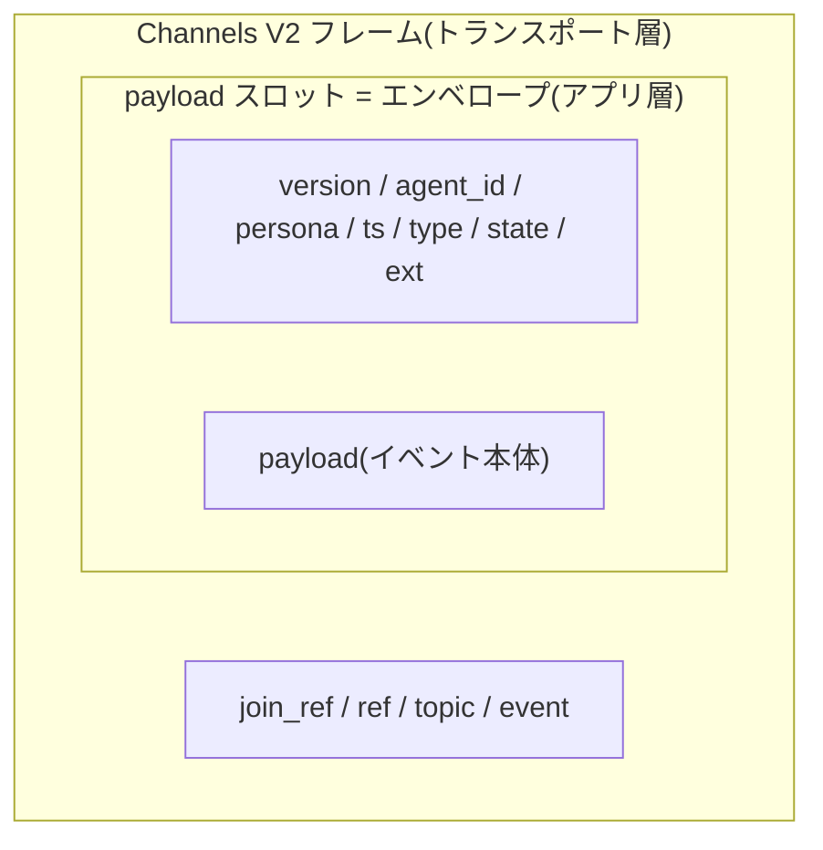
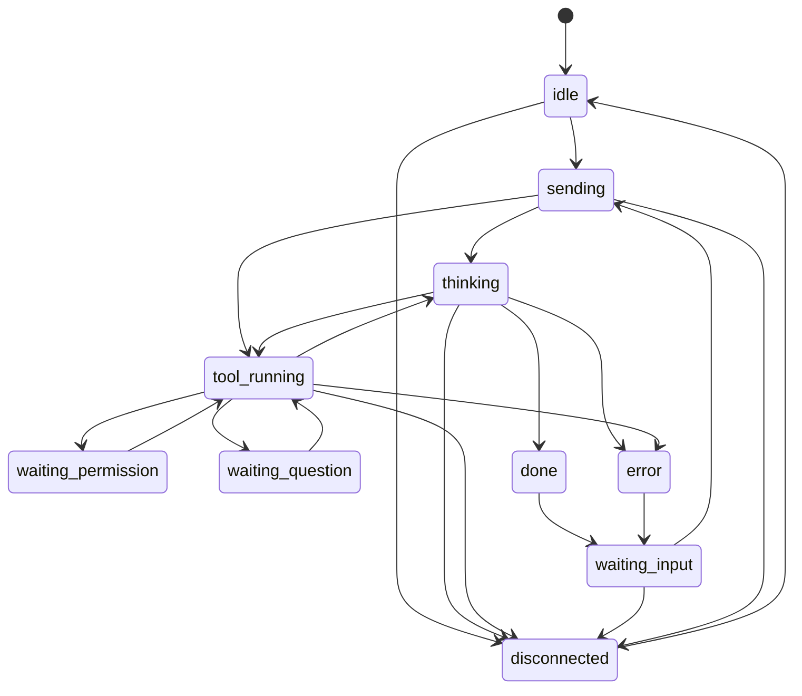

<!-- markdownlint-disable MD033 -->

# 共通イベント・プロトコル(v0)

## Purpose

ラッパー/サーバ/クライアント間でやり取りする共通イベントの**外枠**を定義する。
**生きた仕様**であり、中身は各フェーズで詰める(完全確定は目指さない)。差し込み
境界の背景は [plugin-model](plugin-model.md)。

## Definition

### 用語と階層

**エンベロープ(envelope)**とは、kaoiro の 1 イベントを包む共通の JSON
オブジェクトのこと。封筒のメタファであり、「宛名書き」にあたる共通メタデータ
(`agent_id`/`persona`/`ts`/`type`/`state` など)で「中身」(`payload`)を包む。
ラッパー/サーバ/クライアントのどの区間でも同じ形で受け渡し、サーバは
中身を解釈せずに保持・配信できる(agent 非依存)。

| 用語 | 意味 |
|---|---|
| エンベロープ | 1 イベント全体を包む共通 JSON。下記の外枠キーを持つ |
| 外枠(フレームキー) | エンベロープ直下の固定キー集合 `version`/`agent_id`/`session_id?`/`persona`/`ts`/`type`/`state`/`payload`/`ext`。v0 で固定済み(`session_id?` は optional、後述) |
| `payload` | `type` ごとのイベント本体(中身)。型体系は下記「type と payload」([ADR-0010](../adr/0010-protocol-precisification.md)) |
| `ext` | フィルタが付加する拡張領域。コアは中身に依存しない |

**トランスポート層との区別(重要)**: エンベロープはアプリケーション層の
形式であり、ワイヤ上では Phoenix Channels V2 フレーム
`[join_ref, ref, topic, event, payload]` の **payload スロットの中に
丸ごと格納**されて運ばれる。Channels フレームの「payload」と
エンベロープの「payload」は**別物**(前者の payload = エンベロープ全体、
後者 = エンベロープ内のイベント本体)。



### 設計意図

- このエンベロープはアダプタ/フィルタを差し込む境界そのもの。外枠を早めに固定
  すると拡張が楽になる。
- フィルタは `payload` / `ext` だけを触り、外枠には依存しすぎない。
- 状態の**導出**はラッパー(アダプタ)が行い `state` を確定して送る。サーバは
  受け取った `state` を保持・配信するだけ(agent 非依存)。

### エンベロープ v0

```json
{
  "version": "0",
  "agent_id": "lab-pc-1.claude-a",
  "session_id": "f47ac10b-58cc-4372-a567-0e02b2c3d479",
  "persona": { "id": "mio", "name": "澪", "sprite_set": "mio" },
  "ts": "2026-06-04T11:55:00Z",
  "seq": 42,
  "type": "state_change",
  "state": "tool_running",
  "payload": { "label": "Edit src/foo.ts", "summary": "ファイルを編集中" },
  "ext": {}
}
```

| フィールド | 意味 | 備考 |
|---|---|---|
| `version` | エンベロープのバージョン | 文字列。後方互換の判断に使う |
| `agent_id` | エージェントの**安定識別子** | 設定で固定。再起動をまたいで同一。文字種は `[A-Za-z0-9._-]`(topic/URL 安全のため `/` 等は不可) |
| `session_id` | 実行中の SDK セッション ID(optional) | Claude Agent SDK の会話単位。wrapper が init/最初の result で得た実 ID を報告。agent_id とは別軸で 1 agent_id : N session_id。復帰・召喚時の resume 先([ADR-0014](../adr/0014-session-resume-and-restore.md))。未取得時は省略(未知キー追加なので同一 version) |
| `persona` | 担当ペルソナ | id/表示名/立ち絵セット。ラッパー初期設定で指定 |
| `ts` | イベント発生時刻 | ISO8601(UTC)。ホスト跨ぎの時刻ズレに注意 |
| `seq` | ラッパー単調増分の連番 | プロセス起動ごと 1 起点の正整数([ADR-0011](../adr/0011-phase3-reliability-and-auth.md))。整列キーは `(agent_id, seq)` + `ts`。再起動で巻き戻るため、サーバの最新状態判定は**受信順**(last-write-wins)のまま |
| `type` | イベント種別 | 閉じた enum。下記「type と payload」 |
| `state` | 状態機械の現在状態 | 下記参照 |
| `payload` | 種別ごとの本体 | 型は `type` に依存。下記「type と payload」 |
| `ext` | フィルタが付ける拡張プロパティ | 例: `emotion`,`cost`,`danger`。実装済: `cost`(累計 USD、#8、Claude Code アダプタが result に付与)/ `model`・`cwd`・`context`(`{used_tokens,max_tokens,used_percentage}`)・`rate_limits`(`{<window>:{status,utilization,resets_at}}`、window=`five_hour`/`seven_day`…)・`slash_commands`(`string[]`、利用可能なスラッシュコマンド名、クライアントの `/` 補完用、#34)・`models`(`[{value, display_name, description, effort_levels?}]`、選択可能なモデルと各モデルの effort 値域。bare `/model`・`/effort` 選択ダイアログをラウンドトリップ無しで構成するための前出し。`value` は `setModel` 用エイリアス、`effort_levels` は effort 非対応モデルで省略、#54 / [ADR-0020](../adr/0020-dashboard-battery-included-client.md))・`permission_mode`(`'default'|'acceptEdits'|'bypassPermissions'|'plan'|'dontAsk'|'auto'`、現在の Claude Code 許可モード、#57。init で確定、SDKStatusMessage 受信で上書き)・`fast_mode`(`'off'|'cooldown'|'on'`、Fast mode 状態、#57。init および各 result メッセージで上書き。`cooldown`は result でのみ観測される)を state_change に付与(#16/#34/#54/#57、Claude Code アダプタ。SDK が公開した時のみ・best-effort)。`pending_permission`(`{request_id, tool_name, input?, truncated?, ts}`、#59 / [ADR-0022](../adr/0022-pending-permission-authoritative-source.md))も state_change に付与し、`waiting_permission`中の許可要求の **authoritative source** となる。同様に`pending_question`(`{request_id, questions, ts}`、[ADR-0027](../adr/0027-askuserquestion-envelope.md))も state_change に付与し、`waiting_question`中の AskUserQuestion 質問の **authoritative source** となる。他は初期空。**`ext` は operator 限定配信**(viewer には全 type で除去。cwd / pending_permission.input 等の機微を含むため、#46、[threat-model](threat-model.md) / [ADR-0021](../adr/0021-role-information-disclosure-policy.md)) |

### type と payload(v0 確定)

`type` は閉じた enum。v0 の各種別の payload を下記に定義する(段階的精緻化の
方針は [ADR-0010](../adr/0010-protocol-precisification.md))。

| type | 状態 | payload |
|---|---|---|
| `state_change` | **確定** | `{ label?: string, summary?: string }`。`label` は短い行先表示(例 `"Edit src/foo.ts"`)、`summary` は人間可読の説明。どちらも省略可 |
| `log` | **確定** | `{ kind: "assistant" \| "tool_use" \| "tool_result" \| "user", text?, tool_name?, tool_use_id?, input?, output?, truncated? }`。エージェント応答の逐次中継。`assistant`=モデル発話(`text`)、`tool_use`=ツール呼出(`tool_name`/`input`)、`tool_result`=実行結果(`tool_name`/`output`)、`user`=operator 指示を会話ログにエコー(`text`、#31。wrapper が instruction 受信時に発行し、履歴・operator 限定配信に乗る)。`tool_use_id` は `tool_use`/`tool_result` の対応付け用(#40。SDK が付与した時のみ)。tool 入出力はクライアント UI で折りたたみ既定。長文は wrapper が切り詰め(`truncated: true`)。**operator role のみへ配信**(viewer 非配信。シークレット混入の主経路、[threat-model](threat-model.md)、[ADR-0012](../adr/0012-response-display-and-dashboard-scope.md)) |
| `permission_request` | **確定** | `{ request_id: string, tool_name: string, input?: object, truncated?: boolean }`。`request_id` はラッパー生成のセッション内一意 ID([ADR-0011](../adr/0011-phase3-reliability-and-auth.md))。`input` はツール入力(ラッパーが 16KB 程度に切り詰め、切り詰め時 `truncated: true`。シークレット混入リスクは [threat-model](threat-model.md))。state は `waiting_permission`。**初出通知に降格**: pending 状態の真実は `state_change.ext.pending_permission` ([ADR-0022](../adr/0022-pending-permission-authoritative-source.md))。本 envelope は protocol 互換維持と「新規 pending あり」イベント通知のために残るが、payload は ext と同期保証される(同一の `request_id` / `tool_name` / `input` / `truncated` / `ts`)。新クライアントは ext 経由を推奨。**operator 限定配信**: viewer には完全除去し、grid 整合のため合成 `state_change(waiting_permission)`(`payload={}` / `ext` なし)に置換して配信([ADR-0021](../adr/0021-role-information-disclosure-policy.md)) |
| `question_request` | **確定** | `{ request_id: string, questions: [...] }`。SDK の `AskUserQuestion`(canUseTool 経路)の構造化質問。`request_id` はラッパー生成のセッション内一意 ID。`questions` は `[{ question, header, multiSelect, options: [{ label, description, preview? }] }]`(1〜4 問・各 2〜4 択)。state は `waiting_question`。**初出通知に降格**: pending の真実は `state_change.ext.pending_question`([ADR-0027](../adr/0027-askuserquestion-envelope.md))。互換一貫性と「新規 pending あり」通知のために送り、payload は ext と同期保証(同一の `request_id` / `questions` / `ts`)。回答は方向別メッセージ `question_response`(operator の選択回答)。**operator 限定配信**: viewer には完全除去し、grid 整合のため合成 `state_change(waiting_question)`(`payload={}` / `ext` なし)に置換([ADR-0021](../adr/0021-role-information-disclosure-policy.md)) |
| `result` | **確定** | `{ text?: string, is_error?: boolean, error_message?: string }`。ターン完了時の最終応答。`is_error` でエラー終了を区別し、`error_message` にエラー本文(生)を載せてクライアントへリレーする(整形なし。SDK/API エラー本文に加え、wrapper プロセス異常終了時は落ちる直前の最後のエラーを送る。[ADR-0016](../adr/0016-error-body-relay.md))。state は `done`/`error` の後 `waiting_input`。累計コスト USD は `ext.cost` に付与(#8)。`log` と同様 **operator 限定配信**([ADR-0012](../adr/0012-response-display-and-dashboard-scope.md)) |
| `task`(予約) | **予約** | subagent/workflow の起動/更新/完了を通知する専用 type(正式名称・スキーマは未確定)。親 `state_change` とは独立し、親 `agent_id` 参照で紐づく子エンティティを運ぶ([subagent-tasks](subagent-tasks.md)、[ADR-0019](../adr/0019-subagent-workflow-entity-and-task-envelope.md))。予約追補のため `version` 据え置き |
| `attach_rejected` | **確定** | `{ upload_id, reason, detail? }`。個別 upload の拒否(wrapper が attach_close 時の検査 / SDK エラー / interrupt で発火)。reason enum は [file-upload](file-upload.md) を正本(`size_over` / `mime_denied` / `count_over` / `timeout` / `interrupted` / `unfittable_image` / `unfittable_pdf` / `text_too_large` / `total_request_over` / `sdk_error`)。**operator 限定配信**(allow-list、 [ADR-0021](../adr/0021-role-information-disclosure-policy.md))。仕様集約は [file-upload](file-upload.md)、決定根拠は [ADR-0025](../adr/0025-file-upload-wire-and-wrapper-rendering.md)。追補のため `version` 据え置き |
| `instruction_rejected` | **確定** | `{ attachment_ids?, reason, detail? }`。instruction 全体の拒否(合計上限超 / SDK エラー / interrupt 等)。reason enum と配信ガードは `attach_rejected` と同じ。追補のため `version` 据え置き |
| `inter_agent_message` | **確定** | エージェント A→B の対話メッセージ。payload に `to` / `conversation_id` / `turn_number` / `kind`(9 種 enum)/ `body` / `meta {done, propose_next, confidence?, reject_reason?}` / `owner {kind, id}` を持つ。server は `to` でルーティング + observation broadcast を行う(意味論は解釈しない)。仕様正本は [protocol-inter-agent](protocol-inter-agent.md)。**operator 限定配信**。追補のため `version` 据え置き |
| `external_message`(予約) | **予約** | 外部人間との Discord メッセージ(`direction: outbound\|inbound`)。payload は `channel` / `to`\|`from` / `conversation_id` / `turn_number` / `body` / `meta` 等。server は `to` で discord-wrapper へルーティング(意味論は解釈しない)。inbound の `ext.interpretation` は discord-wrapper のフィルタが付与。仕様正本は [protocol-external-human](protocol-external-human.md)、実装は [phase-9](../plans/phase-9-external-human-messaging.md)。**operator 限定配信**。追補のため `version` 据え置き |

### 方向別メッセージ種別(v0 確定)

Channels のチャネルイベント名と内容。トピックは
ラッパー側 `wrapper:<agent_id>`、クライアント側 `agents:lobby`。

| 方向 | イベント | 内容 |
|---|---|---|
| ラッパー → サーバ | `envelope` | エンベロープ全体 |
| ラッパー → サーバ | `history_reset` | `{}`。resume 起動時、wrapper が JSONL から再構築した表示履歴を `log` で再生する直前に送る。サーバは当該 agent のリングバッファを**全消去**(append でなく上書き目的 — crash 後もサーバ生存時は同一 session の旧行が残るため)し `history_reset` を broadcast。状態未確立(エントリ無し)は no-op で ack のみ。掃除は表示用履歴のみで wrapper の JSONL には触れない([ADR-0014](../adr/0014-session-resume-and-restore.md) phase-2、#50) |
| ラッパー → サーバ | `directory_request` | `{}`。inter-agent messaging で wrapper が persona 名 → agent_id 解決を行うための peer 一覧取得。 サーバは `AgentStates.snapshot()` から **送信元 wrapper を除外** し、 各 entry を `{agent_id, persona: {id, name, sprite_set}, state}` の最小形に丸めて `{:ok, %{agents: [...]}}` で reply。 wrapper 側は `mcp__kaoiro__list_agents` ツールでこれを呼ぶ([protocol-inter-agent](protocol-inter-agent.md) コンパニオンツール) |
| サーバ → クライアント | `snapshot` | `{ agents: { <agent_id>: envelope } }`。join 直後に push |
| サーバ → クライアント | `envelope` | エンベロープ全体(状態変化の都度 broadcast) |
| サーバ → クライアント | `history_cleared` | `{ agent_id, session_id }`。`clear_history` 成功後に broadcast。クライアントは当該 agent の表示用ログを `session_id` 一致のものだけへ再フィルタ(#48)。**operator 限定配信**(viewer は log 自体を持たないため、[ADR-0021](../adr/0021-role-information-disclosure-policy.md)) |
| サーバ → クライアント | `history_reset` | `{ agent_id }`。`history_reset` 受理後に broadcast。クライアントは当該 agent の表示用ログを**全消去**し、続いて再生される `log` 行で再構築する。**operator 限定配信**(viewer は log を持たないため、[ADR-0021](../adr/0021-role-information-disclosure-policy.md)、#50) |
| サーバ → クライアント | `agent_deleted` | `{ agent_id }`。`delete_agent` 成功後に broadcast。クライアントは当該 agent をグリッドと表示用ログから除去(#14)。viewer にも配信(grid 整合のため、[ADR-0021](../adr/0021-role-information-disclosure-policy.md)) |
| クライアント → サーバ | `attach_open` | `{ agent_id, upload_id, filename, mime, size, chunks }`。**operator のみ**。ファイル添付の予告。upload_id は client 採番(セッション内一意)。該当ラッパーへ relay、未知 agent_id は `{:error, unknown_agent}`。詳細は下記「ファイルアップロード wire」 |
| クライアント → サーバ | `attach_chunk` | **binary frame**(`<u32 upload_id_len><upload_id utf8><u32 chunk_index><chunk_bytes>`)。**operator のみ**。該当ラッパーへ透過 relay。詳細は下記「ファイルアップロード wire」 |
| クライアント → サーバ | `attach_close` | `{ agent_id, upload_id }`。**operator のみ**。1 upload の完了通知(任意 = chunks 完走 ack)。詳細は下記「ファイルアップロード wire」 |
| クライアント → サーバ | `instruction` | `{ agent_id, text, attachment_ids? }`。**operator のみ**。サーバは text / attachment_ids を解釈せず該当ラッパーへ relay。未知 agent_id は `{:error, unknown_agent}`。`attachment_ids` 指定時は wrapper が attach_close 完走済の upload を SDK content blocks へ render([file-upload](file-upload.md)、[ADR-0025](../adr/0025-file-upload-wire-and-wrapper-rendering.md)) |
| クライアント → サーバ | `permission_decision` | `{ agent_id, request_id, allow, message? }`。**operator のみ**。該当ラッパーへ relay |
| クライアント → サーバ | `question_response` | `{ agent_id, request_id, answers, cancelled? }`。**operator のみ**。AskUserQuestion への選択回答([ADR-0027](../adr/0027-askuserquestion-envelope.md))。`answers` は `{ [質問文]: string }`(値は選択 option の `label`、multiSelect は `", "` join、"Other" は自由記述文字列)。`cancelled: true` は却下。該当ラッパーへ relay。未知 agent は `unknown_agent` |
| クライアント → サーバ | `interrupt` | `{ agent_id }`。**operator のみ**。実行中ターンの中断要求(ESC 相当、ADR-0020、#51)。該当ラッパーへ fire-and-forget で relay。未知 agent は `unknown_agent`。中断後 SDK は `error_*` 系の `SDKResultMessage` を返し、既存の `error → waiting_input` 遷移に乗る(専用状態は持たない)。ラッパーは加えて pending_uploads / staged attachment bytes を drop し `attach_rejected{reason="interrupted"}` を発火する([ADR-0025](../adr/0025-file-upload-wire-and-wrapper-rendering.md) F11、前方互換: uploads / staged 不在時は従来通り SDK の `Query.interrupt()` のみ) |
| クライアント → サーバ | `set_model` | `{ agent_id, model }`。**operator のみ**。`model` は `ext.models[].value` のエイリアス。該当ラッパーへ fire-and-forget で relay。未知 agent は `unknown_agent`(#54 / [ADR-0020](../adr/0020-dashboard-battery-included-client.md)) |
| クライアント → サーバ | `set_effort` | `{ agent_id, effort }`。**operator のみ**。`effort` は対象モデルの `effort_levels` の一値(`low`〜`max`)。該当ラッパーへ fire-and-forget で relay。未知 agent は `unknown_agent`(#54 / [ADR-0020](../adr/0020-dashboard-battery-included-client.md)) |
| クライアント → サーバ | `set_permission_mode` | `{ agent_id, mode }`。**operator のみ**。`mode` は SDK の `PermissionMode` 6 値 (`default`/`acceptEdits`/`bypassPermissions`/`plan`/`dontAsk`/`auto`)。該当ラッパーへ relay すると同時にサーバが agent_id 単位で永続化 (DETS)、次回 wrapper join 時に after_join で配信されて起動モードを復元する。未知 mode は `invalid value: mode`、未知 agent は `unknown_agent` (#58) |
| クライアント → サーバ | `clear_history` | `{ agent_id }`。**operator のみ**。当該 agent の過去セッション(現在の `session_id` 以外/無し)の返答ログを**サーバのインメモリ・リングバッファ**から消去し `history_cleared` を broadcast。掃除するのは表示用履歴のみで wrapper の JSONL には触れない。未知 agent は `unknown_agent`、現在 `session_id` 不明は `no_current_session`(#48) |
| クライアント → サーバ | `delete_agent` | `{ agent_id }`。**operator のみ**。当該 agent が `disconnected` の時のみ受理し、サーバの最新状態エントリを削除して `agent_deleted` を broadcast。稼働中は `not_disconnected`、未知 agent は `unknown_agent`(#14) |
| サーバ → ラッパー | `attach_open` | `{ upload_id, filename, mime, size, chunks }`(relay)。wrapper は `pending_uploads[upload_id]` を作成、5 分 TTL で GC |
| サーバ → ラッパー | `attach_chunk` | **binary**(relay)。wrapper は header(`<u32 upload_id_len><upload_id utf8><u32 chunk_index>`)をパースし当該 upload の chunk バッファに追加 |
| サーバ → ラッパー | `attach_close` | `{ upload_id }`(relay)。wrapper は MIME / 個別サイズ(128 MB 上限)/ 点数(in-flight 20)を検査、不適は `attach_rejected` を発火 |
| サーバ → ラッパー | `instruction` | `{ text, attachment_ids? }`(relay)。ラッパーは入力キューへ投入、`attachment_ids` 指定時は pending_uploads の bytes を SDK content blocks(image / document / text、Office は markitdown → text)へ render([file-upload](file-upload.md)、[ADR-0025](../adr/0025-file-upload-wire-and-wrapper-rendering.md))。instruction 全体の拒否は `instruction_rejected` |
| サーバ → ラッパー | `permission_decision` | `{ request_id, allow, message? }`(relay。`request_id` で保留中の承認と突合) |
| サーバ → ラッパー | `question_response` | `{ request_id, answers, cancelled? }`(relay。`request_id` で保留中の質問と突合。allow 時は wrapper が `updatedInput.answers` に載せて SDK へ返却、`cancelled` は deny 相当。[ADR-0027](../adr/0027-askuserquestion-envelope.md)) |
| サーバ → ラッパー | `interrupt` | `{}`(relay)。ラッパーは SDK の `Query.interrupt()` を呼ぶ。turn 進行中以外は SDK 側 no-op(#51)。加えて当該 agent の pending_uploads / staged attachment bytes を drop し、drop した upload_id ごとに `attach_rejected{reason="interrupted"}` を発火する(turn 進行中でなくとも uploads があれば作動、前方互換: uploads / staged 不在時は従来通り、[ADR-0025](../adr/0025-file-upload-wire-and-wrapper-rendering.md) F11) |
| サーバ → ラッパー | `set_model` | `{ model }`(relay。ラッパーは `Query.setModel(value)` を呼ぶ。以降のターンから適用=次メッセージ単位。session 未開始時は no-op。#54) |
| サーバ → ラッパー | `set_effort` | `{ effort }`(relay。ラッパーは `Query.applyFlagSettings({ effortLevel })` を呼ぶ。以降のターンから適用=次メッセージ単位。session 未開始時は no-op。#54) |
| サーバ → ラッパー | `set_permission_mode` | `{ mode }`(relay または after_join push)。ラッパーは session 開始済なら `Query.setPermissionMode(mode)` を呼ぶ。未開始時は内部状態のみ更新し、次回 `query()` 構築時の `permissionMode` に反映する (= after_join 経路で起動モードを復元する仕組み)。`bypassPermissions` は wrapper が起動時に `allowDangerouslySkipPermissions: true` で開いた場合のみ受理、mid-session の bypass 切替は session が non-bypass で開始されていれば SDK が拒否する (#58) |

**承認フロー**: ラッパーは `canUseTool` 発火で `state_change.ext.pending_permission`
を立て同時に互換用の `permission_request` エンベロープ(上記 type 表)を
送って Promise を保留し、`permission_decision` の受信で解決する。pending
中の真実は ext 側で持続するため、別の `state_change`(thinking /
tool_running / session_init 由来の idle 等)が間に挟まっても消失しない
([ADR-0022](../adr/0022-pending-permission-authoritative-source.md))。
無応答時の既定は SDK と同じく **無制限待機**(タイムアウトなし。
有限タイムアウトはラッパー設定で opt-in 可、設定面の整備は別 issue
# 60)。deny でもセッションは継続する。サーバは指示・承認の**中身を解釈せず
relay するだけ**で、agent 非依存を維持する。配達保証はしない(未接続
ラッパーへの relay は消失し、要求側は次回 join 時の snapshot で
ext.pending_permission を復元する)。

**再接続時の再同期**: クライアントは切断後、チャネルへ再 join するだけで
`snapshot` により全エージェントの最新状態へ再同期する。差分追跡や再送
要求は不要(agent_id ごと last-write-wins)。順序保証・重複排除の整列
キーは `seq`([ADR-0011](../adr/0011-phase3-reliability-and-auth.md))。
join 時には最新状態に加え、直近の返答ログ履歴(サーバの**インメモリ・
リングバッファ**、[ADR-0012](../adr/0012-response-display-and-dashboard-scope.md))も
配信する(再読込・再接続で返答ログを復元)。履歴はインメモリのみで、サーバ
再起動で消える(ディスク永続は将来 issue #24)。配信形の詳細は実装で確定。
返答履歴の**正本は wrapper ホストの SDK JSONL**であり、リングバッファは
そこから再構築可能な投影と位置づける。resume 起動時は wrapper が当該
session の JSONL を直読して `user`/`assistant` 行を `log` エンベロープへ写像し、
`history_reset`(全消去)→ `log` 再生でサーバ表示履歴を上書きする
([ADR-0014](../adr/0014-session-resume-and-restore.md) phase-2、#50。SDK は
resume 時に過去履歴を query() ストリームへ再 yield しないため直読が必須)。

### ファイルアップロード wire

ダッシュボードからの添付ファイル(画像 / テキスト / PDF / Office)を operator
が agent に渡すための増分 op 群。 protocol surface の正本は上記の方向別
メッセージ種別 +「`attach_rejected` / `instruction_rejected` envelope type
(type と payload 表)」+ 下記 binary frame 形式。 機能仕様の集約は
[file-upload](file-upload.md)、 決定の根拠は
[ADR-0025](../adr/0025-file-upload-wire-and-wrapper-rendering.md)。

**transport**: 既存 Channels 一本化
([ADR-0009](../adr/0009-client-transport.md))維持。 別 socket / HTTP POST
upload を立てない。 server は upload bytes を解釈・永続せず
`wrapper:<agent_id>` channel に透過 relay する(ディスク不到達、
[ADR-0020](../adr/0020-dashboard-battery-included-client.md) F3)。

**順序**: `attach_open` × N → `attach_chunk*`(並列可) → `attach_close` × N
→ `instruction(attachment_ids=[...])`。 wrapper は instruction 着信時に
全 `attachment_ids` が attach_close 完走済であることを確認する(未完走時は
`instruction_rejected{reason="timeout"}` 等で reject)。

**`attach_chunk` payload 形式**(V2 binary frame の payload 内部レイアウト、 MVP):

Phoenix V2 binary serializer は WebSocket binary opcode のフレームを受け、
サーバ側 `handle_in("attach_chunk", {:binary, payload}, socket)` の
`payload` に下記バイト列を `{:binary, binary()}` タプルでラップして渡す
(V2 はタプル形式、 V1 と混同しない)。 phoenix.js は `ArrayBuffer` を
`channel.push("attach_chunk", arrayBuffer)` に直接渡せば自動で binary
frame 化される(Blob は事前 `arrayBuffer()` 変換が必要)。

```text
<u32 upload_id_len><upload_id utf8><u32 chunk_index><chunk_bytes>
```

- `upload_id_len`: big-endian unsigned 32bit、 upload_id の UTF-8 バイト長
- `upload_id`: UTF-8 文字列。 client 採番のセッション内一意 ID
- `chunk_index`: big-endian unsigned 32bit、 0 起点
- `chunk_bytes`: chunk のバイト列(残り全部)

並列度・ チャンクサイズは client 任意(MVP 推奨: 1 chunk 64 KB、
[ADR-0025](../adr/0025-file-upload-wire-and-wrapper-rendering.md) F14)。

V2 frame ヘッダ(`<<kind::8, join_ref_size::8, ref_size::8, topic_size::8,
event_size::8, ...>>`)は Phoenix が処理する範囲で、 各 size フィールドが
8bit のため join_ref / ref / topic / event は各最大 255 バイト
(kaoiro の `wrapper:<agent_id>` / `attach_chunk` 等は十分余裕)。

**transport 安全弁**: server は 1 frame 上限 8 MB、 in-flight upload cap
20 / wrapper を強制(DoS 防衛)。 Phoenix の `max_frame_size` 既定は
`:infinity` のため、 endpoint config で明示する:

```elixir
# lib/kaoiro_web/endpoint.ex
socket "/wrapper", KaoiroWeb.WrapperSocket,
  websocket: [
    timeout: 60_000,
    max_frame_size: 8_000_000  # 8 MB
  ]
```

`:infinity` のまま 128 MB を 1 frame で受けると受信プロセス 1 つに 128 MB
確保され OOM リスクが出る。 個別ファイル上限(一律 128 MB)・ MIME 許可・
点数(10 / instruction)・ TTL(未参照 / chunk 不完全は 5 分で GC)等の
規範は wrapper が最終判定する([file-upload](file-upload.md)、
ADR-0025 F4 / F6 / F7 / F13)。

**配信ガード**: `attach_open` / `attach_chunk` / `attach_close` /
`attach_rejected` / `instruction_rejected` はすべて **operator 限定**
(allow-list 方式、 [ADR-0021](../adr/0021-role-information-disclosure-policy.md))。
viewer には完全除去する。

**fit-to-SDK 責任**: wrapper は 128 MB の protocol 上限と SDK の硬い上限
(image_block / document_block 等の正確な値は実装着手前 spike で確証)の
ギャップを吸収する責任を持つ(画像 downsize / PDF page-extract / text
truncate / Office → markitdown → text)。 不能時は専用 reason
(`unfittable_image` / `unfittable_pdf` / `text_too_large`)で reject する。

### セッション resume と復帰(召喚)

wrapper の復帰(プロセス落ち後の文脈継続)と既存セッションの召喚は、既存
session_id を指定して **resume** する単一機構で行う
([ADR-0014](../adr/0014-session-resume-and-restore.md))。制御は issue #22 の
`client -> server -> runner(boot service)-> wrapper` 起動経路に「resume
モード」を足したもので、復帰コマンド(spawn-with-resume)とセッション列挙
クエリは issue #22 / runner 仕様([ADR-0023](../adr/0023-host-runner-architecture.md))
と併せて定義する(下記「runner 制御メッセージ」で v0 確定、[#66](https://gitea.example.invalid/sakurai.yuta/kaoiro/issues/66))。
先行する phase-0 の protocol 変更は**エンベロープへの top-level `session_id`
追加のみ**(wrapper が報告 → サーバが `(agent_id, host, cwd, session_id)`
ポインタを保持)。

### runner 制御メッセージ(v0 確定、[#66](https://gitea.example.invalid/sakurai.yuta/kaoiro/issues/66))

各ホストに常駐する runner([ADR-0023](../adr/0023-host-runner-architecture.md))は、
データ経路(`wrapper:<agent_id>` 直結)とは**別系統**の専用トピック
`runner:<host_id>` でサーバへ接続し、ホスト登録・生存通知と wrapper のライフ
サイクル制御(spawn / stop / restart / セッション列挙)を行う(上記 resume も
この制御経路の一機能)。メッセージは既存制御と同じ **Channels イベント方式**
(envelope `type` は増やさない)。

| 方向 | イベント | payload |
|---|---|---|
| runner → サーバ | `register` | `{ host_id, personas, cwd_allowlist, capabilities? }`。接続時に 1 回。稼働可能 persona と選択可能 cwd 許可リスト(#22)を申告 |
| runner → サーバ | `heartbeat` | `{ host_id }`。生存通知 |
| runner → サーバ | `sessions` | `{ host_id, cwd, sessions: [{ session_id, summary?, mtime? }] }`。`enumerate_sessions` への応答。JSONL メタは最小・**operator 限定**(T2、[ADR-0014](../adr/0014-session-resume-and-restore.md)) |
| runner → サーバ | `spawn_result` | `{ host_id, agent_id, ok, reason? }`。失敗時 `reason` = `already_running` / `cwd_not_found` / `error` |
| サーバ → runner | `spawn` | `{ agent_id, persona, cwd, server_url, token, resume_session_id? }`。**operator 限定**。`resume_session_id` 指定で resume 起動。`agent_id` / `server_url` / `token` はクライアント入力ではなく**サーバが補完**(案A、[ADR-0024](../adr/0024-agent-instance-identity-and-spawn-auth.md) D3/D4) |
| サーバ → runner | `stop` | `{ agent_id }`。**operator 限定** |
| サーバ → runner | `restart` | `{ agent_id }`。**operator 限定** |
| サーバ → runner | `enumerate_sessions` | `{ agent_id, cwd }`。**operator 限定**。当該 cwd 配下の resume 候補列挙を要求 |
| サーバ → runner | `switch_session` | `{ agent_id, resume_session_id }`。**operator 限定**。稼働中 agent の resume 先を差し替える(agent_id / cwd は不変)。runner は entry の resume ポインタを付替え、F4 ロックを旧→新へ移送してから wrapper を再起動(kill → relaunch)。T3(cwd 配下実在)と F4(同一 session を別 agent が resume 中でない)は runner が再検査。失敗は `spawn_result` で報告([ADR-0014](../adr/0014-session-resume-and-restore.md) resume-swap) |

**認証**: runner はホスト別トークン(サーバ設定 env の `host_id:token` 列挙、
[ADR-0011](../adr/0011-phase3-reliability-and-auth.md) の per-entity トークン主義を
拡張)で接続する。host_id は設定固定(サーバ採番しない)。wrapper の agent_id
別トークンとは別系統。

**version**: runner メッセージにも `version`(現状 `"0"`)をフラット外枠キーで
付与する([ADR-0015](../adr/0015-protocol-version-stamping.md))。新メッセージ種別の
追加は前方互換のため version は据え置き。

**安全性**(spawn = 実質リモートコード実行): spawn / resume / resume_session /
stop / restart の受理は **operator 限定**。resume 対象 session_id は当該 agent
束縛 cwd 配下に**実在検証**(runner、T3)。`switch_session` の resume 先も
同じ cwd で再検証(cwd は不変、runner)。cwd は runner の `cwd_allowlist` 内に
限定(#22、T1)。

**二重起動防止**: server owner フェンシング(既存)+ runner ローカルロックの
二段([ADR-0014](../adr/0014-session-resume-and-restore.md) F4)。spawn 競合は
runner が弾き `spawn_result.reason = already_running` を返す。さらに、すでに
live owner のいる `agent_id` の wrapper join はサーバが**明示拒否**する(従来の
サイレント last-write-wins を改め偶発二重起動を可視化、[ADR-0024](../adr/0024-agent-instance-identity-and-spawn-auth.md) D5)。

### クライアント → サーバ 起動制御(#22、[ADR-0024](../adr/0024-agent-instance-identity-and-spawn-auth.md))

dashboard(operator)が起動 UI から出す要求。サーバは `runner:<host_id>` へ
中継する(上記「runner 制御メッセージ」)。**persona = 型 / agent_id =
インスタンス**であり、「同じ性質を複数 spawn」は同一 persona × 別 agent_id で
表現する(D1)。

| 方向 | イベント | payload |
|---|---|---|
| クライアント → サーバ | `spawn` | `{ host_id, persona, cwd, name?, initial_prompt?, resume_session_id? }`。**operator 限定**。サーバが `agent_id` を採番し `server_url` + per-agent `token` を補完(案A、D3/D4)。`name?` は per-instance 表示名で persona.name を上書き(agent_id/persona.id は不変、64 文字上限・制御文字不可)。`resume_session_id` 指定で resume 起動。サーバは復帰用に cwd を SessionPointers へ seed する |
| クライアント → サーバ | `stop` / `restart` | `{ host_id, agent_id }`。**operator 限定**。`stop` は dashboard の「終了」ボタン由来(host_id は agent_id から導出) |
| クライアント → サーバ | `restore` | `{ agent_id }`。**operator 限定**。切断済みエージェントを**同一 agent_id で resume 再 spawn**して復帰させる(ADR-0014 復帰)。サーバが SessionPointers の `{session_id, cwd}` と最後の persona を引いて runner へ `spawn` を中継。稼働中は `not_disconnected`、session pointer 無し(cwd 含む)は `no_session` |
| クライアント → サーバ | `resume_session` | `{ agent_id, session_id }`。**operator 限定**。**同一 agent_id / cwd** のまま、resume 先を operator が選んだ `session_id` に切り替える(ADR-0014 resume-swap)。稼働中は `runner:<host_id>` へ `switch_session` を中継(kill→relaunch)、切断済みは `restore` と同経路で `spawn`(cwd は SessionPointers、`session_id` は payload)。`session_id` charset は `[A-Za-z0-9-]{1,128}`(欠落 `missing_session_id` / 不正 `invalid_session_id`)。切断済みで cwd 未記録なら `no_session` |
| クライアント → サーバ | `enumerate_sessions` | `{ host_id, cwd }` または `{ host_id, agent_id }`。**operator 限定**。resume 候補の列挙要求。`cwd` 省略時は `agent_id` を SessionPointers に引き当てて server が cwd を補完(詳細画面から wrapper の ext.cwd を待たずに列挙できるようにするため)。`cwd` も `agent_id` も無ければ `invalid_cwd`、`agent_id` はあるが SessionPointers に cwd 記録が無ければ `no_session` |
| サーバ → クライアント | `hosts` | `{ hosts: [{ host_id, personas, cwd_allowlist }] }`。host 登録の変化と join 直後に push。**operator 限定**(cwd 許可リスト等は機微、[ADR-0021](../adr/0021-role-information-disclosure-policy.md)) |
| サーバ → クライアント | `runner_sessions` | `enumerate_sessions` 応答の転送。**operator 限定** |
| サーバ → クライアント | `spawn_result` | `{ host_id, agent_id, ok, reason? }` の転送。**operator 限定** |

**spawn 認証経路**: spawn は runner 起動経由に一本化する(常駐 or ワンショット
`kaoiro-runner spawn …`)。信頼の起点は per-host runner トークン
([ADR-0023](../adr/0023-host-runner-architecture.md))+ サーバが spawn 時に
発行・注入する per-agent token であり、**per-agent トークンの事前登録は spawn
経路では不要**([ADR-0024](../adr/0024-agent-instance-identity-and-spawn-auth.md)
D2/D4)。token の発行方式・寿命は ADR-0024 の従属点(実装時確定)。素の `node
wrapper` 直結(runner-less)の本格対応は [#71](https://gitea.example.invalid/sakurai.yuta/kaoiro/issues/71)。

### バージョニング方針

- 受信側は**未知キーを無視**する(前方互換)。
- version は**ラッパー/サーバ/クライアントの全メッセージ**にフラットな外枠
  キーとして付与する(エンベロープ以外の `instruction` / `permission_decision`
  / `snapshot` 等にも乗せる)。将来 `ts` 等の共通メタも同じ枠で追加可
  ([ADR-0015](../adr/0015-protocol-version-stamping.md))。
- 受信側は自分の version と**完全一致のみ正常**とみなし、不一致なら
  **警告ログ**を出す。ただし**ベストエフォートで受理して処理は継続**する
  (不一致でも止めない、[ADR-0015](../adr/0015-protocol-version-stamping.md))。
- キーの追加・予約 type の追補は同一 `version` のまま行う。
- 既存キーの意味変更・削除など破壊的変更のみ `version` を上げる。
- `ext` はフィルタの名前空間であり、コアは解釈しない。
- トランスポート層のバージョンは Channels の `vsn` 交渉
  ([ADR-0009](../adr/0009-client-transport.md))が担い、本節とは独立。

### 同一性とペルソナ(マスト)

- `agent_id` は設定で固定する安定 ID(実行時生成の揮発 ID は使わない)。
- `session_id` は SDK の会話単位 ID で agent_id とは別軸(1 agent_id : N
  session_id)。サーバは復帰の既定先として agent_id ごとに最後の session_id
  のみ保持し、全候補はホストの runner が列挙する
  ([ADR-0014](../adr/0014-session-resume-and-restore.md))。
- `persona`(id/表示名/立ち絵)はラッパー初期設定で指定。どのホスト/プロセスが
  どのペルソナを担当するかはユーザ指定。
- サーバ/クライアントは `agent_id`(+ `persona.id`)をキーに表示・機嫌を持続。
- 決定詳細は
  [ADR-0003](../adr/0003-persona-identity-persistence.md)。将来 `persona` に
  描画種別(静的差分/アニメ/3D)を持たせる
  ([ADR-0004](../adr/0004-client-rendering-staged.md))。

### 状態機械の状態セット v0(たたき台)

実用ゴール (A) の中核。Agent SDK のメッセージから導出する。SDK の**確定済み
メッセージ/コールバック仕様と導出マッピング**は
[agent-sdk-events](agent-sdk-events.md) を参照。

| 状態 | 意味 | 導出元(SDK) | 表情の方向性(将来) |
|---|---|---|---|
| `idle` | 起動済み・未着手 | `SDKSystemMessage`(init) | 通常 |
| `sending` | 指示送信済み・応答開始待ち | ラッパーが instruction 受理時に導出(SDK 外、#32) | 送った |
| `thinking` | モデルが生成中 | `SDKAssistantMessage`(text/thinking) | 考え中 |
| `tool_running` | ツール実行中 | `SDKAssistantMessage`(tool_use)〜 `SDKUserMessage`(tool_result) | 集中 |
| `waiting_permission` | ツール許可待ち | `canUseTool` 呼び出し中(Promise 保留) | こちらを見て待つ |
| `waiting_question` | AskUserQuestion 選択回答待ち | `canUseTool`(`toolName === "AskUserQuestion"`)呼び出し中(Promise 保留)、[ADR-0027](../adr/0027-askuserquestion-envelope.md) | 選択を差し出して待つ |
| `waiting_input` | ターン完了・次の指示待ち | `SDKResultMessage` 後、ストリーミング入力待ち | こちらを見て待つ |
| `done` | ターン完了(瞬間) | `SDKResultMessage`(success) | 喜ぶ(→ `waiting_input`) |
| `error` | エラー/リトライ | `SDKResultMessage`(error_*/is_error) | 困り顔 |
| `disconnected` | ラッパー接続断 | サーバ側で導出 | 不明/不在 |

制御(穴1)も確定: ストリーミング入力(`AsyncIterable<SDKUserMessage>`)+
`Query.interrupt()` + `canUseTool` が同一 Query で完結する
([agent-sdk-events](agent-sdk-events.md))。



### ペルソナアセット配信(v0 確定)

`persona.sprite_set` を実画像へ解決する HTTP API
([ADR-0008](../adr/0008-persona-asset-distribution.md))。Channels とは
独立で、`:serve_dashboard` トグルの対象外(公開 API)。アセットの配置・
規格・オーバーレイ(`KAOIRO_PERSONA_DIR`)の正本は
[personas](personas.md)。

- `GET /api/personas` — マニフェスト JSON:

```json
{
  "version": "<16hex>",
  "personas": {
    "<sprite_set>": {
      "states": {
        "<state>": {
          "url": "/personas/<sprite_set>/<state>.png?v=<12hex>",
          "hash": "sha256:<64hex>"
        }
      }
    }
  }
}
```

- `version` はアセット内容から導出した全体バージョン。クライアントは
  これが変わった時だけスプライト URL を引き直す(増分同期)。
- `url` のハッシュ付き形は不変 — 応答は
  `cache-control: public, max-age=31536000, immutable`。`?v=` なしは
  `no-cache`。
- 配信はマニフェスト掲載ファイルのみ(未知パスは 404)。
- クライアントはスプライトのない状態を `idle` 画像へフォールバック
  する。`disconnected` は画像を持たず(personas.md の MUST NOT)、
  `idle` のグレースケール表示で表現する。マニフェスト未取得・未掲載
  `sprite_set` はスプライトなし描画(リファレンス実装では CSS 顔)へ
  フォールバックする。

### クライアント向けトランスポート

クライアント ↔ サーバの接続は **Phoenix Channels に一本化**
([ADR-0009](../adr/0009-client-transport.md))。素の WebSocket
エンドポイントや SSE は併設しない。

- ワイヤ形式は Channels V2 serializer 固定。接続時にクエリ
  `vsn=2.0.0` を必須とする。フレーム形式
  (`[join_ref, ref, topic, event, payload]`)は公式ガイド
  [Writing a Channels Client](https://hexdocs.pm/phoenix/writing_a_channels_client.html)
  に従う。
- kaoiro 固有に定義するのはトピック設計とイベント名・payload のみ
  (上記「type と payload」「方向別メッセージ種別」)。

### 接続認証(v0 確定、[ADR-0011](../adr/0011-phase3-reliability-and-auth.md))

TLS はリバースプロキシ終端(2026-06-11 決定、Phoenix は平文 HTTP)。
ハートビートは Channels 組み込み(クライアントライブラリ既定)を使う。

| 接続 | 方式 | サーバ設定 |
|---|---|---|
| ラッパー(`/wrapper`) | **agent_id 別トークン**。接続パラメータ `token` で提示し、`wrapper:<agent_id>` join 時に agent_id との組を検証 | `KAOIRO_WRAPPER_TOKENS`(`id:token,id:token` 形式) |
| クライアント(`/client`) | **ユーザトークン + role**。接続パラメータ `token`。role は `viewer`(閲覧)/ `operator`(指示・承認可) | `KAOIRO_CLIENT_TOKENS`(`token:role,...` 形式) |

- トークン不一致・未知トークンは接続拒否。env 未設定時の挙動は socket で
  異なる(issue #28、起動時に警告をログ出力):
  - **`KAOIRO_CLIENT_TOKENS` 未設定はクライアント接続を全拒否(fail-closed)**。
    誤設定で operator が無防備に公開される事故を防ぐため、無認証稼働せず
    認証不可能な状態で起動する。ローカル開発・デモでもクライアントトークンの
    設定が必要。
  - **`KAOIRO_WRAPPER_TOKENS` 未設定はラッパー認証を無効化(dev mode、任意の
    ラッパーが接続可)**。loopback 限定での開発利便のため。
  - 運用環境では必ず両 env を設定する([threat-model](threat-model.md))。
- **spawn 経由で起動する wrapper** は上表の事前登録トークンに加え、サーバが
  spawn 時に発行・注入する per-agent token でも認証できる(runner 一本化の
  発行型経路、[ADR-0024](../adr/0024-agent-instance-identity-and-spawn-auth.md)
  D2/D4)。手動直結の事前登録トークン運用(上表)は据え置き。
- `instruction` / `permission_decision` は operator role のみ受理。
- ラッパー接続断はサーバが検知し、当該エージェントの状態を
  `disconnected` へ**サーバ導出**する(状態セット表の通り)。サーバ
  導出エンベロープは `seq` を持たない(`seq` はラッパー付与の系列)。

## Constraints

- MUST: `agent_id` は安定 ID。MUST: 状態導出はラッパー側。
- MUST: `agent_id` の文字種は `[A-Za-z0-9._-]`(1〜256 文字)。
- MUST: クライアント接続は Phoenix Channels(`vsn=2.0.0`)のみ。
- MUST: 受信側はエンベロープの未知キーを無視する(前方互換)。
- MUST: `instruction` / `permission_decision` / `interrupt` は operator role のみ。
- MUST: permission の無応答既定は SDK と同じく **無制限待機**
  (応答受信まで Promise 保留)。有限タイムアウトはラッパー設定で
  opt-in 可で、その場合は fail-closed deny([ADR-0022](../adr/0022-pending-permission-authoritative-source.md)、
  設定面の整備は別 issue #60)。
- MUST: `waiting_permission` 中の pending 状態は `state_change.ext.pending_permission`
  に持続付与され、これが authoritative source となる。`permission_request`
  envelope は初出通知として並行発行されるが、状態の真実ではない
  ([ADR-0022](../adr/0022-pending-permission-authoritative-source.md))。
- MUST: `log` / `result` エンベロープは operator role のみへ配信する
  ([ADR-0012](../adr/0012-response-display-and-dashboard-scope.md))。
- MUST: `agents:lobby` の配信は **allow-list 方式**。`state_change`
  (viewer は `ext` 除去)と `agent_deleted` のみ viewer に配信し、それ
  以外の event / envelope.type は viewer 完全除去
  ([ADR-0021](../adr/0021-role-information-disclosure-policy.md))。
  `permission_request` は viewer 配信時に合成 `state_change(waiting_permission)`
  へ置換し grid 整合を保つ。
- MUST: ファイルアップロード関連 op(`attach_open` / `attach_chunk` /
  `attach_close` / `attach_rejected` / `instruction_rejected` / `instruction`
  の `attachment_ids` 拡張)は **operator 限定**(配信・受理双方、
  [ADR-0021](../adr/0021-role-information-disclosure-policy.md) /
  [ADR-0025](../adr/0025-file-upload-wire-and-wrapper-rendering.md))。
- MUST: server は upload bytes を解釈・永続しない(透過 relay、
  ディスク不到達、[ADR-0020](../adr/0020-dashboard-battery-included-client.md) F3)。
- MUST: 添付ファイルの rendering(image / document / text content block 選択・
  Office 変換)は **wrapper-internal**。protocol / client / server は
  Anthropic API 用語を持たない([file-upload](file-upload.md)、
  [ADR-0025](../adr/0025-file-upload-wire-and-wrapper-rendering.md) F1)。

## Open Questions

なし(protocol-reliability は
[ADR-0011](../adr/0011-phase3-reliability-and-auth.md) で解決済み)。

## See Also

- 関連 specs: [architecture](architecture.md),
  [plugin-model](plugin-model.md), [personas](personas.md),
  [subagent-tasks](subagent-tasks.md),
  [file-upload](file-upload.md)
- ADRs: [0001](../adr/0001-agent-sdk-integration.md),
  [0003](../adr/0003-persona-identity-persistence.md),
  [0008](../adr/0008-persona-asset-distribution.md),
  [0009](../adr/0009-client-transport.md),
  [0010](../adr/0010-protocol-precisification.md),
  [0011](../adr/0011-phase3-reliability-and-auth.md),
  [0012](../adr/0012-response-display-and-dashboard-scope.md),
  [0014](../adr/0014-session-resume-and-restore.md),
  [0015](../adr/0015-protocol-version-stamping.md),
  [0016](../adr/0016-error-body-relay.md),
  [0019](../adr/0019-subagent-workflow-entity-and-task-envelope.md),
  [0021](../adr/0021-role-information-disclosure-policy.md),
  [0022](../adr/0022-pending-permission-authoritative-source.md),
  [0023](../adr/0023-host-runner-architecture.md),
  [0025](../adr/0025-file-upload-wire-and-wrapper-rendering.md)
