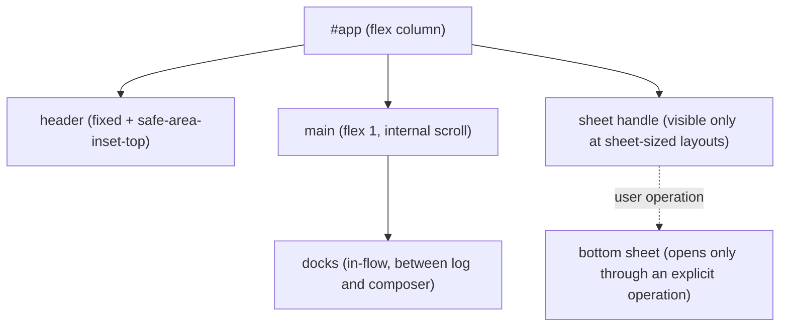

# Responsive layout specification

## Purpose

Defines rules that make the dashboard a sufficiently practical UI at every PC,
tablet, and smartphone size. [design.md](design.md) covers visual design (color,
typography, and motion); this specification covers only the **dimension and
layout-switching rules** layered on top of it.

The exhaustive table of display conditions, reachability paths, and scroll
owners for each element is in
[responsive-reachability.md](responsive-reachability.md).

The dashboard treats PC, tablet, and smartphone sizes equally
([ADR-0052](../adr/0052-responsive-three-tier-layout.md)). That ADR is canonical
for history and rejected alternatives.

## Definition

### Prerequisite CSS value

The response-timeline track is fixed at `22rem` (352px) (ADR-0052 F5). A
variable width (`minmax`) can grow to its upper bound depending on free space,
raising the minimum viewport that permits three columns, so a fixed value is
used. Subsequent boundaries assume this value.

### Breakpoint tokens

Boundary values are not conventional values from a general framework; they are
**derived backward from kaoiro implementation dimensions**. Their breakdown is:

| Element | Value | Source |
|---|---|---|
| Main padding (left/right) | 64px | `2rem` × 2 |
| Grid tile | 240px | Lower bound of `minmax(15rem, 1fr)` |
| Gap between tiles | 19.2px each | `.agents { gap: 1.2rem }` |
| Shell gap (grid ↔ timeline) | 24px | `.grid-with-timeline { gap: 1.5rem }` |
| Response timeline | 352px | Fixed `22rem` (ADR-0052 F5) |

| Token | Condition | Derivation |
|---|---|---|
| `desktop` | `min-width: 1199px` | 64 + (240×3 + 19.2×2) + 24 + 352 = 1198.4 |
| `tablet` | `940px 〜 1198px` | 64 + (240×2 + 19.2) + 24 + 352 = 939.2 |
| `smartphone` | `max-width: 939px` | Range where side-by-side timeline does not fit |
| `short` | `max-height: 500px` | Vertical-compression modifier orthogonal to width (below) |

**The px values above assume `1rem = 16px`.** If a user changes the browser's
default font size, `22rem` / `15rem` / gaps follow it but px breakpoints do not,
so the layout can shift by one column near a boundary. This is an accepted known
constraint; if breakage is observed, move breakpoints to rem notation.

Portrait iPad (768px) and landscape smartphone (844px) both fall within
`smartphone`. With current card dimensions, placing the timeline side by side at
these widths would make tiles 122–160px wide, unable even to secure a 128px
sprite alone, so it does not fit.

### Area-specific layout rules

| Area | desktop | tablet | smartphone |
|---|---|---|---|
| Lobby grid | Depends on role as below | Same | Same |
| Response timeline | Side-by-side right pane | Side-by-side right pane | Bottom sheet |
| AgentDetail status | Left sidebar | Bottom sheet | Bottom sheet |
| In-flow docks / Tasklist float | Unchanged | Same | Same |

Lobby-grid columns depend on role and timeline placement. **Fix columns only
when placing the timeline side by side**; otherwise `auto-fill` is correct.

- Operator with side-by-side timeline: three desktop columns / two tablet columns.
- Operator with timeline sheet (smartphone): `auto-fill`.
- Viewer: full-width `auto-fill` (no timeline).
- Offline grid: always `auto-fill`.

For `auto-fill`, column count normatively follows available width. The operator's
full-width live grid at smartphone sizes fits one to three columns; viewer and
offline grids may have four or more even at desktop widths because they use
`auto-fill`. The exact count at a particular width depends on inline safe-area
insets (for example, three columns at 844px and one at 390px with inset 0).

### `short` override

`short` is orthogonal to width tokens and overrides at every width tier as
**vertical compression**. It **does not change horizontal layout** (side-by-side
timeline/sheet, status placement, or grid columns), because the width tier has
already determined those and the horizontal layout remains viable when short.

| Area | Rule under `short` |
|---|---|
| Header | Reduce vertical padding. |
| Composer | Start at one-line height and expand only on focus. |
| In-flow docks | Set a height cap and scroll internally. Do not change expansion state. |
| Global dialog / drawer | Set `max-block-size` and make itself the vertical scroll owner. |
| Lobby grid / timeline / status / sheet maximum height | Unchanged. |

Keep docks expanded under `short` because the implementation promises to clear
their collapse for every new `request_id` (never hide a pending decision in an
old collapsed state). Changing initial state by viewport would violate both that
promise and ADR-0052 F6, which permits only sheet open/close as responsive
Svelte state.

`LaunchDialog` currently has `position: fixed; top: 50%` with no height cap, so
it is cut off above and below when the viewport is short. The table's rules
include closing this gap.

### Sheet mechanism

Areas displaced at narrow widths use a shared bottom-sheet mechanism. The lobby
timeline and AgentDetail status share it.

The overlay stack is, from front to back, **global dialog / drawer (including
backdrop) > bottom sheet > in-flow docks > page body**. The detailed order
within a layer and ownership of anchor-relative menus are defined by
[responsive-reachability.md](responsive-reachability.md).

Sheet contract:

| Item | Rule |
|---|---|
| Open via | Tap/click handle only. Never open on an agent-side event. |
| Close via | Press handle again / backdrop / `Escape`. |
| Maximum height | 60% of viewport height. |
| Scroll | Exactly one of wrapper and content owns vertical scrolling. Do not scroll background. |
| Focus | Move it into the sheet when opening; return it to the handle when closing. |
| Crossing a breakpoint | Discard open state when moving to a size where it is not a sheet. |
| Handle visibility | Display only at sizes where the relevant area is a sheet. |

### Safe area

Because standalone PWA launch is the primary use, incorporate
`env(safe-area-inset-*)`. Besides header and composer, this includes **bottom
insets for the sheet and handle**, left/right insets in landscape, and
fixed-position drawers/dialogs.

Do **not add** an inset to existing edge spacing; use it as a floor:
`max(<the element's existing edge padding>, env(safe-area-inset-*))`. For main
inline padding, use `max(2rem, env(safe-area-inset-left))`; existing header top
and composer bottom padding are each their own floors. Addition would move main
padding from 64px, breaking the breakpoint calculation and yielding values
outside the spacing scale for other elements. CSS `env()` also requires
`viewport-fit=cover` in `index.html`'s viewport meta (currently unset). Inset is
0 in a browser tab, so the same CSS supports both.

## Constraints

- **MUST**: DOM structure is common at all sizes. **MUST NOT** mount elements
  differently by size, because remounting on rotation loses in-progress composer
  text and log scroll position (ADR-0052 F6).
- **MUST**: Switch layout with CSS media queries. The only Svelte state is sheet
  open/close.
- **MUST**: All functionality and information are reachable from all sizes. The
  exhaustive table is [responsive-reachability.md](responsive-reachability.md).
- **MUST**: On smartphones, viewing, sending instructions, and approving
  permission are possible. Composer and send remain reachable with a software
  keyboard visible.
- **MUST**: A bottom sheet opens only through an explicit user operation.
- **MUST**: While a sheet is open, show the existence of pending permissions /
  questions and the count of other agents needing attention.
- **MUST**: While a sheet is open, the attention badge on its handle itself
  returns to the list. ADR-0012 F8 decides the blind-spot indicator's click
  operation, so drawing attention alone is insufficient.
- **MAY**: Add effects to the above indicators (animation / notification sound).
- **MUST**: Header, composer, sheet, handle, and fixed dialog/drawer treat
  `env(safe-area-inset-*)` as a floor.
- **MUST**: Follow the override table above under `short`.
- **MUST NOT**: Add or change screen-transition or navigation structure.
  Opening/closing within the same screen, such as tabs, accordions, and bottom
  sheets, does not count.
- **MUST NOT**: Change the design tokens established by design.md (nine state
  colors / typography / spacing scale).

## Open Questions

None.

## See Also

- Related specs: [design](design.md),
  [responsive-reachability](responsive-reachability.md),
  [protocol](protocol.md)
- ADRs: [0052-responsive-three-tier-layout](../adr/0052-responsive-three-tier-layout.md),
  [0012-response-display-and-dashboard-scope](../adr/0012-response-display-and-dashboard-scope.md)
- Implementation plan: [phase-31-responsive-ui](../plans/phase-31-responsive-ui.md)
