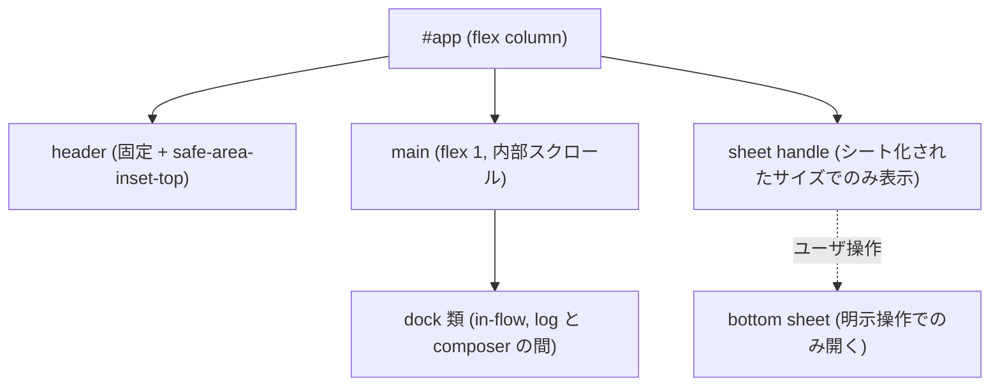

# レスポンシブレイアウト仕様

## Purpose

dashboard を PC / tablet / smartphone のどの画面サイズでも実用に足る UI と
して成立させるための規則を定める。[design.md](design.md) が扱うのは視覚
デザイン (色・タイポグラフィ・モーション) であり、本仕様はその上に載る
**寸法とレイアウトの切り替え規則**のみを扱う。

要素ごとの表示条件・到達経路・スクロール所有者の網羅表は
[responsive-reachability.md](responsive-reachability.md) が持つ。

dashboard は PC / tablet / smartphone の 3 サイズを対等に扱う
([ADR-0052](../adr/0052-responsive-three-tier-layout.md))。経緯と
却下した代替案は同 ADR が canonical。

## Definition

### 前提となる CSS 値

response timeline track は `22rem` (352px) 固定である(ADR-0052 F5)。
可変幅(`minmax`)では余白次第で上限まで伸び、3 列が成立する viewport
下限を押し上げてしまうため、固定値を採る。以降の境界値はこの値を
前提とする。

### Breakpoint トークン

境界値は一般的なフレームワークの慣習値ではなく、**kaoiro の実装寸法から
逆算**して定める。内訳は次のとおり。

| 要素 | 値 | 由来 |
|---|---|---|
| 本体 padding (左右) | 64px | `2rem` × 2 |
| grid tile | 240px | `minmax(15rem, 1fr)` の下限 |
| tile 間 gap | 19.2px / 本 | `.agents { gap: 1.2rem }` |
| shell gap (grid ↔ timeline) | 24px | `.grid-with-timeline { gap: 1.5rem }` |
| response timeline | 352px | `22rem` 固定(ADR-0052 F5) |

| トークン | 条件 | 導出 |
|---|---|---|
| `desktop` | `min-width: 1199px` | 64 + (240×3 + 19.2×2) + 24 + 352 = 1198.4 |
| `tablet` | `940px 〜 1198px` | 64 + (240×2 + 19.2) + 24 + 352 = 939.2 |
| `smartphone` | `max-width: 939px` | timeline 横並びが成立しない領域 |
| `short` | `max-height: 500px` | 幅と直交する縦圧縮の修飾子 (下記) |

**上記 px 値は `1rem = 16px` を前提とする。** ユーザがブラウザの既定
フォントサイズを変更すると `22rem` / `15rem` / gap は追随するが px の
breakpoint は追随しないため、境界付近で 1 列ぶんずれうる。これは許容する
既知の制約とし、破綻が観測された場合は breakpoint を rem 表記へ移す。

iPad 縦 (768px) とスマートフォン横向き (844px) はいずれも `smartphone` に
入る。現行の card 寸法では、この幅で timeline を横並びにすると tile が
122〜160px となり、sprite 単体の 128px すら確保できないため成立しない。

### 領域別レイアウト規則

| 領域 | desktop | tablet | smartphone |
|---|---|---|---|
| lobby grid | 下記のとおり role 従属 | 同左 | 同左 |
| response timeline | 右ペイン横並び | 右ペイン横並び | ボトムシート |
| AgentDetail status | 左サイドバー | ボトムシート | ボトムシート |
| in-flow の dock 類 / Tasklist float | 変更なし | 同左 | 同左 |

lobby grid の列は role と timeline 配置に従属する。**列を固定するのは
timeline を横並びに置くときだけ**で、それ以外は `auto-fill` が正となる。

- operator かつ timeline 横並び: desktop 3 列 / tablet 2 列
- operator かつ timeline シート (smartphone): `auto-fill`
- viewer: 全幅で `auto-fill` (timeline を持たない)
- offline grid: 常に `auto-fill`

`auto-fill` 時の列数は幅なりに決まるのが normative。smartphone 帯で全幅化
した operator の live grid は 1〜3 列に収まるが、viewer と offline grid は
desktop 幅でも `auto-fill` のため 4 列以上になりうる。特定幅で何列になるかは
inline safe-area inset に左右される (inset 0 の 844px で 3 列、390px で 1 列が
その例)。

### `short` override

`short` は幅トークンと直交し、幅がどの段であっても**縦方向の圧縮**として
上書き適用される。**横方向のレイアウト (timeline の横並び / シート、status の
配置、grid の列数) は変更しない** — 幅の段が既にそれを決めており、低背でも
横は成立するため。

| 領域 | `short` 時の規則 |
|---|---|
| header | 縦 padding を縮退させる |
| composer | 初期は 1 行高とし、フォーカス時のみ拡張する |
| in-flow の dock 類 | 高さ上限を設け内部スクロールさせる。展開状態は変えない |
| global dialog / drawer | `max-block-size` を設け、自身を縦スクロール所有者にする |
| lobby grid / timeline / status / シート最大高 | 変更しない |

dock を `short` でも展開したままにするのは、実装が新しい `request_id` ごとに
折りたたみを解除する契約 (pending な判断を古い折りたたみ状態で隠さない) を
持つため。viewport 依存で初期状態を変えると、この契約と ADR-0052 F6 の
「responsive 由来の Svelte 状態はシート開閉のみ」の双方に反する。

`LaunchDialog` は現状 `position: fixed; top: 50%` で高さ上限を持たないため、
低背では上下が切れる。上表の規則はこれを塞ぐことを含む。

### シート機構

狭幅で退避させた領域は、共通のボトムシート機構に載せる。lobby の timeline と
AgentDetail の status が同一の機構を共有する。

重なり順の骨格は上から **global dialog / drawer (backdrop 含む) > bottom
sheet > in-flow の dock 類 > ページ本体**。層内の詳細順とアンカー相対メニュー
の帰属は [responsive-reachability.md](responsive-reachability.md) が定める。

シートの契約:

| 項目 | 規則 |
|---|---|
| 開く手段 | handle のタップ / クリックのみ。エージェント側イベントでは開かない |
| 閉じる手段 | handle 再押下 / backdrop / `Escape` |
| 最大高 | viewport 高の 60% |
| スクロール | wrapper と content のどちらか一方のみが縦スクロール所有者。背景はスクロールさせない |
| フォーカス | 展開時にシート内へ移し、閉じたら handle へ戻す |
| breakpoint 跨ぎ | シート化されないサイズへ遷移したら open 状態は破棄する |
| handle の可視範囲 | 当該領域がシート化されるサイズでのみ表示する |

### セーフエリア

PWA standalone 起動を主用途とするため、`env(safe-area-inset-*)` を織り込む。
対象はヘッダ・composer に加え、**シートと handle の bottom inset**、
landscape 時の left / right inset、fixed 配置の drawer / dialog を含む。

inset は既存の edge spacing に**加算せず、floor として扱う** —
`max(<その要素の既存 edge padding>, env(safe-area-inset-*))` の形にする。
本体の inline padding なら `max(2rem, env(safe-area-inset-left))`、header の
上端や composer の下端はそれぞれ自身の既存 padding が floor になる。加算する
と本体 padding が 64px から動いて breakpoint の内訳が崩れ、他の要素でも
spacing スケールから外れた値になるため。CSS の `env()` が機能する
前提として `index.html` の viewport meta に `viewport-fit=cover` が必要
(現状は未設定)。ブラウザタブで開いた場合 inset は 0 になるため、同一の CSS で
双方に対応できる。

## Constraints

- DOM 構造は全サイズで共通でなければならない (MUST)。サイズ別に要素を
  マウントし分けてはならない (MUST NOT) — 画面回転時の再マウントで composer
  の入力途中テキストとログのスクロール位置が失われるため (ADR-0052 F6)
- レイアウトの切り替えは CSS media query で行わなければならない (MUST)。
  Svelte の状態として持つのはシートの開閉のみでなければならない (MUST)
- 全サイズから全機能・全情報へ到達可能でなければならない (MUST)。網羅表は
  [responsive-reachability.md](responsive-reachability.md) が持つ
- smartphone でも 確認 / 指示送信 / permission 承認 が可能でなければ
  ならない (MUST)。ソフトウェアキーボード表示中も composer と送信操作へ
  到達できなければならない (MUST)
- ボトムシートはユーザの明示操作でのみ開かなければならない (MUST)
- シート展開中も、pending な permission / question の存在と、他エージェントの
  要対応件数に気づける表示を出さなければならない (MUST)
- シート展開中は、handle 上の attention バッジ自体を「一覧へ戻す」操作と
  しなければならない (MUST) — ADR-0012 F8 が盲点インジケータのクリック操作
  までを決定しているため、気づかせるだけでは足りない
- 上記インジケータの演出 (アニメーション・通知音) は付けてもよい (MAY)
- ヘッダ・composer・シート・handle・fixed dialog / drawer は
  `env(safe-area-inset-*)` を floor として考慮しなければならない (MUST)
- `short` 条件下では上記 override 表に従わなければならない (MUST)
- 画面遷移・ナビゲーション構造を追加変更してはならない (MUST NOT)。タブ・
  アコーディオン・ボトムシート等の同一画面内の開閉はこれに当たらない
- design.md が定めるデザイントークン (状態色 9 色 / タイポグラフィ /
  spacing スケール) を変更してはならない (MUST NOT)

## Open Questions

なし。

## See Also

- Related specs: [design](design.md),
  [responsive-reachability](responsive-reachability.md),
  [protocol](protocol.md)
- ADRs: [0052-responsive-three-tier-layout](../adr/0052-responsive-three-tier-layout.md),
  [0012-response-display-and-dashboard-scope](../adr/0012-response-display-and-dashboard-scope.md)
- 実装計画: [phase-31-responsive-ui](../plans/phase-31-responsive-ui.md)
