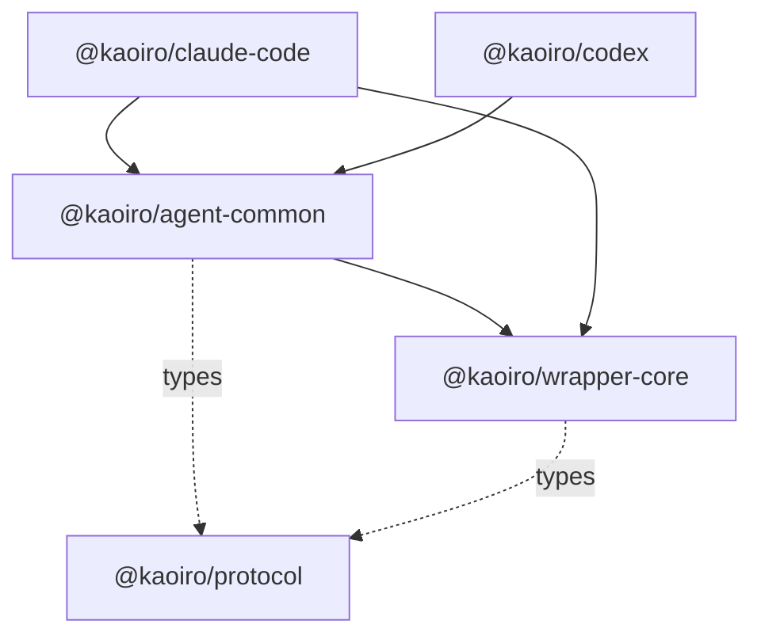

# wrapper — kaoiro ラッパー層 (pnpm 4 パッケージ)

kaoiro のラッパー層(TypeScript)。AI エージェント CLI をホストし、SDK
イベント列から kaoiro の状態を導出して共通エンベロープへ翻訳する。
[ADR-0017](../docs/adr/0017-wrapper-multientity-packages.md) /
[ADR-0032](../docs/adr/0032-codex-adapter.md) F1 に基づき、phase-13 で
次の 4 パッケージに分割された (workspace メンバは repo root の
`pnpm-workspace.yaml` で宣言)。

## パッケージ構成

| パッケージ | ディレクトリ | 役割 |
|---|---|---|
| `@kaoiro/wrapper-core` | `core/` | エンティティ非依存の基盤: サーバ transport (`ServerLink`)、config 読込/検証、CLI 引数解析 |
| `@kaoiro/agent-common` | `agent-common/` | AI エージェント共通層: 状態機械 (`stepState`)・エンベロープ生成、`EngineAdapter` interface、permission / question broker、共通 Tool 記述層 (`ToolDescriptor`) |
| `@kaoiro/claude-code` | `claude-code/` | Claude Code アダプタ (旧 `@kaoiro/wrapper`): `AgentHost` の `query()` 配線、SDK メッセージ → `AdapterEvent` 変換、file upload、inter-agent tools、CLI 本体 |
| `@kaoiro/codex` | `codex/` | Codex アダプタ (phase-14 で実装済み): Codex SDK の thread/turn イベント → `AdapterEvent` 変換、tool host bridge、rollout からの session 復元、model catalog、file upload、CLI 本体 |

依存グラフ (上が下に依存):



仕様: [docs/specs/protocol.md](../docs/specs/protocol.md)、
[docs/specs/agent-sdk-events.md](../docs/specs/agent-sdk-events.md) (Claude)、
[docs/specs/codex-sdk-events.md](../docs/specs/codex-sdk-events.md) (Codex)。

## 開発

```sh
pnpm install    # repo root で (workspace 一括)
cd wrapper
pnpm test       # 4 パッケージへ fan-out (vitest)
pnpm typecheck  # 同上 (tsc --noEmit)
pnpm build      # 依存順に各パッケージの dist/ を生成
```

`wrapper/package.json` は workspace 非メンバの fan-out shim。個別に回す
場合は各パッケージディレクトリで `pnpm test` 等を実行する。

- **typecheck / test は build 不要**: 各パッケージの `tsconfig.json` の
  `paths` と `vitest.config.ts` の alias が隣接パッケージの `src/` を直接
  参照する。
- **runtime は dist**: 各 `package.json` の `main` は `dist/index.js`。
  runner が spawn する実体は `@kaoiro/claude-code/dist/cli.js`
  (`pnpm build` が依存順に生成)。`KAOIRO_WRAPPER_DEV=1` の dev spawn は
  `claude-code/src/cli.ts` を tsx watch で実行する。

`pnpm test` / `pnpm typecheck` は push / PR ごとに Gitea Actions
([.gitea/workflows/ci.yml](../.gitea/workflows/ci.yml))でも実行する
(ダッシュボード `dashboard/` の `check` / `build` も同 CI で回す)。

## 設定(kaoiro.config.json)

ラッパーは設定ファイル(既定 `kaoiro.config.json`)を読み込む。engine
別の例は
[kaoiro.config.claude-code.example.json](kaoiro.config.claude-code.example.json)
と [kaoiro.config.codex.example.json](kaoiro.config.codex.example.json)。
`agent.*.json` / example は従来どおり本ディレクトリ直下に置く(live
config は gitignore 済み)。スキーマと読み込みは `core/src/persona.ts`。

### 共通フィールド

| キー | 必須 | 意味 |
|---|---|---|
| `agent_id` | ✓ | 安定 ID(再起動をまたいで同一)。文字種は `[A-Za-z0-9._-]`、1〜256 文字 |
| `persona` | ✓ | `{ id, name, sprite_set }`。表示名・立ち絵セット |
| `server_url` | ✓ | サーバの wrapper ソケット(例 `ws://localhost:4000/wrapper`)。ADR-0029 F3 で必須(server 集約 SoT + fail-closed) |
| `server_token` | | wrapper 認証トークン。サーバで `KAOIRO_WRAPPER_TOKENS` を設定した時に必要(下記) |
| `permission_timeout_ms` | | ツール許可の無応答 deny までの時間(ms)。**省略時はタイムアウトなし**で operator の決定まで待つ(SDK の `canUseTool` と同じ挙動、[ADR-0022](../docs/adr/0022-pending-permission-authoritative-source.md) F6)。正の整数を与えたときだけ fail-closed deny になる |
| `context_work_budget_percent` | | Claude の SDK context window に対する soft 作業予算の割合。`0 < 値 <= 100` の有限数、既定 `60`。wrapper は各 reading の `maxTokens` から token 分母を導出し、`ext.context_budget` と context 通知へ生窓比と併記する(issue #254)。runner 経由では `runner.config.json` の同名 top-level field から渡る |

### engine × config field 対応

engine が違えば効く config field も違う。「無視」欄は
[phase-15 D3](../docs/plans/phase-15-wrapper-ux-parity.md) の loud warn
対象で、起動時 stderr に `config warn: <field> is <engine>-only, ignored
on <other>` を 1 行出す。

| キー | claude-code | codex | 意味 |
|---|---|---|---|
| `model` | ✓(catalog 値) | 起動時未指定推奨 | 起動時 model pick。Codex は ChatGPT-plan で account default 委任のため空推奨([codex/src/catalog.ts](codex/src/catalog.ts)) |
| `effort` | 現状 UI 未露出 | ✓(catalog 値) | 起動時 effort pick。閉じ列挙は engine catalog 側 |
| `permission_mode` | ✓(6 値、[ADR-0033 F4 追補](../docs/adr/0033-permission-model-dual-axis.md)) | 無視(stderr warn) | 起動時 mode。Codex は launch-fixed(ADR-0033 F3) |
| `allowed_tools` | ✓ | 無視(stderr warn) | ツール ceiling(ローカル天井、サーバから拡張不可)。省略=読み取り専用 |
| `sandbox` | 無視(stderr warn) | ✓(3 値) | OS sandbox 軸(ADR-0033 F3)。閉じ列挙:`read-only` / `workspace-write` / `danger-full-access` |
| `network_access` | 無視(stderr warn) | ✓(bool) | `workspace-write` 内でネットワーク許可するか。既定 `false` |

### env による default

engine 別 env の解決順は `launch > env > config > default`
([ADR-0032 F4bc 追補](../docs/adr/0032-codex-adapter.md))。値そのものが
env 経由で流れるのは model のみ。

| 環境変数 | claude-code | codex | 意味 |
|---|---|---|---|
| `KAOIRO_CLAUDE_CODE_DEFAULT_MODEL` | ✓ | 無視 | Claude CLI の起動時既定 model |
| `KAOIRO_CODEX_DEFAULT_MODEL` | 無視 | ✓ | Codex CLI の起動時既定 model |
| `KAOIRO_WRAPPER_DEFAULT_MODEL` | ✓(deprecation warn) | 完全無視 | 旧 env。次リリース窓で撤去([issue #100](https://github.com/sakuraiyuta/kaoiro/issues/100)) |
| `KAOIRO_WRAPPER_PERMISSION_TIMEOUT_MS` | ✓ | ✓ | 共通:ツール許可 timeout の override |

## 手動起動

```sh
pnpm build                          # 各パッケージの dist/ を生成
pnpm demo                           # カレントの agent.*.json を全て並列 spawn
# または明示的に(単一 wrapper 起動):
node claude-code/dist/cli.js [configPath] [prompt]
```

wrapper は常駐モードで動作する。起動後、server の join に成功すると
`persona_prompt` push を待って SDK セッションを開き、以降はダッシュボード
からの指示・承認要求を仲介する。10 秒以内に `persona_prompt` を受信できない
場合は fail-closed でプロセスを異常終了させる(ADR-0029 F3)。`prompt` 引数
省略時は idle で起動し最初の指示を待つ。手動起動よりも実運用では
[runner](../runner/README.md) から spawn する経路(ADR-0023)を推奨する。

### 認証(運用時)

サーバでトークンを設定した場合:

- **ラッパー**: `server_token` を設定し、サーバ側 `KAOIRO_WRAPPER_TOKENS` の
  `agent_id:token` と一致させる。サーバ側未設定時の挙動は `MIX_ENV` 依存で、
  `:dev` / `:test` はラッパー認証が無効(トークン不要)、**`:prod` は
  fail-closed**(ただし runner の spawn 経路が注入するサーバ署名トークンは
  通るため、runner 一本化の配備ならペア登録は不要 — issue #133)。
- **ダッシュボード(クライアント)**: `KAOIRO_CLIENT_TOKENS` 未設定だと
  トークン認証は成立しない(fail-closed、issue #28)。トークンを設定する
  場合は `http://localhost:4000/?token=<token>` で開く。トークンを使わない
  運用は OAuth ログイン([ADR-0042](../docs/adr/0042-oauth-allowlist-login.md))
  が代替経路。手順は [server/README.md](../server/README.md) を参照。
