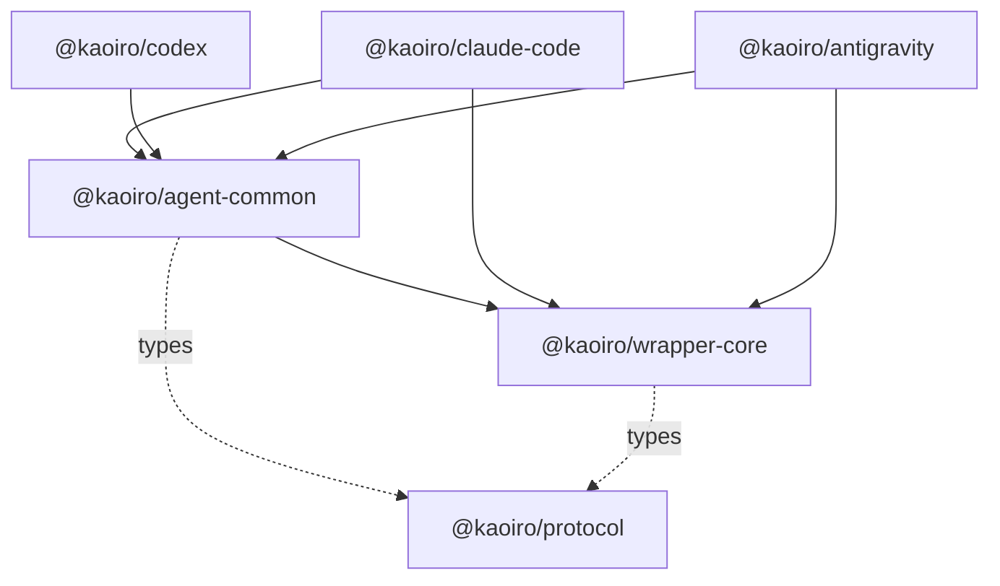

# Wrapper — kaoiro agent adapters (five pnpm packages)

The TypeScript wrapper packages host agent CLIs, derive kaoiro state from
engine events, and translate them into the common envelope. The workspace
contains five packages ([ADR-0017](../docs/adr/0017-wrapper-multientity-packages.md),
[ADR-0032](../docs/adr/0032-codex-adapter.md), [ADR-0057](../docs/adr/0057-antigravity-adapter.md)).

## Packages

| Package | Directory | Role |
|---|---|---|
| `@kaoiro/wrapper-core` | `core/` | Engine-independent foundation: server transport (`ServerLink`), config loading and validation, and CLI argument parsing |
| `@kaoiro/agent-common` | `agent-common/` | Shared state machine (`stepState`), envelope creation, `EngineAdapter`, permission and question brokers, and tool descriptors |
| `@kaoiro/claude-code` | `claude-code/` | Claude Code adapter: SDK event mapping, file uploads, inter-agent tools, and CLI |
| `@kaoiro/codex` | `codex/` | Codex adapter: thread and turn event mapping, tool host bridge, session restore, model catalog, file uploads, and CLI |
| `@kaoiro/antigravity` | `antigravity/` | Antigravity adapter: CLI event mapping, tool bridge, and CLI |

Dependency graph (arrows point to dependencies):


```mermaid
graph TD
  CC["@kaoiro/claude-code"] --> AC["@kaoiro/agent-common"]
  CX["@kaoiro/codex"] --> AC
  AG["@kaoiro/antigravity"] --> AC
  AC --> CORE["@kaoiro/wrapper-core"]
  CC --> CORE
  AG --> CORE
  AC -. types .-> P["@kaoiro/protocol"]
  CORE -. types .-> P
```

See the [envelope contract](../docs/reference/protocol/envelope.md#envelope-v0),
[Claude events](../docs/reference/engines/claude-events.md), and
[Codex exec events](../docs/reference/engines/codex-exec-events.md).

## Development

```sh
pnpm install    # from the repository root
cd wrapper
pnpm test       # runs all five packages (vitest)
pnpm typecheck  # runs all five packages (tsc --noEmit)
pnpm build      # builds dist/ in dependency order
```

`wrapper/package.json` is a fan-out shim outside the workspace. Run a command
for one package from that package's directory.

- **Typecheck and tests do not require a build**: package TypeScript paths
  and Vitest aliases point to sibling `src/` directories.
- **Runtime uses `dist/`**: package entry points use built files. The runner
  spawns `@kaoiro/claude-code/dist/cli.js`; with `KAOIRO_WRAPPER_DEV=1`, it
  runs `claude-code/src/cli.ts` through `tsx watch`.

GitHub Actions runs `pnpm install`, `pnpm typecheck`, `pnpm build`, and
`pnpm test` ([workflow](../.github/workflows/ci.yml)).

## 設定(kaoiro.config.json)

ラッパーは設定ファイル(既定 `kaoiro.config.json`)を読み込む。engine
別の例は
[kaoiro.config.claude-code.example.json](kaoiro.config.claude-code.example.json)
と [kaoiro.config.codex.example.json](kaoiro.config.codex.example.json)。
`agent.*.json` / example は従来どおり本ディレクトリ直下に置く(live
config は gitignore 済み)。スキーマと読み込みは `core/src/persona.ts`。

### 共通フィールド

| キー | 必須 | 意味 |
|---|---|---|
| `agent_id` | ✓ | 安定 ID(再起動をまたいで同一)。文字種は `[A-Za-z0-9._-]`、1〜256 文字 |
| `persona` | ✓ | `{ id, name, sprite_set }`。表示名・立ち絵セット |
| `server_url` | ✓ | サーバの wrapper ソケット(例 `ws://localhost:4000/wrapper`)。ADR-0029 F3 で必須(server 集約 SoT + fail-closed) |
| `server_token` | | wrapper 認証トークン。サーバで `KAOIRO_WRAPPER_TOKENS` を設定した時に必要(下記) |
| `permission_timeout_ms` | | ツール許可の無応答 deny までの時間(ms)。**省略時はタイムアウトなし**で operator の決定まで待つ(SDK の `canUseTool` と同じ挙動、[ADR-0022](../docs/adr/0022-pending-permission-authoritative-source.md) F6)。正の整数を与えたときだけ fail-closed deny になる |
| `context_work_budget_percent` | | Claude の SDK context window に対する soft 作業予算の割合。`0 < 値 <= 100` の有限数、既定 `60`。wrapper は各 reading の `maxTokens` から token 分母を導出し、`ext.context_budget` と context 通知へ生窓比と併記する(issue #254)。runner 経由では `runner.config.json` の同名 top-level field から渡る |

### engine × config field 対応

engine が違えば効く config field も違う。「無視」欄は
[phase-15 D3](../docs/plans/phase-15-wrapper-ux-parity.md) の loud warn
対象で、起動時 stderr に `config warn: <field> is <engine>-only, ignored
on <other>` を 1 行出す。

| キー | claude-code | codex | 意味 |
|---|---|---|---|
| `model` | ✓(catalog 値) | 起動時未指定推奨 | 起動時 model pick。Codex は ChatGPT-plan で account default 委任のため空推奨([codex/src/catalog.ts](codex/src/catalog.ts)) |
| `effort` | 現状 UI 未露出 | ✓(catalog 値) | 起動時 effort pick。閉じ列挙は engine catalog 側 |
| `permission_mode` | ✓(6 値、[ADR-0033 F4 追補](../docs/adr/0033-permission-model-dual-axis.md)) | 無視(stderr warn) | 起動時 mode。Codex は launch-fixed(ADR-0033 F3) |
| `allowed_tools` | ✓ | 無視(stderr warn) | ツール ceiling(ローカル天井、サーバから拡張不可)。省略=読み取り専用 |
| `sandbox` | 無視(stderr warn) | ✓(3 値) | OS sandbox 軸(ADR-0033 F3)。閉じ列挙:`read-only` / `workspace-write` / `danger-full-access` |
| `network_access` | 無視(stderr warn) | ✓(bool) | `workspace-write` 内でネットワーク許可するか。既定 `false` |

### env による default

engine 別 env の解決順は `launch > env > config > default`
([ADR-0032 F4bc 追補](../docs/adr/0032-codex-adapter.md))。値そのものが
env 経由で流れるのは model のみ。

| 環境変数 | claude-code | codex | 意味 |
|---|---|---|---|
| `KAOIRO_CLAUDE_CODE_DEFAULT_MODEL` | ✓ | 無視 | Claude CLI の起動時既定 model |
| `KAOIRO_CODEX_DEFAULT_MODEL` | 無視 | ✓ | Codex CLI の起動時既定 model |
| `KAOIRO_WRAPPER_PERMISSION_TIMEOUT_MS` | ✓ | ✓ | 共通:ツール許可 timeout の override |

## 手動起動

```sh
pnpm build                          # 各パッケージの dist/ を生成
pnpm demo                           # カレントの agent.*.json を全て並列 spawn
# または明示的に(単一 wrapper 起動):
node claude-code/dist/cli.js [configPath] [prompt]
```

wrapper は常駐モードで動作する。起動後、server の join に成功すると
`persona_prompt` push を待って SDK セッションを開き、以降はダッシュボード
からの指示・承認要求を仲介する。10 秒以内に `persona_prompt` を受信できない
場合は fail-closed でプロセスを異常終了させる(ADR-0029 F3)。`prompt` 引数
省略時は idle で起動し最初の指示を待つ。手動起動よりも実運用では
[runner](../runner/README.md) から spawn する経路(ADR-0023)を推奨する。

### 認証(運用時)

サーバでトークンを設定した場合:

- **ラッパー**: `server_token` を設定し、サーバ側 `KAOIRO_WRAPPER_TOKENS` の
  `agent_id:token` と一致させる。サーバ側未設定時の挙動は `MIX_ENV` 依存で、
  `:dev` / `:test` はラッパー認証が無効(トークン不要)、**`:prod` は
  fail-closed**(ただし runner の spawn 経路が注入するサーバ署名トークンは
  通るため、runner 一本化の配備ならペア登録は不要 — issue #133)。
- **ダッシュボード(クライアント)**: `KAOIRO_CLIENT_TOKENS` 未設定だと
  トークン認証は成立しない(fail-closed、issue #28)。トークンを設定する
  場合は `http://localhost:4000/?token=<token>` で開く。トークンを使わない
  運用は OAuth ログイン([ADR-0042](../docs/adr/0042-oauth-allowlist-login.md))
  が代替経路。手順は [server/README.md](../server/README.md) を参照。
